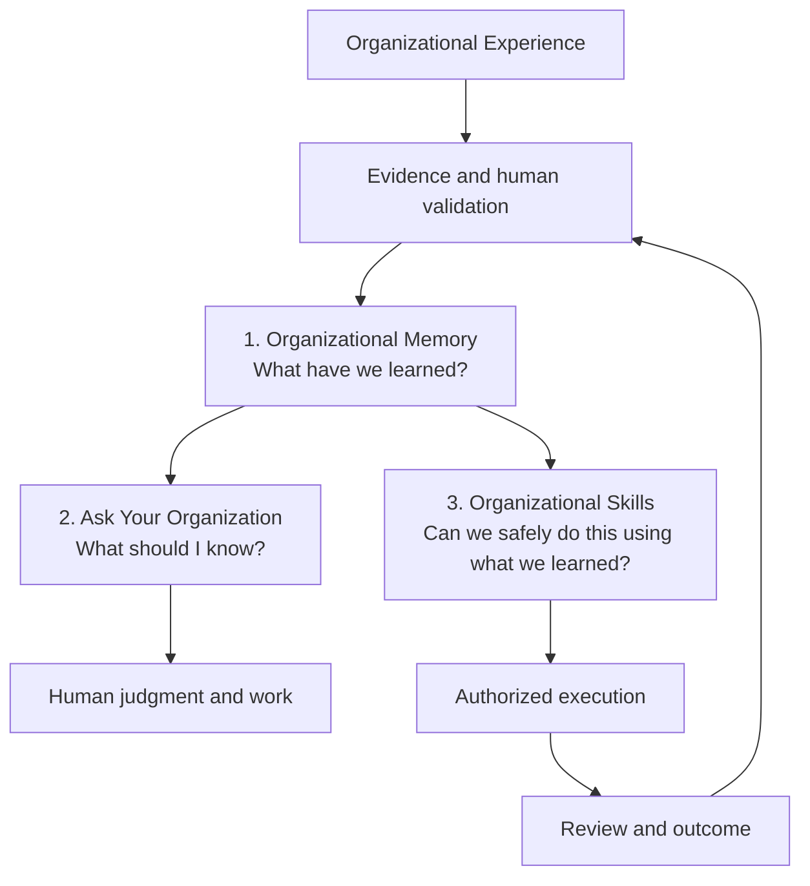
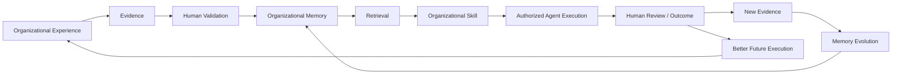

# Multi-Department Organizational Memory and Organizational Skills

## Documentation Status

Status: **Active future-direction document**

Capability language in this document is explicit:

| Label | Meaning in this document |
| --- | --- |
| `CURRENT_IMPLEMENTED` | Supported by the bounded running product and the current implementation baseline. |
| `CURRENT_DESIGNED` | Defined by the current product or logical architecture, but not delivered as a complete general capability. |
| `PLANNED` | A near- or medium-term expansion that requires additional evidence, product work, and governance readiness. |
| `NORTH_STAR` | A long-term direction. It must not be described as generally available. |

Support remains the proven beachhead. The MD-001 implementation now adds bounded Domain-aware Memory, Ask, governed Organizational Skills, and immutable execution-package handoff. External execution remains outside OIP, and broad autonomous agent execution remains a North-Star capability.

## Derived From

### Canon and product sources

- [Canon README](../canon/README.md)
- [Product Vision](../canon/01_PRODUCT_VISION.md)
- [Product Capability Model](../canon/03_PRODUCT_CAPABILITY_MODEL.md)
- [Product Domain Model](../canon/04_PRODUCT_DOMAIN_MODEL.md)
- [Product Workflow Model](../canon/05_PRODUCT_WORKFLOW_MODEL.md)
- [AI Cognitive Model](../canon/06_AI_COGNITIVE_MODEL.md)
- [Product Philosophy](./00_PRODUCT_PHILOSOPHY.md)
- [Product Strategy](./01_PRODUCT_STRATEGY.md)
- [Product Requirements](./02_PRODUCT_REQUIREMENTS.md)
- [MVP Features](./09_MVP_FEATURES.md)

### Architecture, implementation, and roadmap sources

- [Architecture Baseline](../ARCHITECTURE_BASELINE.md)
- [Known Limitations](../KNOWN_LIMITATIONS.md)
- [AI Agent Architecture](../architecture/08_AI_AGENT_ARCHITECTURE.md)
- [Knowledge Representation Model](../architecture/10_KNOWLEDGE_REPRESENTATION_MODEL.md)
- [Integration Architecture](../architecture/11_INTEGRATION_ARCHITECTURE.md)
- [API Architecture](../implementation/15_API_ARCHITECTURE.md)
- [Storage Architecture](../implementation/16_STORAGE_ARCHITECTURE.md)
- [Multi-Department Roadmap](../roadmap/09_MULTI_DEPARTMENT.md)
- [AI Cognitive Evolution Roadmap](../roadmap/11_AI_COGNITIVE_EVOLUTION.md)
- [Organizational Intelligence Roadmap](../roadmap/17_ORGANIZATIONAL_INTELLIGENCE.md)
- [Long-Term Vision](../strategy/09_LONG_TERM_VISION.md)

Canon Version reviewed: `v1.0.2`

This is a Product-layer direction document, not a new Canon document, database schema, API contract, or implementation mandate. It extends existing product language and keeps the Canon's distinctions among Source, Evidence, Validation, Organizational Memory, Confidence, Governance, and Human Review intact.

## Primary Question

How can OIP expand from its Customer Support proving ground into a governed, multi-department system of record for what an organization has learned, and eventually make that learning safely usable for people and authorized AI agents?

## 1. Strategic Intent

OIP is the governed system of record for what an organization has learned.

That statement does not mean that OIP stores everything the organization has said, replaces operational systems, or automatically knows what is true. It means that OIP preserves the learning that has earned organizational trust: what happened, what Evidence supports the interpretation, who validated it, where it applies, how it performed when reused, what challenged it, and how it changed.

The durable progression is:

```text
Experience
  → Evidence
  → Human Validation
  → Organizational Memory
  → Retrieval and reuse
  → Outcome
  → Memory evolution
```

The long-term product direction adds a second progression:

```text
Organizational Memory
  → Organizational Skill
  → Governed execution
  → Human review
  → New Evidence
```

The second progression is an extension of the first. It does not move the center of the product from organizational learning to an AI agent.

### Why Customer Support is the beachhead, not the boundary

Customer Support is the current proving ground because it has:

- repeated problems and high case volume;
- strong evidence trails in conversations, cases, and resolutions;
- existing human review and escalation practices;
- measurable reuse, response, resolution, and onboarding outcomes;
- a visible cost when expertise remains trapped in individual memory.

Support is therefore the fastest place to prove that work can become validated Memory and that Memory can improve later work. It is not the permanent product category. The same organizational learning problem appears wherever people repeatedly answer questions, interpret policy, diagnose incidents, perform procedures, or make decisions under uncertainty.

The product must not become support-only by accident. A Support ticket is one expression of a broader Case or Work Signal. The platform's durable concepts must remain meaningful when the work is an IT incident, Finance exception, HR policy case, Legal matter, Operations failure, Engineering decision, or Sales pattern.

## 2. The Employee-Continuity Problem

Organizations lose capability when experienced employees leave. The loss is not limited to a document or a job title. It includes pattern recognition, exceptions, rationale, judgment, and the memory of what failed before.

A senior Nusa Cloud accountant may have learned over years:

- how Nusa Cloud performs monthly close;
- how monthly financial reports are prepared and structured;
- which accounts require reconciliation;
- which month-end exceptions recur;
- how management expects reports to be presented;
- which spreadsheet mistakes are common;
- why particular adjustments are made;
- which exceptions require approval;
- what failed previously and what correction worked.

That learning may be distributed across spreadsheets, accounting systems, email, SOPs, conversations, prior reports, personal notes, and the accountant's experience. When the accountant leaves, the next employee often inherits the files but not the reasoning that makes the files useful.

OIP's long-term goal is institutional continuity: the new employee inherits the organization's accumulated learning rather than starting from zero.

This does not mean that raw documents, personal habits, or a previous employee's unreviewed preference become trusted Memory automatically. It means that the organization can preserve the supported, scoped, and human-validated learning that should survive the employee who first carried it.

> **Inherited Context, Not Confusion.**

The phrase describes the desired employee experience. A new employee should receive the organization's relevant context, evidence, exceptions, and history—not an undifferentiated archive or a confident answer with no accountable basis.

## 3. The Three Product Layers

The long-term product can be understood as three related but distinct layers. They should not be collapsed into “a chatbot” or “an agent platform.”



### Layer 1 — Organizational Memory

Question: **What have we learned?**

Organizational Memory is OIP's durable core and its potential long-term differentiation. It is evidence-backed, governed, scoped, permission-aware, and capable of evolution.

A Memory such as **Monthly Financial Reporting at Nusa Cloud** may preserve:

- a validated month-end procedure;
- reconciliation lessons and known exceptions;
- reporting preferences and management context;
- supporting Evidence and original Sources;
- the validating person or Role;
- the applicable Domain and Scope;
- reliability and reuse outcomes;
- revisions, Challenges, and version history.

Memory is independent of any particular LLM, agent harness, connector, or interface. A model may help interpret or retrieve it, but the model does not own it or grant it authority.

`CURRENT_IMPLEMENTED`: the bounded product has organization-scoped Support learning plus Domain-aware Source/Evidence intake, governed validation and Memory changes, inspectable provenance, permission-aware retrieval, Ask source routing, and challenge/version history. MD-001 also implements governed Skill versions and immutable redacted execution-package handoff. These foundations do not imply unlimited enterprise ingestion or universal cross-department Memory.

### Layer 2 — Ask Your Organization

Question: **What should I know?**

Ask Your Organization is a natural-language access and reasoning layer over governed organizational context. It helps employees and authorized consumers ask questions such as:

- “I am new to Finance. What should I know before preparing the monthly report?”
- “Have we experienced this reconciliation mismatch before?”
- “Why does Nusa Cloud perform this reconciliation?”
- “What happened the last time this process failed?”

The layer should route each question to the appropriate source of truth. A current bank balance belongs to an authorized finance system; the reason the organization reconciles an account in a particular way belongs to validated Organizational Memory; some questions require both.

The interface is not the moat. It is an access layer. OIP must not be positioned as merely an enterprise chatbot or as “AI that knows your company.” The durable value is the governed Memory behind the access layer.

`CURRENT_IMPLEMENTED`: Ask provides bounded source-of-truth routing and permission-aware Memory retrieval across authorized Domains. Current company data remains a typed provider boundary with a safe unavailable state because no provider is implemented in MD-001. Broader integrations and richer combined answers remain planned.

### Layer 3 — Executable Organizational Skills

Question: **Can the organization safely do this using what it has learned?**

When Organizational Memory is sufficiently mature, a validated body of learning may support a governed Organizational Skill. MD-001 implements the bounded contract, lifecycle, Memory links, deterministic composition, and package snapshot boundary. Examples include:

- Monthly Financial Reporting;
- Spreadsheet Reconciliation;
- Management Report Writing;
- Vendor Reconciliation;
- Month-End Close Review.

An Organizational Skill is not an AI persona and is not simply a reusable prompt. It is a governed executable capability grounded in the organization's learned context. It may be consumed by a human workflow, an OIP-native execution service, or an authorized external agent harness.

`CURRENT_IMPLEMENTED`: validated Skill versions may be discovered, composed, and prepared as immutable packages subject to Domain policy and human review. OIP does not execute external tools in this release; broad autonomous cross-department work remains `NORTH_STAR`.

## 4. The Nusa Cloud Accountant Example

Consider a new accountant joining Nusa Cloud.

They ask:

> “How does Nusa Cloud prepare its monthly financial report?”

OIP should eventually return relevant organizational context rather than a generic accounting tutorial. The response may include:

- the validated monthly reporting procedure;
- the Scope in which that procedure applies;
- prior reconciliation exceptions;
- the Evidence supporting the procedure;
- the person or Role that validated it;
- what happened when the procedure was reused;
- open Challenges, stale conditions, or required approvals;
- links to the current financial systems or documents where the answer depends on current data.

The accountant can then ask:

- “Why do we reconcile this account this way?”
- “Have we encountered this bank reconciliation mismatch before?”
- “What problems normally happen during month-end close?”

The result should provide **how this organization has learned to perform the work**, not generic advice presented as Nusa Cloud policy.

If the accountant corrects an important part of the guidance, that correction is not merely a local edit. It may be Evidence that:

- reinforces existing Memory;
- challenges existing Memory;
- creates a new lesson;
- creates a new version;
- narrows or changes Scope;
- remains unresolved pending review.

The correction must not silently rewrite trusted Memory merely because an employee or agent produced a different answer. The organization decides what the correction means and whether it passes the appropriate Validation path.

## 5. Company Data Intelligence and Organizational Memory

Multi-department usefulness depends on keeping two kinds of intelligence distinct.

| Layer | Question | Typical examples | Authority comes from |
| --- | --- | --- | --- |
| **Company Data Intelligence** | What is true right now? | Current bank balance, this month's revenue, outstanding invoices, payroll amount, headcount, inventory. | Authorized operational systems of record such as ERP, accounting software, HRIS, CRM, databases, spreadsheets, or finance systems. |
| **Organizational Memory** | What have we learned from previous experience? | Why a reconciliation is performed a certain way, what caused a prior failure, which correction worked, what exception was approved, what management learned from a reporting error. | Evidence, human validation, authority, scope, provenance, and governed organizational learning. |

Storage is not Memory. Retrieval is not truth. AI confidence is not validation. A current system record can be authoritative for a present value without explaining the organization's learned procedure. A validated Memory can explain a procedure without being authoritative for today's balance.

Some work requires combined intelligence. For example:

> “Prepare this month's management report the way Nusa Cloud normally does.”

That request may require:

```text
Current authorized financial data
+ Nusa Cloud Organizational Memory
+ Monthly Financial Reporting Organizational Skill
+ Spreadsheet Analysis capability
+ Business Writing capability
+ Authorized tools or agent harness
+ Accountant review
```

OIP should complement ERP, accounting, HRIS, CRM, and other systems of record. It should not become an ERP, accounting database, HRIS, unrestricted SQL agent, or substitute source for current operational facts merely to support this direction.

## 6. Domain-Neutral Organizational Learning

Support Ticket must not remain the permanent universal unit of organizational learning.

The domain-neutral foundation should support many kinds of organizational experience while preserving the differences that matter in each Domain. The existing concepts remain the architectural direction:

| Domain-neutral concept | Role in expansion |
| --- | --- |
| `OrganizationalSource` | Identifies what happened or was observed, whether it came from a case, incident, document, system record, or human experience. |
| `EvidenceRecord` | Preserves why a claim, decision, or lesson is supported, limited, or challenged. |
| `MemoryEvidenceLink` | Keeps accepted Memory connected to the Evidence that makes it inspectable. |
| `Outcome` / `KnowledgeReuseOutcome` | Records what happened when knowledge or a decision was reused. |
| `Challenge` / `KnowledgeChallenge` | Preserves contradictory Evidence, revalidation, scope changes, and unresolved review. |
| `KnowledgeItem` | Represents reusable organizational knowledge after the appropriate Validation boundary. |

These concepts must not be replaced by independent `FinanceTicket`, `HRTicket`, or `LegalTicket` memory systems. A ticket can remain a Support expression of Case; other Domains can express work through their own Cases, Work Signals, Sources, Evidence, authority, and workflows.

### Cross-department examples

| Domain | Experience → Evidence → judgment → outcome → learning |
| --- | --- |
| Finance | Monthly close → reconciliation/report Evidence → accountant decision and reviewer approval → report outcome → validated lesson or Challenge. |
| IT / ITSM | Incident → diagnosis and root-cause Evidence → remediation → service outcome → reusable Resolution pattern or gap. |
| HR | Employee or policy case → policy interpretation Evidence → authorized decision → employee/process outcome → scoped guidance or unresolved question. |
| Legal | Matter or interpretation → document, precedent, and expert Evidence → legal review → governed guidance or risk decision → tightly scoped Memory. |
| Operations | Process exception → action and operational Evidence → accountable owner decision → operational outcome → revised process lesson. |
| Engineering | Production issue or design decision → telemetry, code, and review Evidence → engineering judgment → deployment outcome → reusable technical lesson. |
| Sales / Management | Deal or decision pattern → customer, commercial, or decision Evidence → accountable review → business outcome → bounded pattern or changed assumption. |

The workflow generalizes, but authority, Evidence standards, sensitivity, consequence, Scope, and review requirements remain Domain-specific. Cross-department Memory is connected but not an undifferentiated pool.

`CURRENT_IMPLEMENTED` for the bounded Finance scenario and generic intake path: adjacent Domains use the shared Source/Evidence/validation boundary with explicit grants. Full domain-specific workflows, ingestion, and provider adapters remain `PLANNED`.

## 7. Organizational Skill — Governed Boundary

An Organizational Skill is a versioned, governed capability contract. The implementation persists the Skill, its immutable versions, linked Memory revisions, lifecycle decisions, and execution history. It is not a general agent runtime.

It is not simply:

- a prompt;
- a plugin;
- an MCP server;
- a script;
- a saved chat;
- a workflow automation;
- an agent persona.

Those may be implementation mechanisms, tool surfaces, or execution inputs. They do not by themselves carry the organization's validated learning, authority, Scope, risk, or review obligations.

An Organizational Skill may reference:

- applicable Organizational Memory and required Evidence;
- Domain, Scope, preconditions, and input requirements;
- required permissions and accountable Roles;
- tools, connectors, or external systems;
- risk classification and consequence;
- human-review and approval requirements;
- Skill version and revocation rules;
- evidence and reliability history;
- prior execution history and outcomes;
- what the Skill may not do.

The exact external execution mechanism remains outside OIP. The MD-001 API and storage contract deliberately do not introduce a plugin protocol, MCP runtime, ERP connector, or autonomous executor.

### Example conceptual Skill: Monthly Financial Reporting

| Concern | Conceptual definition |
| --- | --- |
| Organizational context | Nusa Cloud Monthly Financial Reporting Memory. |
| Inputs | Current ledger and other authorized accounting data. |
| Capabilities | Spreadsheet Analysis plus Business Writing. |
| Tools | Approved spreadsheet and document/reporting tools. |
| Governance | Finance Role required; Scope and data access are explicit. |
| Execution policy | Draft only in the initial mode. |
| Human gate | Accountant review required before circulation or submission. |
| Outcome | Accepted, corrected, rejected, or unresolved. |
| Learning | Corrections and outcomes become Evidence for future Memory evolution through Validation. |

### Skill composition

An authorized user may eventually compose:

```text
Financial Reporting
+ Spreadsheet Analysis
+ Business Writing
```

The composition is meaningful only when each component has a clear responsibility and the combined action preserves the organization's Memory, Evidence, permissions, risk policy, and Human Review boundary. Composition must not become a way to bypass the narrowest or highest-risk constraint of one component.

### Optional execution environments

An Organizational Skill may eventually be supplied to an authorized execution environment such as:

- Codex;
- another agent runtime;
- an MCP-connected system;
- an approved plugin or connector;
- an OIP-native execution service.

These are optional mechanisms, not OIP's identity and not mandatory dependencies. OIP's differentiated role is the governed organizational context: Memory, Evidence, provenance, permission, policy, and capability boundaries. The external harness performs mechanical work only within the authority and tools it has been granted.

## 8. The Memory-to-Execution Learning Loop

The long-term flywheel is:



The loop is not an assertion that every current execution path exists. It is the long-term relationship among work, Memory, Skills, governed execution, outcomes, and learning.

For example, an authorized agent could prepare a Nusa Cloud management report using current financial data, Nusa Cloud Memory, the Monthly Financial Reporting Skill, spreadsheet tooling, and writing capability. The accountant reviews the report. Three material corrections may show that the existing Memory was too broad, that a new exception needs to be captured, or that the Skill's Scope needs to narrow.

The execution environment must record the relevant outcome and preserve provenance. The agent must not silently rewrite Organizational Memory from its own output. New Evidence must enter the existing Candidate → Validation → governed Memory Evolution path.

Possible outcome interpretations include:

- **Reinforcement** — the existing Memory worked within Scope.
- **Correction** — the work exposed a factual, procedural, or communication error.
- **Challenge** — credible Evidence conflicts with the current Memory.
- **New lesson** — the work revealed reusable learning not yet represented.
- **Scope change** — the Memory is valid only for a narrower or different condition.
- **Unresolved** — the organization needs further investigation before changing trust.

Execution creates learning only when the outcome is interpreted and governed. Activity, output volume, or an agent's confidence is not itself organizational learning.

## 9. Human Authority, Permission, and Progressive Autonomy

Human authority remains foundational across all three layers.

AI and automated components may observe, summarize, retrieve, reason, propose, draft, compare, package Evidence, and—when explicitly authorized—execute bounded work. They must not independently declare organizational truth, grant themselves permission, or turn their own output into trusted Memory.

Multi-department expansion must preserve:

- tenant and Organization isolation;
- Role and permission boundaries;
- Domain-specific authority;
- Source and Evidence provenance;
- Validation history and rationale;
- Scope, lifecycle, and version history;
- sensitivity and retention controls;
- auditability and revocation.

### Autonomy Policy Engine alignment

The repository currently defines Governance boundaries, a Governance Agent, a governed action flow, Human Review, approval, execution, reversal, and ledger evidence. It does not currently assign a production design to a component formally named **Autonomy Policy Engine**.

In this document, “Autonomy Policy Engine” names a possible future policy capability that would evaluate whether a particular Skill, user, agent, data set, action, Scope, and risk level may proceed. It is not an implemented component or a new required schema. Any later design must derive from the existing Governance and governed-action responsibilities rather than introduce an alternate authority.

The governing principle is progressive autonomy:

```text
Advisory retrieval
  → Draft with human review
  → Approved low-risk execution
  → Narrowly authorized repeatable execution
```

Greater autonomy requires stronger Evidence, validated Memory, successful reuse, clear Scope, least-privilege permissions, observability, reversal or rollback where possible, and a human-authorized policy decision. Reliability of a Skill does not make the AI the authority over organizational truth.

High-consequence work may require mandatory Human Review regardless of Skill maturity, including:

- financial statements and material financial reporting;
- payroll and sensitive HR actions;
- legal decisions or legal positions;
- large payments or irreversible transactions;
- customer-impacting irreversible actions;
- actions where policy, law, or accountable leadership requires a human decision.

Human authority must remain revocable. A previously permitted Skill or agent can be restricted, suspended, narrowed, or revoked when Evidence, policy, risk, or outcomes change.

## 10. Product Evolution Frame

The product evolution remains capability-gated and evidence-driven.

| Stage | Product question | Status boundary |
| --- | --- | --- |
| Foundation | Can Support work become Evidence-backed, validated Memory that improves future Support work? | `CURRENT_IMPLEMENTED`: bounded Support learning loop and current memory foundation. |
| Multi-Department Memory | Does the same domain-neutral model work in an adjacent Domain without weakening governance? | `CURRENT_IMPLEMENTED`: bounded generic intake and Finance scenario; broader domain workflows remain planned. |
| Ask Your Organization | Can authorized people ask for relevant organizational context while the system routes to the correct source of truth? | `CURRENT_IMPLEMENTED`: Memory routing is available; current-data provider implementation remains planned. |
| Organizational Skills | Can mature, scoped Memory become a governed executable capability? | `CURRENT_IMPLEMENTED`: governed Skill versions, composition, and package preparation; execution remains external. |
| Governed Agent Execution | Can optional external or OIP-native agents use Skills under explicit permission and risk policy? | `NORTH_STAR`: bounded governed actions exist in the foundation, but broad agent execution is future. |
| Learning Organization | Do human and agent outcomes continuously strengthen, challenge, version, or narrow Memory? | `NORTH_STAR`: the long-term compounding organization-wide capability. |

The sequence matters. OIP should not skip from a Support prototype to a universal agent platform. Each expansion must demonstrate evidence that the relevant Memory is useful, the authority model works, permissions are safe, and real outcomes improve future capability.

## 11. Non-Goals and Anti-Scope-Creep Guardrails

This vision does **not** mean OIP should immediately build:

- an ERP;
- an HRIS;
- accounting software;
- generic enterprise search;
- universal RAG;
- an unrestricted SQL agent;
- ingestion of everything from Slack or another collaboration tool;
- every connector;
- an agent marketplace;
- a plugin marketplace;
- an autonomous company;
- fully autonomous financial reporting;
- unrestricted cross-department knowledge access.

The product should reject expansion that creates a parallel source of truth, bypasses Validation, weakens permission boundaries, hides uncertainty, treats an interface as the product, or adds generic workflow functionality without strengthening organizational learning.

Near-term development should prove each expansion progressively:

1. Validate the Support learning loop.
2. Prove one adjacent Domain with its own Evidence, authority, and review requirements.
3. Expand Ask Your Organization only where source routing and permission-aware retrieval are trustworthy.
4. Test Skill concepts on bounded, draft-first work before considering greater autonomy.
5. Treat every execution outcome as evidence to interpret, not as permission to rewrite Memory.

## 12. Positioning Implication

The public explanation can broaden beyond Support without turning the Canon into marketing copy.

The core message is:

> **OIP helps organizations preserve how they learned to work, so new employees and AI agents do not have to start from zero.**

The foundational category statement remains:

> **OIP is the system of record for what the organization has learned.**

The differentiation is governed learning:

- what experience demonstrated;
- which Evidence supports it;
- who validated it;
- where it applies;
- how reliable it has been in reuse;
- what challenged it;
- how it changed;
- when an authorized person or agent may use it.

OIP should not primarily position itself as “AI that knows your company.” That framing collapses current data, documents, retrieval, Memory, and authority into a commodity chatbot promise. OIP is about preserving learned organizational capability and making that capability inspectable and governable.

## 13. Relationship to the Documentation Hierarchy

This document does not replace existing authoritative documents.

| Question | Authoritative home | Relationship to this document |
| --- | --- | --- |
| What OIP means and why it exists | Canon | This document preserves and applies Canon language. |
| What capabilities must exist | [Product Capability Model](../canon/03_PRODUCT_CAPABILITY_MODEL.md) | This document composes Cross-Domain Expansion, Memory, reasoning, Human Review, and Governance into a future product layer. |
| What concepts exist | [Product Domain Model](../canon/04_PRODUCT_DOMAIN_MODEL.md) | This document reuses Case, Domain, Source, Evidence, Knowledge Item, Outcome, Challenge, Role, and Governance Boundary. |
| How work becomes learning | [Product Workflow Model](../canon/05_PRODUCT_WORKFLOW_MODEL.md) | This document extends the same candidate, validation, memory, outcome, and evolution loop. |
| How AI reasons and where it stops | [AI Cognitive Model](../canon/06_AI_COGNITIVE_MODEL.md) | This document keeps AI advisory, human authority, visible uncertainty, and governed action intact. |
| How product scope and sequencing evolve | [Product Strategy](./01_PRODUCT_STRATEGY.md) and [MVP Features](./09_MVP_FEATURES.md) | This document provides a focused future layer; those documents retain overall product and MVP sequencing authority. |
| When expansion is earned | [Multi-Department Roadmap](../roadmap/09_MULTI_DEPARTMENT.md) and related roadmaps | This document does not create milestones or override roadmap gates. |
| How logical agents and integrations work | [AI Agent Architecture](../architecture/08_AI_AGENT_ARCHITECTURE.md) and [Integration Architecture](../architecture/11_INTEGRATION_ARCHITECTURE.md) | This document describes the product role of Skills without defining agent topology, protocols, or connectors. |

The Canon remains unchanged by this document. A future decision to make Organizational Skills a required Canon capability, redefine a core Domain concept, or change the authority boundary would require the Canon Governance process first.

## Closing

Support is where OIP proves the learning system. It is not where the product's meaning ends.

The long-term product is a governed organizational learning layer with three clear relationships:

```text
Organizational Memory — what we learned
Ask Your Organization — what I should know
Organizational Skills — what we may safely do using what we learned
```

The sequence protects the thesis. Experience becomes Evidence. Evidence becomes validated Memory. Memory becomes retrievable context. Mature Memory may support Skills. Authorized execution produces outcomes. Outcomes become new Evidence. Humans and policy govern every trust-changing transition.

OIP should help the next employee and the next authorized agent inherit the organization's accumulated learning—with provenance, scope, challenge history, and human accountability intact.
