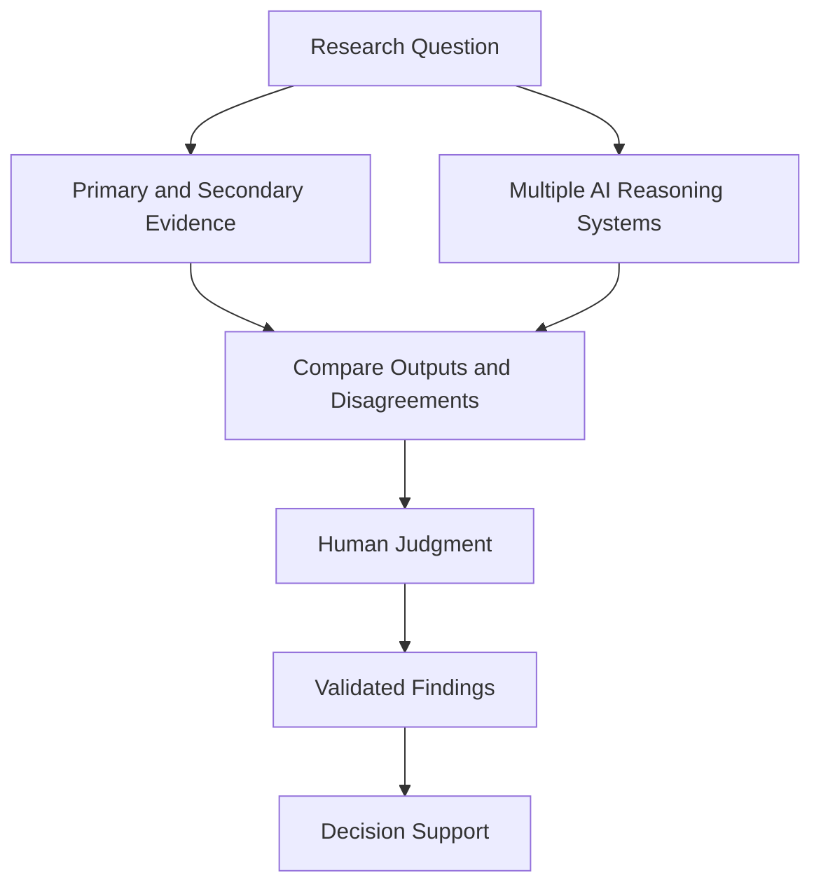
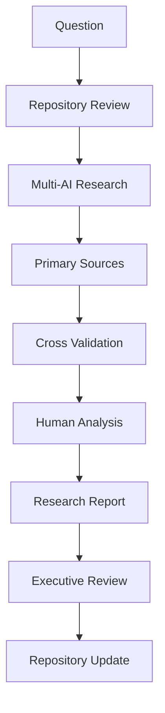
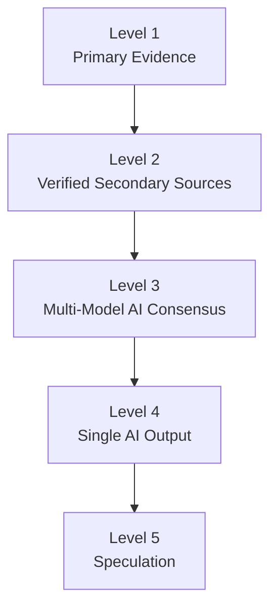
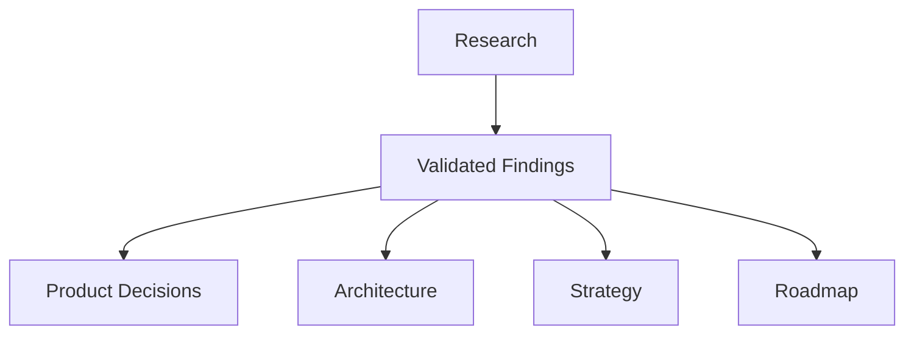

# Research Methodology

## Derived From

- Canon Version: `v1.0.0`
- Architecture Version: `v1.0.0`
- Implementation Version: `v1.0.0`
- Strategy Version: `v1.0.0`

### Primary Canon Documents

- [Founder's Thesis](../canon/00_FOUNDERS_THESIS.md)
- [Product Vision](../canon/01_PRODUCT_VISION.md)
- [Product Principles](../canon/02_PRODUCT_PRINCIPLES.md)
- [Capability Model](../canon/03_PRODUCT_CAPABILITY_MODEL.md)
- [Domain Model](../canon/04_PRODUCT_DOMAIN_MODEL.md)
- [Workflow Model](../canon/05_PRODUCT_WORKFLOW_MODEL.md)
- [AI Cognitive Model](../canon/06_AI_COGNITIVE_MODEL.md)

### Primary Repository Layers

- [Architecture](../architecture/README.md)
- [Implementation](../implementation/README.md)
- [Strategy](../strategy/README.md)

---

Status: **Active**

## Primary Question

How should the company conduct research so that strategic, product, engineering, and business decisions are based on evidence rather than assumptions?

This document defines the Research Methodology.

It is not a market research report. It is not a literature review. It defines the company's research philosophy, standards, workflows, validation process, evidence hierarchy, and AI-assisted research methodology.

## 1. Executive Summary

Evidence-based decision making is a core company value.

The company exists to help organizations transform observations into trusted knowledge through evidence, validation, governance, and continuous learning. Its internal research practice should follow the same philosophy.

Research exists to replace assumptions with validated understanding.

The company should use research to:

- Validate assumptions.
- Discover customer problems.
- Evaluate technologies.
- Assess competitors.
- Understand markets.
- Identify risks.
- Support product decisions.
- Improve strategic thinking.

Research does not eliminate uncertainty. It reduces uncertainty enough for better decisions. The goal is not to create perfect certainty before acting, but to ensure that important decisions are informed by the best available evidence, clearly stated confidence levels, and explicit awareness of limitations.

## 2. Research Philosophy

## Evidence Before Opinion

Opinions can start inquiry, but evidence should guide conclusions.

The company should distinguish what it believes, what it knows, what it has observed, and what still requires validation. Strong opinions are useful only when they remain accountable to evidence.

## Curiosity Before Confirmation

Research should begin with genuine curiosity, not a desire to prove an existing belief.

The best research questions allow the company to discover that its assumptions were incomplete or wrong. Research that only confirms prior opinions weakens decision quality.

## Validate Before Building

Important product, architecture, strategy, and business decisions should be validated before significant investment where practical.

Validation may come from customer interviews, prototypes, experiments, data analysis, expert review, primary documents, or structured multi-source research.

## Multiple Perspectives

No single source, person, AI model, customer, competitor, or report should dominate important conclusions.

The company should seek multiple perspectives across customers, markets, technologies, AI systems, internal experts, and external evidence.

## Continuous Learning

Research is not a one-time activity before building.

The company should continuously learn from customers, product usage, failures, incidents, experiments, market changes, and new evidence. Research should become part of the company's Knowledge Flywheel.

## Transparency

Research should make its assumptions, sources, methods, confidence levels, and limitations explicit.

Transparency allows future readers to understand what was known, how conclusions were reached, and when findings should be revisited.

## Intellectual Honesty

Research should be honest about uncertainty, contradictory evidence, weak signals, and unresolved questions.

The company should prefer an uncomfortable truth over a convenient narrative.

## Research Philosophy Matrix

| Principle | Research Behavior |
| --- | --- |
| Evidence Before Opinion | Conclusions must identify the evidence supporting them. |
| Curiosity Before Confirmation | Research should seek disconfirming evidence and alternative explanations. |
| Validate Before Building | Important decisions should be tested before large commitments. |
| Multiple Perspectives | Findings should be checked across sources, stakeholders, and AI systems. |
| Continuous Learning | Research should continue after product, strategy, or architecture decisions. |
| Transparency | Sources, methods, limitations, and confidence should be visible. |
| Intellectual Honesty | Uncertainty and disagreement should be recorded rather than hidden. |

## 3. AI-Assisted Multi-Source Research

The company's official research methodology is **AI-Assisted Multi-Source Research (AAMR)**.

AI-Assisted Multi-Source Research is a structured research methodology that combines multiple AI reasoning systems with primary evidence and human judgment to improve research quality while reducing individual model bias.

AAMR is based on several commitments:

- No single AI model is considered authoritative.
- AI systems are research collaborators, not final decision-makers.
- Primary evidence is stronger than AI-generated synthesis.
- Multiple AI systems may reveal different interpretations, gaps, and risks.
- Human judgment remains responsible for conclusions.

AI-assisted research can increase speed, breadth, and synthesis quality. It can also introduce hallucinations, false certainty, outdated claims, or hidden assumptions. AAMR exists to benefit from AI while preventing the company from confusing AI fluency with evidence.

## AAMR Core Loop



The purpose of AAMR is not to outsource thinking. It is to improve thinking.

## 4. AI Research Ecosystem

Different AI tools can support different research activities. These roles may evolve as tools change.

| Tool | Research Role |
| --- | --- |
| ChatGPT | Systems thinking, synthesis, software architecture reasoning, long-form reasoning, structured analysis. |
| Claude | Document refinement, long-context reasoning, writing quality, software engineering review, careful prose analysis. |
| Gemini | Multimodal reasoning, large-context analysis, Google ecosystem awareness, cross-format interpretation. |
| Perplexity | Web search, citations, current events, source discovery, quick comparison of public claims. |
| Manus | Autonomous research, long-form reports, deep investigation, multi-step research planning. |
| Codex | Implementation, documentation generation, repository development, local file organization, structured knowledge production. |

## AI Tool Governance

| Rule | Meaning |
| --- | --- |
| No Tool Is Final Authority | AI output requires evidence and human review. |
| Use Tools by Strength | Select tools based on research need rather than habit. |
| Compare Outputs | Differences between tools can reveal uncertainty or hidden assumptions. |
| Preserve Sources | AI synthesis should not replace source records. |
| Update Tool Roles Over Time | Future tools may be added without changing the research philosophy. |

Future tools may be added without changing the methodology. The philosophy is stable: multiple tools, primary evidence, cross-validation, and human responsibility.

## 5. Research Workflow

The official research workflow is:



## Workflow Stages

| Stage | Purpose |
| --- | --- |
| Question | Define the decision, uncertainty, or problem being investigated. |
| Repository Review | Identify existing Canon, Architecture, Implementation, Strategy, Product, or Research context. |
| Multi-AI Research | Use multiple AI systems to explore the question, generate perspectives, identify gaps, and structure inquiry. |
| Primary Sources | Collect the strongest available evidence from customers, data, official documents, standards, regulations, academic work, or direct observation. |
| Cross Validation | Compare findings across sources, AI tools, stakeholders, and contradictory evidence. |
| Human Analysis | Interpret evidence, assign confidence, identify limitations, and form conclusions. |
| Research Report | Document methods, sources, findings, confidence levels, limitations, open questions, and recommendations. |
| Executive Review | Review important findings with appropriate decision-makers. |
| Repository Update | Update relevant documents only when findings are validated and authorized. |

## 6. Evidence Hierarchy

Evidence quality matters. The company should not treat all sources equally.



## Evidence Levels

| Level | Evidence Type | Examples | Decision Use |
| --- | --- | --- | --- |
| Level 1 | Primary Evidence | Customer interviews, production data, company documentation, regulations, standards, academic papers, official documentation. | Strongest support for important decisions. |
| Level 2 | Verified Secondary Sources | Industry reports, analyst reports, reputable publications, expert summaries with clear sources. | Useful when primary evidence is limited or for market context. |
| Level 3 | Multi-Model AI Consensus | Findings independently supported by multiple AI systems and consistent with available evidence. | Useful for synthesis, hypothesis formation, and secondary support. |
| Level 4 | Single AI Output | A claim, interpretation, or idea produced by one AI system. | Useful for exploration only. |
| Level 5 | Speculation | Unsupported guesses, informal opinions, untested assumptions. | Not suitable for strategic decisions. |

Primary evidence should be preferred whenever possible. AI consensus can support inquiry, but it does not replace evidence.

## 7. Confidence Framework

Research documents should assign confidence levels to important findings.

| Confidence Level | Definition | Appropriate Use |
| --- | --- | --- |
| Level A | Verified by primary evidence and multiple AI systems. | Suitable for major strategic, product, or architecture decisions when uncertainty is low. |
| Level B | Supported by multiple AI systems and reputable secondary sources. | Suitable for directional decisions, planning assumptions, and market hypotheses requiring further validation. |
| Level C | Supported by limited evidence. | Suitable for exploratory planning, prototype decisions, or low-risk assumptions. |
| Level D | Hypothesis requiring validation. | Suitable only as an open question, experiment premise, or research backlog item. |

## Confidence Matrix

| Evidence Strength | Source Breadth | Confidence |
| --- | --- | --- |
| Primary evidence + cross-validation | Multiple independent sources and AI systems | Level A |
| Secondary evidence + multi-AI support | Multiple reputable sources | Level B |
| Limited evidence | Few sources or weak validation | Level C |
| Speculation or single AI output | No meaningful validation | Level D |

Confidence should be updated as new evidence emerges. A finding can move up or down the confidence scale over time.

## 8. Cross-Validation Rules

The company should follow these rules for significant research conclusions:

1. Never base major strategic decisions on one AI model.
2. Validate important findings across multiple reasoning systems.
3. Seek contradictory evidence.
4. Record uncertainty explicitly.
5. Prefer primary evidence whenever possible.
6. Distinguish evidence from interpretation.
7. Identify source recency and relevance.
8. Compare AI outputs against source material.
9. Escalate high-impact conclusions for human review.
10. Revisit conclusions when new evidence appears.

## Why AI Disagreement Is Valuable

Disagreement between AI systems is not a failure. It is a research signal.

AI disagreement may reveal:

- Ambiguous questions.
- Weak evidence.
- Hidden assumptions.
- Different interpretations.
- Outdated information.
- Missing context.
- Areas requiring primary research.

When AI systems disagree, researchers should investigate why rather than averaging the answers.

## 9. Research Categories

Research domains help organize inquiry and evidence.

| Research Category | Objective |
| --- | --- |
| Market Research | Understand market size, maturity, timing, buying behavior, and category dynamics. |
| Customer Research | Discover customer problems, workflows, language, pain, willingness to adopt, and success criteria. |
| Competitor Research | Understand adjacent categories, positioning, capabilities, risks, and differentiation. |
| Technology Research | Evaluate technical approaches, trade-offs, feasibility, risks, and standards. |
| AI Research | Understand AI capabilities, limitations, model behavior, evaluation methods, safety, and governance. |
| Regulatory Research | Identify laws, policies, standards, privacy rules, compliance expectations, and regional constraints. |
| UX Research | Understand user behavior, comprehension, workflow friction, trust, and product usability. |
| Product Research | Validate product direction, feature assumptions, use cases, and adoption patterns. |
| Economic Research | Analyze pricing, ROI, business model assumptions, purchasing power, and value capture. |
| Industry Research | Understand domain-specific workflows, terminology, regulations, buyers, and knowledge patterns. |

Research categories may overlap. A strong research project should identify its primary category and any secondary categories.

## 10. Research Quality Standards

Every research document should include:

| Required Element | Purpose |
| --- | --- |
| Research Question | Defines the uncertainty being investigated. |
| Scope | Clarifies what is included and excluded. |
| Methodology | Explains how research was conducted. |
| Sources | Lists primary, secondary, and AI-assisted sources used. |
| Findings | States what the research discovered. |
| Confidence Level | Assigns confidence to important claims. |
| Limitations | Explains weaknesses, gaps, and constraints. |
| Open Questions | Identifies what remains unknown. |
| Recommendations | Connects findings to possible decisions or next steps. |

## Research Document Template

```text
# Research Title

## Research Question

## Scope

## Methodology

## Sources

## Findings

## Confidence Level

## Limitations

## Open Questions

## Recommendations
```

Research documents should be useful to future readers who were not present when the research was conducted.

## 11. Bias Awareness

Research quality depends on recognizing bias.

| Bias | Description | Mitigation |
| --- | --- | --- |
| Confirmation Bias | Favoring evidence that supports existing beliefs. | Seek disconfirming evidence and alternative explanations. |
| Availability Bias | Overweighting information that is easy to recall or recently encountered. | Use structured source review and multiple evidence types. |
| Recency Bias | Overvaluing recent information because it is new. | Compare recent findings with historical evidence and durable trends. |
| Authority Bias | Accepting claims because they come from a perceived authority. | Verify claims against primary evidence and multiple sources. |
| AI Hallucinations | AI systems produce plausible but false statements. | Require citations, source verification, and cross-model validation. |
| Selection Bias | Research sample does not represent the target population. | Define sampling criteria and identify sample limitations. |
| Survivorship Bias | Studying only successful examples and ignoring failures. | Look for failed companies, failed implementations, and negative evidence. |

Bias cannot be eliminated completely. It can be made visible, reduced, and governed.

## 12. Research Ethics

Research must preserve trust.

## Ethical Principles

| Principle | Meaning |
| --- | --- |
| Respect Intellectual Property | Do not misuse proprietary work, copyrighted material, or confidential documents. |
| Protect Confidential Information | Customer, partner, employee, and company information must be handled responsibly. |
| Represent Sources Accurately | Do not distort source meaning to support a preferred conclusion. |
| Separate Evidence from Opinion | Make clear what is observed, inferred, hypothesized, or recommended. |
| Disclose Uncertainty | Do not present uncertain conclusions as settled facts. |
| Avoid Fabricated Citations | Never invent sources, quotes, statistics, or references. |
| Maintain Transparency | Document methods, limitations, and confidence levels. |

Research ethics are especially important when AI tools are involved. AI can make weak claims sound polished. Researchers must ensure the underlying evidence is real.

## 13. Repository Integration

Research feeds the repository through validated findings.



Research informs decisions but does not automatically change the Canon.

The Canon defines foundational commitments. Research may reveal that future documents should expand, clarify, or challenge assumptions, but Canon changes require deliberate governance. Research should not casually rewrite foundational philosophy.

## Repository Update Rules

| Research Outcome | Repository Action |
| --- | --- |
| New validated customer insight | May inform product, roadmap, strategy, or research documents. |
| New technology finding | May inform architecture, implementation, or research documents. |
| New market evidence | May inform strategy or roadmap documents. |
| New regulatory finding | May inform architecture, implementation, security, or research documents. |
| New foundational challenge | Requires governance review before Canon changes. |

Research should strengthen the repository's Knowledge Flywheel: observations become evidence, evidence becomes findings, findings inform decisions, and decisions improve future work.

## 14. Traceability Matrix

| Canon Concept | Research Expression |
| --- | --- |
| Organizational Intelligence | Evidence-based learning and institutional decision quality. |
| Knowledge Flywheel | Research compounds organizational understanding through validated findings. |
| Human Review | Humans validate conclusions and remain responsible for decisions. |
| Governance | Research transparency, confidence levels, source discipline, and review. |
| Continuous Learning | Ongoing investigation before and after decisions. |
| Organizational Memory | Research reports preserve what the company learned and why. |
| Evidence | Primary and secondary sources anchor conclusions. |
| AI Cognitive Model | AI assists reasoning but does not replace human judgment. |
| Strategy | Research reduces uncertainty before market, growth, pricing, and business decisions. |
| Architecture | Research informs technical choices without bypassing architectural principles. |

## 15. What This Document Does NOT Define

This document intentionally excludes:

- Individual research reports.
- Market conclusions.
- Product requirements.
- Implementation decisions.
- Roadmap priorities.
- Specific vendor evaluations.
- Customer interview transcripts.
- Literature reviews.
- Regulatory conclusions.

Those belong in separate research, product, implementation, roadmap, or strategy documents.

## 16. Closing

Research is not an activity performed before building.

It is a continuous capability that improves every strategic, technical, and product decision.

The company believes that strong organizations learn continuously.

Therefore, the company's research methodology should reflect the same philosophy as its product:

Transform observations into trusted knowledge through evidence, validation, governance, and continuous learning.

As AI models, research tools, and technologies evolve, this research philosophy should remain stable. The tools may change. The obligation to think clearly, validate honestly, and preserve what the company learns should not.
