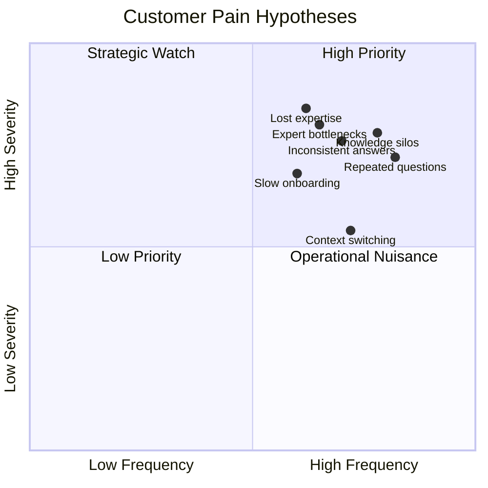
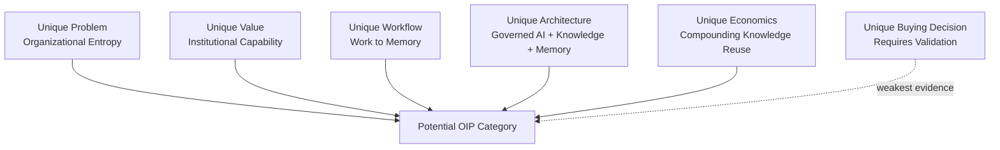

# Market Research

## Derived From

- Canon Version: `v1.0.0`
- Architecture Version: `v1.0.0`
- Implementation Version: `v1.0.0`
- Strategy Version: `v1.0.0`
- Research Methodology Version: `v1.0.0`

### Primary Repository Sources

- [Research Methodology](./00_RESEARCH_METHODOLOGY.md)
- [Canon](../canon/README.md)
- [Architecture](../architecture/README.md)
- [Implementation](../implementation/README.md)
- [Strategy](../strategy/README.md)

---

Status: **Active**

## Primary Research Question

Does Organizational Intelligence represent a genuine and emerging enterprise software category with sufficient customer need, technological feasibility, and long-term market potential?

This is a research document. It is not a marketing document.

It objectively evaluates both supporting and contradictory evidence. It does not assume that the Organizational Intelligence Platform category is already validated.

## 1. Executive Summary

This research investigates whether current market evidence supports continued investment in the Organizational Intelligence Platform category.

The preliminary conclusion is:

> The Organizational Intelligence Platform category appears **partially validated** by current evidence. The underlying problem, enabling technology trends, and adjacent market movement are strongly supported. The category boundary, buyer urgency, willingness to pay, and repeatable adoption motion require further primary customer validation.

## Methodology Summary

This report follows the company's AI-Assisted Multi-Source Research methodology in a limited initial form:

- Repository review across Canon, Architecture, Implementation, Strategy, and Research Methodology.
- AI-assisted synthesis using Codex/ChatGPT.
- Public source review across analyst, vendor, research, and industry sources.
- Cross-checking of claims against multiple public sources where available.
- Explicit confidence classification.

This report does not yet include original customer interviews, pilot data, production data, or multi-model validation across all named AAMR tools. Those are identified as limitations and future research needs.

## Key Findings

| Finding | Research Status | Confidence |
| --- | --- | --- |
| Enterprise AI adoption is real and accelerating, but scaled impact remains difficult. | Strongly supported by public reports. | Level B |
| Knowledge fragmentation, unmanaged information, and knowledge management maturity gaps are persistent enterprise issues. | Strongly supported by public research and adjacent market movement. | Level B |
| Existing categories address parts of the problem but do not fully combine work, evidence, human review, validation, memory, and governance. | Supported by category analysis. | Level B |
| Governance, explainability, data quality, and trust are becoming central to enterprise AI adoption. | Strongly supported by public reports. | Level B |
| Organizational Intelligence is a plausible emerging category, but it is not yet externally validated as a recognized market category. | Partially supported. | Level C |
| Customer willingness to pay for the full category framing remains unvalidated. | Unknown. | Level D |

## Preliminary Investment Recommendation

Current evidence supports continued investment in Organizational Intelligence Platform exploration, especially through the Customer Support beachhead and design partner strategy.

The next research priority should be primary customer validation:

- Customer interviews.
- Design partner discovery.
- Willingness-to-pay research.
- Pilot outcome measurement.
- Buyer committee mapping.
- Competitive alternative testing.

## 2. Research Scope

## Included

This research includes:

- Enterprise software.
- Customer Support.
- Knowledge Management.
- Enterprise Search.
- AI Assistants.
- AI Agents.
- Organizational Learning.
- Digital Transformation.
- Knowledge Graphs.
- Process Intelligence.
- AI governance.
- Enterprise workflow platforms.

## Excluded

This research excludes:

- Consumer AI applications.
- General productivity tools.
- Personal knowledge management.
- Personal note-taking systems.
- Consumer chatbots.
- Pure developer tooling.
- Education-only AI tools unless relevant to enterprise learning.

## Scope Boundary

The focus is not whether AI will be useful in general. The focus is whether enterprises need a distinct platform category for converting operational work into governed organizational memory and reusable institutional capability.

## 3. Research Methodology

This report follows the Research Methodology and AAMR principles defined in [00_RESEARCH_METHODOLOGY.md](./00_RESEARCH_METHODOLOGY.md).

## AI Systems Consulted

| AI System | Role in This Report |
| --- | --- |
| Codex/ChatGPT | Repository synthesis, structure generation, reasoning, evidence organization, and report drafting. |
| Claude | Not consulted in this initial report. |
| Gemini | Not consulted in this initial report. |
| Perplexity | Not consulted directly in this initial report. |
| Manus | Not consulted in this initial report. |

Because full multi-model AAMR was not performed, findings that depend on AI synthesis alone are not treated as high confidence.

## Public Sources Reviewed

| Source | Relevance |
| --- | --- |
| [McKinsey, The State of AI in 2025](https://www.mckinsey.com/capabilities/quantumblack/our-insights/the-state-of-ai) | Enterprise AI adoption, agents, transformation, and scaling difficulty. |
| [McKinsey, The State of AI in Early 2024](https://www.mckinsey.com/capabilities/quantumblack/our-insights/the-state-of-ai-2024) | GenAI adoption acceleration. |
| [Microsoft and LinkedIn, 2024 Work Trend Index](https://news.microsoft.com/source/2024/05/08/microsoft-and-linkedin-release-the-2024-work-trend-index-on-the-state-of-ai-at-work/) | Knowledge worker AI adoption and organizational AI pressure. |
| [Microsoft Work Trend Index archive](https://www.microsoft.com/en-us/worklab/work-trend-index) | AI-at-work trend context. |
| [Deloitte, The New Organizational Knowledge Management](https://www.deloitte.com/us/en/insights/topics/talent/organizational-knowledge-management.html) | Knowledge management readiness and organizational knowledge challenge. |
| [Deloitte, 2026 Global Human Capital Trends](https://www.deloitte.com/us/en/insights/topics/talent/human-capital-trends.html) | Adaptability, speed, and organizational performance context. |
| [APQC, Knowledge Management](https://www.apqc.org/expertise/knowledge-management) | Knowledge management discipline and current KM landscape. |
| [APQC, Top Knowledge Management Priorities for 2026](https://www.apqc.org/resource-library/resource/top-knowledge-management-priorities-2026) | KM priorities around AI, governance, critical knowledge, and collaboration. |
| [APQC, 2026 Knowledge Management Priorities and Trends Survey Report](https://www.apqc.org/resource-library/resource-listing/2026-knowledge-management-priorities-and-trends-survey-report) | KM trends and AI integration context. |
| [Gartner, Market Guide for Enterprise AI Search](https://www.gartner.com/en/documents/6952766) | Enterprise AI search market framing and unmanaged information problem. |
| [Gartner, Generative AI Knowledge Management Apps / General Productivity](https://www.gartner.com/reviews/market/generative-ai-knowledge-management-apps-general-productivity) | Adjacent category definition around GenAI knowledge management apps. |
| [IDC, Responsible and Secure AI](https://www.idc.com/resource-center/blog/responsible-and-secure-ai-the-key-to-ai-fueled-growth/) | AI governance and risk management framing. |
| [IDC, The Knowledge Your AI May Never Have](https://www.idc.com/resource-center/blog/the-knowledge-your-ai-may-never-have/) | Data quality, data availability, and data silos as AI scaling barriers. |
| [IBM, Enterprise Guide to AI Governance](https://www.ibm.com/thought-leadership/institute-business-value/en-us/report/ai-governance) | AI governance and responsible AI context. |
| [ServiceNow, AI Agents, Workflows, and Data](https://www.servicenow.com/events/knowledge/for-you/ai.html) | Incumbent movement toward AI, workflows, and data in enterprise operations. |

## Confidence Assignment

This report uses the confidence framework from the Research Methodology:

- Level A: Verified by primary evidence and multiple AI systems.
- Level B: Supported by multiple public sources and reputable secondary evidence.
- Level C: Supported by limited evidence.
- Level D: Hypothesis requiring validation.

No finding in this document is assigned Level A because no primary customer research or full multi-model AAMR has been completed.

## 4. Market Problem Investigation

## Core Problem

The research supports the existence of a broad enterprise problem: organizations struggle to preserve, govern, retrieve, and reuse knowledge across people, systems, and time.

This aligns with the repository's concept of Organizational Entropy.

## Evidence Summary

| Question | Evidence Summary | Confidence |
| --- | --- | --- |
| Do organizations repeatedly lose valuable operational knowledge? | Public KM research consistently treats knowledge capture, transfer, governance, and critical knowledge management as ongoing enterprise challenges. Deloitte's knowledge management research identified KM as a top issue while readiness was low; APQC continues to publish KM priorities around critical knowledge, governance, collaboration, and AI. | Level B |
| How expensive is knowledge loss? | Public sources support that poor knowledge and process management create wasted time, duplicated work, and productivity problems. Quantitative cost varies by organization and requires customer-specific research. | Level C |
| How dependent are companies on individual experts? | KM literature and enterprise practice suggest expert dependency is a recurring problem, especially where critical knowledge is not captured or transferred. Direct evidence for this target ICP requires customer interviews. | Level C |
| How common is repeated problem solving? | Customer Support, ITSM, and knowledge management categories exist partly because repeated operational problems are common. Direct measurement for target customers remains future research. | Level C |
| How difficult is onboarding because knowledge is fragmented? | Fragmented information and low knowledge management readiness indicate likely onboarding friction, but this requires customer-specific validation. | Level C |

## Interpretation

The market problem is real, but its exact severity for the company's target ICP must be validated through primary customer research.

The strongest evidence supports the general problem of fragmented knowledge and enterprise AI readiness gaps. The weaker evidence relates to exact economic impact, willingness to pay, and urgency by buyer segment.

## 5. Existing Market Landscape

Adjacent categories address parts of the problem.

| Category | Purpose | Strengths | Limitations | Opportunity for Organizational Intelligence |
| --- | --- | --- | --- | --- |
| Knowledge Management | Capture, organize, share, and maintain organizational knowledge. | Established discipline, governance concepts, critical knowledge practices. | Often manual, document-centric, and disconnected from daily operational work. | Turn KM into a live learning loop from real work to validated memory. |
| Enterprise Search | Retrieve information across repositories. | Improves discovery across fragmented information. | Retrieval does not guarantee validity, review, governance, or memory formation. | Add validation, governance, and knowledge lifecycle around retrieval. |
| Customer Support Platforms | Manage support tickets, routing, SLAs, and resolution workflows. | Strong operational system of work with rich case history. | Optimized for resolving cases, not necessarily compounding organizational knowledge. | Convert support work into governed organizational memory. |
| CRM | Manage customer relationships, accounts, pipeline, and commercial context. | Strong customer context and commercial record. | Not designed as institutional learning infrastructure. | Use customer interactions as evidence for organizational learning. |
| ITSM | Manage IT incidents, requests, services, and operations. | Strong workflow, incident, and service management discipline. | Knowledge reuse varies; may remain process-oriented rather than learning-oriented. | Extend OIP learning model into incidents, root causes, and runbooks. |
| Process Intelligence | Analyze processes, bottlenecks, and operational performance. | Strong process discovery and optimization lens. | Focuses on process behavior more than knowledge validation and memory. | Connect process insights to reusable organizational knowledge. |
| Knowledge Graphs | Represent entities, relationships, and semantic context. | Useful for structured knowledge relationships and explainability. | Technology approach, not complete organizational learning system. | Serve as an enabling representation within OIP. |
| Enterprise AI | Provide AI capabilities, tooling, and governance infrastructure. | Enables AI adoption across business functions. | Broad and infrastructure-oriented; may not focus on work-to-memory lifecycle. | OIP can apply AI to governed organizational learning. |
| AI Agents | Execute tasks and coordinate tools. | Useful for action, automation, and orchestration. | Task completion does not guarantee validated memory or institutional learning. | Govern what agents learn, change, and preserve. |
| Workflow Automation | Automate processes and handoffs. | Improves execution speed and consistency. | Does not automatically convert outcomes into knowledge. | Learn from workflow outcomes and decisions. |

## Landscape Conclusion

The landscape supports a gap. Existing categories handle retrieval, execution, automation, content, or AI assistance. The proposed OIP category combines those with governance, validation, memory, and organizational learning.

Confidence: Level B for category gap; Level C for market willingness to adopt a new category.

## 6. Market Trends

## Trend Analysis

| Trend | Evidence | Durable or Hype? | Relevance to OIP | Confidence |
| --- | --- | --- | --- | --- |
| Enterprise AI Adoption | McKinsey and Microsoft report broad and accelerating workplace AI adoption. | Durable, though specific tools will change. | Creates demand for trusted, governed AI use in work. | Level B |
| AI Scaling Difficulty | McKinsey reports that moving from pilots to scaled value remains difficult for many organizations. | Durable. | Supports need for workflow, governance, measurement, and integration. | Level B |
| Knowledge Management Modernization | APQC and Deloitte continue to emphasize knowledge management, AI, governance, and critical knowledge. | Durable. | Supports ongoing enterprise need to manage knowledge better. | Level B |
| Enterprise AI Search | Gartner describes generative AI transforming enterprise search from retrieval to synthesis. | Durable direction, though market definitions may evolve. | Supports movement toward AI-enabled knowledge synthesis. | Level B |
| AI Governance | IDC and IBM emphasize governance as necessary for responsible and secure AI. | Durable. | Supports OIP emphasis on trust, review, validation, and audit. | Level B |
| Workforce Turnover and Adaptability | Human capital research emphasizes adaptability and organizational performance. | Durable. | Supports need for institutional memory across employee changes. | Level C |
| Enterprise Automation | ServiceNow and others emphasize AI, data, and workflows. | Durable but competitive. | Indicates incumbents are moving toward AI-enabled workflow intelligence. | Level B |
| Organizational Learning | Longstanding discipline; market category expression remains less defined. | Durable concept, emerging software category. | Central to OIP thesis. | Level C |

## Trend Conclusion

The durable trends favor continued exploration: AI adoption, governance needs, knowledge fragmentation, workflow automation, and enterprise search evolution all point toward a need for trusted organizational learning systems.

The hype risk is also real. The company must avoid positioning OIP as merely another AI assistant or agent platform.

## 7. Customer Pain Analysis

The following pain points are plausibly severe in the ICP, but must be validated with primary customer interviews.

| Pain Point | Frequency Hypothesis | Severity Hypothesis | Evidence Status |
| --- | --- | --- | --- |
| Repeated Questions | High in Customer Support and ITSM. | Medium to high. | Supported by existence of support and KM categories; needs customer validation. |
| Lost Expertise | Medium to high in growing or high-turnover organizations. | High when experts leave or become bottlenecks. | Supported by KM literature; needs ICP-specific evidence. |
| Inconsistent Answers | Likely high in complex support environments. | High when customer trust or compliance matters. | Needs customer validation. |
| Slow Onboarding | Likely common where knowledge is fragmented. | Medium to high. | Supported directionally; requires interviews. |
| Knowledge Silos | High across enterprise systems. | High for AI readiness and support quality. | Supported by enterprise search and data silo reports. |
| Poor Documentation | Common in fast-changing products and support environments. | Medium to high. | Supported by KM problem framing; needs target customer proof. |
| Expert Bottlenecks | Likely common where knowledge requires judgment. | High. | Needs customer validation. |
| Context Switching | Common in multi-tool enterprise workflows. | Medium. | Supported directionally; needs measurement. |
| Support Quality Inconsistency | Likely common in scaling support teams. | Medium to high. | Needs customer validation. |

## Pain Severity Matrix

The chart represents research hypotheses, not validated quantitative findings.

## 8. Competitive Category Analysis

Current software categories do not fully solve the proposed OIP problem, but they create competitive pressure and possible integration paths.

## What Existing Categories Solve Well

| Category | Solves Well |
| --- | --- |
| Help Desk | Case intake, routing, SLA tracking, agent workflows. |
| Knowledge Base | Publishing and organizing curated articles. |
| Enterprise Search | Finding information across repositories. |
| AI Chatbot | Conversational assistance and quick answers. |
| AI Agent | Task execution and tool orchestration. |
| Workflow Automation | Repeatable process execution. |
| AI Governance | Risk control, policy, model oversight, compliance support. |

## Where They Fall Short Relative to OIP

| Gap | Why It Matters |
| --- | --- |
| Work-to-Memory Lifecycle | Many tools do not convert operational work into validated organizational memory. |
| Human Validation Loop | AI and automation tools may lack governed human review as a core category feature. |
| Evidence and Provenance | Outputs may not remain strongly linked to evidence, decision history, and source context. |
| Cross-System Learning | Existing systems often optimize within their own category rather than across the enterprise. |
| Category-Level Learning Economics | Many tools measure productivity, not institutional capability growth. |

## New Category Justification

A new category is justified if customers experience a problem not fully solved by existing categories and if the solution requires a distinct buying frame, workflow, architecture, and value metric.

Current evidence suggests a plausible but not fully validated case for OIP as a distinct category.

Confidence: Level C for distinct category validation; Level B for adjacent category gap.

## 9. Category Validation

## Distinct Category Criteria

| Criterion | Assessment | Confidence |
| --- | --- | --- |
| Unique Problem | Organizational Entropy is a coherent problem, supported by knowledge fragmentation, AI governance, and KM evidence. | Level B |
| Unique Customer Value | Turning work into governed memory is distinct from productivity, search, or ticketing value. | Level C |
| Unique Workflows | Evidence, AI assistance, human review, validation, knowledge, memory, and future reuse form a distinct workflow. | Level C |
| Unique Architecture | Existing architecture documents define a distinctive combination of workflow, AI, data, knowledge, integration, storage, and security. | Level C |
| Unique Economic Value | Knowledge reuse, reduced expert dependency, onboarding, consistency, and trust suggest economic value. | Level C |
| Unique Buying Decision | Not yet validated; buyer may still categorize this as support, KM, AI, or automation. | Level D |

## Category Validation Diagram

## Category Validation Conclusion

The strongest evidence supports the problem and technology feasibility. The weakest evidence concerns buyer behavior and whether customers will adopt the OIP framing rather than evaluating the platform through existing categories.

## 10. Market Timing

Market timing appears favorable but not risk-free.

| Timing Factor | Evidence | Impact on OIP | Confidence |
| --- | --- | --- | --- |
| LLM Maturity | Broad enterprise AI adoption and rapid model improvement are publicly documented. | Enables AI-assisted reasoning, synthesis, and candidate generation. | Level B |
| Enterprise AI Adoption | Microsoft and McKinsey report widespread workplace and organizational AI adoption. | Creates buyer openness and urgency. | Level B |
| Cloud Infrastructure | Mature cloud infrastructure supports scalable enterprise software. | Enables practical deployment and integration. | Level B |
| Knowledge Complexity | Enterprise information remains fragmented and unmanaged in many organizations. | Creates need for knowledge governance and memory. | Level B |
| Labor Market Changes | Turnover, distributed work, and adaptability pressures increase need for memory. | Supports institutional knowledge preservation. | Level C |
| Governance Requirements | IDC, IBM, and industry movement support AI governance importance. | Favors OIP positioning around trust and validation. | Level B |

## Timing Conclusion

The timing favors category exploration because AI adoption is increasing faster than many organizations' governance, data quality, and knowledge management maturity.

The risk is that buyers may first pursue narrower AI assistant, search, or workflow automation solutions before recognizing the broader OIP category.

## 11. Market Risks

| Risk | Likelihood | Impact | Mitigation |
| --- | --- | --- | --- |
| Category Confusion | High | High | Use clear positioning and Customer Support beachhead proof. |
| Slow Enterprise Adoption | Medium | High | Start with design partners and measurable support outcomes. |
| AI Commoditization | High | Medium | Compete on governed memory, validation, and trust. |
| Incumbent Competition | High | High | Integrate with incumbents and differentiate as the intelligence layer. |
| Economic Uncertainty | Medium | Medium | Use ROI-focused, purchasing-power aligned pricing. |
| Regulatory Change | Medium | Medium to high | Treat governance, privacy, security, and audit as core. |
| Low Willingness to Change | Medium | High | Minimize workflow disruption and show fast organizational value. |
| Weak Data Quality | High | High | Support evidence quality, provenance, and knowledge governance. |
| Over-Hype Around Agents | High | Medium | Avoid AI-first positioning; lead with organizational learning. |

## Risk Interpretation

The main risk is not that the underlying problem is imaginary. The main risk is that the market may categorize the solution incorrectly or delay adoption because the category is still emerging.

## 12. Opportunity Assessment

This section avoids generic SWOT language and focuses on evidence-grounded opportunity factors.

## Potential Strengths

| Strength | Evidence Basis |
| --- | --- |
| Clear unresolved problem | Knowledge fragmentation and AI scaling challenges are widely discussed. |
| Strong timing | Enterprise AI adoption creates urgency around governance and knowledge quality. |
| Focused beachhead | Customer Support provides repeated work, evidence, and measurable outcomes. |
| Differentiated category thesis | OIP combines work, evidence, AI, review, validation, knowledge, and memory. |

## Potential Weaknesses

| Weakness | Evidence Basis |
| --- | --- |
| Category is not externally established | Gartner and others define adjacent categories, but OIP itself is not yet recognized. |
| Buyer may not know budget owner | OIP spans support, knowledge, AI, operations, and IT. |
| Requires behavior change | Human review and knowledge validation require organizational discipline. |
| ROI needs proof | Economic claims require pilot data and customer-specific measurement. |

## Potential Opportunities

| Opportunity | Evidence Basis |
| --- | --- |
| AI governance demand | IDC, IBM, and enterprise AI market movement show governance pressure. |
| Enterprise search transformation | Gartner indicates GenAI is shifting enterprise search from retrieval to synthesis. |
| KM modernization | APQC and Deloitte support ongoing KM reinvention needs. |
| Incumbent integration | Existing platforms can become sources of evidence rather than direct replacements. |

## Potential Threats

| Threat | Evidence Basis |
| --- | --- |
| Incumbents add similar capabilities | ServiceNow and others are embedding AI into workflows. |
| AI tools become "good enough" | Buyers may settle for assistant/search tools. |
| Data quality blocks AI value | IDC identifies data quality and availability as major AI barriers. |
| Trust failures harm adoption | AI governance and security concerns could slow enterprise use. |

## 13. Confidence Assessment

## Validated Findings

No major finding is fully Level A in this report because primary customer evidence and full multi-model AAMR are not yet complete.

## Likely Findings

| Finding | Confidence |
| --- | --- |
| Enterprises face significant knowledge fragmentation and KM modernization challenges. | Level B |
| Enterprise AI adoption is accelerating, but scaled value remains difficult. | Level B |
| Governance, trust, and explainability are increasingly important to enterprise AI adoption. | Level B |
| Existing categories leave a gap around work-to-governed-memory lifecycle. | Level B |

## Hypotheses

| Hypothesis | Confidence |
| --- | --- |
| Customer Support is the best beachhead for validating OIP. | Level C |
| Buyers will recognize OIP as distinct from help desk, KM, search, or AI agents. | Level D |
| Customers will pay for organizational capability rather than AI usage. | Level D |
| Knowledge reuse metrics will prove ROI in early pilots. | Level C |

## Unknowns

| Unknown | Research Need |
| --- | --- |
| Willingness to pay | Pricing interviews and pilot conversion data. |
| Buying committee behavior | Customer discovery with support, IT, CX, operations, and executives. |
| Implementation barriers | Design partner pilots and onboarding research. |
| Regional variation | Indonesia-first and Southeast Asia market validation. |
| Adoption timelines | Pilot and sales cycle data. |

## 14. Open Research Questions

Future research should investigate:

1. What language do target customers use to describe Organizational Entropy?
2. Do Customer Support leaders feel repeated problem-solving is urgent enough to buy a new platform?
3. Which buyer owns the budget: Support, CX, IT, Operations, AI transformation, or Knowledge Management?
4. What is the strongest measurable ROI: resolution speed, onboarding, escalation reduction, quality consistency, or knowledge reuse?
5. How much human review is customers willing to perform?
6. How do customers evaluate trust in AI-assisted knowledge?
7. What integrations are mandatory for first value?
8. How does willingness to pay differ in Indonesia, Southeast Asia, and mature enterprise markets?
9. How long does it take to create first validated organizational value?
10. Which existing category does the buyer compare OIP against first?
11. What governance requirements appear before enterprise adoption?
12. What evidence is needed for investors or analysts to accept OIP as a distinct category?

## 15. Preliminary Conclusion

Based on available evidence, the Organizational Intelligence Platform category appears **partially validated**.

## Conclusion Rationale

| Question | Assessment |
| --- | --- |
| Is the underlying problem real? | Yes, strongly supported directionally by KM, AI adoption, AI governance, and information fragmentation evidence. |
| Is the technology timing favorable? | Yes, supported by LLM maturity, enterprise AI adoption, cloud maturity, and AI-enabled search/workflow trends. |
| Do adjacent categories leave gaps? | Yes, but the exact commercial gap requires customer validation. |
| Is the category already validated externally? | No. Adjacent categories are recognized; OIP remains a proposed category. |
| Should investment continue? | Yes, with disciplined customer validation and design partner research. |

The category should not yet be described as strongly validated. It should be treated as a promising category hypothesis with strong supporting signals and important unresolved commercial questions.

## 16. Repository Impact

## Product Impact

The research strengthens the case for focusing on Customer Support as the beachhead, but product decisions should remain tied to customer interviews and design partner outcomes.

## Strategy Impact

The category, positioning, ICP, GTM, pricing, and growth strategies remain directionally supported. However, buyer behavior and willingness to pay remain uncertain and should be treated as active research topics.

## Architecture Impact

The Architecture remains appropriate for the thesis because evidence supports the importance of integration, governance, knowledge representation, AI assistance, storage, audit, and security.

## Roadmap Impact

The Roadmap should prioritize learning milestones:

- Customer discovery.
- Design partner pilots.
- Knowledge reuse measurement.
- Human review workflow validation.
- Integration requirements.
- Trust and governance validation.

## Strengthened Assumptions

- Enterprises need better knowledge governance.
- AI adoption increases pressure for trusted knowledge and governance.
- Existing categories leave room for a broader learning/memory platform.
- Customer Support is a plausible first market.

## Uncertain Assumptions

- Buyers will adopt OIP as a distinct category.
- Customers will pay for organizational capability framing.
- Indonesia-first prospects will show enough budget and urgency.
- Human review workflows will be adopted consistently.

## 17. Traceability Matrix

| Canon Concept | Research Status | Confidence |
| --- | --- | --- |
| Organizational Intelligence | Partially supported as an emerging category thesis. | Level C |
| Knowledge Flywheel | Supported as a coherent mechanism; needs pilot validation. | Level C |
| Organizational Memory | Strongly supported as a valuable enterprise need, though exact buying behavior is unvalidated. | Level B |
| Human Review | Supported as important for trusted AI and knowledge validation. | Level B |
| Governance | Strongly supported by AI governance and enterprise trust trends. | Level B |
| Explainability | Supported by AI governance, enterprise trust, and audit needs. | Level B |
| Evidence | Strongly supported as necessary for trustworthy AI and knowledge management. | Level B |
| AI Cognitive Model | Supported directionally by AI adoption and governance needs. | Level B |
| Customer Support Beachhead | Plausible and strategically coherent; requires customer research. | Level C |
| Indonesia-First Strategy | Strategically coherent; market-specific validation still required. | Level D |

## 18. Limitations

This report has several limitations:

- Missing primary customer interview evidence.
- No production usage data.
- No design partner pilot evidence.
- No willingness-to-pay data.
- No full multi-model AAMR across ChatGPT, Claude, Gemini, Perplexity, Manus, and Codex.
- Geographic limitations: public sources are largely global or mature-market oriented rather than Indonesia-specific.
- Industry bias: much evidence comes from enterprise AI, KM, analyst, and vendor ecosystems.
- Public data constraints: many analyst reports are partially gated or summarized publicly.
- AI-assisted research limitations: synthesis may reflect available source framing and should be validated.
- Category naming limitation: "Organizational Intelligence Platform" is a proposed category, not yet a widely recognized market category.

These limitations do not invalidate the thesis, but they prevent the research from assigning Level A confidence.

## 19. Closing

Research is an ongoing process.

This document represents the current state of evidence rather than a permanent conclusion.

The evidence supports continued investment in the Organizational Intelligence Platform thesis, but it does not justify assuming success. The category appears promising because the underlying problems are real, AI timing is favorable, governance needs are increasing, and adjacent categories leave meaningful gaps.

The next stage of validation must come from customers.

Future customer interviews, experiments, pilot deployments, design partner feedback, and market validation may strengthen, refine, or challenge these findings.

The company should proceed with conviction about the problem and humility about the category.
