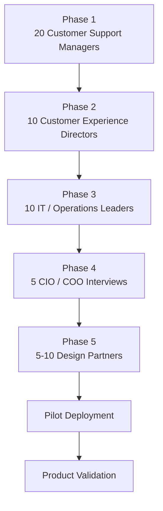
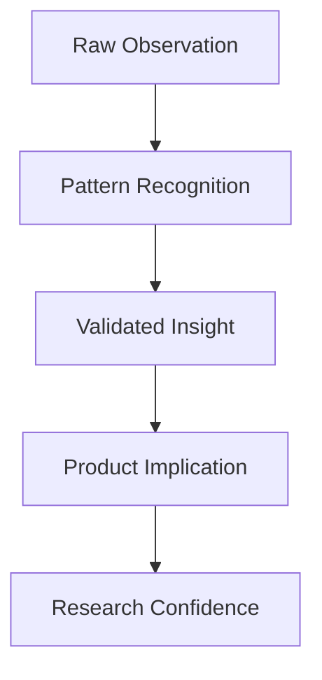
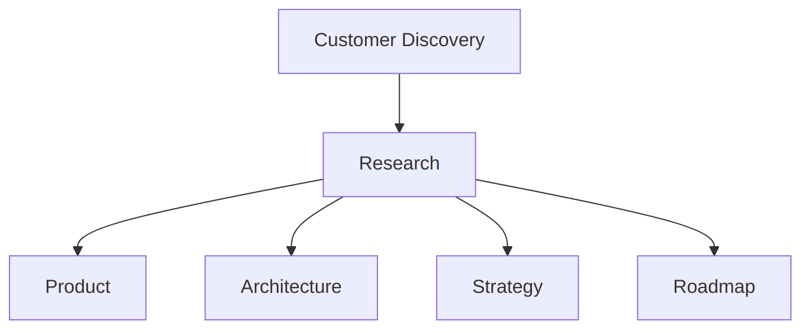

# Customer Discovery

## Derived From

- Canon Version: `v1.0.0`
- Architecture Version: `v1.0.0`
- Implementation Version: `v1.0.0`
- Strategy Version: `v1.0.0`
- Research Methodology Version: `v1.0.0`
- Market Research Version: `v1.0.0`

### Primary Research Documents

- [Research Methodology](./00_RESEARCH_METHODOLOGY.md)
- [Market Research](./01_MARKET_RESEARCH.md)

### Primary Repository Layers

- [Canon](../canon/README.md)
- [Architecture](../architecture/README.md)
- [Implementation](../implementation/README.md)
- [Strategy](../strategy/README.md)

---

Status: **Active**

## Primary Research Question

How can the company systematically validate customer problems, workflows, priorities, and willingness to adopt an Organizational Intelligence Platform before making major product decisions?

This is a research methodology document focused on customer validation.

It is not a sales playbook. It is not a user manual. It defines how Customer Discovery should be conducted.

## 1. Executive Summary

Customer Discovery is the bridge between market research and product development.

Market research can identify broad trends, adjacent categories, and plausible customer problems. Product development turns decisions into artifacts. Customer Discovery sits between them: it tests whether the people the company intends to serve actually experience the problems the company believes are important.

The objective is learning, not selling.

Customer Discovery exists to replace assumptions with direct customer evidence. It should help the company understand real workflows, pain severity, buying behavior, trust requirements, adoption barriers, and willingness to change before major product commitments are made.

For the Organizational Intelligence Platform category, Customer Discovery is especially important because the category is still emerging. The company must validate whether customers recognize Organizational Entropy, whether Customer Support is the correct beachhead, whether human review workflows are acceptable, and whether customers value organizational memory enough to adopt a new platform.

## 2. Customer Discovery Philosophy

## Listen Before Building

The company should listen deeply before committing to product direction.

Listening does not mean customers design the product. It means customer evidence should shape the company's understanding of the problem, workflow, language, urgency, and constraints.

## Problems Before Solutions

Customer Discovery should focus on customer problems before presenting solutions.

If researchers introduce the product too early, customers may react politely to the idea without revealing whether the underlying problem is real or severe.

## Evidence Before Assumptions

Every strategic assumption should eventually face customer evidence.

The company may begin with hypotheses from the Canon, Strategy, and Market Research, but those hypotheses should be tested through interviews, observation, pilots, and design partner work.

## Curiosity Over Confirmation

The purpose is not to prove the company is right.

The purpose is to understand reality. Disconfirming evidence is valuable because it prevents expensive mistakes.

## Learn From Every Conversation

Every customer conversation should improve the company's understanding.

Even a poor-fit customer can reveal why the ICP should be narrower, why messaging is unclear, or why the buying motion may be more complex than expected.

## Customers Are Partners in Discovery

Customers should be treated as collaborators in understanding the problem.

Design partners, early interviewees, and pilot customers help the company learn how Organizational Intelligence appears in real organizations.

## Philosophy Matrix

| Principle | Discovery Behavior |
| --- | --- |
| Listen Before Building | Prioritize customer workflow evidence before product commitments. |
| Problems Before Solutions | Explore pain before demonstrating product concepts. |
| Evidence Before Assumptions | Track which assumptions are validated, weakened, or unresolved. |
| Curiosity Over Confirmation | Ask questions that could disprove the thesis. |
| Learn From Every Conversation | Capture insights even from weak-fit customers. |
| Customers Are Partners | Treat customers as collaborators in category validation. |

## 3. Discovery Objectives

Every Customer Discovery effort should answer a defined set of questions.

| Objective | Discovery Question |
| --- | --- |
| Problem Existence | Does the problem actually exist for this customer segment? |
| Pain Severity | How painful is it? What happens if it remains unsolved? |
| Frequency | How often does it occur? Daily, weekly, monthly, or only rarely? |
| Current Solution | How is it solved today? Tools, people, process, workarounds, or avoidance? |
| Frustration | What are the biggest frustrations with the current approach? |
| Ownership | Who owns the problem operationally and economically? |
| Buying Influence | Who influences purchasing decisions? Who blocks them? |
| Outcome Priority | What outcomes matter most to the customer? |
| Change Readiness | Is the customer willing to change behavior or workflows? |
| Trust Requirements | What would make the customer trust AI-assisted knowledge? |
| Design Partner Fit | Is the customer a credible design partner or pilot candidate? |

Customer Discovery should produce evidence that strengthens, weakens, or refines the company's assumptions.

## 4. Customer Segmentation

Customer Discovery should include primary, secondary, and future participant groups.

## Primary Participants

| Participant | Why They Matter |
| --- | --- |
| Customer Support Managers | Own day-to-day support quality, repeated questions, escalation pain, and team productivity. |
| Customer Experience Leaders | Care about customer consistency, satisfaction, support outcomes, and experience quality. |
| Support Team Leads | See frontline workflow details, agent behavior, knowledge gaps, and practical adoption barriers. |
| Knowledge Managers | Own documentation, knowledge reuse, article quality, governance, and knowledge lifecycle. |

## Secondary Participants

| Participant | Why They Matter |
| --- | --- |
| CIO | Owns enterprise architecture, integration, security, data governance, and AI adoption risk. |
| COO | Cares about operational efficiency, process quality, scaling, and organizational capability. |
| IT Leaders | Understand implementation feasibility, identity, access, systems, and technical constraints. |
| Operations Managers | See repeated process issues, handoffs, exceptions, and operational knowledge gaps. |
| HR Leaders | Represent future expansion into onboarding, policy interpretation, and employee support. |
| Digital Transformation Teams | Often own AI adoption, workflow modernization, and cross-functional change initiatives. |

## Future Participants

| Participant | Why They Matter |
| --- | --- |
| Enterprise Executives | Validate strategic value, category framing, and enterprise buying logic. |
| Government Organizations | Represent future public-sector institutional memory and digital transformation use cases. |
| Regulated Industries | Reveal governance, compliance, audit, privacy, and risk requirements. |

## Segmentation Principle

Primary participants validate the beachhead. Secondary participants validate buying complexity and organizational expansion. Future participants validate long-term category breadth.

## 5. Customer Validation Roadmap

Customer validation should proceed in phases.

Sample sizes are starting targets and may evolve based on research findings. If patterns converge quickly, the company may move forward. If findings conflict, the company should continue research before making major commitments.

## Validation Phases

| Phase | Objective | Evidence Expected |
| --- | --- | --- |
| Phase 1: Customer Support Managers | Validate frontline and management pain around repeated questions, knowledge gaps, onboarding, and quality. | Problem frequency, pain severity, current workflows, tool usage, language. |
| Phase 2: Customer Experience Directors | Validate customer experience impact and executive framing. | Customer consistency concerns, CX metrics, strategic urgency. |
| Phase 3: IT / Operations Leaders | Validate feasibility, systems, integration expectations, and operational ownership. | Implementation constraints, system landscape, data boundaries. |
| Phase 4: CIO / COO Interviews | Validate enterprise buyer perspective and budget ownership. | Strategic priority, governance concerns, buying process. |
| Phase 5: Design Partners | Validate depth of fit and willingness to collaborate. | Design partner commitments, success criteria, data access, review capacity. |
| Pilot Deployment | Test product behavior in real workflows. | Measured value, adoption friction, knowledge reuse, trust. |
| Product Validation | Decide whether to proceed, refine, narrow, or pivot. | Evidence-backed product and strategy decisions. |

## 6. Interview Methodology

Consistency matters because discovery findings must be comparable across conversations.

## Preparation

Before each interview, researchers should:

- Define the research objective.
- Review the participant's company, role, and likely workflow context.
- Identify assumptions being tested.
- Prepare open-ended questions.
- Avoid preparing a product pitch as the main agenda.
- Confirm consent and expectations.

## Interview Duration

Most discovery interviews should be 30 to 60 minutes.

Shorter interviews may work for narrow validation. Longer interviews may be appropriate for design partners, workflow walkthroughs, or executive discovery.

## Recording Permissions

Researchers should request permission before recording.

If recording is not permitted, researchers should take structured notes and identify any direct quotes carefully.

## Note-Taking

Notes should separate:

- Direct quotes.
- Observed facts.
- Researcher interpretation.
- Follow-up questions.
- Potential product implications.

## Neutral Questioning

Questions should avoid leading the participant toward the company's preferred answer.

Instead of asking, "Would it help if AI turned your support tickets into organizational memory?" ask, "What happens after your team resolves a difficult or repeated support issue?"

## Active Listening

Researchers should listen for:

- Specific examples.
- Repeated work.
- Emotional intensity.
- Workarounds.
- Tool switching.
- Ownership ambiguity.
- Metrics and consequences.
- Contradictions between stated process and actual behavior.

## Follow-Up Questions

Good follow-up questions include:

- "Can you walk me through the last time that happened?"
- "What did your team do next?"
- "Who was involved?"
- "How often does this happen?"
- "What happens if it is not solved?"
- "How do you know whether the answer is correct?"

## Post-Interview Synthesis

After each interview, researchers should summarize:

- Key observations.
- Pain points.
- Workflow patterns.
- Current solutions.
- Severity and frequency.
- Quotes.
- Open questions.
- ICP fit.
- Confidence level.

## 7. Interview Question Framework

Questions should be open-ended and organized by theme.

## Current Workflow

- "Can you walk me through how your team handles a typical customer inquiry?"
- "What happens when an issue is difficult or unfamiliar?"
- "Which tools does your team use during resolution?"
- "Where does context usually come from?"

## Pain Points

- "What parts of the support workflow create the most friction?"
- "Which problems repeat more often than they should?"
- "Where does your team lose time?"
- "What makes a case difficult to resolve?"

## Knowledge Sharing

- "How does your team share solutions after a difficult issue is resolved?"
- "Where does reusable knowledge usually live?"
- "How do agents find the best answer?"
- "What knowledge is hardest to transfer to new team members?"

## Decision Making

- "How does your team decide whether an answer is correct?"
- "Who reviews difficult answers or escalations?"
- "What happens when two people disagree about the right response?"
- "How are exceptions or policy interpretations handled?"

## Documentation

- "How is documentation maintained today?"
- "How do you know when documentation is outdated?"
- "Who owns updates?"
- "What prevents documentation from staying current?"

## AI Usage

- "Is your team using AI today? If so, where?"
- "What AI use cases have worked?"
- "Where do you not trust AI?"
- "What would need to be true for AI-assisted support knowledge to be trusted?"

## Governance

- "Which answers require review or approval?"
- "What information should not be exposed to AI tools?"
- "How do you manage sensitive customer or company information?"
- "What audit or compliance concerns affect support knowledge?"

## Buying Process

- "Who would care most about solving this problem?"
- "Who would need to approve a new platform?"
- "What would make this a high-priority initiative?"
- "What would block adoption?"

## Success Metrics

- "How would you measure improvement?"
- "Which metrics matter most to leadership?"
- "What outcome would make this worth changing your workflow?"
- "What would convince you that the solution is working?"

## Future Expectations

- "If this problem were solved well, what would your team look like a year from now?"
- "How should support knowledge improve over time?"
- "What would make your organization better at learning from support work?"
- "What should never be automated without human review?"

## 8. Observation Research

Interviews reveal what people say. Observation reveals what people do.

Observation is especially useful when workflows are complex, tool-heavy, informal, or difficult for participants to describe accurately.

## Observation Methods

| Method | What It Reveals |
| --- | --- |
| Shadowing Support Agents | Actual workflow, tool switching, search behavior, interruptions, and escalation patterns. |
| Watching Ticket Handling | How cases move from intake to resolution, including hidden delays and decision points. |
| Knowledge Search Behavior | Where agents search, what they trust, what they ignore, and when they ask experts. |
| Escalation Workflows | How difficult issues move to senior experts, managers, engineering, or other teams. |
| Team Collaboration | How answers are negotiated in chat, meetings, comments, or informal conversations. |

## When Observation Is Most Useful

Observation should be prioritized when:

- Interview descriptions are vague.
- Workflows differ from documented process.
- Tool switching appears high.
- Expert bottlenecks are suspected.
- Search and documentation behavior matter.
- The company needs to understand real adoption friction.

Observation should be conducted with consent and respect for confidentiality.

## 9. Design Partner Framework

Design partners help validate the product, category, workflow, and customer value in real operating conditions.

## Ideal Design Partner Criteria

| Criterion | Description |
| --- | --- |
| ICP Fit | Matches the Customer Support beachhead and target organizational profile. |
| Real Pain | Experiences repeated questions, knowledge gaps, onboarding friction, or expert bottlenecks. |
| Data Availability | Can provide access to relevant tickets, knowledge articles, workflows, or examples. |
| Human Review Capacity | Has experts who can validate outputs and learning candidates. |
| Executive Sponsor | Has a leader who cares about support quality, AI trust, or organizational learning. |
| Operational Champion | Has a day-to-day owner who can coordinate feedback and adoption. |
| Reference Potential | Could become a credible case study or reference if successful. |
| Willingness to Learn | Understands that design partnership is collaborative, not simple procurement. |

## Mutual Responsibilities

| Company Responsibility | Design Partner Responsibility |
| --- | --- |
| Define research and pilot objectives. | Provide access to relevant workflows and stakeholders. |
| Protect confidentiality and sensitive data. | Participate honestly in interviews, review, and feedback. |
| Provide structured onboarding and support. | Identify reviewers and operational champions. |
| Measure outcomes transparently. | Share usage friction, value signals, and objections. |
| Translate findings into product learning. | Help validate whether the category framing is accurate. |

## Feedback Cadence

Recommended cadence:

- Weekly working feedback during active discovery or pilot.
- Biweekly product synthesis with internal team.
- Monthly executive review during design partnership.
- End-of-phase review before pilot expansion or long-term conversion.

## Confidentiality

Design partner research may involve sensitive workflows, customer data, internal tools, support practices, or strategic plans. Confidentiality expectations must be clear before research begins.

## Success Metrics

Design partner success may include:

- Clear problem validation.
- Identified repeated workflows.
- Learning candidates generated.
- Validated knowledge created.
- Reviewer engagement.
- Time to first organizational value.
- Knowledge reuse.
- Executive confidence.
- Expansion interest.

## Transition to Long-Term Customer

A design partner should transition to long-term customer only when there is clear evidence of value, organizational commitment, and fit with the company's product direction.

## 10. Evidence Collection

Customer Discovery evidence should be structured, traceable, and ethically collected.

## Evidence Types

| Evidence | Collection Standard |
| --- | --- |
| Interview Notes | Capture direct quotes, observations, interpretations, and open questions separately. |
| Quotes | Use exact wording when possible and preserve context. |
| Workflow Diagrams | Map real workflows, not idealized processes. |
| Screenshots | Collect only with explicit permission and remove sensitive information where needed. |
| Process Maps | Document steps, tools, actors, handoffs, and decision points. |
| Pain Point Rankings | Ask participants to prioritize severity, frequency, and business impact. |
| Existing Tools | Record systems used, tool switching, and integration needs. |
| Improvement Suggestions | Capture ideas but separate them from validated problems. |
| Metrics | Collect current metrics when customers can share them safely. |
| Artifacts | Gather sample templates, anonymized tickets, knowledge articles, or escalation examples where permitted. |

## Evidence Quality Rules

| Rule | Meaning |
| --- | --- |
| Separate Fact from Interpretation | Do not mix what the customer said with what the researcher inferred. |
| Preserve Context | Quotes and examples should include role, workflow, and situation. |
| Protect Sensitive Information | Remove or restrict customer, employee, and confidential details. |
| Track Confidence | Mark whether evidence is single-source, repeated, or validated. |
| Avoid Overgeneralization | One interview is not market proof. |

## 11. Insight Analysis Framework

Customer evidence becomes useful only when it is analyzed carefully.

## Analysis Stages

| Stage | Meaning |
| --- | --- |
| Raw Observation | A direct quote, behavior, workflow step, artifact, or customer example. |
| Pattern Recognition | Similar observations repeat across participants, roles, or companies. |
| Validated Insight | A pattern is supported by enough evidence to guide decisions. |
| Product Implication | The insight suggests a product, strategy, architecture, or research action. |
| Research Confidence | The team assigns confidence based on evidence strength and consistency. |

## Insight Rules

An insight should not be considered validated only because it sounds compelling.

It should be supported by:

- Repeated evidence.
- Clear customer examples.
- Severity or frequency signals.
- Consistency across roles or companies.
- Observable workflow behavior where possible.
- Contradictory evidence review.

## 12. Customer Journey Mapping

Customer journeys should document how work actually unfolds.

For Customer Support discovery, a journey map should include:

- Trigger.
- Workflow.
- Decision Points.
- Pain Points.
- Escalations.
- Resolution.
- Knowledge Capture.
- Post-resolution Learning.

## Customer Journey Diagram

```mermaid
flowchart LR
    Trigger["Trigger<br/>Customer inquiry or issue"]
    Workflow["Workflow<br/>Agent investigates"]
    Decision["Decision Points<br/>Search, ask, escalate, respond"]
    Pain["Pain Points<br/>Missing context, stale docs, repeated questions"]
    Escalation["Escalations<br/>Expert, manager, engineering, policy owner"]
    Resolution["Resolution<br/>Answer or fix delivered"]
    Capture["Knowledge Capture<br/>What is recorded?"]
    Learning["Post-resolution Learning<br/>What improves future work?"]

    Trigger --> Workflow
    Workflow --> Decision
    Decision --> Pain
    Pain --> Escalation
    Escalation --> Resolution
    Resolution --> Capture
    Capture --> Learning
```

## How Journey Mapping Supports Product Design

Journey mapping helps the company identify:

- Where evidence is created.
- Where knowledge is searched.
- Where human judgment occurs.
- Where AI assistance may be useful.
- Where trust is required.
- Where knowledge capture fails.
- Where future product workflows should intervene.

Journey maps should be treated as research artifacts, not final product designs.

## 13. Validation Metrics

Customer Discovery should use metrics that indicate learning quality and problem validation.

## Discovery Metrics

| Metric | Meaning |
| --- | --- |
| Interview Completion | Number of completed interviews by segment and role. |
| Problem Frequency | How often the reported problem occurs. |
| Problem Severity | How painful or costly the problem is. |
| Workflow Consistency | Whether similar workflows and pain patterns appear across customers. |
| Existing Solution Satisfaction | How satisfied customers are with current tools and workarounds. |
| Willingness to Change | Whether customers would alter workflows to solve the problem. |
| Willingness to Pilot | Whether customers would participate in a design partner or pilot program. |
| Design Partner Conversion | How many discovery participants become serious design partner candidates. |
| Evidence Repetition | Whether the same pain appears across multiple interviews. |
| Buying Clarity | Whether ownership, budget, and decision process become clearer. |

## Metrics to Avoid Overvaluing

Avoid overvaluing:

- Positive reactions to product ideas.
- Compliments.
- Demo excitement.
- Vague "this is interesting" feedback.
- Large numbers of unqualified conversations.
- Social media engagement.

Customer Discovery should measure evidence of real pain, not politeness.

## 14. Research Ethics

Customer Discovery must preserve trust.

## Ethical Principles

| Principle | Meaning |
| --- | --- |
| Informed Consent | Participants should know the purpose of the conversation and how information may be used. |
| Privacy | Personal, customer, employee, and company information should be protected. |
| Confidentiality | Sensitive company details should not be shared outside the agreed context. |
| Accurate Representation | Do not distort what customers said to fit the company's preferred narrative. |
| No Deceptive Practices | Do not misrepresent product maturity, research purpose, or intentions. |
| Respect Customer Time | Prepare well, stay focused, and avoid unnecessary meetings. |
| Protect Sensitive Information | Avoid collecting sensitive data unless it is necessary, permitted, and protected. |

Ethical discovery is also strategic. Customers are more likely to become partners when they feel respected, heard, and protected.

## 15. Repository Integration

Customer Discovery should feed the repository through validated evidence.

Customer evidence informs decisions but does not automatically change the Canon.

The Canon contains foundational commitments. Customer Discovery may reveal that future documents should refine strategy, product plans, architecture priorities, or roadmap sequence. Canon changes require deliberate governance, not casual reaction to individual interviews.

## Repository Update Rules

| Discovery Finding | Possible Repository Impact |
| --- | --- |
| Repeated customer pain is validated | Update research, product, strategy, or roadmap documents. |
| ICP assumptions are weakened | Update ICP, GTM, or market research documents. |
| Workflow pattern is discovered | Inform product and architecture design. |
| Trust or governance concern emerges | Inform security, AI, API, storage, and strategy documents. |
| Buying process becomes clearer | Inform GTM, pricing, and business model documents. |
| Canon-level assumption is challenged | Escalate for governance review before any Canon change. |

## 16. Traceability Matrix

| Canon Concept | Discovery Expression |
| --- | --- |
| Organizational Intelligence | Customer validation of whether work can become institutional capability. |
| Knowledge Flywheel | Discovery of real workflows where observation, review, validation, and learning occur. |
| Human Review | Interview synthesis, design partner validation, and expert review workflows. |
| Governance | Ethical research, consent, confidentiality, and disciplined repository updates. |
| Continuous Learning | Ongoing customer discovery as a permanent company capability. |
| Organizational Memory | Research artifacts preserve customer evidence and learning history. |
| Evidence | Interviews, observations, workflow maps, and artifacts anchor conclusions. |
| AI Cognitive Model | Customer research validates where AI should assist but not replace human authority. |
| Strategy | Discovery validates ICP, GTM, pricing, growth, and category assumptions. |
| Product Vision | Customer evidence tests whether the product should exist in its proposed form. |

## 17. What This Document Does NOT Define

This document intentionally excludes:

- Product requirements.
- Feature prioritization.
- UX design.
- Implementation plans.
- Pricing decisions.
- Sales scripts.
- Marketing messages.
- Customer success playbooks.
- Pilot contracts.
- Roadmap commitments.

Those belong in separate product, design, implementation, pricing, sales, customer success, and roadmap documents.

## 18. Closing

Customer Discovery is not a one-time activity before launch.

It is a permanent organizational capability.

Every customer conversation is an opportunity to strengthen the company's understanding of real organizational problems.

The company succeeds when it continuously replaces assumptions with validated customer knowledge.

If the product exists to help organizations learn from work, then the company itself must learn from every customer interaction with discipline, humility, and evidence.
