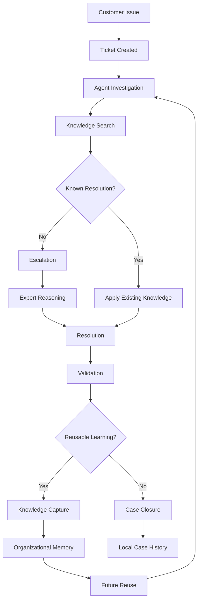
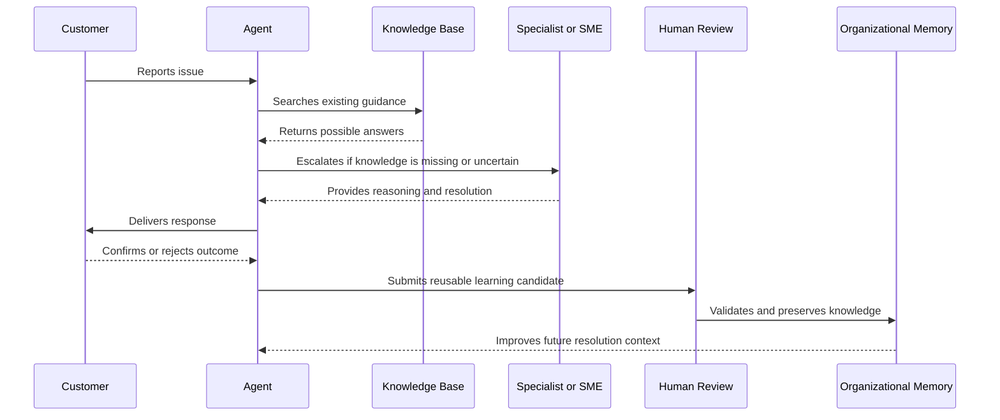

# Support Industry Research

## Derived From

- Canon Version: `v1.0.0`
- Architecture Version: `v1.0.0`
- Implementation Version: `v1.0.0`
- Strategy Version: `v1.0.0`
- Research Methodology Version: `v1.0.0`
- Market Research Version: `v1.0.0`
- Customer Discovery Version: `v1.0.0`

### Primary Repository Sources

- [Canon](../canon/README.md)
- [Architecture](../architecture/README.md)
- [Implementation](../implementation/README.md)
- [Strategy](../strategy/README.md)
- [Research Methodology](./00_RESEARCH_METHODOLOGY.md)
- [Market Research](./01_MARKET_RESEARCH.md)
- [Customer Discovery](./02_CUSTOMER_DISCOVERY.md)

---

Status: **Active**

## Primary Research Question

Should Customer Support be the company's first target domain, and does the industry exhibit characteristics necessary to validate and launch an Organizational Intelligence Platform?

This is a research document. It is not a product specification, sales narrative, or implementation plan.

It evaluates Customer Support objectively as a possible first domain for the Organizational Intelligence Platform. It does not assume the conclusion. It identifies evidence, limitations, risks, unknowns, and repository implications.

## Methodology Note

This report follows the company's AI-Assisted Multi-Source Research methodology in a limited initial form:

- Review of existing repository strategy, canon, architecture, implementation, and research documents.
- AI-assisted synthesis using Codex/ChatGPT.
- Public source review across analyst, vendor, industry, and news sources.
- Explicit separation between evidence, interpretation, and hypothesis.
- Confidence classification using the repository research framework.

This version does not yet include direct customer interviews, design partner data, support ticket datasets, pilot outcomes, paid market research, or full multi-model validation across all AAMR tools. Those limitations affect the confidence levels assigned throughout the document.

## Public Sources Reviewed

| Source | Relevance to This Research | Evidence Type |
| --- | --- | --- |
| [Salesforce State of Service](https://www.salesforce.com/service/state-of-service-report/) | Indicates service teams are under pressure to improve customer experience, scale operations, use AI, and manage knowledge more effectively. | Vendor research |
| [Salesforce State of Service, 7th Edition PDF](https://www.salesforce.com/en-us/wp-content/uploads/sites/4/documents/PDF/state-of-service-7th-edition.pdf) | Provides survey-based evidence that service organizations are adopting AI and data-driven service models while facing rising expectations. | Vendor research |
| [Zendesk CX Trends 2026](https://cxtrends.zendesk.com/) | Shows industry movement toward contextual, memory-rich, AI-assisted customer experience. | Vendor research |
| [Zendesk AI Customer Service Statistics](https://www.zendesk.com/blog/ai/productivity/ai-customer-service-statistics/) | Provides indicators of AI adoption, productivity expectations, and automation pressure in customer service. | Vendor research |
| [Gartner Customer Service AI Survey Press Release](https://www.gartner.com/en/newsroom/press-releases/2026-02-18-gartner-survey-finds-ninety-one-percent-of-customer-service-leaders-under-pressure-to-implement-ai-in-2026) | Reports strong leadership pressure to implement AI in customer service and highlights the changing role of support teams. | Analyst research |
| [Gartner Customer Service and Support Insights](https://www.gartner.com/en/customer-service-support) | Provides analyst framing for service transformation, self-service, automation, and customer service strategy. | Analyst research |
| [Gartner Customer Service Predictions](https://www.gartner.com/en/customer-service-support/trends/customer-service-predictions) | Identifies forward-looking service trends relevant to AI, automation, self-service, and service operating models. | Analyst research |
| [HDI State of Technical Support 2024 Takeaways](https://www.thinkhdi.com/library/supportworld/2024/state-of-technical-support-4-takeaways) | Provides technical support industry context, including operational maturity and training challenges. | Industry research |
| [HDI 2024 Technical Support Announcement](https://www.businesswire.com/news/home/20240822538702/en/HDI-Announces-the-State-of-Technical-Support-in-2024-Training-is-an-Ongoing-Challenge-for-Support-Teams) | Highlights continuing training and enablement challenges in support teams. | Industry/news |
| [Salesforce AI in Customer Service](https://www.salesforce.com/service/ai/customer-service-ai/) | Describes common AI customer service use cases, including repetitive inquiry handling, agent assistance, and customer engagement. | Vendor analysis |
| [TechRadar: Zendesk AI Pricing and Verified Resolutions](https://www.techradar.com/pro/zendesk-links-ai-pricing-to-verified-resolution-outcomes) | Shows the market moving toward outcome-based AI support claims and verified resolution framing. | Industry news |

Public sources are used as supporting evidence, not as proof that the Organizational Intelligence Platform category is already validated.

## 1. Executive Summary

This research evaluates whether Customer Support should remain the company's recommended first target domain for the Organizational Intelligence Platform.

The preliminary conclusion is:

> Customer Support should remain the recommended beachhead domain, but the recommendation should be treated as **well-supported and not yet fully validated**. The domain strongly exhibits the workflow, knowledge, review, repetition, and governance characteristics required by an Organizational Intelligence Platform. Commercial urgency, buyer willingness, and adoption behavior still require primary customer validation.

## Methodology Summary

The analysis combines repository-derived assumptions with public evidence from customer service, technical support, AI adoption, and knowledge management sources. The research evaluates Customer Support against the core requirements of the Organizational Intelligence Platform:

- Repeated operational work.
- Knowledge-intensive decisions.
- Human review and validation.
- Existing artifacts such as cases, tickets, resolutions, and documentation.
- Organizational memory loss.
- Economic impact from repeated learning.
- A plausible buyer and workflow owner.
- Expansion potential into adjacent enterprise functions.

## Major Findings

| Finding | Interpretation | Confidence |
| --- | --- | --- |
| Customer Support naturally generates operational knowledge through tickets, investigations, escalations, resolutions, and post-case learning. | Strong fit with the Knowledge Flywheel. | Level B |
| Support organizations experience clear forms of Organizational Entropy: repeated questions, expert dependency, documentation decay, fragmented knowledge, and onboarding burden. | Strong fit with the category problem. | Level B |
| Existing support technologies solve important operational problems but do not consistently transform validated work into durable organizational memory. | Creates room for OIP as a complementary layer. | Level B |
| AI adoption pressure in service is high, but trust, governance, review, and quality remain central concerns. | Strong fit with human-reviewed intelligence rather than autonomous automation. | Level B |
| Customer Support has measurable economics: resolution time, escalation rate, self-service success, onboarding time, deflection, quality, and customer satisfaction. | Supports pilot design and ROI measurement. | Level B |
| Customer Support is not automatically the best beachhead for every company or vertical. Fit depends on support maturity, inquiry volume, knowledge complexity, and willingness to validate AI outputs. | Requires ICP discipline. | Level B |
| Willingness to pay for a distinct Organizational Intelligence Platform, rather than another support AI add-on, remains unvalidated. | Primary customer discovery is required. | Level C |

## Research Recommendation

Customer Support should remain the recommended initial domain because it has the strongest combination of:

- High-volume repeatable work.
- Persistent knowledge loss.
- Human expert review.
- Existing digital workflows.
- Measurable operational outcomes.
- Urgent AI adoption pressure.
- Natural expansion into IT, HR, operations, compliance, and other knowledge-intensive service domains.

However, the company should avoid treating this as settled truth. The next validation step should be structured customer discovery and design partner pilots focused on:

- Whether support leaders recognize Organizational Entropy in their own language.
- Whether they value governed organizational memory enough to buy or pilot a new platform.
- Whether the platform is perceived as distinct from help desk AI, knowledge base automation, and enterprise search.
- Whether validated knowledge reuse produces measurable operational improvement.

Overall confidence: **Level B for domain fit; Level C for commercial adoption; Level D for willingness to pay until primary evidence is collected.**

## 2. Research Scope

This research focuses on support domains where work is digital, knowledge-intensive, repeatable, and tied to enterprise operations.

## Included Domains

| Domain | Included Because |
| --- | --- |
| Enterprise customer support | Mature workflows, ticket histories, escalation paths, support knowledge, and measurable operational metrics. |
| B2B support | Often involves complex products, recurring technical questions, contractual obligations, and expert-driven resolution. |
| SaaS support | High volume, rich product telemetry, frequent recurring issues, and strong need for knowledge reuse. |
| IT support | Strong internal help desk workflows, service catalogs, incident knowledge, and escalation patterns. |
| Internal help desks | Clear case lifecycle, organizational memory needs, and repeatable operational questions. |
| Technical support | High knowledge complexity, escalation to specialists, and strong dependence on institutional expertise. |
| Knowledge management within support | Directly relevant to knowledge capture, validation, decay, reuse, and governance. |

## Excluded Domains

| Domain | Excluded From This Research Because |
| --- | --- |
| Consumer call centers | Often optimized for script adherence, labor efficiency, and volume management rather than durable organizational learning. Some may later fit, but they are not the cleanest initial validation domain. |
| Telemarketing | Primarily outbound sales or persuasion work rather than knowledge-intensive case resolution. |
| Retail customer service | Frequently transactional, policy-driven, and less tied to complex organizational knowledge. |
| Hospitality support | Often high-touch and context-specific, with different economics and operational priorities. |

These exclusions are not judgments of market value. They are scope decisions. The initial OIP beachhead should involve complex recurring problems where validated knowledge materially improves future decisions.

## 3. Industry Overview

Customer Support is a mature enterprise function that has evolved from reactive issue handling into a broader customer experience, retention, enablement, and knowledge function.

Modern support organizations commonly include:

- Frontline support agents.
- Senior support specialists.
- Escalation engineers.
- Knowledge managers.
- Quality assurance teams.
- Customer experience leaders.
- Support operations analysts.
- Product and engineering escalation partners.
- AI, automation, or self-service owners.

## Common Operating Models

| Model | Description | Relevance to OIP |
| --- | --- | --- |
| Tiered support | Cases move from generalist agents to specialized experts as complexity increases. | Creates explicit escalation pathways where knowledge is generated and lost. |
| Omnichannel support | Customers contact support through email, chat, phone, portals, communities, and messaging. | Creates fragmented evidence across channels. |
| Self-service support | Customers use knowledge bases, documentation, community answers, and AI assistants before opening a case. | Requires current, trusted, validated knowledge. |
| Technical support | Support teams diagnose product, configuration, integration, or environment-specific issues. | Produces high-value operational knowledge. |
| Customer success-linked support | Support insights inform retention, adoption, expansion, and product feedback. | Makes support knowledge strategically valuable beyond support. |
| Internal service desk | Employees request help from IT, HR, finance, legal, or operations teams. | Provides a clear expansion path after external support. |

## Industry Maturity

Support is mature enough to contain repeatable workflows, standard metrics, and established software budgets, but not so solved that knowledge reuse is fully handled. The industry has sophisticated systems for ticket routing, SLA management, customer communication, and basic automation. Its weakness is not the absence of workflow software. Its weakness is that work often completes without permanently improving the institution.

This distinction matters. The OIP opportunity is not to replace the help desk. It is to transform validated support work into organizational capability.

## 4. Support Workflow Analysis

Customer Support contains a natural lifecycle that closely resembles the Knowledge Flywheel.

## Lifecycle Stages

| Stage | What Happens | Knowledge Risk |
| --- | --- | --- |
| Customer Issue | A customer experiences a problem, question, failure, confusion, or blocked workflow. | The issue may be described in customer language that is not preserved in formal documentation. |
| Ticket | The issue becomes a record with metadata, priority, account context, and communication history. | Classification may be inconsistent, incomplete, or optimized for routing rather than learning. |
| Agent Investigation | An agent interprets symptoms, asks questions, checks history, searches systems, and forms hypotheses. | Reasoning is often implicit and may not be captured. |
| Knowledge Search | The agent checks documentation, prior tickets, internal notes, community answers, or colleagues. | Existing knowledge may be outdated, duplicated, hard to find, or untrusted. |
| Escalation | The case moves to specialists, engineering, product, IT, or policy owners. | High-value expertise may remain in conversations or private notes. |
| Resolution | The customer receives an answer, workaround, fix, explanation, or process. | Resolution may solve the case without producing reusable knowledge. |
| Validation | Humans confirm whether the resolution worked, was correct, and should be reused. | Validation is often operational rather than epistemic; it confirms closure but not knowledge quality. |
| Knowledge Capture | The organization converts resolution into an article, macro, playbook, runbook, FAQ, or internal note. | Capture is frequently delayed, partial, or skipped under workload pressure. |
| Future Reuse | Future agents or customers use the captured knowledge. | Reuse depends on searchability, trust, freshness, governance, and language fit. |

## Communication Pattern

This workflow is structurally favorable for OIP because it contains repeated problems, visible decisions, human validation, knowledge artifacts, and future reuse loops.

## 5. Knowledge Creation Analysis

Customer Support is not merely a service function. It is a knowledge production environment.

Every resolved case can contain:

- Customer language for a problem.
- Product or process symptoms.
- Diagnostic steps.
- Failed attempts.
- Successful resolutions.
- Evidence used in reasoning.
- Escalation paths.
- Exceptions and edge cases.
- Policy clarifications.
- Product feedback.
- Signals of documentation gaps.

## Where Knowledge Is Created

| Location | Knowledge Created | Typical Capture Quality | Risk |
| --- | --- | --- | --- |
| Ticket conversations | Customer symptoms, agent questions, resolution context. | Medium | Valuable reasoning may be buried in long case histories. |
| Internal notes | Agent hypotheses, constraints, troubleshooting steps. | Medium | Notes may be inconsistent or private to the case. |
| Escalation threads | Expert reasoning, root cause analysis, product context. | Low to Medium | Often fragmented across chat, email, issue trackers, or calls. |
| Knowledge articles | Reusable instructions, policies, FAQs, troubleshooting steps. | Medium to High | May become stale or incomplete. |
| Macros and templates | Repeated responses and standard guidance. | Medium | Can optimize speed without improving understanding. |
| Product bug reports | Product defects, reproduction steps, customer impact. | Medium | Knowledge may stay in engineering systems and not return to support. |
| Team meetings | Informal decisions, policy clarifications, support lessons. | Low | High risk of tribal knowledge. |
| Agent coaching | Best practices, quality patterns, judgment rules. | Low to Medium | Often attached to people rather than organizational memory. |

## Knowledge Location

Support knowledge is frequently distributed across:

- Help desk ticket histories.
- Knowledge base articles.
- Agent macros.
- Internal wikis.
- Product documentation.
- Chat channels.
- Email threads.
- Escalation systems.
- Engineering issue trackers.
- CRM records.
- Human experts.

This fragmentation is a direct expression of Organizational Entropy. The organization may know the answer, but the answer is not necessarily available, current, governed, trusted, or reusable at the point of work.

## Knowledge Loss Patterns

| Pattern | How It Appears | OIP Relevance |
| --- | --- | --- |
| Case closure without learning | The ticket is resolved, but no durable knowledge artifact is created. | OIP should convert validated resolutions into memory candidates. |
| Expert-only knowledge | Senior agents or engineers repeatedly answer the same escalations. | OIP should reduce expert dependency through governed reuse. |
| Documentation decay | Knowledge articles age, but the workflow does not reliably detect when they become inaccurate. | OIP should track validation, usage, and conflict signals. |
| Context loss | Final answers are stored, but reasoning, evidence, and constraints are not. | OIP should preserve explainable decision context. |
| Channel fragmentation | Important answers live in chat, email, tickets, or meetings. | OIP should connect evidence across systems. |
| Language mismatch | Customers ask one way; documentation describes another. | OIP should learn from operational language. |

Customer Support therefore naturally generates organizational knowledge, but it does not automatically preserve it. That gap is the opening for an Organizational Intelligence Platform.

## 6. Organizational Entropy in Customer Support

Organizational Entropy is the tendency for knowledge, context, and capability to decay unless actively captured, validated, and reused.

Customer Support displays this phenomenon clearly.

| Entropy Pattern | Common Support Manifestation | Business Impact | Confidence |
| --- | --- | --- | --- |
| Repeated questions | Agents answer similar customer issues repeatedly. | Higher cost per resolution; lower self-service success. | Level B |
| Repeated investigations | Agents re-diagnose issues that have already been solved. | Slower resolution; duplicated labor. | Level B |
| Duplicate work | Multiple teams create similar articles, macros, or internal guidance. | Inconsistency and wasted effort. | Level B |
| Knowledge silos | Support, product, engineering, and success each hold partial context. | Incomplete answers and slow escalations. | Level B |
| Expert dependency | Senior agents or SMEs become bottlenecks for recurring questions. | Scaling risk and burnout. | Level B |
| Tribal knowledge | Agents rely on memory, chat history, or informal networks. | Onboarding difficulty and quality variation. | Level B |
| Turnover loss | Departing employees take tacit knowledge with them. | Capability reset and longer ramp time. | Level B |
| Documentation decay | Articles become outdated as products, policies, and environments change. | Customer distrust and agent workarounds. | Level B |
| Fragmented evidence | Evidence is spread across tickets, logs, docs, CRM, and chats. | Weak explainability and inconsistent decisions. | Level B |

## Frequency and Impact

Public industry sources consistently indicate that support organizations are investing in AI, automation, self-service, and knowledge improvement because repetitive work and knowledge access remain material operational problems. Analyst and vendor research also suggests that leaders are under pressure to adopt AI while maintaining quality and trust.

The precise frequency of each entropy pattern will vary by segment. A B2B SaaS support team with complex technical issues may experience severe expert dependency and documentation decay. A transactional consumer support operation may experience high repetition but less complex knowledge creation. This difference reinforces the importance of a focused ICP.

## 7. Existing Technology Landscape

Customer Support is not a software-empty market. It is a saturated but still incomplete market.

The question is not whether support organizations already use tools. They do. The question is whether those tools convert operational work into governed, reusable organizational intelligence.

| Category | Primary Purpose | Strengths | Limitations | OIP Complement |
| --- | --- | --- | --- | --- |
| Help Desk Platforms | Manage tickets, SLAs, queues, channels, routing, and customer communication. | Operational backbone; clear workflow ownership; strong adoption. | Usually optimize case handling rather than institutional learning. | OIP can learn from resolved cases and feed validated knowledge back into support workflows. |
| Knowledge Bases | Publish articles, FAQs, help content, and internal guidance. | Useful for self-service and agent enablement. | Content can decay, duplicate, or disconnect from actual case evidence. | OIP can propose, validate, update, and govern knowledge from real work. |
| CRM Systems | Manage customer records, accounts, relationships, and customer context. | Strong customer context and account visibility. | Not designed primarily for knowledge transformation. | OIP can connect customer context to support knowledge without becoming a CRM. |
| Enterprise Search | Retrieve information across documents and systems. | Helpful for discovery and access. | Retrieval does not equal validated learning or governance. | OIP can distinguish retrieved information from trusted organizational memory. |
| AI Copilots | Assist agents with drafting, summarization, search, or recommendations. | Immediate productivity benefits and agent augmentation. | May generate unvalidated answers or remain conversation-level. | OIP can add validation, evidence, memory, and governance. |
| Ticket Automation | Route, classify, prioritize, deflect, or auto-resolve cases. | Operational efficiency. | Automation may solve throughput without preserving knowledge. | OIP can use automation signals as evidence in the learning loop. |
| Documentation Platforms | Store product docs, support guides, policies, and internal knowledge. | Structured authoring and publication. | Often separated from case evidence and review workflows. | OIP can connect documentation to operational validation. |

## Strategic Interpretation

Existing technologies are not enemies of the OIP thesis. They are part of the ecosystem the platform must complement.

The strongest positioning is not:

> Replace the help desk.

It is:

> Make every resolved case improve the organization's governed knowledge and future decision quality.

This avoids competing head-on with mature systems of record while addressing a gap those systems often leave open.

## 8. AI Adoption in Customer Support

Customer Support is one of the most active enterprise domains for AI adoption. The reason is straightforward: support contains high volumes of language-based work, repeated questions, historical case data, and measurable outcomes.

## Common AI Use Cases

| Use Case | Current Value | Main Risk |
| --- | --- | --- |
| Agent assist | Suggests answers, summarizes cases, drafts responses, and surfaces relevant articles. | Incorrect or unsupported suggestions may reduce trust. |
| Self-service bots | Answers customer questions without immediate human intervention. | Poor answers can damage customer experience. |
| Case summarization | Condenses long interactions for handoff, escalation, or closure. | Important nuance may be omitted. |
| Classification and routing | Identifies intent, priority, sentiment, product area, or next team. | Misclassification can delay resolution. |
| Knowledge recommendations | Suggests articles or prior cases to agents. | Search relevance does not guarantee correctness. |
| Knowledge article drafting | Converts ticket patterns into draft articles. | Drafts require human validation and governance. |
| Quality assurance | Reviews interactions for policy adherence or coaching opportunities. | Over-automation may miss contextual judgment. |

## AI Value Boundaries

AI is valuable in support when it helps:

- Retrieve relevant context.
- Summarize evidence.
- Draft candidate responses.
- Detect repeated problems.
- Propose knowledge updates.
- Highlight uncertainty.
- Route work.
- Reduce repetitive administrative burden.

AI is dangerous when it:

- Presents uncertain answers as authoritative.
- Hides evidence.
- Bypasses human review in high-risk contexts.
- Optimizes speed over correctness.
- Creates content that is not tied to validation.
- Treats support conversations as disposable interactions rather than learning opportunities.

This boundary is central to the OIP thesis. AI should amplify support expertise, not replace organizational judgment.

## Human Review and Governance

Public sources indicate that AI adoption pressure is high in service organizations, but practical deployment still depends on trust, quality, control, and governance. This aligns with the Canon principle that intelligence inside the platform must be explainable, reviewable, and accountable.

For OIP, the most important support AI opportunity is not autonomous answer generation. It is the governed conversion of support work into validated organizational memory.

## 9. Economics of Customer Support

Customer Support has measurable economics, which makes it attractive for early validation.

| Economic Driver | Support Problem | OIP Influence |
| --- | --- | --- |
| Resolution time | Agents spend time searching, asking colleagues, re-diagnosing, or escalating. | Validated memory can reduce repeated investigation. |
| Escalation cost | Experts are pulled into recurring issues. | Reusable knowledge can reduce unnecessary escalation. |
| Onboarding time | New agents need months to absorb product, policy, and troubleshooting knowledge. | Governed memory can shorten ramp time and improve consistency. |
| Knowledge maintenance | Documentation teams struggle to keep articles current. | Case-derived validation signals can identify outdated or missing knowledge. |
| Quality variation | Different agents provide different answers to similar issues. | Standardized, validated knowledge can improve consistency. |
| Customer satisfaction | Slow, inconsistent, or incorrect support harms trust. | Better reuse of validated decisions can improve experience. |
| Expert burnout | Senior people answer repeated questions. | Memory reuse can protect expert capacity for novel problems. |
| Self-service effectiveness | Customers cannot find trusted answers. | Validated knowledge can improve self-service content and agent-facing guidance. |

## Economic Hypothesis

The strongest OIP economic claim in support is:

> Support work already produces valuable knowledge. The company pays for that knowledge repeatedly, but often fails to preserve it. OIP improves the return on support labor by converting validated resolutions into reusable capability.

This hypothesis is plausible but requires pilot measurement. The company should avoid claiming universal cost reduction until evidence exists.

## 10. Customer Support as a Beachhead

Customer Support is a strong beachhead candidate because it contains repeated work, visible pain, existing budgets, mature workflows, AI urgency, and measurable outcomes.

## Beachhead Scorecard

Scale:

- `1` = Weak fit.
- `3` = Moderate fit.
- `5` = Strong fit.

| Criterion | Score | Rationale | Confidence |
| --- | ---: | --- | --- |
| Problem visibility | 5 | Repeated questions, documentation gaps, and escalation bottlenecks are visible to support leaders. | Level B |
| Knowledge generation | 5 | Every case can produce reusable evidence, reasoning, and resolution knowledge. | Level B |
| Workflow repeatability | 5 | Ticket lifecycles, queues, escalations, and closure processes are structured. | Level B |
| AI readiness | 4 | Support is actively adopting AI, but trust and governance remain constraints. | Level B |
| Governance need | 4 | Customer-facing answers require quality, policy alignment, and review. | Level B |
| Buying urgency | 4 | Leaders face pressure to improve efficiency and customer experience. | Level C |
| Expansion potential | 5 | Patterns extend naturally into IT, HR, operations, finance, legal, and compliance. | Level B |
| Reference potential | 4 | Support outcomes can be measured and communicated clearly. | Level C |
| Implementation feasibility | 4 | Existing digital artifacts make pilots feasible, but integrations and security matter. | Level C |

Total score: **40 / 45**

## Beachhead Recommendation

Customer Support should remain the recommended first target domain.

It is not recommended because it is the largest possible market or the easiest sales motion. It is recommended because it offers the clearest first test of the OIP thesis:

> Can an organization become measurably smarter because of the support work it already performs?

If the answer is yes, the same pattern can expand into adjacent knowledge-intensive workflows.

## Conditions for a Good First Customer

Customer Support is a good beachhead only when the customer has:

- Meaningful inquiry volume.
- Repeated issues.
- Complex enough knowledge to justify learning.
- Existing support workflows.
- Human experts who validate decisions.
- Historical case data.
- Leadership interest in AI, knowledge, or operational excellence.
- Willingness to measure outcomes.

Small, low-volume, highly transactional, or anti-review teams are poor early fits.

## 11. Industry Risks

Customer Support is promising, but not risk-free.

| Risk | Description | Severity | Mitigation |
| --- | --- | --- | --- |
| Tool saturation | Support teams already have help desks, knowledge bases, AI tools, analytics, and automation. | High | Position OIP as a learning and memory layer, not another ticketing system. |
| AI fatigue | Buyers may be skeptical of new AI claims after poor bot experiences. | High | Emphasize governance, validation, and measurable learning rather than generic automation. |
| Incumbent bundling | Existing platforms can add AI features directly inside support workflows. | High | Differentiate around cross-system memory, governance, traceability, and validated knowledge. |
| Vendor lock-in | Support data may be trapped in existing platforms. | Medium | Build around integration and portability principles. |
| Budget constraints | Support can be cost-sensitive and may prioritize immediate automation savings. | Medium | Tie pilots to measurable operational outcomes. |
| Operational resistance | Agents may fear monitoring, replacement, or extra documentation work. | Medium | Design for augmentation, reduced repeated work, and human review ownership. |
| Poor documentation culture | Teams may lack discipline for validating and maintaining knowledge. | Medium | Make validation lightweight and embedded in workflow. |
| Security and privacy | Support data may include customer, account, contract, health, financial, or technical secrets. | High | Enforce security architecture, access controls, audit, and data minimization. |
| Ambiguous buyer | Knowledge, AI, support operations, and IT may all influence buying. | Medium | Use discovery to map buyer committees. |

These risks do not invalidate the beachhead. They define the required discipline for entering it.

## 12. Future Industry Trends

Support is moving toward more AI-assisted, data-rich, and self-service-heavy operating models. The durable trend is not merely chatbot adoption. It is the rising need to manage customer knowledge, operational evidence, and human-AI trust at scale.

| Trend | Durable or Hype-Sensitive? | Implication for OIP |
| --- | --- | --- |
| AI-assisted support | Durable | Agents will expect AI help, but trust and explainability will remain necessary. |
| Agent augmentation | Durable | OIP should improve human expertise rather than position humans as obsolete. |
| Knowledge automation | Durable if governed | Automated article creation must be validated to avoid documentation pollution. |
| Self-service expansion | Durable | Self-service quality depends on trusted organizational knowledge. |
| Enterprise AI governance | Durable | Support AI will need auditability, review, and security. |
| Human-AI collaboration | Durable | Review workflows will become a core operating pattern. |
| Fully autonomous support | Hype-sensitive | Some cases can be automated, but complex or high-risk work will require judgment. |
| Outcome-based AI pricing | Emerging | Indicates pressure to tie AI value to verified business results. |
| Contextual and memory-rich AI | Emerging but aligned | Supports the OIP thesis if memory is governed, explainable, and reusable. |

## Ten-Year Direction

The support function is likely to become less defined by ticket closure and more defined by learning loops:

- What problems are customers repeatedly experiencing?
- Which answers are trusted?
- Which resolutions should become official knowledge?
- Which policies are unclear?
- Which product areas generate avoidable confusion?
- Which support lessons should inform product, success, sales, documentation, or training?

This future favors an Organizational Intelligence Platform because it treats support as a source of institutional learning, not merely a cost center.

## 13. Confidence Assessment

The confidence levels below follow the evidence discipline established in the research methodology.

| Claim | Classification | Confidence | Notes |
| --- | --- | --- | --- |
| Customer Support contains repeatable workflows suitable for OIP validation. | Likely | Level B | Supported by industry structure and repository analysis. |
| Customer Support generates reusable organizational knowledge. | Likely | Level B | Strong logical and workflow support; needs customer-specific evidence. |
| Organizational Entropy is visible in support operations. | Likely | Level B | Strongly supported by known support patterns and adjacent research. |
| Existing support tools do not fully solve governed organizational memory. | Likely | Level B | Supported by category comparison; may vary by customer maturity. |
| AI adoption pressure in Customer Support is high. | Likely | Level B | Supported by analyst and vendor research. |
| Support is the best first beachhead across all possible domains. | Hypothesis | Level C | Strong candidate, but not exhaustively compared against every domain. |
| Support leaders will buy a distinct OIP rather than an AI add-on. | Unknown | Level D | Requires customer discovery and willingness-to-pay research. |
| OIP will measurably reduce resolution time or escalation rate. | Hypothesis | Level C | Plausible but pilot-dependent. |
| OIP will create durable category differentiation in support. | Hypothesis | Level C | Depends on execution, positioning, integration, and competitive response. |

## Evidence Status Matrix

| Evidence Category | Status |
| --- | --- |
| Public industry evidence | Available and directionally supportive. |
| Repository strategic logic | Strongly aligned. |
| Direct customer interviews | Not yet included in this document. |
| Design partner evidence | Not yet available. |
| Quantitative support dataset analysis | Not yet available. |
| Pilot outcome measurement | Not yet available. |
| Competitive buying process evidence | Not yet available. |

## 14. Repository Impact

This research affects several repository layers.

| Repository Area | Impact |
| --- | --- |
| Product | Strengthens the rationale for support-oriented MVP workflows, especially case-to-knowledge learning loops. |
| Strategy | Reinforces Customer Support as the beachhead while preserving the need for validation. |
| Architecture | Supports the need for case, evidence, knowledge, memory, review, workflow, and integration concepts. |
| Implementation | Supports prioritizing integration with support systems, knowledge workflows, review queues, audit, and measurable outcomes. |
| Customer Discovery | Creates specific hypotheses to test with support leaders, agents, knowledge managers, and operations leaders. |
| Market Research | Adds industry-domain evidence to the broader category thesis. |
| Roadmap | Suggests pilots should focus on case analysis, knowledge candidate generation, human validation, memory reuse, and measurable support outcomes. |

## Assumptions Strengthened

- Customer Support is a credible initial domain for OIP.
- The Knowledge Flywheel maps naturally onto support workflows.
- Human review is a feature, not a weakness, in support AI.
- Organizational Memory is strategically valuable in support.
- Existing tools leave room for a governed learning layer.

## Assumptions Requiring Validation

- Buyers will recognize the problem as severe enough to adopt a new platform.
- Support teams will allow OIP into sensitive case and knowledge workflows.
- Human review can be made lightweight enough for real operations.
- Case-derived learning candidates can be accurate enough to earn trust.
- The platform can integrate without becoming operationally burdensome.
- ROI can be measured quickly enough for early customers.

## 15. Traceability Matrix

| Canon Concept | Support Industry Finding | Confidence |
| --- | --- | --- |
| Organizational Intelligence | Support work can become organizational capability if validated learning is preserved. | Level B |
| Organizational Entropy | Repeated questions, tribal knowledge, documentation decay, and expert dependency are visible support problems. | Level B |
| Knowledge Flywheel | The support lifecycle naturally moves from problem to reasoning to validation to memory to future reuse. | Level B |
| Organizational Memory | Resolved cases, escalations, and validated answers can become durable memory assets. | Level B |
| Human Review | Support already depends on human judgment, quality control, escalation, and validation. | Level B |
| Governance | Customer-facing answers require control, audit, security, and policy alignment. | Level B |
| Evidence | Tickets, notes, articles, logs, and customer confirmations create evidence trails. | Level B |
| Learning | Support teams improve when repeated resolutions become reusable knowledge. | Level B |
| AI as Amplifier, Not Authority | AI can assist agents and propose knowledge, but human validation remains critical. | Level B |
| Domain Language | Cases, tickets, escalations, resolutions, articles, reviews, and evidence align with the domain model. | Level B |

## 16. Limitations

This research has material limitations.

| Limitation | Effect |
| --- | --- |
| Geographic bias | Public sources may overrepresent North American and global enterprise software markets. |
| Industry variation | Customer Support differs significantly across SaaS, hardware, healthcare, financial services, consumer goods, and public sector. |
| Public data bias | Vendor and analyst sources may emphasize market momentum and understate implementation difficulty. |
| AI-assisted synthesis | Codex/ChatGPT helped synthesize findings; future AAMR work should include multi-model comparison and independent human review. |
| Limited primary customer evidence | This document does not include interviews with support leaders, agents, or knowledge managers. |
| No proprietary dataset analysis | The report does not analyze real ticket histories, escalation logs, knowledge bases, or support metrics. |
| Technology evolution | Support AI is changing quickly; competitive conditions may shift as incumbents add more AI and knowledge features. |
| Buyer behavior uncertainty | The report cannot yet prove willingness to pay, budget ownership, or procurement urgency. |

These limitations mean the recommendation should guide discovery and pilot design, not serve as final proof.

## 17. Closing

Customer Support remains the strongest recommended initial domain for the Organizational Intelligence Platform.

The reason is not that support is underserved by software. It is not. The reason is that support is rich with repeated work, unresolved knowledge loss, human judgment, existing digital evidence, measurable outcomes, and urgent pressure to make AI useful without sacrificing trust.

Support is where Organizational Entropy is visible. It is where organizations repeatedly solve problems they have already encountered. It is where expert knowledge can be trapped in people, tickets, chats, escalations, and aging documentation. It is where validated learning can become permanent institutional capability.

The recommendation is therefore:

> Continue treating Customer Support as the first beachhead, while immediately validating the thesis through customer discovery, design partner interviews, workflow observation, support data review, and pilot measurement.

If pilots show that validated case learning improves resolution quality, reduces repeated investigation, strengthens knowledge reuse, or lowers expert dependency, Customer Support will provide a strong launch point for the broader OIP category.

If pilots show that buyers perceive the platform as redundant with existing help desk AI, too operationally burdensome, or insufficiently urgent, the company should revisit adjacent domains such as IT service management, compliance operations, or internal knowledge workflows.

For now, the evidence supports Customer Support as the best first test of the central company thesis:

> Organizations should not merely resolve work. They should become permanently more capable because of the work they resolve.
