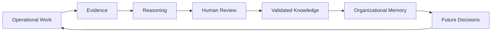
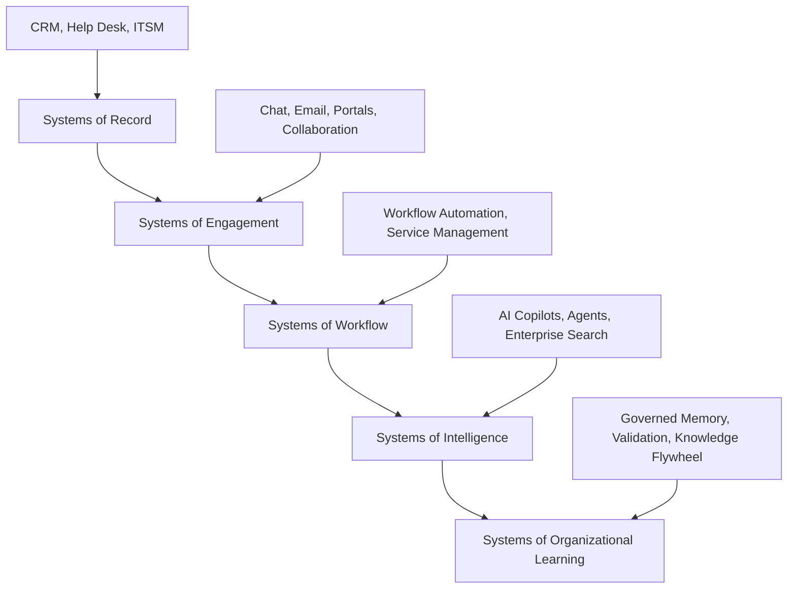
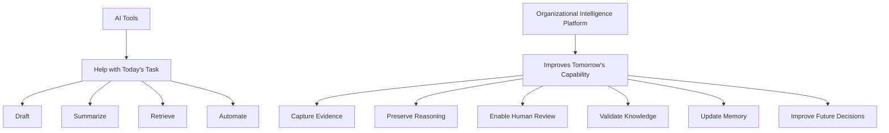
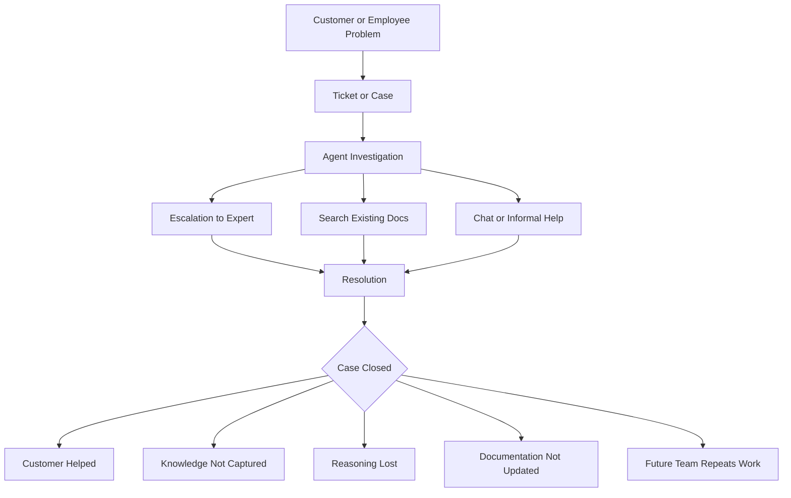
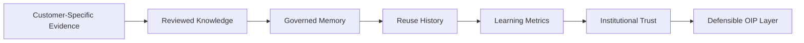
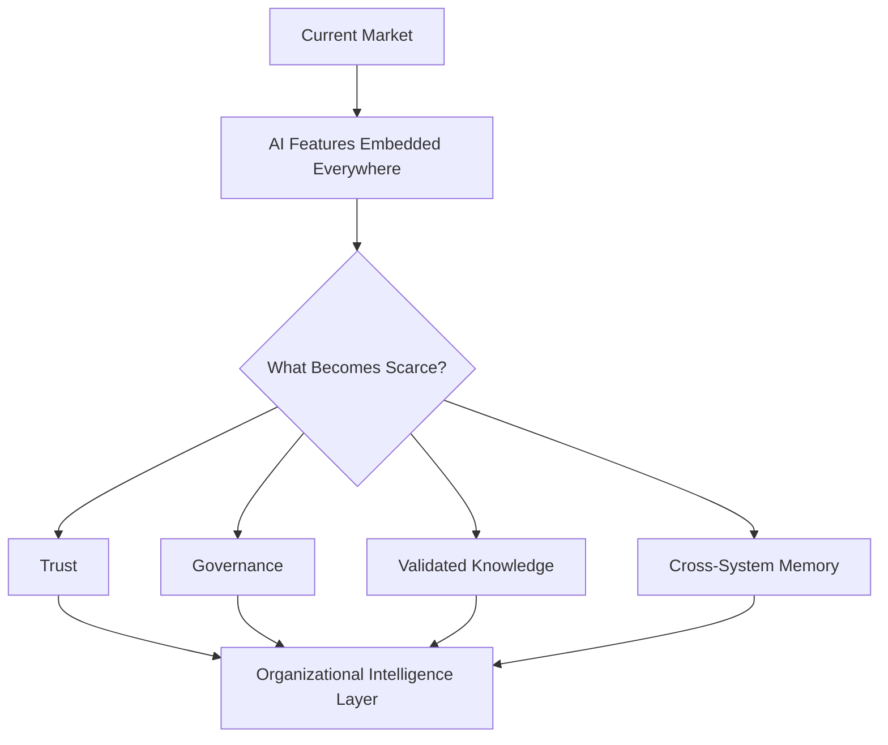

# Competitor Research

## Derived From

- Canon Version: `v1.0.0`
- Architecture Version: `v1.0.0`
- Implementation Version: `v1.0.0`
- Strategy Version: `v1.0.0`
- Research Methodology Version: `v1.0.0`
- Market Research Version: `v1.0.0`
- Customer Discovery Version: `v1.0.0`
- Support Industry Research Version: `v1.0.0`

### Primary Repository Sources

- [Canon](../canon/README.md)
- [Architecture](../architecture/README.md)
- [Implementation](../implementation/README.md)
- [Strategy](../strategy/README.md)
- [Research Methodology](./00_RESEARCH_METHODOLOGY.md)
- [Market Research](./01_MARKET_RESEARCH.md)
- [Customer Discovery](./02_CUSTOMER_DISCOVERY.md)
- [Support Industry Research](./03_SUPPORT_INDUSTRY_RESEARCH.md)

---

Status: **Active**

## Primary Research Question

Do existing enterprise software categories and leading vendors already solve the core problems addressed by the Organizational Intelligence Platform, or is there a meaningful and defensible gap that justifies a new category?

This is an objective research document. It is not a marketing comparison, sales battlecard, product positioning page, or criticism of existing vendors.

The purpose is to understand the competitive landscape, identify where existing categories are strong, identify what remains unsolved, and evaluate whether Organizational Intelligence represents a feature, a product, or a genuinely differentiated enterprise software category.

## 1. Executive Summary

## Research Objective

This report evaluates whether existing enterprise software categories already solve the core problem addressed by the Organizational Intelligence Platform:

> Organizations perform knowledge-intensive work every day, but much of the knowledge created through that work fails to become governed, reusable, institutional capability.

The research investigates adjacent categories including help desk platforms, CRM, knowledge management, enterprise search, AI copilots, AI agents, workflow automation, process intelligence, collaboration platforms, and documentation platforms.

## Methodology Summary

This report follows the company's AI-Assisted Multi-Source Research methodology in a limited initial form:

- Repository review across Canon, Architecture, Implementation, Strategy, and prior Research documents.
- AI-assisted synthesis using Codex/ChatGPT.
- Public source review across vendor websites, product documentation, analyst-facing sources, market reports, and industry news.
- Category-level analysis instead of feature-by-feature product comparison.
- Confidence classification for major findings.

The report does not include proprietary roadmap access, paid analyst reports, direct customer implementation data, customer interviews, or full hands-on product testing. These limitations materially affect confidence levels.

## Major Findings

| Finding | Interpretation | Confidence |
| --- | --- | --- |
| Existing categories solve important parts of the problem: ticketing, CRM context, documentation, search, collaboration, automation, and AI assistance. | Competitors are not weak; the market is sophisticated and actively evolving. | Level B |
| No single established category consistently centers governed organizational learning as its primary purpose. | This supports potential competitive whitespace for OIP. | Level B |
| AI copilots and agents are rapidly becoming embedded in existing enterprise platforms. | OIP cannot differentiate merely by using AI. | Level A |
| Enterprise search and knowledge assistants address access to information, but retrieval is not the same as validation, memory, governance, and learning. | OIP differentiation depends on turning work into validated organizational capability. | Level B |
| Help desk and CRM platforms are strong systems of record and engagement, but usually optimize work execution before institutional learning. | OIP should complement, not replace, these platforms. | Level B |
| Incumbents are credible threats because they control workflow, data, distribution, and budgets. | OIP must integrate deeply and articulate a category-level gap. | Level B |
| Indonesia presents opportunity because digital transformation and AI adoption are growing, but budget sensitivity, partner dependence, implementation maturity, and governance gaps are significant. | Local GTM must be pragmatic and evidence-driven. | Level C |

## Overall Conclusion

Current evidence supports the existence of **meaningful competitive whitespace** for an Organizational Intelligence Platform, but the whitespace is not guaranteed or uncontested.

The strongest interpretation is:

> Organizational Intelligence is not merely a feature if it becomes the governed system that transforms operational work into validated organizational memory and institutional learning across systems.

However:

- If OIP is implemented only as AI search, it will compete directly with enterprise search.
- If OIP is implemented only as ticket summarization, it will become a help desk feature.
- If OIP is implemented only as an AI chatbot, it will be commoditized quickly.
- If OIP is implemented only as workflow automation, it will compete with mature workflow platforms.

The defensible category position depends on owning the cross-system learning loop:

Confidence in competitive whitespace: **Level B**.

Confidence in OIP as a recognized market category today: **Level C**.

Confidence in durable commercial defensibility without primary customer validation: **Level C**.

## 2. Research Scope

This research evaluates adjacent software categories, not every vendor in the market.

## Included Categories

| Category | Included Because |
| --- | --- |
| Help Desk Platforms | They own support workflows, tickets, case history, agent productivity, and customer service operations. |
| CRM | They own customer records, customer context, account history, sales/service relationships, and customer lifecycle data. |
| Knowledge Management | They own documentation, articles, internal knowledge, governance workflows, and knowledge access. |
| Enterprise Search | They address information discovery across enterprise systems. |
| AI Copilots | They provide embedded AI assistance inside existing workflows. |
| AI Agents | They execute or automate tasks with increasing autonomy. |
| Workflow Automation | They coordinate processes across teams and systems. |
| Process Intelligence | They analyze process execution, bottlenecks, and operational performance. |
| Collaboration Platforms | They hold informal knowledge, conversations, decisions, and coordination signals. |
| Documentation Platforms | They store and publish structured knowledge, product documentation, internal wikis, and policies. |

## Representative Vendors

This report uses representative vendors to understand category movement:

- Zendesk.
- Freshdesk.
- Salesforce Service Cloud.
- ServiceNow.
- Atlassian.
- Microsoft.
- Notion.
- Confluence.
- Intercom / Fin.
- HubSpot.

The list is intentionally not exhaustive. It does not include every regional vendor, niche AI startup, knowledge management platform, call center platform, process mining vendor, or enterprise search provider.

## Excluded From This Version

| Exclusion | Reason |
| --- | --- |
| Full feature-by-feature product comparison | The goal is category understanding, not a buyer evaluation matrix. |
| Pricing benchmarking | Pricing belongs in pricing strategy and go-to-market research. |
| Hands-on product testing | Not available in this research cycle. |
| Proprietary analyst reports | Not accessible in this repository context. |
| Direct customer review mining at scale | Requires a separate review-analysis study. |
| Exhaustive Indonesia vendor directory | Local competitive mapping should be expanded in a dedicated GTM research sprint. |

## 3. Research Methodology

## AI Systems Consulted

| System | Role |
| --- | --- |
| Codex / ChatGPT | Repository review, public-source synthesis, competitive category analysis, drafting, and internal consistency checking. |

This version does not yet include parallel model validation using Claude, Gemini, Perplexity, or other AAMR tools. That should be added before using this research for major fundraising, pricing, or market-entry decisions.

## Public Sources Reviewed

| Source | Research Use |
| --- | --- |
| [Zendesk AI Platform](https://www.zendesk.com/service/ai/) | Understand AI agents, copilots, automation, QA, and customer service AI positioning. |
| [Zendesk Resolution Platform](https://www.zendesk.com/) | Understand Zendesk's movement toward AI-powered resolution and learning from interactions. |
| [Salesforce Service Cloud](https://www.salesforce.com/service/cloud/) | Understand Salesforce's service platform, Agentforce, CRM data integration, and service automation strategy. |
| [Salesforce Agentforce Contact Center](https://www.salesforce.com/news/stories/agentforce-contact-center-announcement/) | Understand Salesforce's AI contact center direction and AI-to-human handoff model. |
| [ServiceNow Knowledge Center](https://www.servicenow.com/platform/knowledge-management.html) | Understand ServiceNow's knowledge management and self-service capabilities. |
| [ServiceNow Partner Finder](https://www.servicenow.com/partners/partner-finder.html) | Understand enterprise implementation ecosystem and platform partner strategy. |
| [Freshdesk](https://www.freshworks.com/freshdesk/) | Understand Freshdesk's customer service platform and AI-powered support positioning. |
| [Freshworks Freddy AI Automation](https://www.freshworks.com/freshdesk/omni/freddy-ai-automation/) | Understand Freshworks AI agent, automation, and support productivity claims. |
| [Freshdesk Freddy AI Feature Overview](https://support.freshdesk.com/support/solutions/articles/50000010359-overview-of-freddy-ai-for-ticketing) | Understand documented Freddy AI capabilities. |
| [Jira Service Management AI Guide](https://www.atlassian.com/software/jira/service-management/product-guide/tips-and-tricks/artificial-intelligence) | Understand Atlassian AI and Rovo features in service management. |
| [Atlassian Rovo](https://www.atlassian.com/software/rovo) | Understand organizational knowledge search, chat, and agents across Atlassian. |
| [Atlassian AI Trust](https://www.atlassian.com/trust/ai) | Understand AI governance and data-control commitments. |
| [Microsoft Dynamics 365 Customer Service Overview](https://learn.microsoft.com/en-us/dynamics365/customer-service/implement/overview) | Understand Microsoft Copilot agents in customer service. |
| [Microsoft Dynamics 365 Customer Service](https://www.microsoft.com/en-us/dynamics-365/products/customer-service) | Understand customer service AI, case context, diagnosis, response drafting, and knowledge recommendation. |
| [Microsoft Service Agent in Microsoft 365 Copilot](https://www.microsoft.com/en-us/dynamics-365/blog/it-professional/2026/03/31/service-agent-microsoft-365-copilot/) | Understand Microsoft's service-specific agent inside Microsoft 365 Copilot. |
| [Notion](https://www.notion.com/) | Understand Notion's AI workspace and agents for knowledge capture and work automation. |
| [Notion Pricing](https://www.notion.com/pricing) | Understand Notion's agent and credit-based AI direction. |
| [Confluence Rovo AI](https://www.atlassian.com/software/confluence/ai) | Understand AI features attached to enterprise documentation and collaboration. |
| [HubSpot Breeze AI](https://www.hubspot.com/products/artificial-intelligence) | Understand embedded AI agents across CRM, sales, marketing, and service. |
| [HubSpot Service Hub](https://www.hubspot.com/products/service) | Understand HubSpot customer service platform and CRM-linked service model. |
| [Glean](https://www.glean.com/) | Understand Work AI, enterprise search, agents, assistant, and governance framing. |
| [Glean Enterprise Search and Knowledge Discovery](https://www.glean.com/resources/guides/glean-ai-enterprise-search-knowledge-discovery) | Understand enterprise search, permissions, governance, and referenceability claims. |
| [Indonesia Digital Transformation - International Trade Administration](https://www.trade.gov/market-intelligence/indonesia-digital-transformation) | Understand Indonesia digital transformation and AI adoption context. |
| [IBM Indonesia AI Study](https://asean.newsroom.ibm.com/2025-06-04-IBM-Study-Indonesia-Businesses-Primed-for-AI%2C-But-Face-Gaps-in-Security%2C-Infrastructure%2C-Ethics-and-Talent) | Understand Indonesia AI readiness, operational gains, and governance gaps. |
| [Salesforce Indonesia Service Transformation](https://www.salesforce.com/ap/blog/ai-is-leading-the-charge-in-indonesias-customer-service-transformation/) | Understand customer service and AI adoption context in Indonesia. |
| [Trees Solutions Zendesk Jakarta](https://www.treessolutions.com/products-zendesk) | Understand local Zendesk implementation or reseller presence in Indonesia. |
| [EY Indonesia ServiceNow Alliance](https://www.ey.com/en_id/alliances/servicenow) | Understand local enterprise partner ecosystem for ServiceNow in Indonesia. |
| [TechCrunch: Salesforce Acquires Fin](https://techcrunch.com/2026/06/15/salesforce-acquires-ai-customer-service-platform-fin-for-3-6b/) | Understand market consolidation around AI customer service. |
| [TechRadar: Zendesk AI Agents Expansion](https://www.techradar.com/pro/zendesk-expands-ai-agents-across-chatgpt-gemini-voice-and-messaging) | Understand AI agent expansion across channels and platforms. |

## Evidence Confidence Levels

| Level | Meaning |
| --- | --- |
| Level A | Directly observed, strongly documented, or supported by multiple high-quality sources. |
| Level B | Strongly supported by public evidence and category analysis, but lacking direct customer validation. |
| Level C | Plausible interpretation or emerging trend requiring further validation. |
| Level D | Unknown, speculative, or insufficiently evidenced. |

## 4. Competitive Landscape

Enterprise software is converging around AI-assisted work. Many categories now claim to help employees find answers, automate tasks, summarize work, and improve decisions.

The competitive landscape can be understood as overlapping systems:

Most established categories are strong at one or more layers. The OIP thesis is that a missing layer exists above operational execution:

> A governed learning layer that converts validated work into organizational memory and future capability.

## Category Analysis

| Category | Primary Purpose | Strengths | Limitations | Relationship to OIP |
| --- | --- | --- | --- | --- |
| Help Desk Platforms | Manage customer support requests, tickets, routing, SLAs, agent work, and service channels. | Deep support workflow ownership; strong operational adoption; rich case histories. | Often optimize resolution workflow more than institutional learning. | OIP complements by turning resolved cases into validated memory and reusable knowledge. |
| CRM | Manage customer records, accounts, relationships, interactions, pipeline, service history, and customer context. | Central customer context; strong executive relevance; broad enterprise adoption. | Customer context does not automatically become organizational learning. | OIP can use CRM context as evidence while preserving domain learning across systems. |
| Knowledge Management | Create, store, verify, publish, and manage organizational knowledge. | Strong documentation and content governance. | Often separated from real-time operational evidence and case workflows. | OIP can connect knowledge management to work-derived validation loops. |
| Enterprise Search | Retrieve information across systems. | Broad discovery; connector ecosystems; permissions awareness. | Finding information is not the same as validating, governing, or learning from decisions. | OIP can use search as input, but must add review, memory, and learning. |
| AI Copilots | Assist users inside workflows through summarization, drafting, retrieval, and recommendations. | Embedded in daily tools; immediate productivity value. | Often user-level productivity tools rather than organizational memory systems. | OIP can convert copilot outputs and human decisions into governed knowledge. |
| AI Agents | Execute tasks, answer questions, take actions, and automate workflows. | Strong potential for automation and service scale. | Autonomy without validation can create trust, governance, and accountability risk. | OIP should govern what agents learn, remember, and reuse. |
| Workflow Automation | Coordinate processes, approvals, notifications, and system actions. | Strong repeatability and operational efficiency. | Process execution does not guarantee knowledge accumulation. | OIP can learn from workflow outcomes and update future decision context. |
| Process Intelligence | Analyze process performance, bottlenecks, exceptions, and variants. | Strong operational analytics. | Typically focuses on process optimization rather than semantic knowledge and memory. | OIP can incorporate process signals into learning and governance. |
| Collaboration Platforms | Enable communication, coordination, and informal decision-making. | Where real knowledge often appears first. | Conversations are noisy, ephemeral, and weakly governed. | OIP can extract learning candidates while preserving review discipline. |
| Documentation Platforms | Store structured documents, wikis, manuals, and internal guides. | Durable content and knowledge publishing. | Documentation can decay and disconnect from real work. | OIP can detect gaps and propose updates from validated operations. |

## Key Competitive Insight

The market is not empty. It is crowded at the operational, collaboration, documentation, search, and AI-assistance layers.

The possible OIP gap is narrower and more strategic:

> Existing categories help organizations do work, find information, automate tasks, or document knowledge. OIP must prove it helps organizations learn from work in a governed, repeatable, cross-system way.

## 5. Representative Vendor Analysis

This section uses representative vendors to understand category movement. It does not rank vendors or claim direct superiority.

## Zendesk

| Dimension | Analysis |
| --- | --- |
| Core value proposition | AI-powered service platform for customer support, customer conversations, agent productivity, automation, and resolution. |
| Strengths | Strong help desk heritage, support-specific workflows, omnichannel service, AI agents, automation, quality assurance, analytics, and broad customer service brand recognition. |
| Typical customers | Support teams ranging from startups and mid-market companies to larger enterprises with customer service operations. |
| Relevant capabilities | Ticketing, messaging, help center, AI agents, copilots, automation, quality tools, reporting, and customer interaction management. |
| OIP complement | OIP should not replace Zendesk. It can learn from resolved tickets, review patterns, escalations, knowledge gaps, and validated outcomes across Zendesk and adjacent systems. |

Zendesk is a serious competitive reference because it increasingly frames service around AI-powered resolution and learning from interactions. This narrows the whitespace for support-specific OIP claims.

The OIP distinction must therefore be cross-system organizational learning, not generic AI support automation.

## Freshdesk

| Dimension | Analysis |
| --- | --- |
| Core value proposition | Accessible AI-powered customer service platform designed for fast setup, agent productivity, and customer support automation. |
| Strengths | Ease of use, SMB and mid-market appeal, Freshworks ecosystem, Freddy AI, automation, ticketing, and relatively approachable adoption. |
| Typical customers | SMB, mid-market, growth-stage companies, and teams seeking lower complexity than enterprise-heavy alternatives. |
| Relevant capabilities | Ticketing, omnichannel support, Freddy AI, automation, AI assistance, customer portals, and service operations. |
| OIP complement | OIP can serve customers that need deeper governed learning across support, product, documentation, and operations without displacing Freshdesk as the service desk. |

Freshdesk is a competitive threat in cost-sensitive markets, including Indonesia, because it combines affordability, speed, and practical AI claims. OIP must avoid becoming a premium layer without measurable value.

## Salesforce Service Cloud

| Dimension | Analysis |
| --- | --- |
| Core value proposition | AI-powered customer service deeply connected to CRM data, customer relationships, service operations, and enterprise workflows. |
| Strengths | CRM dominance, enterprise trust, Data Cloud, Agentforce, broad ecosystem, integration, partner network, and executive-level relevance. |
| Typical customers | Mid-market and enterprise organizations already invested in Salesforce or needing customer lifecycle integration. |
| Relevant capabilities | Service Cloud, Agentforce, AI agents, contact center, case management, knowledge, automation, customer data, service analytics, and workflows. |
| OIP complement | OIP can sit across Salesforce and non-Salesforce systems as a memory and learning layer, especially where organizational knowledge extends beyond CRM. |

Salesforce is one of the most important threats because it can embed AI and memory-like capabilities directly into CRM and service workflows. Its distribution advantage is substantial.

OIP differentiation must emphasize neutrality, cross-system learning, and governed knowledge that is not bound to one CRM universe.

## ServiceNow

| Dimension | Analysis |
| --- | --- |
| Core value proposition | Enterprise workflow and service management platform for IT, employee workflows, customer service, operations, governance, and automation. |
| Strengths | Strong enterprise workflow engine, ITSM leadership, service catalog maturity, process orchestration, automation, knowledge management, partner ecosystem, and enterprise implementation depth. |
| Typical customers | Large enterprises, regulated organizations, IT-heavy operations, shared services, and organizations standardizing workflows at scale. |
| Relevant capabilities | ITSM, Customer Service Management, Knowledge Center, AI Platform, workflow automation, employee workflows, governance, and partner-led implementations. |
| OIP complement | OIP can integrate with ServiceNow workflows and learn from service outcomes, knowledge articles, approvals, incidents, and escalations across systems. |

ServiceNow is a credible long-term competitor because its platform already spans workflows, service management, knowledge, AI, and governance. It is likely to expand further into organizational intelligence-like territory.

The OIP distinction must be semantic learning and organizational memory as the central category purpose, not workflow automation alone.

## Atlassian

| Dimension | Analysis |
| --- | --- |
| Core value proposition | Teamwork, software development, service management, documentation, enterprise search, and AI-enabled collaboration across Jira, Confluence, and Rovo. |
| Strengths | Developer and product team adoption, Jira workflows, Confluence documentation, Jira Service Management, Rovo search/chat/agents, and strong team-level knowledge footprint. |
| Typical customers | Software teams, IT teams, product organizations, engineering-led companies, and enterprises using Jira/Confluence. |
| Relevant capabilities | Jira Service Management, Confluence, Rovo Search, Rovo Chat, Rovo Agents, AI trust controls, service portals, and knowledge integration. |
| OIP complement | OIP can learn from Atlassian work artifacts and validated decisions while operating across non-Atlassian domains and executive knowledge workflows. |

Atlassian is especially relevant because it combines workflow, documentation, service management, and organizational knowledge search. For engineering and IT-heavy customers, it may already feel close to an OIP-adjacent stack.

OIP must show why knowledge flywheel governance across enterprise functions is different from team collaboration plus AI search.

## Microsoft

| Dimension | Analysis |
| --- | --- |
| Core value proposition | Enterprise productivity, collaboration, CRM/service, identity, security, cloud, and Copilot embedded across work. |
| Strengths | Ubiquitous enterprise footprint, Microsoft 365, Teams, Dynamics 365, Power Platform, Azure, identity, compliance, and Copilot distribution. |
| Typical customers | Broad enterprise, public sector, mid-market, regulated organizations, and Microsoft-standardized companies. |
| Relevant capabilities | Dynamics 365 Customer Service, Microsoft 365 Copilot, service-specific agents, Teams, SharePoint, Power Automate, knowledge recommendations, case summaries, and enterprise security. |
| OIP complement | OIP must integrate with Microsoft environments and avoid competing directly with productivity copilots. It can provide cross-domain learning and memory governance above everyday productivity tools. |

Microsoft is arguably the most serious platform threat because it can embed AI into existing daily work surfaces at enormous scale. Many organizations may prefer to extend Microsoft rather than add a new system.

OIP must therefore prove a specific organizational learning function that general productivity copilots do not fully provide.

## Notion

| Dimension | Analysis |
| --- | --- |
| Core value proposition | AI workspace for documents, databases, projects, team knowledge, and agents that help manage work. |
| Strengths | Flexible workspace, strong user experience, knowledge capture, lightweight databases, AI agents, collaboration, and team adoption. |
| Typical customers | Startups, product teams, knowledge workers, small to mid-sized companies, and increasingly enterprise teams. |
| Relevant capabilities | Docs, wikis, databases, AI workspace, custom agents, connected apps, and project collaboration. |
| OIP complement | OIP can treat Notion as a documentation or workspace source while adding governed validation, evidence trails, and enterprise memory across operational systems. |

Notion is strong at flexible knowledge creation and collaboration. Its risk to OIP is strongest in smaller organizations that may prefer a flexible all-in-one workspace over a specialized organizational memory layer.

OIP must be more rigorous than a workspace. It must handle governed evidence, review, traceability, and operational learning.

## Confluence

| Dimension | Analysis |
| --- | --- |
| Core value proposition | Team documentation, internal knowledge, collaboration, and enterprise wiki capabilities within the Atlassian ecosystem. |
| Strengths | Mature documentation culture, integration with Jira, enterprise controls, knowledge publishing, and Rovo AI features. |
| Typical customers | Engineering, IT, product, operations, and enterprise teams using Atlassian products. |
| Relevant capabilities | Pages, spaces, templates, documentation, knowledge base, comments, permissions, Rovo AI, and Jira integration. |
| OIP complement | OIP can identify which Confluence content is validated, outdated, contradicted by operational evidence, or ready to be updated from support work. |

Confluence is often where organizational knowledge is intended to live. The OIP opportunity is to connect Confluence knowledge to real operational evidence and validation, rather than treating pages as static truth.

## Intercom / Fin

| Dimension | Analysis |
| --- | --- |
| Core value proposition | AI-first customer service and customer communication platform centered around Fin AI Agent and modern support experiences. |
| Strengths | AI agent focus, customer messaging, support automation, strong product design, customer-facing AI experience, and support deflection. |
| Typical customers | Digital-first companies, SaaS businesses, customer support teams, and companies emphasizing conversational support. |
| Relevant capabilities | AI agent, customer messaging, help desk, omnichannel support, handoffs, customer interactions, and support automation. |
| OIP complement | OIP can learn from Fin or Intercom interactions while addressing broader organizational memory beyond customer conversation resolution. |

Intercom / Fin is a major signal that AI customer service is consolidating and becoming strategically important. The reported Salesforce acquisition of Fin increases the likelihood that AI support agents become part of broader enterprise platforms.

OIP cannot differentiate by claiming "AI for support." It must differentiate by preserving validated organizational learning across support, product, knowledge, and operations.

## HubSpot

| Dimension | Analysis |
| --- | --- |
| Core value proposition | Unified CRM platform for marketing, sales, service, content, and customer growth, with Breeze AI embedded across workflows. |
| Strengths | SMB and mid-market adoption, ease of use, CRM integration, Service Hub, marketing/sales/service connection, embedded AI agents, and broad app ecosystem. |
| Typical customers | SMB, mid-market, growth companies, and teams seeking an integrated customer platform. |
| Relevant capabilities | Service Hub, CRM, Breeze AI, customer agent, knowledge base agent, ticketing, help desk, automation, and customer data. |
| OIP complement | OIP can help HubSpot customers convert service and customer operations into governed knowledge and memory once their workflows become more complex. |

HubSpot is especially relevant for early-stage and mid-market customers because it may offer enough AI, service, and knowledge functionality for many teams. OIP must target organizations whose knowledge complexity exceeds the capabilities of simple embedded AI.

## 6. Enterprise AI Landscape

Enterprise AI is moving from standalone tools toward embedded assistants, copilots, and agents inside core platforms.

## AI System Types

| AI Type | Primary Function | Strength | Limitation Relative to OIP |
| --- | --- | --- | --- |
| AI Copilot | Assists a human user with drafting, summarizing, searching, and recommending. | Strong productivity value inside existing workflows. | Usually focused on individual or workflow-level assistance, not organizational learning as a governed system. |
| AI Assistant | Answers questions and retrieves context from documents or systems. | Reduces search effort and improves access. | May answer from stale, unvalidated, or fragmented knowledge. |
| Autonomous Agent | Executes tasks, resolves requests, or takes actions across systems. | Can automate repeatable work and scale operations. | Requires governance, validation, accountability, and memory management. |
| Retrieval System | Finds relevant content using search, embeddings, permissions, or knowledge graphs. | Essential for knowledge access. | Retrieval does not prove correctness, authority, freshness, or reuse value. |
| Enterprise Search | Connects and searches across enterprise systems. | Broad information access and permission awareness. | Does not necessarily capture learning from resolved work. |
| Knowledge Assistant | Answers questions from curated knowledge sources. | Helpful for employees and customers. | Often depends on existing knowledge quality rather than improving the knowledge system itself. |

## How These Differ From OIP

The OIP distinction is not that it uses a better model. Models will change, commoditize, and become embedded everywhere.

The distinction is architectural and organizational:

AI systems can be part of OIP, but AI alone is not OIP.

## Enterprise AI Competitive Reality

| Reality | Implication |
| --- | --- |
| Copilots are becoming table stakes. | OIP cannot compete on generic summarization or drafting. |
| Agents are becoming embedded in platforms. | OIP must govern agent learning and memory rather than simply launch another agent. |
| Enterprise search is becoming AI-native. | OIP must distinguish memory and validation from retrieval. |
| Platform vendors own distribution. | OIP must integrate and complement rather than force immediate replacement. |
| Governance is becoming a buying requirement. | OIP should treat governance as architecture, not a compliance afterthought. |

## 7. Category Comparison

The most useful comparison is between category functions, not vendor features.

## Enterprise System Matrix

| Dimension | System of Record | System of Engagement | System of Workflow | System of Intelligence | System of Organizational Learning |
| --- | --- | --- | --- | --- | --- |
| Primary job | Store authoritative records. | Manage interactions. | Coordinate tasks and processes. | Assist decisions and actions. | Convert work into durable capability. |
| Examples | CRM, help desk, ITSM, ERP. | Chat, email, portals, customer messaging. | Workflow automation, service management. | Copilots, agents, enterprise search. | OIP category thesis. |
| Organizational Memory | Partial; records exist but are not necessarily learning assets. | Low; conversations are often ephemeral. | Partial; process history exists. | Partial; may use context but not govern memory. | Core purpose. |
| Governance | Data and access governance. | Communication policies. | Process governance. | AI governance emerging. | Knowledge and learning governance by design. |
| Explainability | Record history, audit logs. | Conversation history. | Workflow logs. | Citations, traces, model explanations vary. | Evidence, reasoning, validation, and lineage. |
| Human Review | Operational approvals. | Human participation. | Approval workflows. | Human-in-the-loop varies. | Core architectural principle. |
| Continuous Learning | Usually indirect. | Weak unless mined. | Process improvement possible. | Model or agent improvement possible. | Primary loop. |
| Cross-System Intelligence | Limited to integration scope. | Limited. | Moderate. | Increasing. | Required. |

## Capability Comparison Matrix

| Capability | Help Desk | CRM | KM | Enterprise Search | AI Copilot | AI Agent | Workflow Automation | OIP |
| --- | --- | --- | --- | --- | --- | --- | --- | --- |
| Case or work capture | High | Medium | Low | Low | Low | Medium | Medium | High |
| Customer or business context | Medium | High | Low | Medium | Medium | Medium | Medium | High through integration |
| Knowledge authoring | Medium | Low | High | Low | Medium | Medium | Low | Medium |
| Knowledge retrieval | Medium | Medium | High | High | High | High | Low | High |
| Evidence preservation | Medium | Medium | Low | Low | Medium | Medium | Medium | High |
| Human validation | Medium | Low | Medium | Low | Variable | Variable | Medium | High |
| Governance | Medium | High | Medium | Medium | Emerging | Emerging | Medium | High |
| Explainability | Medium | Medium | Medium | Medium | Variable | Variable | Medium | High |
| Organizational memory | Medium | Medium | Medium | Medium | Low to Medium | Low to Medium | Medium | High |
| Knowledge Flywheel | Low to Medium | Low | Medium | Low | Low | Low to Medium | Low to Medium | High |

Interpretation: many categories provide partial capabilities. OIP differentiation depends on combining them around governed organizational learning rather than treating them as isolated features.

## 8. Competitive Gap Analysis

## Problems That Remain Unsolved

| Problem | Why It Persists | Strategic Importance |
| --- | --- | --- |
| Knowledge disappears after work is completed. | Work systems optimize closure, not learning. | Core OIP opportunity. |
| Reasoning is not preserved. | Final answers are easier to store than decision context. | Explainability and future reuse suffer. |
| Evidence is fragmented across systems. | CRM, tickets, docs, chat, logs, and product systems each hold partial truth. | Cross-system intelligence gap. |
| Knowledge is found but not validated. | Search retrieves content but does not establish authority or freshness. | Trust and governance gap. |
| Human review is operational, not epistemic. | Approvals confirm actions but rarely certify reusable knowledge. | OIP must formalize review of knowledge. |
| AI outputs are not organizational memory. | Generated answers may be transient and ungoverned. | Prevents compounding learning. |
| Documentation decays. | Workflows do not reliably detect when docs become stale. | Knowledge quality gap. |
| Experts remain bottlenecks. | Expertise is not converted into reusable capabilities fast enough. | Scaling and retention issue. |
| Cross-functional learning is weak. | Support, product, engineering, sales, success, and operations learn separately. | Strategic learning gap. |

## Where Organizational Knowledge Disappears

## Missing Capabilities

| Missing Capability | Operational or Strategic Gap? | OIP Relevance |
| --- | --- | --- |
| Cross-system evidence graph | Strategic | Establishes context and lineage across tools. |
| Reusable reasoning capture | Strategic | Preserves how decisions are made, not just what answer was given. |
| Human-reviewed learning candidates | Strategic | Converts resolved work into trusted memory. |
| Memory quality lifecycle | Strategic | Tracks freshness, conflict, usage, and validation. |
| Knowledge contradiction detection | Strategic | Identifies when existing guidance conflicts with new evidence. |
| Domain language governance | Strategic | Keeps concepts consistent across products, workflows, and teams. |
| Learning metrics | Strategic | Measures whether the organization is becoming more capable. |
| Integration with existing systems of record | Operational | Required for adoption and evidence access. |
| Workflow-native review | Operational | Required to avoid adding heavy manual process. |

## Category Assumptions That Limit Existing Software

| Existing Category Assumption | Limitation |
| --- | --- |
| Help desk: the unit of value is a resolved ticket. | The organization may resolve the same ticket type repeatedly without learning. |
| CRM: the unit of value is the customer record. | Customer context is preserved, but operational knowledge may remain fragmented. |
| KM: the unit of value is the article or document. | Knowledge can become detached from live evidence and validation. |
| Search: the unit of value is retrieved information. | Retrieval does not equal truth, authority, or institutional capability. |
| Copilot: the unit of value is user productivity. | Individual productivity gains may not compound into organizational memory. |
| Agent: the unit of value is autonomous task completion. | Completed tasks may not become governed learning. |
| Workflow automation: the unit of value is process efficiency. | Faster process execution does not guarantee smarter future decisions. |

## 9. Competitive Threat Assessment

OIP faces serious threats from incumbents and adjacent categories.

## Threat Matrix

| Threat | Likelihood | Impact | Assessment | Mitigation |
| --- | --- | --- | --- | --- |
| Incumbents add AI learning features | High | High | Help desk, CRM, ITSM, and collaboration platforms are already embedding AI agents and memory-like capabilities. | Differentiate around cross-system governed organizational learning, not single-platform AI. |
| Platform consolidation | High | High | Large vendors can acquire AI support or knowledge platforms and bundle features. | Build neutral interoperability and domain-specific learning depth. |
| AI model commoditization | High | Medium | Model access will not be defensible. | Defend through memory, review workflows, data lineage, governance, and customer-specific knowledge. |
| Native enterprise copilots | High | High | Microsoft, Google, Salesforce, Atlassian, and ServiceNow can place AI inside daily workflows. | Complement copilots by governing what the organization learns from work. |
| Workflow platform expansion | Medium | High | ServiceNow, Salesforce, Atlassian, Microsoft, and others can expand workflow intelligence. | Focus on semantic learning and memory across workflows. |
| Knowledge platform evolution | Medium | Medium | KM tools can add AI validation and workflow integration. | Build stronger evidence-to-memory loop and domain models. |
| Buyer confusion | High | Medium | Buyers may see OIP as another AI assistant, chatbot, or knowledge base. | Use precise positioning and proof through pilots. |
| Budget absorption by incumbents | Medium | High | Existing platform budgets may consume AI spend. | Start with measurable use cases and integrate with installed systems. |
| Data access barriers | Medium | High | OIP needs access to sensitive case, CRM, docs, and collaboration data. | Design security, permissions, audit, and data minimization from the beginning. |

## Competitive Threat Interpretation

The strongest threat is not a startup building the same thing. It is incumbents expanding from their installed base into organizational intelligence-like capabilities.

This makes the OIP strategy dependent on:

- Category clarity.
- Integration-first architecture.
- Strong domain language.
- Human review as trust mechanism.
- Cross-system memory.
- Measurable learning outcomes.
- Avoiding generic AI claims.

## 10. Sustainable Differentiation

This section critically evaluates whether OIP differentiation can be durable.

## Potential Differentiators

| Differentiator | Why It Matters | Difficulty to Replicate | Critical Assessment |
| --- | --- | --- | --- |
| Organizational Memory | Accumulates validated institutional knowledge over time. | Medium to High | Durable only if memory is governed, useful, and difficult to move. |
| Knowledge Flywheel | Turns repeated work into progressively better decisions. | Medium | Easy to describe, harder to operationalize across systems and teams. |
| Human Review | Creates trust, accountability, and quality control. | Medium | Incumbents can add review; defensibility depends on workflow design and adoption. |
| Governance | Makes AI outputs auditable, secure, and enterprise-acceptable. | Medium | Necessary but not sufficient; many incumbents will invest here. |
| Explainability | Preserves evidence, reasoning, and lineage. | Medium to High | Strong if deeply embedded in the memory model. |
| Cross-system intelligence | Connects tickets, docs, CRM, chat, product data, and workflows. | High | Technically and politically difficult; strong differentiator if executed. |
| Institutional learning metrics | Measures whether capability improves over time. | Medium | Less common today; could become category-defining if linked to outcomes. |
| Domain model consistency | Preserves meaning across product, workflow, architecture, and AI. | Medium | Durable if the platform becomes the semantic layer for the organization. |

## Differentiation Must Be Earned

The words "organizational memory" and "knowledge flywheel" are not defensible by themselves. They become defensible only if the product creates behavior and accumulated assets that competitors cannot easily copy.

## Defensibility Requirements

| Requirement | Why It Matters |
| --- | --- |
| Proprietary customer memory | The platform becomes more valuable as it accumulates validated knowledge specific to the organization. |
| Workflow-embedded review | Validation happens naturally inside work, not as extra administrative burden. |
| Cross-system lineage | The platform knows where knowledge came from, who validated it, where it was reused, and when it changed. |
| Governance history | Trust accumulates through audit, review, approval, and explainability records. |
| Outcome evidence | The platform can show improvements in resolution time, escalation rate, onboarding, consistency, or decision quality. |
| Integration neutrality | The platform works across customer stacks rather than requiring a single vendor universe. |

## Critical Conclusion

OIP can be differentiated, but not by AI alone. Sustainable differentiation requires a compound asset:

If OIP fails to build that compound asset, it will be absorbed into existing categories.

## 11. Indonesia Competitive Landscape

Indonesia matters because the initial GTM focus is Indonesia. This section is directional and should be expanded with local customer interviews, partner mapping, procurement research, and direct vendor presence analysis.

## Evidence-Based Observations

| Observation | Evidence | Confidence |
| --- | --- | --- |
| Indonesia is actively pursuing digital transformation and AI adoption. | International Trade Administration and IBM Indonesia AI study indicate growing AI and digital transformation interest. | Level B |
| AI governance maturity is still developing. | IBM Indonesia study reports gaps in ethics and governance readiness despite operational optimism. | Level B |
| Global enterprise platforms are present or accessible through regional/local partners. | Salesforce, Zendesk, ServiceNow, and Freshworks sources indicate APAC/global availability and partner ecosystems; local partner examples exist. | Level C |
| Budget sensitivity is likely important. | Indonesia market context, SMB/mid-market structure, and regional purchasing behavior suggest price sensitivity. | Level C |
| Implementation partners matter. | Enterprise platforms such as ServiceNow and Salesforce commonly depend on partner ecosystems; local alliances exist. | Level B |

## Common Enterprise Support Platform Categories in Indonesia

| Platform Type | Likely Examples | Role in Market |
| --- | --- | --- |
| Global help desk platforms | Zendesk, Freshdesk, Intercom / Fin, HubSpot Service Hub. | Used by digital businesses, startups, support teams, and companies seeking omnichannel service. |
| Enterprise CRM/service platforms | Salesforce Service Cloud, Microsoft Dynamics 365, HubSpot. | Used where customer data, sales, service, and account management are connected. |
| ITSM and enterprise workflow platforms | ServiceNow, Jira Service Management, Freshservice. | Used by larger organizations and IT-heavy service operations. |
| Collaboration and documentation platforms | Microsoft 365, Teams, SharePoint, Confluence, Notion. | Hold informal and formal organizational knowledge. |
| Local implementation partners | Consulting firms, resellers, system integrators, digital transformation partners. | Provide implementation, localization, migration, integration, and support. |
| Local or regional support tools | Local CRM/help desk, WhatsApp-first support tools, contact center providers, and custom systems. | May be common in price-sensitive or channel-specific customer segments. |

## Adoption of Representative Platforms

| Vendor | Indonesia Evidence Status | Interpretation |
| --- | --- | --- |
| Zendesk | Local reseller or solution provider pages reference Zendesk in Jakarta; Zendesk is globally accessible. | Likely present in digital support environments, but customer penetration requires further validation. |
| Freshdesk / Freshworks | Global platform with partner ecosystem and affordability positioning. | Potentially attractive in cost-sensitive SMB and mid-market contexts. |
| Salesforce | Salesforce publishes Indonesia-specific customer service and AI transformation content. | Likely relevant for enterprise and upper mid-market customers. |
| ServiceNow | Global enterprise workflow platform with alliance presence through firms such as EY Indonesia. | More likely in large enterprise, ITSM, shared services, and regulated environments. |
| Microsoft | Broad enterprise footprint through Microsoft 365, Teams, Dynamics, Azure, and partner ecosystem. | A major default platform layer for many Indonesian enterprises. |
| Atlassian | Likely present among technology, product, and IT teams through Jira/Confluence. | Relevant for technical support, ITSM, and engineering-heavy customers. |

## Indonesia-Specific Opportunities

| Opportunity | Why It Matters |
| --- | --- |
| WhatsApp and messaging-heavy service habits | OIP can learn from support conversations across common customer channels if integrated responsibly. |
| Rapid digital transformation | Organizations modernizing service operations may be open to new intelligence layers. |
| AI governance gap | OIP's governance and human review principles may address adoption concerns. |
| Support knowledge fragmentation | Growing companies may have knowledge split across chat, spreadsheets, docs, CRM, and help desks. |
| Partner-led adoption | Implementation partners can accelerate trust and localization. |
| Multilingual and local context | Indonesian and English support workflows may create knowledge reuse and translation challenges. |

## Indonesia-Specific Risks

| Risk | Implication |
| --- | --- |
| Budget sensitivity | OIP must prove near-term operational value, not only long-term category logic. |
| Incumbent bundles | Customers may prefer AI features already included in Microsoft, Salesforce, Zendesk, Freshdesk, or ServiceNow. |
| Implementation maturity | Some organizations may lack clean workflows, data discipline, or knowledge governance. |
| Data residency and security concerns | Enterprise and regulated customers may require strict controls. |
| Partner dependence | Local trust and integration may require channel strategy. |
| Category unfamiliarity | "Organizational Intelligence Platform" may need education and problem-first selling. |

## Indonesia Research Conclusion

Indonesia appears promising but not automatically easy.

The strongest initial Indonesian targets are likely:

- Digitally mature B2B companies.
- SaaS or technology-enabled businesses.
- Enterprise support or IT service teams with meaningful ticket volume.
- Organizations already investing in AI, knowledge management, service quality, or customer experience.
- Teams with strong pain around repeated support issues, onboarding, expert dependency, or documentation decay.

Confidence: **Level C**, because local primary research is still required.

## 12. Future Competitive Evolution

The next decade will likely blur the boundaries between workflow software, knowledge management, AI assistance, and enterprise search.

## Durable Trends

| Trend | Why It Is Durable | OIP Implication |
| --- | --- | --- |
| AI becomes embedded in core enterprise platforms. | Major vendors are already adding AI across service, CRM, documentation, collaboration, and workflow. | OIP must integrate with AI-native platforms rather than assume AI scarcity. |
| Governance becomes mandatory. | Enterprises need control over data, actions, outputs, audit, and compliance. | OIP governance should be a core architecture principle. |
| Cross-system context becomes more valuable. | Work spans many tools and channels. | OIP can become a neutral layer that preserves meaning across systems. |
| Human-AI collaboration persists. | High-value work still requires judgment, review, and accountability. | Human review remains strategically important. |
| Knowledge quality becomes a bottleneck. | AI performance depends on trusted, current, well-structured knowledge. | OIP can improve knowledge quality through validation loops. |

## Speculative Trends

| Trend | Why It Is Speculative | OIP Watchpoint |
| --- | --- | --- |
| Fully autonomous enterprise operations | Trust, regulation, edge cases, and accountability remain obstacles. | Avoid over-positioning around full autonomy. |
| One platform owns all enterprise intelligence | Enterprise stacks remain heterogeneous and politically complex. | Integration neutrality may be more realistic. |
| AI agents replace service teams broadly | Some work will automate, but complex support still requires humans. | Position around augmentation and learning. |
| Organizational Intelligence becomes a recognized category quickly | Category creation takes time and market education. | Build evidence through beachhead outcomes. |

## Possible Evolution Paths

## Long-Term Competitive View

If AI becomes commoditized, value shifts from model access to:

- Context.
- Governance.
- Workflow integration.
- Memory.
- Trust.
- Domain language.
- Validated knowledge.
- Measurable outcomes.

This shift supports the OIP category thesis, but incumbents will also pursue it.

## 13. Confidence Assessment

## Validated Findings

| Finding | Confidence | Evidence |
| --- | --- | --- |
| Major enterprise platforms are embedding AI copilots, assistants, and agents. | Level A | Vendor documentation and current public announcements. |
| Help desk, CRM, ITSM, documentation, collaboration, and enterprise search platforms already solve many adjacent operational problems. | Level A | Mature categories and vendor materials. |
| Competitors are actively moving toward AI-powered customer service, workflow automation, enterprise search, and knowledge assistance. | Level A | Public product pages and announcements. |

## Likely Findings

| Finding | Confidence | Evidence |
| --- | --- | --- |
| No existing category fully centers governed organizational learning as its primary purpose. | Level B | Category analysis and public positioning review. |
| OIP is more likely to complement than replace major systems of record. | Level B | Existing platform entrenchment and integration requirements. |
| Cross-system memory and validation are promising areas of differentiation. | Level B | Gap analysis and repository canon alignment. |
| Incumbents are the primary competitive threat. | Level B | Distribution, data access, workflow ownership, and AI investment. |

## Emerging Trends

| Trend | Confidence | Notes |
| --- | --- | --- |
| AI agents becoming service-resolution actors. | Level B | Supported by Zendesk, Salesforce, Freshworks, Microsoft, Intercom / Fin, and industry news. |
| Outcome-based AI support pricing and verified resolutions. | Level C | Visible in some market movement, but broader adoption remains unclear. |
| Organizational memory language becoming more common in AI platforms. | Level C | Search, copilot, and agent vendors increasingly discuss context and memory. |
| Indonesia enterprise AI adoption accelerating while governance lags. | Level B | Supported by public Indonesia digital transformation and IBM sources. |

## Hypotheses

| Hypothesis | Confidence | Validation Needed |
| --- | --- | --- |
| OIP can become a standalone enterprise software category. | Level C | Customer discovery, analyst feedback, buyer willingness, and pilot outcomes. |
| Customers will pay for cross-system organizational learning separate from incumbent AI features. | Level D | Pricing research and buying process validation. |
| Governed memory will create durable competitive advantage. | Level C | Longitudinal customer usage and retention evidence. |
| Support is the best first domain for competitor wedge strategy. | Level B | Further domain comparison and design partner evidence. |

## Unknowns

| Unknown | Why It Matters |
| --- | --- |
| Will buyers understand OIP as a category, or only as a feature? | Determines messaging, sales motion, and product packaging. |
| How quickly will incumbents add similar memory and review capabilities? | Determines urgency and defensibility. |
| Which integrations are mandatory for first adoption? | Determines roadmap and implementation complexity. |
| What budget does OIP belong to? | Determines buyer, pricing, and GTM motion. |
| How much human review work will customers tolerate? | Determines product viability. |

## 14. Repository Impact

Competitor research informs repository decisions, but it does not redefine the Canon.

| Repository Area | Impact |
| --- | --- |
| Product | Product should avoid generic AI features and focus on governed knowledge learning loops. |
| Strategy | Positioning should emphasize category-level distinction: learning from work, not merely automating work. |
| Architecture | Architecture should prioritize integration, evidence lineage, review, memory, governance, and explainability. |
| Roadmap | Early roadmap should prove measurable learning outcomes in a narrow beachhead rather than chasing broad platform breadth. |
| Positioning | Messaging should avoid "better chatbot" or "better search" framing. |
| Pricing | Pricing should eventually connect to validated knowledge, reuse, or operational learning outcomes, but this requires research. |

## Product Implications

- Do not build a replacement help desk.
- Do not build a generic knowledge base.
- Do not build a thin AI assistant.
- Do not build a model wrapper.
- Do build the learning loop from operational evidence to validated memory.
- Do integrate with systems customers already use.
- Do make review, governance, and explainability visible.

## Strategy Implications

The strategic wedge should be:

> OIP helps organizations retain and compound what they learn from repeated work.

Not:

> OIP automates customer support.

Automation may be an outcome, but learning is the category distinction.

## Architecture Implications

Competitor analysis reinforces the need for:

- Connector architecture.
- Evidence model.
- Knowledge candidate model.
- Human review workflow.
- Organizational memory service.
- Versioned knowledge artifacts.
- Audit and traceability.
- Cross-system permissions.
- Security architecture.
- API contracts that expose business concepts, not databases.

## 15. Traceability Matrix

| Canon Concept | Competitive Finding | Confidence |
| --- | --- | --- |
| Organizational Intelligence | No existing category fully addresses governed organizational learning as its central purpose. | Level B |
| Organizational Memory | Existing tools capture records, documents, conversations, and content, but rarely preserve validated institutional memory across systems. | Level B |
| Knowledge Flywheel | Partial loops exist in help desk AI, KM, and automation, but cross-system validated learning remains underdeveloped. | Level C |
| Human Review | Human review exists operationally, but is often not treated as a core architectural principle for knowledge validation. | Level B |
| Governance | Incumbents increasingly emphasize governance, making it necessary but not alone sufficient for differentiation. | Level B |
| Explainability | Citations, audit logs, and traces exist in some tools, but evidence-to-memory lineage remains a deeper OIP requirement. | Level C |
| Domain Language | Existing platforms define language around their category: ticket, customer, article, workflow, document, search result, agent. OIP must preserve broader organizational concepts. | Level B |
| AI as Amplifier, Not Authority | Competitive AI tools often emphasize automation; OIP must emphasize accountable intelligence and reviewed learning. | Level B |
| Organizational Entropy | The persistence of knowledge fragmentation across tools supports the entropy thesis. | Level B |
| Institutional Capability | Existing categories improve productivity and workflow; OIP must prove it improves durable capability. | Level C |

## 16. Limitations

This research has important limitations.

| Limitation | Effect |
| --- | --- |
| Rapid product evolution | AI capabilities in Zendesk, Salesforce, ServiceNow, Microsoft, Atlassian, Freshworks, Intercom / Fin, HubSpot, Notion, and Glean are changing quickly. |
| Marketing bias in vendor materials | Public product pages emphasize strengths and may understate limitations, complexity, or adoption barriers. |
| Limited hands-on testing | This report does not validate actual product behavior through trials or implementation testing. |
| Limited proprietary data | It does not include customer win/loss data, roadmap access, procurement data, or confidential analyst research. |
| Geographic differences | Indonesia market dynamics may differ significantly by segment, region, industry, and company size. |
| AI-assisted research limitations | Codex/ChatGPT helped synthesize public evidence; future AAMR work should include multi-model comparison and human review. |
| Lack of direct customer implementation data | The report cannot confirm how customers actually configure, adopt, or experience competitor products. |
| Vendor scope limitations | Many relevant vendors are not analyzed in depth, including Glean, Guru, Coveo, Zoho, Kustomer, Asana, Monday, UiPath, Zapier, Moveworks, and contact center providers. |
| Category ambiguity | Organizational Intelligence is still an emerging category thesis, not a widely accepted market label. |

These limitations mean this research should guide strategy and discovery, not serve as final competitive proof.

## 17. Closing

Competitors are not obsolete. Existing enterprise software categories are mature, valuable, and increasingly AI-enabled.

Help desk platforms manage service workflows. CRM systems preserve customer context. Knowledge management tools store and publish knowledge. Enterprise search finds information. AI copilots assist users. AI agents execute tasks. Workflow platforms automate processes. Collaboration tools capture informal work. Documentation platforms preserve written knowledge.

Each category solves a real problem.

The evidence suggests that the Organizational Intelligence Platform should not be understood as a replacement for those categories. It should be understood as a potential enterprise layer above and across them:

> The layer that turns operational work into validated organizational memory and measurable institutional capability.

Based on current evidence, Organizational Intelligence is more than a single feature if it owns the governed learning loop:

- Evidence capture.
- Reasoning preservation.
- Human review.
- Knowledge validation.
- Organizational memory.
- Reuse.
- Learning measurement.

It is more than a product if it spans multiple workflows and systems rather than solving only one use case.

It may become a genuinely new enterprise software category if customers, partners, analysts, and the market recognize that organizational learning from everyday work is a distinct problem that existing categories do not fully solve.

The current conclusion is:

> Evidence supports Organizational Intelligence as a plausible and differentiated enterprise software category, but the category is not yet externally validated. The competitive gap is meaningful, but defensibility depends on execution, integration, customer-specific memory, governance, and measurable learning outcomes.

The next research priorities should be:

- Customer interviews comparing OIP against existing tools.
- Win/loss-style discovery against help desk AI, enterprise search, and knowledge base alternatives.
- Indonesia-specific competitor and partner mapping.
- Pilot measurement of knowledge reuse and organizational learning.
- Buyer research to determine whether OIP is funded as support, AI, knowledge management, digital transformation, or operations.
- Hands-on product testing of representative competitors.

The company should proceed with confidence in the problem, humility about the market, and discipline about differentiation.
