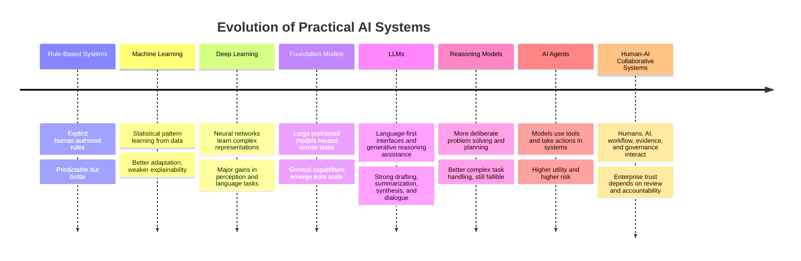
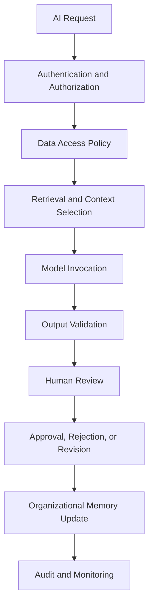
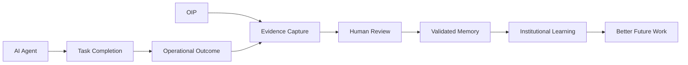
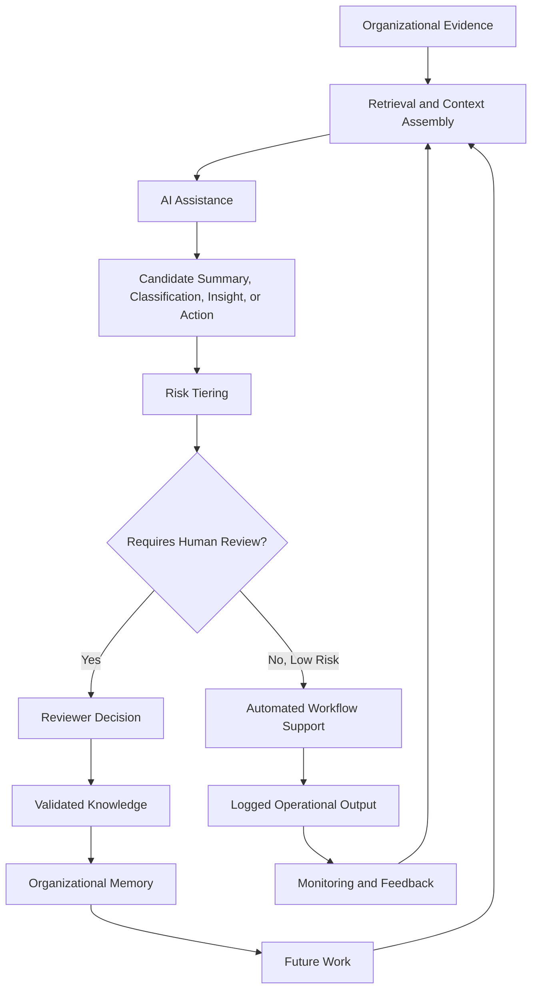

# AI Research

## Derived From

- Canon Version: `v1.0.0`
- Architecture Version: `v1.0.0`
- Implementation Version: `v1.0.0`
- Strategy Version: `v1.0.0`
- Research Methodology Version: `v1.0.0`
- Market Research Version: `v1.0.0`
- Customer Discovery Version: `v1.0.0`
- Support Industry Research Version: `v1.0.0`
- Competitor Research Version: `v1.0.0`

### Primary Repository Sources

- [Canon](../canon/README.md)
- [Architecture](../architecture/README.md)
- [Implementation](../implementation/README.md)
- [Strategy](../strategy/README.md)
- [Research Methodology](./00_RESEARCH_METHODOLOGY.md)
- [Market Research](./01_MARKET_RESEARCH.md)
- [Customer Discovery](./02_CUSTOMER_DISCOVERY.md)
- [Support Industry Research](./03_SUPPORT_INDUSTRY_RESEARCH.md)
- [Competitor Research](./04_COMPETITOR_RESEARCH.md)

---

Status: **Active**

## Primary Research Question

What role should modern AI play within an Organizational Intelligence Platform, and what technical, organizational, and governance limitations must shape its responsible use?

This is an objective research document. It is not an AI advocacy document, vendor evaluation, implementation plan, or speculative AGI essay.

The purpose is to understand AI capabilities, limitations, risks, governance requirements, and long-term implications for enterprise software so the Organizational Intelligence Platform can use AI responsibly without becoming conceptually dependent on any single model, provider, or technique.

## 1. Executive Summary

## Research Objective

This report evaluates what modern AI can and cannot responsibly do inside an Organizational Intelligence Platform.

The central finding is:

> AI should be treated as an enabling capability inside the Organizational Intelligence Platform, not as the platform's identity. The durable value of OIP comes from governed organizational memory, human review, explainability, and validated learning that compounds over time.

Modern AI is exceptionally useful for language-heavy work: summarization, classification, retrieval assistance, draft creation, code generation, pattern recognition, knowledge synthesis, and tool-mediated workflow assistance. These capabilities are directly relevant to Customer Support, knowledge extraction, documentation, research, and decision support.

However, AI remains limited by hallucination, non-determinism, context constraints, outdated knowledge, weak persistent memory, inconsistent reasoning, security exposure, and dependence on the quality of organizational data. These limitations are not minor implementation details. They shape the architecture, governance model, user experience, and trust boundary of the platform.

## Methodology Summary

This report follows the company's AI-Assisted Multi-Source Research methodology in a limited initial form:

- Repository review across Canon, Architecture, Implementation, Strategy, and prior Research documents.
- AI-assisted synthesis using Codex/ChatGPT.
- Public source review across AI governance frameworks, security frameworks, academic papers, industry reports, and enterprise AI analyses.
- Distinction between demonstrated capabilities, vendor claims, interpretations, hypotheses, and unknowns.
- Confidence classification for major findings.

This report does not include paid analyst reports, proprietary benchmark data, hands-on model evaluations, production incident datasets, internal customer deployments, or full multi-model AAMR validation across every named system. Those limitations affect the confidence levels assigned.

## Major Findings

| Finding | Interpretation | Confidence |
| --- | --- | --- |
| AI is highly capable at language transformation, summarization, classification, synthesis, retrieval assistance, code generation, and draft creation. | AI can materially improve knowledge work when embedded with clear controls. | Level A |
| AI remains unreliable as an unreviewed authority for high-stakes enterprise decisions. | Human review, evidence, and governance are not optional. | Level A |
| RAG improves access to external knowledge but does not by itself guarantee truth, freshness, authorization, or organizational learning. | Retrieval must be paired with validation, provenance, and memory governance. | Level B |
| AI agents are useful for task execution, but increase risk through tool access, autonomy, prompt injection, excessive agency, and accountability gaps. | Agents require stricter controls than passive assistants. | Level A |
| Enterprise AI value depends less on model novelty and more on workflow integration, data quality, governance, adoption, and measurable outcomes. | OIP should focus on organizational architecture, not model ownership. | Level B |
| Organizational Intelligence is broader than AI because it includes memory, review, validation, domain language, governance, and institutional learning. | AI is a subsystem of OIP, not the category itself. | Level A |

## Overall Conclusion

AI's appropriate role inside the Organizational Intelligence Platform is:

- To assist with understanding, structuring, summarizing, retrieving, drafting, comparing, classifying, and proposing.
- To help detect repeated patterns, knowledge gaps, contradictions, and learning candidates.
- To support agents, experts, reviewers, and decision-makers.
- To operate behind evidence, permissions, governance, and human review.
- To remain modular and replaceable as models evolve.

AI should not be treated as:

- The sole source of truth.
- A replacement for organizational accountability.
- A permanent memory system by itself.
- A governance substitute.
- A guarantee of correctness.
- The company's category definition.

The OIP architecture should therefore preserve a clear distinction:

AI accelerates the movement from evidence to candidate insight. The platform creates value by governing what becomes trusted organizational memory.

## 2. Research Scope

## Included

| Area | Included Because |
| --- | --- |
| Large Language Models | LLMs are the foundation of modern language AI and support summarization, drafting, classification, reasoning assistance, and dialogue. |
| Reasoning Models | Reasoning-oriented models influence planning, complex task solving, tool use, analysis, and decision support. |
| AI Agents | Agents are increasingly used to execute tasks, use tools, interact with systems, and automate workflows. |
| Retrieval-Augmented Generation | RAG is central to enterprise AI because organizations need models to use current, permissioned, domain-specific knowledge. |
| Tool Use | Tool use allows models to retrieve data, call APIs, perform calculations, create records, and act in business systems. |
| Multi-Agent Systems | Multi-agent systems are relevant to orchestration, specialization, review, and complex workflow decomposition. |
| Human-in-the-Loop Systems | Human review is fundamental to enterprise trust, quality, accountability, and Canon alignment. |
| AI Governance | Governance shapes safe, compliant, auditable, and trustworthy AI adoption. |
| Explainable AI | Explainability is required for review, audit, trust, and learning. |
| Enterprise AI | OIP is an enterprise platform and must account for organizational, security, workflow, and adoption constraints. |

## Excluded

| Area | Excluded Because |
| --- | --- |
| Consumer AI entertainment | Entertainment use cases do not reflect enterprise governance, accountability, or organizational memory requirements. |
| Image generation as a primary focus | Image generation may be useful in some contexts, but OIP is primarily concerned with organizational knowledge, work, evidence, and decisions. |
| Robotics | Physical-world control introduces different safety, hardware, and operational risks outside the initial platform scope. |
| AGI speculation | The document avoids speculative general intelligence debates and focuses on observable enterprise AI trends. |

The scope intentionally centers practical enterprise AI. The question is not whether AI will become more powerful in abstract terms. The question is how an enterprise platform should use AI responsibly while preserving trust, governance, and institutional learning.

## 3. Research Methodology

## AI Systems Consulted

| System | Role |
| --- | --- |
| Codex / ChatGPT | Repository review, public-source synthesis, AI capability analysis, drafting, and consistency checking. |

This version does not include independent comparative outputs from Claude, Gemini, Perplexity, Manus, or other AAMR tools. Future versions should include multi-model triangulation before using the document as a final board-level or investor-facing research artifact.

## Public Sources Reviewed

| Source | Research Use |
| --- | --- |
| [NIST AI Risk Management Framework](https://www.nist.gov/itl/ai-risk-management-framework) | AI governance, risk management, trustworthy AI framing, and generative AI risk profile. |
| [NIST Generative AI Profile PDF](https://nvlpubs.nist.gov/nistpubs/ai/NIST.AI.600-1.pdf) | Governance, content provenance, testing, incident disclosure, and generative AI risk controls. |
| [OWASP Top 10 for LLM Applications](https://owasp.org/www-project-top-10-for-large-language-model-applications/) | LLM security risks including prompt injection, insecure output handling, sensitive information disclosure, excessive agency, and supply chain risks. |
| [OWASP GenAI Security Project](https://genai.owasp.org/llm-top-10/) | Current LLM and generative AI application risk categories and mitigation framing. |
| [Stanford AI Index 2026](https://hai.stanford.edu/ai-index/2026-ai-index-report) | AI adoption, capability trends, measurement concerns, governance gaps, investment, and societal implications. |
| [Stanford AI Index](https://hai.stanford.edu/ai-index) | General AI measurement and transparency context. |
| [McKinsey State of AI 2025](https://www.mckinsey.com/capabilities/quantumblack/our-insights/the-state-of-ai) | Enterprise AI adoption, agentic AI, scaling challenges, and value realization practices. |
| [McKinsey State of AI Trust 2026](https://www.mckinsey.com/capabilities/tech-and-ai/our-insights/tech-forward/state-of-ai-trust-in-2026-shifting-to-the-agentic-era) | Responsible AI maturity, governance practices, and agentic AI controls. |
| [Attention Is All You Need](https://arxiv.org/abs/1706.03762) | Foundational transformer architecture. |
| [Retrieval-Augmented Generation for Knowledge-Intensive NLP Tasks](https://arxiv.org/abs/2005.11401) | Foundation for combining parametric language models with external retrieval. |
| [ReAct: Synergizing Reasoning and Acting in Language Models](https://arxiv.org/abs/2210.03629) | Reasoning and action patterns for tool-using language models. |
| [Toolformer](https://arxiv.org/abs/2302.04761) | Tool-use research showing language models can learn when and how to call external tools. |

## Evidence Types

| Evidence Type | Use | Limitation |
| --- | --- | --- |
| Academic papers | Establish technical concepts and research lineage. | Benchmarks may not reflect enterprise deployment. |
| Governance frameworks | Establish risk and control requirements. | Frameworks require adaptation to specific use cases. |
| Security frameworks | Identify concrete failure modes and mitigations. | Threats evolve quickly. |
| Industry reports | Provide adoption and management trends. | May include survey bias or vendor/consulting framing. |
| Vendor documentation | Shows practical product direction. | Marketing bias and incomplete disclosure. |
| Repository analysis | Connects AI research to OIP concepts. | Depends on prior repository assumptions. |

## Confidence Levels

| Level | Meaning |
| --- | --- |
| Level A | Strongly supported by research consensus, official frameworks, repeated empirical observation, or multiple high-quality sources. |
| Level B | Well-supported by public evidence and practical enterprise analysis, but lacking direct internal deployment data. |
| Level C | Plausible interpretation or emerging trend requiring further validation. |
| Level D | Unknown, speculative, or insufficiently evidenced. |

## 4. Evolution of AI

AI has evolved through several architectural and practical shifts. Each stage changed what software could do, but also introduced new limitations and governance needs.

## Stage Analysis

| Stage | What Changed | Enterprise Implication |
| --- | --- | --- |
| Rule-Based Systems | Humans encoded explicit decision logic. | Predictable and auditable, but rigid and costly to maintain. |
| Machine Learning | Systems learned patterns from historical data. | Better prediction and classification, but more dependence on data quality. |
| Deep Learning | Neural networks learned richer representations across images, speech, text, and structured data. | Greater capability, lower transparency, and higher computational demands. |
| Foundation Models | Large models trained on broad data became adaptable across many tasks. | Enterprises could use general-purpose models without training from scratch. |
| LLMs | Language became the primary interface for knowledge work. | AI became useful for summarization, drafting, search assistance, and analysis. |
| Reasoning Models | Models increasingly optimized for multi-step reasoning and problem solving. | Better suitability for analysis and planning, but still not reliable enough for unreviewed authority. |
| AI Agents | Models gained tool access and ability to act across systems. | Potential value increases, but security, permissions, and accountability risks increase sharply. |
| Human-AI Collaborative Systems | AI becomes part of governed work rather than isolated interaction. | Review, explainability, memory, and trust become architectural requirements. |

## What Changed Most

The most important shift for OIP is not that AI can now produce fluent text. It is that AI can participate in knowledge workflows:

- Read and summarize organizational evidence.
- Retrieve relevant context.
- Draft candidate knowledge.
- Classify work.
- Detect patterns.
- Suggest next actions.
- Use tools.
- Support human reviewers.

The key question becomes: what should the organization do with AI-assisted outputs?

OIP's answer is: treat them as candidates that must be grounded, reviewed, governed, and converted into validated organizational memory only when justified.

## 5. AI Capability Assessment

AI performs best when the task involves pattern-rich information, language transformation, structured classification, or assisted synthesis.

## Capability Matrix

| Capability | Current Strength | Evidence Status | Enterprise Use | OIP Role |
| --- | --- | --- | --- | --- |
| Language understanding | High | Demonstrated | Interpreting tickets, messages, documents, and user intent. | Parse cases, extract concepts, map domain language. |
| Summarization | High | Demonstrated | Condensing tickets, meetings, documents, research, and escalations. | Create reviewable summaries with citations and evidence. |
| Classification | High | Demonstrated | Categorizing cases, topics, risk, sentiment, urgency, or knowledge type. | Route learning candidates and organize memory. |
| Pattern recognition | Medium to High | Demonstrated | Detecting repeated issues, similar cases, and recurring knowledge gaps. | Identify entropy and flywheel opportunities. |
| Code generation | High for many tasks | Demonstrated | Drafting code, tests, scripts, and implementation scaffolding. | Support implementation, integration, and internal tooling. |
| Draft creation | High | Demonstrated | Drafting articles, responses, playbooks, reports, and policies. | Generate candidates for human review. |
| Knowledge synthesis | Medium to High | Demonstrated with review | Combining evidence across sources into coherent analysis. | Create research or knowledge proposals with source trails. |
| Information retrieval assistance | Medium to High | Demonstrated | Helping users find relevant documents, cases, and prior decisions. | Improve evidence access and memory reuse. |
| Tool use | Medium and improving | Demonstrated but variable | Calling APIs, searching systems, running calculations, updating records. | Enable controlled workflow participation. |
| Long-horizon planning | Medium | Emerging | Decomposing complex goals into steps. | Useful for workflow assistance, but requires oversight. |
| Numerical precision | Variable | Known limitation | Calculations, finance, metrics, and analysis. | Use external tools and validation. |
| Legal, medical, financial authority | Low without review | High-risk limitation | Regulated decisions. | Require expert review and governance. |

## Demonstrated Capabilities vs Marketing Claims

| Claim Type | More Defensible | Less Defensible |
| --- | --- | --- |
| "AI can summarize long support cases." | Supported when source text is available and outputs are reviewed. | Unsupported if the summary is treated as complete truth without validation. |
| "AI can classify tickets." | Supported for many categories with evaluation and feedback. | Unsupported if categories are ambiguous or no evaluation exists. |
| "AI can draft knowledge articles." | Supported as draft generation. | Unsupported as automatic publication without review. |
| "AI can reason." | Supported for some structured tasks and benchmarks. | Unsupported as general reliability across all enterprise contexts. |
| "AI agents can execute workflows." | Supported in bounded environments with tools and controls. | Unsupported as broad autonomy without permission, audit, or rollback. |
| "AI creates organizational intelligence." | Partially true only when outputs become validated memory. | False if AI output is treated as intelligence by itself. |

## Practical Capability Conclusion

AI is strongest as a **candidate generator and cognitive accelerator**.

It can help humans and systems move faster from raw evidence to structured possibilities:

- Possible summary.
- Possible classification.
- Possible answer.
- Possible knowledge article.
- Possible root cause.
- Possible pattern.
- Possible next action.

The OIP must then decide, through evidence and review, what deserves to become organizational knowledge.

## 6. AI Limitations

AI limitations matter because OIP is intended for enterprise settings where trust, consistency, accountability, and continuity are required.

## Limitation Matrix

| Limitation | Description | Enterprise Impact | OIP Control |
| --- | --- | --- | --- |
| Hallucinations | AI can produce plausible but false statements. | Incorrect answers, customer harm, compliance risk, trust erosion. | Require citations, evidence grounding, review, and uncertainty disclosure. |
| Non-determinism | Outputs may vary across runs or model versions. | Harder testing, reproducibility, audit, and policy enforcement. | Version prompts, models, settings, and review decisions. |
| Context limitations | Models can only use available context and may miss relevant information. | Incomplete recommendations and wrong conclusions. | Retrieve bounded evidence and expose context sources. |
| Outdated knowledge | Models may not know recent changes unless connected to current data. | Incorrect policy, product, or customer guidance. | Use RAG, freshness metadata, and authoritative sources. |
| Poor long-term memory | Model sessions are not durable institutional memory. | Learning may disappear unless captured externally. | Store validated knowledge in organizational memory outside the model. |
| Reasoning failures | Models may make flawed inferences, especially with ambiguity or hidden constraints. | Bad decisions masked by fluent explanation. | Separate reasoning assistance from final authority. |
| Ambiguity handling | AI may resolve ambiguity silently instead of asking clarifying questions. | False confidence and misapplied policies. | Require uncertainty flags and clarification paths. |
| Inconsistent outputs | Similar inputs can produce different formats, details, or conclusions. | Operational inconsistency. | Use structured schemas, validation, evaluation, and review workflows. |
| Lack of organizational context | Models do not inherently know company-specific processes, priorities, exceptions, or history. | Generic answers that conflict with institutional reality. | Ground outputs in organizational memory and domain models. |
| Security vulnerability | LLM systems introduce prompt injection, data leakage, tool misuse, and supply chain risk. | Data exposure and unauthorized actions. | Apply AI security architecture and least-privilege tool access. |

## Why These Limitations Matter

Enterprise systems are not judged only by whether they can produce useful answers. They are judged by whether they can produce trustworthy, auditable, repeatable, secure, and accountable outcomes.

An AI answer that is correct 90% of the time may be unacceptable if:

- Users cannot tell when it is wrong.
- The answer exposes sensitive information.
- The model acts outside authorization.
- The organization cannot audit why a decision was made.
- The output contradicts current policy.
- The system silently learns from unvalidated content.

## Limitation Conclusion

AI limitations do not make AI unusable. They define how it should be used.

For OIP, the correct posture is:

> AI may propose, structure, retrieve, summarize, and assist. The platform must govern what becomes trusted memory.

## 7. Human Judgment and Governance

Human Review is not a temporary workaround for weak models. It is a permanent enterprise requirement because organizations need accountability.

## Why Human Review Remains Essential

| Requirement | Why AI Alone Is Insufficient |
| --- | --- |
| Accountability | Organizations need identifiable responsibility for decisions, policies, and customer-facing knowledge. |
| Explainability | Humans must understand evidence, assumptions, tradeoffs, and uncertainty. |
| Risk management | Humans determine acceptable risk in context. |
| Regulatory compliance | Regulated domains require policy interpretation, auditability, and accountable approvals. |
| Ethical oversight | Human judgment is needed when outputs affect people, fairness, rights, safety, or obligations. |
| Organizational trust | Teams trust systems when they can inspect, challenge, and govern them. |
| Business judgment | AI can optimize within a frame, but humans set priorities, values, and exceptions. |

## Connection to Canon

The Canon's Human Review principle is directly reinforced by AI research.

AI systems can increase organizational capability only when their outputs are:

- Grounded in evidence.
- Transparent enough to inspect.
- Reviewable by accountable humans.
- Governed by organizational rules.
- Stored only after validation.
- Correctable when wrong.

Human review should not be designed as bureaucratic friction. It should be designed as the trust mechanism that allows AI-assisted knowledge to become organizational memory.

## Governance Layers

## Governance Requirements

| Governance Area | Requirement |
| --- | --- |
| Access control | Models and agents should only access data the user or workflow is authorized to use. |
| Output control | AI outputs should be validated before entering downstream systems. |
| Provenance | Outputs should retain links to source evidence where possible. |
| Review records | Human decisions should be logged with reviewer, timestamp, rationale, and outcome. |
| Versioning | Models, prompts, retrieved sources, and generated artifacts should be versioned. |
| Incident response | AI failures should be reportable, investigable, and correctable. |
| Evaluation | AI performance should be tested continuously against representative tasks. |
| Policy alignment | AI behavior should reflect organizational rules, not just statistical likelihood. |

## 8. AI in Enterprise Workflows

AI creates sustainable value when it is embedded into real workflows with clear boundaries, evaluation, and governance.

## Workflow Value Matrix

| Workflow | AI Value | Human Role | OIP Relevance |
| --- | --- | --- | --- |
| Customer Support | Summarize cases, classify issues, suggest responses, detect repeated problems, draft knowledge candidates. | Validate answers, handle exceptions, approve reusable knowledge. | Strong beachhead fit. |
| Knowledge Discovery | Retrieve relevant content, surface similar cases, identify experts, find contradictions. | Judge relevance, authority, and applicability. | Supports memory reuse. |
| Documentation | Draft articles, identify gaps, update stale content, convert resolutions into guidance. | Approve content and ensure accuracy. | Converts work into durable knowledge. |
| Workflow Assistance | Suggest next steps, route tasks, call tools, prepare handoffs. | Approve high-impact actions and manage exceptions. | Improves operational flow without replacing accountability. |
| Research | Summarize sources, compare evidence, identify patterns, structure reports. | Evaluate evidence quality and conclusions. | Accelerates repository learning. |
| Decision Support | Present options, summarize tradeoffs, retrieve precedent. | Make final decisions and own outcomes. | Preserves decision context. |
| Knowledge Extraction | Extract entities, concepts, rules, cases, evidence, and candidate insights. | Validate extracted knowledge. | Feeds the Knowledge Flywheel. |
| Knowledge Structuring | Map unstructured content into taxonomies, domain models, or memory objects. | Maintain domain language and governance. | Supports canonical consistency. |

## Where AI Augments Rather Than Replaces

AI is strongest when it reduces cognitive and administrative load:

- It reads more context than a person has time to read.
- It drafts faster than a person can draft from scratch.
- It identifies patterns that humans may miss.
- It prepares structured options for review.
- It helps less experienced employees access institutional knowledge.

Humans remain essential where:

- The decision affects customers, employees, money, safety, legal obligations, or reputation.
- The situation is ambiguous or politically sensitive.
- Organizational values or tradeoffs matter.
- Accountability must be assigned.
- Knowledge will become official.

## Sustainable Value Criteria

AI creates durable enterprise value when:

- It is tied to real workflow outcomes.
- It improves decision quality or cycle time.
- It reduces repeated work.
- It improves knowledge reuse.
- It is trusted by users.
- It is governed and auditable.
- It compounds into organizational memory.

## 9. AI Agents vs Organizational Intelligence

AI Agents and Organizational Intelligence Platforms are related but not equivalent.

## Comparison Matrix

| Dimension | Autonomous AI Agents | Organizational Intelligence Platform |
| --- | --- | --- |
| Primary goal | Complete tasks or workflows. | Increase institutional capability through validated learning. |
| Unit of value | Action completed, question answered, task resolved. | Knowledge validated, memory improved, future decision quality increased. |
| Memory | Often session, tool, or platform-specific; may be short-lived or implementation-specific. | Persistent organizational memory governed over time. |
| Governance | Must control tool access, permissions, actions, and outputs. | Governs evidence, reasoning, review, validation, memory, and reuse. |
| Explainability | Variable; may include traces, citations, or logs. | Core requirement: evidence, reasoning, lineage, and review history. |
| Organizational learning | Indirect unless agent outcomes are captured and validated. | Central purpose. |
| Accountability | Risky if autonomy is broad or responsibility is unclear. | Human review and organizational ownership are explicit. |
| Knowledge persistence | Not guaranteed by task completion. | Required by design. |
| Failure mode | Wrong action, unauthorized action, bad tool call, runaway workflow. | Bad memory, weak validation, poor governance, incorrect learning. |
| Relationship to OIP | Agent can be a worker or assistant inside OIP. | OIP governs what agents learn, remember, and reuse. |

## Complementary Roles

AI Agents can:

- Search systems.
- Summarize cases.
- Draft responses.
- Prepare knowledge candidates.
- Execute low-risk routine tasks.
- Call APIs.
- Gather evidence.
- Monitor workflows.

OIP should:

- Define what agents are allowed to access.
- Preserve evidence and action traces.
- Require review for memory updates.
- Govern reusable knowledge.
- Track outcomes.
- Detect contradictions and stale knowledge.
- Measure whether the organization is learning.

## Conceptual Difference

The agent may complete today's task. The OIP ensures the organization learns from what happened.

## 10. Enterprise AI Trends

AI is evolving quickly, but not every trend is equally durable.

## Trend Matrix

| Trend | Description | Durability | OIP Implication |
| --- | --- | --- | --- |
| Multi-model architectures | Enterprises use multiple models for different tasks, risk levels, costs, and providers. | Durable | OIP should be model-agnostic. |
| AI orchestration | Systems coordinate prompts, tools, retrieval, evaluation, policies, and workflows. | Durable | OIP needs orchestration across evidence, models, memory, and review. |
| Tool calling | Models call APIs, search, calculators, databases, and business systems. | Durable | Tool use must be permissioned, logged, and reversible where possible. |
| MCP and connector protocols | Standardized ways for AI systems to access tools and context are emerging. | Emerging but important | OIP should design around modular connectors and controlled context access. |
| Retrieval | AI systems increasingly use external knowledge sources rather than relying only on model weights. | Durable | Retrieval must include permissions, provenance, freshness, and validation. |
| Agent frameworks | Developers use frameworks to build multi-step AI agents. | Useful but volatile | Avoid locking the architecture to any one framework. |
| Smaller specialized models | Smaller models can serve specific tasks with lower cost, latency, and deployment risk. | Durable | Use task-appropriate models rather than assuming biggest model is best. |
| Model commoditization | Many models become good enough for common tasks. | Durable | Differentiation shifts to data, workflow, governance, memory, and trust. |
| Enterprise governance | Governance becomes mandatory as AI becomes operational. | Durable | Governance should be core architecture. |
| Long-context models | Models can process more tokens and documents at once. | Durable direction | Helpful, but long context does not replace memory quality or review. |
| Synthetic data | AI-generated data helps training, evaluation, and testing. | Durable with caution | Must avoid reinforcing errors or creating unrealistic benchmarks. |

## Durable vs Hype-Sensitive

| Durable | Hype-Sensitive |
| --- | --- |
| Governance and audit. | Fully autonomous enterprise replacement. |
| Human-AI collaboration. | One agent to run the company. |
| Tool use with controls. | Unlimited agency without oversight. |
| Retrieval with provenance. | "Chat with everything" as sufficient architecture. |
| Model-agnostic orchestration. | Loyalty to one model provider. |
| Domain-specific evaluation. | Generic leaderboard superiority as proof of enterprise value. |
| Memory outside the model. | Assuming model context equals organizational memory. |

## Strategic Trend Conclusion

The long-term AI trend most relevant to OIP is not simply smarter models. It is the integration of AI into governed work.

As models improve, the scarce assets become:

- Trusted organizational context.
- Validated knowledge.
- Permissioned evidence.
- Review workflows.
- Audit trails.
- Domain language.
- Institutional memory.
- Human trust.

These are OIP assets, not model features.

## 11. AI Risks

AI risks are technical, organizational, legal, operational, and cultural.

## Risk Assessment Table

| Risk | Likelihood | Impact | Why It Matters | Mitigation |
| --- | --- | --- | --- | --- |
| Hallucinations | High | High | False outputs can become trusted if presented fluently. | Grounding, citations, uncertainty, review, evaluation. |
| Privacy exposure | Medium to High | High | AI may process sensitive customer, employee, or business data. | Data minimization, access control, redaction, policy enforcement. |
| Security attacks | High | High | Prompt injection and tool misuse can manipulate model behavior. | OWASP controls, sandboxing, output validation, least privilege. |
| Data leakage | Medium | High | Sensitive data may appear in prompts, logs, outputs, or third-party services. | Logging policy, provider controls, encryption, retention limits. |
| Model drift | Medium | Medium | Model behavior can change across versions or deployments. | Versioning, regression tests, monitoring, approval gates. |
| Vendor dependence | Medium | Medium to High | Provider lock-in can affect cost, availability, capability, and compliance. | Model abstraction, portability, multi-provider strategy. |
| Over-automation | Medium | High | Automating judgment too quickly can damage trust and outcomes. | Human review thresholds, risk tiering, staged autonomy. |
| Loss of human expertise | Medium | High over time | Teams may stop practicing judgment if AI handles too much. | Keep humans involved in review, training, and exception handling. |
| Trust erosion | High if failures are visible | High | One bad AI incident can reduce adoption significantly. | Transparent limits, correction workflows, feedback loops. |
| Bias and unfairness | Medium | High in people-impacting contexts | AI may reproduce biased patterns or unequal treatment. | Evaluation, monitoring, policy review, representative data. |
| Excessive agency | Medium | High | Agents may take actions beyond intended authority. | Least privilege, action approvals, scoped tools, audit logs. |
| Weak explainability | Medium | High | Users cannot validate or trust recommendations. | Evidence trails, reasoning summaries, source references, review UI. |

## Security-Specific Concerns

OWASP-style LLM risks are especially important for OIP because the platform may connect models to sensitive enterprise data and tools.

Key risks include:

- Prompt injection.
- Insecure output handling.
- Sensitive information disclosure.
- Supply chain vulnerabilities.
- Data and model poisoning.
- Excessive agency.
- System prompt leakage.
- Vector and embedding weaknesses.
- Misinformation.
- Unbounded consumption.

OIP must treat AI security as part of platform architecture, not as a late-stage checklist.

## Organizational Risks

AI also creates organizational risks:

- Leaders may overestimate AI reliability.
- Teams may resist AI if they fear replacement or surveillance.
- Poorly designed AI can add work instead of reducing it.
- AI-generated content can pollute knowledge bases if unreviewed.
- Employees may create shadow AI workflows outside governance.
- Organizations may lose expertise if they automate before understanding.

These risks reinforce the need for the OIP principle:

> AI output should not become organizational memory until it has been validated.

## 12. Long-Term Outlook

AI will likely continue improving over the next decade, but the practical enterprise challenge will remain governance of intelligence inside real organizations.

## Expected Improvements

| Improvement | Likelihood | Expected Effect |
| --- | --- | --- |
| Better reasoning | High | Models will handle more complex planning, analysis, and multi-step tasks. |
| Longer context | High | Models will process more documents, cases, and evidence at once. |
| More reliable tool use | High | Agents will become better at using APIs, applications, and workflows. |
| Lower inference costs | High | More AI use cases will become economically viable. |
| More open models | High | Organizations will have more deployment, privacy, and customization options. |
| Better enterprise integration | High | AI will appear inside CRM, help desk, ITSM, collaboration, ERP, and productivity tools. |
| Better evaluation tooling | Medium to High | Enterprises will test AI behavior more systematically. |
| More specialized models | High | Domain-specific and task-specific models will become common. |
| Better multimodal reasoning | Medium to High | AI will handle text, voice, images, video, logs, and structured data more fluently. |

## What May Not Disappear

Even with better models, organizations will still need:

- Governance.
- Accountability.
- Human judgment.
- Secure data access.
- Memory management.
- Evidence lineage.
- Version control.
- Regulatory compliance.
- Domain-specific validation.
- Organizational trust.

Better models reduce some error rates. They do not remove the need for institutional control.

## Grounded Outlook

The most likely future is not one where AI replaces enterprise software. It is one where AI becomes embedded throughout enterprise software.

This creates a new problem:

> If every system has AI, organizations need a way to govern what AI learns, remembers, reuses, and turns into official knowledge.

That problem supports the long-term relevance of OIP.

## 13. Implications for Organizational Intelligence

AI research has direct implications for OIP architecture and strategy.

## Architectural Implications

| Principle | Implication |
| --- | --- |
| AI should remain modular. | The platform should support replaceable models, providers, prompts, tools, and evaluation strategies. |
| Models are replaceable. | OIP should not depend on a single model provider as its core moat. |
| Organizational Memory is persistent. | Memory should live in governed platform services, not inside ephemeral model sessions. |
| Governance becomes increasingly important. | More powerful AI creates more need for access control, audit, policy, and review. |
| Human Review remains fundamental. | Review converts AI-assisted outputs into trusted knowledge. |
| Intelligence compounds through validated knowledge. | Raw model output does not compound unless captured, validated, and reused. |
| Explainability must be designed. | Source evidence, reasoning traces, and validation history should be visible. |
| Retrieval is not enough. | Retrieved content must be permissioned, relevant, fresh, and authoritative. |
| Agents require boundaries. | Tool access should be scoped, monitored, approved, and reversible when possible. |

## OIP AI Role Model

## Strategic Implications

OIP should not position itself as:

- An LLM company.
- A chatbot company.
- An autonomous agent company.
- A RAG wrapper.
- A generic copilot.

OIP should position AI as part of the Knowledge Flywheel:

- AI helps process evidence.
- AI proposes candidate knowledge.
- Humans review and validate.
- The platform preserves memory.
- Future work improves.
- The organization becomes more capable.

## Canon Alignment

This research strengthens the Canon rather than changing it:

- The Founder's Thesis remains about organizational capability.
- Product Vision remains about a platform that helps institutions learn.
- Product Principles remain grounded in governance and human review.
- Capability Model remains valid because AI is one capability among several.
- Domain Model remains necessary because AI needs stable concepts.
- Workflow Model remains necessary because learning happens over time.
- AI Cognitive Model remains necessary because intelligence inside the platform needs rules, boundaries, and accountability.

## 14. Confidence Assessment

## Validated Findings

| Finding | Confidence | Evidence |
| --- | --- | --- |
| LLMs are strong at language tasks such as summarization, drafting, classification, and synthesis. | Level A | Academic, public, and practical evidence across modern AI systems. |
| AI systems can hallucinate and produce unreliable outputs. | Level A | Widely documented research and deployment experience. |
| AI governance is necessary for enterprise adoption. | Level A | NIST, McKinsey, OWASP, Stanford AI Index, and enterprise practice. |
| Prompt injection and LLM application security risks are real. | Level A | OWASP LLM risk frameworks and observed deployment concerns. |
| AI agents require stronger controls than passive AI assistants. | Level A | Tool access increases risk and accountability requirements. |

## Likely Findings

| Finding | Confidence | Evidence |
| --- | --- | --- |
| Enterprise AI value depends heavily on workflow integration and governance, not just model capability. | Level B | Industry reports and deployment patterns. |
| RAG is necessary but insufficient for trusted enterprise knowledge. | Level B | RAG research and enterprise knowledge requirements. |
| Human review will remain important even as models improve. | Level B | Accountability, compliance, and trust requirements. |
| Model commoditization will shift defensibility toward data, workflow, memory, and governance. | Level B | Competitive landscape and model market trends. |
| OIP should maintain a model-agnostic architecture. | Level B | Vendor dependence and rapid AI evolution. |

## Emerging Trends

| Trend | Confidence | Notes |
| --- | --- | --- |
| Multi-model orchestration | Level B | Increasingly common as enterprises balance cost, capability, and risk. |
| Agentic workflows | Level B | Rapidly growing, but governance and ROI remain uncertain. |
| MCP-like connector patterns | Level C | Promising direction for tool and context access; ecosystem still evolving. |
| Specialized smaller models | Level B | Likely durable due to cost, latency, privacy, and task fit. |
| AI governance tooling | Level B | Likely to grow as AI moves into production workflows. |

## Hypotheses

| Hypothesis | Confidence | Validation Needed |
| --- | --- | --- |
| OIP can become the governance and memory layer for AI-assisted work. | Level C | Customer pilots and enterprise architecture validation. |
| Human-reviewed AI learning candidates will produce measurable support improvements. | Level C | Design partner pilots and support metrics. |
| Organizational Memory will be more defensible than model access. | Level C | Longitudinal customer usage and retention evidence. |
| AI agents inside OIP can safely automate low-risk learning workflows. | Level C | Security testing, risk tiering, and operational pilots. |

## Unknowns

| Unknown | Why It Matters |
| --- | --- |
| How fast model reliability will improve. | Determines how much review can eventually be automated. |
| Whether enterprises will pay separately for AI governance and memory. | Determines pricing and packaging. |
| Which model providers will dominate enterprise use. | Affects integration and dependency strategy. |
| How regulation will evolve across regions. | Affects governance requirements. |
| How much autonomy customers will accept. | Affects agent roadmap and UX. |

## 15. Repository Impact

AI research influences the repository but does not redefine the Canon.

| Repository Area | Impact |
| --- | --- |
| Canon | Reinforces Human Review, Governance, Organizational Memory, and Knowledge Flywheel principles. |
| Architecture | Requires modular AI services, evidence grounding, review workflows, audit, permissioning, and model abstraction. |
| Product | Product should emphasize AI-assisted learning, not AI replacement of humans. |
| Strategy | Position OIP as broader and more durable than AI agents or copilots. |
| Roadmap | Prioritize bounded AI workflows: summarization, classification, knowledge candidates, review queues, and memory updates. |

## Canon Impact

The Canon should remain stable even as AI evolves.

AI capabilities may improve dramatically, but the company should not change its foundation every time model benchmarks improve. The durable principles are:

- Organizations need trusted knowledge.
- Work should produce learning.
- Human review creates accountability.
- Memory must be governed.
- Intelligence should compound through validation.

## Architecture Impact

Architecture should support:

- Model-provider abstraction.
- Prompt and model versioning.
- RAG with permission-aware retrieval.
- Human-in-the-loop review.
- AI output validation.
- Tool-use security.
- Evaluation harnesses.
- Audit logs.
- Incident response.
- Memory lifecycle governance.

## Product Impact

Product design should:

- Show sources and evidence.
- Separate draft from approved knowledge.
- Make uncertainty visible.
- Allow users to correct AI.
- Preserve reviewer decisions.
- Avoid presenting AI as authority.
- Make repeated learning measurable.

## Roadmap Impact

Near-term AI roadmap should favor:

- Case summarization.
- Issue classification.
- Similar case retrieval.
- Knowledge gap detection.
- Knowledge candidate drafting.
- Human review workflows.
- Validation and publishing.
- Memory reuse metrics.

Longer-term roadmap may include:

- Agentic evidence gathering.
- Automated low-risk updates.
- Cross-system contradiction detection.
- Reviewer copilots.
- Learning analytics.
- Multi-agent research and review workflows.

## 16. Traceability Matrix

| Canon Concept | AI Research Finding | Confidence |
| --- | --- | --- |
| Human Review | Essential for enterprise trust, accountability, and safe conversion of AI output into knowledge. | Level A |
| Organizational Intelligence | Extends beyond AI model capability; it requires memory, governance, validation, and institutional learning. | Level A |
| Governance | Increasingly critical as AI adoption grows and agents gain tool access. | Level A |
| Knowledge Flywheel | Requires validated organizational memory, not only AI-generated outputs. | Level B |
| Explainability | Fundamental for enterprise adoption, review, audit, and correction. | Level A |
| Organizational Memory | Should persist outside models and be governed as a platform asset. | Level A |
| AI as Amplifier, Not Authority | AI is best used to assist, propose, summarize, classify, retrieve, and structure. | Level A |
| Domain Language | AI needs stable concepts to avoid generic or inconsistent outputs. | Level B |
| Evidence | AI outputs should remain connected to source evidence, citations, and provenance. | Level A |
| Learning | Intelligence compounds when reviewed knowledge improves future work. | Level B |

## 17. Limitations

This research has significant limitations.

| Limitation | Effect |
| --- | --- |
| Rapid AI evolution | Capabilities, costs, tools, risks, and market structure may change quickly. |
| Benchmark limitations | Public benchmarks may not reflect enterprise workflows, data quality, or governance requirements. |
| Vendor marketing bias | Vendor materials may overstate capability and understate risk or implementation complexity. |
| Public information constraints | Proprietary model behavior, enterprise incidents, and deployment data are not fully visible. |
| AI-assisted research limitations | Codex/ChatGPT helped synthesize this document; future AAMR versions should include multi-model comparison and human expert review. |
| Uncertain future developments | Model reliability, regulation, enterprise adoption, and agent governance remain uncertain. |
| Limited hands-on testing | This document does not include systematic evaluation of specific models, agents, or RAG architectures. |
| Limited customer evidence | The report does not include direct interviews with enterprise AI buyers, risk leaders, or support teams. |

These limitations mean the document should guide architecture and strategy, not serve as final proof of product-market fit.

## 18. Closing

AI is one of the most transformative technologies of this era, but it is not the company's destination.

Models will improve. Architectures will evolve. New reasoning techniques will emerge. Agents will become more capable. Costs will fall. Context windows will grow. Tool use will become more reliable. Enterprise software will increasingly include AI by default.

Those changes matter. The Organizational Intelligence Platform should benefit from them.

But organizations will continue to require:

- Trusted knowledge.
- Human accountability.
- Governance.
- Explainability.
- Security.
- Institutional memory.
- Decision lineage.
- Learning over time.

The enduring value of the Organizational Intelligence Platform therefore lies not in owning the most advanced model, but in enabling organizations to transform AI-assisted work into validated organizational capability that compounds.

AI can help generate answers.

OIP must help organizations decide which answers become knowledge.

AI can help complete tasks.

OIP must help organizations learn from those tasks.

AI can accelerate work.

OIP must ensure the organization becomes permanently more capable because of the work it performs.
