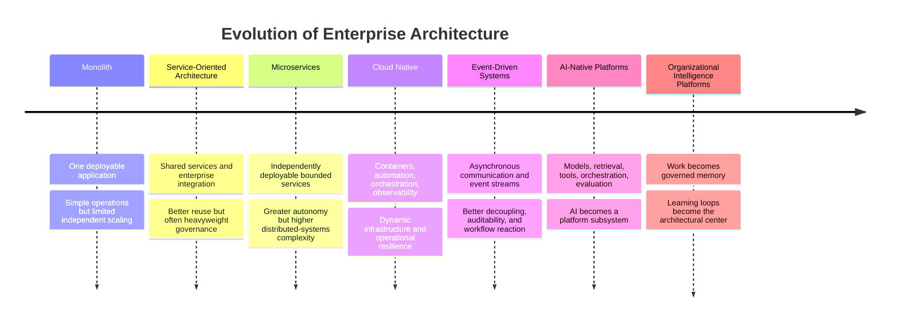
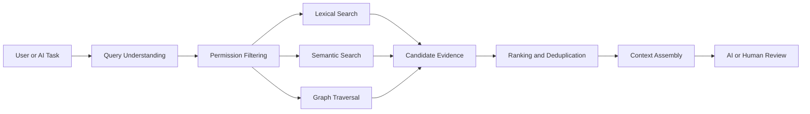
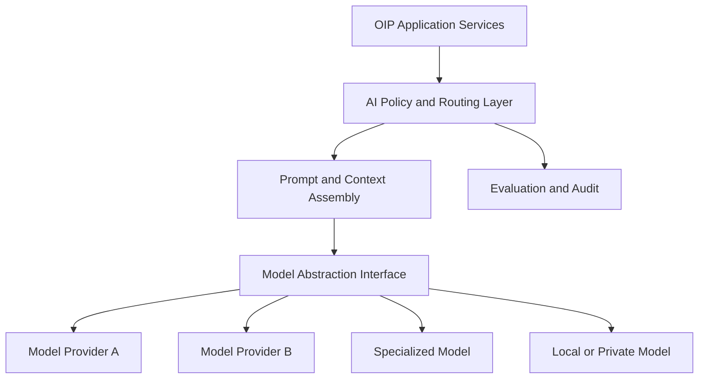
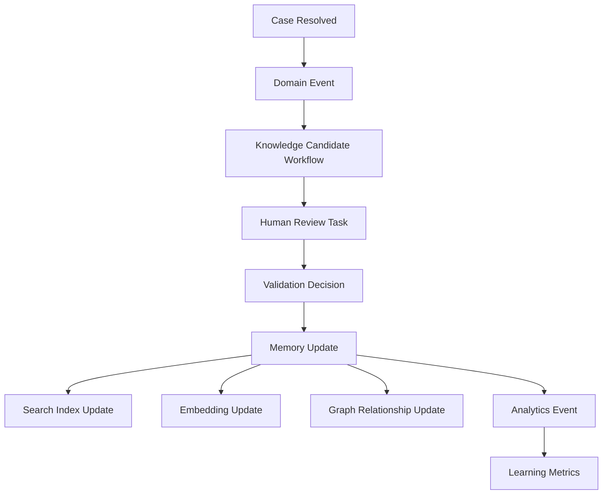
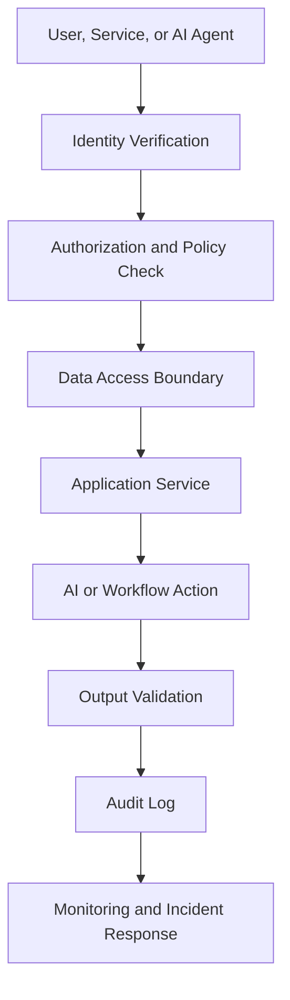

# Technology Research

## Derived From

- Canon Version: `v1.0.0`
- Architecture Version: `v1.0.0`
- Implementation Version: `v1.0.0`
- Strategy Version: `v1.0.0`
- Research Methodology Version: `v1.0.0`
- Market Research Version: `v1.0.0`
- Customer Discovery Version: `v1.0.0`
- Support Industry Research Version: `v1.0.0`
- Competitor Research Version: `v1.0.0`
- AI Research Version: `v1.0.0`

### Primary Repository Sources

- [Canon](../canon/README.md)
- [Architecture](../architecture/README.md)
- [Implementation](../implementation/README.md)
- [Strategy](../strategy/README.md)
- [Research Methodology](./00_RESEARCH_METHODOLOGY.md)
- [Market Research](./01_MARKET_RESEARCH.md)
- [Customer Discovery](./02_CUSTOMER_DISCOVERY.md)
- [Support Industry Research](./03_SUPPORT_INDUSTRY_RESEARCH.md)
- [Competitor Research](./04_COMPETITOR_RESEARCH.md)
- [AI Research](./05_AI_RESEARCH.md)

---

Status: **Active**

## Primary Research Question

What technologies, architectural patterns, infrastructure capabilities, and engineering practices best support a scalable, secure, governable, and model-agnostic Organizational Intelligence Platform?

This is an objective technology research document. It does not select a vendor, prescribe a programming language, or finalize an implementation stack.

The purpose is to understand the technology landscape that could support an Organizational Intelligence Platform and to define durable engineering principles that remain useful as specific products, frameworks, providers, and models change.

## 1. Executive Summary

## Research Objective

This report evaluates the technology landscape required to build an Organizational Intelligence Platform that is scalable, secure, governable, reliable, explainable, and model-agnostic.

The central conclusion is:

> Technology choices should follow architecture, not drive architecture. The platform's technology should be selected because it strengthens Organizational Memory, Human Review, Governance, Explainability, and the Knowledge Flywheel—not because it is fashionable.

## Methodology Summary

This report follows the company's AI-Assisted Multi-Source Research methodology in a limited initial form:

- Repository review across Canon, Architecture, Implementation, Strategy, and prior Research documents.
- AI-assisted synthesis using Codex/ChatGPT.
- Public source review across cloud architecture frameworks, cloud-native ecosystem references, security and identity standards, API standards, observability standards, and AI integration specifications.
- Category-level technology analysis rather than vendor recommendation.
- Explicit confidence classification for validated findings, likely findings, emerging practices, hypotheses, and unknowns.

This report does not include production benchmarks, vendor proof-of-concepts, hands-on infrastructure tests, cost modeling, cloud contract analysis, or formal architecture decision records. Those belong in implementation-stage documents.

## Major Findings

| Finding | Interpretation | Confidence |
| --- | --- | --- |
| OIP requires multiple storage technologies because organizational memory includes structured records, documents, events, embeddings, relationships, logs, and time-based signals. | No single database model is sufficient for the full platform. | Level A |
| Retrieval technologies are necessary but not sufficient. | Search and RAG can find information, but they do not validate knowledge or create organizational learning by themselves. | Level A |
| Model abstraction is essential because AI models, providers, costs, and capabilities will change rapidly. | OIP should treat models as replaceable components. | Level A |
| Event-driven and workflow-oriented patterns align strongly with the Knowledge Flywheel. | They support auditability, asynchronous processing, review flows, and learning loops. | Level B |
| Security, identity, authorization, audit, and observability are foundational capabilities, not later-stage hardening tasks. | OIP cannot govern knowledge if it cannot govern access, behavior, and evidence. | Level A |
| Cloud-native practices support scalability and operational resilience, but can introduce complexity if adopted before product and domain boundaries are clear. | Technology maturity must match organizational maturity. | Level B |
| Emerging AI integration standards such as MCP are relevant, but should be adopted carefully because governance, authentication, tool safety, and ecosystem maturity are still evolving. | MCP is promising, not a substitute for security architecture. | Level C |

## Overall Conclusion

The technology landscape strongly supports the feasibility of OIP, but only if technology remains subordinate to the platform's conceptual architecture.

The platform needs:

- Durable storage for organizational memory.
- Search and retrieval for evidence access.
- Graph and relationship modeling for domain understanding.
- Workflow and event capabilities for the Knowledge Flywheel.
- API contracts for stable communication.
- Identity, authorization, encryption, audit, and policy enforcement for governance.
- Observability and reliability practices for trust.
- AI orchestration and model abstraction for long-term adaptability.
- Infrastructure automation for repeatability.

The best technology posture is modular, evidence-oriented, standards-aware, vendor-neutral, and intentionally governed.

## 2. Research Scope

## Included Technologies and Practices

| Area | Included Because |
| --- | --- |
| Cloud Computing | Provides elastic infrastructure, managed services, global deployment options, and operational primitives. |
| Containers | Support portable deployment units and consistent runtime packaging. |
| Kubernetes | Represents mature container orchestration for deployment, scaling, service discovery, and resilience. |
| Event-Driven Architecture | Supports asynchronous workflows, audit trails, learning loops, and decoupled integration. |
| API-first Systems | Establish stable contracts between services, integrations, clients, and AI tools. |
| Microservices | Provide independent deployability and bounded ownership when domain boundaries are mature. |
| Modular Monoliths | Provide strong internal modularity with lower operational complexity during early platform stages. |
| Vector Databases | Support semantic retrieval, embeddings, similarity search, and RAG workflows. |
| Graph Databases | Model relationships between cases, knowledge, evidence, people, organizations, and domain concepts. |
| Relational Databases | Provide durable transactional storage for canonical records and governance metadata. |
| Object Storage | Stores documents, exports, artifacts, evidence files, logs, and large unstructured content. |
| Message Queues | Support asynchronous processing, retries, buffering, and decoupling. |
| Search Engines | Support full-text search, filtering, faceting, relevance ranking, and document discovery. |
| Retrieval Systems | Support RAG, evidence access, and contextual AI workflows. |
| Workflow Engines | Support review, validation, approval, escalation, and long-running business processes. |
| Identity and Access Management | Enables authentication, authorization, tenancy, role management, and policy enforcement. |
| Observability | Enables trust in platform behavior through logs, metrics, traces, monitoring, and alerts. |
| AI Orchestration | Coordinates models, prompts, tools, retrieval, evaluations, and policy controls. |
| MCP | Emerging protocol for connecting AI systems to tools and data sources. |
| Model Abstraction | Supports provider independence, risk tiering, evaluation, fallback, and model evolution. |
| Feature Flags | Enable controlled rollout, experimentation, rollback, and progressive delivery. |
| Infrastructure as Code | Makes environments repeatable, auditable, reviewable, and governable. |

## Excluded From This Research

| Area | Excluded Because |
| --- | --- |
| Programming language comparisons | Language selection depends on team capabilities, ecosystem needs, and implementation constraints; it is not required for this landscape research. |
| UI frameworks | Interface technology is important but outside this platform foundation research. |
| Consumer application technologies | OIP is an enterprise platform with governance, memory, security, and workflow requirements. |
| Vendor-specific cloud service comparisons | This document evaluates architectural capabilities, not procurement choices. |
| Detailed cost modeling | Cost decisions require usage assumptions, deployment targets, and workload benchmarks. |

The scope intentionally emphasizes architectural technologies and engineering practices that can survive product evolution.

## 3. Research Methodology

## AI Systems Consulted

| System | Role |
| --- | --- |
| Codex / ChatGPT | Repository review, technology landscape synthesis, drafting, and consistency checking. |

This version does not include parallel synthesis from Claude, Gemini, Perplexity, Manus, or other AAMR systems. Future versions should include multi-model review before making final implementation decisions.

## Public Sources Reviewed

| Source | Research Use |
| --- | --- |
| [CNCF Cloud Native Definition](https://www.cncf.io/wp-content/uploads/2020/08/CNCF-Webinar-_-Delivering-Cloud-Native-Application-and-Infrastructure-Management.pdf) | Cloud-native concepts including containers, service meshes, microservices, immutable infrastructure, declarative APIs, resilience, manageability, observability, and automation. |
| [Kubernetes Documentation](https://kubernetes.io/docs/home/) | Container orchestration, deployment, scaling, and management of containerized applications. |
| [Kubernetes Overview](https://kubernetes.io/docs/concepts/overview/) | Service discovery, load balancing, storage orchestration, rollout, self-healing, and scaling concepts. |
| [AWS Well-Architected Framework](https://aws.amazon.com/architecture/well-architected/) | Operational excellence, security, reliability, performance efficiency, cost optimization, and sustainability. |
| [AWS Operational Excellence Pillar](https://docs.aws.amazon.com/wellarchitected/latest/operational-excellence-pillar/welcome.html) | Operating workloads effectively, learning from operations, and improving processes. |
| [Google Cloud Architecture Framework](https://docs.cloud.google.com/architecture/framework) | Secure, efficient, resilient, high-performing, cost-effective, and sustainable architecture guidance. |
| [Azure Well-Architected Framework](https://learn.microsoft.com/en-us/azure/well-architected/) | Quality-driven architectural decision points for cloud workloads. |
| [OpenTelemetry](https://opentelemetry.io/) | Vendor-neutral observability signals including traces, metrics, logs, and baggage. |
| [OpenTelemetry Observability Primer](https://opentelemetry.io/docs/concepts/observability-primer/) | Reliability, telemetry, and observability concepts. |
| [CNCF OpenTelemetry Graduation](https://www.cncf.io/announcements/2026/05/21/cloud-native-computing-foundation-announces-opentelemetrys-graduation-solidifying-status-as-the-de-facto-observability-standard/) | Evidence of OpenTelemetry's maturity as a production observability standard. |
| [CloudEvents](https://cloudevents.io/) | Common specification for describing event data across services and platforms. |
| [CNCF CloudEvents Project](https://www.cncf.io/projects/cloudevents/) | Event metadata standardization for event identification and routing. |
| [OpenAPI Specification](https://www.openapis.org/) | Formal standard for describing HTTP APIs and enabling API lifecycle practices. |
| [OpenAPI 3.1 Specification](https://swagger.io/specification/) | API contract semantics and machine-readable API descriptions. |
| [OAuth 2.0](https://oauth.net/2/) | Authorization framework for delegated access. |
| [OpenID Connect](https://openid.net/developers/how-connect-works/) | Interoperable authentication protocol built on OAuth 2.0. |
| [Model Context Protocol Specification](https://modelcontextprotocol.io/specification/2025-06-18) | Emerging protocol for connecting LLM applications with external tools and data sources. |
| [MCP Tools Specification](https://modelcontextprotocol.io/specification/2025-06-18/server/tools) | Tool exposure and invocation concepts for language models. |
| [OWASP Top 10 for LLM Applications](https://owasp.org/www-project-top-10-for-large-language-model-applications/) | AI application security risks relevant to tool use, prompt injection, and excessive agency. |
| [NIST AI Risk Management Framework](https://www.nist.gov/itl/ai-risk-management-framework) | AI governance and risk management considerations. |

## Reference Categories

| Category | Examples of Source Type |
| --- | --- |
| Academic literature | Distributed systems, databases, information retrieval, machine learning, AI agents, RAG, security. |
| CNCF ecosystem | Kubernetes, OpenTelemetry, CloudEvents, cloud-native architectural practices. |
| Cloud architecture frameworks | AWS, Google Cloud, Azure well-architected guidance. |
| Engineering best practices | API-first design, observability, infrastructure as code, progressive delivery, reliability engineering. |
| Enterprise architecture references | Identity, governance, integration, auditability, modularity, deployment patterns. |
| Public technical documentation | Standards, protocols, official architecture guides, and open-source documentation. |

## Confidence Levels

| Level | Meaning |
| --- | --- |
| Level A | Strongly validated by mature industry practice, official standards, or broad engineering consensus. |
| Level B | Well-supported by current practice and evidence, but implementation trade-offs depend on context. |
| Level C | Emerging practice or plausible direction requiring further validation. |
| Level D | Unknown, speculative, or insufficiently evidenced. |

## 4. Evolution of Enterprise Architecture

Enterprise architecture evolves when prior patterns no longer handle scale, complexity, change rate, reliability, governance, or integration needs.

## Why Each Stage Emerged

| Stage | Why It Emerged | Trade-off Introduced |
| --- | --- | --- |
| Monolith | Simplicity, single deployment, centralized logic, straightforward local development. | Scaling and deployment become harder as systems grow. |
| Service-Oriented Architecture | Need to reuse services across enterprise applications. | Governance and integration complexity can become heavy. |
| Microservices | Need for independent deployability, team autonomy, and scalability around bounded domains. | Distributed failures, observability demands, and data consistency complexity. |
| Cloud Native | Need for elastic infrastructure, automation, portability, resilience, and faster delivery. | Operational sophistication and platform engineering become necessary. |
| Event-Driven Systems | Need for decoupled reactions, asynchronous processing, audit trails, and real-time workflows. | Event versioning, ordering, idempotency, and eventual consistency challenges. |
| AI-Native Platforms | Need to integrate models, retrieval, tools, prompts, evaluation, and context. | AI reliability, governance, cost, and security concerns. |
| Organizational Intelligence Platforms | Need to transform work into institutional capability. | Requires memory, evidence, review, domain modeling, governance, and cross-system integration. |

## Architectural Interpretation

OIP is not "microservices plus AI." It is a platform whose architecture is organized around organizational learning.

The technology architecture must support:

- Evidence capture.
- Reasoning preservation.
- Review and validation.
- Knowledge versioning.
- Memory reuse.
- Governance and audit.
- AI-assisted workflows.
- Cross-system integration.

The architecture may use monolithic, modular, event-driven, or distributed patterns depending on stage and scale. The enduring requirement is that the platform preserves meaning and trust.

## 5. Data Storage Technologies

OIP requires multiple forms of storage because organizational intelligence is not one type of data.

It includes:

- Cases.
- Users.
- Organizations.
- Evidence.
- Documents.
- Decisions.
- Reviews.
- Knowledge artifacts.
- Embeddings.
- Domain relationships.
- Events.
- Audit logs.
- Metrics.
- Configuration.
- AI traces.

## Storage Technology Matrix

| Technology | Strengths | Weaknesses | Ideal Use Cases | Alignment with OIP |
| --- | --- | --- | --- | --- |
| Relational Databases | Strong consistency, transactions, schemas, constraints, reporting, mature tooling. | Less flexible for highly variable relationships or unstructured content. | Core records, users, organizations, cases, reviews, validation states, permissions, configuration. | Strong. OIP needs durable and governable system-of-record data. |
| Document Databases | Flexible schemas, nested data, rapid evolution, natural fit for semi-structured content. | Weaker relational integrity and complex cross-document queries can become difficult. | Ingested documents, flexible metadata, raw source payloads, external integration snapshots. | Moderate to strong when paired with governance. |
| Graph Databases | Excellent for relationship traversal, domain networks, lineage, dependencies, knowledge graphs. | Operational complexity and query learning curve; not always ideal as primary transactional store. | Entity relationships, evidence lineage, concept maps, customer-product-issue relationships, knowledge dependencies. | Strong for domain and memory relationships. |
| Vector Databases | Semantic similarity search, embeddings, RAG retrieval, clustering, duplicate detection. | Embeddings can be stale, opaque, hard to govern, and insufficient for truth. | Similar cases, semantic document search, knowledge candidate retrieval, support issue clustering. | Strong as retrieval infrastructure, not memory authority. |
| Object Storage | Scalable and cost-effective storage for large files and unstructured artifacts. | Not ideal for transactional queries; requires metadata/indexing layers. | Attachments, transcripts, exports, logs, evidence files, model outputs, archived artifacts. | Strong for evidence preservation. |
| Time-Series Databases | Efficient storage and querying of time-indexed metrics. | Not designed for rich domain relationships or document semantics. | Metrics, usage data, operational telemetry, AI inference latency, workflow durations. | Strong for observability and learning metrics. |

## Storage Principles for OIP

| Principle | Explanation |
| --- | --- |
| Durable memory lives outside AI models. | Models may assist, but organizational memory must be stored in governed systems. |
| Source evidence should be preserved separately from interpretations. | Evidence and conclusions must not be collapsed into one untraceable artifact. |
| Metadata matters. | Provenance, version, author, reviewer, timestamp, confidence, access policy, and source system are core platform data. |
| Polyglot persistence is likely. | Different storage models are appropriate for different platform responsibilities. |
| Governance applies to every store. | Storage choice must support access control, retention, audit, deletion, and lineage. |

## Storage Architecture Interpretation

The platform should avoid treating any one storage technology as the architecture.

Relational databases can anchor canonical state. Object storage can preserve artifacts. Search indexes can support discovery. Vector stores can support semantic retrieval. Graph stores can model relationships. Time-series stores can support observability and learning metrics.

The OIP-specific question is not "which database is best?" but:

> Which storage responsibility does this technology serve in the organizational memory lifecycle?

## 6. Knowledge Retrieval Technologies

Knowledge retrieval technologies help users and AI systems find relevant context. They are essential to OIP, but retrieval alone is not Organizational Intelligence.

## Retrieval Technology Matrix

| Technology | Strengths | Limitations | OIP Role |
| --- | --- | --- | --- |
| Full-Text Search | Exact term matching, filters, faceting, mature indexing, predictable behavior. | Struggles with synonyms, paraphrase, and conceptual similarity. | Find known documents, cases, titles, identifiers, and exact phrases. |
| Semantic Search | Finds conceptually similar content through embeddings. | Can retrieve plausible but irrelevant or unauthorized context; explainability can be weaker. | Discover similar cases, related knowledge, and repeated patterns. |
| Hybrid Search | Combines lexical and semantic approaches. | More complex ranking, tuning, and evaluation. | Improve retrieval quality across exact and conceptual queries. |
| RAG | Grounds model responses in retrieved external context. | Does not guarantee correctness, freshness, permission compliance, or validation. | Provide evidence context to AI-assisted workflows. |
| Embeddings | Convert text or data into vectors for similarity comparison. | Can become stale, encode noise, and be hard to inspect directly. | Support clustering, similarity, deduplication, retrieval, and recommendation. |
| Knowledge Graphs | Represent entities, relationships, provenance, and dependencies. | Require modeling discipline and ongoing maintenance. | Preserve domain relationships, evidence lineage, and conceptual context. |

## Retrieval Lifecycle

## Why Retrieval Alone Is Not Organizational Intelligence

Retrieval answers:

- What might be relevant?
- What prior content exists?
- Which artifacts are similar?
- Where can evidence be found?

Organizational Intelligence requires additional questions:

- Is this evidence authoritative?
- Is it current?
- Who validated it?
- What decision did it support?
- Has it been contradicted?
- Can it be reused?
- What should the organization remember?
- How did this improve future work?

## Retrieval Governance Requirements

| Requirement | Reason |
| --- | --- |
| Permission-aware retrieval | AI and users must not see unauthorized evidence. |
| Source provenance | Retrieved content must remain traceable to source systems. |
| Freshness metadata | Stale knowledge must be visible. |
| Confidence and authority signals | Not all sources are equal. |
| Evaluation datasets | Retrieval quality must be tested, not assumed. |
| Human feedback loops | Users should correct poor retrieval and improve memory. |
| Versioned indexes | Changes to embeddings, chunking, and ranking affect behavior. |

Retrieval is therefore an enabling layer. It becomes part of OIP only when connected to evidence, review, governance, and memory.

## 7. AI Infrastructure

AI infrastructure enables models to participate in enterprise workflows safely and effectively.

## AI Infrastructure Capabilities

| Capability | Problem Solved | Trade-off |
| --- | --- | --- |
| Model Abstraction | Avoids binding platform logic to one provider or model. | Abstraction can hide provider-specific strengths or limitations. |
| Multi-Model Architectures | Matches task, cost, latency, privacy, and risk to appropriate models. | Requires routing, evaluation, and operational complexity. |
| AI Gateways | Centralize access control, logging, cost tracking, routing, and policy enforcement. | Can become bottlenecks or single points of failure if poorly designed. |
| Prompt Management | Versions and governs prompt templates, instructions, and task definitions. | Prompts can become hidden business logic if not reviewed. |
| Evaluation Pipelines | Test model behavior, retrieval quality, accuracy, safety, and regressions. | Requires representative datasets and ongoing maintenance. |
| Tool Calling | Lets AI systems use APIs, databases, calculators, workflows, and business systems. | Increases security and excessive-agency risk. |
| Agent Orchestration | Coordinates multi-step plans, tool use, retrieval, and state. | More autonomy means more need for policy, monitoring, and rollback. |
| MCP | Standardizes AI access to external tools and context. | Emerging ecosystem with security and governance maturity questions. |
| Context Engineering | Designs what evidence, instructions, memory, and policies are provided to models. | Poor context can cause confident but incorrect outputs. |

## Model Abstraction

Model abstraction is critical because:

- Model capabilities change quickly.
- Providers change pricing and terms.
- Some tasks need low latency; others need high reasoning quality.
- Some data may require private or local processing.
- Some customers may require approved providers.
- Benchmark leaders change over time.

The architecture should avoid placing business identity inside a model provider.

## MCP and Tool Integration

MCP is relevant because it attempts to standardize how AI systems connect to tools and data sources. This may reduce custom integration burden and improve portability.

However, OIP should treat MCP as an integration pattern, not as a complete governance solution.

Important questions include:

- How is authentication handled?
- What tools are exposed?
- What scopes are allowed?
- Are tool calls logged?
- Can high-risk actions require approval?
- How are prompt injection and malicious tool descriptions handled?
- How are results validated before downstream use?

## AI Infrastructure Principles

| Principle | Explanation |
| --- | --- |
| AI is modular. | Models, prompts, retrieval, tools, and orchestration should evolve independently. |
| AI is observable. | Requests, context, model versions, outputs, cost, latency, and errors should be logged appropriately. |
| AI is governed. | Policies should control data access, tool access, output use, and memory updates. |
| AI is evaluated. | Quality, safety, reliability, and retrieval performance should be measured continuously. |
| AI is bounded. | Autonomy should scale with trust, risk level, and evidence. |

## 8. Platform Architecture Patterns

OIP can draw from several architecture patterns. None should be treated as universal.

## Pattern Trade-Off Matrix

| Pattern | Strengths | Trade-offs | OIP Fit |
| --- | --- | --- | --- |
| Event-Driven Architecture | Decouples producers and consumers, supports async workflows, audit trails, and learning loops. | Event ordering, idempotency, schema evolution, and debugging complexity. | Strong for Knowledge Flywheel events and memory updates. |
| CQRS | Separates read and write models, enabling optimized queries and command validation. | More moving parts and eventual consistency. | Useful where review, audit, and query needs diverge. |
| Event Sourcing | Preserves state changes as events, supporting audit and reconstruction. | Complexity, storage growth, migration difficulty, and cognitive overhead. | Strong for audit-critical workflows; not necessary everywhere. |
| Domain-Driven Design | Aligns software boundaries with domain concepts and language. | Requires discipline and deep domain understanding. | Strong because OIP depends on stable domain language. |
| Workflow Orchestration | Manages long-running processes, retries, human tasks, and state transitions. | Workflow engines can become central dependency and require careful modeling. | Strong for review, validation, escalation, and learning workflows. |
| Publish-Subscribe | Enables multiple consumers to react to events independently. | Harder traceability and delivery guarantees if unmanaged. | Useful for notifications, learning signals, analytics, and integrations. |
| API-first Architecture | Defines stable contracts before implementation details. | Requires contract governance and documentation discipline. | Strong for integration and enterprise adoption. |
| Hexagonal Architecture | Separates domain logic from external systems and adapters. | Requires upfront design discipline. | Strong for model-agnostic and vendor-neutral architecture. |
| Modular Monolith | Keeps deployment simple while preserving internal boundaries. | Can become tangled if module boundaries are weak. | Strong for early-stage platform development. |
| Microservices | Enables independent scaling, deployment, and ownership. | Distributed operations, consistency, observability, and coordination complexity. | Useful when domain boundaries and scale justify it. |

## Pattern Relationship to the Knowledge Flywheel

## Architectural Guidance

The platform should not adopt patterns because they sound sophisticated.

Pattern selection should be based on:

- Domain complexity.
- Audit requirements.
- Team maturity.
- Scale.
- Operational burden.
- Deployment constraints.
- Failure tolerance.
- Data consistency requirements.
- Need for integration.

For early OIP development, modularity may matter more than distributed complexity. Over time, event-driven workflows, API contracts, and domain boundaries may become increasingly important.

## 9. Security Technologies

Security is foundational because OIP handles sensitive organizational knowledge, customer evidence, AI-generated outputs, and governance records.

## Security Capability Matrix

| Technology Area | Role | OIP Importance |
| --- | --- | --- |
| Authentication | Verifies identity of users, services, agents, and integrations. | Required for trust and access control. |
| Authorization | Determines what authenticated actors may access or do. | Essential for governance and data protection. |
| Encryption | Protects data in transit and at rest. | Required for sensitive evidence and memory. |
| Secrets Management | Stores and rotates API keys, credentials, certificates, and tokens. | Prevents credential leakage and operational shortcuts. |
| Key Management | Controls cryptographic keys and access to encrypted data. | Supports compliance and secure storage. |
| Audit Logging | Records access, changes, approvals, AI calls, tool use, and memory updates. | Required for explainability, governance, and incident response. |
| Zero Trust | Assumes no implicit trust based on network location. | Important for distributed systems, integrations, and AI tools. |
| Identity Federation | Connects enterprise identity providers through standards such as OIDC and SAML. | Required for enterprise adoption and customer governance. |
| Policy Enforcement | Applies rules to data access, AI actions, workflow approvals, and retention. | Converts governance principles into runtime behavior. |

## Why Security Is Not an Add-On

OIP cannot preserve trusted organizational memory if:

- Unauthorized users can access sensitive evidence.
- AI tools can call systems without clear permissions.
- Generated outputs leak private data.
- Review decisions are not auditable.
- Source evidence cannot be traced.
- Integrations store secrets insecurely.
- Memory updates cannot be attributed.

## Security Layers

## Security Principles for OIP

| Principle | Explanation |
| --- | --- |
| Least privilege | Users, services, and agents should only access what they need. |
| Defense in depth | Multiple controls should protect data and actions. |
| Auditability by default | Sensitive actions should leave a trace. |
| Secure AI tool use | AI agents must have scoped tools, approval gates, and monitoring. |
| Data minimization | Models should receive only the context required for the task. |
| Tenant isolation | Customer data and memory must remain separated. |
| Revocation and rotation | Credentials, access, and permissions must be manageable over time. |

## 10. Observability and Reliability

Organizational Intelligence depends on trustworthy infrastructure because users must trust not only the content but also the systems that produce, store, and serve that content.

## Observability Capabilities

| Capability | Purpose | OIP Relevance |
| --- | --- | --- |
| Logging | Records discrete events and system behavior. | Supports audit, debugging, incident investigation, and AI traceability. |
| Metrics | Measures system performance and business signals over time. | Supports SLOs, learning metrics, cost monitoring, and reliability. |
| Tracing | Follows requests across services and dependencies. | Essential for distributed workflows and AI request chains. |
| Monitoring | Detects system health and abnormal behavior. | Supports reliability and customer trust. |
| Alerting | Notifies teams of failures, degradation, or policy violations. | Enables response before trust is damaged. |
| Health Checks | Verify service readiness and liveness. | Required for deployment and runtime stability. |
| SLOs | Define acceptable service behavior and reliability targets. | Aligns engineering with user trust. |
| Incident Management | Coordinates detection, response, communication, and learning. | Turns failures into organizational learning. |

## OIP-Specific Observability

In addition to normal service telemetry, OIP should observe:

- AI request latency and cost.
- Model and prompt versions.
- Retrieval quality.
- Knowledge candidate acceptance rate.
- Human review turnaround time.
- Memory reuse rate.
- Failed memory updates.
- Permission denials.
- Tool-call failures.
- Audit log integrity.
- Search relevance feedback.
- Event processing lag.

## Reliability Relationship to Organizational Learning

Reliability itself should participate in the Knowledge Flywheel. Incidents should produce validated operational knowledge, not merely temporary fixes.

## 11. Scalability Considerations

Scalability is not one problem. OIP must scale users, organizations, integrations, events, documents, embeddings, retrieval, AI calls, workflows, reviews, and memory.

## Scalability Approach Matrix

| Approach | Solves | Trade-off |
| --- | --- | --- |
| Horizontal Scaling | Adds more service instances to handle traffic. | Requires stateless design or externalized state. |
| Stateless Services | Makes services easier to scale and replace. | State must be managed carefully elsewhere. |
| Caching | Reduces repeated computation and latency. | Stale cache risk and invalidation complexity. |
| Queue-Based Processing | Buffers work, handles spikes, supports retries. | Adds latency and eventual consistency. |
| Distributed Systems | Enables scale and resilience across components. | Introduces failure modes, network latency, and consistency challenges. |
| Storage Scaling | Handles growing records, documents, embeddings, events, and telemetry. | Requires partitioning, indexing, lifecycle policies, and cost control. |
| AI Inference Scaling | Handles model calls, throughput, latency, and cost. | Requires batching, routing, rate limits, fallback, and evaluation. |

## OIP Scaling Dimensions

| Dimension | Scaling Concern |
| --- | --- |
| Tenants | Data isolation, billing, policy, configuration, and identity. |
| Cases | Ingestion volume, workflow throughput, retrieval indexing. |
| Knowledge Artifacts | Versioning, validation, search, reuse, retention. |
| Evidence Files | Object storage growth, metadata, access control. |
| Embeddings | Re-indexing, chunking, model migrations, vector store cost. |
| Graph Relationships | Relationship growth and traversal performance. |
| Events | Ordering, replay, schema evolution, consumer lag. |
| AI Calls | Cost, latency, provider limits, quality, fallback. |
| Reviews | Human capacity, queue design, prioritization. |

## Scalability Principle

The platform should scale the learning loop, not only the request path.

It is not enough to serve more users. OIP must also scale:

- Evidence ingestion.
- Knowledge candidate generation.
- Human review.
- Memory updates.
- Reuse measurement.
- Governance enforcement.

## 12. Technology Trends

Technology trends should be evaluated by durability, alignment with the Canon, and operational maturity.

## Trend Analysis

| Trend | Description | Durable or Hype-Sensitive? | OIP Implication |
| --- | --- | --- | --- |
| Serverless | Abstracts server management and scales functions or services on demand. | Durable for specific workloads. | Useful for event processing and bursty tasks, but watch cold starts, limits, and observability. |
| Edge Computing | Moves compute closer to users or data sources. | Durable in latency-sensitive or data-locality contexts. | Less central initially, but relevant for regulated or regional deployments. |
| AI-Native Infrastructure | Infrastructure built around model serving, vector search, orchestration, and evaluation. | Durable direction. | Important, but should remain modular and governed. |
| Multi-Cloud | Uses multiple cloud providers for resilience, regulation, or negotiating leverage. | Context-dependent. | Avoid unnecessary complexity unless customer or regulatory requirements demand it. |
| Platform Engineering | Internal platforms standardize developer workflows, infrastructure, delivery, and operations. | Durable. | Supports consistent engineering and governance as OIP grows. |
| Internal Developer Platforms | Provide paved roads for deployment, observability, secrets, and environments. | Durable for growing teams. | Helps reduce operational burden and enforce standards. |
| Open Standards | Standards for APIs, events, identity, telemetry, and AI tool access. | Durable. | Supports portability, integration, and vendor neutrality. |
| MCP Ecosystem | Emerging standard for AI tool and context integration. | Emerging. | Promising for model-tool interoperability, but requires security discipline. |
| Infrastructure as Code | Defines infrastructure declaratively or programmatically. | Durable. | Essential for repeatable, auditable, reviewable environments. |
| Feature Flags | Controls rollout, experimentation, and rollback. | Durable. | Useful for gradual AI feature release and risk management. |

## Durable Trends vs Short-Term Hype

| Durable | Hype-Sensitive |
| --- | --- |
| Observability and reliability engineering. | "Zero operations" as a universal claim. |
| Model abstraction and evaluation. | One model provider as permanent strategic moat. |
| Permission-aware retrieval. | Chat over all company data without governance. |
| Infrastructure automation. | Tooling complexity as a badge of maturity. |
| Event-driven integration where workflows require it. | Event sourcing everywhere. |
| Modular architecture. | Microservices before domain boundaries are clear. |
| Open standards. | Assuming every emerging protocol is production-ready. |

## Trend Conclusion

The most important durable technology trend for OIP is not any single tool. It is the movement toward governed, observable, modular, AI-assisted platforms.

## 13. Technology Risks

Technology can accelerate OIP, but it can also create fragility.

## Risk Assessment

| Risk | Likelihood | Impact | Description | Mitigation |
| --- | --- | --- | --- | --- |
| Vendor lock-in | Medium to High | High | Deep dependence on one cloud, model, database, or workflow provider can limit flexibility. | Use abstraction where useful, portable data models, export paths, and standards. |
| Complexity | High | High | Too many technologies can overwhelm the team and slow learning. | Prefer the simplest architecture that preserves required boundaries. |
| Distributed system failures | Medium | High | Network, retries, ordering, partial failures, and inconsistent state create subtle bugs. | Observability, idempotency, queues, testing, and failure design. |
| Data consistency | Medium | High | Multiple stores and event-driven flows can disagree. | Define authoritative sources, reconciliation, and consistency expectations. |
| Operational burden | High | Medium to High | Sophisticated infrastructure requires skills, monitoring, incident response, and maintenance. | Use managed services judiciously and build platform practices gradually. |
| Technical debt | High | High | Early shortcuts can damage governance, memory, security, and integration. | Document decisions, refactor deliberately, and protect domain boundaries. |
| AI infrastructure dependency | High | High | Model providers, inference costs, and AI tooling change quickly. | Model abstraction, evaluation, cost monitoring, and fallback strategies. |
| Cost unpredictability | Medium to High | High | AI calls, storage growth, logging, indexing, and event volume can create surprise costs. | Quotas, budgets, telemetry, lifecycle policies, and cost-aware architecture. |
| Security misconfiguration | Medium | High | IAM, network, secrets, storage, and AI tools can be misconfigured. | Policy-as-code, reviews, automated checks, and least privilege. |
| Premature optimization | Medium | Medium | Over-engineering for scale before validation slows product learning. | Align architecture maturity with validation stage. |

## Risk Interpretation

The largest technology risk is not choosing the "wrong" fashionable tool. It is allowing tools to obscure the platform's true responsibilities.

OIP must remain clear about:

- What is authoritative.
- What is evidence.
- What is AI-generated.
- What is reviewed.
- What is memory.
- Who can access what.
- Why a decision was made.

Technology must preserve these distinctions.

## 14. Implications for OIP

## Architecture Implications

| Area | Implication |
| --- | --- |
| Domain architecture | Domain-driven boundaries should protect Canon concepts from infrastructure concerns. |
| Data architecture | Polyglot persistence is likely, but authoritative ownership must be explicit. |
| Event architecture | Events should represent meaningful domain changes, not arbitrary technical noise. |
| API architecture | APIs should expose business capabilities and stable contracts. |
| AI architecture | AI should be modular, observable, evaluated, and policy-controlled. |
| Security architecture | Identity, access, audit, encryption, and policy enforcement are core platform capabilities. |
| Observability architecture | Telemetry should support operational trust and organizational learning. |

## Product Implications

Technology research supports product capabilities such as:

- Source evidence display.
- Human review queues.
- Knowledge validation workflows.
- Memory version history.
- Reuse metrics.
- Audit trails.
- Role-based access.
- Controlled AI assistance.
- Integration with existing systems.

## Security Implications

OIP should assume:

- Customer data is sensitive.
- AI context may contain confidential information.
- Tool use can create security risk.
- Review actions must be attributable.
- Memory updates must be auditable.
- Access policies must apply across retrieval and generation.

## Deployment Implications

Deployment strategy should consider:

- Cloud maturity.
- Region and data residency requirements.
- Customer security expectations.
- Operational team capacity.
- Cost predictability.
- Reliability targets.
- Monitoring and incident response maturity.

## AI Integration Implications

AI should be integrated through controlled layers:

- Retrieval.
- Context assembly.
- Prompt management.
- Model abstraction.
- Policy enforcement.
- Evaluation.
- Human review.
- Audit.

## Knowledge Systems Implications

Knowledge systems should distinguish:

- Raw evidence.
- AI-generated candidate.
- Human-reviewed artifact.
- Validated memory.
- Deprecated knowledge.
- Conflicting knowledge.
- Reused knowledge.

This distinction is more important than any particular storage product.

## Technology Serves the Canon

Technology must serve the Canon, not the other way around.

| Canon Requirement | Technology Responsibility |
| --- | --- |
| Organizational Memory | Durable, versioned, governed storage and retrieval. |
| Human Review | Workflow orchestration, auditability, reviewer experience. |
| Governance | IAM, policy enforcement, logs, controls, and approvals. |
| Explainability | Evidence lineage, traces, provenance, and review history. |
| Knowledge Flywheel | Events, workflows, memory updates, and learning metrics. |
| AI as Amplifier | Model abstraction, bounded tool use, and output validation. |

## 15. Confidence Assessment

## Validated Findings

| Finding | Confidence | Evidence |
| --- | --- | --- |
| Durable organizational memory requires storage outside AI models. | Level A | AI research, storage principles, and enterprise architecture practice. |
| IAM, audit logging, encryption, and policy enforcement are foundational for enterprise platforms. | Level A | Security standards and enterprise practice. |
| Observability is required for reliable distributed systems. | Level A | Cloud architecture frameworks and OpenTelemetry ecosystem. |
| API contracts improve integration and system governance. | Level A | OpenAPI and enterprise integration practice. |
| Retrieval systems are necessary for AI-assisted knowledge workflows but insufficient alone. | Level A | AI research and retrieval limitations. |

## Likely Findings

| Finding | Confidence | Evidence |
| --- | --- | --- |
| OIP will require multiple storage technologies over time. | Level B | Platform requirements and data diversity. |
| Event-driven workflows align with the Knowledge Flywheel. | Level B | Audit, review, and asynchronous learning requirements. |
| Modular monolith patterns may be appropriate before microservices. | Level B | Engineering trade-off analysis and early-stage complexity constraints. |
| Model abstraction will reduce long-term AI vendor risk. | Level B | AI market volatility and model evolution. |
| Workflow engines can help manage human review and validation. | Level B | Long-running workflow requirements. |

## Emerging Practices

| Practice | Confidence | Notes |
| --- | --- | --- |
| MCP for AI-tool integration. | Level C | Promising standard, but governance and security maturity are still evolving. |
| AI gateways. | Level B | Increasingly useful as organizations use multiple models and need controls. |
| Evaluation-driven AI release management. | Level B | Likely durable as AI moves into production. |
| Knowledge graph plus vector retrieval hybrid systems. | Level C | Strong conceptual fit, but implementation complexity requires validation. |
| Internal developer platforms for AI-native systems. | Level C | Likely valuable as engineering organization grows. |

## Hypotheses

| Hypothesis | Confidence | Validation Needed |
| --- | --- | --- |
| OIP can use event streams to measure organizational learning over time. | Level C | Product instrumentation and analytics validation. |
| Knowledge graph relationships will materially improve support knowledge reuse. | Level C | Retrieval and pilot experiments. |
| Workflow orchestration will reduce review friction. | Level C | Human review UX testing and operations pilots. |
| Model-agnostic AI routing will improve cost and reliability. | Level C | Production telemetry and model evaluation. |

## Unknowns

| Unknown | Why It Matters |
| --- | --- |
| Initial workload scale | Determines infrastructure complexity and cost. |
| Customer deployment requirements | Determines cloud, region, isolation, and compliance needs. |
| Required integrations | Determines API, connector, and event architecture priorities. |
| AI inference cost profile | Determines model routing and caching strategy. |
| Data residency expectations | Determines storage and deployment architecture. |
| Human review volume | Determines workflow and queue design. |

## 16. Repository Impact

This research informs implementation decisions but does not replace architecture or technology decision documents.

| Repository Area | Impact |
| --- | --- |
| Architecture | Reinforces modularity, domain boundaries, events, APIs, security, observability, and AI abstraction. |
| Implementation | Provides technology landscape context for future implementation choices. |
| Roadmap | Suggests sequencing infrastructure maturity around product validation and risk. |
| Technology Decisions | Provides evidence and trade-offs, but does not make final stack selections. |
| Storage Architecture | Supports polyglot storage analysis and governed memory design. |
| Deployment Architecture | Supports cloud-native principles while warning against premature complexity. |
| Security Architecture | Reinforces identity, authorization, encryption, audit, zero trust, and AI tool controls. |

## Decision Discipline

Future technology decisions should explicitly state:

- Which Canon concept they support.
- Which architectural capability they enable.
- Which trade-off they introduce.
- Which alternatives were considered.
- Which assumptions must be validated.
- How the decision can be reversed or evolved.

## 17. Traceability Matrix

| Canon Concept | Technology Finding | Confidence |
| --- | --- | --- |
| Organizational Memory | Requires durable storage beyond AI models, including records, documents, events, embeddings, and relationships. | Level A |
| Knowledge Flywheel | Benefits from event-driven architectures, workflow orchestration, and learning metrics. | Level B |
| Human Review | Requires workflow orchestration, auditability, reviewer identity, and decision history. | Level A |
| Governance | Depends on IAM, authorization, logging, encryption, policy enforcement, and operational controls. | Level A |
| Model Agnosticism | Supported through model abstraction, AI gateways, evaluation, and provider-independent interfaces. | Level B |
| Explainability | Requires evidence lineage, source provenance, traces, and versioned knowledge artifacts. | Level A |
| AI as Amplifier | Requires bounded AI infrastructure, retrieval, tool controls, evaluation, and human review. | Level A |
| Domain Language | Supported by domain-driven design, API contracts, schema discipline, and knowledge modeling. | Level B |
| Organizational Entropy | Retrieval, events, and memory systems can reduce knowledge loss when paired with validation. | Level B |
| Institutional Capability | Technology must support compounding reuse, not only task automation. | Level B |

## 18. Limitations

This research has material limitations.

| Limitation | Effect |
| --- | --- |
| Rapid technology evolution | AI infrastructure, MCP, vector systems, cloud-native tools, and platform engineering practices are changing quickly. |
| Vendor bias | Public documentation may emphasize strengths and understate complexity or lock-in. |
| Cloud-provider differences | Cloud services vary in maturity, pricing, compliance, regional availability, and operational models. |
| Open-source ecosystem changes | Projects may change governance, licensing, support, or community momentum. |
| AI-assisted research limitations | Codex/ChatGPT synthesized this document; future AAMR work should include multi-model review and human expert review. |
| Lack of production benchmarking | This document does not measure latency, cost, reliability, retrieval quality, or operational burden under load. |
| No vendor proof-of-concept | The report does not test specific managed services or open-source products. |
| No customer infrastructure interviews | The report does not include direct evidence from target customer IT or security teams. |
| No cost model | The report does not estimate infrastructure costs. |

These limitations mean the document should guide architectural thinking, not finalize implementation choices.

## 19. Closing

Technology should never become the company's competitive identity.

Frameworks change. Cloud providers evolve. Databases improve. AI models are replaced. Infrastructure matures. Protocols emerge. Today's fashionable stack becomes tomorrow's legacy dependency.

The enduring responsibility of the Organizational Intelligence Platform remains the same:

- Preserve trusted organizational memory.
- Govern organizational knowledge.
- Support human judgment.
- Enable continuous organizational learning.
- Make intelligence explainable, reviewable, and reusable.

Therefore, every technology choice should be evaluated by one question:

> Does this technology strengthen the platform's ability to create, govern, and compound Organizational Intelligence?

It should not be evaluated by the weaker question:

> Is this the newest technology?

The right technology posture is disciplined adaptability.

The platform should be modern enough to scale, integrate, observe, secure, and evolve. It should be conservative enough to preserve trust, reduce unnecessary complexity, and keep the Canon stable as infrastructure changes around it.

OIP's advantage will not come from owning a fashionable stack. It will come from using technology to make organizations permanently more capable because of the work they perform.
