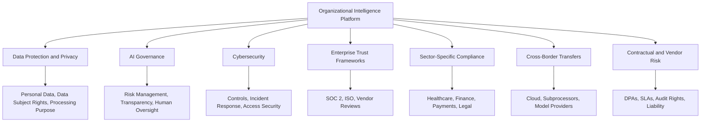
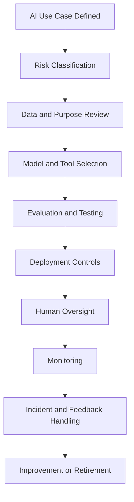
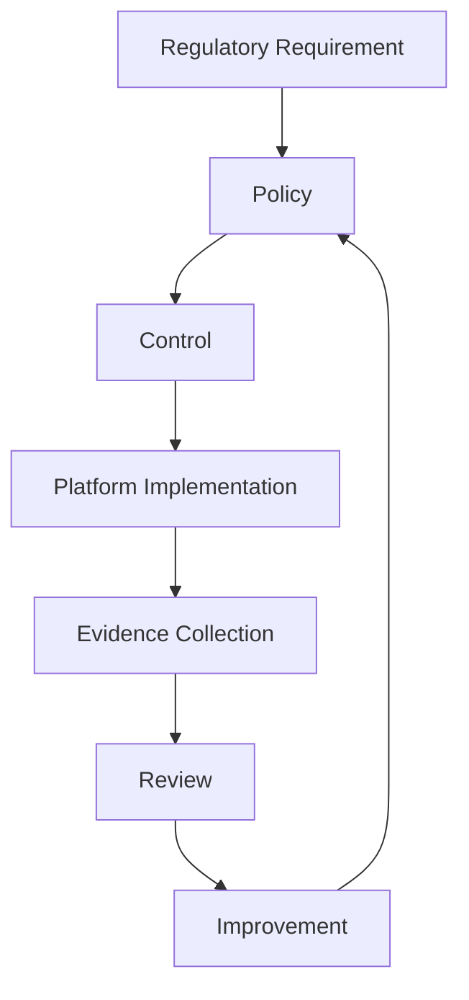

# Regulatory Research

## Derived From

- Canon Version: `v1.0.0`
- Architecture Version: `v1.0.0`
- Implementation Version: `v1.0.0`
- Strategy Version: `v1.0.0`
- Research Methodology Version: `v1.0.0`
- Market Research Version: `v1.0.0`
- Customer Discovery Version: `v1.0.0`
- Support Industry Research Version: `v1.0.0`
- Competitor Research Version: `v1.0.0`
- AI Research Version: `v1.0.0`
- Technology Research Version: `v1.0.0`

### Primary Repository Sources

- [Canon](../canon/README.md)
- [Architecture](../architecture/README.md)
- [Implementation](../implementation/README.md)
- [Strategy](../strategy/README.md)
- [Research Methodology](./00_RESEARCH_METHODOLOGY.md)
- [Market Research](./01_MARKET_RESEARCH.md)
- [Customer Discovery](./02_CUSTOMER_DISCOVERY.md)
- [Support Industry Research](./03_SUPPORT_INDUSTRY_RESEARCH.md)
- [Competitor Research](./04_COMPETITOR_RESEARCH.md)
- [AI Research](./05_AI_RESEARCH.md)
- [Technology Research](./06_TECHNOLOGY_RESEARCH.md)

---

Status: **Active**

## Primary Research Question

What regulatory, compliance, privacy, security, and AI governance requirements should shape the design, deployment, and operation of an Organizational Intelligence Platform?

This is an objective regulatory research document. It is not legal advice, a compliance certification plan, or a substitute for jurisdiction-specific legal review.

The purpose is to identify regulatory forces that should influence product architecture, data governance, AI governance, security, enterprise readiness, and go-to-market strategy.

## 1. Executive Summary

## Research Objective

This report evaluates the regulatory landscape surrounding an Organizational Intelligence Platform, especially where the platform processes customer support records, organizational knowledge, personal data, AI-generated outputs, evidence, audit trails, and institutional memory.

The central conclusion is:

> Regulation should not be treated as a late-stage compliance obstacle. For OIP, regulation reinforces the Canon: trusted organizational memory requires governance, explainability, human review, access control, auditability, and accountable knowledge handling from the beginning.

## Methodology Summary

This report follows the company's AI-Assisted Multi-Source Research methodology in a limited initial form:

- Repository review across Canon, Architecture, Implementation, Strategy, and prior Research documents.
- AI-assisted synthesis using Codex/ChatGPT.
- Public source review across data protection laws, AI governance frameworks, cybersecurity frameworks, regional AI guidance, and sectoral compliance references.
- Separation of legal fact, regulatory trend, architectural implication, and hypothesis.
- Confidence classification for major findings.

This document does not include jurisdiction-specific legal advice, paid counsel review, customer contract analysis, data processing agreement review, or formal compliance gap assessment.

## Major Findings

| Finding | Interpretation | Confidence |
| --- | --- | --- |
| Data protection obligations are central because OIP may process personal data, customer records, employee records, support conversations, and sensitive business data. | Privacy-by-design must be architectural, not procedural only. | Level A |
| AI regulation is moving toward risk management, transparency, human oversight, governance, and accountability. | OIP's Canon aligns strongly with this direction. | Level A |
| Indonesia's Personal Data Protection Law is directly relevant to the initial GTM context. | Indonesian privacy compliance must be considered before production pilots. | Level A |
| Indonesia's AI-specific legal framework remains developing, with ethics guidance and roadmap/regulatory movement emerging. | OIP should prepare for stricter AI governance even before detailed rules stabilize. | Level B |
| Enterprise customers will often impose compliance expectations beyond minimum law, including SOC 2, ISO 27001-style security expectations, AI governance, auditability, and contractual controls. | Trust frameworks may matter as much as statutes in sales cycles. | Level B |
| Cross-border data transfer, data residency, subprocessors, model providers, and AI tool access are major regulatory design concerns. | Model-agnostic architecture must also be jurisdiction-aware. | Level A |

## Overall Conclusion

The regulatory landscape supports the OIP thesis rather than undermining it.

Regulation increasingly asks systems to provide:

- Accountability.
- Governance.
- Human oversight.
- Security.
- Privacy.
- Transparency.
- Explainability.
- Risk management.
- Auditability.
- Data lifecycle control.

These are not bolt-ons to OIP. They are part of its identity.

The platform should therefore be designed around compliance-by-design:

## 2. Research Scope

## Included

| Area | Included Because |
| --- | --- |
| Data protection and privacy | OIP may process personal data, customer conversations, employee data, support tickets, and organizational records. |
| AI regulation and AI governance | OIP uses AI to assist reasoning, retrieval, knowledge extraction, and workflow support. |
| Indonesia regulatory landscape | Initial GTM and operating context focuses on Indonesia. |
| EU AI Act and GDPR | These are influential global references and may affect customers with EU operations or users. |
| ASEAN AI governance | Regional AI governance guidance is relevant to Southeast Asian expansion. |
| Cybersecurity frameworks | OIP must protect sensitive organizational knowledge and enterprise data. |
| Enterprise trust frameworks | Customers may require SOC 2, ISO-style controls, vendor risk reviews, and security questionnaires. |
| Cross-border transfers | OIP may use cloud infrastructure, subprocessors, model providers, and integrations across jurisdictions. |
| Sector-specific compliance | Customer support may handle health, finance, payment, legal, or regulated industry data. |

## Excluded

| Area | Excluded Because |
| --- | --- |
| Formal legal opinions | Must be provided by qualified counsel. |
| Country-by-country exhaustive legal mapping | Requires a dedicated legal research workstream. |
| Contract drafting | Belongs in legal/commercial operations. |
| Compliance certification execution | Belongs in security, operations, and audit programs. |
| Tax, employment, corporate, and labor law | Outside the immediate OIP product and platform scope. |
| Consumer protection law deep dive | Relevant later if OIP becomes customer-facing at scale, but not the central initial research topic. |

## 3. Research Methodology

## AI Systems Consulted

| System | Role |
| --- | --- |
| Codex / ChatGPT | Repository review, regulatory landscape synthesis, drafting, and consistency checking. |

This version does not include parallel validation from Claude, Gemini, Perplexity, Manus, legal research databases, or outside counsel. Future versions should include legal expert review before operational reliance.

## Public Sources Reviewed

| Source | Research Use |
| --- | --- |
| [European Commission: EU AI Act](https://digital-strategy.ec.europa.eu/en/policies/regulatory-framework-ai) | AI Act timeline, risk-based regulatory framework, and applicability milestones. |
| [European Commission: Data Protection](https://commission.europa.eu/law/law-topic/data-protection_en) | EU data protection framework and international data transfer mechanisms. |
| [GDPR Legal Text](https://gdpr-info.eu/) | GDPR rights, obligations, data processing principles, and legal reference structure. |
| [DLA Piper: Indonesia Data Protection Laws](https://www.dlapiperdataprotection.com/?c=ID&t=law) | Indonesia PDP Law summary and transition period context. |
| [ICLG: Indonesia Data Protection 2025](https://iclg.com/practice-areas/data-protection-laws-and-regulations/indonesia/) | Indonesia data protection overview and principal legislation. |
| [ASEAN Briefing: Indonesia PDP Law Guide](https://www.aseanbriefing.com/doing-business-guide/indonesia/company-establishment/personal-data-protection-law) | Indonesia PDP Law scope and business implications. |
| [Legal 500: Indonesia Artificial Intelligence Guide](https://www.legal500.com/guides/chapter/indonesia-artificial-intelligence/?export-pdf=) | Indonesia AI regulation status and reference to AI ethics guidance. |
| [UNESCO AI Ethics Observatory: Indonesia](https://www.unesco.org/ethics-ai/en/indonesia) | Indonesia national AI strategy and AI governance context. |
| [NIST AI Risk Management Framework](https://www.nist.gov/itl/ai-risk-management-framework) | AI risk management and generative AI governance reference. |
| [NIST Generative AI Profile](https://nvlpubs.nist.gov/nistpubs/ai/NIST.AI.600-1.pdf) | Generative AI governance, content provenance, testing, and incident disclosure guidance. |
| [ISO/IEC 42001:2023](https://www.iso.org/standard/42001) | AI management system standard for responsible AI governance. |
| [NIST Cybersecurity Framework 2.0](https://www.nist.gov/cyberframework) | Cybersecurity risk management framework. |
| [AICPA Trust Services Criteria](https://www.aicpa-cima.com/resources/download/2017-trust-services-criteria-with-revised-points-of-focus-2022) | SOC 2 trust service categories and control criteria. |
| [OWASP Top 10 for LLM Applications](https://owasp.org/www-project-top-10-for-large-language-model-applications/) | AI application security risks. |
| [ASEAN Guide on AI Governance and Ethics](https://asean.org/book/asean-guide-on-ai-governance-and-ethics/) | Regional AI governance principles and interoperability direction. |
| [Singapore Model AI Governance Framework for Generative AI](https://www.imda.gov.sg/resources/press-releases-factsheets-and-speeches/press-releases/2024/public-consult-model-ai-governance-framework-genai) | Regional reference for generative AI governance. |
| [PCI Security Standards Council Document Library](https://www.pcisecuritystandards.org/document_library/) | Payment card data security standard reference. |
| [HHS HIPAA Privacy Rule](https://www.hhs.gov/hipaa/for-professionals/privacy/laws-regulations/index.html) | U.S. protected health information privacy reference for regulated healthcare contexts. |

## Confidence Levels

| Level | Meaning |
| --- | --- |
| Level A | Strongly supported by official sources, statutes, standards, or widely accepted compliance frameworks. |
| Level B | Supported by credible public sources and regulatory trend analysis, but requiring legal or customer-specific interpretation. |
| Level C | Emerging or jurisdiction-specific interpretation requiring validation. |
| Level D | Unknown, speculative, or insufficiently evidenced. |

## 4. Regulatory Landscape Overview

OIP operates at the intersection of several regulatory domains.

## Regulatory Themes

| Theme | Why It Matters to OIP |
| --- | --- |
| Lawful data processing | OIP must know why it processes data and under what authority. |
| Data minimization | AI systems should not receive unnecessary sensitive context. |
| Purpose limitation | Organizational memory should not repurpose data without governance. |
| Access control | Users, services, and AI tools must only access authorized data. |
| Human oversight | AI-assisted decisions need accountable review in meaningful contexts. |
| Transparency | Customers and organizations may need to know how AI is used. |
| Auditability | Enterprises need evidence that controls exist and work. |
| Data lifecycle | Retention, deletion, correction, and export must be possible. |
| Security | Sensitive organizational data must be protected. |
| Vendor management | Model providers, cloud providers, and integrations create regulatory dependencies. |

## Strategic Interpretation

Regulation increasingly rewards products that can answer:

- What data was used?
- Why was it used?
- Who accessed it?
- What did AI generate?
- What evidence supported the output?
- Who reviewed it?
- Was the output approved, rejected, or revised?
- Where is it stored?
- How can it be corrected or deleted?

These questions map directly to the OIP architecture.

## 5. Data Protection and Privacy

Data protection is the most immediate regulatory concern for OIP.

OIP may process:

- Customer names and contact details.
- Support tickets.
- Chat transcripts.
- Email messages.
- CRM records.
- Employee names and roles.
- Internal comments.
- Account histories.
- Product usage context.
- Documents and attachments.
- Sensitive business information.
- Potentially regulated personal data depending on customer industry.

## Data Protection Principles

| Principle | OIP Implication |
| --- | --- |
| Lawfulness | Customers and platform operators must define lawful bases or contractual authority for processing. |
| Fairness | AI-assisted processing should not create hidden or unreasonable consequences. |
| Transparency | Users and customers should understand relevant AI and data processing. |
| Purpose limitation | Data collected for support should not be reused for unrelated purposes without authorization. |
| Data minimization | AI context should include only what is needed. |
| Accuracy | Organizational memory must support correction and validation. |
| Storage limitation | Retention policies should govern evidence, logs, outputs, and memory. |
| Integrity and confidentiality | Security controls must protect data throughout the lifecycle. |
| Accountability | The platform should produce evidence of controls and decisions. |

## Privacy Controls for OIP

| Control | Product or Architecture Requirement |
| --- | --- |
| Data inventory | Track categories of data processed by the platform. |
| Processing purpose registry | Document why each data category is processed. |
| Role-based access control | Enforce access by user role, organization, tenant, workflow, and purpose. |
| Consent or lawful-basis tracking | Support customer compliance where consent or other basis matters. |
| Data subject request support | Enable export, correction, deletion, and access workflows where applicable. |
| Retention policies | Define and enforce lifecycle rules for evidence, logs, and memory. |
| Redaction | Remove or mask sensitive data before AI processing when possible. |
| Subprocessor controls | Track cloud, model, analytics, and infrastructure subprocessors. |
| Audit logs | Record access, processing, review, and memory changes. |

## Privacy Architecture Pattern

## 6. AI Regulation and Governance

AI regulation is moving toward risk-based governance.

## Key AI Governance Themes

| Theme | OIP Relevance |
| --- | --- |
| Risk classification | AI use cases should be categorized by impact and required controls. |
| Human oversight | High-impact AI outputs should remain reviewable and accountable. |
| Transparency | Users may need to know when AI is used and how outputs are generated. |
| Data governance | Training, retrieval, prompts, and context must respect data rights and security. |
| Robustness and security | AI systems must resist misuse, prompt injection, and unauthorized actions. |
| Monitoring | AI performance and failure modes require ongoing observation. |
| Incident handling | AI failures should be reported, investigated, and corrected. |
| Documentation | AI systems need purpose, limitations, evaluation, and control records. |

## EU AI Act Relevance

The EU AI Act entered into force on August 1, 2024, with staged applicability. It is risk-based and includes obligations for prohibited practices, high-risk systems, general-purpose AI models, transparency, governance, and market oversight.

OIP may not always be a high-risk AI system, but certain customer deployments or use cases could become higher risk depending on context.

| OIP Use Case | Possible AI Act Sensitivity |
| --- | --- |
| Customer support answer drafting | Usually lower risk, but transparency and quality controls matter. |
| Employee performance analysis | Potentially higher risk if used for employment decisions. |
| Credit, insurance, healthcare, legal, or public-sector decision support | May trigger sectoral or high-risk concerns. |
| Knowledge recommendations | Risk depends on downstream use and impact. |
| Autonomous workflow actions | Risk increases with impact, authority, and reversibility. |

## AI Management Standards

ISO/IEC 42001:2023 is important because it frames AI governance as a management system, not only a technical control set.

For OIP, this suggests the need for:

- AI system inventory.
- Risk assessment.
- Impact assessment.
- Lifecycle management.
- Human oversight.
- Transparency practices.
- Supplier management.
- Monitoring and improvement.

## AI Governance Lifecycle

## 7. Indonesia Regulatory Landscape

Indonesia is especially important because the initial GTM focus is Indonesia.

## Personal Data Protection

Indonesia's Law No. 27 of 2022 concerning Personal Data Protection is the country's comprehensive personal data protection framework. Public legal summaries identify it as applicable to personal data processing by controllers and processors, with obligations around lawful processing, data subject rights, data security, data transfers, and accountability.

The transition period ended on October 17, 2024, making PDP compliance an active concern by the current date of June 26, 2026.

## Indonesia PDP Implications for OIP

| Area | Implication |
| --- | --- |
| Controller and processor roles | OIP must clarify whether it acts as processor, controller, or joint controller in each relationship. |
| Lawful processing | Customer contracts and data processing terms must define permitted processing. |
| Data subject rights | The platform should support access, correction, deletion, and related workflows where applicable. |
| Cross-border transfer | Cloud and AI provider architecture may require transfer analysis. |
| Security obligations | Technical and organizational safeguards are required. |
| Breach response | Incident detection, investigation, notification, and records are necessary. |
| Data protection officer or function | Customers and the company may need assigned privacy responsibility depending on scale and role. |

## Indonesia AI Regulation

Indonesia does not yet appear to have a fully mature, comprehensive AI statute equivalent to the EU AI Act. Public sources identify:

- National AI strategy development.
- AI ethics guidance through ministerial circular guidance.
- Movement toward more formal AI roadmap or regulatory frameworks.
- Regional ASEAN AI governance influence.

This means the company should not wait for final AI-specific law before building controls.

## Indonesia-Specific Regulatory Design Priorities

| Priority | Reason |
| --- | --- |
| Privacy-by-design | PDP Law is directly relevant. |
| Clear customer contracts | Roles and processing purposes must be explicit. |
| Localized data handling | Customers may ask where data is stored and processed. |
| AI transparency | Emerging AI governance expectations favor disclosure and accountability. |
| Human review | Fits cultural, enterprise, and regulatory trust needs. |
| Security evidence | Enterprise buyers may require vendor risk assessment. |
| Partner readiness | Local implementation partners may need compliance documentation. |

## 8. Cross-Border Data Transfers and Data Residency

OIP may involve cloud infrastructure, model providers, integrations, support tools, analytics, and subprocessors. These often create cross-border transfer questions.

## Transfer Risk Map

| Transfer Scenario | Regulatory Concern |
| --- | --- |
| Indonesian customer data processed in overseas cloud regions | PDP transfer obligations and customer contractual concerns. |
| EU personal data processed outside the EEA | GDPR transfer mechanisms such as adequacy, SCCs, or other safeguards may be relevant. |
| AI model provider receives customer context | Subprocessor, data retention, training use, confidentiality, and transfer issues. |
| Support data exported to analytics tools | Purpose limitation, minimization, and security concerns. |
| Integrations with CRM/help desk systems | Data flow mapping and contractual responsibilities. |

## Architectural Implications

| Control | Purpose |
| --- | --- |
| Data flow mapping | Understand where data moves and why. |
| Region-aware deployment | Support customer data residency requirements where needed. |
| Subprocessor registry | Document infrastructure, AI, analytics, and support vendors. |
| Model provider controls | Ensure customer data is not retained or used for training unless explicitly permitted. |
| Data minimization | Reduce transfer volume and sensitivity. |
| Encryption | Protect data in transit and at rest. |
| Contractual transfer terms | Support customer and regulatory expectations. |

## 9. Security and Trust Frameworks

Enterprise customers often require security and trust evidence before adopting platforms that process sensitive data.

## Relevant Frameworks

| Framework | Relevance to OIP |
| --- | --- |
| NIST Cybersecurity Framework 2.0 | Helps structure cybersecurity risk management and governance. |
| SOC 2 Trust Services Criteria | Common enterprise trust framework for security, availability, confidentiality, processing integrity, and privacy. |
| ISO/IEC 27001-style information security management | Often requested by enterprise buyers even when not legally required. |
| ISO/IEC 42001 | AI management system standard relevant to responsible AI governance. |
| OWASP LLM Top 10 | AI application security risks relevant to prompt injection, excessive agency, and data disclosure. |
| PCI DSS | Relevant if platform touches payment card data; ideally OIP should avoid such scope where possible. |
| HIPAA | Relevant if healthcare customers expose protected health information to the platform. |

## Trust Readiness Matrix

| Customer Expectation | OIP Control |
| --- | --- |
| Security questionnaire | Documented controls, policies, architecture, and data flows. |
| Data processing agreement | Clear roles, subprocessors, transfers, retention, and security obligations. |
| Audit logs | Evidence of access, changes, AI actions, review, and approvals. |
| Incident response | Detection, escalation, investigation, notification, and remediation process. |
| Access controls | SSO, RBAC, tenant isolation, least privilege. |
| Encryption | Data protection in transit and at rest. |
| AI controls | Model inventory, prompt versioning, evaluation, human review, and output validation. |
| Vendor management | Subprocessor list and risk review. |

## 10. Sector-Specific and Customer-Driven Compliance

OIP's regulatory exposure depends heavily on customer industry and use case.

## Sectoral Exposure

| Sector | Potential Regulatory Sensitivity |
| --- | --- |
| Healthcare | Protected health information, HIPAA-like obligations, clinical safety, patient privacy. |
| Financial services | Customer financial data, auditability, outsourcing risk, model risk management, cybersecurity. |
| Insurance | Sensitive financial and health data, underwriting implications, fairness concerns. |
| Legal | Confidentiality, privilege, evidence handling, client data protection. |
| Government | Procurement controls, data residency, security, public accountability. |
| Education | Student data privacy and child/minor data concerns. |
| Payments | PCI DSS if payment card data enters platform scope. |
| Employment and HR | High sensitivity around employee profiling, performance, fairness, and decision support. |

## Product Strategy Implication

Early OIP pilots should avoid unnecessarily regulated data where possible.

For customer support beachhead pilots, the company should prefer:

- B2B support data without payment card data.
- Non-healthcare use cases unless health compliance is deliberately planned.
- Knowledge workflows that support human review rather than automated eligibility decisions.
- Data minimization and redaction.
- Clear customer DPA and subprocessor terms.

## 11. Operational Compliance Requirements

Regulatory compliance is not only a legal checklist. It becomes operational muscle.

## Operational Compliance Capabilities

| Capability | Why It Matters |
| --- | --- |
| Data inventory | Required to understand and govern processing. |
| Records of processing | Helps document purpose, categories, roles, and retention. |
| Privacy impact assessment | Identifies risk for sensitive or high-impact processing. |
| AI impact assessment | Evaluates AI use case risk, controls, and human oversight needs. |
| Access review | Ensures permissions remain appropriate. |
| Audit log review | Detects inappropriate access or suspicious behavior. |
| Retention review | Prevents indefinite storage without purpose. |
| Subprocessor review | Manages downstream vendor risk. |
| Incident response testing | Ensures breach and AI incident response readiness. |
| Policy training | Ensures employees understand data and AI responsibilities. |

## Compliance Operating Loop

The same learning mindset behind OIP should apply to compliance operations.

## 12. Regulatory Implications for AI and OIP

Regulation changes how AI should be designed inside OIP.

## AI Design Implications

| Regulatory Concern | OIP Design Response |
| --- | --- |
| Hallucination | Require evidence grounding, review, and uncertainty indicators. |
| Lack of transparency | Maintain source references, prompt/model metadata, and review history. |
| Automated decision risk | Keep humans accountable for high-impact outputs. |
| Data leakage | Use redaction, minimization, provider controls, and secure retrieval. |
| Cross-border model processing | Support model routing and jurisdiction-aware processing. |
| Bias or unfairness | Evaluate AI outputs and avoid unsupervised use in people-impacting decisions. |
| Explainability | Preserve evidence, reasoning summaries, and validation records. |
| Accountability | Assign owners, reviewers, and audit trails. |

## OIP Should Treat AI Outputs as Regulatory Objects

AI outputs may need metadata:

- Model used.
- Prompt version.
- Source evidence.
- Retrieval set.
- User or workflow requester.
- Timestamp.
- Confidence or uncertainty.
- Human reviewer.
- Approval status.
- Downstream use.
- Correction history.

This metadata is not bureaucratic clutter. It is the infrastructure of accountable intelligence.

## 13. Regulatory Risk Assessment

| Risk | Likelihood | Impact | Description | Mitigation |
| --- | --- | --- | --- | --- |
| Personal data misuse | Medium | High | Data used beyond permitted purposes or without proper role clarity. | DPA, purpose registry, minimization, access controls. |
| Unauthorized access | Medium | High | Sensitive evidence or memory exposed to wrong users. | RBAC, SSO, tenant isolation, audit logs. |
| AI-generated harmful or incorrect output | High | High | AI produces inaccurate answer that affects customer or business decision. | Human review, evidence grounding, validation workflows. |
| Cross-border transfer noncompliance | Medium | High | Data moves across jurisdictions without appropriate safeguards. | Data flow mapping, regional controls, contractual terms. |
| Subprocessor risk | Medium | Medium to High | Cloud, model, or analytics vendors process data without adequate controls. | Vendor review, subprocessor registry, contractual controls. |
| Data retention failure | Medium | Medium | Data kept longer than needed or deleted before obligations are met. | Retention policies and lifecycle automation. |
| Data subject rights failure | Medium | High | Platform cannot support access, correction, deletion, or export requests. | Rights workflows and data mapping. |
| AI governance gap | High | Medium to High | Company cannot document how AI is controlled and reviewed. | AI inventory, risk classification, evaluation, review records. |
| Sectoral compliance accidental scope | Medium | High | Payment, health, or regulated data enters platform unexpectedly. | Data intake rules, redaction, customer configuration, contractual restrictions. |
| Regulatory change | High | Medium | Laws evolve faster than product controls. | Regulatory monitoring and adaptable governance architecture. |

## 14. Compliance-by-Design Principles

OIP should treat compliance as an architectural property.

| Principle | Explanation |
| --- | --- |
| Govern data before using AI. | AI should never receive context that the platform is not authorized to process. |
| Separate evidence from interpretation. | Raw evidence, AI output, and validated knowledge should remain distinguishable. |
| Make human review explicit. | Review should be recorded, attributable, and visible. |
| Keep models replaceable. | Regulatory, customer, or regional constraints may require model/provider changes. |
| Design for deletion and correction. | Memory must support lifecycle management and rights requests. |
| Minimize sensitive context. | Less data exposure means lower regulatory and security risk. |
| Preserve audit trails. | Trust requires proof, not merely policy statements. |
| Support customer control. | Enterprise customers need configuration, visibility, and governance integration. |
| Prefer explainable workflows. | Explainability should be a workflow property, not only a model feature. |

## 15. Future Regulatory Trends

## Trend Matrix

| Trend | Direction | OIP Implication | Confidence |
| --- | --- | --- | --- |
| AI-specific regulation | Increasing | Build AI governance before it is mandatory everywhere. | Level A |
| Privacy enforcement | Increasing | Privacy controls must be operational and provable. | Level A |
| Enterprise AI audits | Increasing | Maintain AI inventories, logs, evaluation evidence, and review records. | Level B |
| Data residency demands | Increasing in some sectors | Deployment and model routing may need regional options. | Level B |
| Vendor and subprocessor scrutiny | Increasing | Track and document AI, cloud, and analytics providers. | Level B |
| Sector-specific AI controls | Increasing | Avoid high-risk sectors until compliance posture matures. | Level B |
| AI transparency expectations | Increasing | Users and customers may need AI disclosure and explanation. | Level A |
| Regional AI framework convergence | Gradual | ASEAN, EU, ISO, and NIST themes are converging around risk management. | Level B |

## Durable vs Uncertain

| Durable | Uncertain |
| --- | --- |
| Privacy, security, and access control. | Exact AI law timelines in every jurisdiction. |
| Human oversight and accountability. | Final shape of Indonesia's AI-specific framework. |
| Auditability and evidence. | Whether OIP use cases become legally classified as high-risk in each market. |
| Vendor risk management. | Customer-specific data residency requirements. |
| AI governance documentation. | Future model certification requirements. |

## 16. Confidence Assessment

## Validated Findings

| Finding | Confidence | Evidence |
| --- | --- | --- |
| Privacy and personal data protection are directly relevant to OIP. | Level A | GDPR, Indonesia PDP Law, enterprise data processing requirements. |
| AI governance is becoming a major regulatory and enterprise trust requirement. | Level A | EU AI Act, NIST AI RMF, ISO/IEC 42001, ASEAN AI guidance. |
| Security controls and auditability are foundational for enterprise adoption. | Level A | NIST CSF, SOC 2 expectations, customer vendor risk practice. |
| Human oversight aligns with regulatory expectations for responsible AI. | Level A | EU AI Act themes, NIST AI RMF, ISO/IEC 42001, ASEAN guidance. |

## Likely Findings

| Finding | Confidence | Evidence |
| --- | --- | --- |
| Indonesia will continue strengthening AI governance beyond current ethics guidance. | Level B | Public roadmap and legal commentary. |
| Enterprise buyers will demand trust evidence before adopting OIP. | Level B | Common SaaS procurement and security review practices. |
| Cross-border transfer questions will arise early. | Level B | Cloud, AI model, and integration architecture. |
| AI governance will become a differentiator in regulated or trust-sensitive accounts. | Level B | Market and regulatory direction. |

## Emerging Trends

| Trend | Confidence | Notes |
| --- | --- | --- |
| AI management system certification | Level B | ISO/IEC 42001 is emerging as a recognized AI governance standard. |
| AI incident reporting | Level C | Likely to become more formalized across jurisdictions. |
| Model transparency and provenance | Level B | Increasingly emphasized by AI frameworks and enterprise customers. |
| Regional AI governance alignment in ASEAN | Level C | ASEAN guidance exists; national implementation varies. |

## Hypotheses

| Hypothesis | Confidence | Validation Needed |
| --- | --- | --- |
| OIP governance features can become a competitive advantage. | Level B | Customer discovery and procurement feedback. |
| Human-reviewed organizational memory will reduce regulatory risk compared with unreviewed AI assistants. | Level C | Pilot evidence and legal review. |
| Early compliance investment will accelerate enterprise trust in Indonesia. | Level C | Sales cycle and partner validation. |

## Unknowns

| Unknown | Why It Matters |
| --- | --- |
| Exact future Indonesian AI legal requirements | Determines product controls and documentation. |
| Customer sector mix | Determines exposure to healthcare, finance, public sector, or payments regulations. |
| Data residency expectations | Determines deployment architecture. |
| Model provider compliance requirements | Determines AI vendor strategy. |
| Whether OIP will be classified as high-risk in specific use cases | Determines AI governance burden. |

## 17. Repository Impact

Regulatory research affects multiple repository layers.

| Repository Area | Impact |
| --- | --- |
| Canon | Reinforces Human Review, Governance, Explainability, Organizational Memory, and AI as Amplifier. |
| Architecture | Requires privacy-by-design, auditability, security controls, access control, and data lineage. |
| Implementation | Requires rights workflows, retention, redaction, model metadata, logs, and policy enforcement. |
| Strategy | Supports trust-first positioning and careful ICP selection. |
| Roadmap | Suggests sequencing compliance foundations before high-risk automation. |
| Security Architecture | Reinforces IAM, encryption, audit, incident response, and vendor management. |
| AI Architecture | Requires AI inventory, model abstraction, evaluation, human oversight, and prompt/model versioning. |
| Deployment Architecture | May require region-aware deployment and data transfer controls. |

## Product Implications

OIP should support:

- Tenant isolation.
- Role-based access control.
- Audit logs.
- Data export.
- Data deletion/correction workflows.
- Retention controls.
- Source provenance.
- AI output metadata.
- Human review workflows.
- Subprocessor transparency.
- Customer-configurable policies.

## Strategy Implications

The company should avoid selling OIP as unrestricted automation.

The better strategic posture is:

> OIP enables governed intelligence: AI-assisted work that becomes trusted organizational capability only through evidence, review, and accountable memory.

## 18. Traceability Matrix

| Canon Concept | Regulatory Finding | Confidence |
| --- | --- | --- |
| Organizational Memory | Memory must be governed, durable, correctable, and lifecycle-managed. | Level A |
| Human Review | Human oversight is essential for accountable AI and enterprise trust. | Level A |
| Governance | Regulatory direction strongly favors governance-by-design. | Level A |
| Explainability | Evidence, provenance, and review history are required for trust and auditability. | Level A |
| Knowledge Flywheel | Learning loops must avoid converting unvalidated AI output into official knowledge. | Level B |
| AI as Amplifier, Not Authority | Regulation reinforces AI as assistive unless outputs are reviewed and accountable. | Level A |
| Domain Language | Clear domain concepts support compliance mapping and responsibility boundaries. | Level B |
| Organizational Entropy | Compliance failures often arise from fragmented data, unclear ownership, and weak memory. | Level B |
| Model Agnosticism | Regulatory and customer constraints may require provider flexibility. | Level B |
| Institutional Capability | Compliance capabilities can become organizational trust assets. | Level B |

## 19. Limitations

This research has significant limitations.

| Limitation | Effect |
| --- | --- |
| Not legal advice | Operational decisions require qualified counsel. |
| Rapid regulatory change | AI and data laws are evolving quickly, especially in Indonesia and the EU. |
| Jurisdictional variation | Requirements differ across countries, sectors, and customer types. |
| Public-source limitations | Some regulatory interpretations depend on legal commentary or draft materials. |
| No customer contract review | Actual obligations depend on contracts, DPAs, SLAs, and procurement terms. |
| No formal data protection impact assessment | DPIA or equivalent assessment must be conducted for specific processing. |
| No production architecture review | Compliance implications depend on actual data flows and infrastructure. |
| AI-assisted research limitations | Codex/ChatGPT synthesized this document; future AAMR work should include legal expert review. |

## 20. Closing

Regulation is not separate from the Organizational Intelligence Platform's purpose.

OIP exists to help organizations preserve, govern, and compound knowledge. Regulation asks many of the same questions:

- What information exists?
- Who controls it?
- Who can access it?
- Why is it processed?
- What decisions depend on it?
- Can it be corrected?
- Can it be deleted?
- Is it secure?
- Is it explainable?
- Who is accountable?

The long-term regulatory direction is clear even where specific rules are still evolving: enterprise AI and knowledge systems must become more governed, more transparent, more secure, and more accountable.

That direction strengthens the Canon.

The company should therefore build OIP as a compliance-aware platform from the beginning, not because compliance is the product, but because trusted organizational intelligence cannot exist without governance.

The decisive regulatory design question should be:

> Does this feature make organizational knowledge more trustworthy, accountable, secure, and governable?

If the answer is no, the feature may create intelligence theater rather than Organizational Intelligence.
