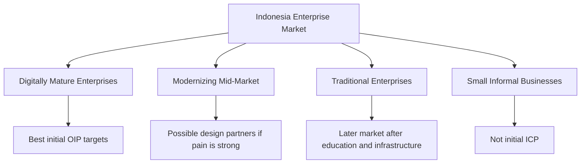

# Indonesia Market Research

## Derived From

- Canon Version: `v1.0.0`
- Architecture Version: `v1.0.0`
- Implementation Version: `v1.0.0`
- Strategy Version: `v1.0.0`
- Research Methodology Version: `v1.0.0`
- Market Research Version: `v1.0.0`
- Customer Discovery Version: `v1.0.0`
- Support Industry Research Version: `v1.0.0`
- Competitor Research Version: `v1.0.0`
- AI Research Version: `v1.0.0`
- Technology Research Version: `v1.0.0`
- Regulatory Research Version: `v1.0.0`

### Primary Repository Sources

- [Canon](../canon/README.md)
- [Architecture](../architecture/README.md)
- [Implementation](../implementation/README.md)
- [Strategy](../strategy/README.md)
- [Research Methodology](./00_RESEARCH_METHODOLOGY.md)
- [Market Research](./01_MARKET_RESEARCH.md)
- [Customer Discovery](./02_CUSTOMER_DISCOVERY.md)
- [Support Industry Research](./03_SUPPORT_INDUSTRY_RESEARCH.md)
- [Competitor Research](./04_COMPETITOR_RESEARCH.md)
- [AI Research](./05_AI_RESEARCH.md)
- [Technology Research](./06_TECHNOLOGY_RESEARCH.md)
- [Regulatory Research](./07_REGULATORY_RESEARCH.md)

---

Status: **Active**

## Primary Research Question

Is Indonesia the optimal initial launch market for the Organizational Intelligence Platform, and what market, operational, cultural, technological, and economic factors should shape the company's Indonesia-first strategy?

This is an objective market research document. It does not assume Indonesia is automatically the best market. It evaluates Indonesia as a launch environment using available evidence, repository strategy, and explicit confidence levels.

## 1. Executive Summary

## Research Objective

This report evaluates whether Indonesia should remain the company's first target market for validating and launching the Organizational Intelligence Platform.

The central conclusion is:

> Indonesia should remain the recommended first launch market for customer discovery and early design-partner validation, but the evidence does not yet prove that Indonesia is the globally optimal launch market. The strongest strategy is Indonesia-first, not Indonesia-only.

Indonesia offers a compelling combination of large domestic market scale, rapid digital transformation, growing enterprise software demand, increasing AI interest, maturing cloud and SaaS adoption, a significant support and service economy, and strategic relevance as Southeast Asia's largest economy.

However, Indonesia also presents real constraints:

- Price sensitivity.
- Uneven enterprise digital maturity.
- Procurement complexity.
- Trust requirements.
- AI governance gaps.
- Documentation maturity variation.
- Dependence on local relationships and implementation partners.
- Regional concentration in Jakarta and major business hubs.

## Methodology Summary

This report follows the company's AI-Assisted Multi-Source Research methodology in a limited initial form:

- Repository review across Canon, Architecture, Implementation, Strategy, and prior Research documents.
- AI-assisted synthesis using Codex/ChatGPT.
- Public source review across government, multilateral, industry, market intelligence, and enterprise technology sources.
- Explicit separation of facts, interpretations, hypotheses, and unknowns.
- Confidence classification for major conclusions.

This report does not yet include primary customer interviews, design partner evidence, procurement interviews, paid local market research, or direct survey data from Indonesian support leaders.

## Major Findings

| Finding | Interpretation | Confidence |
| --- | --- | --- |
| Indonesia is Southeast Asia's largest economy and one of the region's largest digital markets. | Market scale supports launch-market seriousness. | Level A |
| Indonesia's economy remains resilient around the 5% growth range, but purchasing power and investment sentiment vary. | Enterprise opportunity exists, but pricing must be locally realistic. | Level A |
| Digital transformation, cloud, SaaS, CRM, e-government, and AI adoption are growing. | OIP can ride existing modernization momentum. | Level B |
| Enterprise AI interest is strong, but governance, ethics, infrastructure, security, and talent gaps remain. | OIP's governed-AI posture fits the market need. | Level B |
| Public evidence on Indonesian customer support maturity is thinner than global support evidence. | Customer Support as a local beachhead is plausible but requires primary discovery. | Level C |
| Indonesia can be a Southeast Asia learning environment, but success does not automatically transfer to Singapore, Malaysia, Thailand, Vietnam, or the Philippines. | Regional expansion should be deliberate and localized. | Level B |
| Pricing sensitivity is material. Jakarta's 2026 monthly minimum wage is around IDR 5.7 million, close to the prompt's approximate IDR 6 million signal, but enterprise pricing should be based on ROI, value, and customer segment—not consumer income alone. | Pricing must be value-based, localized, and pilot-friendly. | Level A |

## Recommendation

Indonesia should remain the first target market under the following conditions:

- Target digitally mature medium and large organizations first.
- Prioritize B2B, SaaS, technology-enabled, financial, telecom, logistics, education, and enterprise service organizations with meaningful support volume.
- Use design partners and pilots instead of broad self-serve launch.
- Sell trust, governance, knowledge reuse, and operational learning rather than generic AI automation.
- Use local partnerships for implementation, credibility, integration, and procurement navigation.
- Price around demonstrated value and segment maturity, not U.S. SaaS benchmarks.
- Validate willingness to pay before committing to broad GTM spend.

Confidence that Indonesia is a strong first validation market: **Level B**.

Confidence that Indonesia is the globally optimal launch market: **Level C**.

## 2. Research Scope

## Included

| Area | Included Because |
| --- | --- |
| Indonesian enterprise software market | OIP is an enterprise platform and depends on software adoption behavior. |
| Customer Support organizations | The current beachhead thesis centers on Customer Support. |
| B2B SaaS adoption | SaaS adoption indicates readiness for subscription-based enterprise platforms. |
| AI adoption | OIP uses AI-assisted workflows, governance, and organizational learning. |
| Digital transformation | Digital maturity shapes data availability, workflow readiness, and adoption urgency. |
| Enterprise IT | IT maturity affects integration, security review, and deployment feasibility. |
| Medium and large enterprises | These organizations are more likely to have support volume, knowledge complexity, and budgets. |
| Government digital initiatives | Government modernization shapes market norms, infrastructure, regulation, and AI discourse. |
| Startup ecosystem | Startups may be early adopters, partners, or talent sources. |
| Technology services | System integrators, consultants, and implementation partners influence Indonesian enterprise adoption. |

## Excluded

| Area | Excluded Because |
| --- | --- |
| Consumer applications | OIP is not a consumer app. Consumer usage signals are secondary. |
| Small informal businesses | These businesses may be numerous but are unlikely to be initial OIP buyers. |
| Pure e-commerce trends unrelated to enterprise software | E-commerce growth matters only when it affects enterprise support, service operations, or digital maturity. |
| Tourism and general lifestyle analysis | Not relevant to enterprise platform launch strategy. |
| Full sector-by-sector legal analysis | Covered directionally in Regulatory Research and requires legal review. |

## 3. Research Methodology

## AI Systems Consulted

| System | Role |
| --- | --- |
| Codex / ChatGPT | Repository review, public-source synthesis, Indonesia market analysis, drafting, and consistency checking. |

This version does not include parallel synthesis from Claude, Gemini, Perplexity, Manus, or local-market expert interviews. Future versions should include multi-model review and Indonesian customer discovery.

## Public Sources Reviewed

| Source | Research Use |
| --- | --- |
| [World Bank Indonesia Overview](https://www.worldbank.org/ext/en/country/indonesia) | Macroeconomic resilience, growth outlook, and development context. |
| [World Bank Indonesia Economic Prospects, December 2025](https://openknowledge.worldbank.org/entities/publication/2181f2fe-62c4-4a7c-b38d-d940dd673530) | Recent GDP growth, investment, trade, and macro conditions. |
| [BPS official press releases](https://www.bps.go.id/en/pressrelease) | Official Indonesian statistical source for economic indicators. |
| [BPS 2025 GDP summary via Business Indonesia](https://business-indonesia.org/news/bps-records-indonesia-s-economic-growth-at-5-11-in-2025) | Public reporting of BPS 2025 GDP growth and GDP values. |
| [IMF Indonesia country page](https://www.imf.org/en/countries/idn) | 2026 GDP growth, inflation, and population projections. |
| [Google / Temasek / Bain e-Conomy SEA](https://economysea.withgoogle.com/) | Southeast Asia and Indonesia digital economy context. |
| [Bain e-Conomy SEA 2025](https://www.bain.com/insights/e-conomy-sea-2025/) | SEA digital economy growth and monetization trends. |
| [Google: e-Conomy SEA 2025 AI Growth](https://business.google.com/en-all/think/ai-excellence/e-conomy-sea-2025-ai-growth/) | AI and digital economy growth across Southeast Asia. |
| [International Trade Administration: Indonesia Digital Economy](https://www.trade.gov/country-commercial-guides/indonesia-digital-economy) | U.S. government market view on enterprise software, SaaS, CRM, cloud, and digital services opportunity. |
| [International Trade Administration: Indonesia Digital Transformation](https://www.trade.gov/market-intelligence/indonesia-digital-transformation) | AI, SaaS, digital infrastructure, and transformation opportunity. |
| [UNCTAD Indonesia eTrade Readiness Assessment](https://unctad.org/publication/indonesia-etrade-readiness-assessment) | Digital trade and technology adoption context. |
| [OECD AI Policy Observatory: Indonesia AI Roadmap](https://oecd.ai/en/dashboards/policy-initiatives/national-artificial-intelligence-roadmap) | Indonesia AI roadmap, priorities, ethics, governance, talent, and infrastructure. |
| [UNESCO AI Ethics Observatory: Indonesia](https://www.unesco.org/ethics-ai/en/indonesia) | Indonesia national AI strategy and governance context. |
| [IBM Indonesia AI Study](https://asean.newsroom.ibm.com/2025-06-04-IBM-Study-Indonesia-Businesses-Primed-for-AI%2C-But-Face-Gaps-in-Security%2C-Infrastructure%2C-Ethics-and-Talent) | Enterprise AI readiness, operational gains, and governance gaps. |
| [Salesforce Indonesia Customer Service Transformation](https://www.salesforce.com/ap/blog/ai-is-leading-the-charge-in-indonesias-customer-service-transformation/) | Indonesia customer service AI and service modernization context. |
| [ASEAN Briefing: Indonesia Minimum Wage](https://www.aseanbriefing.com/doing-business-guide/indonesia/human-resources-and-payroll/minimum-wage) | Local wage context and purchasing power signal. |
| [RSM Indonesia Minimum Wage 2026](https://www.rsm.global/indonesia/en/insights/minimum-wage-revisions-2026-navigating-new-regulations-jakarta-and-west-java) | Jakarta 2026 UMP reference and wage context. |
| [Indonesia Digital Economy: UN-backed eTrade Readiness](https://indonesia.un.org/en/311158-un-backed-roadmap-help-indonesia-accelerate-e-commerce-and-digital-trade) | Digital trade modernization and policy context. |
| [Mordor Intelligence: Indonesia BPO Services](https://www.mordorintelligence.com/industry-reports/indonesia-business-process-outsourcing-services-market) | BPO and customer care outsourcing market context. |

## Confidence Levels

| Level | Meaning |
| --- | --- |
| Level A | Strongly supported by official, multilateral, or high-quality public sources. |
| Level B | Supported by credible public sources and market logic, but requiring customer-specific validation. |
| Level C | Plausible hypothesis or market interpretation requiring primary research. |
| Level D | Unknown or insufficiently evidenced. |

## 4. Indonesia Economic Overview

Indonesia is a large, resilient, and strategically important economy.

## Economic Context

| Factor | Evidence and Interpretation | Relevance to OIP |
| --- | --- | --- |
| GDP and growth | World Bank and IMF sources point to growth around the 5% range, with resilience despite uncertainty. BPS-reported public summaries indicate 2025 growth around 5.11%. | A stable growth environment supports enterprise modernization, though not without budget discipline. |
| Population | IMF reports Indonesia's population above 287 million in 2026 projections. | Large domestic market and large labor/service base. |
| Digital economy | e-Conomy SEA and trade sources identify Indonesia as a major digital economy within Southeast Asia. | Digital business scale supports enterprise software demand. |
| Enterprise sector | Indonesia contains large conglomerates, financial institutions, telecoms, public-sector entities, technology companies, and regional champions. | OIP should target structured organizations, not the informal economy. |
| Workforce | Large workforce with growing digital talent, but skills gaps remain. | AI adoption will require enablement, training, and human-centered implementation. |
| Business environment | Indonesia offers scale but includes procurement complexity, regulatory evolution, and regional variation. | GTM requires patience, local trust, and partner strategy. |

## Digital Economy Context

Indonesia's digital economy is often described as the largest or one of the largest in Southeast Asia. The e-Conomy SEA series indicates sustained regional digital economy growth, with ASEAN's digital economy surpassing major GMV milestones by 2025. U.S. trade sources identify Indonesian demand for enterprise software, SaaS, CRM, cloud services, and e-government platforms.

This matters because OIP requires customers that already have:

- Digital workflows.
- Support or service systems.
- Data records.
- Cloud or SaaS openness.
- Knowledge fragmentation.
- Operational complexity.
- Willingness to modernize.

Indonesia contains such customers, but they are concentrated in more digitally mature segments.

## Economic Interpretation

Indonesia is not a low-friction enterprise SaaS market in the same way as the United States. It is large, growing, relationship-driven, and unevenly mature.

The opportunity is real, but the company should not mistake macro scale for immediate product-market fit.

## 5. Enterprise Digital Maturity

Indonesia's enterprise digital maturity is improving, but uneven.

## Digital Maturity Signals

| Signal | Strength | Constraint |
| --- | --- | --- |
| Digital transformation momentum | Government and private sector modernization are active. | Execution varies by industry, region, and organization size. |
| Cloud adoption | Cloud market and infrastructure investment are growing. | Data residency, security, legacy IT, and procurement can slow adoption. |
| SaaS adoption | Demand for SaaS, CRM, cloud services, and digital platforms is documented by market sources. | Price sensitivity and local support expectations matter. |
| AI readiness | IBM and public AI roadmap sources show strong AI interest and confidence. | Governance, ethics, infrastructure, and talent gaps remain. |
| IT maturity | Banks, telcos, large enterprises, technology companies, and digital-native firms show stronger maturity. | Traditional sectors may lack clean data and workflow discipline. |
| Enterprise modernization | Shared services, cloud, CRM, ITSM, and customer service modernization are growing. | Integration with legacy systems may be difficult. |

## Digital Maturity Segmentation

## Strengths

- Large and growing digital economy.
- Strong mobile and digital consumer behavior.
- Enterprise modernization in financial services, telecom, logistics, technology, and public services.
- Increasing cloud and SaaS availability.
- Strong interest in AI-enabled productivity.
- Large support, service, and operations workforces.

## Constraints

- Uneven data quality.
- Legacy systems.
- Manual processes.
- Variable documentation culture.
- Budget sensitivity.
- Security and procurement scrutiny.
- Talent gaps in AI, data governance, and enterprise architecture.

## OIP Interpretation

The initial target should not be "all Indonesian enterprises."

The initial target should be:

> Indonesian organizations that are already digital enough to have operational data, painful knowledge fragmentation, and leadership urgency around AI or service quality.

## 6. Customer Support Landscape

Public Indonesia-specific data on support organization maturity is limited. Global support research and Indonesia digital transformation evidence suggest that Customer Support is plausible as a beachhead, but local validation is still required.

## Support Landscape Factors

| Factor | Market Interpretation | Confidence |
| --- | --- | --- |
| Support demand | Indonesia's large digital economy creates high customer interaction volume in fintech, e-commerce, telecom, SaaS, logistics, education, and services. | Level B |
| Help desk maturity | Digitally mature companies likely use ticketing, CRM, chat, email, WhatsApp, call centers, or custom systems. | Level C |
| Knowledge management | Likely uneven; mature enterprises have documentation, while many teams rely on tribal knowledge and chat. | Level C |
| Ticketing systems | Global tools and local/custom systems likely coexist. | Level C |
| AI usage | AI interest is growing, but governance maturity lags. | Level B |
| Documentation culture | Expected to vary widely; may be weaker in fast-growing teams. | Level C |
| Outsourcing | Indonesia has a growing BPO and customer care outsourcing market. | Level B |
| Shared service centers | Large enterprises may centralize IT, HR, finance, and customer service operations. | Level C |

## Support Beachhead Fit

| Criterion | Indonesia Fit | Notes |
| --- | --- | --- |
| High support volume | Strong in digital sectors. | Fintech, telecom, e-commerce, logistics, education, and SaaS are promising. |
| Repetitive issues | Likely strong. | Must be validated with ticket data. |
| Knowledge fragmentation | Likely strong. | Especially where chat, docs, CRM, and ticketing are disconnected. |
| AI readiness | Moderate to strong. | Interest is high; governance and talent gaps remain. |
| Human review culture | Likely necessary. | Trust in AI will depend on accountable human oversight. |
| Measurable ROI | Strong if ticket metrics exist. | Requires baseline data. |
| Willingness to pay | Unknown. | Must be tested through pilots and buyer discovery. |

## Support Workflow Hypothesis

## Customer Support Recommendation

Customer Support remains a suitable Indonesian beachhead, but only for organizations with:

- Meaningful support volume.
- Digital ticket or conversation history.
- Leadership interest in AI or service modernization.
- Existing support experts.
- Documentation or knowledge pain.
- Willingness to validate AI-assisted outputs.

The company should not begin with low-volume or highly informal support teams.

## 7. Enterprise Software Landscape

Indonesia's enterprise software landscape includes global platforms, local providers, system integrators, cloud providers, and custom-built internal systems.

## Representative Platform Categories

| Category | Representative Examples | Adoption Pattern |
| --- | --- | --- |
| Productivity suites | Microsoft 365, Google Workspace. | Common foundation for email, documents, collaboration, and identity. |
| CRM and service | Salesforce, HubSpot, Microsoft Dynamics, local CRM vendors. | Used by more mature customer-facing organizations. |
| Help desk and support | Zendesk, Freshdesk, Intercom, Jira Service Management, local help desk tools, custom systems. | Likely varies by company size, sector, and budget. |
| ITSM and workflow | ServiceNow, Jira Service Management, Freshservice, local IT service tools. | More common in larger or IT-mature organizations. |
| Collaboration and documentation | Teams, SharePoint, Confluence, Notion, Google Drive, local/custom wikis. | Knowledge fragmentation across tools is likely. |
| Cloud and infrastructure | AWS, Google Cloud, Microsoft Azure, Alibaba Cloud, local cloud/data center providers. | Cloud adoption growing, with data residency and cost considerations. |
| Local enterprise vendors | Local ERP, CRM, HRIS, accounting, customer engagement, WhatsApp commerce, and contact center providers. | Important for localization and price-sensitive segments. |

## Adoption Pattern Interpretation

| Pattern | OIP Implication |
| --- | --- |
| Global tools in mature enterprises | OIP should integrate with established platforms rather than replace them. |
| Local tools in cost-sensitive segments | OIP needs flexible connectors and local partner insight. |
| Custom systems in traditional enterprises | OIP may require services-heavy implementation. |
| WhatsApp and messaging-heavy workflows | OIP should eventually understand conversational support evidence, with privacy controls. |
| Document and chat fragmentation | Strong OIP opportunity if customers feel the pain. |

## 8. AI Adoption in Indonesia

Indonesia shows strong AI momentum, but adoption maturity is uneven.

## AI Adoption Evidence

| Evidence | Interpretation | Confidence |
| --- | --- | --- |
| IBM Indonesia study reports strong confidence and operational gains from AI among surveyed business leaders, while governance and ethics readiness lag. | AI demand exists, but responsible adoption is underdeveloped. | Level B |
| Indonesia has a National AI Strategy and a newer National AI Roadmap direction. | Government sees AI as strategic. | Level B |
| International Trade Administration identifies AI as a driver of Indonesia's digital transformation. | AI is recognized as a business and policy priority. | Level B |
| Salesforce and global CX sources indicate AI is changing customer service. | Support AI is relevant to Indonesian service organizations. | Level B |

## Current Reality vs Hype

| Reality | Hype Risk |
| --- | --- |
| AI interest is high. | Interest does not equal governance maturity. |
| Some organizations report operational gains. | Gains may not be systematic or independently measured. |
| AI is a government and enterprise priority. | Policy ambition does not guarantee enterprise readiness. |
| AI can support service, knowledge, and productivity. | AI cannot replace organizational memory or human accountability. |
| Local AI talent is growing. | Talent shortage remains a constraint. |

## AI Readiness Implications for OIP

OIP should be positioned as:

- AI-assisted, not AI-autonomous.
- Governed, not experimental.
- Human-reviewed, not black-box.
- Knowledge-centered, not chatbot-centered.
- Enterprise-safe, not consumer-AI informal.

This aligns with Indonesia's opportunity and risk profile: strong AI interest plus governance gaps.

## 9. Buying Behavior

Indonesian enterprise buying behavior often differs from U.S.-style self-serve SaaS adoption.

## Buying Behavior Factors

| Factor | Implication |
| --- | --- |
| Relationship and trust | Warm introductions, references, partners, and local credibility matter. |
| Procurement process | Larger organizations may require vendor registration, security review, tax documentation, legal review, and internal approvals. |
| Decision makers | Support leaders, CX leaders, COO, CIO, IT, transformation teams, procurement, and finance may all influence buying. |
| Budget approval | ROI and executive sponsorship matter, especially for new categories. |
| Proof-of-concept expectations | Buyers may expect pilots before annual contracts. |
| Trust factors | Security, data privacy, local support, implementation capability, and references matter. |
| Local partnerships | System integrators or trusted advisors may accelerate adoption. |
| Western-market difference | More relationship-led and services-assisted than pure product-led growth for enterprise deals. |

## Buyer Committee Map

| Stakeholder | Motivation | Concern |
| --- | --- | --- |
| Head of Customer Support | Reduce repeated work, improve resolution quality, improve agent onboarding. | Extra process burden and agent resistance. |
| VP Customer Experience | Improve consistency, satisfaction, and service quality. | Customer-facing AI risk. |
| COO | Improve operational efficiency and institutional capability. | ROI and change management. |
| CIO / IT Director | Ensure integration, security, scalability, and vendor reliability. | Data access, architecture, and support burden. |
| Chief Digital / Transformation Leader | Drive AI and digital modernization. | Adoption credibility and measurable outcomes. |
| Procurement | Manage price, contracts, vendor risk, and compliance. | Cost, lock-in, and legal terms. |
| Finance | Approve budget and ROI. | Unclear payback. |
| Legal / Compliance | Protect data and regulatory exposure. | Privacy, cross-border transfers, and AI governance. |

## GTM Interpretation

The company should not rely on pure self-serve adoption for initial Indonesian enterprise customers.

The likely motion is:

1. Problem-led discovery.
2. Executive or operational sponsor.
3. Narrow pilot.
4. Security and data review.
5. Measurable outcome.
6. Expansion inside the account.

## 10. Pricing Sensitivity

Pricing sensitivity is material in Indonesia.

The prompt identifies Jakarta's approximate monthly minimum wage as around IDR 6 million. Current public wage sources list Jakarta's 2026 provincial minimum wage at approximately IDR 5.73 million per month. This is not an enterprise SaaS price benchmark, but it is a useful signal: local purchasing power and salary structures differ significantly from the United States and other developed markets.

## Pricing Interpretation

| Factor | Implication |
| --- | --- |
| Lower purchasing power than U.S. markets | U.S. SaaS pricing may not translate directly. |
| Enterprise budgets vary widely | Large banks, telcos, and tech firms differ from mid-market companies. |
| ROI matters | Pricing should connect to resolution time, knowledge reuse, onboarding, quality, and expert dependency. |
| Pilots are important | Early customers may need low-risk proof before larger commitments. |
| Local procurement expectations | Annual contracts, implementation fees, and negotiated pricing may be common. |
| Services component | Onboarding, integration, and change management may be valued but must be priced carefully. |

## Pricing Strategy Options

| Strategy | Use Case | Caution |
| --- | --- | --- |
| Localized pricing | Aligns with Indonesian purchasing power and competitive alternatives. | Must avoid underpricing enterprise value. |
| Tiered pricing | Allows segmentation by company size, support volume, and capabilities. | Tiers must not confuse buyers. |
| Value-based pricing | Connects price to operational value and ROI. | Requires credible measurement. |
| Enterprise contracts | Suitable for large accounts and integration-heavy deployments. | Longer sales cycles. |
| Pilot pricing | Reduces adoption risk and gathers evidence. | Must define success criteria and conversion path. |
| Partner-led pricing | Enables bundled implementation and local support. | Requires margin and accountability design. |

## Pricing Recommendation

Do not set final prices from this research.

Instead:

- Run willingness-to-pay interviews.
- Test pilot pricing with design partners.
- Compare against local alternatives and incumbent add-ons.
- Model ROI from support metrics.
- Segment pricing by maturity and value.
- Avoid U.S.-only SaaS assumptions.

## 11. Indonesia Competitive Landscape

Indonesia's competitive landscape includes direct software competitors, adjacent platforms, local providers, and service partners.

## Competitive Categories

| Category | Examples | Competitive or Partner Role |
| --- | --- | --- |
| Global help desk platforms | Zendesk, Freshdesk, Intercom, HubSpot, Jira Service Management. | Competitors for support AI budget; integration targets. |
| CRM and service platforms | Salesforce, Microsoft Dynamics, HubSpot, local CRM. | Systems of record and potential competitor add-ons. |
| ITSM platforms | ServiceNow, Jira Service Management, Freshservice. | Competitors in internal service and IT support; integration targets. |
| Productivity suites | Microsoft 365, Google Workspace. | Knowledge sources and AI platform competition. |
| Local enterprise software vendors | Local CRM, HRIS, ERP, ticketing, contact center, WhatsApp business solution providers. | Competitors in price-sensitive segments; possible partners. |
| Consulting firms | Big Four, local IT consultancies, digital transformation firms. | Potential channel and implementation partners. |
| System integrators | Cloud, CRM, ERP, ITSM, data, and AI implementation partners. | Critical for enterprise trust and integration. |
| Local AI companies | AI chatbots, analytics, automation, speech, and customer engagement vendors. | Competitors for AI budget; possible partner ecosystem. |

## Ecosystem Partner Opportunities

| Partner Type | Why It Matters |
| --- | --- |
| CRM/help desk implementers | They understand customer service workflows and existing tools. |
| Cloud partners | They support infrastructure, security, and enterprise procurement. |
| AI consultancies | They can bring AI adoption projects but may need governed memory capabilities. |
| BPO/customer care providers | They manage high-volume support and may benefit from knowledge reuse. |
| Digital transformation consultants | They influence enterprise modernization roadmaps. |
| Industry associations | They can support credibility and customer discovery. |

## Competitive Interpretation

OIP should not enter Indonesia as "another AI chatbot."

That category is already crowded and price-sensitive. The stronger position is:

> A governed organizational learning layer that improves support knowledge, human review, and institutional memory across existing tools.

## 12. Market Challenges

## Challenge Matrix

| Challenge | Likelihood | Impact | Explanation | Mitigation |
| --- | --- | --- | --- | --- |
| Budget constraints | High | High | Many organizations are careful with new SaaS spend. | Pilot pricing, ROI proof, value-based positioning. |
| Organizational change resistance | Medium | High | Support teams may resist new workflows or AI oversight. | Human-centered design and low-friction review. |
| AI trust | High | High | Buyers may be excited but cautious about AI reliability. | Explainability, human review, governance, evidence. |
| Talent shortages | Medium | Medium | AI, data, and enterprise architecture skills may be scarce. | Services, onboarding, partner support. |
| Documentation maturity | High | High | Poor documentation can reduce immediate AI and memory quality. | Start with case evidence and knowledge candidates. |
| Infrastructure variation | Medium | Medium | Cloud, data, and integration maturity vary. | Flexible deployment and integration strategy. |
| Procurement complexity | Medium | High | Enterprise buying may be slow and multi-stakeholder. | Design partner strategy and executive sponsorship. |
| Regulatory evolution | Medium | Medium | PDP and AI governance expectations are developing. | Compliance-aware architecture. |
| Regional concentration | High | Medium | Opportunity may concentrate in Jakarta and major cities. | Start focused; expand deliberately. |
| Incumbent bundling | High | Medium to High | Existing platforms may include AI features. | Differentiate around governed memory and cross-system learning. |

## Challenge Interpretation

Indonesia's constraints do not invalidate the market. They shape the GTM motion.

The right approach is narrower, more relational, and more evidence-driven than a broad product-led launch.

## 13. Market Opportunities

## Opportunity Matrix

| Opportunity | Why It Matters | Confidence |
| --- | --- | --- |
| Growing digital economy | Creates more digital work, support interactions, and operational data. | Level A |
| AI adoption momentum | Buyers are interested in AI-enabled productivity and service improvement. | Level B |
| Customer support modernization | Service organizations face rising expectations and AI transformation. | Level B |
| Government digital transformation | Public policy direction supports digital modernization. | Level B |
| Enterprise productivity pressure | Organizations need efficiency without losing quality. | Level B |
| Knowledge management maturity gap | Fragmented knowledge creates OIP opportunity. | Level C |
| Regional expansion potential | Indonesia can produce SEA learning, references, and partnerships. | Level B |
| Local partner ecosystem | Partners can help with trust, integration, and implementation. | Level B |
| Multilingual and local-context workflows | Bahasa Indonesia and English workflows may create unique knowledge reuse needs. | Level C |

## Why These Opportunities Matter

The best OIP opportunities in Indonesia are not merely "AI adoption." They are situations where AI interest intersects with operational pain:

- Support teams repeatedly solve the same issues.
- Knowledge is fragmented across documents, chats, CRM, and ticketing systems.
- Experienced staff hold undocumented expertise.
- AI pilots need governance.
- Leaders want measurable productivity gains.
- Customers expect faster, more consistent service.

OIP should use Indonesia to validate whether governed organizational learning is a practical enterprise need, not just a strategic idea.

## 14. Indonesia as a Regional Launchpad

Indonesia can be a useful Southeast Asia foundation, but it is not a perfect proxy for the region.

## Regional Comparison

| Market | Similarities to Indonesia | Differences | Expansion Implication |
| --- | --- | --- | --- |
| Singapore | Regional enterprise hub, high AI interest, strong cloud and SaaS adoption. | Higher purchasing power, more mature governance, smaller domestic market, more competitive enterprise SaaS landscape. | Good second-stage regional enterprise credibility market. |
| Malaysia | Shared regional dynamics, multilingual environment, growing digital economy. | Different regulatory, procurement, and enterprise maturity patterns. | Natural expansion after Indonesia if partner network exists. |
| Thailand | Large domestic market and digital transformation activity. | Language, business culture, and local enterprise software patterns differ. | Requires localization and sector-specific GTM. |
| Vietnam | Fast-growing digital economy and technology talent. | Different SaaS buying patterns, language, and market structure. | Attractive but requires local validation. |
| Philippines | Strong service/BPO orientation and English-language workforce. | Different support outsourcing structure and customer service economics. | Potentially strong for support/BPO OIP use cases. |

## Launchpad Assessment

| Criterion | Indonesia Strength |
| --- | --- |
| Market size | Strong. |
| Digital economy | Strong. |
| AI momentum | Strong but governance immature. |
| Enterprise purchasing power | Moderate and uneven. |
| Regional credibility | Moderate to strong if customer references are high quality. |
| Transferability | Moderate; localization required. |
| Competition | Meaningful but manageable with focused positioning. |

## Regional Strategy Conclusion

Indonesia can be an appropriate foundation for Southeast Asia if the company treats it as:

- A learning market.
- A design partner market.
- A proof-of-value market.
- A regional credibility base.

It should not assume that Indonesia's exact pricing, messaging, procurement motion, or integrations will transfer unchanged.

## 15. Go-to-Market Implications

## ICP Implications

Best-fit early Indonesian customers likely have:

- 100+ employees or meaningful operational complexity.
- Structured support, service, or internal help desk workflows.
- High customer or employee inquiry volume.
- Existing digital systems.
- Knowledge fragmentation.
- Support experts or knowledge managers.
- AI or digital transformation leadership interest.
- Willingness to run a measurable pilot.

## Product Implications

Product should emphasize:

- Bahasa Indonesia and English support over time.
- Evidence-grounded AI.
- Human review workflows.
- Knowledge candidate generation.
- Integration with common tools.
- Audit and security.
- Low-friction onboarding.
- Measurable support outcomes.

## Pricing Implications

Pricing should:

- Be localized.
- Be tiered by maturity and value.
- Support pilots.
- Tie to ROI.
- Avoid direct U.S. SaaS transplanting.
- Account for implementation support.

## Partnership Implications

Partnerships should focus on:

- Digital transformation consultants.
- CRM/help desk implementers.
- Cloud partners.
- BPO/customer support operators.
- AI consultancies.
- Industry associations.

## Customer Discovery Implications

Customer discovery should test:

- Whether Indonesian support leaders describe Organizational Entropy in their own words.
- Whether they trust AI-generated knowledge candidates.
- Which systems hold support knowledge.
- How they approve new knowledge.
- Who owns support AI budget.
- What pilot metrics matter.
- What price/value trade-offs feel acceptable.

## Pilot Program Implications

Initial pilots should be narrow:

- One support team.
- One case category.
- One or two data sources.
- Human review required.
- Clear baseline metrics.
- Defined success criteria.
- No irreversible automation.

## GTM Flow

## 16. Confidence Assessment

## Validated Findings

| Finding | Confidence | Evidence |
| --- | --- | --- |
| Indonesia is a large and strategically important economy. | Level A | World Bank, IMF, BPS-linked reporting. |
| Indonesia has a large and growing digital economy. | Level A | e-Conomy SEA, trade sources, UNCTAD context. |
| Enterprise software, SaaS, CRM, and cloud are opportunity areas. | Level B | International Trade Administration and cloud market sources. |
| Jakarta-area purchasing power differs materially from U.S. markets. | Level A | Minimum wage references and economic context. |

## Likely Findings

| Finding | Confidence | Evidence |
| --- | --- | --- |
| Indonesia is a strong first validation market for OIP. | Level B | Market size, digital transformation, AI interest, and support modernization signals. |
| AI governance gaps create an opportunity for governed OIP positioning. | Level B | IBM Indonesia study, regulatory research, AI roadmap. |
| Customer Support is a plausible Indonesian beachhead. | Level C | Global support evidence plus Indonesian digital/service context; needs local validation. |
| Local partnerships will improve enterprise adoption. | Level B | Indonesian enterprise buying behavior and implementation ecosystem logic. |

## Emerging Trends

| Trend | Confidence | Notes |
| --- | --- | --- |
| AI adoption moving from experimentation to operational use. | Level B | Supported by IBM and regional AI market sources. |
| AI governance becoming more important in Indonesia. | Level B | Roadmap, ethics guidance, PDP context. |
| Cloud and SaaS adoption expanding. | Level B | Trade and market sources. |
| Support modernization through AI. | Level B | Global and Indonesia-specific service transformation sources. |

## Hypotheses

| Hypothesis | Confidence | Validation Needed |
| --- | --- | --- |
| Indonesian support leaders will pay for governed organizational memory. | Level C | Interviews, pilots, willingness-to-pay research. |
| OIP can differentiate from chatbots and help desk AI in Indonesia. | Level C | Competitive discovery and messaging tests. |
| Indonesia can produce reference customers useful for SEA expansion. | Level C | Successful pilots and credible case studies. |
| Bahasa Indonesia support will become strategically important. | Level C | Customer discovery and usage data. |

## Unknowns

| Unknown | Why It Matters |
| --- | --- |
| Exact willingness to pay | Determines pricing and business model. |
| Buyer budget owner | Determines GTM motion. |
| Required integrations | Determines roadmap priority. |
| Local support ticket data quality | Determines AI and memory performance. |
| Procurement cycle length | Determines sales strategy and runway needs. |
| Segment-specific urgency | Determines ICP focus. |

## 17. Repository Impact

Regional market findings inform execution without changing the Canon.

| Repository Area | Impact |
| --- | --- |
| Strategy | Supports Indonesia-first as a focused validation strategy, not a universal market claim. |
| Product | Reinforces human review, evidence, localization, integration, and measurable support outcomes. |
| Roadmap | Suggests prioritizing pilot workflows, integration, security, and knowledge reuse before broad automation. |
| Customer Discovery | Requires Indonesian support leader interviews and design partner validation. |
| Market Research | Adds regional evidence to global category research. |
| Pricing Strategy | Requires localized, value-based, and pilot-friendly pricing research. |
| Partnership Strategy | Elevates system integrators, consultants, cloud partners, and support/BPO operators. |

## Canon Stability

This research does not change the Canon.

It reinforces that Canon principles must be executed through local market realities:

- Organizational Memory must respect local workflows.
- Human Review must fit local trust expectations.
- Governance must align with Indonesian privacy and AI direction.
- AI as Amplifier must avoid hype-driven over-automation.
- Knowledge Flywheel must produce measurable operational value.

## 18. Traceability Matrix

| Canon Concept | Indonesia Research Finding | Confidence |
| --- | --- | --- |
| Organizational Intelligence | Indonesian enterprises increasingly face digital knowledge and operational complexity as transformation accelerates. | Level B |
| Organizational Memory | Support and service organizations likely rely on fragmented documentation, chat, CRM, ticketing, and human expertise. | Level C |
| Human Review | Trust in AI remains strongly linked to human oversight, especially where governance maturity is developing. | Level A |
| Governance | PDP Law, AI roadmap activity, and enterprise procurement expectations increase demand for accountability. | Level B |
| AI as Amplifier | Market conditions favor AI-assisted workflows over unreviewed automation. | Level B |
| Knowledge Flywheel | Support and service workflows may provide repeated cases for learning, but local evidence is still needed. | Level C |
| Explainability | Enterprise buyers will likely require evidence, auditability, and clear value proof. | Level B |
| Domain Language | Local market success may require Bahasa Indonesia and Indonesian business context over time. | Level C |
| Product Principles | Indonesia-first execution should remain problem-led, evidence-led, and review-led. | Level B |
| Category Design | Indonesia can help validate OIP as a practical category if pilots prove learning outcomes. | Level C |

## 19. Limitations

This research has material limitations.

| Limitation | Effect |
| --- | --- |
| Limited public enterprise data | Public data is stronger for macro/digital economy than for support operations and enterprise SaaS behavior. |
| Regional variation across Indonesia | Jakarta and major cities differ from other regions in purchasing power, digital maturity, and enterprise density. |
| Rapid AI market evolution | AI adoption and vendor capabilities are changing quickly. |
| Industry-specific differences | Financial services, telecom, logistics, education, government, and SaaS have different needs. |
| AI-assisted research limitations | Codex/ChatGPT synthesized this report; future AAMR work should include multi-model and human expert review. |
| Lack of primary customer interviews | No direct Indonesian support leader, CIO, buyer, or procurement interview data is included. |
| Limited pricing evidence | Pricing conclusions are directional and require willingness-to-pay research. |
| Vendor adoption uncertainty | Specific platform penetration by segment is not fully verified. |
| Customer support data gaps | The report relies on market inference rather than direct Indonesian support datasets. |

## 20. Closing

Indonesia should remain the company's first launch market, with an important qualification:

> Indonesia is supported as the first validation market, not yet proven as the globally optimal market.

The evidence supports an Indonesia-first strategy because the market combines scale, digital growth, AI momentum, enterprise modernization, support/service complexity, and regional strategic importance.

The weaknesses are real. Pricing sensitivity, uneven digital maturity, procurement complexity, AI trust concerns, documentation gaps, and regulatory evolution should shape the strategy rather than cause the company to abandon the market.

The right response is not to broaden indiscriminately. It is to focus:

- Focus on digitally mature medium and large organizations.
- Focus on Customer Support and adjacent service workflows.
- Focus on design partners.
- Focus on measurable knowledge reuse.
- Focus on human-reviewed AI.
- Focus on local trust and partnerships.
- Focus on proving that OIP improves institutional capability.

The goal is not simply to build a successful Indonesian software company.

The goal is to use Indonesia as the learning environment where the Organizational Intelligence Platform matures into a globally competitive enterprise platform.

If Indonesia pilots demonstrate that organizations can turn repeated support work into governed organizational memory, the company will have evidence that travels beyond Indonesia:

> Organizations everywhere need to become smarter because of the work they perform.

Indonesia can be the first place where that thesis is tested with discipline.
