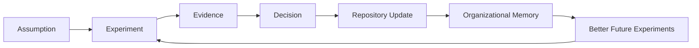
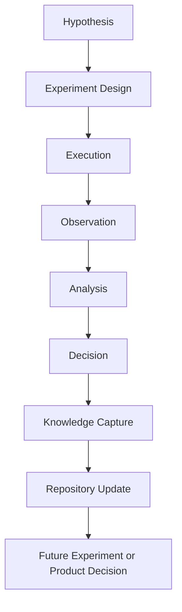
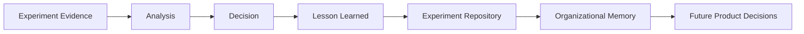
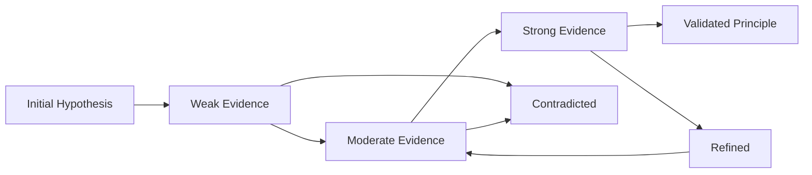
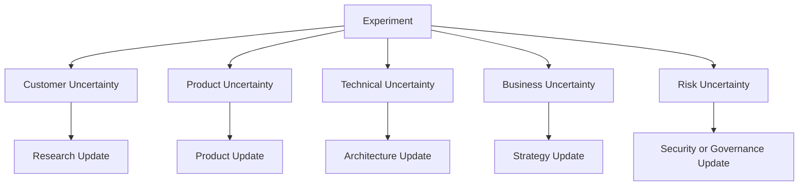

# Experiments

## Derived From

- Canon Version: `v1.0.0`
- Architecture Version: `v1.0.0`
- Implementation Version: `v1.0.0`
- Strategy Version: `v1.0.0`
- Research Methodology Version: `v1.0.0`
- Market Research Version: `v1.0.0`
- Customer Discovery Version: `v1.0.0`
- Support Industry Research Version: `v1.0.0`
- Competitor Research Version: `v1.0.0`
- AI Research Version: `v1.0.0`
- Technology Research Version: `v1.0.0`
- Regulatory Research Version: `v1.0.0`
- Indonesia Market Research Version: `v1.0.0`

### Primary Repository Sources

- [Canon](../canon/README.md)
- [Architecture](../architecture/README.md)
- [Implementation](../implementation/README.md)
- [Strategy](../strategy/README.md)
- [Research Methodology](./00_RESEARCH_METHODOLOGY.md)
- [Market Research](./01_MARKET_RESEARCH.md)
- [Customer Discovery](./02_CUSTOMER_DISCOVERY.md)
- [Support Industry Research](./03_SUPPORT_INDUSTRY_RESEARCH.md)
- [Competitor Research](./04_COMPETITOR_RESEARCH.md)
- [AI Research](./05_AI_RESEARCH.md)
- [Technology Research](./06_TECHNOLOGY_RESEARCH.md)
- [Regulatory Research](./07_REGULATORY_RESEARCH.md)
- [Indonesia Market Research](./08_INDONESIA_MARKET_RESEARCH.md)

---

Status: **Active**

## Primary Question

How should the company design, execute, evaluate, and preserve experiments that validate the Organizational Intelligence Platform?

This document is not a research report. It is the company's official methodology for designing, running, documenting, and learning from experiments.

Its purpose is to ensure that product evolution is driven by evidence rather than assumptions.

## 1. Executive Summary

Experiments are the mechanism by which the company turns uncertainty into evidence.

The Organizational Intelligence Platform is still an emerging category. Many important questions cannot be answered by strategy alone:

- Do customers experience Organizational Entropy as a severe problem?
- Does Customer Support remain the correct beachhead?
- Will support leaders trust AI-assisted knowledge candidates?
- Can human review be made lightweight enough for real operations?
- Does validated organizational memory measurably reduce repeated work?
- Which integrations are necessary for adoption?
- What pricing model reflects customer value?

This document defines how the company should design, execute, evaluate, and preserve experiments that answer such questions.

Every significant product decision should ideally be supported by experimental evidence. When evidence is not yet available, the decision should explicitly state its assumptions, confidence level, and planned validation path.

## Purpose

This methodology helps the company:

- Validate hypotheses.
- Measure evidence.
- Avoid confirmation bias.
- Preserve experimental knowledge.
- Decide whether to continue, expand, refine, repeat, pause, pivot, or stop initiatives.
- Convert lessons into Organizational Memory.

## Philosophy

Experimentation is not experimentation for its own sake. It is disciplined learning.

The goal is not to run many experiments. The goal is to reduce the most important uncertainties at the lowest responsible cost.

## Scope

This methodology applies to:

- Product experiments.
- Customer discovery experiments.
- AI evaluation experiments.
- Workflow experiments.
- Design partner pilots.
- Pricing and GTM experiments.
- Technical validation experiments.
- Security and performance experiments.
- Knowledge quality experiments.

## Expected Outcomes

Each experiment should produce:

- A clearly stated hypothesis.
- A defined method.
- Evidence.
- Analysis.
- A decision.
- Confidence update.
- Repository update.
- Preserved lessons.

The strongest experiments do not merely validate features. They improve the organization's ability to make better future decisions.

## 2. Experimentation Philosophy

## Evidence Over Opinion

Opinions are useful for generating hypotheses. They are not enough to validate direction.

The company should distinguish:

- What it believes.
- Why it believes it.
- What evidence supports it.
- What evidence would change its mind.

This principle aligns with the Canon because Organizational Intelligence requires decisions to be grounded in evidence, not authority alone.

## Small Experiments Before Large Investments

Large investments should be preceded by small tests whenever possible.

Before building a broad platform capability, the company should test:

- Whether the problem is real.
- Whether users recognize it.
- Whether the proposed workflow fits real behavior.
- Whether data exists in usable form.
- Whether the value can be measured.
- Whether customers will adopt the change.

## Fail Cheaply

A failed experiment is valuable if it prevents a larger failure.

The company should prefer:

- Interviews before builds.
- Clickable prototypes before production systems.
- Narrow pilots before broad launches.
- Offline evaluations before automated deployment.
- Manual workflows before complex infrastructure.

## Preserve Every Lesson

Learning that is not preserved decays.

Every experiment should produce durable knowledge:

- What was tested.
- What happened.
- What was learned.
- What changed.
- What remains unknown.

This directly supports Organizational Memory.

## Negative Results Are Valuable

Negative results are not embarrassing. They are one of the cheapest ways to avoid self-deception.

Examples of useful negative results:

- Customers do not describe the problem in expected language.
- A workflow adds more burden than value.
- AI outputs are not trusted.
- Ticket data is too inconsistent for a proposed approach.
- A pricing model creates resistance.
- A target segment lacks urgency.

## Assumptions Require Validation

Every strategy contains assumptions. The company should make them explicit and test the riskiest ones first.

Common assumption types include:

- Customer pain.
- Buyer urgency.
- Willingness to pay.
- Technical feasibility.
- Data availability.
- Workflow adoption.
- Trust.
- Security acceptability.
- Integration feasibility.

## Learning Compounds

Experiments should not be isolated events.

They should feed a learning system:



This is the Knowledge Flywheel applied to company-building itself.

## 3. Types of Experiments

The company should use different experiment types for different uncertainties.

| Experiment Type | Purpose | Typical Evidence |
| --- | --- | --- |
| Customer Interviews | Understand customer problems, language, workflows, urgency, and buying context. | Quotes, patterns, objections, severity ratings, workflow descriptions. |
| Prototype Testing | Test whether users understand and value a proposed experience before full build. | Task completion, feedback, confusion points, perceived usefulness. |
| Design Partner Pilots | Validate product value in real customer environments. | Usage, outcomes, qualitative feedback, operational metrics, renewal or expansion signals. |
| Workflow Observation | Observe how work actually happens rather than relying on stated process. | Process maps, bottlenecks, tool usage, handoffs, informal workarounds. |
| Usability Testing | Evaluate whether users can complete tasks with the product or prototype. | Task success, time on task, error rate, user confidence, qualitative friction. |
| AI Evaluation | Measure AI output quality, safety, reliability, and usefulness. | Accuracy, hallucination rate, reviewer agreement, failure categories. |
| Prompt Evaluation | Compare prompts, instructions, examples, and output formats. | Output quality, consistency, compliance, cost, latency. |
| Retrieval Evaluation | Measure whether search or RAG returns relevant, authorized, and useful evidence. | Precision, recall, relevance ratings, source coverage, failure cases. |
| Knowledge Quality Evaluation | Evaluate whether knowledge artifacts are accurate, reusable, current, and trusted. | Reviewer score, reuse rate, contradiction rate, update frequency. |
| Pricing Experiments | Test willingness to pay, packaging, perceived value, and budget fit. | Buyer responses, conversion, price sensitivity, objections, procurement friction. |
| Sales Experiments | Test messaging, buyer persona, channel, objection handling, and sales motion. | Meeting conversion, stakeholder engagement, objection patterns, stage progression. |
| Integration Experiments | Validate feasibility of connecting to customer systems and data flows. | API access, data quality, implementation effort, security constraints. |
| Security Validation | Test whether controls meet expected security, privacy, and enterprise trust requirements. | Findings, remediation, audit evidence, security review outcomes. |
| Performance Testing | Evaluate system behavior under expected or stress workloads. | Latency, throughput, error rate, resource usage, cost. |

## Experiment Selection Rule

The experiment type should match the uncertainty.

| If the uncertainty is about... | Prefer... |
| --- | --- |
| Whether the problem exists | Customer interviews and workflow observation. |
| Whether users understand the solution | Prototype testing and usability testing. |
| Whether the solution works in real operations | Design partner pilot. |
| Whether AI is good enough | AI, prompt, retrieval, and knowledge quality evaluations. |
| Whether customers will buy | Pricing and sales experiments. |
| Whether systems can connect | Integration experiments. |
| Whether the platform is safe and reliable | Security and performance validation. |

## 4. Experiment Lifecycle

Every experiment should follow a consistent lifecycle.



## Stage 1: Hypothesis

A hypothesis is a testable statement about the world.

Good hypotheses are:

- Specific.
- Falsifiable.
- Connected to a decision.
- Clear about expected evidence.

Weak hypothesis:

> Customers want AI.

Better hypothesis:

> B2B SaaS support leaders with more than 5,000 monthly tickets will value AI-generated knowledge candidates if human review prevents untrusted content from reaching customers.

## Stage 2: Experiment Design

Experiment design defines how the hypothesis will be tested.

It should specify:

- Participants or data source.
- Method.
- Metrics.
- Success criteria.
- Failure criteria.
- Risks.
- Timebox.
- Required evidence.
- Decision owner.

## Stage 3: Execution

Execution is the actual running of the experiment.

During execution, the team should:

- Follow the documented method.
- Avoid changing criteria midstream without noting it.
- Capture raw observations.
- Track deviations from the plan.
- Protect customer data.
- Avoid leading participants.

## Stage 4: Observation

Observation captures what happened.

Observation should separate:

- Raw evidence.
- Researcher interpretation.
- Participant quotes.
- Metric results.
- Unexpected events.
- Data quality issues.

## Stage 5: Analysis

Analysis interprets evidence against the hypothesis.

It should answer:

- Did the evidence support the hypothesis?
- Did the evidence contradict it?
- Was the experiment valid?
- Were there confounding factors?
- What alternative explanations exist?
- What confidence level changed?

## Stage 6: Decision

The experiment must lead to a decision.

Possible decisions:

- Continue.
- Expand.
- Refine.
- Repeat.
- Pause.
- Pivot.
- Stop.

No experiment should end with "interesting" as the only conclusion.

## Stage 7: Knowledge Capture

The team should preserve:

- Experiment summary.
- Evidence.
- Decision.
- Confidence update.
- Lessons learned.
- Open questions.
- Repository implications.

## Stage 8: Repository Update

Experiments should update the repository when they affect:

- Research.
- Product.
- Architecture.
- Strategy.
- Roadmap.
- Pricing.
- Customer discovery.
- Implementation assumptions.

Changes to the Canon require formal governance.

## 5. Experiment Design Framework

Every experiment should use a consistent design structure.

## Required Experiment Fields

| Field | Description |
| --- | --- |
| Experiment ID | Stable identifier for tracking. |
| Title | Short name of the experiment. |
| Owner | Person accountable for design and execution. |
| Reviewer | Person responsible for quality review. |
| Decision Authority | Person or group authorized to act on results. |
| Problem | The uncertainty or problem being tested. |
| Hypothesis | Testable statement. |
| Expected Outcome | What is expected if the hypothesis is true. |
| Success Metrics | Evidence that supports continuing or expanding. |
| Failure Criteria | Evidence that invalidates or weakens the hypothesis. |
| Variables | What is being changed or compared. |
| Constraints | Time, budget, data, customer, technical, or legal limits. |
| Risks | Possible harm, bias, privacy issue, or operational burden. |
| Required Evidence | Minimum evidence needed for a decision. |
| Confidence Before Experiment | Starting confidence level. |
| Timebox | Start date, end date, and review date. |
| Data Handling | How evidence will be stored, anonymized, protected, and retained. |

## Reusable Experiment Template

```text
# Experiment: [Title]

Experiment ID:
Status: Proposed / Active / Completed / Archived
Owner:
Reviewer:
Decision Authority:
Date Created:
Date Completed:

## Derived From

- Canon Version:
- Related Research:
- Related Product / Architecture / Strategy Documents:

## Problem

What uncertainty does this experiment reduce?

## Hypothesis

If [condition], then [expected outcome], because [reason].

## Expected Outcome

What should happen if the hypothesis is true?

## Success Metrics

- Metric 1:
- Metric 2:
- Metric 3:

## Failure Criteria

- Failure condition 1:
- Failure condition 2:
- Failure condition 3:

## Variables

What is being tested, changed, compared, or controlled?

## Constraints

Time:
Budget:
Participants:
Data:
Technical:
Legal / Security:

## Risks

What could bias, invalidate, or create harm during the experiment?

## Required Evidence

What minimum evidence is needed before making a decision?

## Confidence Before Experiment

Level:
Reason:

## Method

How will the experiment be executed?

## Observations

What happened?

## Analysis

What does the evidence mean?

## Decision

Continue / Expand / Refine / Repeat / Pause / Pivot / Stop

## Confidence After Experiment

Level:
Reason:

## Lessons Learned

What should the organization remember?

## Repository Updates Required

- Research:
- Product:
- Architecture:
- Strategy:
- Roadmap:
```

## Design Quality Checklist

| Question | Required Before Execution |
| --- | --- |
| Is the hypothesis falsifiable? | Yes |
| Is the decision connected to the experiment clear? | Yes |
| Are success and failure criteria defined before execution? | Yes |
| Is the evidence source credible? | Yes |
| Are privacy and security risks addressed? | Yes |
| Is the experiment appropriately scoped? | Yes |
| Is the expected repository impact identified? | Yes |

## 6. Evidence Collection

Experiments are only as useful as the evidence they collect.

## Evidence Sources

| Evidence Source | Type | Use |
| --- | --- | --- |
| Customer Interviews | Qualitative | Understand pain, language, priorities, objections, and buying context. |
| Ticket Data | Quantitative and qualitative | Measure repeated issues, resolution patterns, escalation, and knowledge gaps. |
| Usage Analytics | Quantitative | Track user behavior, adoption, retention, and workflow completion. |
| Observation | Qualitative | See actual behavior, workarounds, and hidden process friction. |
| AI Evaluations | Quantitative and qualitative | Measure output quality, accuracy, risk, and reviewer agreement. |
| Performance Metrics | Quantitative | Measure latency, throughput, cost, reliability, and scalability. |
| Survey Results | Quantitative and qualitative | Gather structured feedback across participants. |
| Session Recordings | Qualitative | Review user behavior, confusion, and task flow. |
| Human Review Outcomes | Quantitative and qualitative | Measure trust, approval rate, correction rate, and disagreement. |
| Design Partner Feedback | Qualitative and quantitative | Validate real-world usefulness, adoption barriers, and value. |

## Qualitative vs Quantitative Evidence

| Evidence Type | Strength | Weakness |
| --- | --- | --- |
| Qualitative | Explains why something happens; reveals language, motivation, and context. | Can be biased by small samples or interpretation. |
| Quantitative | Measures frequency, magnitude, trends, and outcomes. | Can miss meaning, cause, and context. |

Strong experiments often combine both.

Example:

- Quantitative: 35% of reviewed tickets contained repeated troubleshooting.
- Qualitative: Support agents said the repeated work happened because prior solutions were hard to find or not trusted.

## Evidence Integrity Rules

| Rule | Explanation |
| --- | --- |
| Preserve raw evidence when possible. | Do not keep only summaries. |
| Separate observation from interpretation. | What happened and what it means are different. |
| Capture contradictory evidence. | Do not discard inconvenient findings. |
| Track source and date. | Evidence decays over time. |
| Protect sensitive data. | Privacy and security apply to experiments. |
| Document sample limits. | Small or biased samples should be acknowledged. |

## 7. Decision Framework

Every completed experiment should lead to one of seven decisions.

## Decision Matrix

| Decision | When to Use | Example Signal |
| --- | --- | --- |
| Continue | Evidence supports the hypothesis enough to proceed at current scope. | Users complete the workflow and express clear value. |
| Expand | Evidence is strong enough to test larger scope, more customers, or broader capability. | Pilot metrics improve and stakeholders request expansion. |
| Refine | The hypothesis is directionally supported, but execution needs adjustment. | Users value the idea but struggle with the interface. |
| Repeat | Evidence is inconclusive or experiment quality was insufficient. | Sample size was too small or data quality was weak. |
| Pause | External dependency or risk prevents responsible continuation. | Security review must be completed before more testing. |
| Pivot | Evidence contradicts part of the assumption but reveals a better direction. | Buyers do not want automation, but strongly want knowledge validation. |
| Stop | Evidence strongly indicates the initiative is not worth pursuing. | Customers do not experience the problem or reject the workflow. |

## Decision Criteria

| Criterion | Question |
| --- | --- |
| Evidence Strength | Is the evidence strong enough for the decision? |
| Strategic Alignment | Does the result support the Canon and strategy? |
| Customer Value | Did the experiment reveal meaningful customer benefit? |
| Risk | Are security, privacy, AI, or operational risks acceptable? |
| Cost | Is continued investment justified? |
| Reversibility | Can the next step be undone if wrong? |
| Learning Value | Will continuing materially reduce uncertainty? |

## Decision Discipline

The team should decide what evidence would change its mind before running the experiment.

This reduces confirmation bias and protects the company from post-hoc justification.

## 8. Knowledge Preservation

Experimental knowledge becomes Organizational Memory when it is preserved in a structured, searchable, and reusable form.

## What Must Be Preserved

| Artifact | Purpose |
| --- | --- |
| Experiment Plan | Documents intended hypothesis, method, and criteria. |
| Raw Evidence | Allows later review and reinterpretation. |
| Analysis | Explains how evidence was interpreted. |
| Decision | Records what the company chose to do. |
| Confidence Update | Tracks how beliefs changed. |
| Lessons Learned | Makes knowledge reusable. |
| Rejected Hypotheses | Prevents repeated mistakes. |
| Unexpected Discoveries | Captures insights beyond the original hypothesis. |
| Repository Links | Connects experiments to strategy, product, architecture, and research. |

## Experiment Repository

Future experiments should be stored in a dedicated structure, for example:

```text
docs/research/experiments/
├── README.md
├── active/
├── completed/
├── archived/
└── templates/
```

This document defines the methodology, not the actual experiment repository contents.

## Failed Experiments as Assets

Failed experiments should remain searchable and visible.

They help the company avoid:

- Retesting invalidated assumptions without reason.
- Rebuilding rejected features.
- Repeating poor customer segments.
- Misreading prior evidence.
- Losing context when team members change.

## Knowledge Preservation Flow



## 9. Experiment Prioritization

Not every question deserves immediate experimentation.

Experiments should be prioritized by how much uncertainty they reduce relative to cost, risk, and strategic value.

## Prioritization Dimensions

| Dimension | Question |
| --- | --- |
| Strategic Importance | Does this uncertainty affect the core company thesis or major roadmap decision? |
| Risk Reduction | Would the experiment prevent a costly mistake? |
| Cost | How much time, money, and effort are required? |
| Time | How quickly can evidence be obtained? |
| Customer Impact | Would the result improve or protect customer value? |
| Technical Uncertainty | Does the experiment reduce engineering or AI feasibility risk? |
| Business Uncertainty | Does it reduce GTM, pricing, buyer, or adoption risk? |
| Reversibility | Can the next step be reversed if wrong? |

## Prioritization Matrix

| Priority | Characteristics | Action |
| --- | --- | --- |
| High Priority | High strategic importance, high risk reduction, low to moderate cost. | Run soon. |
| Medium Priority | Meaningful learning, but less urgent or more expensive. | Schedule after critical experiments. |
| Low Priority | Interesting but weak decision impact. | Defer. |
| Avoid | High cost, low learning, weak strategic relevance. | Do not run unless context changes. |

## Scoring Model

Scale each dimension from `1` to `5`.

| Dimension | Score |
| --- | ---: |
| Strategic Importance | 1-5 |
| Risk Reduction | 1-5 |
| Customer Impact | 1-5 |
| Technical Uncertainty | 1-5 |
| Business Uncertainty | 1-5 |
| Speed of Learning | 1-5 |
| Low Cost | 1-5 |

Higher total scores should generally be prioritized, but leadership judgment still matters.

## 10. Bias and Research Integrity

Experiments can mislead if they are designed or interpreted poorly.

## Common Biases and Mitigations

| Bias | Description | Mitigation |
| --- | --- | --- |
| Confirmation Bias | Looking for evidence that supports existing beliefs. | Define disconfirming evidence before execution. |
| Selection Bias | Testing only with people likely to agree or succeed. | Recruit representative participants and document sample limits. |
| Survivorship Bias | Studying only successful customers or visible cases. | Include failures, churned prospects, and negative examples. |
| Leading Questions | Asking questions that imply the desired answer. | Use neutral interview scripts. |
| Small Sample Bias | Drawing broad conclusions from too few observations. | Treat small samples as directional and replicate when possible. |
| AI-Generated Bias | AI summarizes or frames evidence in ways that distort meaning. | Preserve raw evidence and use human review. |
| Availability Bias | Overweighting recent or vivid examples. | Compare against broader data where possible. |
| Measurement Bias | Metrics measure what is easy rather than what matters. | Connect metrics to decisions and customer value. |
| Observer Bias | Researcher expectations influence interpretation. | Use reviewers and structured analysis. |

## Research Integrity Rules

- Do not hide negative findings.
- Do not change success criteria after seeing results without documenting the change.
- Do not convert anecdotes into conclusions without confidence limits.
- Do not treat AI summaries as raw evidence.
- Do not claim validation from weak evidence.
- Do not overgeneralize from design partners.
- Do not confuse customer politeness with demand.

## 11. Metrics

Metrics should measure learning and decision quality, not activity alone.

## Meaningful Metrics

| Metric | What It Measures | Why It Matters |
| --- | --- | --- |
| Learning Velocity | How quickly important uncertainties are reduced. | Measures progress toward evidence-based decisions. |
| Hypothesis Validation Rate | Percentage of hypotheses supported, contradicted, or refined. | Shows quality of assumptions and learning discipline. |
| Pilot Conversion | Whether pilots become paid, expanded, or continued engagements. | Indicates market and product value. |
| Knowledge Reuse | How often validated knowledge is reused. | Measures Organizational Memory value. |
| Customer Confidence | Whether customers trust the workflow, outputs, and governance. | Indicates adoption readiness. |
| Support Efficiency | Resolution time, escalation rate, repeated investigation, onboarding time. | Measures beachhead operational value. |
| AI Accuracy | Correctness of AI outputs against reviewed evidence. | Measures AI reliability. |
| Human Review Agreement | Agreement among reviewers on AI outputs or knowledge quality. | Indicates trust and clarity. |
| Retrieval Relevance | Whether retrieved evidence supports the task. | Measures knowledge access quality. |
| Experiment Decision Rate | Percentage of experiments that produce clear decisions. | Measures methodology discipline. |

## Vanity Metrics

| Vanity Metric | Why It Can Mislead |
| --- | --- |
| Number of experiments run | More experiments do not mean better learning. |
| Number of interviews conducted | Interviews matter only if they reduce uncertainty. |
| Prototype clicks | Clicks may not indicate value or willingness to adopt. |
| AI output volume | More generated content can create more noise. |
| Demo enthusiasm | Polite excitement may not convert to usage or budget. |
| Feature requests | Requests are not proof of priority or willingness to pay. |

## Metric Principle

The right metric is the one that changes a decision.

If a metric cannot influence whether to continue, expand, refine, repeat, pause, pivot, or stop, it is probably not a primary experiment metric.

## 12. Repository Integration

Experiments should directly influence the repository.

## Repository Impact Areas

| Repository Area | How Experiments Influence It |
| --- | --- |
| Research | Confirm, weaken, or refine research findings and confidence levels. |
| Product | Shape requirements, workflows, user experience, and prioritization. |
| Architecture | Validate technical assumptions, integration needs, scale, security, and AI boundaries. |
| Strategy | Test ICP, positioning, category framing, GTM motion, and market sequencing. |
| Roadmap | Determine what should be built, delayed, refined, or removed. |

## Repository Update Rule

If an experiment changes a meaningful belief, the relevant repository document should be updated or annotated.

Examples:

- Customer discovery experiment changes ICP assumptions.
- Retrieval evaluation changes AI architecture priorities.
- Pilot results change roadmap sequencing.
- Pricing experiment changes GTM strategy.
- Security validation changes implementation requirements.

## Canon Governance

Experiments may update:

- Research.
- Product direction.
- Architecture decisions.
- Implementation details.
- Roadmap priorities.
- Strategy execution.

Experiments do not casually update the Canon.

Changes to Canon documents require formal governance because Canon documents define the company's intellectual foundation.

## 13. Experiment Governance

Experiments require governance so that evidence remains trustworthy and reproducible.

## Governance Roles

| Role | Responsibility |
| --- | --- |
| Experiment Owner | Designs and executes the experiment. |
| Reviewer | Checks method quality, bias risks, evidence interpretation, and documentation. |
| Decision Authority | Decides what action follows from the experiment. |
| Data Steward | Ensures data handling, privacy, and retention are appropriate when sensitive data is involved. |
| Technical Lead | Validates technical method, feasibility, and implementation implications. |
| Customer Contact | Coordinates customer-facing research or pilot participation. |

## Documentation Requirements

Every experiment should document:

- Hypothesis.
- Method.
- Evidence sources.
- Success metrics.
- Failure criteria.
- Risks.
- Data handling.
- Results.
- Analysis.
- Decision.
- Confidence update.
- Repository impact.

## Approval Process

| Experiment Risk | Approval Needed |
| --- | --- |
| Low risk internal experiment | Experiment owner and reviewer. |
| Customer-facing interview or prototype | Owner, reviewer, and customer contact. |
| Customer data experiment | Owner, reviewer, data steward, and technical lead. |
| AI output affecting customers | Owner, reviewer, AI/technical lead, and decision authority. |
| Security, privacy, or regulated data experiment | Owner, reviewer, data steward, security reviewer, and decision authority. |

## Versioning and Auditability

Experiment records should preserve:

- Original plan.
- Changes to method.
- Date of changes.
- Evidence collected.
- Reviewer notes.
- Decision rationale.
- Final outcome.

This is necessary because experiments themselves are part of Organizational Memory.

## 14. Confidence Assessment

Confidence should be assessed before and after experiments.

## Confidence Model

| Confidence Level | Meaning | Evidence Pattern |
| --- | --- | --- |
| Initial Hypothesis | Belief based on strategy, intuition, prior research, or weak signal. | No direct evidence yet. |
| Weak Evidence | Some support exists, but sample is small, biased, or indirect. | Early interviews, anecdotal feedback, incomplete data. |
| Moderate Evidence | Multiple sources support the hypothesis, but uncertainty remains. | Repeated interviews, prototype tests, preliminary metrics. |
| Strong Evidence | Evidence is consistent across methods, customers, or datasets. | Pilots, quantitative outcomes, repeated qualitative patterns. |
| Validated Principle | Evidence is strong, repeated, and durable enough to guide future decisions. | Multiple experiments, real-world outcomes, repository integration. |

## Confidence Evolution



## Confidence Rules

- Confidence should increase only when evidence quality improves.
- Repeated weak signals do not automatically equal strong evidence.
- Contradictory evidence should reduce confidence or refine the hypothesis.
- Confidence should be scoped to the tested context.
- Evidence from one customer segment should not be generalized without caution.

## 15. Repository Impact

Completed experiments become inputs for company execution.

## Inputs Created by Experiments

| Repository Output | Experiment Contribution |
| --- | --- |
| Product Requirements | Validated user needs, workflow constraints, and success metrics. |
| Design Decisions | Usability evidence, customer language, trust requirements, and interaction patterns. |
| Technical Architecture | Integration feasibility, data quality, performance, security, and AI reliability evidence. |
| GTM Strategy | Buyer behavior, objections, messaging, pricing sensitivity, and sales motion evidence. |
| Pricing | Willingness to pay, ROI signals, packaging feedback, procurement constraints. |
| Customer Discovery | Validated pains, ICP refinement, stakeholder maps, and urgency evidence. |
| Roadmap | Evidence-based sequencing and de-prioritization. |

## Uncertainty Reduction Map



Experiments reduce uncertainty across the entire repository.

## 16. Traceability Matrix

| Canon Concept | Experiment Type | Expected Evidence |
| --- | --- | --- |
| Organizational Memory | Knowledge reuse pilot | Reduced repeated investigations, increased reuse of validated knowledge, lower expert dependency. |
| Human Review | AI validation study | Increased trust, higher accuracy, reviewer agreement, fewer unapproved outputs. |
| Organizational Entropy | Support workflow observation | Measurable duplicate work, knowledge silos, repeated questions, documentation decay. |
| Knowledge Flywheel | Pilot deployment | Growth in validated reusable knowledge and measurable improvement in future work. |
| Governance | Security and compliance validation | Audit logs, access controls, approval history, data handling evidence. |
| Explainability | Retrieval and AI evaluation | Source-grounded outputs, evidence visibility, reviewer confidence. |
| AI as Amplifier | Prototype or pilot test | Users experience AI as assistant rather than authority. |
| Domain Language | Customer interviews and workflow observation | Customer terminology maps to platform concepts. |
| Product Principles | Usability and workflow testing | Product decisions remain evidence-led and human-centered. |
| Category Thesis | Sales and customer discovery experiments | Buyers recognize the problem as distinct from existing categories. |

## 17. Limitations

Experiments reduce uncertainty, but they do not eliminate it.

## Common Limitations

| Limitation | Effect |
| --- | --- |
| Small Sample Sizes | Early experiments may reveal direction, not statistical proof. |
| Pilot Bias | Design partners may be more motivated or sophisticated than typical customers. |
| Changing Market Conditions | Evidence can decay as AI, competitors, regulation, or customer expectations change. |
| AI Evolution | Model improvements may change feasibility, cost, and risk. |
| Limited Customer Diversity | Findings from one segment may not apply elsewhere. |
| Resource Constraints | Time and budget may limit experiment quality. |
| Data Quality Issues | Poor customer data can distort results. |
| Researcher Bias | Team expectations can influence interpretation. |
| Hawthorne Effect | Participants may behave differently because they know they are observed. |

## Replication Principle

Important findings should be replicated whenever practical.

The more strategic the decision, the more evidence should be required.

| Decision Importance | Evidence Standard |
| --- | --- |
| Low-risk UI refinement | Lightweight usability evidence may be enough. |
| Feature prioritization | Multiple customer signals and prototype evidence preferred. |
| Architecture decision | Technical validation and implementation trade-off analysis required. |
| GTM strategy | Customer interviews, sales experiments, and market evidence required. |
| Canon change | Formal governance and strong multi-source evidence required. |

## 18. Closing

Experimentation is not merely a product development activity.

It is the mechanism through which the company transforms assumptions into evidence and evidence into Organizational Memory.

Every experiment, successful or unsuccessful, should strengthen the organization's ability to make better future decisions.

The ultimate objective is not simply to validate features. It is to continuously improve the organization's understanding of:

- Customers.
- Workflows.
- Technology.
- AI.
- Pricing.
- Markets.
- Governance.
- Organizational Intelligence itself.

The company should treat disciplined experimentation as a core organizational capability.

The question after an experiment should never be only:

> Did this work?

It should also be:

> What did the organization learn, and how will that learning improve future decisions?

When experiments are designed carefully, executed honestly, and preserved as memory, the company practices the same principle it seeks to deliver to customers:

> Work should make the organization permanently more capable.
