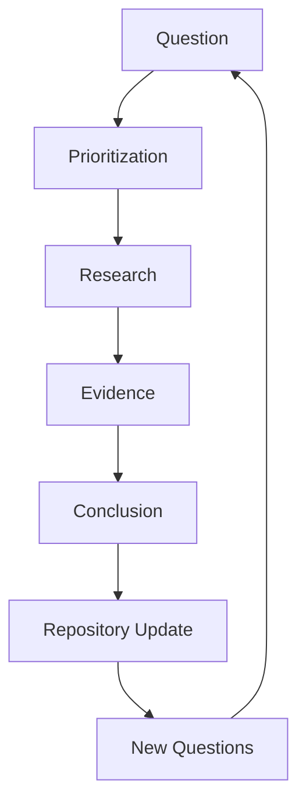
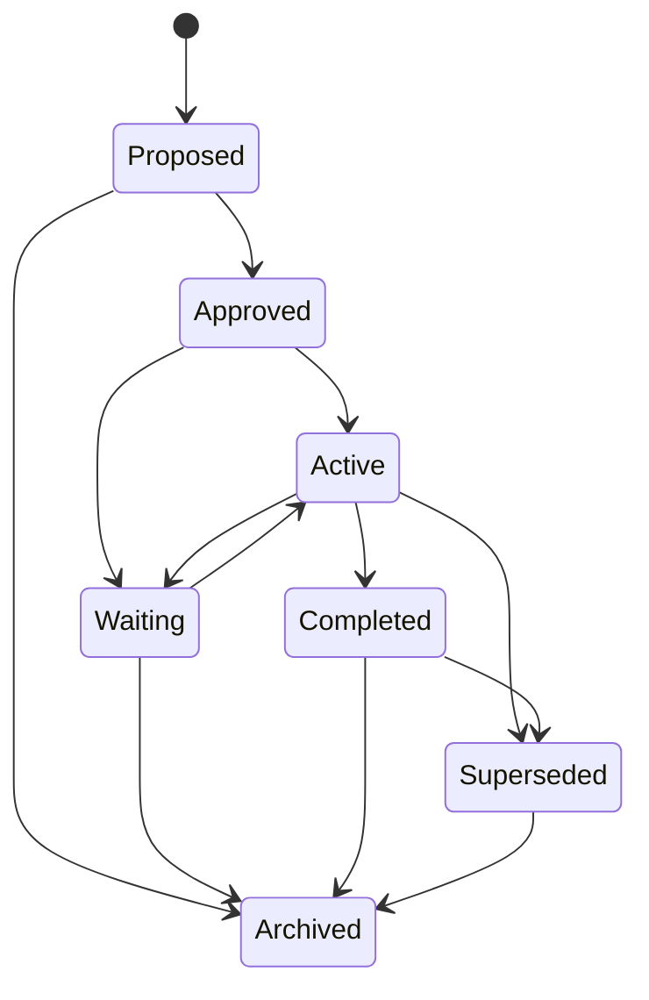
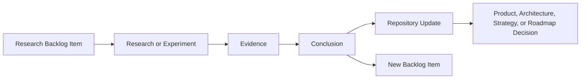
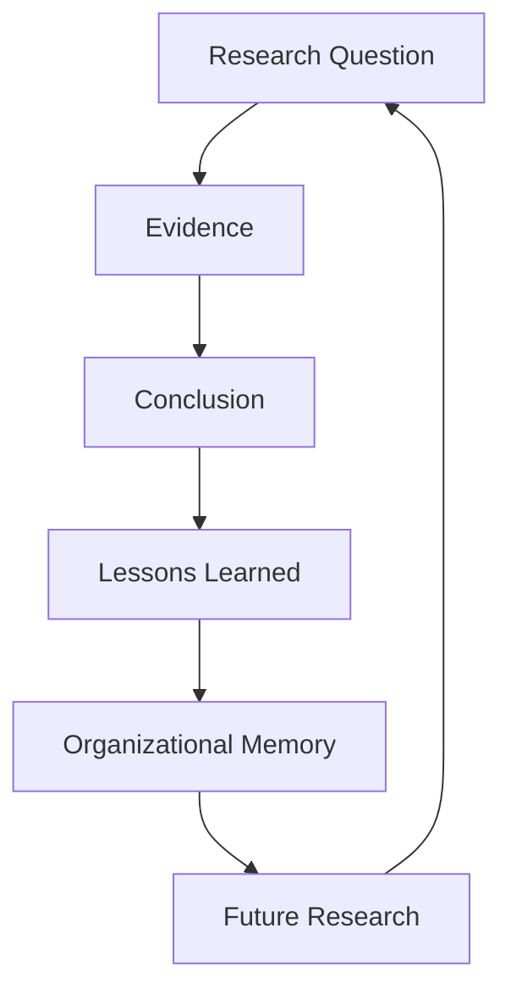
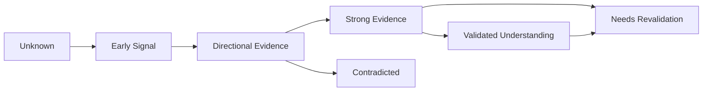

# Research Backlog

## Derived From

- Canon Version: `v1.0.0`
- Architecture Version: `v1.0.0`
- Implementation Version: `v1.0.0`
- Strategy Version: `v1.0.0`
- Research Methodology Version: `v1.0.0`
- Market Research Version: `v1.0.0`
- Customer Discovery Version: `v1.0.0`
- Support Industry Research Version: `v1.0.0`
- Competitor Research Version: `v1.0.0`
- AI Research Version: `v1.0.0`
- Technology Research Version: `v1.0.0`
- Regulatory Research Version: `v1.0.0`
- Indonesia Market Research Version: `v1.0.0`
- Experiments Version: `v1.0.0`

### Primary Repository Sources

- [Canon](../canon/README.md)
- [Architecture](../architecture/README.md)
- [Implementation](../implementation/README.md)
- [Strategy](../strategy/README.md)
- [Research Methodology](./00_RESEARCH_METHODOLOGY.md)
- [Market Research](./01_MARKET_RESEARCH.md)
- [Customer Discovery](./02_CUSTOMER_DISCOVERY.md)
- [Support Industry Research](./03_SUPPORT_INDUSTRY_RESEARCH.md)
- [Competitor Research](./04_COMPETITOR_RESEARCH.md)
- [AI Research](./05_AI_RESEARCH.md)
- [Technology Research](./06_TECHNOLOGY_RESEARCH.md)
- [Regulatory Research](./07_REGULATORY_RESEARCH.md)
- [Indonesia Market Research](./08_INDONESIA_MARKET_RESEARCH.md)
- [Experiments](./09_EXPERIMENTS.md)

---

Status: **Active**

## Primary Question

How should the company identify, prioritize, manage, and continuously revisit unanswered research questions throughout the evolution of the Organizational Intelligence Platform?

This document is not a research report. It is the company's permanent framework for managing unanswered questions, future investigations, and research priorities.

The purpose is to ensure that curiosity becomes an organized organizational capability rather than an informal activity.

## 1. Executive Summary

Every mature technology company accumulates unanswered questions faster than it accumulates answers.

This is not a weakness. It is the natural result of building in a changing world.

The risk is not that questions exist. The risk is that important questions become invisible, unowned, poorly prioritized, repeatedly rediscovered, or answered informally without evidence.

The Research Backlog exists to prevent that.

## Purpose

The Research Backlog defines how the company should:

- Capture research questions.
- Prioritize investigations.
- Manage uncertainty.
- Track research progress.
- Retire answered questions.
- Discover new research opportunities.
- Prevent important questions from being forgotten.

## Philosophy

Curiosity should be organized.

The company should treat unanswered questions as strategic assets because they identify where uncertainty may affect product, strategy, architecture, market entry, pricing, AI governance, regulatory readiness, or long-term category design.

## Scope

This methodology applies to research questions across:

- Customers.
- Markets.
- Product.
- AI.
- Technology.
- Security.
- Regulation.
- Pricing.
- Integrations.
- User experience.
- Organizational behavior.
- Future trends.

## Expected Outcomes

A healthy Research Backlog should produce:

- Visible unanswered questions.
- Clear ownership.
- Prioritized research work.
- Better experiment planning.
- Fewer duplicated investigations.
- Stronger repository traceability.
- Higher confidence in decisions.
- Preserved institutional learning.

The ultimate goal is not to eliminate uncertainty completely. The goal is to make uncertainty visible, intentional, and progressively reducible.

## 2. Research Backlog Philosophy

## Curiosity Should Be Organized

Curiosity is valuable, but unmanaged curiosity becomes scattered.

The Research Backlog turns questions into an operating system:

- Capture the question.
- Explain why it matters.
- Assign ownership.
- Prioritize it.
- Research it.
- Preserve the answer.
- Update the repository.
- Generate better questions.

## Unknowns Are Strategic Assets

Unknowns reveal where the company could be wrong.

Examples include:

- Customer pain may be weaker than expected.
- AI capability may be insufficient.
- A regulatory constraint may reshape architecture.
- A pricing assumption may fail.
- A competitor may close a perceived gap.

Unknowns are not embarrassments. They are maps of where learning is needed.

## Questions Deserve Ownership

An important question without an owner usually becomes a repeated conversation.

Every meaningful research item should identify:

- Owner.
- Reviewer.
- Decision authority.
- Target decision date.
- Repository impact.

## Research Should Reduce Uncertainty

The purpose of research is not to produce documents. The purpose is to reduce uncertainty enough to support better decisions.

A research item should be connected to a decision, such as:

- Build or defer.
- Enter or avoid a segment.
- Integrate or wait.
- Price one way or another.
- Expand, pause, pivot, or stop.

## Not Every Question Deserves Immediate Investigation

Some questions are interesting but not urgent.

Research should be prioritized by:

- Strategic importance.
- Risk reduction.
- Customer impact.
- Business uncertainty.
- Technical uncertainty.
- Cost.
- Time.
- Dependencies.
- Learning potential.

## Learning Compounds Over Time

Research compounds when:

- Questions are preserved.
- Evidence is linked.
- Conclusions are revisited.
- Old assumptions are retired.
- New questions emerge from prior answers.

This is the Knowledge Flywheel applied to research management.

## Every Answer Creates New Questions

Research does not end inquiry. It improves inquiry.

An answered question may reveal:

- A narrower follow-up question.
- A new customer segment.
- A hidden risk.
- A stronger hypothesis.
- A contradiction in previous assumptions.

The Research Backlog should therefore remain alive.

## 3. Types of Research Questions

Research questions should be categorized so the company can balance learning across domains.

| Category | Purpose |
| --- | --- |
| Customer Research | Understand customer pain, workflows, trust, language, buying behavior, and adoption barriers. |
| Market Research | Understand category dynamics, market size, trends, demand, timing, and macro conditions. |
| Product Research | Understand user needs, workflows, usability, feature value, and product-market fit. |
| AI Research | Understand AI capabilities, limitations, evaluation, governance, model behavior, and responsible use. |
| Technology Research | Understand architectural patterns, infrastructure capabilities, scalability, reliability, and implementation trade-offs. |
| Security Research | Understand threats, controls, enterprise trust, privacy, data handling, and risk mitigation. |
| Regulatory Research | Understand laws, compliance expectations, AI governance, privacy, data residency, and sectoral constraints. |
| Pricing Research | Understand willingness to pay, packaging, buyer value, ROI, and procurement behavior. |
| Integration Research | Understand customer systems, APIs, data quality, connector feasibility, and ecosystem dependencies. |
| UX Research | Understand user comprehension, friction, trust, task success, and workflow fit. |
| Organizational Behavior Research | Understand how teams adopt, resist, trust, or operationalize new systems. |
| Future Trends Research | Monitor emerging AI, enterprise software, regulation, market, and organizational learning trends. |

## Category Selection Rule

Each research item should have one primary category and optional secondary categories.

Example:

- Primary: Customer Research.
- Secondary: Pricing Research, Product Research.

This prevents ambiguous ownership while preserving cross-domain relevance.

## 4. Research Lifecycle

Research items should move through a consistent lifecycle.



## Stage 1: Question

A research item begins as a question.

Good research questions are:

- Specific.
- Decision-relevant.
- Evidence-seeking.
- Scoped.
- Connected to repository context.

Weak question:

> Is AI useful?

Better question:

> Does AI-assisted knowledge candidate generation reduce repeated support investigation in B2B SaaS customer support teams without reducing trust?

## Stage 2: Prioritization

The question is assessed against strategic importance, uncertainty, cost, dependencies, and learning potential.

Not all questions become active research immediately.

## Stage 3: Research

The owner conducts the research using appropriate methods:

- Interviews.
- Experiments.
- Public source review.
- Data analysis.
- Prototype testing.
- Competitive analysis.
- Technical validation.
- Legal or regulatory review.

## Stage 4: Evidence

Evidence is gathered and preserved.

Evidence should be distinguishable from interpretation.

## Stage 5: Conclusion

The research produces a conclusion or confidence update.

The conclusion may be:

- Answered.
- Partially answered.
- Inconclusive.
- Contradicted.
- Superseded.

## Stage 6: Repository Update

Relevant repository documents should be updated when research changes meaningful understanding.

## Stage 7: New Questions

Completed research should generate follow-up questions when appropriate.

The backlog should capture those questions instead of leaving them in meeting notes or memory.

## 5. Research Item Template

Every backlog item should use a consistent structure.

## Required Fields

| Field | Description |
| --- | --- |
| Research ID | Stable identifier for tracking. |
| Title | Short descriptive name. |
| Category | Primary research category. |
| Research Question | The question being investigated. |
| Why It Matters | Strategic, product, technical, customer, or risk relevance. |
| Related Repository Documents | Documents that inform or may be affected by the research. |
| Strategic Importance | High, medium, or low. |
| Current Confidence | Current confidence level before investigation. |
| Research Method | How the question will be investigated. |
| Expected Evidence | Evidence needed to answer or reduce uncertainty. |
| Dependencies | People, data, customers, tools, or decisions required. |
| Owner | Person accountable for completion. |
| Reviewer | Person responsible for quality and bias review. |
| Status | Proposed, Approved, Active, Waiting, Completed, Archived, or Superseded. |
| Decision Date | Date for review or decision. |
| Repository Impact | Documents likely affected by the result. |
| Lessons Learned | Completed learning summary. |

## Reusable Research Item Template

```text
# Research Item: [Title]

Research ID:
Status: Proposed / Approved / Active / Waiting / Completed / Archived / Superseded
Category:
Secondary Categories:
Owner:
Reviewer:
Decision Authority:
Date Created:
Decision Date:

## Research Question

What unanswered question is being investigated?

## Why It Matters

What decision, risk, assumption, or strategy depends on this question?

## Related Repository Documents

- Canon:
- Research:
- Product:
- Architecture:
- Implementation:
- Strategy:
- Roadmap:

## Strategic Importance

High / Medium / Low

Reason:

## Current Confidence

Unknown / Early Signal / Directional Evidence / Strong Evidence / Validated Understanding

Reason:

## Research Method

How will this question be investigated?

## Expected Evidence

What evidence is needed to reduce uncertainty?

## Dependencies

People:
Customers:
Data:
Tools:
External sources:
Legal / Security:

## Progress Notes

What has been done so far?

## Evidence Summary

What evidence was collected?

## Conclusion

What is the answer, partial answer, or updated understanding?

## Confidence After Research

Level:
Reason:

## Repository Impact

What documents or decisions should change?

## Lessons Learned

What should the organization remember?

## Follow-Up Questions

What new questions did this research create?
```

## 6. Prioritization Framework

The Research Backlog should prioritize questions by decision value, not curiosity alone.

## Prioritization Dimensions

| Dimension | Question |
| --- | --- |
| Strategic Importance | Does this question affect the company's direction, category thesis, ICP, or roadmap? |
| Customer Impact | Would answering this improve customer value or reduce customer risk? |
| Technical Uncertainty | Does this question affect feasibility, scalability, security, or architecture? |
| Business Uncertainty | Does this affect GTM, pricing, sales, partnerships, or market entry? |
| Risk Reduction | Would answering it prevent a costly mistake? |
| Cost | How much time, money, and effort are required? |
| Time | How quickly can useful evidence be gathered? |
| Dependencies | Is the research blocked by access to customers, data, tools, or expertise? |
| Learning Potential | Will the answer improve multiple future decisions? |

## Prioritization Matrix

| Priority | Characteristics | Action |
| --- | --- | --- |
| Critical | High strategic importance, high uncertainty, high risk reduction, and near-term decision dependency. | Start immediately or assign owner. |
| High | Important to roadmap, customer validation, architecture, or GTM; evidence can be gathered soon. | Schedule in current research cycle. |
| Medium | Useful but not blocking a near-term decision. | Maintain in backlog and revisit. |
| Low | Interesting but low decision impact or high cost relative to value. | Defer. |
| Parked | Not actionable due to missing dependencies or timing. | Revisit when conditions change. |

## Scoring Model

Score each dimension from `1` to `5`.

| Dimension | Score |
| --- | ---: |
| Strategic Importance | 1-5 |
| Customer Impact | 1-5 |
| Technical Uncertainty | 1-5 |
| Business Uncertainty | 1-5 |
| Risk Reduction | 1-5 |
| Learning Potential | 1-5 |
| Low Cost | 1-5 |
| Speed of Evidence | 1-5 |

High-scoring items should generally be prioritized, but leadership may override the score when timing, dependencies, or strategic context require it.

## 7. Research Status Model

Research items should use standard statuses.

| Status | Meaning |
| --- | --- |
| Proposed | The question has been captured but not yet prioritized or approved. |
| Approved | The question is worth investigating and has enough clarity to proceed when capacity exists. |
| Active | Research is currently underway. |
| Waiting | Research is paused due to dependency, timing, customer access, data access, legal review, or resource constraint. |
| Completed | Research produced a conclusion, confidence update, and repository impact review. |
| Archived | Research is no longer active but remains preserved for institutional memory. |
| Superseded | Research was replaced by a newer, better-framed, or more relevant question. |

## Status Flow



## Status Rules

- Only active questions should consume active research capacity.
- Waiting items should identify the blocking dependency.
- Completed items must include conclusion and repository impact.
- Superseded items must link to the replacement question.
- Archived items should remain searchable.

## 8. Research Portfolio

The backlog should be managed as a portfolio, not a flat list.

If the company researches only product questions, it may miss regulatory risk. If it researches only AI, it may miss customer adoption. If it researches only market trends, it may miss technical feasibility.

## Portfolio Categories

| Portfolio Area | Purpose |
| --- | --- |
| Market | Understand category, demand, competitive landscape, and timing. |
| Product | Understand user needs, workflows, trust, usability, and value. |
| Technology | Understand architecture, infrastructure, integration, reliability, and scalability. |
| AI | Understand model capability, evaluation, governance, risk, and responsible use. |
| Security | Understand threats, controls, privacy, enterprise trust, and compliance. |
| Customer | Understand ICP, buyer, workflow, pain, adoption, and retention. |
| Operations | Understand implementation, support, internal process, and delivery capacity. |
| Long-Term Strategy | Understand future trends, market evolution, category design, and defensibility. |

## Portfolio Balance

| Over-Investment In... | Risk |
| --- | --- |
| Market research only | Company understands the category but not customer behavior. |
| Customer discovery only | Company understands immediate pain but misses broader market shifts. |
| AI research only | Company becomes model-led instead of customer-led. |
| Technology research only | Company over-engineers before validation. |
| Strategy research only | Company produces narratives without operational evidence. |
| Product research only | Company improves workflows without validating business model or GTM. |

## Portfolio Review Questions

- Which domain has the most unanswered strategic questions?
- Which domain has been neglected?
- Which domain is blocking near-term decisions?
- Which domain carries the highest risk?
- Which domain has stale assumptions?
- Which domain needs primary evidence rather than desk research?

## 9. Governance

Research governance ensures the backlog remains useful, honest, and actionable.

## Governance Roles

| Role | Responsibility |
| --- | --- |
| Research Owner | Owns the question, method, evidence, conclusion, and repository update. |
| Reviewer | Reviews framing, bias risk, evidence quality, and conclusion strength. |
| Decision Authority | Decides what action follows from the research. |
| Repository Steward | Ensures completed research links to affected documents and preserves traceability. |
| Domain Expert | Provides expertise for specialized questions such as AI, security, regulation, or architecture. |

## Documentation Standards

Each research item should document:

- Question.
- Why it matters.
- Current confidence.
- Research method.
- Evidence.
- Conclusion.
- Confidence after research.
- Repository impact.
- Follow-up questions.

## Review Cadence

| Cadence | Purpose |
| --- | --- |
| Weekly or biweekly | Review active research and blockers. |
| Monthly | Reprioritize backlog based on roadmap, customer discovery, and new evidence. |
| Quarterly | Review portfolio balance and strategic unknowns. |
| After major experiments | Add new questions and retire answered ones. |
| After major strategy shifts | Reassess priority and relevance. |

## Retirement Criteria

A research item may be retired when:

- It has been answered sufficiently.
- It is no longer relevant.
- It has been superseded.
- The decision it supported has already passed.
- The assumption is no longer material.
- A stronger question replaces it.

Retired does not mean deleted. It means preserved but no longer active.

## 10. Repository Integration

Research should connect directly to the repository.

## How Completed Research Influences Repository Areas

| Repository Area | Research Influence |
| --- | --- |
| Canon | Research may reveal pressure on foundational assumptions, but Canon changes require formal governance. |
| Architecture | Research informs technical patterns, data models, security posture, integration needs, and AI architecture. |
| Product | Research informs requirements, workflows, usability, trust mechanisms, and feature prioritization. |
| Strategy | Research informs ICP, positioning, category design, GTM, pricing, and expansion. |
| Roadmap | Research helps sequence what to build, test, defer, or stop. |
| Experiments | Research questions can become experiment hypotheses. Experiment results can close backlog items. |

## Repository Integration Flow



## Canon Governance

Research informs the Canon but does not casually change it.

If research appears to contradict the Canon:

1. Preserve the evidence.
2. Identify the exact contradiction.
3. Assess confidence.
4. Review with leadership.
5. Determine whether interpretation, strategy, or Canon governance is required.

## 11. Research Metrics

Research metrics should measure learning quality, not activity theater.

## Meaningful Metrics

| Metric | What It Measures |
| --- | --- |
| Research Throughput | Number of meaningful research items completed over time. |
| Questions Answered | Number of questions resolved or materially clarified. |
| Strategic Uncertainty Reduced | Reduction in high-priority unknowns. |
| Research Reuse | How often prior research is referenced in later decisions. |
| Repository Updates Generated | Number and quality of repository changes driven by research. |
| Cross-Document Traceability | Whether research links to affected strategy, product, architecture, and roadmap documents. |
| Average Research Cycle Time | Time from proposed question to conclusion. |
| Follow-Up Quality | Whether completed research generates useful next questions. |

## Vanity Metrics

| Metric | Why It Can Mislead |
| --- | --- |
| Number of questions captured | A large backlog can mean poor prioritization. |
| Number of pages written | Long documents do not guarantee learning. |
| Number of sources cited | Many weak sources do not equal strong evidence. |
| Number of meetings held | Discussion is not research progress. |
| Number of dashboards created | Visibility without decisions is weak value. |

## Metric Principle

The best research metric is whether future decisions become better because the organization preserved and used what it learned.

## 12. Knowledge Preservation

Completed research becomes Organizational Memory when it is preserved with context, evidence, reasoning, and traceability.

## Preservation Requirements

| Requirement | Purpose |
| --- | --- |
| Preserve raw evidence when possible. | Enables later review and reinterpretation. |
| Document reasoning. | Shows how conclusions were reached. |
| Record rejected hypotheses. | Prevents repeated dead ends. |
| Link related research. | Builds continuity across documents. |
| Preserve confidence levels. | Prevents weak findings from being treated as certainty. |
| Capture follow-up questions. | Turns answers into better inquiry. |
| Track repository impact. | Connects research to decisions. |

## Preventing Duplicated Investigations

Research duplication often happens when:

- Prior work is hard to find.
- Conclusions are not linked.
- Negative findings are hidden.
- Research is stored outside the repository.
- Ownership changes.
- Context is lost.

The backlog should reduce duplication by making prior questions and conclusions searchable.

## Knowledge Preservation Loop



## 13. Confidence Model

Research confidence should evolve through repeated evidence.

## Confidence Levels

| Level | Meaning |
| --- | --- |
| Unknown | The company has little or no reliable evidence. |
| Early Signal | Some evidence exists, but it is limited, anecdotal, or indirect. |
| Directional Evidence | Multiple signals point in a consistent direction, but uncertainty remains. |
| Strong Evidence | Evidence is repeated, relevant, and decision-useful. |
| Validated Understanding | Evidence is strong enough to guide ongoing decisions until conditions change. |

## Confidence Evolution



## Confidence Rules

- Confidence should be scoped to the researched context.
- Strong evidence in one market may not apply to another.
- Customer interviews and public research answer different questions.
- Research confidence decays when markets, technology, regulation, or competitors change.
- Contradictory evidence should be preserved, not smoothed away.

## 14. Future-Oriented Research

The backlog should continuously monitor future-facing domains.

## Scanning Areas

| Area | Why It Matters |
| --- | --- |
| Emerging AI Capabilities | AI capability changes may alter feasibility, risk, product design, and competition. |
| Enterprise Software Evolution | Incumbents may absorb OIP-like capabilities or create new integration opportunities. |
| Customer Behavior Changes | Buyers may change expectations around AI, governance, pricing, and trust. |
| Regulatory Developments | Data protection, AI governance, and sector rules may alter product requirements. |
| Technology Trends | Infrastructure, retrieval, MCP, observability, and security patterns may evolve. |
| Competitive Landscape | New entrants, acquisitions, and platform moves may change positioning. |
| Organizational Learning Practices | Enterprises may mature in knowledge management, AI governance, and learning systems. |

## Continuous Scanning Cadence

| Cadence | Research Focus |
| --- | --- |
| Monthly | Competitor changes, customer discovery findings, experiment outcomes. |
| Quarterly | Market trends, roadmap assumptions, research portfolio balance. |
| Semiannually | AI capability shifts, regulatory changes, architecture assumptions. |
| Annually | Category thesis, long-term strategy, regional expansion, Canon pressure points. |

## Why Continuous Scanning Matters

The OIP category depends on a moving environment:

- AI capabilities change.
- Competitors evolve.
- Regulations mature.
- Customers learn.
- Markets shift.
- Infrastructure improves.

The backlog should ensure the company remains adaptive without becoming reactive.

## 15. Repository Impact

The Research Backlog supports long-term planning across the repository.

| Area | How the Backlog Supports It |
| --- | --- |
| Product Planning | Identifies customer, workflow, usability, and value questions before committing build effort. |
| Technical Architecture | Surfaces unknowns around scale, integration, AI, storage, reliability, and security. |
| Strategic Planning | Tracks market, category, ICP, pricing, GTM, and expansion uncertainties. |
| Customer Discovery | Converts recurring unknowns into structured interview and validation plans. |
| Experiment Planning | Turns high-priority questions into testable hypotheses and experiments. |
| Roadmap Prioritization | Helps sequence work by uncertainty, evidence, and strategic value. |

## Alignment With Long-Term Vision

The backlog keeps future work aligned with the company's long-term vision by asking:

- What do we still not know?
- Which unknowns matter most?
- Which decisions depend on them?
- What evidence would change our mind?
- How will this learning become memory?

The backlog should be treated as the research layer of Organizational Intelligence inside the company itself.

## 16. Traceability Matrix

| Canon Concept | Research Category | Expected Contribution |
| --- | --- | --- |
| Organizational Memory | Knowledge Research | Improve long-term organizational learning and preserve validated findings. |
| Human Review | AI Research | Strengthen governance principles and review requirements. |
| Organizational Entropy | Workflow Research | Validate operational inefficiencies, knowledge loss, and duplicated effort. |
| Knowledge Flywheel | Product Research | Improve knowledge creation, validation, reuse, and learning loops. |
| Governance | Regulatory Research | Strengthen enterprise trust, compliance readiness, and accountability. |
| Explainability | AI and Product Research | Improve evidence visibility, source tracing, and decision clarity. |
| AI as Amplifier | AI and Workflow Research | Ensure AI assists human judgment rather than replacing accountability. |
| Domain Language | Customer and UX Research | Validate whether platform concepts match customer language. |
| Category Design | Market and Competitive Research | Test whether OIP is perceived as a distinct category. |
| Institutional Capability | Strategy and Operations Research | Understand whether the company and customers become more capable through learning. |

## 17. Limitations

The Research Backlog is a tool, not a guarantee.

## Common Limitations

| Limitation | Effect |
| --- | --- |
| Finite Research Capacity | The company cannot investigate every question immediately. |
| Rapid Market Changes | Answers may become stale as AI, regulation, customers, and competitors evolve. |
| Research Bias | Poorly framed questions can produce misleading conclusions. |
| AI-Assisted Research Limitations | AI can help synthesize but may introduce omissions, framing bias, or false confidence. |
| Incomplete Information | Some data is proprietary, unavailable, or expensive to obtain. |
| Evolving Customer Needs | Research conclusions may decay as customer priorities change. |
| Portfolio Imbalance | The company may over-focus on exciting domains while neglecting risk areas. |
| Ownership Drift | Backlog items can become stale if ownership is unclear. |

## Dynamic Prioritization

Backlog prioritization must remain dynamic.

Priorities should change when:

- Customer evidence changes.
- Experiments produce surprising results.
- Competitors move.
- Regulation changes.
- AI capabilities shift.
- Roadmap decisions approach.
- Strategic assumptions are challenged.

## 18. Closing

The Research Backlog is not simply a list of unanswered questions.

It is a strategic capability that enables the organization to continuously evolve its understanding of customers, technology, markets, and Organizational Intelligence.

As the company grows, the backlog should become increasingly valuable because it preserves intellectual continuity across teams, projects, and years.

It protects the company from:

- Forgetting important questions.
- Repeating old investigations.
- Treating assumptions as facts.
- Overreacting to noisy evidence.
- Over-investing in low-value curiosity.
- Losing research context when priorities change.

The ultimate goal is not to eliminate uncertainty completely.

The goal is to ensure that the organization's most important questions are always visible, intentionally prioritized, and systematically transformed into validated knowledge.

The Research Backlog is therefore the company's long-term operating system for curiosity.

It ensures that learning does not depend on memory alone.

It makes curiosity governable, cumulative, and useful.
