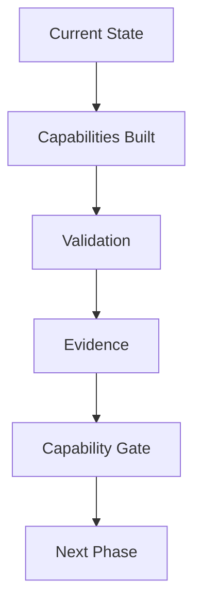

# Roadmap Philosophy

## Derived From

- Canon Version: `v1.0.0`
- Architecture Version: `v1.0.0`
- Implementation Version: `v1.0.0`
- Product Version: `v1.0.0`
- Research Version: `v1.0.0`
- Strategy Version: `v1.0.0`

### Primary Repository Sources

- [Canon](../canon/README.md)
- [Architecture](../architecture/README.md)
- [Implementation](../implementation/README.md)
- [Product](../product/README.md)
- [Research](../research/README.md)
- [Strategy](../strategy/README.md)
- [Roadmap](./README.md)

### Primary Supporting Documents

- [Product Strategy](../product/01_PRODUCT_STRATEGY.md)
- [Product Requirements](../product/02_PRODUCT_REQUIREMENTS.md)
- [Feature Catalog](../product/08_FEATURE_CATALOG.md)
- [MVP Features](../product/09_MVP_FEATURES.md)
- [Product Metrics](../product/10_PRODUCT_METRICS.md)
- [Product Lifecycle](../product/14_PRODUCT_LIFECYCLE.md)
- [MVP Scope](../implementation/12_MVP_SCOPE.md)
- [Long-Term Vision](../strategy/09_LONG_TERM_VISION.md)
- [Executive Summary](../strategy/10_EXECUTIVE_SUMMARY.md)
- [Experiments](../research/09_EXPERIMENTS.md)

---

Status: **Active**

## Primary Question

How should the company plan long-term execution while remaining faithful to its Canon?

This document defines the philosophy of roadmap planning for the Organizational Intelligence Platform.

It does not define roadmap phases, delivery schedules, release plans, or project management mechanics. It defines the planning discipline that every future roadmap document must follow.

## 1. Executive Summary

Roadmap planning exists to translate long-term vision into validated organizational capability.

The Canon defines what must remain true. Strategy defines direction. Research provides evidence. Product defines enduring capabilities and customer value. Architecture defines logical structure. Implementation delivers working realization.

Roadmap planning does something different.

It determines how the company should progress from its current state toward its intended future state without violating the Canon, fragmenting the product, or expanding faster than evidence justifies.

The roadmap is therefore not a list of features or dates. It is a disciplined sequence of capability development, validation, learning, and gated advancement.

## 2. Why Roadmaps Matter

Long-term execution requires more than delivery activity.

If the company plans primarily through feature lists, it risks optimizing for visible output rather than durable capability. A feature can ship without strengthening Organizational Memory, trust, governance, or customer learning. A roadmap built from features alone can create motion while weakening coherence.

Roadmaps matter because the Organizational Intelligence Platform is not intended to become a collection of disconnected software functions. It is intended to become a system that increases institutional capability through governed learning.

That requires planning around questions such as:

- Which capability should exist first?
- What dependency must be proven before the next expansion is justified?
- What evidence demonstrates that value is real?
- What risks remain unresolved?
- What has the organization learned that should change future planning?

Roadmap planning exists to answer those questions in a structured way.

## 3. Capability-Based Planning

Roadmap planning should be capability-based rather than version-based.

Software versions are useful implementation artifacts. They describe packaging and release boundaries. They do not necessarily describe organizational maturity.

A roadmap phase should represent a meaningful increase in the platform's demonstrated capability. That capability may include:

- stronger knowledge capture;
- stronger validation workflows;
- stronger governance;
- stronger reuse;
- stronger trust in Human-AI collaboration;
- stronger measurable customer outcomes;
- stronger cross-workflow learning;
- stronger platform generalization.

This distinction matters because the company is not trying to ship the highest number of versions. It is trying to build the right capabilities in the right order so that customer value, trust, and Organizational Intelligence compound over time.

Roadmap phases therefore represent capability maturity, not software releases.

## 4. Validation Before Expansion

Every roadmap phase must prove value before expansion.

The repository consistently assumes that growth should be earned through evidence. Product Strategy states that expansion should follow validated learning. Research defines how evidence should be gathered. Product Metrics defines how value should be measured. Roadmap planning must apply those same commitments to execution sequencing.

Expansion without validation creates several risks:

- the company scales weak capabilities;
- implementation complexity grows faster than customer value;
- architecture absorbs premature breadth;
- product scope expands before trust is established;
- teams confuse effort with progress.

Validation protects against these risks by forcing each phase to demonstrate that its intended capability is real, useful, governable, and repeatable before the next phase begins.

## 5. Capability Gates

A roadmap phase completes only when predefined capabilities have been demonstrated.

This document refers to that completion boundary as a **Capability Gate**.

A Capability Gate is the formal threshold between one phase of organizational maturity and the next. It is not reached because a deadline arrives. It is not reached because work was attempted. It is reached only when the relevant capabilities have been built, validated, and supported by evidence.

Capability Gates are preferable to time-based milestones because time does not prove capability.

Calendar progress may reveal urgency. It does not demonstrate:

- customer adoption;
- trust;
- knowledge reuse;
- workflow improvement;
- governance readiness;
- measurable value;
- architectural sufficiency;
- market readiness.

A time-based milestone can be completed while the underlying capability remains weak. A Capability Gate reduces that risk by making demonstrated maturity the condition for advancement.

## 6. Evidence-Driven Progress

Roadmap advancement should depend on measurable evidence instead of optimism.

The company should not assume that a capability works because it was designed well, implemented carefully, or explained convincingly. It should require evidence that the capability creates real outcomes under real conditions.

Relevant evidence may include:

- product usage patterns;
- knowledge reuse metrics;
- workflow performance improvement;
- trust and review behavior;
- customer retention and expansion signals;
- experiment results;
- quality measurements;
- implementation reliability where it affects capability credibility;
- research findings that confirm or challenge planning assumptions.

Evidence-driven progress ensures that roadmap sequencing remains connected to reality rather than intention.

## 7. Incremental Organizational Learning

The roadmap itself should follow the Knowledge Flywheel.

Each completed phase should create knowledge that improves the design of future phases. Planning should therefore treat execution not only as delivery, but also as organizational learning.

Every phase should produce:

- new evidence about customer problems;
- new evidence about workflow behavior;
- new evidence about trust and governance;
- new evidence about architectural sufficiency;
- new evidence about implementation constraints;
- new evidence about what should be accelerated, narrowed, delayed, or reconsidered.

This means roadmap planning is not static. It compounds.

Completed phases should improve future planning in the same way the platform is intended to improve future organizational work: by preserving validated learning and using it to make better decisions next time.

## 8. Relationship to Product

Product documents and Roadmap documents serve different responsibilities.

Product documents define enduring product meaning. They describe the customer problems, capabilities, workflows, requirements, metrics, and governance that the product must support.

Roadmap documents define execution progression. They describe how capability maturity should advance over time, what must be validated before broader expansion, and which gates determine readiness for the next phase.

The distinction is important:

| Document Type | Responsibility |
| --- | --- |
| Product | Defines what the platform must be for users and organizations. |
| Roadmap | Defines how the company should progress toward that capability maturity in validated stages. |

Product should not be rewritten to match temporary roadmap constraints.

Roadmap should not redefine product meaning.

Roadmap planning derives from Product. It does not replace it.

## 9. Relationship to Implementation

Implementation and Roadmap also serve different responsibilities.

Implementation delivers concrete capabilities through software, interfaces, storage, security, deployment, and operational realization.

Roadmap evaluates whether those delivered capabilities have produced the intended organizational maturity.

The distinction is therefore:

| Layer | Primary Role |
| --- | --- |
| Implementation | Build the capability. |
| Roadmap | Determine whether the capability has matured enough to justify advancement. |

Implementation may successfully ship software without proving broader readiness. Roadmap planning ensures that shipping software is not confused with achieving validated capability.

## 10. Roadmap Principles

Every future roadmap document should follow these principles.

## Build Vertically Before Horizontally

The company should solve a coherent capability deeply before broadening scope. Vertical depth creates trust, learning, and measurable value. Horizontal expansion without proof creates fragmentation.

## Validate Before Scaling

A capability should demonstrate real value before the company increases breadth, automation, customer scope, or organizational dependency.

## Protect the Canon

Roadmap decisions may sequence capabilities differently over time, but they may never redefine the platform's identity, principles, or conceptual commitments.

## Trust Over Speed

Capabilities that affect knowledge, review, governance, or AI assistance should mature in ways that preserve customer trust even when that slows expansion.

## Organizational Capability Over Feature Count

Progress should be measured by stronger organizational capability, not by the number of shipped items.

## Learning Compounds

Every phase should improve the quality of future planning through preserved evidence, outcomes, and validated lessons.

## Architecture Precedes Optimization

The company should preserve sound architectural boundaries before pursuing scale, speed, automation, or convenience optimizations that could weaken long-term coherence.

## Customer Evidence Precedes Expansion

New scope should be justified by customer reality, not by internal enthusiasm, competitive anxiety, or abstract possibility.

## 11. Capability Gate Framework

Roadmap progression should follow a repeatable framework.

Each step has a distinct purpose:

| Step | Meaning |
| --- | --- |
| Current State | Define the actual starting maturity, constraints, risks, and assumptions. |
| Capabilities Built | Deliver the intended capability required for the current phase. |
| Validation | Test whether the capability works in real use, not only in design or implementation. |
| Evidence | Gather measurable signals that show whether value, trust, and readiness are real. |
| Capability Gate | Evaluate whether predefined criteria have been satisfied strongly enough to advance. |
| Next Phase | Enter the next stage only after the current capability has been demonstrated. |

This framework ensures that movement through the roadmap is governed by demonstrated maturity rather than momentum alone.

## 12. Exit Criteria

Every roadmap document must define measurable exit criteria.

Exit criteria are the explicit conditions that determine whether a phase has earned passage through its Capability Gate.

Without exit criteria, roadmap interpretation becomes subjective. Teams may disagree about whether a phase is complete. Optimism may substitute for proof. Work may continue expanding even when the intended capability remains weak or unvalidated.

Good exit criteria should be:

- explicit;
- measurable;
- capability-specific;
- evidence-based;
- connected to customer or organizational value;
- consistent with Product Metrics, Research evidence, and architectural constraints.

Exit criteria should answer:

- What must be true before this phase is considered complete?
- What evidence will demonstrate that truth?
- What level of confidence is sufficient for advancement?

If a roadmap phase cannot state its exit criteria clearly, it is not yet planned well enough to govern long-term execution.

## 13. Traceability

Every roadmap document must inherit and declare its upstream decisions.

Roadmap planning is a downstream discipline. It does not invent foundational meaning. It sequences the realization of decisions already established elsewhere in the repository.

Future roadmap documents should explicitly state how they derive from:

| Source | Roadmap Contribution |
| --- | --- |
| [Canon](../canon/README.md) | Defines identity, principles, concepts, constraints, and required platform capabilities. |
| [Architecture](../architecture/README.md) | Defines logical structures, responsibility boundaries, and sequencing dependencies. |
| [Implementation](../implementation/README.md) | Defines the current concrete state, delivery feasibility, and practical constraints. |
| [Product](../product/README.md) | Defines enduring capabilities, workflows, requirements, metrics, and governance expectations. |
| [Research](../research/README.md) | Defines the evidence base, assumptions, experiments, risks, and open questions. |
| [Strategy](../strategy/README.md) | Defines market direction, ICP focus, expansion logic, and long-term ambition. |

Traceability is required because roadmap planning should remain explainable.

If a roadmap decision cannot identify its upstream basis, it is at risk of becoming arbitrary, trend-driven, or disconnected from the company's accumulated knowledge.

## 14. What This Document Does NOT Define

This document intentionally does not define:

- schedules;
- deadlines;
- sprint planning;
- feature specifications;
- project management processes;
- resource allocation;
- hiring plans;
- release calendars;
- implementation tasks;
- team structure.

Those may exist in other planning systems, but they are not the purpose of roadmap philosophy.

This document defines the principles by which long-term roadmap planning should be judged.

## 15. Closing

Roadmap planning is the discipline of transforming long-term vision into validated organizational capability.

It exists to ensure that the company advances through evidence, trust, learning, and capability maturity rather than through optimism, feature accumulation, or calendar pressure.

When practiced correctly, roadmap planning protects the Canon while enabling progress. It turns execution into a governed learning system. It ensures that each phase strengthens the foundation for the next.

That is the standard every future roadmap document should meet.
