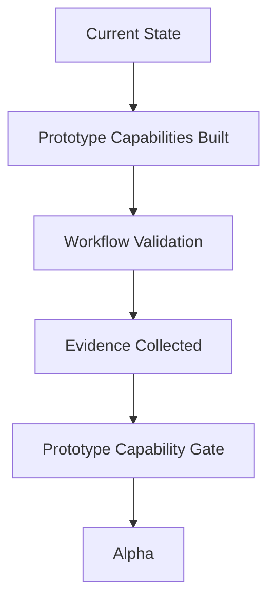

# Prototype

## Derived From

- Canon Version: `v1.0.0`
- Architecture Version: `v1.0.0`
- Implementation Version: `v1.0.0`
- Product Version: `v1.0.0`
- Research Version: `v1.0.0`
- Strategy Version: `v1.0.0`
- Roadmap Philosophy Version: `v1.0.0`

### Primary Repository Sources

- [Canon](../canon/README.md)
- [Architecture](../architecture/README.md)
- [Implementation](../implementation/README.md)
- [Product](../product/README.md)
- [Research](../research/README.md)
- [Strategy](../strategy/README.md)
- [Roadmap Philosophy](./00_ROADMAP_PHILOSOPHY.md)
- [Roadmap](./README.md)

### Primary Supporting Documents

- [MVP Scope](../implementation/12_MVP_SCOPE.md)
- [Implementation Architecture](../implementation/13_IMPLEMENTATION_ARCHITECTURE.md)
- [Product Strategy](../product/01_PRODUCT_STRATEGY.md)
- [Product Requirements](../product/02_PRODUCT_REQUIREMENTS.md)
- [MVP Features](../product/09_MVP_FEATURES.md)
- [Product Metrics](../product/10_PRODUCT_METRICS.md)
- [Experiments](../research/09_EXPERIMENTS.md)
- [Long-Term Vision](../strategy/09_LONG_TERM_VISION.md)
- [Executive Summary](../strategy/10_EXECUTIVE_SUMMARY.md)
- [Hackathon Scope](../hackathon/00_HACKATHON_SCOPE.md)

---

Status: **Active**

## Primary Question

What capabilities must the prototype demonstrate before the company can confidently move to Alpha?

This document defines the Prototype phase of the roadmap for the Organizational Intelligence Platform.

It is not a feature specification. It is not sprint planning. It defines the capability maturity that must be demonstrated before broader productization, deeper usability refinement, and Alpha expansion are justified.

## 1. Executive Summary

The Prototype phase exists to validate the foundational assumptions of the Organizational Intelligence Platform in working form.

The company has already defined its Canon, Architecture, Product, Research, Strategy, and Roadmap Philosophy. The Prototype phase does not create those foundations. It tests whether they can be expressed through a coherent working system that demonstrates the core Organizational Intelligence loop.

The Prototype phase succeeds when the company can show that:

- organizational work can become structured knowledge;
- proposed knowledge can be reviewed by humans before becoming trusted memory;
- trusted memory can improve future work;
- AI can accelerate understanding and drafting without replacing human authority;
- the architecture is sound enough to support further disciplined expansion;
- the prototype produces evidence that major assumptions are directionally correct.

The Prototype phase does not need polish, scale, or production maturity. It needs proof.

## 2. Purpose of the Prototype

Prototypes exist to create learning.

Their purpose is to validate whether the company's core product and architecture assumptions can operate together in a working system. The Prototype phase should therefore prioritize:

- capability validation;
- workflow coherence;
- usability clarity;
- evidence collection;
- architectural credibility;
- disciplined narrowing of uncertainty.

The Prototype phase is not intended to optimize for:

- visual perfection;
- enterprise completeness;
- horizontal feature breadth;
- operational scale;
- deep automation;
- production hardening.

The correct question in this phase is not whether the system looks finished.

The correct question is whether the system proves that the Organizational Intelligence Platform can work as a governed learning system.

## 3. Current State

The company is still at the earliest execution stage.

The current state is defined by the following conditions:

| Area | Current State |
| --- | --- |
| Company | Single founder operating as the primary product, architecture, and implementation owner. |
| Product maturity | Early working prototype under active development. |
| Customer maturity | No production customers and no validated production usage yet. |
| Repository maturity | Foundational documentation across Canon, Architecture, Implementation, Product, Research, Strategy, and Roadmap already exists. |
| Architectural maturity | Core conceptual architecture is defined and stable enough to guide implementation. |
| Product identity | Knowledge-first Organizational Intelligence Platform, not a generic chatbot or help desk tool. |
| Workflow focus | Customer Support is the first proving ground for live operational learning. |
| Implementation state | One working prototype is being built to test the foundational loop before broader investment. |

This current state matters because the Prototype phase should be judged according to what must be learned now, not according to what later enterprise stages will require.

## 4. Prototype Objectives

The Prototype phase has a small number of critical objectives.

## Validate the Organizational Intelligence Platform Concept

The prototype must show that the platform is meaningfully different from a chatbot, document store, or support tool by turning operational work into governed organizational capability.

## Validate the Knowledge Flywheel

The prototype must demonstrate that work creates evidence, evidence supports learning, learning becomes reviewed knowledge, and reviewed knowledge improves future work.

## Validate the Three Knowledge Intake Doors

The prototype must provide enough evidence that the platform can accept organizational knowledge through the three intended intake paths:

- Manual Knowledge Entry;
- Historical / Bulk Knowledge Import;
- Live Workflow Capture.

This phase does not require all three doors to have equal depth. It does require proof that they converge into one shared downstream knowledge pipeline rather than separate product concepts.

## Validate Human Review

The prototype must show that Human Review fits naturally into the workflow and acts as a trust mechanism rather than an afterthought.

## Validate Organizational Memory

The prototype must show that validated learning can become durable, explainable, reusable Organizational Memory rather than transient conversation output.

## Validate AI-Assisted Workflows

The prototype must show that AI can accelerate understanding, retrieval, drafting, and reasoning support while leaving authority with humans.

## Validate Overall Usability

The prototype must show that intended users can understand the workflow, navigate the system, complete core actions, and interpret key trust signals without deep training.

## 5. Core Capabilities To Demonstrate

The Prototype phase should be evaluated through capabilities rather than feature count.

Each capability below describes what must be demonstrated before Alpha becomes justified.

| Capability | Purpose | Success Criteria | Why It Matters |
| --- | --- | --- | --- |
| Knowledge Capture | Capture meaningful organizational knowledge from work or direct contribution. | Users can create structured knowledge inputs without confusing raw content with trusted memory. | The platform cannot learn if work disappears after completion. |
| Knowledge Candidate Lifecycle | Keep candidate knowledge separate from active memory until reviewed. | The prototype clearly distinguishes candidate, validated, active, challenged, and revised knowledge states. | Trusted memory requires lifecycle discipline. |
| Validation Workflow | Move proposed knowledge through accountable review before activation. | Reviewers can approve, reject, revise, narrow, or escalate candidate knowledge with rationale preserved. | Organizational Intelligence depends on governed validation. |
| Human Review | Keep human authority visible in consequential workflow steps. | Humans can inspect AI assistance, review knowledge changes, and make final judgment without workflow friction becoming prohibitive. | Trust is central to the product identity. |
| AI Reasoning Support | Assist users with understanding, retrieval, synthesis, and drafting. | AI accelerates work and produces useful guidance, while limitations and uncertainty remain visible. | AI is an amplifier, not the source of authority. |
| Organizational Memory | Preserve validated knowledge in reusable form. | Validated knowledge can be retrieved, explained, reused, and evolved through later work. | The platform's core value is durable memory. |
| Case Workflow | Support the end-to-end journey from issue intake to response, outcome, and learning. | A bounded support workflow can complete end to end with traceable transitions and later reuse. | The loop must work in live operational context, not only in isolated knowledge screens. |
| Evidence Preservation | Preserve the basis for claims, recommendations, and memory changes. | Users and reviewers can inspect sources, context, and rationale behind recommendations and knowledge. | Explainability and trust depend on evidence continuity. |
| Governance | Enforce minimal ownership, approval, and access boundaries. | The prototype demonstrates role-sensitive behavior and prevents unreviewed memory changes. | Governance must exist from the beginning, even in simplified form. |
| Metrics | Measure whether the prototype is producing learning, reuse, and workflow improvement. | The prototype records capability-oriented signals such as reuse, review outcomes, candidate conversion, and repeated-work reduction. | Without measurement, the phase cannot prove anything. |
| Administration | Provide enough control to manage the prototype environment and evaluate behavior. | Core organizational settings, role assumptions, and review boundaries can be configured or inspected. | Prototype validation requires controlled context, not uncontrolled behavior. |
| Basic Integrations | Connect the prototype to representative external knowledge or workflow sources. | At least minimal intake and reference behavior proves that the platform can interact with surrounding systems. | The platform must sit above operational systems, not pretend they do not exist. |
| Authentication | Preserve organization and user identity in core workflows. | Users are identifiable, and their actions can be associated with roles and history. | Trust, governance, and review require accountable identity. |
| Explainability | Make reasoning, evidence, and uncertainty understandable to users. | Users can understand why the system suggested something and what may be missing or uncertain. | Hidden reasoning would collapse trust and review quality. |

## 6. Capabilities Explicitly Out of Scope

The Prototype phase should remain intentionally narrow.

The following capabilities are explicitly deferred to Alpha or later unless needed as a minimal validation aid:

- production-grade scalability;
- enterprise deployment maturity;
- deep multi-tenant operations;
- complex policy engines;
- broad departmental coverage beyond the prototype proving ground;
- advanced workflow automation;
- fully autonomous action execution;
- large integration marketplaces;
- extensive analytics suites;
- fine-grained enterprise administration;
- extensive localization breadth;
- polished onboarding programs;
- full operational support processes;
- advanced security hardening beyond prototype needs;
- commercial packaging and billing.

Deferring these capabilities is not a weakness. It is a focus discipline.

## 7. Technical Goals

The Prototype phase should validate technical direction without collapsing into implementation detail.

## Architecture Validation

The prototype must show that the documented architecture can support one coherent learning loop without requiring conceptual redesign.

## Technology Validation

The prototype must show that the chosen technical direction is sufficient for continued iteration and does not create immediate dead ends for the core product model.

## Performance Assumption Validation

The prototype must show that performance is adequate for meaningful interactive use in the bounded workflow, even if it is not yet optimized for production-scale usage.

## AI Abstraction Validation

The prototype must show that AI assistance is architecturally replaceable and does not define the identity of the platform.

## Scalability Assumption Validation

The prototype must show that the core design can plausibly extend beyond the first narrow implementation without architectural contradiction, even though large-scale performance is not yet required.

## Developer Workflow Validation

The prototype must show that the company can build, test, revise, and learn from the system efficiently enough to support Alpha iteration.

## 8. UX Goals

The prototype user experience must prove clarity rather than polish.

The interface should demonstrate:

- users can understand the main workflow;
- users can create and review knowledge without confusion;
- users can navigate between case work, memory, and review states;
- users can understand what is trusted, what is proposed, and what is uncertain;
- users can complete core tasks without excessive explanation;
- users can see how organizational learning improves future work.

The Prototype phase does not require:

- refined brand expression;
- pixel-perfect visual systems;
- deep accessibility maturity across all edge cases;
- highly polished animation or interaction design;
- broad UX optimization across many personas.

It does require enough clarity to prove that the product concept is usable.

## 9. Validation Questions

The Prototype phase should answer a defined set of questions.

| Validation Question | Why It Matters |
| --- | --- |
| Can organizations naturally create Knowledge Candidates from work or direct contribution? | If not, the learning loop will remain artificial or burdensome. |
| Does Human Review fit operational workflows without becoming overwhelming? | If not, trust may remain theoretically correct but practically unusable. |
| Does the Knowledge Flywheel create measurable organizational learning? | If not, the product has not validated its central thesis. |
| Do users understand Organizational Memory as distinct from raw content or AI output? | If not, the product identity will remain unclear. |
| Can AI accelerate work without replacing human authority? | If not, the product risks becoming either too weak or too unsafe. |
| Do the three Knowledge Intake Doors converge into one coherent downstream model? | If not, the platform may fragment before Alpha. |
| Is the prototype architecture stable enough for continued investment? | If not, Alpha would scale uncertainty instead of reducing it. |
| Can users interpret trust, evidence, and uncertainty well enough to govern work responsibly? | If not, explainability is insufficient. |
| Does reuse actually reduce repeated work in the bounded prototype workflow? | If not, Organizational Memory has not yet demonstrated value. |
| Can the prototype be evaluated with meaningful metrics rather than anecdote alone? | If not, roadmap advancement would rely on optimism rather than evidence. |

## 10. Success Metrics

Prototype success should be measured through capability-oriented signals rather than business KPIs.

| Metric | Prototype Success Meaning |
| --- | --- |
| End-to-end workflow completion | Core case and knowledge workflows can be completed reliably in the prototype scope. |
| Knowledge Candidate creation rate | Representative users can create candidates from intended intake paths without excessive friction. |
| Candidate-to-validation conversion | Candidate knowledge is reviewed into clear outcomes rather than accumulating as unmanaged proposals. |
| Review completion quality | Human reviewers can approve, revise, reject, or escalate with understandable rationale. |
| Reuse rate in eligible prototype scenarios | Validated memory is actually applied to later relevant work. |
| Successful reuse rate | Reused memory improves later work without requiring major correction. |
| Explainability comprehension | Internal evaluators can understand why the system suggested something and what uncertainty remains. |
| AI assistance usefulness | AI materially reduces user effort in summarization, retrieval, reasoning support, or drafting. |
| Repeated-work reduction in bounded scenarios | Similar later work requires less repeated investigation than earlier work. |
| Knowledge Intake Door coverage | The prototype provides evidence for all three intake paths and one shared downstream model. |
| Architectural stability | Core flows work without repeated conceptual redesign of the documented architecture. |
| Usability clarity | Intended users can navigate and complete core tasks with limited coaching. |

These are prototype metrics because they test whether the capability exists, not whether the company has achieved commercial scale.

## 11. Capability Gate

The Prototype phase ends at a Capability Gate, not a date.

The company should enter Alpha only when the prototype demonstrates all of the following:

- a working prototype that completes the core learning loop;
- stable enough architecture to continue building without foundational contradiction;
- validated workflows for capture, review, memory, and reuse;
- positive internal evaluation from disciplined prototype usage and review;
- evidence supporting the phase's major assumptions strongly enough to justify further investment.

The Prototype Capability Gate can be expressed as:

Passing the gate means the company has more than a demo. It has a validated foundation for the next maturity stage.

## 12. Deliverables

By the end of the Prototype phase, the company should have produced tangible outputs.

| Deliverable | Purpose |
| --- | --- |
| Working prototype application | Demonstrates the core Organizational Intelligence loop in software. |
| Prototype evaluation evidence | Shows what was validated, what worked, and what remains uncertain. |
| Capability metric results | Provides measurable signals for gate evaluation. |
| Workflow validation scenarios | Demonstrates known, unknown, corrected, and reused learning paths. |
| Documented prototype assumptions | Makes explicit what the phase was intended to prove. |
| Architecture validation findings | Records whether the current architecture is directionally sound. |
| UX validation findings | Records where users understood or struggled with the workflow. |
| Updated roadmap inputs | Clarifies what Alpha should build on and what it should not assume. |

These deliverables exist to preserve organizational learning, not merely to document completion.

## 13. Risks

The Prototype phase carries real risks because it is testing foundational assumptions.

| Risk | Why It Matters |
| --- | --- |
| Users cannot naturally create or interpret Knowledge Candidates | The platform may require too much translation work to fit real behavior. |
| Human Review is too heavy or too confusing | Trust may be correct in theory but unsustainable in practice. |
| AI assistance is weak, opaque, or overconfident | Users may not trust it, or may trust it for the wrong reasons. |
| Organizational Memory is not meaningfully reused | The platform may create stored knowledge without future capability gain. |
| The three intake doors do not converge cleanly | The platform may fragment into disconnected workflows. |
| Architecture proves fragile under real workflow use | Alpha would amplify technical and conceptual instability. |
| Prototype metrics are too weak to support judgment | Gate decisions would become anecdotal. |
| Usability is confusing even within narrow scope | The concept may be correct but insufficiently operable. |
| Governance is either too weak or too burdensome | Trust and workflow viability may both be undermined. |
| The prototype solves a demo story without proving a repeatable system | The company may mistake presentation strength for product validation. |

These risks should be treated as learning targets, not as reasons to hide uncertainty.

## 14. Exit Criteria

The Prototype phase should move to Alpha only when explicit exit criteria have been satisfied.

## Required Exit Criteria

| Exit Criterion | Required Evidence |
| --- | --- |
| Working prototype exists | Core bounded workflow operates end to end in a stable prototype environment. |
| Core capabilities demonstrated | Capture, candidate lifecycle, review, memory, reuse, explainability, and measurement all function in prototype form. |
| Knowledge Flywheel proven in bounded scope | At least one complete loop from work to validated memory to later reuse has been demonstrated clearly. |
| Human Review validated | Reviewers can govern knowledge and AI-assisted outputs with manageable friction. |
| Organizational Memory validated | Memory is durable, inspectable, reusable, and evolvable. |
| Three intake doors sufficiently evidenced | The prototype shows that all three doors can feed one downstream model, even if only one is implemented most deeply. |
| Architecture is directionally stable | The prototype does not require foundational redefinition of core architecture to continue. |
| Prototype usability is directionally acceptable | Intended users can understand and complete core tasks without major conceptual confusion. |
| Major assumptions have evidence | The company can cite concrete evidence for the main hypotheses it intends Alpha to build upon. |
| Remaining uncertainty is understood | The company knows what Alpha is meant to refine rather than guessing what failed in Prototype. |

If these criteria are not met, the correct action is to continue validating or narrow scope further before advancing.

## 15. Relationship to Alpha

Alpha should build directly on validated prototype capabilities.

Prototype proves foundational assumptions.

Alpha should extend those validated foundations through deeper usability, broader reliability, stronger workflow maturity, richer instrumentation, and more realistic operational use. Alpha should not be forced to rediscover whether the core Organizational Intelligence loop is conceptually valid.

The Prototype-to-Alpha relationship should therefore be:

| Prototype Responsibility | Alpha Responsibility |
| --- | --- |
| Prove the foundational loop works | Strengthen and refine the validated loop |
| Validate capability direction | Expand capability maturity |
| Identify major uncertainty | Reduce remaining uncertainty |
| Confirm architectural viability | Build on a stable architectural base |
| Demonstrate learning potential | Improve product usability and operational confidence |

Alpha should be an expansion of validated learning, not a rescue phase for unresolved prototype fundamentals.

## 16. Traceability Matrix

The Prototype phase inherits its meaning from the rest of the repository.

| Source | Prototype Phase Derivation |
| --- | --- |
| [Canon](../canon/README.md) | Defines Organizational Intelligence, Organizational Memory, Human Review, Governance, and the Knowledge Flywheel that the prototype must prove. |
| [Architecture](../architecture/README.md) | Defines the logical structures and responsibility boundaries the prototype must validate in working form. |
| [Implementation](../implementation/README.md) | Defines the current concrete realization and the MVP boundary the prototype should directionally support. |
| [Product](../product/README.md) | Defines enduring capabilities, workflows, requirements, and product metrics that the prototype must make testable. |
| [Research](../research/README.md) | Defines the evidence standards and learning posture by which prototype assumptions should be judged. |
| [Strategy](../strategy/README.md) | Defines the beachhead logic, market direction, and long-term ambition that make Prototype a focused proving stage rather than broad expansion. |
| [Roadmap Philosophy](./00_ROADMAP_PHILOSOPHY.md) | Defines capability gates, evidence-driven progress, validation before expansion, and roadmap discipline for this phase. |

## Capability Traceability

| Prototype Capability | Repository Basis |
| --- | --- |
| Knowledge Capture | Canon Capability Model, Product Requirements, MVP Features |
| Knowledge Candidate Lifecycle | Workflow Model, Information Architecture, MVP Scope |
| Validation Workflow | Human Review principles, Product Governance, MVP Features |
| Human Review | Canon, Product Philosophy, Product Strategy, Product Metrics |
| AI Reasoning Support | AI Cognitive Model, AI Agent Architecture, MVP Features |
| Organizational Memory | Canon, Knowledge Representation Model, Product Metrics |
| Case Workflow | Workflow Model, Product Requirements, MVP Scope |
| Evidence Preservation | Data Architecture, Knowledge Representation Model, Product Metrics |
| Governance | Canon, Product Governance, Security and Implementation boundaries |
| Metrics | Product Metrics, Research Methodology, Roadmap Philosophy |
| Explainability | Canon, Product Metrics, AI Cognitive Model |

## 17. What This Document Does NOT Define

This document intentionally does not define:

- production readiness;
- commercial launch;
- scaling strategy;
- enterprise operations;
- marketing;
- sales;
- funding strategy;
- sprint planning;
- detailed feature specifications;
- project management mechanics;
- resource allocation;
- implementation tasks.

Those belong to later phases or to other repository layers.

This document defines only what the Prototype phase must prove before Alpha.

## 18. Closing

The Prototype phase exists to validate the foundational assumptions of the Organizational Intelligence Platform before broader investment and expansion.

Its purpose is not to look finished. Its purpose is to prove that the core platform logic is real: work becomes knowledge, knowledge is reviewed by humans, validated knowledge becomes Organizational Memory, and Organizational Memory improves future work.

If the Prototype phase succeeds, the company earns the right to enter Alpha with evidence, not optimism. If it fails, the company gains something equally important: clear knowledge about which assumptions must be repaired before scaling effort further.

That is the value of the Prototype phase.
