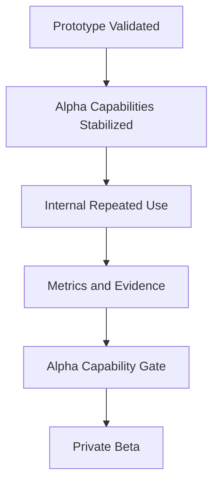

# Alpha

## Derived From

- Canon Version: `v1.0.0`
- Architecture Version: `v1.0.0`
- Implementation Version: `v1.0.0`
- Product Version: `v1.0.0`
- Research Version: `v1.0.0`
- Strategy Version: `v1.0.0`
- Roadmap Philosophy Version: `v1.0.0`
- Prototype Roadmap Version: `v1.0.0`

### Primary Repository Sources

- [Canon](../canon/README.md)
- [Architecture](../architecture/README.md)
- [Implementation](../implementation/README.md)
- [Product](../product/README.md)
- [Research](../research/README.md)
- [Strategy](../strategy/README.md)
- [Roadmap](./README.md)
- [Roadmap Philosophy](./00_ROADMAP_PHILOSOPHY.md)
- [Prototype](./01_PROTOTYPE.md)

### Primary Supporting Documents

- [MVP Scope](../implementation/12_MVP_SCOPE.md)
- [Implementation Architecture](../implementation/13_IMPLEMENTATION_ARCHITECTURE.md)
- [Technology Decisions](../implementation/14_TECHNOLOGY_DECISIONS.md)
- [API Architecture](../implementation/15_API_ARCHITECTURE.md)
- [Storage Architecture](../implementation/16_STORAGE_ARCHITECTURE.md)
- [Product Strategy](../product/01_PRODUCT_STRATEGY.md)
- [Product Requirements](../product/02_PRODUCT_REQUIREMENTS.md)
- [MVP Features](../product/09_MVP_FEATURES.md)
- [Product Metrics](../product/10_PRODUCT_METRICS.md)
- [Product Governance](../product/11_PRODUCT_GOVERNANCE.md)
- [Product Lifecycle](../product/14_PRODUCT_LIFECYCLE.md)
- [Experiments](../research/09_EXPERIMENTS.md)
- [Executive Summary](../strategy/10_EXECUTIVE_SUMMARY.md)

---

Status: **Active**

## Primary Question

What must the Alpha phase prove before the platform can responsibly move from internal validation to Private Beta with real design partners?

This document defines the Alpha phase of the roadmap for the Organizational Intelligence Platform.

It is not a sprint plan, feature backlog, or commercial launch plan. It defines the first disciplined product-engineering milestone in which the prototype becomes a coherent, stable, internally usable product foundation.

## 1. Executive Summary

Alpha is the transition from proof-of-concept to coherent internal product foundation.

Prototype asked:

> Can this idea work?

Alpha asks:

> Can this become a stable product system?

The Prototype phase validated foundational assumptions. Alpha must stabilize those assumptions into repeatable, inspectable product capabilities that can support disciplined internal use and controlled external evaluation.

By the end of Alpha, the platform should no longer be understood primarily as a promising prototype. It should be understood as the first coherent internal realization of the Organizational Intelligence Platform: stable enough to use repeatedly, structured enough to govern, and clear enough to prepare for Private Beta design partner validation.

Alpha does not require public readiness, enterprise maturity, or production scale.

It requires stable product foundations.

## 2. Purpose of Alpha

Alpha exists to validate product architecture, core workflows, internal usability, and overall system coherence.

At this stage, the company is no longer asking only whether the core Organizational Intelligence loop is conceptually possible. It is asking whether that loop can operate repeatedly inside a product system without depending on manual intervention, conceptual shortcuts, or prototype-only behavior.

Alpha should therefore prove that:

- the platform's core concepts are represented as real product capabilities;
- the system can preserve trust boundaries through ordinary workflow use;
- users can move through core flows repeatedly without engineering assistance;
- candidate knowledge, review, validation, and memory are coherently separated;
- AI assistance is governed inside the product rather than merely attached to it;
- internal evaluation can generate meaningful evidence for Private Beta readiness.

Alpha is the phase where product coherence becomes more important than prototype novelty.

## 3. Relationship to Prototype

Alpha builds directly on Prototype.

Prototype validated foundational assumptions.

Alpha stabilizes those assumptions into product capabilities.

| Prototype Proves | Alpha Stabilizes |
| --- | --- |
| Concept feasibility | Product foundation |
| Early Knowledge Candidate flow | Complete Knowledge Candidate lifecycle |
| Basic AI assistance | Governed AI integration |
| Simple review | Structured Human Review |
| Early memory concept | Durable Organizational Memory |
| Rough UI | Internally usable workflow |

Prototype is successful when the company can show that the core loop is real.

Alpha is successful when the company can show that the core loop can live inside a coherent product system repeatedly and responsibly.

## 4. Current State Entering Alpha

Alpha begins only after the Prototype phase has established a valid starting point.

The expected entering conditions are:

- a working prototype exists;
- core repository documentation exists;
- Canon and Architecture are defined;
- the implementation stack has been selected;
- prototype workflows have been tested internally;
- major conceptual assumptions are not yet externally validated;
- production readiness does not yet exist.

The company therefore enters Alpha with strong conceptual clarity but limited external proof. Alpha exists to convert that conceptual clarity into a more stable internal product foundation.

## 5. Target State After Alpha

After Alpha, the following conditions should be true:

- the product can be used internally end to end;
- core workflows are stable enough for repeated testing;
- Knowledge Candidates can be created, reviewed, validated, rejected, revised, and promoted;
- Organizational Memory exists as a durable product capability;
- AI output is treated as candidate assistance rather than authority;
- Human Review is operationally represented in the product;
- basic metrics exist;
- basic governance boundaries exist;
- the system is ready for controlled Private Beta design partner use.

This target state does not imply full maturity.

It implies that the company has established a credible internal product system on top of which external learning can begin.

## 6. Alpha Capability Themes

Alpha should be organized around capability themes rather than feature breadth.

## 6.1 Organization and Workspace Foundation

Alpha must introduce a credible organizational structure for product use.

The platform should represent:

- organizations;
- workspaces;
- users;
- roles;
- ownership boundaries;
- basic tenancy assumptions.

This is necessary because Organizational Intelligence cannot be governed if identity, scope, and ownership remain ambiguous.

### Success Criteria

- users belong to an organization;
- work is scoped to the correct organization or workspace;
- ownership boundaries are represented clearly enough for internal use;
- future multi-tenant architecture is not contradicted.

## 6.2 Authentication and Access

Alpha must introduce credible authentication and basic access control.

This phase does not need exhaustive enterprise identity maturity, but it must make user identity real inside the product rather than implied by development context.

### Success Criteria

- users can sign in;
- user identity is attached to actions;
- review and validation actions are attributable;
- access assumptions support future governance.

## 6.3 Knowledge Intake Foundation

Alpha should support the earliest working version of knowledge intake as a product capability.

The product should remain aligned to the Three Knowledge Intake Doors:

- Manual Entry;
- Historical Import;
- API / Live Connection.

Alpha may not fully implement all three doors with equal operational depth. It must, however, remain faithful to the shared intake architecture so that future expansion does not require product redefinition.

### Success Criteria

- at least Manual Entry works clearly;
- the system is structurally ready for Historical Import and API / Live Connection;
- every intake creates a Knowledge Candidate first rather than trusted memory directly.

## 6.4 Knowledge Candidate Lifecycle

The Knowledge Candidate lifecycle is one of the most important Alpha capabilities.

Alpha must stabilize candidate knowledge as a governed product object with visible state, preserved context, and accountable transitions.

Illustrative lifecycle states may include:

- Created;
- Drafted;
- Needs Review;
- Under Review;
- Approved;
- Rejected;
- Revised;
- Promoted;
- Archived.

The exact names may vary if the product vocabulary differs, but the lifecycle meaning must remain intact.

### Success Criteria

- candidates have visible states;
- candidates preserve source context;
- candidates can be reviewed;
- candidates do not become memory without validation;
- lifecycle transitions are auditable enough for Alpha.

## 6.5 Human Review Workflow

Human Review is not optional.

Alpha must represent how reviewers interact with AI-assisted candidates and how governed judgment enters the product workflow.

### Success Criteria

- a reviewer can inspect a candidate;
- a reviewer can inspect evidence;
- a reviewer can approve, reject, or revise;
- reviewer identity and rationale are preserved;
- AI does not bypass review.

## 6.6 Validation and Promotion

Alpha must distinguish between review and promotion.

Review evaluates candidate quality.

Promotion turns validated knowledge into Organizational Memory.

This distinction is essential because a candidate may be reviewed without necessarily becoming active memory, and validated memory must preserve provenance rather than flattening its history.

### Success Criteria

- validated knowledge can be promoted;
- rejected candidates remain visible for learning;
- promotion creates durable memory;
- promotion does not erase provenance.

## 6.7 Organizational Memory Foundation

Alpha must make Organizational Memory real as a product capability.

It does not need full enterprise maturity, but it must demonstrate durable, reusable, governed knowledge distinct from raw content or transient workflow artifacts.

### Success Criteria

- promoted knowledge can be found again;
- memory items preserve source, reviewer, validation, and timestamp;
- memory supports future reuse;
- memory is distinct from raw imported data.

## 6.8 Evidence and Provenance

Evidence matters because trust, review, and explainability depend on it.

Alpha must show that candidate knowledge and promoted memory preserve enough provenance for users to understand why something exists, why it is trusted, and what it is based on.

### Success Criteria

- candidates link to source evidence where available;
- knowledge items preserve provenance;
- users can understand why something is trusted;
- AI-generated text is not treated as evidence by itself.

## 6.9 AI Assistance Foundation

The Alpha role of AI is bounded assistance.

AI may:

- summarize;
- classify;
- extract candidate knowledge;
- identify repeated patterns;
- draft candidate content;
- assist review.

AI is not authority.

AI should remain a reviewable, evidence-aware participant inside the workflow rather than a hidden decision-maker.

### Success Criteria

- AI output is visibly reviewable;
- AI assistance is grounded in available evidence;
- AI decisions are not final decisions;
- model or provider abstraction is respected where possible.

## 6.10 Metrics Foundation

Alpha should introduce early internal metrics that make the product's core lifecycle measurable.

Illustrative examples include:

- Knowledge Candidates Created;
- Candidates Reviewed;
- Validation Rate;
- Promotion Rate;
- Rejection Rate;
- Time to Review;
- Knowledge Items Created;
- Intake Source.

### Success Criteria

- core lifecycle events can be measured;
- metrics support future Product and go-to-market validation;
- metrics are not vanity metrics.

## 6.11 Administration Foundation

Alpha should support basic administrative needs that allow the founder and internal team to operate the system coherently.

This may include:

- organization settings;
- user management assumptions;
- workspace configuration;
- basic company profile;
- layout or branding assumptions where relevant to the current product state.

### Success Criteria

- admin concepts exist;
- configuration does not compromise the Canon;
- future enterprise controls remain possible.

## 6.12 Internal Usability

Alpha should be usable by the founder and internal team without constant engineering intervention.

This is not yet broad market usability. It is repeatable internal usability across the platform's core workflows.

### Success Criteria

- core flows can be completed;
- navigation is understandable;
- users can see what state work is in;
- review actions are clear;
- memory is findable.

## 7. Technical Validation Goals

Alpha must prove the product is technically coherent enough to keep building responsibly.

The phase should validate the following:

- the modular monolith remains viable;
- API boundaries are coherent;
- the storage model supports candidate and memory separation;
- AI integration is abstracted enough;
- auditability assumptions are possible;
- frontend and backend can support roadmap progression;
- the developer workflow supports continued iteration.

These are Alpha goals because the company must establish that the current foundation can support Private Beta learning without immediate structural breakdown.

## 8. UX Validation Goals

Alpha UX should prove clarity rather than visual perfection.

It must answer the following questions:

- Do users understand what a Knowledge Candidate is?
- Do users understand what needs review?
- Do users understand what has become Organizational Memory?
- Can users distinguish AI suggestion from validated knowledge?
- Can users complete the review workflow?
- Can admins understand company and workspace configuration?

The UX goal is not refined polish.

The UX goal is conceptual clarity inside a repeatable product workflow.

## 9. Alpha Success Metrics

Alpha success should be measured through capability-oriented metrics.

| Metric | Why It Matters |
| --- | --- |
| End-to-end candidate completion | Shows the core lifecycle works. |
| Review completion rate | Shows Human Review is operational. |
| Promotion rate | Shows useful learning can become memory. |
| Rejection or correction rate | Shows governance is active rather than cosmetic. |
| Internal task completion | Shows usability. |
| Candidate-to-memory traceability | Shows explainability. |

These metrics should be interpreted as capability signals rather than business KPIs. They exist to prove that the platform's core product system is functioning coherently enough to support controlled external use.

## 10. Capability Gate to Private Beta

Alpha exits through a Capability Gate rather than a release schedule.

The platform may move to Private Beta only when:

- the core Knowledge Candidate lifecycle works end to end;
- Human Review works;
- Organizational Memory works;
- AI assistance is bounded and reviewable;
- basic metrics exist;
- internal users can complete core workflows;
- no known architectural issue invalidates the Canon;
- the system is stable enough for controlled design partner use.

Passing this gate means the company has established an internally usable product foundation rather than an advanced prototype.

## 11. Deliverables

The Alpha phase should produce the following tangible outputs:

- working Alpha application;
- internal demo workflow;
- Alpha evaluation notes;
- known limitations list;
- updated implementation notes;
- internal metrics baseline;
- Private Beta readiness checklist.

These deliverables should preserve what the company has learned and clarify what remains intentionally unresolved before external design partner use begins.

## 12. Risks

Alpha carries several meaningful risks.

| Risk | Why It Matters |
| --- | --- |
| Alpha becomes feature-heavy instead of capability-focused | The company may create breadth without strengthening product foundations. |
| AI output is over-trusted | The platform may erode its own trust boundaries. |
| Human Review becomes unclear | Governance may exist conceptually but fail in practice. |
| Organizational Memory is treated like a database table rather than governed knowledge | The platform may lose its defining product meaning. |
| UX confusion weakens validation | Internal use may fail for reasons of clarity rather than concept. |
| Architectural shortcuts create later rework | Private Beta may inherit unstable foundations. |

These risks should be handled through capability discipline, not by narrowing the product's meaning.

## 13. Exit Criteria

Alpha should not be considered complete until its exit criteria are satisfied explicitly.

| Exit Criterion | Required Evidence |
| --- | --- |
| Stable internal Alpha application exists | Core workflows operate repeatedly without engineering rescue. |
| Knowledge Candidate lifecycle is complete enough for Alpha | Candidates can be created, reviewed, revised, rejected, validated, promoted, and archived or otherwise concluded. |
| Human Review is operational | Reviewers can inspect evidence, record decisions, and preserve rationale. |
| Organizational Memory is durable | Promoted knowledge is reusable, findable, and distinct from raw inputs. |
| AI assistance remains bounded | AI outputs are reviewable and never bypass human authority. |
| Metrics foundation exists | Core lifecycle events can be measured consistently. |
| Internal usability is demonstrated | Internal users can complete core tasks with reasonable clarity. |
| Architectural integrity remains intact | No known structural issue invalidates the documented Canon or Architecture. |
| Private Beta readiness is credible | The company can explain why controlled external validation is now responsible. |

If these criteria are not met, Alpha should continue or narrow its scope rather than advancing prematurely.

## 14. Relationship to Private Beta

Private Beta begins only after Alpha proves the platform can be used internally with stable core workflows.

Alpha proves internal system coherence.

Private Beta tests whether external organizations can use those workflows under controlled conditions.

The distinction matters:

| Alpha | Private Beta |
| --- | --- |
| Proves stable internal product foundation | Proves controlled external usability and value |
| Validates workflow coherence | Validates design partner fit |
| Stabilizes product capabilities | Tests those capabilities with real organizations |
| Identifies internal limitations | Learns from external operational reality |

Private Beta should extend Alpha learning, not replace it.

## 15. Traceability Matrix

Alpha derives from the repository's existing layers and from the Prototype phase.

| Source | Alpha Derivation |
| --- | --- |
| [Canon](../canon/README.md) | Defines Organizational Intelligence, Organizational Memory, Human Review, Governance, and trust boundaries Alpha must stabilize. |
| [Architecture](../architecture/README.md) | Defines the logical system, data, knowledge, AI, and integration boundaries Alpha must represent coherently in product form. |
| [Implementation](../implementation/README.md) | Defines the current concrete realization and technical direction Alpha must strengthen into a stable internal foundation. |
| [Product](../product/README.md) | Defines enduring capabilities, requirements, metrics, workflows, and governance Alpha must operationalize. |
| [Research](../research/README.md) | Defines the evidence discipline by which Alpha assumptions and outcomes should be judged. |
| [Strategy](../strategy/README.md) | Defines the beachhead logic, design partner path, and long-term direction that justify Private Beta as the next stage after Alpha. |
| [Roadmap Philosophy](./00_ROADMAP_PHILOSOPHY.md) | Defines capability gates, evidence-driven progress, and validation-before-expansion discipline for Alpha. |
| [Prototype](./01_PROTOTYPE.md) | Defines the validated assumptions Alpha must stabilize into coherent product capabilities. |

## 16. What This Document Does NOT Define

This document intentionally does not define:

- public launch;
- full enterprise readiness;
- final pricing;
- complete integrations;
- advanced analytics;
- fundraising;
- marketing campaigns;
- full customer success process.

Those belong to later phases or other repository layers.

This document defines only what Alpha must prove before the company can responsibly enter Private Beta.

## 17. Closing

Alpha is the product foundation stage.

Alpha succeeds when the company can say:

> The Organizational Intelligence Platform is no longer only a prototype; it is a coherent internal product foundation ready for controlled external validation.

That is the purpose of the phase.
