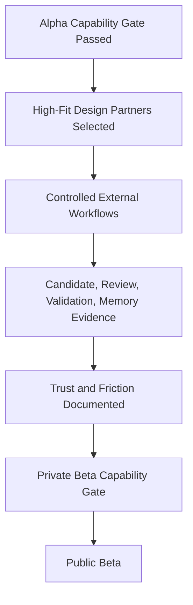

# Private Beta

## Derived From

- Canon Version: `v1.0.0`
- Architecture Version: `v1.0.0`
- Implementation Version: `v1.0.0`
- Product Version: `v1.0.0`
- Research Version: `v1.0.0`
- Strategy Version: `v1.0.0`
- Roadmap Philosophy Version: `v1.0.0`
- Prototype Roadmap Version: `v1.0.0`
- Alpha Roadmap Version: `v1.0.0`

### Primary Repository Sources

- [Canon](../canon/README.md)
- [Architecture](../architecture/README.md)
- [Implementation](../implementation/README.md)
- [Product](../product/README.md)
- [Research](../research/README.md)
- [Strategy](../strategy/README.md)
- [Roadmap](./README.md)
- [Roadmap Philosophy](./00_ROADMAP_PHILOSOPHY.md)
- [Prototype](./01_PROTOTYPE.md)
- [Alpha](./02_ALPHA.md)

### Primary Supporting Documents

- [MVP Scope](../implementation/12_MVP_SCOPE.md)
- [MVP Features](../product/09_MVP_FEATURES.md)
- [Product Metrics](../product/10_PRODUCT_METRICS.md)
- [Product Governance](../product/11_PRODUCT_GOVERNANCE.md)
- [Product Lifecycle](../product/14_PRODUCT_LIFECYCLE.md)
- [Ideal Customer Profile](../strategy/02_IDEAL_CUSTOMER_PROFILE.md)
- [Go-to-Market Strategy](../strategy/03_GO_TO_MARKET.md)
- [Customer Discovery](../research/02_CUSTOMER_DISCOVERY.md)
- [Experiments](../research/09_EXPERIMENTS.md)
- [Design Partners](./05_DESIGN_PARTNERS.md)
- [Customer Support MVP](./06_CUSTOMER_SUPPORT_MVP.md)
- [Knowledge Flywheel](./07_KNOWLEDGE_FLYWHEEL.md)
- [Product-Market Fit](./08_PRODUCT_MARKET_FIT.md)

---

Status: **Active**

## Primary Question

Can carefully selected design partners use the Organizational Intelligence Platform in real or representative workflows, and does the platform create credible evidence of organizational learning?

This document defines the Private Beta phase of the roadmap for the Organizational Intelligence Platform.

It is not a public launch, a commercial launch, or a Product-Market Fit declaration. It is a structured customer validation phase in which carefully selected external organizations begin using the platform under controlled conditions, so the company can learn from real usage before broader release.

## 1. Executive Summary

Private Beta is the transition from internal Alpha validation to controlled external validation.

Alpha proves the product foundation can work internally. Private Beta proves whether selected real organizations can use the platform in controlled conditions. Public Beta later proves broader repeatability.

Alpha asks:

> Can the platform work internally as a stable product foundation?

Private Beta asks:

> Can real design partners use the platform in controlled conditions and produce credible evidence that support work can become governed Organizational Memory?

Public Beta asks:

> Can the company repeat that value across a broader early customer cohort?

Private Beta exists to produce evidence, not scale. It is a small, deliberate phase whose success is measured by the quality of learning from a few high-fit design partners, not by customer count, revenue, or growth. The goal is controlled depth: to discover whether the right customers can reach value, and to surface the friction, trust concerns, and product gaps that must be understood before any broader release.

## 2. Purpose of Private Beta

Private Beta exists to learn from real organizations before broader public release.

Alpha established internal product coherence, but internal use cannot answer whether real support teams, with real data, real reviewers, and real operational constraints, can use the platform and trust it. Private Beta introduces that external reality under controlled conditions.

Private Beta should help the company determine:

- whether the updated Ideal Customer Profile is correct;
- whether the Customer Support beachhead is valid;
- whether support teams understand the workflow;
- whether Human Review fits real operations;
- whether AI-assisted candidate generation is trusted;
- whether Organizational Memory creates early value;
- whether onboarding is understandable;
- whether category language resonates;
- what product friction blocks adoption.

Private Beta is a learning phase. Its purpose is to convert internal product coherence into credible external evidence, and to sharpen the company's understanding of who the platform serves and where it must improve.

## 3. Relationship to Alpha and Public Beta

Private Beta sits between internal validation and broader repeatability. Each phase validates a distinct question, and each depends on the one before it.

| Alpha Validates | Private Beta Validates | Public Beta Validates |
| --- | --- | --- |
| Internal product coherence | External design partner workflow fit | Broader early customer repeatability |
| Core lifecycle | Real customer usage | Repeatable onboarding |
| Internal review workflow | Customer reviewer behavior | Multi-customer supportability |
| Basic memory | Useful customer memory | Repeatable value signals |
| Internal usability | Customer usability | Operational readiness |
| Technical foundation | Deployment and onboarding friction | Controlled broader adoption |

Private Beta should not begin until Alpha capability gates are met. Introducing external design partners onto an unstable internal foundation would produce misleading signals and damage early relationships.

Public Beta should not begin until Private Beta produces enough evidence. Broadening to more customers before the workflow is validated with high-fit design partners would scale friction and false signals rather than proven value.

## 4. Current State Entering Private Beta

Private Beta begins only after Alpha has established a stable internal product foundation.

The expected entering conditions are:

- the Alpha system works internally end to end;
- the Knowledge Candidate lifecycle is functional;
- Human Review is functional;
- Organizational Memory exists as a durable capability;
- basic authentication and organization structure exist;
- basic metrics exist;
- basic governance boundaries exist;
- AI assistance is bounded and reviewable;
- the product is not yet production mature;
- onboarding is still founder-assisted;
- no broad customer success motion exists;
- customer evidence is still limited.

The company therefore enters Private Beta with a coherent internal product but limited external proof. Private Beta exists to gather that external proof responsibly, while acknowledging that the product is still early and heavily founder-supported.

## 5. Target State After Private Beta

By the end of Private Beta, the following conditions should be true:

- 3 to 10 high-fit design partners have been evaluated or onboarded;
- real or representative support workflows have been tested;
- customer data or workflow artifacts have produced Knowledge Candidates;
- customer-side reviewers have approved, rejected, or revised candidates;
- validated knowledge has been promoted into Organizational Memory;
- early reuse of memory has been observed or simulated credibly;
- onboarding friction has been documented;
- trust, security, and AI concerns have been captured;
- Ideal Customer Profile and Anti-ICP assumptions have been sharpened;
- category language has been tested with customers;
- Public Beta readiness has been assessed.

This target state does not imply repeatable onboarding, operational maturity, or Product-Market Fit. It implies that the company has generated credible external evidence about whether the right customers can reach value, and what must be improved before broader release.

## 6. Design Partner Selection

Private Beta customers should be selected as design partners, not ordinary users. A design partner participates in shaping the product and providing structured feedback, in exchange for early access and influence.

Selection should be based on the updated [Ideal Customer Profile](../strategy/02_IDEAL_CUSTOMER_PROFILE.md).

Strong Private Beta design partners should have:

- a mid-market to lower-enterprise B2B profile;
- high-volume Customer Support or service operations;
- recurring customer questions or issues;
- fragmented support knowledge;
- historical tickets, chats, documents, notes, or case records;
- human reviewers, QA, escalation owners, or knowledge managers;
- leadership urgency around support quality, AI, efficiency, or knowledge loss;
- willingness to provide structured feedback;
- willingness to participate in Human Review;
- potential future reference value;
- Indonesia-first relevance where possible.

The number of design partners should remain small and high-fit. A few strong partners produce clearer, more credible learning than many weak-fit participants.

## 7. Anti-Private Beta Customers

Some organizations should be excluded from Private Beta because they would produce misleading signals or consume disproportionate effort.

Organizations that should be excluded include:

- organizations seeking full automation without review;
- teams with no historical data;
- teams with very low support volume;
- customers with no operational champion;
- customers with no executive sponsor;
- organizations unwilling to give feedback;
- organizations requiring heavy bespoke customization;
- highly regulated enterprises requiring maturity beyond current scope;
- buyers looking only for ticket deflection;
- organizations that do not recognize knowledge or learning pain.

Poor-fit customers can create false product signals. A customer who wants full automation will judge the platform's Human Review as friction; a customer with no data cannot exercise intake or memory; a customer seeking only deflection will misread the category. Excluding poor-fit participants protects the integrity of Private Beta evidence.

## 8. Private Beta Capability Themes

Private Beta should be organized around capability themes rather than feature breadth. Each theme defines what the phase must validate with real design partners.

## 8.1 Customer Onboarding

Private Beta must validate whether early customers can understand and enter the product.

### Success Criteria

- the design partner understands the purpose of the platform;
- organization and workspace setup is possible;
- onboarding steps are observable;
- a first workflow can be created without excessive custom work;
- onboarding friction is documented.

## 8.2 Customer Support Workflow Fit

Private Beta must validate whether the product fits real Customer Support operations.

### Success Criteria

- real or representative support cases can be represented;
- users understand where work becomes learning;
- the workflow does not feel like a generic help desk clone;
- support teams understand the difference between case work, candidate knowledge, and memory.

## 8.3 Knowledge Intake

Private Beta should test intake from real customer materials, aligned to the Three Knowledge Intake Doors:

- Manual Entry;
- Historical Import;
- API / Live Connection.

Private Beta may prioritize Manual Entry and limited Historical Import before full live integrations, provided intake remains faithful to the shared intake architecture.

### Success Criteria

- customer artifacts can enter the system;
- intake creates Knowledge Candidates first;
- raw data does not become trusted memory directly;
- evidence and source context are preserved;
- intake friction is documented.

## 8.4 Knowledge Candidate Creation

Private Beta must validate whether real customer work produces useful candidates.

### Success Criteria

- candidates reflect real customer problems;
- candidates are specific enough for review;
- candidates preserve supporting evidence;
- candidates are understandable to customer reviewers;
- candidates are not generic AI summaries.

## 8.5 Human Review by Customer Experts

Private Beta must test whether real experts can review candidate knowledge.

### Success Criteria

- reviewers can inspect the candidate and its evidence;
- reviewers can approve, reject, or revise;
- reviewer rationale can be captured;
- review burden is acceptable;
- Human Review increases trust rather than creating unnecessary friction.

## 8.6 Validation and Promotion

Private Beta must test whether customers can distinguish proposed learning from trusted memory.

### Success Criteria

- validated candidates can be promoted;
- rejected candidates remain traceable;
- promotion preserves provenance;
- customers understand why validation matters;
- memory is not confused with raw ticket history.

## 8.7 Organizational Memory Usefulness

Private Beta must show whether promoted memory is useful.

### Success Criteria

- validated memory can be found again;
- memory is understandable;
- memory preserves evidence and review history;
- memory can help future cases, onboarding, review, or knowledge work;
- early reuse is observed, simulated, or tested through representative scenarios.

## 8.8 AI Trust and Boundaries

Private Beta must test whether customers trust the AI posture.

### Success Criteria

- customers understand AI is assistant, not authority;
- AI output is visibly reviewable;
- AI suggestions are grounded in evidence where possible;
- reviewers can reject AI outputs;
- security and privacy concerns are documented;
- AI does not directly publish Organizational Memory.

## 8.9 Metrics and Evidence Capture

Private Beta must capture metrics that support learning.

Metrics may include:

- Knowledge Candidates Created;
- Candidates Reviewed;
- Validation Rate;
- Promotion Rate;
- Rejection Rate;
- Revision Rate;
- Time to Review;
- Reviewer Participation;
- Time to First Organizational Value;
- Knowledge Reuse Events;
- Customer Confidence Signals;
- Onboarding Friction;
- Trust Concerns.

### Success Criteria

- core lifecycle events can be measured with real customer usage;
- metrics support product and go-to-market learning;
- metrics are interpreted as evidence, not vanity numbers.

## 8.10 Feedback Loop

Private Beta must establish a structured feedback loop so that learning is captured and routed into the repository.

The feedback loop should include:

- weekly operational feedback;
- biweekly product synthesis;
- monthly executive review where possible;
- an end-of-beta evaluation;
- repository updates after major learning cycles.

### Success Criteria

- feedback is collected consistently rather than anecdotally;
- learning is synthesized into product and roadmap decisions;
- major learning cycles update the repository.

## 9. Private Beta Validation Questions

Private Beta should be guided by explicit validation questions. These questions frame what the phase is trying to learn and should be answered with evidence rather than opinion.

| Validation Question | What It Tests |
| --- | --- |
| Do customers recognize Organizational Entropy in their own words? | Whether the core problem resonates. |
| Do customers understand why this is not only a chatbot? | Whether the category is understood. |
| Does Customer Support remain the right beachhead? | Whether the beachhead assumption holds. |
| Can customer workflows produce useful Knowledge Candidates? | Whether real work becomes learning. |
| Do reviewers trust the candidate review process? | Whether Human Review is credible. |
| Is Human Review acceptable in real operations? | Whether review fits operational reality. |
| Does Organizational Memory feel useful? | Whether memory creates early value. |
| Which evidence sources matter most? | Which inputs drive credible knowledge. |
| Which intake door creates the most immediate value? | Where intake should be prioritized. |
| What onboarding steps confuse customers? | Where onboarding friction concentrates. |
| What trust concerns appear repeatedly? | Which trust barriers must be addressed. |
| What would make customers expand usage? | Which value drives adoption depth. |
| What would make customers pay? | Early willingness-to-pay signals. |
| What product gaps block Public Beta readiness? | What must be resolved before broadening. |

These questions should be revisited throughout the phase. Clear, evidence-based answers, including negative answers, are the primary output of Private Beta.

## 10. Private Beta Success Metrics

Private Beta success should be measured through validation-oriented metrics rather than growth metrics.

| Metric | Why It Matters |
| --- | --- |
| Qualified Design Partners | Shows whether validation comes from the right customers. |
| Design Partner Activation | Shows onboarding and setup viability. |
| Time to First Organizational Value | Shows whether value appears early enough. |
| Knowledge Candidates Created | Shows whether real work produces learning opportunities. |
| Candidate Validation Rate | Shows candidate quality. |
| Reviewer Engagement | Shows whether Human Review fits customer operations. |
| Promotion Rate | Shows whether reviewed learning becomes memory. |
| Knowledge Reuse Events | Shows whether memory begins improving future work. |
| Customer Confidence | Shows trust in the platform. |
| ICP Confirmation | Shows whether the market focus is correct. |
| Public Beta Readiness | Shows whether broader controlled release is justified. |

These metrics are capability and learning signals, not business KPIs. They exist to determine whether high-fit design partners can reach value and whether the company is ready to broaden responsibly.

## 11. Private Beta Experiments

Private Beta should run focused experiments that produce evidence. Each experiment defines purpose, method, evidence, and success criteria.

### Historical Ticket Candidate Experiment

- Purpose: determine whether historical support data can produce useful Knowledge Candidates.
- Method: import a bounded set of a design partner's historical tickets and generate candidates.
- Evidence: candidate quality, specificity, and evidence preservation from historical data.
- Success criteria: historical data produces candidates reviewers consider useful and reviewable.

### Reviewer Trust Experiment

- Purpose: determine whether support experts trust and improve AI-assisted candidates.
- Method: have customer-side reviewers review AI-assisted candidates and record decisions and rationale.
- Evidence: approval, rejection, and revision patterns, and reviewer feedback on trust.
- Success criteria: reviewers trust the process, can improve candidates, and find review burden acceptable.

### Memory Reuse Simulation

- Purpose: test whether validated memory helps future representative cases.
- Method: present representative future cases and observe whether validated memory is retrieved and applied.
- Evidence: reuse events and their effect on the representative case.
- Success criteria: validated memory is found and helps resolve or inform future cases.

### Onboarding Friction Experiment

- Purpose: identify where customers struggle during setup.
- Method: observe design partner onboarding and record friction points.
- Evidence: documented friction, confusion, and drop-off points.
- Success criteria: onboarding friction is understood well enough to begin making it repeatable.

### Category Language Experiment

- Purpose: test whether customers understand Organizational Intelligence, Organizational Entropy, Knowledge Candidate, Human Review, and Organizational Memory.
- Method: use category language with customers and observe comprehension and repetition.
- Evidence: whether customers understand and reuse the language in their own words.
- Success criteria: customers understand the concepts and describe their need using the category language.

### Willingness-to-Pay Signal Experiment

- Purpose: collect early evidence of whether customers perceive enough value to pay later.
- Method: explore value perception and pricing reactions qualitatively, without setting final pricing.
- Evidence: qualitative willingness-to-pay signals and value framing.
- Success criteria: credible early signals that customers may perceive enough value to pay.

These experiments should be interpreted carefully. Negative or weak results are valuable evidence and should inform product and roadmap decisions rather than be dismissed.

## 12. Capability Gate to Public Beta

Private Beta exits through a Capability Gate rather than a release schedule.

Private Beta may move to Public Beta only when:

- several high-fit design partners complete meaningful workflows;
- onboarding is documented enough to repeat;
- customers create or review real Knowledge Candidates;
- Human Review is accepted by customer-side reviewers;
- validated knowledge can be promoted into memory;
- early reuse or representative reuse is demonstrated;
- customers understand the trust model;
- major onboarding, security, AI, and workflow blockers are documented;
- Ideal Customer Profile and Anti-ICP are clearer;
- Public Beta risks are understood.

Passing this gate means the company has credible evidence that the right customers can reach value, not that value is yet repeatable at scale.

## 13. Deliverables

The Private Beta phase should produce the following tangible outputs:

- a Private Beta customer learning report;
- design partner qualification records;
- workflow validation notes;
- an onboarding friction report;
- Knowledge Candidate examples;
- a reviewer feedback summary;
- Organizational Memory examples;
- a metrics baseline;
- a trust and security concern register;
- ICP refinement notes;
- a Public Beta readiness checklist;
- roadmap updates based on learning.

These deliverables should preserve what the company learned from real design partners and clarify what remains unresolved before broader release.

## 14. Risks

Private Beta carries several meaningful risks.

| Risk | Why It Matters |
| --- | --- |
| Choosing poor-fit design partners | Weak-fit partners produce misleading signals about product and market. |
| Over-customizing for early partners | Bespoke work can distort the product and hide repeatable value. |
| Mistaking curiosity for demand | Interest in AI is not evidence of willingness to adopt or pay. |
| Mistaking politeness for value | Friendly feedback can mask a lack of real value. |
| Weak onboarding | Poor onboarding can cause failure for reasons unrelated to the core value. |
| Weak candidate quality | Low-quality candidates undermine reviewer trust and memory value. |
| Review burden too high | Excessive review effort can make the workflow operationally unviable. |
| Customer data quality too poor | Poor data limits intake, candidate, and memory quality. |
| AI trust concerns | Unaddressed trust concerns can block adoption regardless of capability. |
| Unclear success metrics | Without clear metrics, learning becomes anecdotal and hard to act on. |
| Founder-led support hiding product weakness | Heavy founder involvement can mask friction that would break at scale. |
| Premature move to Public Beta | Broadening before evidence exists scales friction and false signals. |

These risks should be managed through disciplined partner selection, honest metrics, and evidence-based gating rather than optimism about early interest.

## 15. Exit Criteria

Private Beta should not be considered complete until its exit criteria are satisfied explicitly.

| Exit Criterion | Required Evidence |
| --- | --- |
| High-fit partners produced validation evidence | At least several high-fit partners generated useful, credible learning. |
| Core support workflow tested externally | Real or representative support workflows ran with design partners. |
| Knowledge Candidate lifecycle works with customer artifacts | Customer materials produced reviewable candidates. |
| Customer reviewers can participate meaningfully | Customer-side reviewers approved, rejected, or revised candidates with rationale. |
| Validated knowledge can become memory | Promoted knowledge entered Organizational Memory with provenance intact. |
| Early reuse observed, simulated, or validated | Memory was reused or credibly tested against representative cases. |
| Customer trust concerns documented | Trust, security, and AI concerns were captured explicitly. |
| Public Beta readiness assessed honestly | The company can explain whether broader controlled release is justified. |
| Unresolved blockers explicitly listed | Known onboarding, product, AI, and trust blockers are documented. |

If these criteria are not met, Private Beta should continue or narrow its scope rather than advancing prematurely.

## 16. Relationship to Public Beta

Public Beta should begin only after Private Beta proves that selected design partners can reach value.

Private Beta is about controlled depth. Public Beta is about controlled breadth.

Private Beta validates whether the workflow works with the right customers. Public Beta validates whether that value can be repeated across more early customers.

| Private Beta | Public Beta |
| --- | --- |
| Controlled depth with few high-fit partners | Controlled breadth across more early customers |
| Validates design partner fit and value | Validates repeatability and supportability |
| Founder-assisted onboarding | More repeatable onboarding |
| Evidence of value with the right customers | Evidence that value repeats across customers |

Public Beta should extend Private Beta learning, not replace it. Broadening is justified only once depth is proven.

## 17. Traceability Matrix

Private Beta derives from the repository's existing layers and from the Prototype and Alpha phases.

| Source | Private Beta Derivation |
| --- | --- |
| [Canon](../canon/README.md) | Defines Organizational Intelligence, Organizational Memory, Human Review, Governance, and trust boundaries Private Beta must preserve with real customers. |
| [Roadmap Philosophy](./00_ROADMAP_PHILOSOPHY.md) | Defines capability gates, evidence-driven progress, and validation before expansion. |
| [Prototype](./01_PROTOTYPE.md) | Defines the validated assumptions that Alpha stabilized and Private Beta now tests externally. |
| [Alpha](./02_ALPHA.md) | Defines the stable internal product foundation Private Beta requires before external use. |
| [Public Beta](./04_PUBLIC_BETA.md) | Defines the broader controlled release Private Beta must produce evidence to justify. |
| [Design Partners](./05_DESIGN_PARTNERS.md) | Defines the design partner approach Private Beta operationalizes. |
| [Customer Support MVP](./06_CUSTOMER_SUPPORT_MVP.md) | Defines the beachhead workflow Private Beta validates with real customers. |
| [Knowledge Flywheel](./07_KNOWLEDGE_FLYWHEEL.md) | Defines the learning loop Private Beta tests through candidate, review, validation, memory, and reuse. |
| [Product-Market Fit](./08_PRODUCT_MARKET_FIT.md) | Defines the later PMF phase that Private Beta and Public Beta build toward. |
| [Ideal Customer Profile](../strategy/02_IDEAL_CUSTOMER_PROFILE.md) | Defines the design partner selection and Anti-ICP criteria for Private Beta. |
| [Go-to-Market Strategy](../strategy/03_GO_TO_MARKET.md) | Defines the design partner and early GTM motion Private Beta informs. |
| [Product Metrics](../product/10_PRODUCT_METRICS.md) | Defines the metrics discipline Private Beta uses to measure learning. |
| [Product Governance](../product/11_PRODUCT_GOVERNANCE.md) | Defines the governance boundaries Private Beta must preserve with external users. |
| [Customer Discovery](../research/02_CUSTOMER_DISCOVERY.md) | Defines the discovery evidence Private Beta extends into real usage. |
| [Experiments](../research/09_EXPERIMENTS.md) | Defines the experiment discipline Private Beta applies to its validation questions. |

## 18. What This Document Does NOT Define

This document intentionally does not define:

- public launch;
- full commercial launch;
- a Product-Market Fit declaration;
- final pricing;
- a mature customer success organization;
- a broad marketing campaign;
- enterprise-scale SLAs;
- a full partner ecosystem;
- complete implementation details;
- legal contract terms.

Those belong to later phases or other repository layers.

This document defines only what Private Beta must prove before the company can responsibly enter Public Beta.

## 19. Closing

Private Beta is a learning phase.

Private Beta succeeds when real, high-fit design partners provide credible evidence that the platform can help Customer Support work become governed Organizational Memory through evidence, AI assistance, Human Review, Validation, and reuse.

It does not prove repeatability, operational maturity, or Product-Market Fit. It proves that the right customers, under controlled conditions, can reach value, and it surfaces the friction and trust concerns that must be understood before the company broadens to Public Beta.

That is the purpose of the phase.
