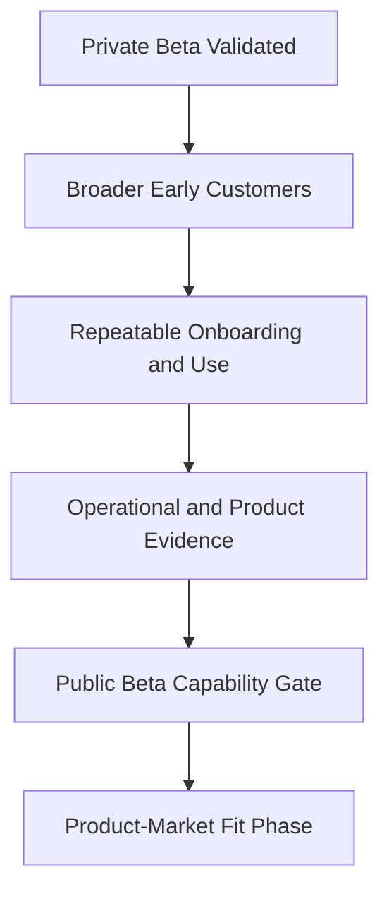

# Public Beta

## Derived From

- Canon Version: `v1.0.0`
- Architecture Version: `v1.0.0`
- Implementation Version: `v1.0.0`
- Product Version: `v1.0.0`
- Research Version: `v1.0.0`
- Strategy Version: `v1.0.0`
- Roadmap Philosophy Version: `v1.0.0`
- Private Beta Roadmap Version: `v1.0.0`

### Primary Repository Sources

- [Canon](../canon/README.md)
- [Architecture](../architecture/README.md)
- [Implementation](../implementation/README.md)
- [Product](../product/README.md)
- [Research](../research/README.md)
- [Strategy](../strategy/README.md)
- [Roadmap](./README.md)
- [Roadmap Philosophy](./00_ROADMAP_PHILOSOPHY.md)
- [Private Beta](./03_PRIVATE_BETA.md)

### Primary Supporting Documents

- [MVP Scope](../implementation/12_MVP_SCOPE.md)
- [Implementation Architecture](../implementation/13_IMPLEMENTATION_ARCHITECTURE.md)
- [Technology Decisions](../implementation/14_TECHNOLOGY_DECISIONS.md)
- [API Architecture](../implementation/15_API_ARCHITECTURE.md)
- [Storage Architecture](../implementation/16_STORAGE_ARCHITECTURE.md)
- [Security Architecture](../implementation/18_SECURITY_ARCHITECTURE.md)
- [Product Strategy](../product/01_PRODUCT_STRATEGY.md)
- [Product Requirements](../product/02_PRODUCT_REQUIREMENTS.md)
- [MVP Features](../product/09_MVP_FEATURES.md)
- [Product Metrics](../product/10_PRODUCT_METRICS.md)
- [Product Governance](../product/11_PRODUCT_GOVERNANCE.md)
- [Product Lifecycle](../product/14_PRODUCT_LIFECYCLE.md)
- [Experiments](../research/09_EXPERIMENTS.md)
- [Go-to-Market Strategy](../strategy/03_GO_TO_MARKET.md)
- [Pricing Strategy](../strategy/04_PRICING_STRATEGY.md)
- [Business Model](../strategy/05_BUSINESS_MODEL.md)

---

Status: **Active**

## Primary Question

Can the Organizational Intelligence Platform support a broader set of early customers with repeatable onboarding, reliable workflows, measurable value, and acceptable operational risk?

This document defines the Public Beta phase of the roadmap for the Organizational Intelligence Platform.

It is not a full commercial launch. It is not Product-Market Fit. It is the first controlled broader release in which the company tests repeatability, operational readiness, supportability, and wider customer onboarding while preserving trust and learning discipline.

## 1. Executive Summary

Public Beta is the transition from selected design partner validation to controlled broader adoption.

Private Beta asks:

> Can high-fit design partners reach value?

Public Beta asks:

> Can the company repeat that value across more customers without breaking trust, product quality, or operational discipline?

The purpose of Public Beta is not to maximize growth.

The purpose is to determine whether the company can move beyond highly selective, founder-intensive customer validation into a broader but still controlled early customer program. This requires repeatable onboarding, more reliable product operation, clearer documentation, stronger security posture, improved metrics, and support processes that do not collapse under modest scale.

Public Beta succeeds when the company can repeatedly help early customers reach Organizational Intelligence value while preserving the Knowledge Flywheel, Human Review, Governance, and trust boundaries that define the platform.

## 2. Purpose of Public Beta

Public Beta exists to validate repeatability.

The company should test whether:

- onboarding can be repeated;
- workflows work across different customers;
- product value is understandable;
- support demands are manageable;
- metrics are reliable;
- pricing assumptions can be tested;
- the product is stable enough for broader Product-Market Fit validation.

Private Beta establishes that value can be created under controlled, design-partner conditions.

Public Beta establishes whether that value can be reproduced across a broader early-customer cohort without reverting to bespoke founder labor, unstable operations, or category confusion.

## 3. Relationship to Private Beta

Public Beta builds directly on Private Beta.

Private Beta validates the product with selected design partners under closely managed conditions.

Public Beta validates whether those learnings are repeatable across a larger early-customer group with greater workflow variation and less bespoke operational support.

| Private Beta Validates | Public Beta Validates |
| --- | --- |
| Design partner fit | Broader early customer repeatability |
| Handheld onboarding | Repeatable onboarding |
| Initial customer workflows | Multiple customer variations |
| Early memory reuse | Repeatable value signals |
| Qualitative learning | Quantitative and qualitative validation |
| Founder-heavy support | Operational support process |

Public Beta therefore depends on Private Beta, but it asks a different question. It is not whether selected customers can succeed. It is whether the company can help more customers succeed in a controlled, repeatable way.

## 4. Current State Entering Public Beta

The expected state before Public Beta begins is:

- selected design partners have used the platform;
- core workflows have been validated;
- an onboarding playbook exists;
- major product friction is known;
- early metrics exist;
- the Ideal Customer Profile has been refined;
- the platform is still early and controlled;
- operational maturity is incomplete.

This means the company should enter Public Beta with stronger product clarity than in earlier phases, but still with significant uncertainty around repeatability, support load, pricing interpretation, and broader operational readiness.

## 5. Target State After Public Beta

By the end of Public Beta:

- a broader early customer cohort has used the platform;
- onboarding is repeatable;
- a customer success process is defined;
- product reliability is acceptable for early customers;
- security and privacy controls meet early buyer expectations;
- usage metrics are consistent;
- pricing assumptions have early evidence;
- support burden is understood;
- Product-Market Fit readiness is assessed.

This target state does not imply that the company has reached Product-Market Fit.

It implies that the company has established the customer, operational, product, and measurement foundations necessary to pursue Product-Market Fit responsibly.

## 6. Public Beta Customer Scope

Public Beta should remain selective even as it becomes broader than Private Beta.

The customer cohort should include organizations that demonstrate:

- strong or moderate ICP fit;
- Customer Support beachhead alignment;
- willingness to provide feedback;
- acceptance of beta limitations;
- available support data;
- willingness to use Human Review;
- clear operational pain.

Public Beta should still exclude customers who would distort learning or demand maturity the product has not yet earned.

### Customers Who Should Still Be Excluded

- customers needing full enterprise guarantees;
- customers needing heavy customization;
- customers unwilling to review AI output;
- customers seeking only autonomous deflection;
- customers with no measurable support workflow.

Public Beta should widen learning without abandoning fit discipline.

## 7. Public Beta Capability Themes

Public Beta should be organized around repeatable customer and operational capabilities rather than raw feature expansion.

## 7.1 Repeatable Onboarding

Public Beta must validate onboarding repeatability.

The company should no longer rely on fully bespoke founder-led setup for every customer. It must determine whether a structured onboarding path can consistently lead customers to first value.

### Success Criteria

- onboarding steps are documented;
- customers can reach first value without bespoke founder work;
- setup time is measurable;
- common blockers are known.

## 7.2 Product Reliability

The system must operate reliably enough for early customers.

Public Beta does not require enterprise-grade reliability, but it does require a level of stability that allows customers to use core workflows without constant breakdown or uncertainty.

### Success Criteria

- core workflows are stable;
- major errors are tracked;
- downtime or failure modes are visible;
- data loss is unacceptable;
- recovery procedures exist at an early level.

## 7.3 Multi-Customer Readiness

Public Beta should validate that the product can support multiple organizations without confusion.

This is the first phase where multi-customer product behavior must hold up beyond a small number of heavily managed accounts.

### Success Criteria

- organization boundaries are respected;
- customer data separation assumptions hold;
- user roles remain understandable;
- admin workflows support multiple customers.

## 7.4 Knowledge Workflow Repeatability

The Knowledge Candidate to Organizational Memory flow must work across multiple customers.

This is central because Public Beta must show that the platform's defining value is not unique to one or two carefully managed accounts. The same learning loop should remain operable across different teams and contexts inside the beachhead.

### Success Criteria

- customers can create candidates;
- reviewers can evaluate them;
- validated knowledge can be promoted;
- memory can be reused;
- lifecycle metrics can be compared.

## 7.5 Documentation and Customer Education

Public Beta requires stronger guidance than earlier phases.

Customer understanding should no longer depend primarily on live founder explanation.

Public Beta should therefore strengthen:

- onboarding documentation;
- user guides;
- reviewer guides;
- admin instructions;
- explanation of Knowledge Candidates;
- explanation of Human Review;
- explanation of Organizational Memory.

### Success Criteria

- customers can understand core concepts without live founder explanation every time.

## 7.6 Operational Support

Public Beta must define an early support capability.

The company needs enough operational discipline to respond to customer issues consistently, learn from them, and feed the resulting evidence back into product and roadmap decisions.

### Success Criteria

- a support channel exists;
- bugs are tracked;
- customer issues are categorized;
- response expectations are clear;
- support learning feeds the product roadmap.

## 7.7 Security and Privacy Hardening

Public Beta must raise the trust baseline.

The company is still early, but early customers will evaluate whether the platform treats access, data handling, and AI-related trust with adequate seriousness.

### Success Criteria

- access control is reviewed;
- sensitive data handling is documented;
- audit-relevant actions are logged;
- AI data handling expectations are documented;
- known security risks are tracked.

## 7.8 Metrics and Analytics

Public Beta must improve measurement quality.

The company needs metrics that can support customer learning, product judgment, GTM evaluation, and PMF preparation.

Important Public Beta metrics include:

- activation;
- onboarding completion;
- Knowledge Candidates Created;
- Validation Rate;
- Promotion Rate;
- Review Participation;
- Reuse Events;
- Time to First Organizational Value;
- customer-reported value;
- support burden;
- retention intent.

### Success Criteria

- lifecycle and onboarding metrics are captured reliably;
- metrics support customer and product learning rather than vanity reporting;
- data quality is sufficient to compare customers and identify repeatability patterns.

## 7.9 Pricing and Packaging Signals

Public Beta may begin testing pricing assumptions.

It should not define final prices. It should produce evidence about how customers understand value, what pricing objections recur, and whether pricing logic remains aligned with the company's category position.

### Success Criteria

- customers understand value drivers;
- willingness-to-pay conversations occur;
- pricing objections are captured;
- pricing remains aligned with organizational capability rather than AI consumption.

## 8. Public Beta Validation Questions

Public Beta should answer a defined set of operating questions.

| Validation Question | Why It Matters |
| --- | --- |
| Can onboarding be repeated? | Public Beta fails if every customer still requires bespoke founder setup. |
| Does the platform work across multiple customers? | The company must test whether value generalizes beyond design partners. |
| Do customers understand OIP without deep founder explanation? | Category comprehension is necessary for repeatable adoption. |
| Which capabilities are essential for Product-Market Fit? | The company must distinguish foundational PMF drivers from useful but non-essential requests. |
| Which workflows are still confusing? | Confusion will limit activation, reuse, and trust. |
| Does Human Review remain acceptable? | If review becomes burdensome, the product may lose its trust model or adoption path. |
| Does Organizational Memory produce visible value? | Memory must become practically useful, not only conceptually correct. |
| What support burden does the product create? | Operational cost and process discipline must become legible before broader growth. |
| What security concerns appear repeatedly? | Trust blockers must be surfaced before PMF efforts intensify. |
| What pricing model feels reasonable? | Commercial readiness depends on customer understanding of value and willingness to pay. |

## 9. Success Metrics

Public Beta success should be measured through repeatability and readiness metrics.

| Metric | Why It Matters |
| --- | --- |
| Activation Rate | Shows onboarding repeatability. |
| Time to First Organizational Value | Shows value speed. |
| Knowledge Candidate Volume | Shows intake works. |
| Validation Rate | Shows candidate quality. |
| Knowledge Reuse Rate | Shows memory usefulness. |
| Support Tickets per Customer | Shows operational burden. |
| Retention Intent | Shows Product-Market Fit direction. |
| Pricing Feedback | Shows commercial readiness. |

These metrics should be interpreted together. Public Beta is not successful because usage is high alone. It is successful when early customers reach value repeatedly and the company can explain how that value is created, supported, measured, and potentially monetized.

## 10. Capability Gate to Product-Market Fit Phase

Public Beta may move into Product-Market Fit roadmap work only when:

- onboarding is repeatable;
- multiple customers reach first value;
- core workflows are stable;
- Human Review remains accepted;
- customers reuse validated knowledge;
- metrics are reliable enough;
- support burden is manageable;
- pricing assumptions have evidence;
- ICP is clearer;
- no major trust or security blocker prevents continued adoption.

Passing this gate means the company has established a controlled, repeatable early-customer program strong enough to support serious Product-Market Fit work.

## 11. Deliverables

Public Beta should produce the following tangible outputs:

- Public Beta onboarding playbook;
- customer education materials;
- beta support process;
- reliability review;
- security and privacy readiness notes;
- pricing feedback report;
- beta metrics dashboard;
- PMF readiness assessment;
- roadmap updates based on learning.

These deliverables preserve customer and operational learning rather than treating the phase as only a distribution event.

## 12. Risks

Public Beta carries several important risks.

| Risk | Why It Matters |
| --- | --- |
| Premature public launch | The company may expand faster than trust, support, or product quality can sustain. |
| Onboarding does not scale | Customer adoption may remain founder-dependent. |
| Support burden overwhelms the founder | Operational load may distort roadmap and slow product learning. |
| Customers misunderstand the category | The product may be judged as a chatbot, support tool, or automation layer rather than an OIP. |
| AI trust concerns block adoption | Customers may reject the workflow before value is realized. |
| Metrics are noisy | The company may misread readiness and PMF direction. |
| Poor-fit customers distort roadmap | Product learning may drift away from the intended ICP. |
| Pricing discussions happen before value is clear | Commercial feedback may become misleading or prematurely negative. |
| Public Beta becomes uncontrolled growth | The company may lose the discipline that makes learning and trust possible. |

These risks should be managed through controlled expansion, not through avoiding learning altogether.

## 13. Exit Criteria

Public Beta should not be considered complete until its exit criteria are satisfied explicitly.

| Exit Criterion | Required Evidence |
| --- | --- |
| Repeatable onboarding exists | Multiple customers can reach first value through a documented onboarding motion. |
| Multi-customer product behavior is stable | Customer boundaries, workflows, and support assumptions hold across the broader cohort. |
| Knowledge workflow is repeatable | Candidate creation, review, validation, promotion, and reuse work across customers. |
| Human Review remains operationally acceptable | Review participation continues without collapsing trust or workflow adoption. |
| Operational support is manageable | Support burden, issue triage, and response expectations are understood and sustainable at Public Beta scale. |
| Metrics are reliable enough for product and GTM judgment | Activation, value, review, reuse, and support signals can be trusted directionally. |
| Security and privacy baseline is credible | Repeated buyer concerns are understood and no major trust blocker remains unresolved. |
| Pricing and packaging learning exists | Customers reveal understandable value drivers, objections, and willingness-to-pay signals. |
| Product-Market Fit work is now responsible | The company can explain why broader PMF validation is the next correct stage. |

If these criteria are not satisfied, the company should continue Public Beta or narrow its scope rather than claiming Product-Market Fit readiness prematurely.

## 14. Relationship to Product-Market Fit

Public Beta does not prove Product-Market Fit.

It creates the repeatable customer, product, support, and measurement foundation needed to pursue Product-Market Fit seriously.

The distinction is important:

| Public Beta | Product-Market Fit Phase |
| --- | --- |
| Tests repeatability across broader early customers | Tests whether a strong segment pulls the product repeatedly |
| Establishes operational discipline | Evaluates durable demand, retention, expansion, and advocacy |
| Strengthens metrics and onboarding | Uses those systems to judge PMF evidence credibly |
| Validates controlled broader adoption | Validates whether the market is truly pulling the product |

Public Beta is therefore the preparation phase for responsible PMF work, not the proof of PMF itself.

## 15. Traceability Matrix

Public Beta derives from the repository's existing layers and from the earlier roadmap phases.

| Source | Public Beta Derivation |
| --- | --- |
| [Canon](../canon/README.md) | Defines Organizational Intelligence, Human Review, Governance, Organizational Memory, and trust boundaries that must remain intact during broader adoption. |
| [Architecture](../architecture/README.md) | Defines the product's structural boundaries, identity separation, data responsibility, and integration discipline required for multi-customer operation. |
| [Implementation](../implementation/README.md) | Defines the current concrete realization, reliability assumptions, security posture, and technical direction that Public Beta must strengthen. |
| [Product](../product/README.md) | Defines enduring capabilities, customer value, metrics, governance, and lifecycle expectations that Public Beta must make repeatable. |
| [Research](../research/README.md) | Defines the evidence discipline and experimental posture by which Public Beta signals should be interpreted. |
| [Strategy](../strategy/README.md) | Defines beachhead selection, ICP logic, GTM sequencing, pricing philosophy, and long-term category ambition. |
| [Roadmap Philosophy](./00_ROADMAP_PHILOSOPHY.md) | Defines capability gates, evidence-driven progress, validation before expansion, and roadmap interpretation rules for this phase. |
| [Private Beta](./03_PRIVATE_BETA.md) | Defines the selected design-partner stage whose validated learnings Public Beta must make repeatable across a broader cohort. |
| [Go-to-Market Strategy](../strategy/03_GO_TO_MARKET.md) | Defines design partner sequencing, category education, PMF path, and the need for repeatable adoption before broader scaling. |
| [Pricing Strategy](../strategy/04_PRICING_STRATEGY.md) | Defines pricing as organizational capability value rather than AI consumption and provides the basis for early pricing signal testing. |
| [Business Model](../strategy/05_BUSINESS_MODEL.md) | Defines value creation, value capture, retention logic, expansion logic, and why repeatable customer learning matters economically. |

## 16. What This Document Does NOT Define

This document intentionally does not define:

- full commercial launch;
- enterprise-scale commitments;
- global expansion;
- final pricing;
- mature customer success organization;
- category leadership;
- complete partner ecosystem.

Those belong to later phases or other repository layers.

This document defines only what Public Beta must prove before the company can responsibly enter Product-Market Fit validation work.

## 17. Closing

Public Beta succeeds when the company can repeatedly help early customers reach organizational learning value without breaking trust, quality, or operational discipline.

That is the purpose of the phase.
