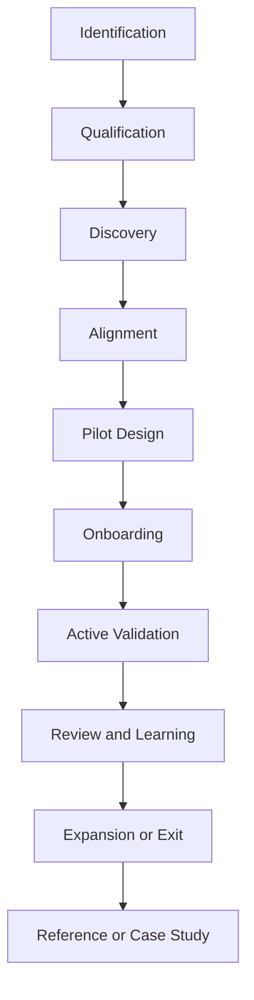
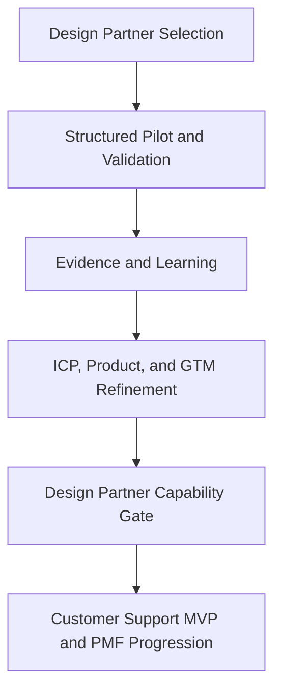

# Design Partners

## Derived From

- Canon Version: `v1.0.0`
- Architecture Version: `v1.0.0`
- Implementation Version: `v1.0.0`
- Product Version: `v1.0.0`
- Research Version: `v1.0.0`
- Strategy Version: `v1.0.0`
- Roadmap Philosophy Version: `v1.0.0`

### Primary Repository Sources

- [Canon](../canon/README.md)
- [Architecture](../architecture/README.md)
- [Implementation](../implementation/README.md)
- [Product](../product/README.md)
- [Research](../research/README.md)
- [Strategy](../strategy/README.md)
- [Roadmap](./README.md)
- [Roadmap Philosophy](./00_ROADMAP_PHILOSOPHY.md)

### Primary Supporting Documents

- [Product Strategy](../product/01_PRODUCT_STRATEGY.md)
- [Product Metrics](../product/10_PRODUCT_METRICS.md)
- [Product Governance](../product/11_PRODUCT_GOVERNANCE.md)
- [Ideal Customer Profile](../strategy/02_IDEAL_CUSTOMER_PROFILE.md)
- [Go-to-Market Strategy](../strategy/03_GO_TO_MARKET.md)
- [Pricing Strategy](../strategy/04_PRICING_STRATEGY.md)
- [Customer Discovery](../research/02_CUSTOMER_DISCOVERY.md)
- [Experiments](../research/09_EXPERIMENTS.md)
- [Research Backlog](../research/10_RESEARCH_BACKLOG.md)
- [Prototype](./01_PROTOTYPE.md)
- [Alpha](./02_ALPHA.md)
- [Private Beta](./03_PRIVATE_BETA.md)
- [Public Beta](./04_PUBLIC_BETA.md)

---

Status: **Active**

## Primary Question

How should the company work with early design partners to validate the Organizational Intelligence Platform category, prove customer value, and improve the product without drifting away from the Canon?

This document defines the roadmap and operating model for building, managing, learning from, and graduating Design Partner relationships.

It is not a sales script, legal agreement, or customer contract template. It defines how Design Partners should function as structured learning partnerships.

## 1. Executive Summary

Design Partners are the bridge between product theory and market reality.

They help the company validate whether real organizations:

- experience Organizational Entropy as a meaningful problem;
- understand the Organizational Intelligence Platform category;
- trust the Human Review model;
- receive measurable value from governed Organizational Memory.

Design Partners are not ordinary customers.

They are early collaborators who help validate the category, the Customer Support beachhead, the Knowledge Flywheel, onboarding assumptions, trust requirements, workflow design, adoption barriers, and early value metrics.

The purpose of the Design Partner roadmap is not to maximize early revenue. It is to generate disciplined evidence that reduces uncertainty before broader scaling.

## 2. Purpose of Design Partners

Design Partners exist to:

- validate the Customer Support beachhead;
- test the Knowledge Flywheel in real workflows;
- reveal customer language;
- validate ICP assumptions;
- expose onboarding and integration friction;
- test review workflows;
- generate early metrics;
- create reference potential;
- reduce uncertainty before scaling.

The company should therefore treat Design Partners as structured learning partnerships rather than as ordinary early deals. A successful Design Partner program improves product judgment, GTM clarity, research confidence, and roadmap quality.

## 3. Relationship to Roadmap Phases

Design Partners support multiple roadmap phases, but their role changes over time.

| Roadmap Phase | Role of Design Partners |
| --- | --- |
| Private Beta | Primary validation participants |
| Public Beta | Early references and workflow proof |
| PMF | Evidence base for repeatable value |
| Customer Support MVP | Domain proof |
| Knowledge Flywheel | Real-world validation source |

Design Partners are therefore not isolated from the roadmap. They are one of the primary mechanisms by which the company validates whether the roadmap should advance at all.

## 4. Design Partner Philosophy

The Design Partner program should follow a small number of operating principles.

## Learning Before Revenue

Early revenue matters, but early learning matters more. A high-paying design partner that produces weak evidence can be less valuable than a smaller partner that reveals real workflow truth.

## Fit Before Logos

The company should prefer high-fit partners over recognizable brands that distort product direction. Logo value without learning value weakens the program.

## Trust Before Automation

Design Partners should validate the platform's trust model, not pressure the company into abandoning it. Human Review, evidence, and governed memory remain central.

## Evidence Before Belief

Claims about value, adoption, workflow fit, pricing, and category understanding should be supported by evidence from real partner behavior rather than enthusiasm alone.

## Partnership Before Procurement

Design Partners should work with the company to validate workflows, metrics, and adoption patterns. The relationship should be collaborative rather than transactional.

## Focus Before Expansion

The company should keep the program focused on the Customer Support beachhead and a narrow set of high-value learning goals before broadening scope.

## Canon Alignment Before Customization

Customer feedback should improve the product without redefining Canon concepts or collapsing governance boundaries.

## Mutual Value Before Extraction

The company should help Design Partners reach value, and Design Partners should help the company learn. The relationship should create benefit on both sides.

## 5. Ideal Design Partner Profile

The Ideal Design Partner Profile should derive directly from the Ideal Customer Profile.

Strong Design Partners should generally be:

- Indonesia-first where possible;
- mid-market to lower-enterprise B2B organizations;
- high-volume Customer Support teams;
- support or service teams with repeated questions;
- organizations with historical tickets, chats, documents, or case notes;
- teams with human reviewers or escalation experts;
- leadership interested in AI but concerned about trust;
- willing to give structured feedback;
- able to measure support outcomes;
- potential future references.

These organizations are valuable not only because they may become customers, but because they can help prove whether Organizational Intelligence creates real, governed, measurable operational value.

## 6. Anti-Design Partner Profile

Some organizations should be excluded even if they appear commercially attractive.

Important disqualifiers include:

- wants full automation without review;
- no historical data;
- no support volume;
- no executive sponsor;
- no operational champion;
- no willingness to provide feedback;
- wants bespoke custom software;
- is too heavily regulated for current maturity;
- only wants ticket deflection;
- does not recognize knowledge or learning pain.

These organizations are likely to create noise rather than learning. The Design Partner program should protect the product from poor-fit pressure.

## 7. Design Partner Selection Scorecard

Partner selection should use a structured scoring framework.

Score each criterion from `1` to `5`.

| Criterion | 1 | 3 | 5 |
| --- | --- | --- | --- |
| ICP Fit | Weak match to the ICP. | Moderate match. | Strong direct ICP match. |
| Support Volume | Low repetition and limited support activity. | Moderate recurring support volume. | High recurring support volume with visible repeated work. |
| Knowledge Complexity | Simple, low-context answers. | Some context and policy complexity. | High knowledge complexity requiring evidence and expert judgment. |
| Review Capacity | No review culture or expert availability. | Informal review exists. | Strong reviewer or escalation capacity. |
| Data Availability | Sparse or inaccessible historical data. | Some usable support artifacts. | Rich tickets, chats, docs, and case history available. |
| Leadership Urgency | Weak urgency. | Moderate urgency. | Strong executive urgency around support quality, AI, or knowledge loss. |
| AI Readiness | No meaningful readiness or trust model. | Exploring AI cautiously. | Clear AI interest with trust concerns that match the platform. |
| Documentation Pain | Little recognized pain. | Some maintenance and reuse pain. | Clear documentation decay and knowledge reuse pain. |
| Reference Potential | Unlikely reference. | Possible reference. | Strong future reference potential. |
| Implementation Feasibility | High complexity or high delivery risk. | Moderate feasibility. | Feasible within current product maturity. |
| Indonesia-First Strategic Fit | Weak market fit. | Partial fit. | Strong Indonesia-first strategic relevance. |
| Willingness to Collaborate | Transactional or passive. | Some collaboration willingness. | Strong structured feedback and partnership willingness. |

## Score Interpretation

| Total Range | Assessment |
| --- | --- |
| 12-24 | Weak fit |
| 25-36 | Moderate fit |
| 37-48 | Strong fit |
| 49-60 | Excellent fit |

The scorecard should guide judgment, not replace it. A moderate-fit partner may still be valuable if it answers a critical strategic question, but the deviation should be explicit.

## 8. Design Partner Lifecycle

Design Partner relationships should move through a governed lifecycle.

1. Identification
2. Qualification
3. Discovery
4. Alignment
5. Pilot Design
6. Onboarding
7. Active Validation
8. Review and Learning
9. Expansion or Exit
10. Reference or Case Study

Each stage should have explicit intent. The company should know what must be learned before advancing the relationship.

## 9. Mutual Responsibilities

Design Partner work should define mutual accountability clearly.

| Company Responsibilities | Design Partner Responsibilities |
| --- | --- |
| Define pilot goals | Provide workflow access |
| Protect data | Provide feedback |
| Support onboarding | Identify reviewers |
| Measure outcomes | Participate in review |
| Improve product | Share honest friction |
| Preserve learning | Evaluate category fit |

The relationship should be collaborative. Neither side should assume value without active participation.

## 10. Design Partner Pilot Structure

Design Partner pilots should be structured intentionally.

Each pilot should define:

- pilot objective;
- scope;
- target workflows;
- data sources;
- reviewer roles;
- success metrics;
- feedback cadence;
- security and data boundaries;
- timebox where appropriate;
- exit decision.

The pilot should not attempt to prove everything. It should focus on the most important learning questions and operational workflows that can produce meaningful evidence.

## 11. Learning Objectives

Design Partner work should answer specific questions.

| Learning Objective | Why It Matters |
| --- | --- |
| Do customers recognize Organizational Entropy? | Category validation depends on real problem recognition. |
| Does Customer Support remain the right beachhead? | The company's initial focus must remain evidence-backed. |
| Do users understand Knowledge Candidates? | Workflow clarity depends on conceptual clarity. |
| Can real support work produce useful candidates? | The Knowledge Flywheel must begin from real operational work. |
| Can reviewers validate AI-assisted outputs? | Trust depends on workable Human Review. |
| Does Organizational Memory improve future work? | The platform's value depends on reuse and learning. |
| What integrations matter most? | Product and roadmap focus depend on real workflow needs. |
| What metrics matter to buyers? | PMF and GTM clarity require buyer-relevant evidence. |
| What creates trust? | Trust is a product, GTM, and adoption requirement. |
| What blocks adoption? | Friction must be surfaced before broader scaling. |
| What pricing logic resonates? | Early commercial learning should be grounded in real value perception. |

## 12. Feedback Cadence

Design Partner work should run on a disciplined feedback rhythm.

Recommended cadence:

- weekly operational feedback;
- biweekly product synthesis;
- monthly executive review;
- end-of-pilot review;
- internal repository update after each major learning cycle.

This cadence ensures that partner learning becomes organizational memory rather than isolated conversation.

## 13. Evidence Collection

Design Partner relationships should produce structured evidence.

Important evidence types include:

- interview notes;
- workflow observations;
- support data patterns;
- candidate review outcomes;
- validation metrics;
- reuse metrics;
- onboarding friction;
- objections;
- buyer language;
- quotes;
- product usage;
- executive feedback.

Evidence should always be separated from interpretation.

What a customer said, what happened in the workflow, and what the company believes it means are related but distinct artifacts. Preserving that distinction protects research quality and product judgment.

## 14. Design Partner Metrics

Design Partner relationships should be measured through capability and learning metrics.

| Metric | Why It Matters |
| --- | --- |
| Time to First Organizational Value | Shows how quickly the partner experiences meaningful value. |
| Knowledge Candidates Created | Shows whether real work is producing candidate knowledge. |
| Candidate Validation Rate | Shows whether candidates are useful and governable. |
| Promotion Rate | Shows whether validated learning becomes memory. |
| Rejection or Correction Rate | Shows review quality and trust calibration. |
| Reviewer Participation | Shows whether Human Review fits real operations. |
| Knowledge Reuse Rate | Shows whether memory improves future work. |
| Expert Dependency Signals | Shows whether expertise is becoming institutional rather than trapped. |
| Onboarding Friction | Shows what blocks value realization. |
| Customer Confidence | Shows whether trust is increasing. |
| Expansion Interest | Shows whether value feels durable and extensible. |
| Reference Readiness | Shows whether the relationship is becoming externally credible. |

These metrics should be interpreted as learning signals first and commercial signals second.

## 15. Governance

Design Partner work should be governed explicitly.

Important governance areas include:

- data boundaries;
- confidentiality;
- review responsibilities;
- repository updates;
- customer-specific customization control;
- decision ownership;
- product governance alignment.

Design Partner learning should feed Product Governance, Research, GTM, and Roadmap decisions. It should not bypass them.

## 16. Customization Boundaries

Learning from customers is good.

Uncontrolled customization is dangerous.

| Acceptable Adaptation | Dangerous Customization |
| --- | --- |
| Adjusting workflow language | Building one-off systems |
| Learning from domain terms | Redefining Canon concepts |
| Configuring workspace settings | Hardcoding customer-specific logic |
| Supporting priority integrations | Abandoning product architecture |

The company should honor real customer problems while protecting Canon alignment, product coherence, and long-term platform integrity.

## 17. Design Partner Exit Paths

Not every Design Partner relationship should end the same way.

Possible outcomes include:

- convert to paying customer;
- continue pilot;
- expand scope;
- pause;
- exit as poor fit;
- become reference;
- generate follow-up research.

Exit should be treated as a learning outcome, not automatically as failure. A poor-fit exit can protect the roadmap and sharpen the ICP.

## 18. Capability Gate to Customer Support MVP / PMF

The Design Partner roadmap succeeds when:

- several high-fit partners validate real pain;
- the platform produces useful Knowledge Candidates;
- reviewers participate;
- validated knowledge is promoted;
- memory is reused;
- customers understand value;
- the ICP is sharpened;
- onboarding and support patterns are repeatable;
- evidence supports continuing toward Product-Market Fit.

The gate is not crossed because several companies expressed interest. It is crossed when partner evidence supports the company's next strategic step responsibly.

## 19. Risks

The Design Partner program carries meaningful risks.

| Risk | Why It Matters |
| --- | --- |
| Choosing partners for logo value instead of learning value | Weakens evidence quality and distorts roadmap judgment. |
| Over-customization | Pulls the product away from platform coherence. |
| Weak executive sponsorship | Reduces adoption seriousness and learning quality. |
| No review capacity | Undermines Human Review validation. |
| Poor data quality | Weakens workflow, candidate, and value validation. |
| Mistaking interest for commitment | Creates false confidence about demand. |
| Treating pilot as sales instead of research | Damages learning discipline. |
| Allowing one partner to distort the roadmap | Weakens ICP discipline and product integrity. |
| Failing to preserve learning | Causes the same mistakes and questions to repeat later. |

These risks should be mitigated through governance, documentation, scorecards, and explicit learning objectives.

## 20. Deliverables

The Design Partner roadmap should produce the following reusable outputs:

- design partner qualification template;
- design partner scorecard;
- pilot plan template;
- feedback report;
- customer learning summary;
- workflow validation map;
- metric baseline;
- repository update list;
- PMF evidence contribution.

These deliverables are important because the Design Partner program should itself become Organizational Memory for the company.

## 21. Traceability Matrix

Design Partner work should remain traceable to the broader repository.

| Source | Design Partner Contribution |
| --- | --- |
| [Canon](../canon/README.md) | Protects the trust, governance, Human Review, and Organizational Memory principles that partners help validate. |
| [Product](../product/README.md) | Defines the workflows, capabilities, metrics, and governance Design Partners test in real use. |
| [Research](../research/README.md) | Provides the evidence discipline, Customer Discovery method, Experiments method, and Research Backlog context for Design Partner learning. |
| [Strategy](../strategy/README.md) | Defines the beachhead, ICP, GTM sequencing, pricing philosophy, and long-term expansion logic that partners help validate. |
| [Ideal Customer Profile](../strategy/02_IDEAL_CUSTOMER_PROFILE.md) | Defines the target partner characteristics and disqualifiers. |
| [Customer Discovery](../research/02_CUSTOMER_DISCOVERY.md) | Defines how partner conversations and workflow learning should be gathered and interpreted. |
| [Experiments](../research/09_EXPERIMENTS.md) | Defines how partner pilots should be structured as evidence-producing experiments. |
| [Go-to-Market Strategy](../strategy/03_GO_TO_MARKET.md) | Defines Design Partners as the early GTM vehicle before repeatable sales. |
| [Product Metrics](../product/10_PRODUCT_METRICS.md) | Defines the learning, review, memory, reuse, and outcome signals partner pilots should measure. |
| [Product Governance](../product/11_PRODUCT_GOVERNANCE.md) | Defines how partner learning should influence product evolution without compromising long-term coherence. |
| [Roadmap Philosophy](./00_ROADMAP_PHILOSOPHY.md) | Defines validation before expansion, evidence-driven progression, and capability-gated advancement. |

## 22. What This Document Does NOT Define

This document intentionally does not define:

- legal contract terms;
- final pricing;
- sales scripts;
- mass onboarding;
- partner program;
- customer success department structure;
- full enterprise implementation.

Those belong to later phases or other repository layers.

This document defines only how Design Partners should help the company learn responsibly before scaling.

## 23. Closing

Design Partners are how the company learns responsibly before scaling.

Design Partner success means the company has stronger evidence that the Organizational Intelligence Platform can make real organizations more capable through governed learning.

That is the purpose of the program.
