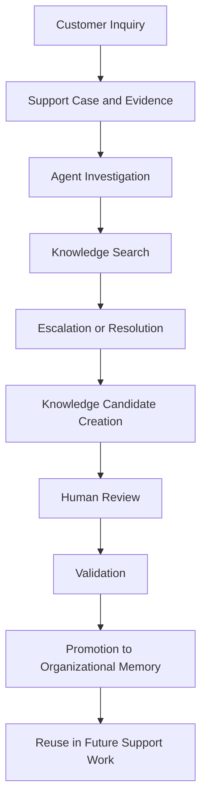
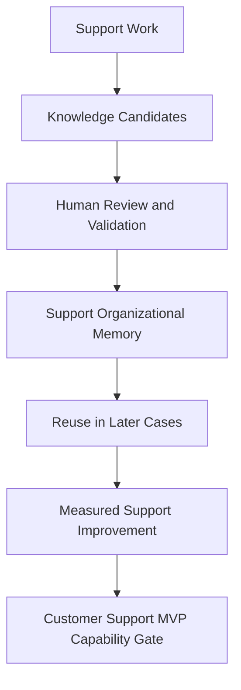

# Customer Support MVP

## Derived From

- Canon Version: `v1.0.0`
- Architecture Version: `v1.0.0`
- Implementation Version: `v1.0.0`
- Product Version: `v1.0.0`
- Research Version: `v1.0.0`
- Strategy Version: `v1.0.0`
- Roadmap Philosophy Version: `v1.0.0`

### Primary Repository Sources

- [Canon](../canon/README.md)
- [Architecture](../architecture/README.md)
- [Implementation](../implementation/README.md)
- [Product](../product/README.md)
- [Research](../research/README.md)
- [Strategy](../strategy/README.md)
- [Roadmap](./README.md)
- [Roadmap Philosophy](./00_ROADMAP_PHILOSOPHY.md)

### Primary Supporting Documents

- [Product Workflow Model](../canon/05_PRODUCT_WORKFLOW_MODEL.md)
- [AI Cognitive Model](../canon/06_AI_COGNITIVE_MODEL.md)
- [MVP Scope](../implementation/12_MVP_SCOPE.md)
- [Implementation Architecture](../implementation/13_IMPLEMENTATION_ARCHITECTURE.md)
- [Data Architecture](../architecture/09_DATA_ARCHITECTURE.md)
- [Knowledge Representation Model](../architecture/10_KNOWLEDGE_REPRESENTATION_MODEL.md)
- [Product Metrics](../product/10_PRODUCT_METRICS.md)
- [Product Governance](../product/11_PRODUCT_GOVERNANCE.md)
- [Customer Discovery](../research/02_CUSTOMER_DISCOVERY.md)
- [Support Industry Research](../research/03_SUPPORT_INDUSTRY_RESEARCH.md)
- [Experiments](../research/09_EXPERIMENTS.md)
- [Ideal Customer Profile](../strategy/02_IDEAL_CUSTOMER_PROFILE.md)
- [Go-to-Market Strategy](../strategy/03_GO_TO_MARKET.md)
- [Design Partners](./05_DESIGN_PARTNERS.md)
- [Knowledge Flywheel](./07_KNOWLEDGE_FLYWHEEL.md)

---

Status: **Active**

## Primary Question

What must the Customer Support MVP demonstrate before the company can claim that the beachhead domain is validated?

This document defines the Customer Support MVP roadmap for the Organizational Intelligence Platform.

It defines the first complete domain-specific expression of the platform. It does not turn the product into a help desk, ticketing system, chatbot, or CRM.

The Customer Support MVP succeeds only if support work can become governed Organizational Memory and that memory measurably improves future support work.

## 1. Executive Summary

Customer Support is the first domain because it concentrates the conditions required to validate Organizational Intelligence clearly:

- repetition;
- evidence;
- human review;
- measurable outcomes;
- organizational learning pain.

The Customer Support MVP should therefore prove one complete Knowledge Flywheel in one domain.

This phase is not about broad product scope. It is about validating that repeated support work can generate Knowledge Candidates, preserve evidence, pass Human Review, become Organizational Memory, and improve later support decisions.

If that cannot be demonstrated in Customer Support, the beachhead is not yet validated and broader Product-Market Fit claims are premature.

## 2. Purpose of the Customer Support MVP

The Customer Support MVP exists to prove the beachhead.

It should validate:

- support workflow fit;
- support data usefulness;
- Knowledge Candidate generation;
- Human Review by support experts;
- support-specific Organizational Memory;
- knowledge reuse;
- support quality improvement;
- measurable operational value.

The purpose of this phase is not to build every support capability customers may eventually request. It is to validate that Customer Support is the right first environment for the platform's governed learning model.

## 3. What Customer Support MVP Means

MVP in this context does not mean the smallest possible application.

It means the smallest complete Organizational Intelligence system for Customer Support.

That requires enough end-to-end capability to prove:

- operational work can be captured;
- evidence can be preserved;
- candidate learning can be created;
- support experts can review and validate;
- validated learning can become Organizational Memory;
- future work can reuse that memory;
- the outcome can be measured.

An incomplete tool that only captures tickets, drafts summaries, or stores documents would not satisfy this definition. The Customer Support MVP must include enough of the Knowledge Flywheel to prove the category in a real domain.

## 4. What This MVP Is Not

The Customer Support MVP should be interpreted carefully to avoid category drift.

| Comparison | Why It Is Incomplete |
| --- | --- |
| Help desk replacement | The platform complements ticketing systems by learning from support work; it does not attempt to become the primary system of record for ticket operations. |
| Chatbot | A chatbot may answer questions, but it does not by itself create governed Organizational Memory through evidence, review, and validation. |
| Deflection-only tool | Deflection may be one downstream outcome, but the platform's purpose is broader organizational learning and improved future work. |
| Knowledge base | A knowledge base stores articles; the platform governs how support work becomes evidence-backed, reviewed, validated memory. |
| Ticket automation | Automation may assist workflow steps, but automation alone does not establish trust, validation, or memory evolution. |
| AI support agent | AI may assist, summarize, and draft, but it does not hold organizational authority or directly define trusted knowledge. |
| CRM | CRM manages customer relationship records; this platform manages organizational learning from operational support work. |

These comparisons matter because each one captures a partial surface of the problem while missing the central thesis: governed memory that compounds support capability over time.

## 5. Relationship to Design Partners

Design Partners are the primary validation environment for the Customer Support MVP.

They provide:

- real workflows;
- real support data;
- reviewer feedback;
- operational context;
- validation evidence.

The Customer Support MVP should be tested with high-fit design partners before broader Product-Market Fit claims are made. This ensures that the MVP is validated against real support behavior rather than internal assumptions alone.

Design Partners should help determine:

- whether repeated support work naturally produces useful candidates;
- whether review fits real support operations;
- whether memory is reused in future cases;
- whether support leaders see credible operational value;
- whether the product remains distinct from ordinary support tooling.

## 6. Customer Support Workflow Scope

The Customer Support MVP should define a focused but complete workflow scope.

Included workflow areas are:

- customer inquiry;
- ticket or case evidence;
- agent investigation;
- knowledge search;
- escalation;
- resolution;
- review;
- Knowledge Candidate creation;
- validation;
- promotion to Organizational Memory;
- reuse in future support work.

This workflow scope is intentionally narrower than a full support platform. It includes only the areas necessary to prove that support work can become governed memory and improve later work.

## 7. Core MVP Capabilities

The Customer Support MVP should be organized by capability rather than by feature inventory.

### 7.1 Support Case Context

The platform must understand support work as evidence-bearing operational context.

### Success Criteria

- support case context can be captured;
- customer issue, agent notes, resolution, and relevant evidence are represented;
- support work is not reduced to a generic document.

### Why It Matters

If support work is flattened into generic text, the platform loses the structure required for reuse, review, and explainability.

### 7.2 Knowledge Intake from Support Work

The MVP should support intake from:

- manual support entry;
- historical ticket examples;
- imported case summaries;
- future help desk integrations.

### Success Criteria

- intake creates Knowledge Candidates first;
- no raw support data becomes trusted memory directly;
- source context is preserved.

### Why It Matters

The trust path begins at intake. If support inputs bypass candidate status or lose provenance, the entire learning model weakens.

### 7.3 Knowledge Candidate Generation

Support work should generate possible reusable learning.

Candidates may include:

- recurring issue pattern;
- resolution guidance;
- troubleshooting steps;
- policy clarification;
- escalation lesson;
- product feedback signal;
- documentation gap.

### Success Criteria

- candidates are specific;
- candidates are evidence-linked;
- candidates are reviewable;
- candidates are not generic summaries.

### Why It Matters

Candidate quality determines whether support work becomes governed learning or just compressed text.

### 7.4 Human Review by Support Experts

Support experts must validate candidate learning.

Reviewers may include:

- senior support agents;
- support operations;
- QA reviewers;
- knowledge managers;
- escalation owners;
- product specialists.

### Success Criteria

- reviewers can approve, reject, or revise candidates;
- rationale is captured;
- review does not bypass evidence;
- review fits support workflow reality.

### Why It Matters

Support trust depends on accountable human judgment. The workflow must fit how support organizations actually operate rather than how the platform would ideally like them to operate.

### 7.5 Validation and Promotion

Validated support knowledge becomes Organizational Memory.

### Success Criteria

- support learning is promoted only after validation;
- promoted memory preserves evidence and review history;
- rejected candidates remain available for analysis;
- memory is not confused with raw ticket history.

### Why It Matters

This is the boundary between workflow output and trusted organizational knowledge.

### 7.6 Support Organizational Memory

The MVP must create a support-specific memory layer.

Memory may include:

- validated resolutions;
- recurring issue patterns;
- approved troubleshooting guidance;
- known exceptions;
- escalation criteria;
- policy interpretations;
- product issue signals.

### Success Criteria

- memory is searchable;
- memory is reusable;
- memory is explainable;
- memory improves future support work.

### Why It Matters

The MVP succeeds only if support knowledge becomes durable, retrievable, and operationally useful rather than remaining trapped inside past cases.

### 7.7 AI-Assisted Support Reasoning

AI should assist by:

- summarizing cases;
- identifying repeated issues;
- drafting candidates;
- comparing similar cases;
- suggesting possible knowledge gaps;
- preparing reviewer context.

AI must not act as final authority.

### Success Criteria

- AI output is reviewable;
- AI cites or links to evidence;
- AI suggestions can be rejected;
- AI does not directly publish memory.

### Why It Matters

AI should reduce support cognitive load while remaining bounded by Human Review and governance.

### 7.8 Knowledge Reuse in Future Cases

The MVP must test whether validated memory improves future support work.

### Success Criteria

- users can retrieve relevant memory;
- AI can use validated memory as preferred context;
- future cases benefit from prior validated learning;
- repeated support work decreases or improves.

### Why It Matters

Without reuse, the platform may create validated knowledge but still fail to create Organizational Intelligence.

### 7.9 Metrics and Learning Signals

The MVP should measure:

- repeated issue clusters;
- Knowledge Candidates Created;
- Validation Rate;
- Promotion Rate;
- Knowledge Reuse Rate;
- Time to First Organizational Value;
- expert review participation;
- documentation gap signals;
- support consistency signals.

### Why It Matters

The MVP should be judged through evidence of capability maturity, not through raw activity volume alone.

## 8. Customer Support MVP User Roles

The Customer Support MVP should make roles explicit because the flywheel depends on role-specific participation and authority.

| Role | Relationship to the Knowledge Flywheel |
| --- | --- |
| Support Agent | Produces operational work, uses memory during investigation, and may contribute candidate observations. |
| Senior Support Agent | Resolves more complex cases, contributes higher-value observations, and often identifies reusable patterns. |
| Reviewer | Inspects evidence, approves, rejects, or revises candidates, and strengthens trust through accountable judgment. |
| Support Operations Lead | Oversees workflow health, review capacity, metrics, and operational fit. |
| Knowledge Manager | Helps maintain memory quality, structure, lifecycle discipline, and reuse patterns. |
| Support Manager | Evaluates whether the workflow improves support quality, consistency, onboarding, and team performance. |
| Admin | Governs access, workspace configuration, and operational controls required for trusted execution. |
| AI Assistant | Provides advisory support for summarization, pattern detection, candidate drafting, and context preparation without becoming authority. |

These roles should remain clear because Customer Support validation depends not only on system behavior, but on whether real people can participate in the governed learning loop responsibly.

## 9. MVP Success Metrics

The Customer Support MVP should define success through capability-oriented metrics.

| Metric | Why It Matters |
| --- | --- |
| Repeated Issue Detection | Shows that support entropy exists and that repeated patterns can be observed. |
| Candidates Created | Shows that support learning opportunities are being captured. |
| Candidate Validation Rate | Shows whether candidate learning is useful and trustworthy enough to progress. |
| Promotion Rate | Shows whether validated support learning becomes durable memory. |
| Reuse Rate | Shows whether memory improves future support work. |
| Reviewer Engagement | Shows whether Human Review operates inside real support workflows. |
| Time to First Organizational Value | Shows how quickly a design partner can experience meaningful support learning value. |
| Support Consistency Signal | Shows whether governed memory improves answer quality and repeatability. |

These metrics should be interpreted together. A high volume of candidates without reuse, review, or improvement would not validate the beachhead.

## 10. Customer Validation Questions

The Customer Support MVP should answer a focused set of customer and workflow questions.

| Validation Question | Why It Matters |
| --- | --- |
| Do support leaders recognize this problem? | Beachhead validity depends on visible pain recognition. |
| Do support teams already solve repeated issues? | Repetition is necessary for meaningful memory creation and reuse. |
| Are support experts willing to review candidates? | Human Review must fit operational reality. |
| Does validated memory improve future support? | Reuse is the core value proof. |
| Which support artifacts provide the best evidence? | Intake quality depends on evidence-rich workflow sources. |
| What integrations matter most? | The MVP must complement existing support systems without trying to replace them. |
| Does this feel different from a help desk, chatbot, or knowledge base? | Category clarity is required for correct buyer understanding. |
| What outcome would make this worth paying for? | Early value perception supports later PMF and pricing work. |

## 11. Capability Gate

The Customer Support MVP is validated only when the beachhead capability chain is demonstrated end-to-end.

The Customer Support MVP is validated only when:

- real or representative support work produces useful Knowledge Candidates;
- reviewers validate candidates;
- validated knowledge becomes Organizational Memory;
- memory is reused in later support work;
- support users understand the workflow;
- support leaders see measurable or credible value;
- the product does not become a help desk replacement;
- the platform remains aligned with Canon.

This gate should not be crossed because a workflow demo exists. It should be crossed only when the organization has evidence that one complete Customer Support learning loop works in practice.

## 12. Deliverables

The Customer Support MVP roadmap should produce the following outputs:

- working Customer Support MVP workflow;
- support domain data model validation;
- support Knowledge Candidate examples;
- reviewer workflow;
- support memory examples;
- metrics dashboard;
- design partner validation notes;
- Customer Support MVP readiness report.

These deliverables matter because they preserve what the company learned about the beachhead rather than only what it built.

## 13. Risks

The Customer Support MVP carries meaningful risks.

| Risk | Why It Matters |
| --- | --- |
| Drifting into help desk functionality | The product may lose category clarity and product discipline. |
| Overvaluing ticket deflection | Deflection may distort the broader thesis of governed organizational learning. |
| Weak candidate quality | Poor candidates make review inefficient and memory weak. |
| Reviewer burden | Human Review may become unsustainably heavy for support teams. |
| Poor support data quality | Weak evidence undermines candidate quality, validation, and trust. |
| Insufficient evidence | Claims may become hard to review or challenge. |
| AI overreach | Advisory AI may be mistaken for authority, weakening governance. |
| Support teams not seeing value | The beachhead may be theoretically sound but operationally unconvincing. |
| MVP becoming too broad | Excess scope may delay validation and blur what the phase was meant to prove. |

These risks should be managed through scope discipline, design partner evidence, product governance, and capability-based validation.

## 14. Relationship to Knowledge Flywheel Validation

The Customer Support MVP provides the first practical environment for proving the Knowledge Flywheel.

The Knowledge Flywheel roadmap defines how the company validates the full learning loop in general terms. The Customer Support MVP applies that validation model to the first focused domain where the conditions are strongest and the evidence is clearest.

| Knowledge Flywheel Validation | Customer Support MVP Contribution |
| --- | --- |
| Operational work produces evidence | Support cases provide repeated, digital, evidence-rich work. |
| AI structures candidate learning | Support workflows provide grounded material for advisory AI assistance. |
| Humans review and validate | Support experts provide natural reviewer roles. |
| Validated learning becomes memory | Support knowledge can be promoted into a governed memory layer. |
| Memory improves future work | Later support cases provide measurable reuse and improvement tests. |

The Customer Support MVP is therefore not separate from flywheel validation. It is the first domain in which flywheel validation becomes operationally concrete.

## 15. Relationship to Product-Market Fit

Validating the Customer Support MVP is necessary but not sufficient for Product-Market Fit.

Customer Support MVP validation shows that:

- the beachhead is real;
- the workflow is credible;
- the learning loop can function;
- measurable operational value is plausible.

Product-Market Fit requires more than that. It also requires:

- adoption;
- retention;
- expansion;
- willingness to pay;
- customer advocacy.

The Customer Support MVP should therefore be understood as a capability gate into later PMF work rather than as a PMF claim on its own.

## 16. Traceability Matrix

The Customer Support MVP should remain traceable to the broader repository.

| Source | Customer Support MVP Derivation |
| --- | --- |
| [Canon](../canon/README.md) | Defines Organizational Intelligence, Human Review, Organizational Memory, and the trust boundaries that the MVP must preserve. |
| [AI Cognitive Model](../canon/06_AI_COGNITIVE_MODEL.md) | Defines AI as advisory support rather than authority and provides the cognitive boundaries for AI-assisted support workflows. |
| [Product Workflow Model](../canon/05_PRODUCT_WORKFLOW_MODEL.md) | Defines the broader workflow logic the support MVP must express in a focused domain. |
| [Product Metrics](../product/10_PRODUCT_METRICS.md) | Defines the metrics vocabulary for candidate creation, review, validation, reuse, trust, and capability improvement. |
| [Product Governance](../product/11_PRODUCT_GOVERNANCE.md) | Defines how support learning becomes governed knowledge rather than uncontrolled operational output. |
| [Data Architecture](../architecture/09_DATA_ARCHITECTURE.md) | Defines the information lifecycle from support evidence to Knowledge Candidate to Organizational Memory. |
| [Knowledge Representation Model](../architecture/10_KNOWLEDGE_REPRESENTATION_MODEL.md) | Defines how support cases, candidates, knowledge, provenance, and memory relationships should remain structurally distinct. |
| [Implementation Architecture](../implementation/13_IMPLEMENTATION_ARCHITECTURE.md) | Defines the current realization boundaries and technical shape required to support an end-to-end support MVP. |
| [Customer Discovery](../research/02_CUSTOMER_DISCOVERY.md) | Defines how support workflow evidence and buyer understanding should be gathered and interpreted. |
| [Support Industry Research](../research/03_SUPPORT_INDUSTRY_RESEARCH.md) | Defines why Customer Support is the first domain in which Organizational Entropy is visible, repeated, and measurable. |
| [Ideal Customer Profile](../strategy/02_IDEAL_CUSTOMER_PROFILE.md) | Defines the kind of support organizations most suitable for MVP validation. |
| [Go-to-Market Strategy](../strategy/03_GO_TO_MARKET.md) | Defines why the support beachhead should be validated before broader category expansion. |
| [Roadmap Philosophy](./00_ROADMAP_PHILOSOPHY.md) | Defines validation before expansion, capability gates, and evidence-driven progression. |

## 17. What This Document Does NOT Define

This document intentionally does not define:

- complete help desk features;
- full CRM integration;
- final pricing;
- Product-Market Fit claim;
- broad enterprise deployment;
- global expansion;
- complete customer success process.

Those belong to later roadmap phases or other repository layers.

This document defines only what the Customer Support MVP must prove before the company can say the beachhead domain is validated responsibly.

## 18. Closing

The Customer Support MVP succeeds when support work becomes governed memory and governed memory measurably improves future support work.

That is the standard for validating the beachhead.
