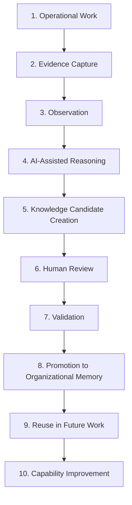
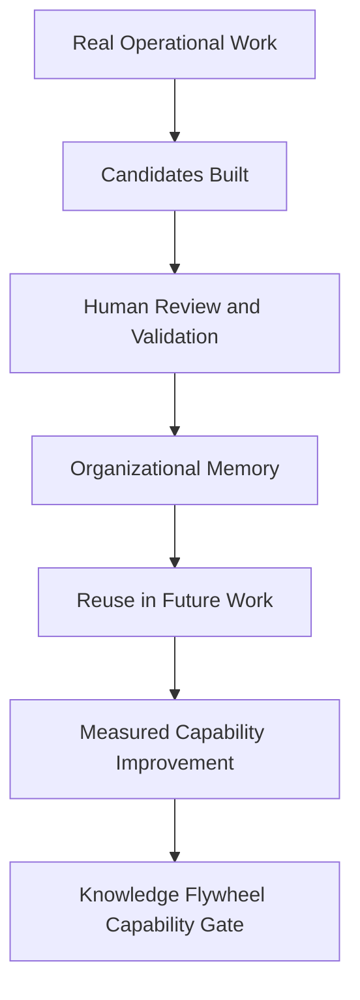

# Knowledge Flywheel

## Derived From

- Canon Version: `v1.0.0`
- Architecture Version: `v1.0.0`
- Implementation Version: `v1.0.0`
- Product Version: `v1.0.0`
- Research Version: `v1.0.0`
- Strategy Version: `v1.0.0`
- Roadmap Philosophy Version: `v1.0.0`

### Primary Repository Sources

- [Canon](../canon/README.md)
- [Architecture](../architecture/README.md)
- [Implementation](../implementation/README.md)
- [Product](../product/README.md)
- [Research](../research/README.md)
- [Strategy](../strategy/README.md)
- [Roadmap](./README.md)
- [Roadmap Philosophy](./00_ROADMAP_PHILOSOPHY.md)

### Primary Supporting Documents

- [Product Workflow Model](../canon/05_PRODUCT_WORKFLOW_MODEL.md)
- [AI Cognitive Model](../canon/06_AI_COGNITIVE_MODEL.md)
- [Data Architecture](../architecture/09_DATA_ARCHITECTURE.md)
- [Knowledge Representation Model](../architecture/10_KNOWLEDGE_REPRESENTATION_MODEL.md)
- [MVP Scope](../implementation/12_MVP_SCOPE.md)
- [Product Metrics](../product/10_PRODUCT_METRICS.md)
- [Product Governance](../product/11_PRODUCT_GOVERNANCE.md)
- [Customer Discovery](../research/02_CUSTOMER_DISCOVERY.md)
- [Experiments](../research/09_EXPERIMENTS.md)
- [Ideal Customer Profile](../strategy/02_IDEAL_CUSTOMER_PROFILE.md)
- [Go-to-Market Strategy](../strategy/03_GO_TO_MARKET.md)
- [Business Model](../strategy/05_BUSINESS_MODEL.md)
- [Competitive Strategy](../strategy/06_COMPETITIVE_STRATEGY.md)
- [Design Partners](./05_DESIGN_PARTNERS.md)

---

Status: **Active**

## Primary Question

How will the company validate that operational work can reliably become evidence, Knowledge Candidates, human-reviewed knowledge, Organizational Memory, and better future decisions?

This document defines the roadmap for validating the Knowledge Flywheel as the central operating mechanism of the Organizational Intelligence Platform.

It does not redefine the Knowledge Flywheel.

The Canon defines what the flywheel is. This roadmap defines how the company proves that it works in real workflows, under real review conditions, with measurable organizational improvement.

## 1. Executive Summary

The Knowledge Flywheel is the core operating mechanism of the Organizational Intelligence Platform.

The platform succeeds only if real operational work can be transformed into governed, reusable, and improving Organizational Memory. That transformation cannot be assumed. It must be validated through evidence.

This roadmap exists to prove that:

- work creates evidence;
- evidence creates candidate learning;
- AI helps identify and structure learning;
- humans review and validate;
- validated learning becomes Organizational Memory;
- Organizational Memory is reused;
- reuse improves future work;
- the organization becomes more capable over time.

The purpose of this roadmap is therefore not feature expansion. It is disciplined validation of the platform's central thesis in real customer workflows, beginning with the Customer Support beachhead.

## 2. Relationship to Canon

The Canon defines the Knowledge Flywheel as a core product and organizational learning model.

This document does not restate that definition. It defines the proof layer that determines whether the Canon's model is working in practice.

| Canon Defines | Roadmap Validates |
| --- | --- |
| What the Knowledge Flywheel is | Whether it works in real workflows |
| Why Organizational Memory matters | Whether memory improves future work |
| Human Review as principle | Whether reviewers can operationalize it |
| AI as amplifier | Whether AI improves candidate creation without replacing authority |

The distinction matters because repository layers should not be collapsed. The Canon states the enduring model. Roadmap determines whether the organization has earned confidence in that model operationally.

## 3. Flywheel Validation Thesis

The validation thesis for this phase is straightforward:

If operational work produces evidence, and AI can help structure candidate learning, and humans can validate that learning, then the organization can preserve knowledge as memory and improve future work.

This thesis must be tested, not assumed.

The company should therefore treat every stage of the flywheel as a capability that requires proof:

- that the stage occurs reliably;
- that the stage preserves trust and traceability;
- that the stage creates measurable downstream value;
- that the stage compounds organizational capability rather than creating archive volume.

## 4. Knowledge Flywheel Stages

The flywheel should be validated as a sequence of distinct but connected maturity stages.

| Stage | Purpose | Expected Behavior | Validation Question | Success Evidence | Failure Signal |
| --- | --- | --- | --- | --- | --- |
| Operational Work | Establish the real work from which learning should emerge. | Tickets, chats, escalations, notes, corrections, and resolutions occur in digitally captured workflows. | Does the target workflow contain repeated, meaningful, reusable work? | Repeated issues, recurring explanations, expert interventions, and digitally preserved case history exist. | Work is too sparse, too unstructured, or too trivial to yield reusable learning. |
| Evidence Capture | Preserve raw source context before interpretation. | Sources, artifacts, timestamps, participants, and case context are retained and linked. | Can learning be traced back to source material without relying on memory or summary? | Candidates and reviews can reference original evidence directly. | Claims lose context, provenance is weak, or summaries replace underlying evidence. |
| Observation | Recognize meaningful patterns, exceptions, gaps, and repeated reasoning opportunities. | The system or human operators identify signals worth learning from. | Can repeated operational patterns be distinguished from noise? | Repeated themes, corrections, or gaps are surfaced consistently. | Important patterns remain hidden or only appear through founder intuition. |
| AI-Assisted Reasoning | Help structure, summarize, cluster, and draft candidate learning. | AI produces grounded, reviewable suggestions that remain advisory. | Does AI improve clarity and speed without becoming authority? | AI outputs are evidence-grounded, reviewable, and useful to reviewers. | AI creates unsupported claims, obscures evidence, or is treated as final truth. |
| Knowledge Candidate Creation | Convert candidate learning into a governable object. | Potential learning becomes a Knowledge Candidate with evidence, context, and review readiness. | Can real work become specific, understandable, reviewable candidates? | Candidates are complete enough to inspect, compare, revise, and route for review. | Candidates are vague, duplicative, incomplete, or bypass candidate status entirely. |
| Human Review | Apply accountable human judgment to proposed learning. | Reviewers inspect evidence, challenge claims, approve, reject, or revise. | Can Human Review operate inside the workflow without unsustainable burden? | Review decisions include rationale, evidence inspection, and clear disposition. | Review becomes bottlenecked, superficial, founder-only, or consistently skipped. |
| Validation | Determine whether candidate learning is trustworthy and reusable. | Validation applies standards, scope, and authority to candidate knowledge. | Can the organization distinguish confidence from validated trust? | Validation Records, review rationale, and acceptance criteria are preserved. | AI confidence is mistaken for validation, or validation criteria are inconsistent. |
| Promotion to Organizational Memory | Convert validated learning into durable organizational knowledge. | Approved knowledge is promoted with provenance, scope, and governance intact. | Does validated learning become governed memory rather than temporary output? | Knowledge Items enter Organizational Memory with traceability and retrieval readiness. | Validated knowledge remains disconnected, unfindable, or merged with raw archives. |
| Reuse in Future Work | Prove that memory is used in later operational workflows. | Agents, reviewers, and AI retrieve and apply validated knowledge during future cases. | Does Organizational Memory improve later work? | Reuse events are visible and linked to outcomes in subsequent work. | Knowledge exists but is not retrieved, trusted, or operationally useful. |
| Capability Improvement | Confirm that repeated reuse creates measurable improvement. | Future work becomes faster, more consistent, less expert-dependent, and easier to learn. | Does the flywheel compound organizational capability over time? | Reduced repeat investigation, improved onboarding, fewer escalations, and stronger trust signals. | The system accumulates documents without measurable operational improvement. |

## 5. Stage 1 - Operational Work

The flywheel begins with real work, not documentation activity.

For the initial beachhead, that means Customer Support work such as:

- tickets;
- chats;
- escalations;
- customer questions;
- resolutions;
- internal notes;
- expert corrections.

The company should validate that this work is sufficiently repeated, sufficiently digital, and sufficiently meaningful to generate reusable learning.

| Validation Question | Why It Matters |
| --- | --- |
| Is there enough repeated work? | Repetition is required for measurable reuse and capability improvement. |
| Does work contain reusable learning? | Not every task creates durable knowledge. |
| Is the work captured digitally? | Undocumented work cannot enter a governed flywheel reliably. |
| Is the work meaningful enough to become knowledge? | The platform should preserve organizationally useful learning, not noise. |

This stage succeeds when the company can show that Customer Support contains concentrated, repeated, evidence-rich work that can become the raw material of the flywheel.

## 6. Stage 2 - Evidence Capture

Evidence must be preserved before interpretation.

This is a trust requirement, not a formatting preference. If evidence is lost, summarized prematurely, or separated from its source context, later review and validation become weak.

### Success Criteria

- evidence is connected to the candidate;
- source context is preserved;
- evidence is not overwritten by AI summary;
- evidence supports review.

### Failure Signals

- candidates lack source context;
- reviewers cannot verify claims;
- AI output replaces evidence.

Evidence Capture succeeds when reviewers and validators can inspect why a claim exists, where it came from, and what operational situation produced it.

## 7. Stage 3 - AI-Assisted Reasoning

AI's role in the flywheel is assistive, not authoritative.

AI may:

- summarize;
- cluster;
- classify;
- identify repeated patterns;
- draft candidate learning;
- surface similar cases;
- prepare reviewer context.

AI must remain reviewable and evidence-grounded. The platform should improve speed and clarity, but it should not convert AI output directly into trusted knowledge.

### Success Criteria

- AI improves speed or clarity;
- AI output remains reviewable;
- AI suggests candidates grounded in evidence;
- reviewers can challenge AI output.

### Failure Signals

- AI outputs cannot be traced back to evidence;
- reviewers cannot understand what AI changed or suggested;
- AI output is accepted because it is fluent rather than because it is correct;
- AI assistance weakens rather than strengthens reviewer judgment.

This stage succeeds when AI reduces cognitive labor without weakening accountability.

## 8. Stage 4 - Knowledge Candidate Creation

Every potential learning should become a Knowledge Candidate first.

This is the governance boundary between operational work and Organizational Memory. A Knowledge Candidate is a proposal, not truth.

### Success Criteria

- candidates are understandable;
- candidates are specific;
- candidates preserve evidence;
- candidates are reviewable;
- candidates do not enter memory automatically.

### Core Metrics

| Metric | Why It Matters |
| --- | --- |
| Knowledge Candidates Created | Shows whether real work is generating candidate learning. |
| Candidate Source | Shows which intake paths and workflow origins are producing candidates. |
| Candidate Completeness | Shows whether candidates are structured enough for review. |
| Duplicate Candidate Rate | Shows whether the system is generating redundant learning. |
| Candidate Review Readiness | Shows whether candidate quality is sufficient to sustain review throughput. |

This stage succeeds when candidate creation is consistent, review-ready, and traceable to real work rather than to speculative authoring.

## 9. Stage 5 - Human Review

Human Review is the trust mechanism of the flywheel.

The company should validate that reviewers can inspect evidence, challenge AI assistance, apply domain judgment, and record accountable decisions without making the workflow unsustainably burdensome.

### Success Criteria

- reviewers inspect evidence;
- reviewers approve, reject, or revise;
- rationale is captured;
- review is not too burdensome;
- review increases confidence.

### Core Metrics

| Metric | Why It Matters |
| --- | --- |
| Review Participation | Shows whether accountable humans are actually engaged. |
| Time to Review | Shows whether review latency remains operationally acceptable. |
| Reviewer Correction Rate | Shows how often human judgment materially improves candidate quality. |
| Reviewer Agreement | Shows whether review criteria are understandable and consistent. |
| Review Completion Rate | Shows whether review is sustainable rather than nominal. |

Human Review succeeds when trust is strengthened through accountable judgment without collapsing throughput.

## 10. Stage 6 - Validation

Validation is the moment when the organization decides whether candidate learning is trustworthy and reusable.

Validation is not the same as AI confidence, retrieval relevance, or candidate popularity. It is a governed organizational decision.

### Success Criteria

- validated candidates meet quality standards;
- validation preserves reviewer, evidence, and rationale;
- rejected candidates remain useful as learning;
- scope and authority are explicit.

### Core Metrics

| Metric | Why It Matters |
| --- | --- |
| Validation Rate | Shows how much candidate learning reaches trusted status. |
| Rejection Rate | Shows whether candidate generation is producing substantial noise or healthy selectivity. |
| Revision Rate | Shows how often candidate knowledge needs refinement before trust is granted. |
| Confidence Level | Helps compare machine or workflow confidence with actual validation outcomes. |
| Evidence Quality Score | Shows whether candidates are supported strongly enough for trustworthy evaluation. |

Validation succeeds when the organization can explain why a candidate became trusted, why a candidate was rejected, and what authority supported that decision.

## 11. Stage 7 - Promotion to Organizational Memory

Validated learning becomes Organizational Memory only when approved through the governed path.

Promotion is important because validated output should not remain trapped in workflow history. It must become durable, reusable, structured, and traceable organizational knowledge.

### Success Criteria

- promoted knowledge is durable;
- memory preserves provenance;
- memory is findable;
- memory is distinct from raw archive;
- memory can evolve.

### Core Metrics

| Metric | Why It Matters |
| --- | --- |
| Promotion Rate | Shows how much validated learning becomes durable memory. |
| Knowledge Items Created | Shows whether memory is actually growing as governed knowledge. |
| Memory Growth | Shows accumulation of validated, evidence-backed, reusable knowledge. |
| Source Traceability | Shows whether memory remains linked to sources and validation history. |
| Governance Completeness | Shows whether promoted memory preserves required ownership, review, and lifecycle signals. |

This stage succeeds when promoted knowledge is durable enough for future retrieval and governed enough for future trust.

## 12. Stage 8 - Reuse

Reuse is where the flywheel begins proving value.

Without reuse, the organization may be creating memory, but it is not yet proving Organizational Intelligence.

### Success Criteria

- users retrieve memory in future work;
- AI retrieves validated memory;
- support agents reuse knowledge;
- reviewers use prior decisions;
- repeated issues require less rediscovery.

### Core Metrics

| Metric | Why It Matters |
| --- | --- |
| Knowledge Reuse Rate | Shows how often validated knowledge is applied later. |
| Reuse Events | Shows whether reuse is occurring consistently enough to analyze. |
| Similar Case Resolution Improvement | Shows whether comparable cases improve through reuse. |
| Deflection Assisted by Validated Knowledge | Shows whether trusted memory reduces unnecessary repeated effort. |
| Repeat Investigation Reduction | Shows whether teams stop rediscovering what they already know. |

Reuse succeeds when Organizational Memory changes future work behavior rather than simply storing past activity.

## 13. Stage 9 - Capability Improvement

Capability Improvement is the highest validation level of the flywheel.

The organization should become more capable because it is learning from work in a governed and reusable form.

Evidence of improvement may include:

- faster resolution;
- fewer repeated escalations;
- reduced expert dependency;
- improved onboarding;
- higher answer consistency;
- better documentation freshness;
- higher customer confidence;
- stronger AI trust.

This stage succeeds when the company can show that reuse creates measurable operational improvement and not merely better documentation hygiene.

## 14. Flywheel Maturity Levels

The company should evaluate the Knowledge Flywheel through explicit maturity levels.

| Level | Meaning | Criteria | Evidence |
| --- | --- | --- | --- |
| Level 0 - No Flywheel | Work happens, but learning is lost. | Work is mostly unrecoverable, undocumented, or disconnected from review and memory. | High expert dependence, repeated rediscovery, weak traceability. |
| Level 1 - Captured Work | Evidence exists, but learning is not yet structured. | Cases, chats, tickets, notes, and outcomes are captured digitally. | Preserved workflow history, retrievable artifacts, early evidence linkage. |
| Level 2 - Candidate Generation | The system creates Knowledge Candidates. | Repeated work yields structured candidate learning with preserved evidence. | Knowledge Candidate volume, completeness, and review readiness. |
| Level 3 - Human Review | Candidates are reviewed by accountable humans. | Reviewers inspect evidence and produce approval, rejection, or revision outcomes with rationale. | Review Completion, reviewer participation, reviewer agreement, correction history. |
| Level 4 - Validated Memory | Validated knowledge becomes Organizational Memory. | Validation and promotion create durable, governed knowledge with provenance. | Validation Records, Promotion Rate, Organizational Memory Growth, governance completeness. |
| Level 5 - Reuse | Memory improves future work. | Validated memory is retrieved and applied in later operational workflows. | Knowledge Reuse Rate, Time to First Reuse, repeat investigation reduction, improved similar-case handling. |
| Level 6 - Compounding Learning | The organization measurably improves over time. | Reuse produces durable operational gains that reduce entropy and expert dependence. | Time to Competency improvement, escalation reduction, trust growth, validated reuse impact, capability improvement evidence. |

These maturity levels should be used to interpret the organization's current state honestly. Advancement should depend on evidence, not aspiration.

## 15. Flywheel Metrics Framework

The flywheel should be measured through a connected capability framework rather than a single vanity number.

| Metric | What It Measures | Why It Matters |
| --- | --- | --- |
| Knowledge Candidates Created | Candidate generation volume from real work. | Indicates whether operational learning is entering the flywheel. |
| Intake by Door | Candidate origin across the Three Knowledge Intake Doors. | Shows where the flywheel is producing learning and where capture is weak. |
| Candidate Completeness | Presence of evidence, context, scope, and review readiness. | Indicates candidate quality before review begins. |
| Review Rate | Percentage of eligible candidates entering Human Review. | Shows whether the trust path is operational. |
| Validation Rate | Percentage of reviewed candidates that become trusted. | Shows whether candidate learning is sufficiently strong and governable. |
| Promotion Rate | Percentage of validated candidates promoted to memory. | Shows whether trusted learning becomes durable memory. |
| Rejection Rate | Percentage of candidates rejected during review or validation. | Shows noise, selectivity, and candidate quality limits. |
| Revision Rate | Percentage of candidates requiring material changes. | Shows whether learning quality improves through review. |
| Knowledge Reuse Rate | Frequency of later work reusing validated memory. | Shows whether memory is operationally useful. |
| Time to First Reuse | Elapsed time from promotion to first meaningful reuse. | Shows whether memory becomes useful quickly enough. |
| Expert Dependency Reduction | Reduction in dependence on a small number of experts. | Shows whether knowledge is becoming institutional. |
| Repeat Issue Reduction | Reduction in repeated rediscovery or repeated investigations. | Shows whether the flywheel improves future work. |
| Documentation Freshness | Timeliness of memory relative to current operational reality. | Shows whether memory remains current enough to trust. |
| Trust Score | Aggregate trust signal derived from review quality, validation outcomes, and successful reuse. | Shows whether the organization is willing to rely on the system responsibly. |
| Capability Improvement Evidence | Measured downstream operational change caused by reuse. | Shows whether the flywheel compounds capability rather than volume. |

These metrics should be interpreted together.

Learning Loop Completion Rate may show that the flywheel operates, but it is not sufficient on its own. Validated Knowledge Reuse Impact remains the stronger expression of whether the flywheel creates real organizational value.

## 16. Validation Experiments

The flywheel should be tested through explicit experiments rather than through intuition alone.

| Experiment | Purpose | Method | Evidence | Success Criteria |
| --- | --- | --- | --- | --- |
| Historical ticket analysis | Determine whether historical support work contains repeated, reusable patterns. | Analyze past tickets, escalations, notes, and resolutions for repetition, evidence density, and reusable learning. | Pattern frequency, repeated issue clusters, identifiable expert interventions. | Historical work contains enough repeated, meaningful structure to seed the flywheel. |
| Manual candidate creation test | Prove that humans can convert work into Knowledge Candidates without AI dependence. | Manually create candidates from a sample of real cases and assess quality and effort. | Candidate quality, time per candidate, reviewer clarity. | Humans can produce reviewable candidates reliably from real work. |
| AI-generated candidate test | Determine whether AI improves candidate creation speed or clarity. | Use AI to draft candidates from real cases, then compare to manual baselines. | Completeness, evidence alignment, reviewer correction rate, throughput change. | AI-generated candidates are faster or clearer without unacceptable quality loss. |
| Reviewer evaluation test | Validate whether Human Review is operationally sustainable and trustworthy. | Route sample candidates to reviewers with explicit decisions and rationale capture. | Review completion, reviewer agreement, correction patterns, review latency. | Reviewers can evaluate candidates consistently without excessive burden. |
| Memory reuse simulation | Test whether validated memory improves later work before large-scale deployment. | Present later cases to agents or reviewers with and without memory assistance. | Resolution quality, time saved, repeated investigation reduction. | Validated memory materially improves later work in comparable cases. |
| Design partner pilot | Validate the full flywheel inside real customer workflows. | Run the candidate, review, validation, promotion, and reuse path with a design partner. | Workflow evidence, review outcomes, promoted memory, reuse signals, partner feedback. | A real customer workflow completes the governed learning loop with credible value. |
| Repeated issue reduction test | Confirm that reuse reduces repeated rediscovery over time. | Track repeated issue cohorts before and after memory creation and reuse. | Lower rediscovery rate, fewer escalations, faster repeated-case handling. | Repeated issues measurably improve after validated knowledge is introduced. |
| Onboarding knowledge test | Determine whether memory reduces time to competency for newer agents. | Compare onboarding and early case handling with and without validated memory support. | Time to competency, expert interruption frequency, answer consistency. | Newer agents become capable faster with validated Organizational Memory. |

Each experiment should produce evidence that is preserved in the repository and interpreted through the same research discipline used elsewhere in the company.

## 17. Customer Support Beachhead Validation

Customer Support is the first flywheel validation domain because it concentrates the necessary conditions:

- repeated work;
- evidence;
- human review;
- measurable outcomes;
- knowledge reuse potential.

This makes Customer Support the most disciplined first environment for validating whether the Knowledge Flywheel works at all.

| What Customer Support Provides | Why It Matters |
| --- | --- |
| Repeated inquiries and recurring issues | Creates enough repetition to observe reuse and improvement. |
| Digital operational evidence | Provides tickets, chats, notes, and escalation history for traceable learning. |
| Existing review behaviors | Support leads, QA, and escalation experts create natural Human Review paths. |
| Measurable operational outcomes | Resolution quality, escalation rate, and onboarding burden are observable. |
| Immediate reuse opportunities | Similar future cases create clear tests of memory value. |

Before expanding into ITSM, HR, Legal, Finance, and Operations, the company should prove in Customer Support that:

- real support work creates usable candidates;
- reviewers can validate candidate learning;
- validated learning becomes Organizational Memory;
- support teams reuse memory in later work;
- measurable operational improvement follows reuse.

Expansion should follow only after this beachhead produces evidence strong enough to support broader organizational generalization.

## 18. Capability Gate

The Knowledge Flywheel is considered validated enough for Product-Market Fit work only when the full capability chain has been demonstrated.

The gate should require that:

- real work creates candidates;
- reviewers validate candidates;
- candidates become memory;
- memory is reused;
- reuse produces measurable improvement;
- customers recognize the value;
- metrics support the claim;
- the system does not rely on founder-only interpretation.

| Gate Condition | Required Evidence |
| --- | --- |
| Real work creates candidates | Repeated operational cases consistently yield reviewable Knowledge Candidates. |
| Reviewers validate candidates | Human Review and Validation occur with rationale, evidence inspection, and sustainable throughput. |
| Candidates become memory | Validated candidates are promoted into durable, traceable Organizational Memory. |
| Memory is reused | Later cases show visible retrieval and use of validated knowledge. |
| Reuse produces measurable improvement | Reuse changes later outcomes, not only user perception. |
| Customers recognize the value | Design partners or early customers report that the learning loop improves work. |
| Metrics support the claim | Lifecycle, trust, reuse, and improvement metrics align with observed behavior. |
| The system does not rely on founder-only interpretation | Review, validation, and reuse can occur through organizational roles rather than only through founder judgment. |

If these conditions are not met, the company should continue validation rather than claiming flywheel success prematurely.

## 19. Risks

The Knowledge Flywheel roadmap carries several important risks.

| Risk | Why It Matters |
| --- | --- |
| The flywheel becomes a metaphor instead of a measured system | Conceptual agreement without operational proof creates false confidence. |
| Candidates are too low quality | Weak candidates make review inefficient and trust fragile. |
| Review is too burdensome | Human Review may become a bottleneck rather than a trust mechanism. |
| Memory is not reused | The platform may create archive volume without improving future work. |
| AI output is over-trusted | Unreviewed or weakly reviewed AI output can corrupt memory and trust. |
| Evidence is weak | Poor traceability prevents meaningful validation and future challenge. |
| Customers do not see value | The flywheel may be internally coherent but commercially unconvincing. |
| Metrics are vanity metrics | Activity may be confused with capability improvement. |
| Knowledge becomes archive instead of active memory | Stored information may grow without making the organization more capable. |

These risks should be managed through explicit experiments, disciplined metrics, governance boundaries, and capability-gated progression.

## 20. Deliverables

This roadmap should produce tangible outputs that preserve validation learning.

- flywheel validation report;
- metrics dashboard;
- candidate lifecycle analysis;
- reviewer feedback summary;
- memory reuse evidence;
- customer workflow evidence;
- capability maturity assessment;
- Product-Market Fit readiness input.

These deliverables are important because the company should retain proof of flywheel maturity as Organizational Memory for future roadmap decisions.

## 21. Relationship to Product-Market Fit

Product-Market Fit depends on proving the Knowledge Flywheel.

The company should not claim Product-Market Fit only because customers use the product, complete pilots, or express enthusiasm. The stronger question is whether customers measurably learn from work and reuse validated knowledge through the platform.

| Product Usage Signal | Product-Market Fit-Relevant Flywheel Signal |
| --- | --- |
| Customers log in and use workflows | Customers convert work into validated memory |
| Customers create or review knowledge | Customers reuse validated memory in later work |
| Customers express interest in AI | Customers trust AI only inside governed review boundaries |
| Customers retain access | Customers improve future operational outcomes through reuse |

This relationship matters because Product-Market Fit for an Organizational Intelligence Platform is not adoption alone. It is repeatable customer value produced through governed organizational learning.

## 22. Traceability Matrix

This roadmap derives from the repository's existing layers and should remain explicitly traceable to them.

| Source | Flywheel Validation Derivation |
| --- | --- |
| [Canon](../canon/README.md) | Defines the Knowledge Flywheel, Human Review, Organizational Memory, Governance, and the conceptual boundaries this roadmap must not redefine. |
| [AI Cognitive Model](../canon/06_AI_COGNITIVE_MODEL.md) | Defines AI as amplifier, advisory cognition, and bounded reasoning support that this roadmap must validate operationally. |
| [Product Metrics](../product/10_PRODUCT_METRICS.md) | Defines lifecycle, trust, reuse, and capability metrics that determine whether the flywheel works in practice. |
| [Product Governance](../product/11_PRODUCT_GOVERNANCE.md) | Defines the control boundaries by which candidate learning becomes trusted organizational knowledge. |
| [Knowledge Representation Model](../architecture/10_KNOWLEDGE_REPRESENTATION_MODEL.md) | Defines the structural form of candidates, knowledge, provenance, and memory relationships that validation must preserve. |
| [Data Architecture](../architecture/09_DATA_ARCHITECTURE.md) | Defines the information lifecycle from intake to Organizational Memory and the integrity rules that make the flywheel trustworthy. |
| [Customer Discovery](../research/02_CUSTOMER_DISCOVERY.md) | Defines how real workflow evidence and customer perception should be gathered and interpreted. |
| [Experiments](../research/09_EXPERIMENTS.md) | Defines the experimental discipline by which flywheel claims become evidence rather than optimism. |
| [Ideal Customer Profile](../strategy/02_IDEAL_CUSTOMER_PROFILE.md) | Defines why Customer Support is the first beachhead in which flywheel validation should occur. |
| [Go-to-Market Strategy](../strategy/03_GO_TO_MARKET.md) | Defines how flywheel proof supports category education, design partner sequencing, and later Product-Market Fit work. |
| [Business Model](../strategy/05_BUSINESS_MODEL.md) | Defines why durable knowledge reuse and reduced rediscovery matter economically, not only operationally. |
| [Competitive Strategy](../strategy/06_COMPETITIVE_STRATEGY.md) | Defines why governed Organizational Memory and compounding learning must become a defensible capability rather than a generic AI workflow. |
| [Roadmap Philosophy](./00_ROADMAP_PHILOSOPHY.md) | Defines capability gates, evidence-driven progression, and validation before expansion as the planning discipline for this roadmap. |

## 23. What This Document Does NOT Define

This document intentionally does not define:

- a new Canon definition;
- complete implementation detail;
- UI specification;
- pricing;
- public launch;
- full enterprise expansion;
- sales motion.

Those belong to other repository layers or later roadmap phases.

This document defines only how the company validates whether the Knowledge Flywheel works as an operational system of governed learning.

## 24. Closing

The Knowledge Flywheel roadmap is the proof layer of the company.

The company validates its core thesis only when real work becomes governed memory and governed memory measurably improves future work.

That is the standard this roadmap exists to enforce.
