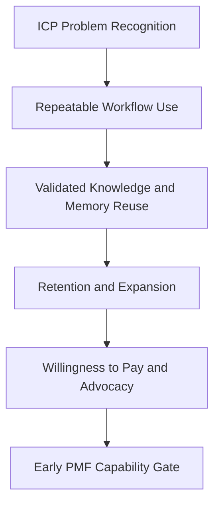

# Product-Market Fit

## Derived From

- Canon Version: `v1.0.0`
- Architecture Version: `v1.0.0`
- Implementation Version: `v1.0.0`
- Product Version: `v1.0.0`
- Research Version: `v1.0.0`
- Strategy Version: `v1.0.0`
- Roadmap Philosophy Version: `v1.0.0`

### Primary Repository Sources

- [Canon](../canon/README.md)
- [Architecture](../architecture/README.md)
- [Implementation](../implementation/README.md)
- [Product](../product/README.md)
- [Research](../research/README.md)
- [Strategy](../strategy/README.md)
- [Roadmap](./README.md)
- [Roadmap Philosophy](./00_ROADMAP_PHILOSOPHY.md)

### Primary Supporting Documents

- [Product Metrics](../product/10_PRODUCT_METRICS.md)
- [Product Governance](../product/11_PRODUCT_GOVERNANCE.md)
- [Customer Discovery](../research/02_CUSTOMER_DISCOVERY.md)
- [Experiments](../research/09_EXPERIMENTS.md)
- [Research Backlog](../research/10_RESEARCH_BACKLOG.md)
- [Ideal Customer Profile](../strategy/02_IDEAL_CUSTOMER_PROFILE.md)
- [Go-to-Market Strategy](../strategy/03_GO_TO_MARKET.md)
- [Pricing Strategy](../strategy/04_PRICING_STRATEGY.md)
- [Business Model](../strategy/05_BUSINESS_MODEL.md)
- [Competitive Strategy](../strategy/06_COMPETITIVE_STRATEGY.md)
- [Growth Strategy](../strategy/07_GROWTH_STRATEGY.md)
- [Design Partners](./05_DESIGN_PARTNERS.md)
- [Customer Support MVP](./06_CUSTOMER_SUPPORT_MVP.md)
- [Knowledge Flywheel](./07_KNOWLEDGE_FLYWHEEL.md)
- [Public Beta](./04_PUBLIC_BETA.md)

---

Status: **Active**

## Primary Question

What evidence must prove that the Organizational Intelligence Platform has achieved early Product-Market Fit in the Customer Support beachhead?

This document defines the Product-Market Fit roadmap for the Organizational Intelligence Platform.

For this company, Product-Market Fit is not merely usage, revenue, or AI interaction volume. It is the point at which a focused market repeatedly receives and recognizes meaningful value from governed Organizational Memory built from real work.

## 1. Executive Summary

Product-Market Fit is the point where a focused market repeatedly receives and recognizes meaningful value from the platform.

For the Organizational Intelligence Platform, Product-Market Fit is not proven because people try AI, ask for features, or complete one successful pilot. It is proven when customers depend on governed Organizational Memory to improve real work.

In the Customer Support beachhead, this means early Product-Market Fit is present only when multiple high-fit organizations:

- adopt the platform into real support workflows;
- validate knowledge from operational work;
- reuse validated memory in future work;
- retain the platform over time;
- expand usage responsibly;
- advocate for the category because they believe it makes the organization more capable.

This document therefore defines Product-Market Fit as a disciplined evidence threshold rather than as a feeling of market momentum.

## 2. PMF Definition for OIP

The company reaches early Product-Market Fit when a focused segment of Customer Support organizations repeatedly adopts the platform, validates knowledge from real work, reuses that knowledge, retains the platform, expands usage, and advocates for the category because they believe it makes the organization more capable.

This definition matters because it connects Product-Market Fit directly to the platform's actual thesis:

- work becomes evidence;
- evidence becomes candidate learning;
- humans validate;
- validated learning becomes memory;
- memory improves future work;
- customers recognize that improvement as meaningful value.

For this reason, Product-Market Fit should be interpreted as durable, repeatable customer pull around governed learning rather than around AI novelty or workflow experimentation alone.

## 3. What PMF Is Not

Product-Market Fit should not be confused with adjacent but weaker signals.

| Signal | Why It Is Insufficient |
| --- | --- |
| Many demos | Demos show curiosity, not durable customer pull. |
| Many signups | Signup volume does not prove workflow use, retention, or value recognition. |
| Chatbot usage | AI interaction alone does not prove governed memory creation or reuse. |
| AI interaction volume | High prompt or tool usage may reflect experimentation rather than customer value. |
| One successful pilot | A single success can be real but still non-repeatable or founder-dependent. |
| Founder enthusiasm | Internal conviction cannot substitute for customer evidence. |
| Investor interest | Financing interest does not prove operational customer value. |
| Feature requests | Requested features may reflect curiosity or adjacency rather than fit. |
| Traffic | Attention does not prove adoption, retention, or willingness to pay. |
| Polite customer feedback | Positive language without commitment, reuse, or payment is not PMF. |

These signals may still be useful inputs, but none should be treated as Product-Market Fit on its own.

## 4. Relationship to Previous Roadmap Phases

Product-Market Fit depends on the earlier roadmap phases, but it asks a different question than any of them.

| Phase | What It Proves |
| --- | --- |
| Prototype | Concept feasibility |
| Alpha | Internal product foundation |
| Private Beta | Design partner workflow fit |
| Public Beta | Repeatable early onboarding |
| Customer Support MVP | Beachhead domain capability |
| Knowledge Flywheel | Core mechanism validation |
| PMF | Durable customer pull and repeatable value |

Earlier phases prove that the platform can work. Product-Market Fit proves that a focused market wants to keep using it, paying for it, expanding it, and advocating for it because it creates meaningful organizational capability.

## 5. PMF Evidence Categories

Product-Market Fit should be evaluated through distinct evidence categories rather than through one metric alone.

### 5.1 Problem Evidence

Customers must recognize Organizational Entropy in their own language.

Evidence should include:

- repeated pain in interviews;
- customers describing knowledge loss;
- support leaders identifying repeated work;
- experts complaining about repeated explanations;
- visible documentation debt.

Problem evidence matters because the company cannot claim Product-Market Fit if the target market does not consistently recognize the underlying problem.

### 5.2 Workflow Evidence

The product must fit real Customer Support workflows.

Evidence should include:

- users completing the candidate-review-memory flow;
- reviewers participating;
- workflows requiring limited manual workaround;
- onboarding being repeatable.

Workflow evidence matters because even a real problem will not produce PMF if the system does not fit operational reality.

### 5.3 Value Evidence

Customers must experience meaningful value.

Evidence should include:

- faster repeated issue handling;
- improved consistency;
- reduced expert burden;
- knowledge reuse;
- improved onboarding;
- validated memory reuse.

Value evidence matters because the company is not building a theoretical system. It is building a platform that must make organizations more capable in practice.

### 5.4 Retention Evidence

Customers must continue using the platform.

Evidence should include:

- active usage after pilot;
- renewed commitment;
- repeated workflow use;
- memory accumulation;
- review participation over time.

Retention evidence matters because early excitement without continued use is not Product-Market Fit.

### 5.5 Expansion Evidence

Customers should want to expand.

Evidence should include:

- more users;
- more teams;
- more knowledge domains;
- more workflows;
- interest from IT, Customer Success, Operations, or HR.

Expansion evidence matters because strong value should create pressure to broaden usage beyond an initial narrow deployment.

### 5.6 Willingness-to-Pay Evidence

Customers must see enough value to pay.

Evidence should include:

- budget discussions;
- paid pilots;
- conversion from design partner;
- pricing acceptance;
- ROI conversations;
- procurement movement.

Willingness-to-pay evidence matters because Product-Market Fit requires value strong enough to survive budget and procurement reality.

### 5.7 Advocacy Evidence

Customers should be willing to explain value to others.

Evidence should include:

- reference willingness;
- case study interest;
- internal champion advocacy;
- peer referrals;
- executive endorsement.

Advocacy evidence matters because durable value often produces social proof and internal sponsorship naturally.

### 5.8 Category Understanding Evidence

Customers should understand Organizational Intelligence Platform as a distinct category.

Evidence should include:

- customers not describing it merely as a chatbot;
- customers understanding governed memory;
- customers valuing Human Review;
- customers understanding the Knowledge Flywheel;
- customers seeing the platform as more than a support tool.

Category understanding matters because weak category clarity can suppress retention, pricing, advocacy, and expansion even when workflow value exists.

## 6. PMF Metrics Framework

The Product-Market Fit roadmap should rely on a metrics framework that distinguishes strong signals from weak ones.

| Metric | Definition | Why It Matters | Strong Signal | Weak Signal |
| --- | --- | --- | --- | --- |
| Qualified Design Partners | Number of high-fit design partners matching the ICP and actively participating in structured validation. | Shows whether PMF evidence is coming from the right segment. | Multiple high-fit partners remain engaged and contribute real workflow evidence. | Interest comes mostly from poor-fit or opportunistic accounts. |
| Activation Rate | Percentage of customers reaching the first meaningful support workflow milestone. | Shows whether onboarding and first value are repeatable. | Multiple ICP customers reach meaningful workflow use quickly and consistently. | Customers stall after setup or require heavy founder rescue. |
| Time to First Organizational Value | Time from onboarding start to first credible support learning value. | Shows how quickly customers perceive useful capability. | Customers reach visible candidate, review, memory, or reuse value within an acceptable early cycle. | Value takes too long or remains abstract. |
| Knowledge Candidates Created | Number of evidence-linked candidates created from real support work. | Shows whether operational work is producing candidate learning. | Candidates emerge naturally from real cases and persist over time. | Candidates appear only in artificial demos or manual founder curation. |
| Candidate Validation Rate | Percentage of candidates that become validated knowledge. | Shows whether candidate quality is strong enough to trust. | A meaningful share of candidates survive review and validation. | Most candidates are weak, noisy, or unreviewable. |
| Promotion Rate | Percentage of validated candidates promoted into Organizational Memory. | Shows whether validated learning becomes durable memory. | Trusted support learning becomes governed memory consistently. | Validation happens, but memory creation remains inconsistent or ad hoc. |
| Knowledge Reuse Rate | Frequency of later workflow reuse of validated Organizational Memory. | Shows whether memory creates operational value. | Reuse occurs repeatedly in real support work and improves outcomes. | Memory accumulates without influencing later cases. |
| Reviewer Engagement | Participation and continuity of human reviewers over time. | Shows whether Human Review fits customer operations sustainably. | Reviewers continue participating with rationale and acceptable burden. | Review is skipped, founder-proxied, or declines after initial interest. |
| Retention Rate | Share of customers continuing meaningful use beyond pilot or initial phase. | Shows whether value persists over time. | Customers continue using the workflow and preserve memory growth over time. | Usage drops after novelty fades or pilot support ends. |
| Expansion Interest | Evidence that customers want broader usage after initial value. | Shows whether the platform creates pull beyond the first narrow deployment. | Customers ask to include more users, teams, workflows, or domains. | Interest remains frozen at experimental scope only. |
| Paid Conversion Rate | Percentage of qualified customers converting to paid use or credible paid commitment. | Shows whether value can survive commercial reality. | High-fit customers move from pilot to payment or procurement. | Positive usage signals fail to produce commercial movement. |
| Reference Readiness | Customer willingness to act as reference, quote source, or case study. | Shows whether customers recognize and can articulate value confidently. | Customers agree to reference conversations or evidence-backed case studies. | Customers stay polite but avoid public or peer-facing endorsement. |
| NRR Direction | Early directional signal of whether retained customers would increase or sustain account value over time. | Shows whether expansion is economically plausible. | Usage and scope trend upward among retained customers. | Retained accounts contract, stagnate, or remain narrowly experimental. |
| ICP Win Rate | Share of serious ICP opportunities that become active pilots, customers, or validated prospects. | Shows whether GTM and product fit are strengthening inside the intended segment. | Win rate improves among high-fit Customer Support organizations. | Wins occur mostly outside the target ICP or remain inconsistent. |
| Support Workflow Repeatability | Ability to repeat onboarding and core value workflows across multiple ICP customers. | Shows whether PMF evidence is portable rather than founder-specific. | Multiple customers complete similar workflows with limited bespoke adaptation. | Each customer requires a custom motion to reach value. |

These metrics should be interpreted as a connected system. No single number should be allowed to declare PMF in isolation.

## 7. PMF Signal Levels

The company should evaluate Product-Market Fit through explicit signal levels.

| Level | Meaning | Criteria |
| --- | --- | --- |
| Level 0 - No Signal | Customers do not recognize the problem. | Interviews show weak pain, weak urgency, low workflow interest, and little evidence of repeated knowledge loss. |
| Level 1 - Problem Resonance | Customers recognize pain but do not commit. | ICP customers describe repeated work, documentation debt, or expert dependency, but do not yet engage deeply or change behavior. |
| Level 2 - Workflow Interest | Customers engage with prototype or beta workflows. | Design partners or early customers explore onboarding, share data, and participate in candidate and review workflows. |
| Level 3 - Value Signal | Customers experience useful outcomes. | Customers report meaningful workflow improvement, validated memory reuse, or clearer organizational learning value. |
| Level 4 - Repeatable Adoption | Multiple ICP customers reach value. | More than one high-fit customer completes meaningful workflows with repeatable onboarding, review participation, and reuse signals. |
| Level 5 - Early PMF | Customers retain, expand, pay, and advocate. | Multiple ICP customers continue use, expand scope, show credible willingness to pay or pay directly, and advocate for the category in their own language. |

The company should not declare early Product-Market Fit before Level 5 evidence is present. Lower levels may show momentum, but they do not yet prove durable market pull.

## 8. Customer Segment Discipline

Product-Market Fit must be measured inside the Ideal Customer Profile, not across random customer activity.

The current PMF segment discipline is:

- Indonesia-first;
- mid-market to lower-enterprise B2B organizations;
- Customer Support operations;
- recurring questions;
- fragmented knowledge;
- human review culture;
- AI and efficiency urgency.

This discipline matters because weak-fit customers can create false negatives or false positives.

| Weak-Fit Pattern | PMF Distortion |
| --- | --- |
| Customers with low support repetition | May understate memory reuse value. |
| Customers wanting full automation only | May reject the trust model for reasons unrelated to core fit. |
| Customers without reviewer culture | May make Human Review appear less viable than it is in the ICP. |
| Customers outside the intended operating scale | May require maturity or features not relevant to early PMF. |
| Customers using the product as a generic AI tool | May inflate usage while obscuring category fit. |

Segment discipline protects the company from learning the wrong lesson from the wrong customer.

## 9. PMF Experiments

Product-Market Fit should be tested through explicit experiments rather than through generalized optimism.

| Experiment | Purpose | Method | Evidence | Success Criteria |
| --- | --- | --- | --- | --- |
| ICP discovery interviews | Confirm problem strength and segment clarity. | Conduct structured interviews with Customer Support leaders and operators inside the ICP. | Pain language, urgency, repeated work patterns, trust requirements. | ICP customers consistently describe the problem in their own operational language. |
| Design partner pilots | Validate end-to-end workflow value with real customers. | Run structured pilots with high-fit design partners using real support workflows. | Adoption, candidate flow, review participation, reuse, leadership feedback. | Multiple high-fit partners reach meaningful workflow value. |
| Support workflow observation | Verify operational fit in real conditions. | Observe support teams using the platform during or around live workflows. | Workflow friction, workaround patterns, role participation, evidence quality. | Core workflows fit real support operations with manageable adaptation. |
| Candidate validation experiment | Test whether support work yields trustworthy reviewed knowledge. | Route support-derived candidates through reviewer and validation workflows. | Candidate quality, validation outcomes, reviewer rationale, review burden. | Meaningful candidate volume survives review and becomes trusted knowledge. |
| Memory reuse experiment | Verify whether validated memory improves later work. | Compare later support cases with and without access to validated memory. | Resolution quality, consistency, repeated investigation reduction, time saved. | Reuse produces visible operational improvement. |
| Pricing conversation | Test willingness to pay and pricing comprehension. | Hold structured pricing and ROI conversations with qualified customers. | Budget behavior, commercial objections, procurement movement, willingness signals. | At least some high-fit customers show credible readiness to pay. |
| Onboarding repeatability test | Determine whether customers can be activated consistently. | Apply a standard onboarding path across multiple ICP customers. | Activation timing, founder intervention level, setup friction, first value timing. | Several ICP customers reach first value through a repeatable process. |
| Retention intent test | Evaluate whether value feels durable after initial use. | Assess continued usage, renewal interest, and workflow continuity after initial pilot cycles. | Ongoing activity, review continuation, memory growth, renewal language. | Customers indicate continued commitment beyond initial novelty. |
| Expansion interest test | Determine whether value creates broader demand. | Explore adjacent team, workflow, and domain expansion opportunities with existing customers. | Additional seat requests, cross-functional interest, scope increase discussions. | Customers seek broader adoption after initial success. |
| Reference readiness test | Determine whether customers will advocate publicly or privately. | Ask qualified customers for references, quotes, case studies, or peer introductions. | Reference willingness, quote quality, endorsement strength, referral behavior. | Some customers are willing to advocate for value in a concrete way. |

These experiments should be treated as repository-level evidence collection, not as ad hoc selling activity.

## 10. PMF Capability Gate

The company may declare early Product-Market Fit only when the evidence chain supports it clearly.

The company may declare early PMF only when:

- multiple ICP customers complete meaningful workflows;
- customers validate Knowledge Candidates;
- Organizational Memory is reused;
- customers report value in their own language;
- at least some customers pay or express credible willingness to pay;
- retention signals exist;
- expansion interest exists;
- category language resonates;
- GTM process shows early repeatability;
- value does not depend entirely on founder intervention.

This gate should be crossed only when the company can explain not just that customers like the product, but why the right customers repeatedly adopt it, stay, expand, and advocate.

## 11. False PMF Risks

The Product-Market Fit phase carries several false-positive and false-negative risks.

| Risk | Why It Matters |
| --- | --- |
| Confusing curiosity with demand | Early AI curiosity may inflate activity without durable commitment. |
| Confusing demos with adoption | Demonstration success may not survive real workflow conditions. |
| Confusing AI usage with value | Interaction volume may obscure whether memory actually improves work. |
| Relying on poor-fit customers | Weak-fit accounts can distort both product and GTM judgment. |
| Over-customizing pilots | Bespoke value can create the illusion of repeatability. |
| Founder manually creating value | If the founder is the system, PMF has not been achieved. |
| Weak willingness to pay | Usage without budget movement may indicate weak practical value. |
| No retention | Initial success without continued use undermines any PMF claim. |
| No reuse | If memory is not reused, the platform thesis is not yet proven commercially. |
| No category understanding | Customers may buy a point solution temporarily without understanding the enduring platform value. |

These risks should be managed by strict evidence standards, segment discipline, and clear capability gates.

## 12. PMF Deliverables

The Product-Market Fit roadmap should produce the following outputs:

- PMF evidence report;
- ICP validation update;
- design partner conversion report;
- metrics dashboard;
- customer quote repository;
- pricing evidence summary;
- retention and expansion analysis;
- roadmap recommendations;
- product gap analysis;
- GTM repeatability assessment.

These deliverables matter because Product-Market Fit should leave behind reusable organizational evidence, not just a general sense of progress.

## 13. Relationship to Platform Phase

Product-Market Fit is the gate before broad platform expansion.

The company should not expand into multi-department, enterprise-wide, or global scale before Product-Market Fit evidence in the Customer Support beachhead is strong enough.

| Before Platform Phase | Why It Must Be Proven First |
| --- | --- |
| Customer Support PMF | Prevents premature horizontal expansion without a strong initial market base. |
| Knowledge Flywheel value | Ensures the platform's core mechanism is commercially meaningful, not only conceptually sound. |
| Repeatable onboarding and GTM motion | Prevents expansion from amplifying confusion and founder dependence. |
| Willingness to pay and retention | Ensures platform expansion is built on durable value rather than subsidized experimentation. |

The Platform phase should therefore be treated as a reward for Product-Market Fit evidence, not as a substitute for it.

## 14. Traceability Matrix

Product-Market Fit should remain traceable to the broader repository.

| Source | Product-Market Fit Derivation |
| --- | --- |
| [Canon](../canon/README.md) | Defines the enduring identity of the platform, including Organizational Memory, Human Review, Governance, and the Knowledge Flywheel. |
| [Product Metrics](../product/10_PRODUCT_METRICS.md) | Defines the metrics vocabulary for activation, review, reuse, trust, memory growth, and capability improvement. |
| [Product Governance](../product/11_PRODUCT_GOVERNANCE.md) | Defines the rules that keep customer value aligned with trust rather than AI novelty alone. |
| [Customer Discovery](../research/02_CUSTOMER_DISCOVERY.md) | Defines how problem recognition, category understanding, and customer language should be gathered and interpreted. |
| [Experiments](../research/09_EXPERIMENTS.md) | Defines how PMF questions should be tested through evidence-producing experiments. |
| [Research Backlog](../research/10_RESEARCH_BACKLOG.md) | Defines remaining PMF uncertainties and unresolved evidence needs. |
| [Ideal Customer Profile](../strategy/02_IDEAL_CUSTOMER_PROFILE.md) | Defines the segment in which PMF must be measured. |
| [Go-to-Market Strategy](../strategy/03_GO_TO_MARKET.md) | Defines the early GTM path, category education motion, and buyer sequencing. |
| [Pricing Strategy](../strategy/04_PRICING_STRATEGY.md) | Defines how value should be translated into pricing and commercial logic. |
| [Business Model](../strategy/05_BUSINESS_MODEL.md) | Defines why retention, expansion, and durable memory value matter economically. |
| [Growth Strategy](../strategy/07_GROWTH_STRATEGY.md) | Defines how PMF becomes the base for later controlled growth. |
| [Competitive Strategy](../strategy/06_COMPETITIVE_STRATEGY.md) | Defines why PMF should strengthen a defensible category position rather than a generic AI-support-tool position. |
| [Roadmap Philosophy](./00_ROADMAP_PHILOSOPHY.md) | Defines validation before expansion, evidence-driven advancement, and capability-gated progression. |
| [Knowledge Flywheel](./07_KNOWLEDGE_FLYWHEEL.md) | Defines the validated operating mechanism whose commercial pull PMF must now prove. |

## 15. What This Document Does NOT Define

This document intentionally does not define:

- final roadmap;
- full enterprise maturity;
- public market launch;
- fundraising readiness;
- global expansion;
- final pricing;
- mature sales process.

Those belong to later phases or other repository layers.

This document defines only the evidence required to claim early Product-Market Fit responsibly in the Customer Support beachhead.

## 16. Closing

Product-Market Fit is earned when real customers repeatedly become more capable because the platform helps their work become governed memory.

That is the standard this roadmap exists to enforce.
