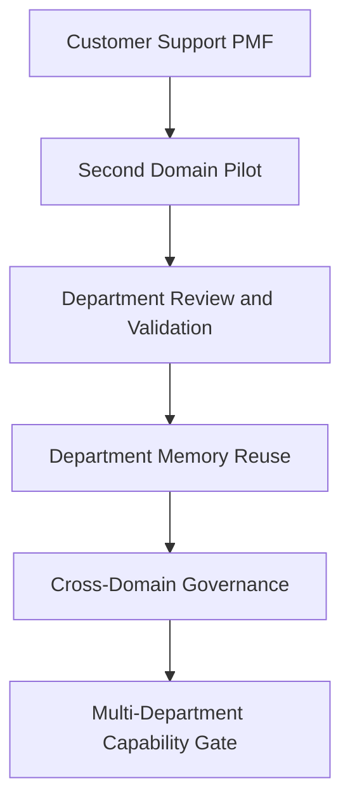

# Multi-Department

## Derived From

- Canon Version: `v1.0.0`
- Architecture Version: `v1.0.0`
- Implementation Version: `v1.0.0`
- Product Version: `v1.0.0`
- Research Version: `v1.0.0`
- Strategy Version: `v1.0.0`
- Roadmap Philosophy Version: `v1.0.0`
- Product-Market Fit Roadmap Version: `v1.0.0`

### Primary Repository Sources

- [Canon](../canon/README.md)
- [Architecture](../architecture/README.md)
- [Implementation](../implementation/README.md)
- [Product](../product/README.md)
- [Research](../research/README.md)
- [Strategy](../strategy/README.md)
- [Roadmap](./README.md)
- [Roadmap Philosophy](./00_ROADMAP_PHILOSOPHY.md)
- [Product-Market Fit](./08_PRODUCT_MARKET_FIT.md)

### Primary Supporting Documents

- [Product Domain Model](../canon/04_PRODUCT_DOMAIN_MODEL.md)
- [Product Workflow Model](../canon/05_PRODUCT_WORKFLOW_MODEL.md)
- [AI Cognitive Model](../canon/06_AI_COGNITIVE_MODEL.md)
- [Data Architecture](../architecture/09_DATA_ARCHITECTURE.md)
- [Knowledge Representation Model](../architecture/10_KNOWLEDGE_REPRESENTATION_MODEL.md)
- [Integration Architecture](../architecture/11_INTEGRATION_ARCHITECTURE.md)
- [Implementation Architecture](../implementation/13_IMPLEMENTATION_ARCHITECTURE.md)
- [Product Strategy](../product/01_PRODUCT_STRATEGY.md)
- [Product Metrics](../product/10_PRODUCT_METRICS.md)
- [Product Governance](../product/11_PRODUCT_GOVERNANCE.md)
- [Customer Discovery](../research/02_CUSTOMER_DISCOVERY.md)
- [Experiments](../research/09_EXPERIMENTS.md)
- [Business Model](../strategy/05_BUSINESS_MODEL.md)
- [Growth Strategy](../strategy/07_GROWTH_STRATEGY.md)
- [Competitive Strategy](../strategy/06_COMPETITIVE_STRATEGY.md)
- [Customer Support MVP](./06_CUSTOMER_SUPPORT_MVP.md)
- [Knowledge Flywheel](./07_KNOWLEDGE_FLYWHEEL.md)

---

Status: **Active**

## Primary Question

How should the platform expand from Customer Support into adjacent departments without becoming a collection of disconnected workflows?

This document defines the Multi-Department roadmap for the Organizational Intelligence Platform.

The company enters this phase only after early Product-Market Fit evidence in Customer Support. The purpose of this phase is to determine whether the same governed learning mechanism can generalize across additional organizational functions without diluting the platform's identity.

## 1. Executive Summary

Multi-Department expansion begins only after Customer Support Product-Market Fit evidence.

The platform expands because Organizational Entropy exists across departments, not because the company should build a disconnected application for every function. Expansion must preserve the same core operating system:

`Work -> Evidence -> Knowledge Candidate -> Human Review -> Validation -> Organizational Memory -> Future Reuse`

This roadmap therefore defines how the company should extend the Organizational Intelligence Platform into adjacent departments while preserving:

- the Knowledge Flywheel;
- Human Review;
- Governance;
- Explainability;
- Organizational Memory.

The purpose is not departmental diversification for its own sake. The purpose is to prove that the same category mechanism remains valuable across multiple knowledge-intensive functions.

## 2. Purpose of Multi-Department Expansion

The goal of Multi-Department expansion is to prove that the platform is not limited to Customer Support.

This phase should validate that the Organizational Intelligence Platform can support multiple knowledge-intensive functions while preserving:

- shared memory;
- governance;
- explainability;
- trust;
- domain-specific review;
- permission-aware access.

If successful, this phase demonstrates that the company has built a true platform for governed organizational learning rather than a narrow support product with limited extension potential.

## 3. Relationship to Customer Support PMF

Customer Support Product-Market Fit provides the evidence foundation for Multi-Department expansion, but it does not prove cross-functional generalization by itself.

| Customer Support PMF Proves | Multi-Department Must Prove |
| --- | --- |
| One domain flywheel works | Flywheel generalizes across domains |
| Support experts can review | Department experts can review |
| Support memory creates value | Cross-functional memory creates value |
| Support workflows fit | Multiple workflows can coexist |
| One ICP is validated | Expansion ICPs can be identified |

The logic of this transition is important.

Customer Support proves that a focused segment values governed memory. Multi-Department must prove that this value is not isolated to one department and that cross-functional expansion strengthens rather than fragments the platform.

## 4. Expansion Principle

The company should not expand by building unrelated department modules.

It should expand by applying the same Organizational Intelligence mechanism to new domains where work repeatedly creates reusable knowledge.

The expansion principle is therefore:

- same core model;
- new operational domain;
- domain-specific reviewers;
- domain-specific governance;
- shared platform architecture;
- shared Organizational Memory layer where appropriate.

If the company expands by creating disconnected department tools, it will weaken category clarity, product coherence, and long-term defensibility.

## 5. Department Expansion Sequence

The recommended sequence for department expansion is:

1. Customer Support
2. IT Service Management
3. HR
4. Legal
5. Finance
6. Operations
7. Organization-wide Intelligence

This sequence may change based on customer evidence, but the ordering reflects increasing complexity and governance requirements layered on a validated base.

| Sequence | Why It Follows Logically |
| --- | --- |
| Customer Support | Proven beachhead with repeated work, visible pain, and strong reuse opportunities. |
| IT Service Management | Similar repetition, case structure, escalation patterns, and operational knowledge reuse. |
| HR | Strong recurring questions and high policy interpretation value with higher sensitivity. |
| Legal | High-governance knowledge domain requiring stricter review and authority boundaries. |
| Finance | Strong traceability and consistency needs with audit-heavy operational knowledge. |
| Operations | Broad cross-functional learning environment requiring more mature shared governance. |
| Organization-wide Intelligence | Emerges only after several domains contribute governed memory coherently. |

The expansion sequence should follow evidence, not internal preference. Each new domain should be validated before the next broadening step.

## 6. Department Fit Criteria

A department should be considered for expansion only when it meets clear fit criteria.

| Criterion | Why It Matters |
| --- | --- |
| Repeated work | Repetition is required for reusable knowledge and measurable flywheel value. |
| Available evidence | The domain must produce traceable operational artifacts that can support review and validation. |
| Human review capacity | The domain needs experts or accountable reviewers who can validate learning. |
| Measurable pain | The organization must experience visible entropy, repeated questions, or repeated rediscovery. |
| Knowledge complexity | The domain should benefit from preserved context, exceptions, rationale, and memory reuse. |
| Governance need | The domain should require trust, explainability, and controlled authority rather than pure automation. |
| Organizational urgency | Expansion should solve a meaningful customer problem rather than a speculative one. |
| Integration feasibility | The platform must be able to receive or represent operational work without excessive bespoke effort. |
| Expansion pull from existing customers | Strong demand from validated customers is a better guide than abstract adjacency. |

These criteria should be used as a scorecard for expansion discipline, not as a loose checklist.

## 7. IT Service Management Roadmap

IT Service Management is the natural second domain because it shares many structural properties with Customer Support:

- repeated incidents;
- service requests;
- root cause analysis;
- runbooks;
- fixes;
- escalations;
- recurring issues.

ITSM should be treated as the second domain because it provides a strong test of whether the platform can generalize to another operational function with similar workflow density but different terminology and technical evidence.

### Capabilities to Validate

- incident-to-candidate flow;
- expert review;
- runbook memory;
- repeated issue reduction;
- operational knowledge reuse.

ITSM succeeds as an expansion domain when incidents and recurring operational issues can become governed memory that improves future IT work without collapsing into generic ticket tooling.

## 8. HR Roadmap

HR is a governed knowledge domain with recurring questions, policy interpretation needs, and sensitive employee-facing workflows.

Representative work may include:

- policy questions;
- employee cases;
- onboarding;
- manager guidance;
- benefits questions;
- repeated employee support issues.

### Capabilities to Validate

- sensitive data handling;
- policy interpretation review;
- HR reviewer governance;
- onboarding memory;
- explainable guidance.

HR is important because it tests whether the platform can preserve trust and reuse in a domain where knowledge is highly contextual, policy-sensitive, and identity-sensitive.

## 9. Legal Roadmap

Legal is a high-governance domain where trust, authority, and confidentiality become even more central.

Representative work may include:

- clause interpretation;
- contract review lessons;
- matter knowledge;
- precedent;
- risk decisions;
- approval rationale.

### Capabilities to Validate

- strict review;
- evidence preservation;
- authority boundaries;
- confidentiality;
- legal knowledge memory.

Legal expansion matters because it tests whether the platform can operate in a domain where memory value is high but the cost of weak governance is unacceptable.

## 10. Finance Roadmap

Finance is a traceability-heavy domain where exceptions, rationale, and policy consistency matter significantly.

Representative work may include:

- exceptions;
- approval rationale;
- reconciliations;
- policy interpretation;
- controls;
- vendor or payment issues.

### Capabilities to Validate

- audit-friendly memory;
- approval evidence;
- policy consistency;
- finance reviewer workflows.

Finance is important because it tests whether the platform can preserve durable operational intelligence in environments where auditability and control discipline are essential.

## 11. Operations Roadmap

Operations is a cross-functional learning domain where repeated coordination failures, process exceptions, and recurring decisions often span teams.

Representative work may include:

- process exceptions;
- vendor issues;
- quality problems;
- logistics issues;
- repeated coordination failures;
- operational decisions.

### Capabilities to Validate

- process exception memory;
- cross-team evidence;
- operational pattern detection;
- reusable resolution guidance.

Operations matters because it tests whether the platform can preserve and reuse knowledge across workflows that are broader, less standardized, and more cross-functional than earlier domains.

## 12. Cross-Department Organizational Memory

Organizational Memory becomes more valuable when multiple departments contribute to it, but it also becomes more complex.

The platform should therefore preserve:

- shared terminology where appropriate;
- domain boundaries;
- knowledge ownership;
- cross-functional reuse;
- permission-aware access;
- governance differences;
- conflict resolution.

| Memory Dimension | Multi-Department Requirement |
| --- | --- |
| Shared terminology | Common concepts should be harmonized where meaningful, not forced artificially. |
| Domain boundaries | Knowledge should remain scoped so departments do not confuse authority or applicability. |
| Knowledge ownership | Each memory item should preserve which domain and authority controls it. |
| Cross-functional reuse | Memory should be reusable across departments when permissions, context, and applicability allow. |
| Permission-aware access | Retrieval should respect departmental sensitivity and role boundaries. |
| Governance differences | A shared platform must still allow different validation and lifecycle rules by domain. |
| Conflict resolution | Contradictory knowledge across departments should be reviewable, explainable, and governable. |

Cross-Department Organizational Memory is not a single undifferentiated knowledge pool. It is a connected but governed memory system.

## 13. Governance Across Departments

Governance becomes more complex as the platform expands across departments.

Each department may have different:

- reviewers;
- risk levels;
- data sensitivity;
- approval rules;
- retention needs;
- authority boundaries.

The platform therefore needs domain-specific governance without breaking shared architecture.

| Governance Dimension | Multi-Department Need |
| --- | --- |
| Review responsibility | Different departments require different accountable experts. |
| Risk level | Legal and Finance may require stronger controls than Support or ITSM. |
| Data sensitivity | HR and Legal workflows may require tighter access boundaries. |
| Approval rules | Validation may require different role authority by domain. |
| Retention needs | Memory and evidence retention rules may differ by function. |
| Authority boundaries | Some domains may allow advisory reuse broadly while restricting authoritative change rights. |

Governance should therefore become more granular, not more chaotic. Expansion should increase control sophistication while preserving platform coherence.

## 14. AI Across Departments

AI must remain bounded across all departments.

AI may assist differently by domain, but it must always respect:

- permissions;
- evidence;
- human review;
- governance;
- uncertainty;
- domain authority.

| Domain | AI Assistance Role | Boundary |
| --- | --- | --- |
| ITSM | Summarize incidents, cluster recurring failures, draft runbook candidates. | Cannot bypass technical reviewer authority or publish operational memory directly. |
| HR | Prepare policy context, surface similar cases, draft onboarding knowledge candidates. | Cannot act as authoritative HR policy source without validation. |
| Legal | Summarize clause patterns, gather precedent context, draft candidate interpretations. | Cannot define legal position, authority, or risk outcome directly. |
| Finance | Summarize exception patterns, prepare approval context, surface control-related candidates. | Cannot approve financial interpretation or override control review. |
| Operations | Detect repeated coordination patterns, summarize exception history, draft process guidance candidates. | Cannot substitute for domain owners where cross-functional decisions carry operational risk. |

The AI principle does not change with domain expansion. Only the evidence sources, reviewers, and governance requirements change.

## 15. Multi-Department Metrics

The Multi-Department roadmap should be evaluated through platform-level expansion metrics.

| Metric | Why It Matters |
| --- | --- |
| Departments Onboarded | Shows how many domains have begun structured expansion. |
| Knowledge Domains Created | Shows whether memory is being organized coherently across functions. |
| Candidates by Department | Shows whether each domain is generating learning from real work. |
| Validation Rate by Department | Shows whether candidate quality and review fit hold across domains. |
| Reuse Rate Within Department | Shows whether each domain's memory improves later work locally. |
| Cross-Department Reuse | Shows whether the platform is creating broader organizational intelligence rather than isolated silos. |
| Reviewer Engagement by Department | Shows whether Human Review remains sustainable as the platform broadens. |
| Governance Exceptions | Shows whether expansion is introducing trust, permission, or policy failures. |
| Expansion Revenue Signal | Shows whether multi-domain value creates commercial expansion pressure. |
| Executive Sponsorship | Shows whether cross-functional value is recognized by organizational leadership. |

These metrics should be compared by department and by cross-department pattern. The purpose is not only to count breadth, but to determine whether breadth preserves quality.

## 16. Capability Gate

Multi-Department expansion is validated only when a second domain proves the same governed learning loop and the shared platform remains coherent.

Multi-Department expansion is validated when:

- at least one non-support department completes a full Knowledge Flywheel;
- department-specific reviewers participate;
- validated memory is reused;
- governance works across domains;
- users understand domain boundaries;
- cross-functional value appears;
- expansion does not weaken the Customer Support foundation.

This gate should be crossed only when the company can show that domain expansion strengthens the platform rather than turning it into a fragmented suite.

## 17. Risks

The Multi-Department roadmap carries several significant risks.

| Risk | Why It Matters |
| --- | --- |
| Expanding too early | The company may dilute a still-fragile base before the platform is ready. |
| Becoming generic workflow software | Cross-domain breadth may weaken category identity and product coherence. |
| Weak domain understanding | Poor domain judgment can create low-value or unsafe expansion efforts. |
| Governance complexity | More domains can multiply policy, review, and lifecycle complexity. |
| Permission failures | Cross-domain access mistakes can undermine trust and create material risk. |
| Over-customization | Customer-specific domain adaptations may fracture platform integrity. |
| Department-specific silos | Expansion may recreate the fragmentation the platform is meant to solve. |
| AI misuse in sensitive domains | Weakly bounded AI can create serious trust and compliance issues. |
| Losing category clarity | Customers may begin to interpret the platform as a loose bundle of tools rather than a governed intelligence platform. |

These risks should be managed through sequence discipline, domain scorecards, governance maturity, and careful pilot design.

## 18. Deliverables

The Multi-Department roadmap should produce the following outputs:

- department expansion framework;
- domain fit scorecard;
- ITSM pilot plan;
- HR pilot hypothesis;
- Legal and Finance risk assessment;
- cross-department governance model;
- multi-domain metrics dashboard;
- expansion evidence report.

These deliverables matter because expansion should create reusable organizational knowledge about how the platform generalizes, not only new sales opportunities.

## 19. Relationship to Enterprise Foundation

Multi-Department expansion creates the need for stronger enterprise capabilities.

As the platform supports additional departments, the company should strengthen:

- RBAC;
- audit;
- policy management;
- advanced governance;
- administration;
- compliance;
- integrations;
- reporting.

| Enterprise Capability | Why Multi-Department Expansion Requires It |
| --- | --- |
| RBAC | Different departments require different access and authority boundaries. |
| Audit | Cross-domain trust depends on traceable actions, reviews, and changes. |
| Policy management | Domain-specific rules must be representable without breaking shared structure. |
| Advanced governance | More domains require more granular validation, lifecycle, and ownership control. |
| Administration | Multi-domain operation requires clearer workspace and configuration management. |
| Compliance | Sensitive functions create stronger regulatory and operational expectations. |
| Integrations | Departmental workflows depend on different operational systems as evidence sources. |
| Reporting | Leadership needs visibility into memory quality, reuse, and governance across domains. |

These capabilities should be interpreted as foundation-strengthening requirements for platform maturity, not as a separate product identity.

## 20. Traceability Matrix

The Multi-Department roadmap should remain traceable to the broader repository.

| Source | Multi-Department Derivation |
| --- | --- |
| [Canon](../canon/README.md) | Defines the enduring platform identity, including Organizational Memory, Human Review, Governance, and the Knowledge Flywheel that must remain unchanged across domains. |
| [Product Domain Model](../canon/04_PRODUCT_DOMAIN_MODEL.md) | Defines the conceptual boundaries between domains, entities, and organizational meaning required for cross-functional coherence. |
| [Product Workflow Model](../canon/05_PRODUCT_WORKFLOW_MODEL.md) | Defines the shared work-to-memory lifecycle that each department must instantiate. |
| [AI Cognitive Model](../canon/06_AI_COGNITIVE_MODEL.md) | Defines AI as bounded advisory support across every department. |
| [Data Architecture](../architecture/09_DATA_ARCHITECTURE.md) | Defines how multi-domain evidence, candidates, validation, and memory should remain connected and traceable. |
| [Knowledge Representation Model](../architecture/10_KNOWLEDGE_REPRESENTATION_MODEL.md) | Defines how domain knowledge should be represented without collapsing context, provenance, or authority. |
| [Product Strategy](../product/01_PRODUCT_STRATEGY.md) | Defines the long-term product direction that Multi-Department expansion should extend rather than replace. |
| [Product Governance](../product/11_PRODUCT_GOVERNANCE.md) | Defines the control principles that must scale with domain breadth. |
| [Product Metrics](../product/10_PRODUCT_METRICS.md) | Defines the platform metrics vocabulary for reuse, review, memory growth, and capability improvement. |
| [Business Model](../strategy/05_BUSINESS_MODEL.md) | Defines why expanding across departments matters economically after PMF is proven. |
| [Growth Strategy](../strategy/07_GROWTH_STRATEGY.md) | Defines how controlled expansion should follow validated market foundations. |
| [Competitive Strategy](../strategy/06_COMPETITIVE_STRATEGY.md) | Defines why coherent multi-domain learning is strategically more defensible than disconnected tools. |
| [Roadmap Philosophy](./00_ROADMAP_PHILOSOPHY.md) | Defines capability-gated, evidence-driven expansion. |
| [Product-Market Fit](./08_PRODUCT_MARKET_FIT.md) | Defines the Customer Support PMF gate that must be crossed before domain expansion begins. |

## 21. What This Document Does NOT Define

This document intentionally does not define:

- final department product specs;
- full enterprise readiness;
- global GTM;
- pricing per department;
- complete compliance program;
- mature partner ecosystem.

Those belong to later phases or other repository layers.

This document defines only how the platform should generalize across departments without losing its identity or governance discipline.

## 22. Closing

Multi-Department expansion succeeds only when the same governed learning mechanism proves useful across multiple organizational functions without diluting the platform's identity.

That is the standard this roadmap exists to enforce.
