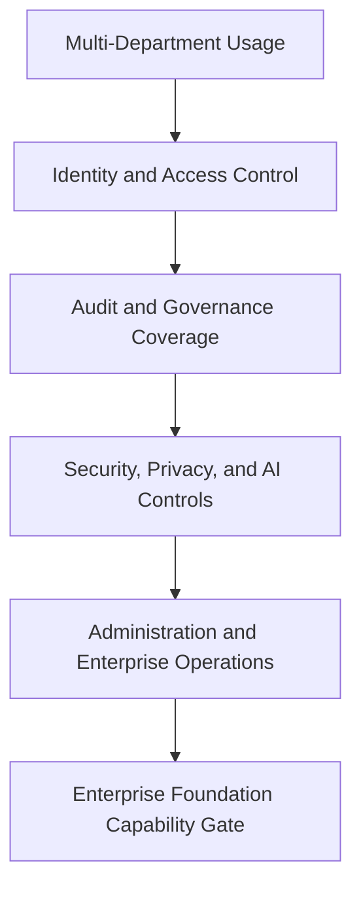

# Enterprise Foundation

## Derived From

- Canon Version: `v1.0.0`
- Architecture Version: `v1.0.0`
- Implementation Version: `v1.0.0`
- Product Version: `v1.0.0`
- Research Version: `v1.0.0`
- Strategy Version: `v1.0.0`
- Roadmap Philosophy Version: `v1.0.0`
- Multi-Department Roadmap Version: `v1.0.0`

### Primary Repository Sources

- [Canon](../canon/README.md)
- [Architecture](../architecture/README.md)
- [Implementation](../implementation/README.md)
- [Product](../product/README.md)
- [Research](../research/README.md)
- [Strategy](../strategy/README.md)
- [Roadmap](./README.md)
- [Roadmap Philosophy](./00_ROADMAP_PHILOSOPHY.md)
- [Multi-Department](./09_MULTI_DEPARTMENT.md)

### Primary Supporting Documents

- [AI Cognitive Model](../canon/06_AI_COGNITIVE_MODEL.md)
- [API Architecture](../implementation/15_API_ARCHITECTURE.md)
- [Storage Architecture](../implementation/16_STORAGE_ARCHITECTURE.md)
- [Security Architecture](../implementation/18_SECURITY_ARCHITECTURE.md)
- [Data Architecture](../architecture/09_DATA_ARCHITECTURE.md)
- [Knowledge Representation Model](../architecture/10_KNOWLEDGE_REPRESENTATION_MODEL.md)
- [Integration Architecture](../architecture/11_INTEGRATION_ARCHITECTURE.md)
- [Technology Research](../research/06_TECHNOLOGY_RESEARCH.md)
- [Regulatory Research](../research/07_REGULATORY_RESEARCH.md)
- [Product Governance](../product/11_PRODUCT_GOVERNANCE.md)
- [Product Metrics](../product/10_PRODUCT_METRICS.md)
- [Business Model](../strategy/05_BUSINESS_MODEL.md)
- [Competitive Strategy](../strategy/06_COMPETITIVE_STRATEGY.md)
- [Growth Strategy](../strategy/07_GROWTH_STRATEGY.md)
- [Product-Market Fit](./08_PRODUCT_MARKET_FIT.md)

---

Status: **Active**

## Primary Question

What enterprise-grade capabilities must exist before the Organizational Intelligence Platform can become trusted infrastructure for larger organizations?

This document defines the Enterprise Foundation roadmap for the Organizational Intelligence Platform.

Enterprise Foundation is the phase where the platform becomes mature enough to support larger organizations, more sensitive workflows, stronger governance, security expectations, administration, compliance readiness, and operational trust.

## 1. Executive Summary

Enterprise Foundation is the phase where the Organizational Intelligence Platform becomes trustworthy enough for larger, more complex customers.

At this stage, the platform must protect:

- Organizational Memory;
- evidence;
- governance;
- AI behavior;
- customer trust.

The purpose of Enterprise Foundation is not to claim full certification maturity. It is to establish the capability baseline required for enterprise customers to treat the platform as credible operational infrastructure rather than as an early-stage tool.

## 2. Purpose of Enterprise Foundation

Enterprise customers require confidence in:

- security;
- access control;
- compliance;
- reliability;
- auditability;
- governance;
- data protection;
- administration;
- integration;
- operational support.

Enterprise Foundation exists to create that confidence through platform capability maturity.

The goal is to make the platform safe, inspectable, governable, and administrable enough to support larger organizations without compromising the principles that define the product.

## 3. Relationship to Multi-Department Expansion

As the platform spans departments, enterprise controls become mandatory rather than optional.

| Multi-Department Creates | Enterprise Foundation Provides |
| --- | --- |
| More users | Identity and access control |
| More sensitive knowledge | Security and privacy |
| More reviewers | Governance administration |
| More workflows | Audit and observability |
| More departments | Domain and role boundaries |
| More AI usage | AI governance controls |

Multi-Department expansion proves that the platform can generalize. Enterprise Foundation proves that the generalized platform can be trusted at greater scale, sensitivity, and organizational complexity.

## 4. Enterprise Trust Principles

Enterprise Foundation should follow a small set of explicit trust principles.

- Trust before scale
- Least privilege
- Human accountability
- Evidence preservation
- Auditability by design
- Privacy by design
- Governance by design
- AI is observable and bounded
- Customer control
- Operational reliability

These principles should shape how enterprise capability is added. Enterprise maturity should strengthen the platform's identity rather than pull it toward opaque automation or uncontrolled complexity.

## 5. Identity and Access Management

Enterprise Foundation should define a credible identity and access baseline.

Core capabilities include:

- authentication;
- organization membership;
- roles;
- permissions;
- workspace access;
- reviewer access;
- admin access;
- future SSO readiness;
- identity audit trails.

### Success Criteria

- users access only authorized data;
- actions are attributable;
- roles support review and governance;
- an enterprise identity integration path exists.

Identity and access management matters because enterprise trust begins with clear control over who can see, change, validate, or administer governed knowledge.

## 6. Role-Based Access Control

RBAC is central to enterprise trust because knowledge, evidence, review, and memory cannot be treated as universally accessible.

Representative role patterns may include:

- Admin;
- Workspace Owner;
- Support Agent;
- Reviewer;
- Knowledge Manager;
- Executive Viewer;
- Integration Admin;
- AI System Actor.

RBAC matters because permissions determine:

- who can create candidates;
- who can review or validate;
- who can change governance settings;
- who can access sensitive memory;
- which system actors can retrieve or act on context.

Enterprise readiness requires permissions that are explicit enough to support accountability without making the platform operationally unusable.

## 7. Tenancy and Data Boundaries

Enterprise Foundation must define clear tenancy and boundary behavior.

Important capabilities include:

- organization isolation;
- workspace boundaries;
- data separation;
- customer-specific memory;
- permission-aware retrieval;
- integration boundaries.

### Success Criteria

- no cross-customer leakage;
- memory remains customer-specific;
- retrieval respects permissions;
- AI context respects access boundaries.

Tenancy matters because enterprise trust fails immediately if organizational boundaries are ambiguous or weak.

## 8. Auditability

Audit is central to enterprise trust.

The platform should make it possible to understand:

- who created a candidate;
- what evidence was used;
- what AI generated;
- who reviewed;
- who approved, rejected, or revised;
- when memory changed;
- what version changed;
- who accessed sensitive knowledge.

### Success Criteria

- important knowledge lifecycle events are logged;
- audit records support trust and investigation;
- memory changes are explainable.

Auditability matters because enterprise customers need to investigate behavior, explain decisions, and defend trust boundaries over time.

## 9. Governance Administration

Enterprise customers need configurable governance rather than a single hardcoded review model.

Core governance administration capabilities include:

- review workflows;
- approval rules;
- domain ownership;
- knowledge lifecycle status;
- validation policies;
- retention assumptions;
- escalation rules;
- conflict handling.

### Success Criteria

- governance can vary by domain;
- review responsibilities are clear;
- memory promotion follows policy;
- rejected or deprecated knowledge remains traceable.

Governance administration matters because enterprise customers often need the same platform to support different risk models across different parts of the organization.

## 10. Security Foundation

Enterprise Foundation should define a practical security capability roadmap without overclaiming maturity.

Important capability areas include:

- secure authentication;
- access control;
- encryption assumptions;
- secure storage;
- secrets management;
- vulnerability awareness;
- secure AI tool access;
- incident response foundation;
- dependency risk awareness.

Security Foundation does not require claiming a certification that has not been earned. It requires a credible, inspectable posture for protecting customer data, memory, workflow integrity, and operational trust.

## 11. Privacy and Data Protection

Enterprise customers require stronger data protection capabilities as the platform grows.

Important privacy capabilities include:

- data inventory;
- processing purpose awareness;
- data minimization;
- retention policies;
- deletion, correction, and export path;
- sensitive data redaction;
- subprocessor awareness;
- cross-border transfer awareness.

This is especially important for an Indonesia-first platform that may later serve customers with broader jurisdictional expectations.

Privacy and data protection should therefore be treated as enduring platform responsibilities, not as a late compliance add-on.

## 12. AI Governance

Enterprise Foundation must make AI behavior more governable and more inspectable.

Important AI governance capabilities include:

- prompt and model versioning;
- retrieved context logging;
- AI output traceability;
- human approval for memory changes;
- tool access controls;
- AI risk classification;
- evaluation records;
- failure reporting;
- hallucination mitigation through evidence and review.

AI governance matters because enterprise buyers will not trust advanced AI assistance unless the platform can explain what the AI saw, what it suggested, and what humans accepted or rejected.

## 13. Observability and Reliability

Enterprise customers need operational confidence.

Important capabilities include:

- logs;
- metrics;
- traces;
- error tracking;
- uptime monitoring;
- job monitoring;
- AI latency and cost visibility;
- workflow failure alerts.

### Success Criteria

- system behavior is inspectable;
- failures are detected;
- core workflows are recoverable.

Observability and reliability matter because enterprise customers need evidence that the platform can be operated responsibly, not merely that the product works under ideal conditions.

## 14. Data Lifecycle Management

Enterprise Foundation should define lifecycle maturity across the major platform artifacts:

- raw evidence;
- Knowledge Candidates;
- validated knowledge;
- Organizational Memory;
- archived memory;
- rejected candidates;
- AI outputs;
- audit logs.

### Success Criteria

- memory is durable;
- stale knowledge can be flagged;
- deprecated knowledge remains traceable;
- retention is controllable.

Data lifecycle management matters because enterprise trust depends not only on how knowledge is created, but on how it changes, expires, is retained, and remains explainable over time.

## 15. Enterprise Integrations

Enterprise readiness requires stronger integration discipline.

Integration readiness should include:

- help desk;
- CRM;
- identity provider;
- document systems;
- collaboration tools;
- ITSM;
- analytics.

### Success Criteria

- integrations preserve evidence;
- external systems do not bypass governance;
- every intake becomes a Knowledge Candidate first.

Enterprise integrations matter because customers will judge the platform partly by whether it can fit their operational environment without compromising trust boundaries.

## 16. Enterprise Administration

Enterprise customers need clearer administrative capability than earlier phases require.

Important administration capabilities include:

- organization settings;
- workspace management;
- user management;
- role management;
- domain settings;
- integration settings;
- audit views;
- governance configuration;
- company profile and layout configuration where appropriate.

Administration matters because enterprise trust depends not only on backend controls, but on whether customer administrators can operate and govern the platform responsibly.

## 17. Enterprise Metrics

Enterprise Foundation should be measured through capability-oriented operational metrics.

| Metric | Why It Matters |
| --- | --- |
| Active Organizations | Shows whether enterprise-capable accounts are actually operating on the platform. |
| Active Workspaces | Shows whether enterprise structures are being used in practice. |
| Review Completion | Shows whether trust workflows remain sustainable at greater scale. |
| Access Violations | Shows whether permission boundaries are holding or failing. |
| Audit Coverage | Shows whether major lifecycle events are sufficiently observable. |
| Governance Policy Usage | Shows whether customers are actually applying configurable governance. |
| Memory Reuse | Shows whether enterprise maturity still preserves the core value loop. |
| Integration Health | Shows whether enterprise integrations remain operational and trustworthy. |
| AI Review Override Rate | Shows whether AI assistance remains appropriately bounded and challengeable. |
| Incident Count | Shows operational risk exposure and platform stability pressure. |
| Time to Resolution | Shows how effectively incidents or major platform issues are handled. |

These metrics should show whether enterprise maturity strengthens trust without weakening the platform's core learning value.

## 18. Capability Gate

Enterprise Foundation is validated only when the platform's trust posture is strong enough to support larger organizations responsibly.

Enterprise Foundation is validated when:

- identity and access control are reliable;
- audit events cover major lifecycle actions;
- governance settings exist;
- privacy and security risks are documented and addressed;
- enterprise admin workflows exist;
- AI usage is traceable and reviewable;
- multi-department customers can use the platform safely;
- enterprise buyers can understand the trust posture.

This gate should be crossed only when the company can show that the platform is credible as trusted organizational infrastructure, not merely as a functional product.

## 19. Risks

The Enterprise Foundation roadmap carries several important risks.

| Risk | Why It Matters |
| --- | --- |
| Premature enterprise sales | Selling ahead of capability maturity can damage trust and credibility. |
| Compliance overclaiming | Overstating readiness can create legal, commercial, and reputational risk. |
| Weak access control | Poor identity boundaries undermine enterprise trust immediately. |
| Insufficient audit | Without auditability, trust, investigation, and explainability weaken. |
| AI data leakage | Weak AI boundaries can expose sensitive customer information or create ungoverned behavior. |
| Governance complexity | Too much governance complexity can make the platform hard to operate or understand. |
| Operational unreliability | Enterprise customers will not tolerate fragile workflow execution. |
| Integration shortcuts | Weak integration discipline can bypass evidence, permissions, or governance. |
| Treating security as later work | Delayed trust capabilities compound risk as customer sensitivity grows. |

These risks should be managed by capability sequencing, clear posture communication, and disciplined architectural boundaries.

## 20. Deliverables

The Enterprise Foundation roadmap should produce the following outputs:

- enterprise readiness checklist;
- RBAC model;
- audit event map;
- governance configuration model;
- privacy and data lifecycle notes;
- AI governance baseline;
- observability dashboard;
- enterprise admin workflows;
- security risk register;
- integration readiness framework.

These deliverables matter because enterprise trust should be preserved as explicit organizational knowledge, not only as implementation effort.

## 21. Relationship to AI Cognitive Evolution

Stronger enterprise controls allow more advanced AI capabilities to be introduced responsibly.

This relationship matters because AI capability should not outrun enterprise governance. Better identity, permissions, auditability, retrieved-context logging, tool controls, and review workflows make it safer to expand:

- AI reasoning depth;
- workflow assistance breadth;
- multi-step automation;
- domain-sensitive retrieval;
- higher-volume AI-supported operations.

Enterprise Foundation therefore does not slow AI evolution. It makes AI cognitive evolution safe enough for real institutional trust.

## 22. Traceability Matrix

Enterprise Foundation should remain traceable to the broader repository.

| Source | Enterprise Foundation Derivation |
| --- | --- |
| [Canon](../canon/README.md) | Defines the enduring trust, Human Review, Governance, Organizational Memory, and explainability principles that enterprise readiness must protect. |
| [Security Architecture](../implementation/18_SECURITY_ARCHITECTURE.md) | Defines the security posture, incident handling logic, and protection requirements that enterprise trust depends on. |
| [API Architecture](../implementation/15_API_ARCHITECTURE.md) | Defines the controlled interfaces through which enterprise identity, integrations, and audit-sensitive operations should occur. |
| [Storage Architecture](../implementation/16_STORAGE_ARCHITECTURE.md) | Defines the storage responsibilities for evidence, memory, logs, and durability. |
| [Integration Architecture](../architecture/11_INTEGRATION_ARCHITECTURE.md) | Defines how external systems participate without bypassing governance or memory boundaries. |
| [AI Cognitive Model](../canon/06_AI_COGNITIVE_MODEL.md) | Defines AI as bounded advisory cognition requiring stronger traceability and control at enterprise scale. |
| [Regulatory Research](../research/07_REGULATORY_RESEARCH.md) | Defines the governance, human oversight, and data protection expectations that enterprise customers will evaluate. |
| [Technology Research](../research/06_TECHNOLOGY_RESEARCH.md) | Defines the infrastructure and architectural patterns appropriate for reliable, auditable platform behavior. |
| [Product Governance](../product/11_PRODUCT_GOVERNANCE.md) | Defines the rules by which configurable governance should remain coherent across customers and domains. |
| [Product Metrics](../product/10_PRODUCT_METRICS.md) | Defines the metrics vocabulary for review, auditability, reuse, reliability, and trust. |
| [Business Model](../strategy/05_BUSINESS_MODEL.md) | Defines why enterprise trust matters economically for expansion, retention, and defensibility. |
| [Competitive Strategy](../strategy/06_COMPETITIVE_STRATEGY.md) | Defines why governed, trustworthy infrastructure is strategically stronger than generic AI tooling. |
| [Growth Strategy](../strategy/07_GROWTH_STRATEGY.md) | Defines how enterprise readiness supports the next stage of controlled growth. |
| [Roadmap Philosophy](./00_ROADMAP_PHILOSOPHY.md) | Defines capability-gated progression, evidence-driven advancement, and validation before expansion. |

## 23. What This Document Does NOT Define

This document intentionally does not define:

- formal SOC 2 certification;
- ISO certification;
- legal advice;
- full compliance program;
- cloud vendor selection;
- final enterprise pricing;
- global deployment architecture;
- mature SRE organization.

Those belong to later phases, external programs, or more specialized operating documentation.

This document defines only the capability maturity required for the platform to become enterprise-trustworthy.

## 24. Closing

Enterprise Foundation exists to make the Organizational Intelligence Platform trustworthy enough to become institutional infrastructure.

That is the standard this roadmap exists to enforce.
