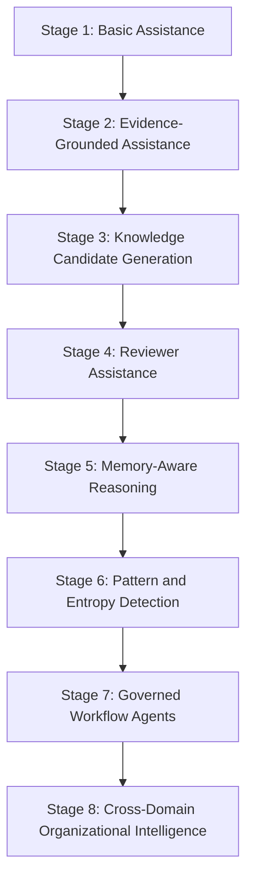
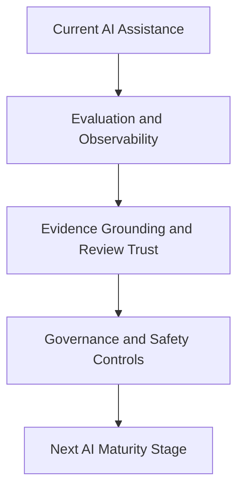

# AI Cognitive Evolution

## Derived From

- Canon Version: `v1.0.0`
- Architecture Version: `v1.0.0`
- Implementation Version: `v1.0.0`
- Product Version: `v1.0.0`
- Research Version: `v1.0.0`
- Strategy Version: `v1.0.0`
- Roadmap Philosophy Version: `v1.0.0`
- Enterprise Foundation Roadmap Version: `v1.0.0`

### Primary Repository Sources

- [Canon](../canon/README.md)
- [Architecture](../architecture/README.md)
- [Implementation](../implementation/README.md)
- [Product](../product/README.md)
- [Research](../research/README.md)
- [Strategy](../strategy/README.md)
- [Roadmap](./README.md)
- [Roadmap Philosophy](./00_ROADMAP_PHILOSOPHY.md)
- [Enterprise Foundation](./10_ENTERPRISE_FOUNDATION.md)

### Primary Supporting Documents

- [AI Cognitive Model](../canon/06_AI_COGNITIVE_MODEL.md)
- [AI Agent Architecture](../architecture/08_AI_AGENT_ARCHITECTURE.md)
- [Data Architecture](../architecture/09_DATA_ARCHITECTURE.md)
- [Knowledge Representation Model](../architecture/10_KNOWLEDGE_REPRESENTATION_MODEL.md)
- [Security Architecture](../implementation/18_SECURITY_ARCHITECTURE.md)
- [AI Research](../research/05_AI_RESEARCH.md)
- [Technology Research](../research/06_TECHNOLOGY_RESEARCH.md)
- [Regulatory Research](../research/07_REGULATORY_RESEARCH.md)
- [Product Governance](../product/11_PRODUCT_GOVERNANCE.md)
- [Product Metrics](../product/10_PRODUCT_METRICS.md)
- [Competitive Strategy](../strategy/06_COMPETITIVE_STRATEGY.md)
- [Knowledge Flywheel](./07_KNOWLEDGE_FLYWHEEL.md)
- [Enterprise Foundation](./10_ENTERPRISE_FOUNDATION.md)

---

Status: **Active**

## Primary Question

How should AI capabilities evolve inside the Organizational Intelligence Platform while preserving Human Review, governance, explainability, and Organizational Memory as the source of trusted knowledge?

This document defines the roadmap for AI maturity across the Organizational Intelligence Platform.

AI is not the product. AI is an enabling capability that helps the platform observe, summarize, reason, classify, detect patterns, draft candidates, assist review, and support organizational learning. This roadmap preserves the core principle that AI is an amplifier, not authority.

## 1. Executive Summary

AI maturity should increase only as governance, evidence, review, and memory maturity increase.

The platform should never evolve from human-reviewed intelligence into ungoverned AI authority. Every increase in AI capability should therefore be matched by stronger controls over:

- evidence grounding;
- reviewability;
- traceability;
- permissions;
- observability;
- Human Review;
- Organizational Memory integrity.

The purpose of this roadmap is to define how AI grows from simple assistance into governed cognitive infrastructure without becoming the identity or authority of the platform.

## 2. AI Role in OIP

Inside the Organizational Intelligence Platform, AI should help:

- observe;
- summarize;
- classify;
- extract;
- compare;
- recommend;
- draft;
- detect patterns;
- assist review;
- retrieve context;
- orchestrate bounded workflows.

AI does not:

- decide institutional truth;
- bypass review;
- become memory by itself;
- replace governance;
- override human accountability.

This distinction matters because the platform's durable trust comes from governed Organizational Memory and accountable human judgment, not from model confidence or output fluency.

## 3. Relationship to AI Cognitive Model

The Canon and AI Cognitive Model define AI's conceptual role. This roadmap defines how AI capability matures over time.

| AI Cognitive Model Defines | Roadmap Evolves |
| --- | --- |
| AI as assistant | Increasing assistance maturity |
| AI reasons over validated memory | Memory-aware AI workflows |
| AI cannot be authority | Governance and review boundaries |
| AI supports humans | Reviewer and operator assistance |

The AI Cognitive Model therefore remains the conceptual source of truth. This document only defines how that model is operationalized progressively and safely.

## 4. AI Maturity Stages

AI capability should evolve through bounded stages rather than through ungoverned leaps.

| Stage | Purpose | Capabilities | Required Controls | Success Evidence | Risks |
| --- | --- | --- | --- | --- | --- |
| Stage 1 - Basic Assistance | Reduce low-risk cognitive effort. | Summaries, classifications, drafts, simple explanations, navigation help. | Visible AI labeling, no automatic memory updates, mandatory human review. | Users save time on routine cognitive work without trust confusion. | Users over-trust fluent output or mistake drafts for validated knowledge. |
| Stage 2 - Evidence-Grounded Assistance | Make AI outputs more inspectable and trustworthy. | Evidence citation, source linking, uncertainty exposure, context package assembly. | Evidence requirement, source traceability, retrieval permission checks. | Outputs can be inspected against source material directly. | Evidence may be incomplete, weakly linked, or permission handling may be inconsistent. |
| Stage 3 - Knowledge Candidate Generation | Help convert work into candidate learning. | Candidate drafting, reusable pattern extraction, documentation gap detection, category suggestion. | All candidates require review, source evidence preserved, confidence cannot equal validation. | AI-generated candidates are useful enough to review and often improve throughput. | Candidate noise rises or weak candidates burden reviewers. |
| Stage 4 - Reviewer Assistance | Strengthen reviewer quality and efficiency. | Evidence comparison, contradiction flagging, missing assumption detection, similar memory surfacing, reviewer question suggestions. | Reviewer remains decision-maker, rationale capture, AI suggestions remain optional. | Review quality improves without collapsing reviewer accountability. | Reviewers may defer too heavily to AI suggestions. |
| Stage 5 - Memory-Aware Reasoning | Increase usefulness by reasoning over validated memory. | Reasoning over Organizational Memory, governance-aware retrieval, provenance display, memory-preferred context selection. | Memory authority levels, freshness metadata, permission-aware retrieval, uncertainty disclosure. | AI outputs rely more on validated memory than on ungoverned raw context. | Stale or mis-scoped memory may be reused incorrectly if controls are weak. |
| Stage 6 - Pattern and Entropy Detection | Detect organizational learning needs earlier. | Repeated issue detection, duplicate investigation discovery, stale knowledge detection, contradiction surfacing, expert bottleneck identification. | Pattern outputs remain candidates, human confirmation required, metrics-backed validation. | AI helps surface meaningful learning opportunities across workflows. | Pattern detection may create false positives or encourage premature automation. |
| Stage 7 - Governed Workflow Agents | Allow bounded action inside governed workflows. | Review task preparation, routing, reviewer notification, evidence packaging, draft updates, low-risk workflow triggering. | Least privilege, tool access governance, approval for high-risk actions, audit logging, rollback paths. | Agents reduce operational coordination burden without violating trust controls. | Excessive agency, hidden side effects, or weak tool boundaries may undermine trust. |
| Stage 8 - Cross-Domain Organizational Intelligence | Support higher-order synthesis across domains. | Cross-domain pattern synthesis, relationship suggestion, executive insight support, governed multi-domain reasoning. | Strict permissions, domain ownership, governance conflict handling, explainability, audit. | AI helps the organization learn across domains while respecting boundaries. | Cross-domain leakage, governance confusion, or false synthesis may create institutional risk. |

## 5. Stage 1 - Basic Assistance

Stage 1 focuses on low-risk AI assistance.

Core capabilities include:

- summarize cases;
- classify content;
- draft candidate text;
- generate simple explanations;
- help users navigate.

### Controls

- visible AI labeling;
- no automatic memory updates;
- human review required.

Stage 1 succeeds when AI saves time without changing the platform's trust model.

## 6. Stage 2 - Evidence-Grounded Assistance

Stage 2 strengthens output quality by grounding AI assistance in inspectable evidence.

Core capabilities include:

- cite evidence;
- link outputs to source material;
- expose uncertainty;
- assemble context packages.

### Controls

- evidence required;
- source traceability;
- retrieval permission checks.

Stage 2 succeeds when users and reviewers can inspect not only what AI said, but why it said it and what source material it relied on.

## 7. Stage 3 - Knowledge Candidate Generation

Stage 3 moves AI deeper into the learning loop by helping generate candidate organizational learning.

Core capabilities include:

- identify reusable learning;
- extract resolution patterns;
- detect documentation gaps;
- draft Knowledge Candidates;
- suggest candidate category.

### Controls

- all candidates require review;
- source evidence preserved;
- AI confidence cannot equal validation.

Stage 3 succeeds when AI increases candidate throughput or clarity without weakening review quality or evidence integrity.

## 8. Stage 4 - Reviewer Assistance

Stage 4 helps reviewers perform better judgment rather than replacing them.

Core capabilities include:

- compare candidate to evidence;
- identify missing assumptions;
- flag contradictions;
- suggest questions for reviewer;
- show similar validated memory.

### Controls

- reviewer remains decision-maker;
- review rationale captured;
- AI suggestions are optional.

Stage 4 succeeds when reviewers become faster or more consistent while remaining clearly accountable for the final decision.

## 9. Stage 5 - Memory-Aware Reasoning

Stage 5 makes AI more useful by grounding reasoning in validated Organizational Memory rather than relying primarily on raw data.

Core capabilities include:

- reason over validated Organizational Memory;
- prefer validated knowledge over raw data;
- use governance status in retrieval;
- expose provenance and history.

### Controls

- memory authority levels;
- freshness metadata;
- permission-aware retrieval;
- uncertainty disclosure.

Stage 5 succeeds when AI becomes more organizationally useful because it is more memory-aware, not because it is given more unbounded authority.

## 10. Stage 6 - Pattern and Entropy Detection

Stage 6 helps the platform surface organizational learning opportunities earlier and more systematically.

Core capabilities include:

- detect repeated issues;
- identify duplicate investigations;
- surface stale knowledge;
- find contradictory knowledge;
- identify expert bottlenecks;
- suggest areas for review.

### Controls

- pattern outputs are candidates;
- human confirmation required;
- metrics support validation.

Stage 6 succeeds when AI helps the organization see entropy, decay, or learning gaps that would otherwise remain hidden, while keeping those signals inside governed review paths.

## 11. Stage 7 - Governed Workflow Agents

Stage 7 introduces bounded AI-driven workflow action.

Core capabilities include:

- prepare review tasks;
- route candidates;
- notify reviewers;
- create draft updates;
- assemble evidence packages;
- trigger low-risk workflows.

### Controls

- least privilege;
- tool access governance;
- approval for high-risk actions;
- audit logging;
- rollback or correction paths.

Stage 7 succeeds when agents reduce coordination burden without becoming hidden operators of institutional authority.

## 12. Stage 8 - Cross-Domain Organizational Intelligence

Stage 8 supports synthesis across departments while preserving governance and domain boundaries.

Core capabilities include:

- identify learning across Support, ITSM, HR, Legal, Finance, and Operations;
- preserve domain boundaries;
- suggest cross-functional knowledge relationships;
- support executive insight from validated memory.

### Controls

- strict permissions;
- domain ownership;
- governance conflict handling;
- explainability and audit.

Stage 8 succeeds when AI helps reveal organizational intelligence across domains without silently collapsing boundaries or authority structures.

## 13. Model Abstraction Roadmap

AI providers must remain replaceable.

The platform should therefore mature capabilities such as:

- provider abstraction;
- model routing;
- task-specific model selection;
- fallback model strategy;
- cost and latency monitoring;
- customer and provider policy support.

Model abstraction matters because over-dependence on one provider weakens resilience, customer flexibility, and strategic control. The platform's durable value should remain in memory, governance, workflows, and evidence discipline rather than in vendor lock-in.

## 14. AI Evaluation Framework

AI maturity should be evaluated continuously.

Important evaluation areas include:

- summarization quality;
- classification accuracy;
- candidate usefulness;
- hallucination rate;
- evidence faithfulness;
- reviewer agreement;
- retrieval relevance;
- safety failures;
- latency;
- cost;
- consistency.

Evaluation matters because capability growth without disciplined measurement creates false confidence and weakens enterprise trust.

## 15. AI Governance Framework

AI maturity requires explicit governance infrastructure.

The AI governance framework should include:

- model inventory;
- prompt versioning;
- context logging;
- data access policy;
- tool access policy;
- risk classification;
- human approval requirements;
- incident reporting;
- continuous evaluation.

This framework should ensure that AI capability remains inspectable, bounded, and improvable over time rather than drifting into opaque behavior.

## 16. AI Observability

As AI capability grows, more of its behavior must be observable.

The platform should make visible:

- input context;
- retrieved evidence;
- model used;
- prompt and version;
- output;
- cost;
- latency;
- user action;
- reviewer decision;
- downstream effect.

AI observability matters because the organization should be able to inspect not only model output, but the full chain of cognitive assistance and downstream consequence.

## 17. AI Safety Boundaries

AI Cognitive Evolution should preserve explicit safety boundaries.

- no unreviewed memory promotion;
- no unauthorized data access;
- no silent cross-domain retrieval;
- no customer-facing answer without policy;
- no high-risk action without approval;
- no hidden learning from raw data;
- no model-specific lock-in.

These boundaries matter because AI maturity should expand value, not institutional risk.

## 18. AI Metrics

AI maturity should be measured through platform-relevant metrics rather than generic model enthusiasm.

| Metric | Why It Matters |
| --- | --- |
| AI Candidate Acceptance Rate | Shows how often AI-generated candidates are useful enough to survive review. |
| AI Candidate Rejection Rate | Shows noise, misalignment, or weak candidate quality. |
| Reviewer Correction Rate | Shows how much human correction AI outputs still require. |
| Evidence Faithfulness Score | Shows whether AI outputs stay grounded in source material. |
| Hallucination Incidents | Shows how often AI produces materially unsupported output. |
| Retrieval Relevance | Shows whether memory-aware retrieval is supplying useful context. |
| Memory-Grounded Response Rate | Shows how often AI assistance is based on validated memory rather than raw or weak context. |
| AI Cost per Workflow | Shows whether assistance remains economically sustainable. |
| AI Latency | Shows whether AI capability remains operationally usable. |
| Human Override Rate | Shows whether humans frequently need to correct or reject AI behavior. |
| AI-Assisted Time Savings | Shows whether assistance is reducing cognitive or operational effort meaningfully. |

These metrics should be interpreted together. Higher AI activity is not automatically better if faithfulness, review trust, or safety are weak.

## 19. Capability Gate

AI Cognitive Evolution advances only when current capability is governed and understood well enough to justify the next stage.

AI Cognitive Evolution advances only when:

- current AI outputs are evaluated;
- reviewer trust is maintained;
- evidence grounding works;
- governance controls exist;
- failure modes are understood;
- AI improves learning without bypassing humans;
- customers understand AI's role;
- Organizational Memory remains the trusted source.

This gate should be crossed only when higher AI capability strengthens the platform's governed learning system rather than competing with it.

## 20. Risks

The AI Cognitive Evolution roadmap carries several important risks.

| Risk | Why It Matters |
| --- | --- |
| AI becomes product identity | The platform may lose category clarity and become indistinguishable from generic AI tooling. |
| Over-automation | Excessive automation may erode Human Review and governance. |
| Hallucination | Unsupported output can weaken trust and contaminate workflows. |
| Weak evaluation | Capability may appear to improve without measurable evidence. |
| Prompt injection | Untrusted inputs may manipulate AI behavior or data exposure. |
| Excessive agency | Workflow agents may take actions beyond safe authority boundaries. |
| Data leakage | Weak permission or context controls can expose sensitive organizational data. |
| Model lock-in | Strategic flexibility weakens if provider abstraction is insufficient. |
| Untrusted memory updates | Weak controls may allow AI-assisted outputs to shape memory improperly. |
| Users confusing AI output with validated knowledge | Organizational trust may drift from governed memory to unreviewed output. |

These risks should be managed through governance, observability, evaluation discipline, architectural boundaries, and phased capability progression.

## 21. Deliverables

The AI Cognitive Evolution roadmap should produce the following outputs:

- AI maturity roadmap;
- evaluation framework;
- prompt and model registry;
- AI governance baseline;
- AI observability dashboard;
- reviewer feedback report;
- hallucination and failure taxonomy;
- model abstraction strategy;
- governed agent readiness checklist.

These deliverables matter because AI capability should become governed organizational knowledge, not only experimental implementation work.

## 22. Relationship to Platform Expansion

Advanced AI capability supports platform expansion only when governed.

As the platform expands across customers, departments, and enterprise contexts, more AI power requires stronger governance, not less. Better AI assistance can improve cross-domain learning, reviewer support, synthesis, and workflow efficiency, but only if:

- memory remains the trusted source;
- permissions remain explicit;
- review remains accountable;
- audit and observability remain strong;
- organizational boundaries remain preserved.

Platform expansion should therefore increase the need for governed AI maturity rather than justify relaxing it.

## 23. Traceability Matrix

AI Cognitive Evolution should remain traceable to the broader repository.

| Source | AI Cognitive Evolution Derivation |
| --- | --- |
| [AI Cognitive Model](../canon/06_AI_COGNITIVE_MODEL.md) | Defines AI as bounded assistant cognition rather than institutional authority. |
| [AI Research](../research/05_AI_RESEARCH.md) | Defines realistic AI capabilities, enterprise trust requirements, and the limits of model behavior. |
| [Technology Research](../research/06_TECHNOLOGY_RESEARCH.md) | Defines infrastructure and architectural patterns suitable for governed AI operations. |
| [Regulatory Research](../research/07_REGULATORY_RESEARCH.md) | Defines oversight, explainability, and data protection expectations relevant to AI maturity. |
| [Security Architecture](../implementation/18_SECURITY_ARCHITECTURE.md) | Defines access, tool security, incident response, and protection requirements for AI workflows. |
| [AI Agent Architecture](../architecture/08_AI_AGENT_ARCHITECTURE.md) | Defines the structural form of agentic behavior and bounded AI orchestration. |
| [Knowledge Representation Model](../architecture/10_KNOWLEDGE_REPRESENTATION_MODEL.md) | Defines how AI-assisted outputs relate to candidates, evidence, provenance, and memory. |
| [Data Architecture](../architecture/09_DATA_ARCHITECTURE.md) | Defines the information path that AI may assist but may not override. |
| [Product Governance](../product/11_PRODUCT_GOVERNANCE.md) | Defines the governance rules AI must respect as capability matures. |
| [Product Metrics](../product/10_PRODUCT_METRICS.md) | Defines the metrics vocabulary for trust, review, memory reuse, and assistance quality. |
| [Enterprise Foundation](./10_ENTERPRISE_FOUNDATION.md) | Defines the enterprise controls that make advanced AI assistance safe enough to operate. |
| [Competitive Strategy](../strategy/06_COMPETITIVE_STRATEGY.md) | Defines why governed AI assistance is strategically stronger than generic AI interaction. |
| [Roadmap Philosophy](./00_ROADMAP_PHILOSOPHY.md) | Defines validation before expansion, evidence-driven progression, and capability gates for AI maturity. |

## 24. What This Document Does NOT Define

This document intentionally does not define:

- specific model vendor selection;
- AGI speculation;
- autonomous company operation;
- unreviewed AI authority;
- full AI safety certification;
- final agent architecture;
- exact prompt templates.

Those belong to later decisions, specialized implementation work, or external certification frameworks.

This document defines only how AI capability should mature while remaining bounded by evidence, governance, Human Review, and Organizational Memory.

## 25. Closing

AI Cognitive Evolution succeeds when AI helps the organization learn faster while evidence, Human Review, governance, and Organizational Memory remain the basis of trust.

That is the standard this roadmap exists to enforce.
