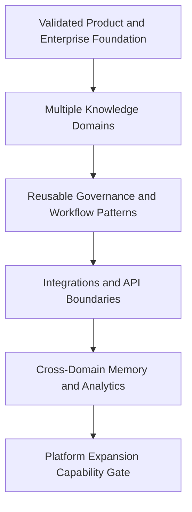

# Platform Expansion

## Derived From

- Canon Version: `v1.0.0`
- Architecture Version: `v1.0.0`
- Implementation Version: `v1.0.0`
- Product Version: `v1.0.0`
- Research Version: `v1.0.0`
- Strategy Version: `v1.0.0`
- Roadmap Philosophy Version: `v1.0.0`
- Product-Market Fit Roadmap Version: `v1.0.0`
- Multi-Department Roadmap Version: `v1.0.0`
- Enterprise Foundation Roadmap Version: `v1.0.0`
- AI Cognitive Evolution Roadmap Version: `v1.0.0`

### Primary Repository Sources

- [Canon](../canon/README.md)
- [Architecture](../architecture/README.md)
- [Implementation](../implementation/README.md)
- [Product](../product/README.md)
- [Research](../research/README.md)
- [Strategy](../strategy/README.md)
- [Roadmap](./README.md)
- [Roadmap Philosophy](./00_ROADMAP_PHILOSOPHY.md)
- [Product-Market Fit](./08_PRODUCT_MARKET_FIT.md)
- [Multi-Department](./09_MULTI_DEPARTMENT.md)
- [Enterprise Foundation](./10_ENTERPRISE_FOUNDATION.md)
- [AI Cognitive Evolution](./11_AI_COGNITIVE_EVOLUTION.md)

### Primary Supporting Documents

- [Product Capability Model](../canon/03_PRODUCT_CAPABILITY_MODEL.md)
- [Product Domain Model](../canon/04_PRODUCT_DOMAIN_MODEL.md)
- [Product Workflow Model](../canon/05_PRODUCT_WORKFLOW_MODEL.md)
- [Data Architecture](../architecture/09_DATA_ARCHITECTURE.md)
- [Knowledge Representation Model](../architecture/10_KNOWLEDGE_REPRESENTATION_MODEL.md)
- [Integration Architecture](../architecture/11_INTEGRATION_ARCHITECTURE.md)
- [API Architecture](../implementation/15_API_ARCHITECTURE.md)
- [Security Architecture](../implementation/18_SECURITY_ARCHITECTURE.md)
- [Product Metrics](../product/10_PRODUCT_METRICS.md)
- [Product Governance](../product/11_PRODUCT_GOVERNANCE.md)
- [Business Model](../strategy/05_BUSINESS_MODEL.md)
- [Growth Strategy](../strategy/07_GROWTH_STRATEGY.md)
- [Partnership Strategy](../strategy/08_PARTNERSHIP_STRATEGY.md)
- [Competitive Strategy](../strategy/06_COMPETITIVE_STRATEGY.md)

---

Status: **Active**

## Primary Question

How should the Organizational Intelligence Platform expand from a validated product into a scalable platform without losing its Canon, trust model, or category clarity?

This document defines the Platform Expansion roadmap for the Organizational Intelligence Platform.

Platform Expansion is the phase where the product evolves from a successful domain product into a broader platform that can support multiple domains, workflows, integrations, governance models, and Organizational Memory structures.

## 1. Executive Summary

Platform Expansion begins only after the company has validated a real beachhead, proven the Knowledge Flywheel, and established enterprise trust foundations.

The purpose of this phase is to make the Organizational Intelligence Platform more broadly useful without turning it into generic workflow software. The platform should expand by generalizing validated capabilities, not by accumulating unrelated features.

Platform Expansion should move the company from:

- Customer Support product;
- to multi-domain platform;
- to enterprise-wide Organizational Intelligence layer.

The core challenge is to increase breadth while preserving the Canon, Human Review, Governance, evidence traceability, and Organizational Memory as the foundation of trust.

## 2. Purpose of Platform Expansion

The goal of Platform Expansion is to make the platform capable of supporting multiple domains, integrations, workflows, and governance patterns while preserving one coherent Organizational Intelligence architecture.

This phase should mature:

- platform boundaries;
- domain expansion;
- extensibility;
- integrations;
- knowledge domains;
- governance domains;
- APIs;
- developer and internal extension readiness;
- reusable workflow patterns;
- cross-domain memory;
- analytics;
- platform administration;
- marketplace preparation;
- partner readiness.

This is not a final ecosystem strategy. It is the product-platform expansion roadmap that determines whether the company can grow from validated product to durable platform without losing coherence.

## 3. Relationship to Previous Roadmap Phases

Platform Expansion depends on the capability maturity established in earlier roadmap phases.

| Previous Phase | What It Enables |
| --- | --- |
| Customer Support MVP | First domain proof |
| Knowledge Flywheel | Core mechanism proof |
| Product-Market Fit | Customer value proof |
| Multi-Department | Cross-domain applicability |
| Enterprise Foundation | Trust and governance maturity |
| AI Cognitive Evolution | Governed AI capability maturity |

Platform Expansion should not begin because the company wants broader scope. It should begin because earlier phases have produced enough evidence that broader scope can be handled responsibly.

## 4. Platform Expansion Principle

The platform expands by generalizing validated Organizational Intelligence capabilities, not by accumulating unrelated features.

Every expansion must support:

`Work -> Evidence -> Knowledge Candidate -> Human Review -> Validation -> Organizational Memory -> Future Reuse`

This principle protects the platform from becoming a loose collection of workflow tools. New capabilities, domains, integrations, and extension points should strengthen the learning system rather than distract from it.

## 5. Platform Boundary Definition

Platform Expansion requires clear boundaries. The company should know what belongs inside the Organizational Intelligence Platform and what should remain outside it.

| Belongs Inside OIP | Does Not Belong Inside OIP |
| --- | --- |
| Knowledge lifecycle | Replacing every system of record |
| Evidence preservation | Full help desk clone |
| Human Review | Generic project management |
| Organizational Memory | Generic document storage |
| Governance | Unbounded automation |
| AI-assisted reasoning | AI as final authority |
| Cross-system learning | Workflow execution without learning |

The platform should connect to operational systems, learn from them, and preserve governed memory. It should not attempt to replace every system where work happens.

## 6. Core Platform Capabilities

Platform Expansion should mature a set of reusable capabilities that can support multiple domains without fragmenting the product.

### 6.1 Knowledge Domain System

The platform must support multiple knowledge domains such as:

- Support;
- IT;
- HR;
- Legal;
- Finance;
- Operations;
- Product;
- Compliance.

### Success Criteria

- domains are configurable;
- domains have owners;
- domains have governance rules;
- domain boundaries affect access and review;
- cross-domain relationships are possible.

The Knowledge Domain System matters because platform breadth should be organized through governed domains rather than through ad hoc feature clusters.

### 6.2 Workflow Pattern Library

The platform should identify reusable workflow patterns.

Important patterns include:

- intake;
- candidate generation;
- review;
- approval;
- revision;
- promotion;
- reuse;
- retirement;
- escalation.

### Success Criteria

- new domains can reuse existing workflow patterns;
- workflows remain governed;
- customization does not break architecture.

The Workflow Pattern Library matters because platform expansion should make new domain adoption easier without creating one-off workflow implementations for every customer.

### 6.3 Governance Domain Model

Governance should adapt by domain without fragmenting the platform.

Important capabilities include:

- reviewer assignment;
- approval policy;
- validation rules;
- retention assumptions;
- authority levels;
- escalation rules;
- confidence thresholds.

### Success Criteria

- governance can vary without fragmenting the platform;
- customers can understand why governance differs by domain.

The Governance Domain Model matters because different domains require different controls, but the platform should still preserve one coherent trust architecture.

### 6.4 Cross-Domain Organizational Memory

Memory should support department-specific and cross-functional reuse.

Important capabilities include:

- domain-specific memory;
- shared memory;
- relationship mapping;
- permission-aware retrieval;
- conflict detection;
- source provenance.

### Success Criteria

- memory remains trusted;
- users can distinguish domain-specific and shared knowledge;
- cross-domain reuse creates value without exposing unauthorized information.

Cross-Domain Organizational Memory matters because the platform becomes more valuable when learning travels responsibly across departments.

### 6.5 Integration Expansion

Platform Expansion requires deeper integration readiness.

Important integration categories include:

- help desk systems;
- CRM;
- ITSM;
- HRIS;
- document systems;
- collaboration tools;
- identity systems;
- analytics tools.

### Success Criteria

- integrations preserve evidence;
- intake never bypasses the Knowledge Candidate lifecycle;
- integrations support customer choice;
- integration quality is observable.

Integration Expansion matters because enterprise customers need the platform to learn from existing systems without replacing them or weakening governance.

### 6.6 API and Extension Readiness

The platform should expose stable internal and external boundaries.

Important capabilities include:

- API contracts;
- webhook and event support;
- integration abstractions;
- future developer documentation;
- internal extension patterns.

### Success Criteria

- platform capabilities are accessible without exposing raw database structure;
- APIs reflect business capabilities, not tables;
- a future partner ecosystem becomes possible.

API and extension readiness matters because platform maturity requires controlled access to capabilities, not direct coupling to internal implementation details.

### 6.7 Analytics and Intelligence Layer

Platform-level analytics should measure organizational learning.

Examples include:

- knowledge growth;
- validation rate;
- reuse rate;
- stale knowledge;
- repeated problem patterns;
- review bottlenecks;
- domain entropy;
- cross-domain learning.

### Success Criteria

- analytics support learning, not vanity reporting;
- leaders can see whether Organizational Intelligence is improving.

The Analytics and Intelligence Layer matters because platform value should be visible as capability improvement, not only usage volume.

### 6.8 Administration and Configuration

The platform should support more advanced customer configuration.

Important capabilities include:

- organization settings;
- domain management;
- workspace management;
- user roles;
- governance configuration;
- integration settings;
- branding and layout configuration where appropriate;
- audit views.

### Success Criteria

- customers can adapt the platform without breaking the Canon;
- configuration does not become uncontrolled customization.

Administration and configuration matter because platform customers need control, but customer control must remain inside coherent product boundaries.

## 7. Platform Maturity Levels

Platform maturity should be evaluated through levels that describe capability breadth and evidence quality.

| Level | Meaning | Criteria | Evidence |
| --- | --- | --- | --- |
| Level 1 - Domain Product | Validated in Customer Support. | One domain has a working Knowledge Flywheel, validated memory, and customer value. | Customer Support MVP validation, PMF evidence, reuse metrics. |
| Level 2 - Multi-Domain Product | Supports several departments. | Multiple departments can run governed learning workflows on the same core model. | Department pilots, domain-specific reviewers, memory reuse by domain. |
| Level 3 - Enterprise Platform | Supports governance, security, administration, and integrations. | Enterprise controls allow larger organizations to operate safely. | RBAC, audit coverage, admin workflows, integration health, governance configuration. |
| Level 4 - Extensible Platform | Supports APIs, reusable patterns, and partner readiness. | Capabilities are accessible through stable boundaries and reusable workflow patterns. | API usage, webhook events, extension patterns, integration abstractions. |
| Level 5 - Organizational Intelligence Layer | Becomes a cross-system enterprise learning layer. | Multiple systems and departments contribute to governed Organizational Memory and future reuse. | Cross-domain reuse, executive intelligence, enterprise expansion, durable memory growth. |

These maturity levels should be used to evaluate readiness honestly. A platform should not claim a higher level because it has a broader feature surface.

## 8. Platform Expansion Metrics

Platform Expansion should be measured through metrics that indicate coherent breadth, not uncontrolled growth.

| Metric | Why It Matters |
| --- | --- |
| Active Knowledge Domains | Shows how many domains operate inside the platform model. |
| Domains with Validated Memory | Shows whether domains are producing trusted knowledge rather than raw content. |
| Cross-Domain Reuse Events | Shows whether memory creates value across permitted contexts. |
| Integrations Enabled | Shows whether the platform connects to customer systems. |
| Governance Workflows Configured | Shows whether customers are adapting governance by domain. |
| API Usage | Shows whether platform capabilities are accessible through stable boundaries. |
| Memory Growth by Domain | Shows where Organizational Memory is expanding. |
| Domain-Level Validation Rate | Shows whether candidate quality and review are working by domain. |
| Domain-Level Reuse Rate | Shows whether memory is useful inside each domain. |
| Platform Admin Activity | Shows whether enterprise administration is being used. |
| Customer Expansion Revenue | Shows whether platform breadth creates commercial expansion. |
| Enterprise Account Expansion | Shows whether customers expand beyond the initial domain. |

These metrics should be interpreted together. Breadth without validation, reuse, governance, or customer expansion is not healthy platform maturity.

## 9. Platform Expansion Experiments

Platform Expansion should be validated through structured experiments.

| Experiment | Purpose | Method | Evidence | Success Criteria |
| --- | --- | --- | --- | --- |
| New domain pilot | Test whether the platform can support an additional domain. | Run a focused pilot in a non-support domain using the same core learning model. | Candidate flow, review participation, validation, reuse. | The new domain completes a governed Knowledge Flywheel without major custom architecture. |
| Cross-domain memory test | Validate permitted reuse across domains. | Connect related knowledge from two domains and observe retrieval and reuse behavior. | Cross-domain retrieval events, permission behavior, user feedback. | Users gain useful cross-domain context without access or authority confusion. |
| Integration pilot | Test whether a new operational system can become an evidence source. | Connect one target system through a controlled integration path. | Evidence preservation, candidate creation, integration health. | Integration supports intake without bypassing governance or source traceability. |
| Governance configuration test | Validate domain-specific governance variation. | Configure different review and approval rules across domains. | Policy application, review outcomes, administrator feedback. | Governance differs by domain without confusing users or fragmenting architecture. |
| API boundary test | Validate platform capability access through stable interfaces. | Use APIs or events to interact with a bounded platform capability. | API reliability, contract clarity, auditability. | APIs expose capabilities without leaking internal implementation structure. |
| Admin usability test | Evaluate whether customers can configure platform boundaries responsibly. | Observe administrators managing users, domains, integrations, and governance settings. | Task completion, error patterns, support burden. | Administrators can configure key boundaries without bespoke founder intervention. |
| Analytics usefulness test | Determine whether platform analytics support learning decisions. | Present analytics to operational and executive users and evaluate decisions made from them. | Decisions informed, metrics trusted, requested refinements. | Analytics help leaders understand memory quality, reuse, entropy, and improvement. |
| Extension pattern test | Validate reusable internal or partner extension patterns. | Build a small extension using documented internal patterns or abstractions. | Development effort, boundary clarity, governance behavior. | Extension work is possible without bypassing core platform rules. |

These experiments should produce evidence that informs whether the product is becoming a platform or merely becoming broader.

## 10. Capability Gate

Platform Expansion is validated only when broader capability operates through the same coherent architecture.

Platform Expansion is validated when:

- multiple domains operate on the same core OIP architecture;
- governance varies by domain without breaking coherence;
- memory can be reused across permitted contexts;
- integrations preserve evidence and the candidate lifecycle;
- platform APIs support capability access;
- administrators can configure key boundaries;
- customers expand usage beyond the initial domain;
- platform identity remains Organizational Intelligence, not generic workflow automation.

This gate should be crossed only when expansion strengthens the platform's identity and trust model.

## 11. Risks

Platform Expansion carries several meaningful risks.

| Risk | Why It Matters |
| --- | --- |
| Scope explosion | Breadth can overwhelm product coherence and delivery focus. |
| Platform becoming generic | The product may drift toward generic workflow software instead of Organizational Intelligence. |
| Integration complexity | Too many integrations can consume roadmap energy without improving memory or learning. |
| Governance fragmentation | Domain-specific rules may become inconsistent or hard to understand. |
| Cross-domain permission failures | Memory reuse across domains can create serious trust issues if access boundaries fail. |
| Customer confusion | Customers may misunderstand whether the platform is a system of record, workflow tool, or intelligence layer. |
| Premature marketplace ambition | Ecosystem pressure can arrive before the platform has stable extension boundaries. |
| Weak API design | Poor APIs can expose implementation details and create long-term constraints. |
| Analytics becoming vanity reporting | Dashboards may measure activity without showing learning or capability improvement. |
| Partner pressure diluting product direction | Partner requests may pull the platform away from Canon-aligned capabilities. |

These risks should be managed through platform boundaries, capability gates, architecture discipline, and customer evidence.

## 12. Deliverables

The Platform Expansion roadmap should produce the following outputs:

- platform capability model;
- knowledge domain configuration model;
- governance domain framework;
- integration roadmap;
- API readiness checklist;
- analytics roadmap;
- admin configuration framework;
- platform maturity assessment;
- partner ecosystem readiness input.

These deliverables matter because platform maturity should become explicit organizational knowledge, not only accumulated implementation surface area.

## 13. Relationship to Category Expansion

Platform maturity enables category-level growth.

The company cannot credibly lead the Organizational Intelligence Platform category if the product remains a single-domain support tool. Category expansion requires evidence that the same governed learning mechanism works across domains, systems, and organizational contexts.

Platform Expansion therefore prepares the company for broader category work by proving that:

- the product is not limited to one workflow;
- the architecture can support multiple domains;
- governance scales without losing coherence;
- Organizational Memory becomes more valuable across systems;
- customers understand the platform as an enterprise learning layer.

## 14. Traceability Matrix

Platform Expansion should remain traceable to the broader repository.

| Source | Platform Expansion Derivation |
| --- | --- |
| [Canon](../canon/README.md) | Defines the enduring platform identity, including Organizational Memory, Human Review, Governance, and the Knowledge Flywheel. |
| [Product Capability Model](../canon/03_PRODUCT_CAPABILITY_MODEL.md) | Defines the core capabilities that should generalize as the product becomes a platform. |
| [Product Domain Model](../canon/04_PRODUCT_DOMAIN_MODEL.md) | Defines domain boundaries and conceptual structure for multi-domain expansion. |
| [Product Workflow Model](../canon/05_PRODUCT_WORKFLOW_MODEL.md) | Defines the shared lifecycle from work to governed memory and reuse. |
| [Data Architecture](../architecture/09_DATA_ARCHITECTURE.md) | Defines the data lifecycle and trust path that platform expansion must preserve. |
| [Knowledge Representation Model](../architecture/10_KNOWLEDGE_REPRESENTATION_MODEL.md) | Defines how knowledge domains, provenance, relationships, and memory should be represented. |
| [Integration Architecture](../architecture/11_INTEGRATION_ARCHITECTURE.md) | Defines how external systems contribute evidence without bypassing governance. |
| [API Architecture](../implementation/15_API_ARCHITECTURE.md) | Defines the interface discipline required for stable platform boundaries. |
| [Security Architecture](../implementation/18_SECURITY_ARCHITECTURE.md) | Defines the trust, access, and protection requirements that platform breadth depends on. |
| [Product Metrics](../product/10_PRODUCT_METRICS.md) | Defines the metrics vocabulary for memory growth, validation, reuse, governance, and platform value. |
| [Product Governance](../product/11_PRODUCT_GOVERNANCE.md) | Defines how governance should remain coherent as configuration and domain breadth increase. |
| [Business Model](../strategy/05_BUSINESS_MODEL.md) | Defines why platform expansion supports retention, expansion, and durable value capture. |
| [Growth Strategy](../strategy/07_GROWTH_STRATEGY.md) | Defines how platform maturity supports controlled growth after PMF. |
| [Partnership Strategy](../strategy/08_PARTNERSHIP_STRATEGY.md) | Defines how partner readiness should follow platform stability and extension discipline. |
| [Competitive Strategy](../strategy/06_COMPETITIVE_STRATEGY.md) | Defines why coherent platform expansion is more defensible than disconnected feature breadth. |
| [Roadmap Philosophy](./00_ROADMAP_PHILOSOPHY.md) | Defines capability-gated progression, evidence-driven expansion, and validation before scale. |

## 15. What This Document Does NOT Define

This document intentionally does not define:

- full marketplace launch;
- global expansion plan;
- final partner program;
- final API pricing;
- complete developer platform;
- replacing all enterprise systems;
- full category leadership plan.

Those belong to later phases or specialized strategy documents.

This document defines only how the product should mature into a coherent multi-domain Organizational Intelligence Platform.

## 16. Closing

Platform Expansion succeeds when the product becomes a coherent multi-domain Organizational Intelligence Platform while preserving trust, Governance, Human Review, and Organizational Memory as its foundation.

That is the standard this roadmap exists to enforce.
