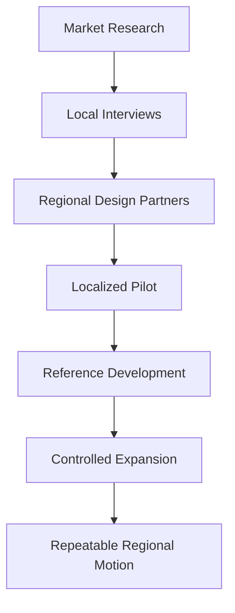
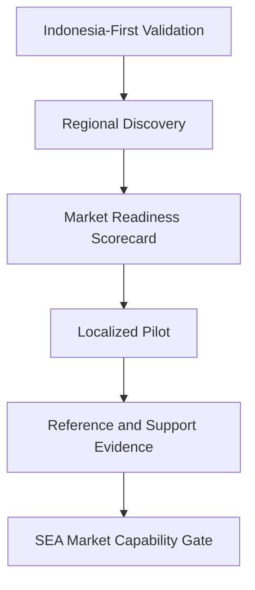

# Southeast Asia Expansion

## Derived From

- Canon Version: `v1.0.0`
- Architecture Version: `v1.0.0`
- Implementation Version: `v1.0.0`
- Product Version: `v1.0.0`
- Research Version: `v1.0.0`
- Strategy Version: `v1.0.0`
- Roadmap Philosophy Version: `v1.0.0`
- Platform Expansion Roadmap Version: `v1.0.0`

### Primary Repository Sources

- [Canon](../canon/README.md)
- [Architecture](../architecture/README.md)
- [Implementation](../implementation/README.md)
- [Product](../product/README.md)
- [Research](../research/README.md)
- [Strategy](../strategy/README.md)
- [Roadmap](./README.md)
- [Roadmap Philosophy](./00_ROADMAP_PHILOSOPHY.md)
- [Platform Expansion](./12_PLATFORM_EXPANSION.md)

### Primary Supporting Documents

- [Ideal Customer Profile](../strategy/02_IDEAL_CUSTOMER_PROFILE.md)
- [Go-to-Market Strategy](../strategy/03_GO_TO_MARKET.md)
- [Pricing Strategy](../strategy/04_PRICING_STRATEGY.md)
- [Business Model](../strategy/05_BUSINESS_MODEL.md)
- [Competitive Strategy](../strategy/06_COMPETITIVE_STRATEGY.md)
- [Growth Strategy](../strategy/07_GROWTH_STRATEGY.md)
- [Partnership Strategy](../strategy/08_PARTNERSHIP_STRATEGY.md)
- [Indonesia Market Research](../research/08_INDONESIA_MARKET_RESEARCH.md)
- [Regulatory Research](../research/07_REGULATORY_RESEARCH.md)
- [Customer Discovery](../research/02_CUSTOMER_DISCOVERY.md)
- [Experiments](../research/09_EXPERIMENTS.md)
- [Product-Market Fit](./08_PRODUCT_MARKET_FIT.md)
- [Customer Support MVP](./06_CUSTOMER_SUPPORT_MVP.md)

---

Status: **Active**

## Primary Question

How should the company expand from Indonesia into Southeast Asia while preserving trust, localization, customer success, and category clarity?

This document defines the Southeast Asia Expansion roadmap for the Organizational Intelligence Platform.

Southeast Asia Expansion should occur only after Indonesia-first validation, Customer Support Product-Market Fit signals, platform reliability, and early regional readiness.

## 1. Executive Summary

Southeast Asia Expansion is the first regional growth phase after Indonesia.

The company should expand only when Indonesia has produced credible evidence of:

- customer value;
- design partner success;
- Product-Market Fit signals;
- repeatable onboarding;
- pricing evidence;
- trust signals;
- support capability.

Regional expansion should strengthen the platform's category clarity, not dilute it. The goal is not to add geography for its own sake. The goal is to test whether the Organizational Intelligence Platform category can travel across nearby markets while preserving governed learning, Human Review, Organizational Memory, and customer trust.

## 2. Purpose of SEA Expansion

The purpose of Southeast Asia Expansion is not simply geographic growth.

The purpose is to test whether the Organizational Intelligence Platform category can expand across nearby markets with different:

- languages;
- regulations;
- buying behaviors;
- enterprise maturity levels;
- support operating models;
- trust expectations.

This phase should validate whether Indonesia-first learning can become regional learning without assuming direct transfer. Expansion should therefore proceed through market-by-market evidence, not through a broad regional claim.

## 3. Relationship to Indonesia-First Strategy

Indonesia is the learning market.

Southeast Asia expansion builds on that learning while testing which assumptions remain valid regionally.

| Indonesia Proves | SEA Expansion Tests |
| --- | --- |
| Local category resonance | Regional category resonance |
| Indonesia-first pricing | Regional pricing adaptation |
| Customer Support beachhead | Support use cases across markets |
| Founder-led GTM | Partner-assisted regional GTM |
| Local trust | Cross-border trust |
| Early onboarding | Localized onboarding |

Indonesia-first validation should create the operating knowledge, customer language, pricing evidence, support workflows, and trust foundation that make regional expansion responsible.

## 4. Why Southeast Asia

Southeast Asia is a natural next region for strategic exploration, but it must still be validated.

The strategic logic includes:

- geographic proximity;
- digital economy growth;
- multilingual support operations;
- regional business expansion;
- support-intensive industries;
- emerging AI adoption;
- enterprise software modernization;
- regional partner opportunities.

These conditions suggest regional opportunity. They do not prove it.

The company should treat Southeast Asia as a likely next learning region because the operational and market adjacency is plausible. It should not treat Southeast Asia as validated until customer discovery, design partner evidence, pricing signals, and support readiness prove that expansion is responsible.

## 5. Market Selection Criteria

Southeast Asia expansion should be market-selective.

Possible markets include:

- Singapore;
- Malaysia;
- Philippines;
- Thailand;
- Vietnam.

Market selection should consider:

- customer pull;
- support-intensive sectors;
- digital maturity;
- AI readiness;
- English, Indonesian, or regional language requirements;
- pricing fit;
- regulatory comfort;
- partner availability;
- customer success capacity;
- reference relevance;
- founder and company accessibility.

The company should prioritize markets where ICP density, customer pull, supportability, and trust conditions are strong enough to justify focused learning.

## 6. Market Readiness Scorecard

Each potential expansion market should be scored from `1` to `5`.

| Criterion | 1 | 3 | 5 |
| --- | --- | --- | --- |
| ICP Availability | Few visible target customers. | Some plausible ICP accounts. | Strong concentration of ICP accounts. |
| Customer Support Maturity | Low support process maturity. | Moderate operational support structure. | Strong support operations with measurable pain. |
| SaaS and Cloud Readiness | Low cloud adoption or strong resistance. | Mixed readiness. | Strong comfort with SaaS and cloud platforms. |
| AI Adoption Interest | Low AI interest or high distrust. | Exploratory interest. | Clear AI interest with governance concerns. |
| Knowledge Management Pain | Weak evidence of knowledge loss. | Some repeated documentation or expert dependency pain. | Strong visible Organizational Entropy. |
| Regulatory Complexity | High uncertainty or high near-term burden. | Manageable but requires work. | Clear enough to pilot responsibly. |
| Partner Ecosystem | Few credible partners. | Some potential partners. | Strong relevant partner base. |
| Pricing Feasibility | Low willingness or ability to pay. | Unclear or segment-dependent. | Strong fit with purchasing power and value perception. |
| Localization Burden | Heavy language, workflow, or cultural adaptation required. | Moderate adaptation required. | Manageable adaptation for initial pilots. |
| Supportability | Hard to support from current organization. | Supportable with constraints. | Feasible with current or near-term support capacity. |

### Score Interpretation

| Total Range | Interpretation |
| --- | --- |
| 10-20 | Defer |
| 21-30 | Monitor |
| 31-40 | Pilot selectively |
| 41-50 | Prioritize |

The scorecard should guide judgment, not replace it. A high score should still require customer evidence before expansion begins.

## 7. Regional ICP Adaptation

The core ICP remains similar across the region but must be localized.

The core ICP is:

- mid-market to lower-enterprise B2B organizations;
- high-volume Customer Support;
- recurring questions;
- fragmented knowledge;
- human review culture;
- AI interest with governance concerns.

Regional adaptation may include:

- language needs;
- WhatsApp or messaging workflows;
- local help desk systems;
- regional compliance;
- local buying behavior;
- procurement norms.

The company should preserve the core ICP logic while adapting discovery, positioning, onboarding, and customer success to local market context.

## 8. Localization Roadmap

Localization includes more than translation.

Important localization capabilities include:

- language support;
- localized examples;
- local support workflows;
- regional terminology;
- local buyer education;
- local compliance awareness;
- onboarding adaptation;
- local case studies.

### Success Criteria

- customers understand OIP in their market context;
- user workflows do not feel imported from another market;
- support and documentation can handle local language needs.

Localization succeeds when the platform's category and workflows remain coherent while becoming understandable and usable in the customer's local context.

## 9. Regional Pricing Strategy

Regional pricing should derive from the existing Purchasing Power Aligned Pricing philosophy.

Pricing should consider:

- purchasing power;
- market maturity;
- customer segment;
- willingness to pay;
- support cost;
- local competitive alternatives;
- strategic adoption density.

This document does not define exact prices.

The purpose of regional pricing work is to test whether the platform's value can be priced responsibly across markets without weakening long-term business model discipline or customer trust.

## 10. Regional Trust and Compliance

Southeast Asia expansion requires regulatory and trust awareness.

Relevant areas include:

- data protection laws;
- cross-border transfers;
- cloud region concerns;
- AI governance expectations;
- customer procurement reviews;
- industry-specific regulations.

This document is not legal advice.

The company should treat regulatory awareness as an expansion readiness requirement. A market should not be entered seriously until the company understands the data, AI, procurement, and operational trust expectations required for responsible pilots.

## 11. Partner-Led Regional Expansion

Partners matter in Southeast Asia because local context, trust, implementation, and relationships can vary significantly by market.

Relevant partner types include:

- local consultants;
- implementation partners;
- cloud partners;
- SaaS ecosystem partners;
- universities or research groups;
- industry associations;
- government digital programs.

### Success Criteria

- partners improve customer success;
- partners do not dilute category positioning;
- partners understand governed learning.

Partner-led expansion should strengthen local trust and implementation quality. It should not turn the product into generic AI tooling or a services-led custom workflow business.

## 12. Regional GTM Motion

The Southeast Asia GTM motion should progress through controlled stages.

1. Market research
2. Local interviews
3. Regional design partners
4. Localized pilot
5. Reference development
6. Controlled expansion
7. Repeatable regional motion

Founder-led learning remains important at first. The company should understand the market directly before relying heavily on partners or delegated GTM.

## 13. Customer Success Readiness

Southeast Asia expansion requires support readiness.

Important capabilities include:

- onboarding documentation;
- support process;
- local language support plan;
- implementation guide;
- regional feedback loop;
- escalation process;
- knowledge base for customers.

Customer Success readiness matters because regional expansion increases operational complexity. If the company cannot support customers well, expansion can damage trust faster than it creates growth.

## 14. SEA Expansion Metrics

Southeast Asia Expansion should be evaluated through learning, readiness, and customer-value metrics.

| Metric | Why It Matters |
| --- | --- |
| Regional Discovery Interviews | Shows whether the company is gathering direct market evidence. |
| Qualified ICP Accounts by Market | Shows where real customer density may exist. |
| Regional Design Partners | Shows whether high-fit customers are willing to validate workflows. |
| Activation Rate | Shows whether onboarding works in the new market context. |
| Time to First Organizational Value | Shows whether customers reach value quickly enough after localization. |
| Customer Support Workload | Shows whether the company can support regional customers sustainably. |
| Localization Issues | Shows whether language, workflow, or market adaptation is blocking value. |
| Pricing Feedback | Shows whether value and willingness to pay translate regionally. |
| Retention Signal | Shows whether early customers continue using the platform after novelty. |
| Reference Readiness | Shows whether customers can explain value credibly in-market. |
| Partner-Sourced Opportunities | Shows whether partner channels create qualified opportunities rather than noise. |

These metrics should be interpreted by market. Regional averages can hide important local differences.

## 15. Capability Gate

Southeast Asia expansion should proceed market-by-market only when evidence supports readiness.

SEA expansion should proceed only when:

- Indonesia-first validation is strong;
- Customer Support Product-Market Fit signals exist;
- onboarding is repeatable;
- regional customer discovery confirms pain;
- at least one market shows strong ICP density;
- localization needs are understood;
- support capacity exists;
- partner quality is acceptable;
- regulatory risks are understood.

This gate should be applied per market. Southeast Asia should not be treated as a single uniform expansion surface.

## 16. Risks

The Southeast Asia Expansion roadmap carries several important risks.

| Risk | Why It Matters |
| --- | --- |
| Expanding before PMF | Regional activity can amplify weak product-market assumptions. |
| Assuming Indonesia learning transfers directly | Local language, buying behavior, and regulation may differ meaningfully. |
| Weak localization | Customers may understand the product poorly or experience it as imported. |
| Pricing mismatch | Purchasing power and value perception may vary significantly by market. |
| Regulatory misunderstanding | Data protection, AI, and procurement expectations may create hidden risk. |
| Poor partner quality | Weak partners may dilute category positioning or damage customer trust. |
| Support capacity overload | The company may be unable to support regional customers well. |
| Category confusion | Customers may interpret the platform as a chatbot, help desk, or generic AI tool. |
| Chasing markets without customer pull | Expansion may become activity without evidence. |
| Losing focus on Customer Support foundation | Regional breadth may distract from the proven beachhead and core value loop. |

These risks should be managed through staged entry, customer discovery, partner discipline, and capability gates.

## 17. Deliverables

The Southeast Asia Expansion roadmap should produce the following outputs:

- SEA market readiness assessment;
- market selection scorecard;
- regional ICP adaptation notes;
- localization plan;
- regional pricing hypothesis;
- partner evaluation list;
- regional discovery report;
- SEA pilot readiness checklist;
- SEA expansion decision report.

These deliverables matter because regional expansion should create reusable organizational learning before it creates broad commitments.

## 18. Relationship to Global Expansion

Southeast Asia Expansion is the learning bridge between Indonesia-first validation and global enterprise expansion.

The company should not jump globally before proving regional repeatability. Southeast Asia provides a disciplined intermediate stage where the company can learn how the category, pricing, localization, partner motion, and customer success model adapt across markets.

Global expansion becomes more responsible only after the company can show that regional expansion strengthens customer trust, Product-Market Fit evidence, and platform maturity.

## 19. Traceability Matrix

Southeast Asia Expansion should remain traceable to the broader repository.

| Source | SEA Expansion Derivation |
| --- | --- |
| [Canon](../canon/README.md) | Defines the enduring product identity, trust model, Human Review, Governance, and Organizational Memory principles that regional expansion must preserve. |
| [Ideal Customer Profile](../strategy/02_IDEAL_CUSTOMER_PROFILE.md) | Defines the core ICP that must be localized and validated market by market. |
| [Indonesia Market Research](../research/08_INDONESIA_MARKET_RESEARCH.md) | Defines the Indonesia-first evidence base and market learning that regional expansion builds upon. |
| [Growth Strategy](../strategy/07_GROWTH_STRATEGY.md) | Defines controlled growth logic and sequencing after validated market foundations. |
| [Go-to-Market Strategy](../strategy/03_GO_TO_MARKET.md) | Defines early GTM motion, category education, design partner sequencing, and customer acquisition learning. |
| [Pricing Strategy](../strategy/04_PRICING_STRATEGY.md) | Defines Purchasing Power Aligned Pricing and regional pricing adaptation principles. |
| [Partnership Strategy](../strategy/08_PARTNERSHIP_STRATEGY.md) | Defines how partners should support expansion without diluting category clarity. |
| [Regulatory Research](../research/07_REGULATORY_RESEARCH.md) | Defines data protection, AI governance, and regulatory awareness requirements relevant to market entry. |
| [Business Model](../strategy/05_BUSINESS_MODEL.md) | Defines how regional expansion should support retention, expansion, and durable value capture. |
| [Competitive Strategy](../strategy/06_COMPETITIVE_STRATEGY.md) | Defines why regional growth should preserve differentiated Organizational Intelligence positioning. |
| [Roadmap Philosophy](./00_ROADMAP_PHILOSOPHY.md) | Defines capability-gated, evidence-driven progression and validation before expansion. |
| [Platform Expansion](./12_PLATFORM_EXPANSION.md) | Defines the platform maturity foundation that makes regional growth more supportable. |

## 20. What This Document Does NOT Define

This document intentionally does not define:

- final country launch order;
- exact pricing;
- legal advice;
- regional hiring plan;
- full partner program;
- global enterprise GTM;
- final localization roadmap.

Those belong to later operating plans, legal review, or specialized GTM documentation.

This document defines only the regional capability roadmap for expanding from Indonesia into Southeast Asia responsibly.

## 21. Closing

Southeast Asia Expansion succeeds when regional growth strengthens customer trust, category clarity, and validated Organizational Intelligence rather than simply increasing geographic footprint.

That is the standard this roadmap exists to enforce.
