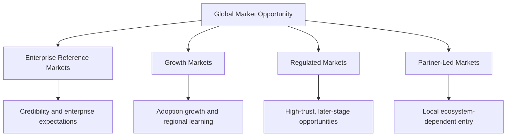
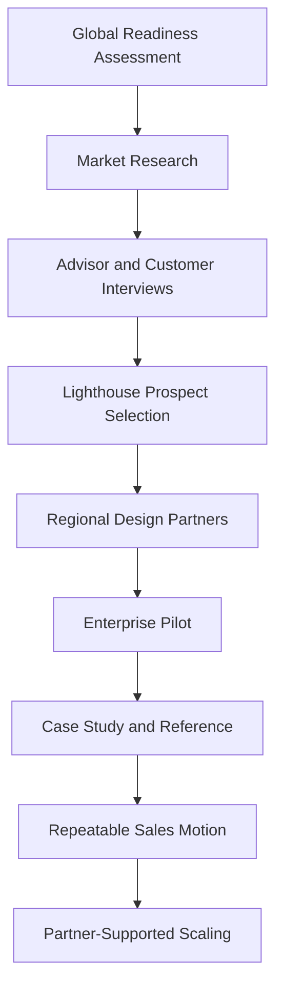
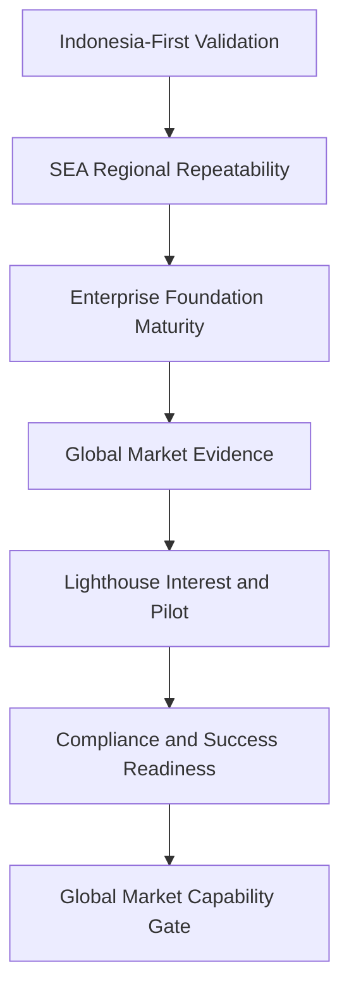

# Global Expansion

## Derived From

- Canon Version: `v1.0.0`
- Architecture Version: `v1.0.0`
- Implementation Version: `v1.0.0`
- Product Version: `v1.0.0`
- Research Version: `v1.0.0`
- Strategy Version: `v1.0.0`
- Roadmap Philosophy Version: `v1.0.0`
- Platform Expansion Roadmap Version: `v1.0.0`
- SEA Expansion Roadmap Version: `v1.0.0`

### Primary Repository Sources

- [Canon](../canon/README.md)
- [Architecture](../architecture/README.md)
- [Implementation](../implementation/README.md)
- [Product](../product/README.md)
- [Research](../research/README.md)
- [Strategy](../strategy/README.md)
- [Roadmap](./README.md)
- [Roadmap Philosophy](./00_ROADMAP_PHILOSOPHY.md)
- [Enterprise Foundation](./10_ENTERPRISE_FOUNDATION.md)
- [Platform Expansion](./12_PLATFORM_EXPANSION.md)
- [Southeast Asia Expansion](./13_SEA_EXPANSION.md)

### Primary Supporting Documents

- [Ideal Customer Profile](../strategy/02_IDEAL_CUSTOMER_PROFILE.md)
- [Go-to-Market Strategy](../strategy/03_GO_TO_MARKET.md)
- [Pricing Strategy](../strategy/04_PRICING_STRATEGY.md)
- [Business Model](../strategy/05_BUSINESS_MODEL.md)
- [Competitive Strategy](../strategy/06_COMPETITIVE_STRATEGY.md)
- [Growth Strategy](../strategy/07_GROWTH_STRATEGY.md)
- [Partnership Strategy](../strategy/08_PARTNERSHIP_STRATEGY.md)
- [Long-Term Vision](../strategy/09_LONG_TERM_VISION.md)
- [Regulatory Research](../research/07_REGULATORY_RESEARCH.md)
- [Technology Research](../research/06_TECHNOLOGY_RESEARCH.md)
- [Indonesia Market Research](../research/08_INDONESIA_MARKET_RESEARCH.md)
- [Customer Discovery](../research/02_CUSTOMER_DISCOVERY.md)
- [Experiments](../research/09_EXPERIMENTS.md)
- [Product-Market Fit](./08_PRODUCT_MARKET_FIT.md)

---

Status: **Active**

## Primary Question

How should the company expand into global enterprise markets while preserving trust, governance, product quality, and category leadership?

This document defines the Global Expansion roadmap for the Organizational Intelligence Platform.

Global Expansion should occur only after Indonesia-first validation, Southeast Asia regional repeatability, platform maturity, enterprise readiness, repeatable customer success, category clarity, and partner ecosystem readiness. It is a global readiness and expansion capability roadmap, not a country-by-country launch plan.

## 1. Executive Summary

Global Expansion is earned, not assumed.

The company should not treat global markets as the natural reward of regional growth. Global expansion is a distinct and demanding phase that exposes the platform to more mature enterprise expectations, stronger competitors, deeper compliance obligations, and higher trust thresholds than earlier stages required.

Global Expansion should proceed only after the company has proven:

- Product-Market Fit in Customer Support;
- regional repeatability across Southeast Asia;
- platform maturity and reliability;
- an enterprise foundation for identity, access, audit, and administration;
- security and governance credibility;
- repeatable customer success;
- category clarity that survives outside the initial region;
- partner ecosystem readiness where local trust and implementation require it.

The goal is not simply more customers in more countries. The goal is to test whether Organizational Intelligence can become a recognized global enterprise category while preserving governed learning, Human Review, Organizational Memory, and customer trust. Where the evidence does not yet exist, the correct decision is to defer, not to expand on ambition alone.

## 2. Purpose of Global Expansion

The purpose of Global Expansion is to test whether the Organizational Intelligence Platform can become a recognized enterprise software category beyond regional markets.

Indonesia proves local resonance. Southeast Asia tests regional repeatability. Global Expansion asks a harder question: whether Organizational Intelligence is a durable enterprise need in the world's most mature and most demanding software markets, or only a regionally specific opportunity.

The purpose is therefore not simply to acquire more customers. It is to establish Organizational Intelligence as a global enterprise need, evidenced by:

- enterprises in mature markets adopting the platform under their own procurement, security, and compliance standards;
- reference customers whose credibility travels across regions;
- a category narrative that resonates without heavy local translation;
- a partner ecosystem that reinforces rather than dilutes the category.

If global enterprises will only adopt the platform as a generic AI tool, a help desk add-on, or a services engagement, the category has not traveled. Global Expansion exists to prove that the category, not just the software, can cross borders.

## 3. Relationship to SEA Expansion

Southeast Asia Expansion is the learning bridge that global readiness builds upon. Each capability proven regionally becomes a stronger requirement globally.

| SEA Expansion Proves | Global Expansion Requires |
| --- | --- |
| Regional repeatability | Global enterprise readiness |
| Localized GTM | Multi-region GTM |
| Regional pricing adaptation | Mature value-based pricing |
| Partner-assisted growth | Global partner ecosystem |
| Early compliance awareness | Strong compliance posture |
| Regional references | Global enterprise references |

Southeast Asia should demonstrate that the category, pricing, localization, partner motion, and customer success model can adapt across nearby markets. Global Expansion raises the standard for each: broader multi-region operations, mature value-based pricing, a credible global partner ecosystem, and a compliance posture strong enough to pass enterprise vendor review in demanding jurisdictions.

Global Expansion should not begin until Southeast Asia has produced repeatable evidence, not merely early activity.

## 4. Global Expansion Readiness Principles

Global Expansion should be governed by disciplined readiness principles rather than opportunistic entry.

| Principle | Meaning |
| --- | --- |
| Trust before scale | The platform handles knowledge, memory, evidence, and governed reasoning; global scale must never outrun the trust that makes adoption responsible. |
| Enterprise readiness before enterprise selling | The company should not sell into global enterprises before the platform can meet enterprise identity, security, audit, and administration expectations. |
| Category clarity before broad marketing | The market must understand Organizational Intelligence as distinct before broad demand generation; unclear category positioning wastes reach. |
| Local compliance awareness | Every entered market requires awareness of its data protection, AI governance, and procurement expectations before serious pilots. |
| Regional customer success | Customer success capacity must exist in or near the region before expansion, because poor support damages trust faster than growth creates it. |
| Partner quality over partner quantity | A small number of strong, aligned partners is worth more than many partners who dilute category clarity or weaken implementation quality. |
| Focused market entry | Global Expansion should enter few markets deliberately rather than many markets broadly. |
| No global expansion without proof | Regional evidence, enterprise readiness, and lighthouse interest must exist before a market is entered seriously. |

These principles apply per market. A strong global brand in one region does not authorize unfocused entry elsewhere.

## 5. Market Prioritization Framework

Global markets should be selected through evidence, not ambition. The company should evaluate candidate markets against consistent criteria before committing focused resources.

| Criterion | What It Signals | Why It Matters |
| --- | --- | --- |
| ICP Density | Concentration of knowledge-intensive organizations with support-heavy operations. | Determines whether real demand exists rather than theoretical opportunity. |
| Enterprise Software Maturity | Comfort with SaaS, cloud, and structured procurement. | Mature markets expect more but adopt more predictably. |
| Customer Support Complexity | Volume, repetition, and knowledge fragmentation in service operations. | The beachhead value depends on visible Organizational Entropy. |
| AI Governance Demand | Regulatory and enterprise pressure for accountable, reviewable AI. | Aligns directly with the platform's governed-learning differentiation. |
| Willingness to Pay | Budget for organizational capability, not only AI experimentation. | Determines business model viability in the market. |
| Regulatory Fit | Data protection, AI, and cross-border expectations that can be met responsibly. | An unmet regulatory bar can block enterprise deals entirely. |
| Partner Availability | Presence of credible implementation, cloud, and advisory partners. | Determines whether local trust and delivery can be supported. |
| Competitive Pressure | Strength and bundling behavior of incumbents. | Affects positioning difficulty and category-dilution risk. |
| Reference Relevance | Whether customers here produce references credible in other markets. | Global references compound category credibility. |
| Language and Localization Burden | Effort required for language, workflow, and market adaptation. | High burden slows time to value and raises support cost. |
| Customer Success Capacity | Ability to onboard and support customers in or near the market. | Expansion without support capacity erodes trust. |
| Strategic Category Influence | Whether success in the market advances the category globally. | Some markets shape analyst, buyer, and ecosystem perception disproportionately. |

Each candidate market should be scored consistently and reviewed with judgment. A high score should still require direct customer evidence and lighthouse interest before serious entry. The framework guides prioritization; it does not authorize expansion by itself.

## 6. Global Market Types

Global markets serve different strategic roles. The company should classify candidate markets rather than treating all global opportunity as equivalent.

### Enterprise Reference Markets

Examples: North America, Western Europe, and Singapore as a regional enterprise hub.

Role: These markets provide credibility, mature customers, and demanding enterprise expectations. Success here strengthens global references and forces the platform to meet high standards for security, governance, and reliability. They are strategically influential but competitively intense and should be entered only when enterprise readiness is credible.

### Growth Markets

Examples: broader Asia-Pacific enterprise hubs and selected emerging markets with rising digital and AI adoption.

Role: These markets offer adoption growth and regional learning. They may be more accessible than mature enterprise markets but require localization discipline and careful pricing. They can build volume and evidence while enterprise reference markets build credibility.

### Regulated Markets

Examples: finance-heavy, healthcare-heavy, and public-sector-heavy markets, and jurisdictions with strong data protection or AI governance regimes such as parts of Europe and the Middle East.

Role: These markets have high trust and compliance requirements and are typically later-stage opportunities. They can be highly valuable because governed learning aligns with their needs, but they demand mature compliance posture, data residency options, and strong audit and review capabilities before serious entry.

### Partner-Led Markets

Examples: markets where local relationships, implementation capacity, procurement navigation, or language make direct entry impractical without a strong local ecosystem.

Role: In these markets, credible partners are a precondition for responsible entry. The company should not enter partner-led markets directly ahead of partner readiness, and partners must preserve category clarity rather than convert the platform into generic services work.

## 7. Global ICP Adaptation

The core Ideal Customer Profile remains consistent globally. What changes is how the ICP must be qualified and served as market maturity, regulation, and procurement expectations increase.

The core ICP remains:

- knowledge-intensive organizations;
- with repeated operational problems;
- in Customer Support or service operations;
- with historical data available;
- with a human review culture;
- with AI governance concern;
- and willingness to pay for organizational capability.

Global markets add adaptation requirements on top of that core:

| Adaptation Dimension | Global Consideration |
| --- | --- |
| Enterprise procurement | Formal vendor onboarding, security questionnaires, legal review, and multi-stakeholder approval. |
| Compliance requirements | Region- and industry-specific data protection and AI governance obligations. |
| Data residency | Expectations for where data is stored, processed, and transferred. |
| Integration expectations | Deeper integration with established identity, support, and knowledge systems. |
| Language | Local-language support, knowledge, and interface expectations in some markets. |
| Security review | Formal security assessments, evidence, and sometimes independent attestation. |
| Implementation partner needs | Local delivery capacity for onboarding and change management. |

The company should preserve the core ICP logic while adapting qualification, positioning, onboarding, and customer success to each market's enterprise maturity. The ICP does not change; the bar for serving it responsibly rises.

## 8. Enterprise Readiness Requirements

Global Expansion requires stronger platform and operational maturity than earlier stages. These requirements build on the [Enterprise Foundation](./10_ENTERPRISE_FOUNDATION.md) roadmap and should be credible before serious enterprise selling.

| Capability Area | Global Readiness Requirement |
| --- | --- |
| SSO and identity | Enterprise single sign-on and identity federation with common providers. |
| RBAC | Robust role-based access control aligned to enterprise permission expectations. |
| Audit logs | Comprehensive, tamper-evident audit history for governed actions and knowledge changes. |
| Data lifecycle | Clear creation, retention, archival, and deletion behavior for organizational data. |
| Privacy controls | Configurable controls that support regional privacy obligations. |
| Compliance documentation | Accessible documentation of security, privacy, and AI governance practices. |
| Security review readiness | Ability to complete enterprise security questionnaires and reviews credibly. |
| Uptime and reliability | Reliability and availability posture that meets enterprise operational expectations. |
| Support operations | Support coverage and escalation appropriate to enterprise commitments. |
| Enterprise administration | Administrative tooling for workspaces, users, policies, and governance at scale. |
| Procurement materials | Standard commercial, security, and legal materials that reduce procurement friction. |
| AI governance documentation | Clear explanation of Human Review, evidence, Validation, and AI boundaries for enterprise assurance. |

These requirements are readiness conditions, not marketing claims. The company should not overstate enterprise readiness; unmet enterprise expectations damage trust and category credibility more than a delayed entry does.

## 9. Global GTM Motion

The global go-to-market motion should remain focused and evidence-driven, progressing through controlled stages per market rather than launching broadly.

1. Global readiness assessment
2. Market research
3. Advisor and customer interviews
4. Lighthouse prospect selection
5. Regional design partners
6. Enterprise pilot
7. Case study and reference development
8. Repeatable sales motion
9. Partner-supported scaling

Global GTM should remain focused, not broad. The company should enter a small number of markets deliberately, prove a repeatable enterprise motion, and only then scale with partners. Broad simultaneous entry across many markets would exceed customer success capacity, dilute learning, and risk category confusion. Direct company-led learning should precede heavy reliance on partners in each new market.

## 10. Global Pricing Evolution

Global pricing should evolve from the existing [Pricing Strategy](../strategy/04_PRICING_STRATEGY.md) and its Purchasing Power Aligned Pricing philosophy, not replace it.

Global Expansion may require:

- value-based enterprise pricing tied to organizational capability;
- regional pricing adaptation reflecting purchasing power and market maturity;
- usage bands aligned to support volume or active cases;
- workspace and knowledge-domain packaging for multi-team and multi-domain adoption;
- governance premium tiers for advanced review, audit, and policy capabilities;
- implementation services where delivery complexity requires it;
- private deployment options for select high-assurance customers.

This document does not define exact prices.

The purpose of global pricing work is to test whether the platform's value can be captured responsibly across mature enterprise markets without weakening long-term business model discipline, category positioning, or customer trust. Pricing should remain understandable and fair even as it becomes more sophisticated.

## 11. Global Compliance and Trust

Global Expansion increases compliance and trust obligations. The company should treat compliance awareness as an expansion readiness requirement, addressed before serious market entry.

Relevant areas include:

- GDPR and equivalent data protection regimes;
- the influence of the EU AI Act and similar emerging AI regulation;
- continuity of Indonesia PDP obligations as the company expands;
- other regional data protection laws;
- enterprise and jurisdictional AI governance frameworks;
- enterprise vendor risk and third-party assessment expectations;
- SOC 2 and ISO readiness as future enterprise requirements;
- data residency expectations by market and industry;
- subprocessor transparency and management;
- lawful cross-border data transfer mechanisms.

This roadmap is not legal advice.

Compliance posture should mature deliberately as the company enters more demanding markets. The platform's governed-learning identity, with Human Review, evidence, Provenance, and Validation, is an advantage in high-trust markets, but only if it is supported by credible documentation, controls, and, over time, independent assurance. The company should not claim compliance certifications it does not hold.

## 12. Global Partner Strategy

Partners are often a precondition for responsible global entry, particularly in partner-led and regulated markets. Global partnership should extend the [Partnership Strategy](../strategy/08_PARTNERSHIP_STRATEGY.md) without creating strategic dependence.

| Partner Type | Role in Global Expansion |
| --- | --- |
| Global system integrators | Enterprise delivery, procurement navigation, and multi-region implementation. |
| Cloud providers | Infrastructure, security, data residency, and enterprise co-selling credibility. |
| Enterprise software partners | Integration with established systems of record and support platforms. |
| AI infrastructure partners | Model, compute, and AI tooling support for scaled and governed deployment. |
| Regional implementation partners | Local delivery, language, and change management capacity. |
| Consulting firms | Advisory influence over enterprise modernization and adoption. |
| Research institutions | Credibility, talent, and validation of governed-learning approaches. |
| Industry associations | Sector credibility and access to concentrated ICP communities. |

Global partnerships should meet clear success criteria:

- partners accelerate trust rather than merely add reach;
- partners preserve category clarity and the Organizational Intelligence narrative;
- partners improve implementation success and customer outcomes;
- partners do not create strategic dependence that the company cannot manage.

A small number of strong, aligned partners is preferable to a large partner count that dilutes the category or weakens delivery quality.

## 13. Global Customer Success Readiness

Global Expansion increases operational and customer success complexity. The company should confirm customer success readiness before entering demanding markets.

| Capability | Global Readiness Requirement |
| --- | --- |
| Onboarding at scale | Repeatable onboarding that works across markets without founder involvement. |
| Implementation methodology | A documented, teachable implementation approach for enterprise deployments. |
| Support coverage | Support hours, languages, and channels appropriate to entered regions. |
| Escalation process | Clear escalation paths for enterprise-severity issues. |
| Documentation | Complete, current product, integration, and governance documentation. |
| Training | Customer and partner training materials for adoption and administration. |
| Customer health metrics | Signals that reveal adoption, value realization, and risk early. |
| Renewal and expansion process | A repeatable motion for retention and account growth. |
| Regional support expectations | Awareness of local expectations for response, language, and availability. |

Customer success readiness matters because global expansion multiplies operational surface area. If the company cannot support customers well across regions, expansion will damage trust and references faster than it creates durable growth.

## 14. Global Expansion Metrics

Global Expansion should be evaluated through readiness, learning, and enterprise-value metrics, interpreted per market rather than as global averages.

| Metric | Why It Matters |
| --- | --- |
| Global ICP Pipeline Quality | Shows whether real, high-fit enterprise demand exists in targeted markets. |
| Enterprise Pilot Success | Shows whether pilots reach defined value and progress toward commitment. |
| Time to First Organizational Value | Shows whether customers reach meaningful learning outcomes quickly enough. |
| Regional Activation | Shows whether onboarding and adoption work in each market context. |
| Enterprise Sales Cycle Learning | Shows whether the company understands and can shorten complex sales cycles. |
| Customer Retention | Shows whether customers continue trusting and using the platform. |
| Expansion Revenue | Shows whether the platform grows within accounts across teams and domains. |
| Reference Customers | Shows whether the company is producing credible, transferable references. |
| Compliance Blockers | Shows where regulatory or security gaps are stalling adoption. |
| Partner Contribution | Shows whether partners generate qualified opportunity and successful delivery. |
| Support Burden | Shows whether support and success capacity can sustain the expansion. |
| Category Awareness | Shows whether the market understands Organizational Intelligence as distinct. |

These metrics should be read as evidence about readiness and repeatability. Activity in a market without pilot success, retention, and reference credibility is not proof of global fit.

## 15. Capability Gate

Global Expansion should proceed market-by-market only when evidence supports readiness. It should not be treated as automatic once regional expansion begins.

Global Expansion is validated for a market only when:

- regional expansion evidence from Southeast Asia exists and is repeatable;
- the platform is enterprise-ready enough for the target market's expectations;
- at least one global market shows strong ICP evidence;
- lighthouse customers show credible interest;
- compliance and security posture is credible for the market;
- customer success can support expansion into the market;
- pricing is defensible and value-aligned;
- partners are available where the market requires them;
- the category narrative resonates outside the initial region.

This gate should be applied per market. Global Expansion is not a single uniform surface, and passing the gate in one market does not authorize unfocused entry into others.

## 16. Risks

Global Expansion carries significant risks that must be managed through staged entry, evidence, and capability gates.

| Risk | Why It Matters |
| --- | --- |
| Expanding globally before readiness | Global activity amplifies weak product, success, or compliance foundations. |
| Enterprise sales complexity | Long, multi-stakeholder cycles can exceed the company's capacity and runway. |
| Compliance underestimation | Underestimating data protection or AI regulation can block deals or create exposure. |
| Big Tech competition | Large incumbents may bundle AI features and compete on distribution and price. |
| Pricing mismatch | Pricing that ignores market maturity can block adoption or undervalue the platform. |
| Weak customer success capacity | Insufficient success capacity damages trust and references in demanding markets. |
| Weak localization | Poor language, workflow, or market adaptation makes the platform feel imported. |
| Partner misalignment | Misaligned partners dilute the category or weaken implementation quality. |
| Category dilution | The platform may be perceived as a chatbot, help desk, or generic AI tool. |
| Over-customization for enterprise deals | Bespoke commitments can distort the product and erode platform coherence. |
| Global support burden | Multi-region operations can overwhelm support and governance capacity. |

These risks reinforce the central discipline: global reach should never outpace trust, governance, customer success, or category clarity.

## 17. Deliverables

The Global Expansion roadmap should produce reusable organizational learning before broad commitments. Expected deliverables include:

- a global readiness assessment;
- a market prioritization scorecard;
- a global ICP adaptation guide;
- an enterprise readiness checklist;
- a global pricing hypothesis;
- a compliance risk register;
- a global partner map;
- a lighthouse customer plan;
- a global GTM learning report.

These deliverables matter because global expansion should be governed by evidence and readiness artifacts, not by ambition or opportunistic deal pressure.

## 18. Relationship to Category Leadership

Global Expansion is not the same as category leadership.

Global expansion provides reach: presence, pipeline, and customers across markets. Category leadership is a higher and more durable standard.

| Global Expansion Provides | Category Leadership Requires |
| --- | --- |
| Market presence and reach | A shared market language for Organizational Intelligence |
| Enterprise pipeline | Credible, transferable proof of customer value |
| Customers across regions | Customer advocacy and reference depth |
| Competitive participation | Analyst and ecosystem recognition |
| Distribution footprint | A partner and research ecosystem that reinforces the category |
| Revenue growth | Durable product success and defensible differentiation |

The company can expand globally and still not lead the category. Category leadership requires language, proof, customer advocacy, analyst recognition, ecosystem development, and durable product success sustained over time. Global Expansion is a necessary stage toward that ambition, but it does not guarantee it.

## 19. Traceability Matrix

Global Expansion should remain traceable to the broader repository.

| Source | Global Expansion Derivation |
| --- | --- |
| [Canon](../canon/README.md) | Defines the enduring product identity, Human Review, Governance, and Organizational Memory principles that global growth must preserve. |
| [Strategy](../strategy/README.md) | Defines the category, positioning, ICP, and long-term direction that global expansion extends. |
| [Growth Strategy](../strategy/07_GROWTH_STRATEGY.md) | Defines the staged, evidence-gated growth logic from Indonesia through Southeast Asia to global enterprise markets. |
| [Competitive Strategy](../strategy/06_COMPETITIVE_STRATEGY.md) | Defines the differentiation the company must preserve against global incumbents and Big Tech bundling. |
| [Business Model](../strategy/05_BUSINESS_MODEL.md) | Defines how global expansion should support retention, expansion, and durable value capture. |
| [Pricing Strategy](../strategy/04_PRICING_STRATEGY.md) | Defines Purchasing Power Aligned Pricing and the evolution toward mature value-based enterprise pricing. |
| [Regulatory Research](../research/07_REGULATORY_RESEARCH.md) | Defines data protection, AI governance, and compliance awareness required for demanding markets. |
| [Technology Research](../research/06_TECHNOLOGY_RESEARCH.md) | Defines platform, infrastructure, and AI considerations relevant to enterprise-grade, multi-region readiness. |
| [Partnership Strategy](../strategy/08_PARTNERSHIP_STRATEGY.md) | Defines how partners should accelerate trust and delivery without diluting the category. |
| [Enterprise Foundation](./10_ENTERPRISE_FOUNDATION.md) | Defines the enterprise identity, access, audit, and administration maturity global selling requires. |
| [Southeast Asia Expansion](./13_SEA_EXPANSION.md) | Defines the regional repeatability evidence that global expansion builds upon. |
| [Roadmap Philosophy](./00_ROADMAP_PHILOSOPHY.md) | Defines capability-gated, evidence-driven progression and validation before expansion. |

## 20. What This Document Does NOT Define

This document intentionally does not define:

- the final country entry sequence;
- legal advice;
- a hiring plan;
- final pricing;
- a full compliance certification plan;
- mature analyst relations;
- a complete partner program;
- any IPO or fundraising plan.

Those belong to later operating plans, legal review, security and compliance programs, GTM operations, and finance documentation.

This document defines only the global readiness and expansion capability roadmap for moving beyond Southeast Asia responsibly.

## 21. Closing

Global Expansion succeeds only when the company can carry the Organizational Intelligence Platform category into new markets without weakening trust, governance, customer success, or product clarity.

Reach is not the objective. The objective is to prove that governed organizational learning is a global enterprise need, and to serve that need in a way that preserves the platform's identity as markets, regulations, and competitors grow more demanding.

That is the standard this roadmap exists to enforce.
