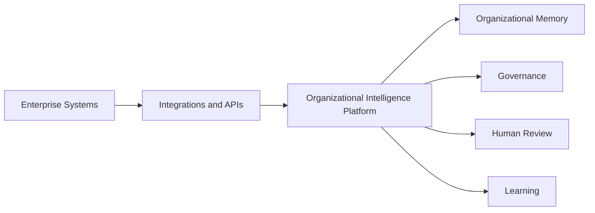
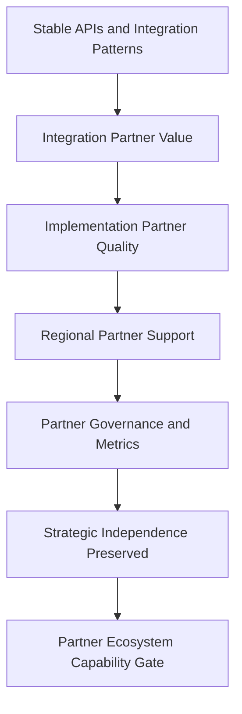

# Partner Ecosystem

## Derived From

- Canon Version: `v1.0.0`
- Architecture Version: `v1.0.0`
- Implementation Version: `v1.0.0`
- Product Version: `v1.0.0`
- Research Version: `v1.0.0`
- Strategy Version: `v1.0.0`
- Roadmap Philosophy Version: `v1.0.0`
- Platform Expansion Roadmap Version: `v1.0.0`
- SEA Expansion Roadmap Version: `v1.0.0`
- Global Expansion Roadmap Version: `v1.0.0`

### Primary Repository Sources

- [Canon](../canon/README.md)
- [Architecture](../architecture/README.md)
- [Implementation](../implementation/README.md)
- [Product](../product/README.md)
- [Research](../research/README.md)
- [Strategy](../strategy/README.md)
- [Roadmap](./README.md)
- [Roadmap Philosophy](./00_ROADMAP_PHILOSOPHY.md)
- [Platform Expansion](./12_PLATFORM_EXPANSION.md)
- [Southeast Asia Expansion](./13_SEA_EXPANSION.md)
- [Global Expansion](./14_GLOBAL_EXPANSION.md)

### Primary Supporting Documents

- [Partnership Strategy](../strategy/08_PARTNERSHIP_STRATEGY.md)
- [Integration Architecture](../architecture/11_INTEGRATION_ARCHITECTURE.md)
- [API Architecture](../implementation/15_API_ARCHITECTURE.md)
- [Security Architecture](../implementation/18_SECURITY_ARCHITECTURE.md)
- [Product Governance](../product/11_PRODUCT_GOVERNANCE.md)
- [Go-to-Market Strategy](../strategy/03_GO_TO_MARKET.md)
- [Business Model](../strategy/05_BUSINESS_MODEL.md)
- [Competitive Strategy](../strategy/06_COMPETITIVE_STRATEGY.md)
- [Growth Strategy](../strategy/07_GROWTH_STRATEGY.md)
- [Ideal Customer Profile](../strategy/02_IDEAL_CUSTOMER_PROFILE.md)
- [Enterprise Foundation](./10_ENTERPRISE_FOUNDATION.md)

---

Status: **Active**

## Primary Question

How should the company build a partner ecosystem that accelerates customer success, platform adoption, integrations, and category growth without compromising strategic independence or Canon alignment?

This document defines the Partner Ecosystem roadmap for the Organizational Intelligence Platform.

It is an ecosystem capability roadmap, not a reseller plan. It defines the categories, capabilities, governance, and readiness gates required for partners to become strategic multipliers rather than a substitute for the company's own customer success, product discipline, or independence.

## 1. Executive Summary

The Partner Ecosystem phase exists to help the Organizational Intelligence Platform become the learning layer across the enterprise systems customers already use.

Organizations already run help desks, CRMs, ITSM tools, HRIS, ERP, collaboration suites, and document systems. The platform's role is not to replace those systems. It is to integrate with, complement, and extend them so that the work happening inside them can become governed Organizational Memory, Human-reviewed knowledge, and improved future reasoning.

Partners are strategic multipliers in that mission. They help customers connect work, evidence, knowledge, memory, Governance, and AI-assisted reasoning across systems the company could never integrate with alone. But an ecosystem is a source of leverage only when it is disciplined: partners must accelerate customer success without diluting the category, and the company must remain strategically independent of any single partner type.

The company should therefore integrate, complement, and extend, not replace every system, and it should treat the ecosystem as a capability to be earned through quality, governance, and evidence, not assembled through channel-revenue ambition.

## 2. Purpose of the Partner Ecosystem

The purpose of the Partner Ecosystem is to multiply the company's ability to create customer value across systems, markets, and enterprise trust boundaries it cannot reach alone.

Partnerships should accelerate:

- customer implementation;
- integration depth with existing systems of record and work;
- regional expansion into new markets;
- enterprise trust and procurement credibility;
- category education and market understanding;
- technical capability across cloud, AI, security, and data infrastructure;
- customer success and adoption outcomes;
- platform extensibility through APIs and future extensions.

The purpose is not channel revenue for its own sake. Partnerships that add reach without improving customer outcomes, or that weaken category clarity, are not strategic even when they appear commercially attractive. The ecosystem exists to help customers turn work into governed memory, and every partner relationship should be evaluated against that standard.

## 3. Relationship to Platform Expansion and Global Expansion

The ecosystem develops alongside the platform and market roadmaps. Each phase creates a distinct ecosystem need.

| Roadmap Phase | Ecosystem Need |
| --- | --- |
| Platform Expansion | APIs, integrations, extension patterns |
| SEA Expansion | regional partners and localization |
| Global Expansion | enterprise partners and trust |
| Category Leadership | analyst, research, ecosystem influence |

Platform Expansion establishes the technical foundation, stable APIs, integration patterns, and extension boundaries, that makes an ecosystem possible. Southeast Asia Expansion creates demand for regional partners who provide local trust, language, and delivery capacity. Global Expansion raises the bar to enterprise-grade partners who can support procurement, security, and multi-region implementation. Category Leadership depends on a broader ecosystem of research, analyst, and industry influence.

The ecosystem should mature in step with these phases. Building marketplace or broad partner programs ahead of API stability, regional readiness, or enterprise trust would create commitments the platform cannot yet support.

## 4. Partnership Philosophy

The ecosystem should be governed by disciplined partnership principles rather than opportunistic channel building.

| Principle | Meaning |
| --- | --- |
| Customer success before channel revenue | Partnerships are evaluated first by whether they improve customer outcomes, not by the revenue they route. A partnership that adds revenue while weakening customer success is a strategic loss. |
| Complement before replace | The platform integrates with and extends existing systems rather than seeking to replace them; partners connect the platform to the customer's existing landscape. |
| Strategic independence | The company must not become dependent on any single partner, cloud, model, or channel for its core value or survival. |
| Trust alignment | Partners must respect the platform's trust model: Human Review, evidence, Provenance, Governance, and the boundary that keeps external systems from writing directly into Organizational Memory. |
| Open ecosystem | The platform should remain open to many partners through stable APIs and abstraction boundaries rather than locking customers into a closed set. |
| Integration discipline | Integrations must preserve Provenance, respect tenant boundaries, and create Knowledge Candidates rather than trusted memory; integration breadth never overrides these rules. |
| Partner quality over quantity | A small number of aligned, high-quality partners is worth more than a large partner count that dilutes the category or weakens delivery. |
| Category reinforcement | Partners should strengthen the Organizational Intelligence category, not reframe the platform as a chatbot, help desk add-on, or generic AI or services engagement. |

These principles apply to every partner category. A commercially attractive partnership that violates trust alignment, strategic independence, or category reinforcement should be reshaped or declined.

## 5. Partner Categories

The ecosystem spans several partner categories, each with a distinct role. No single category should define the platform's value or become a strategic dependency.

### 5.1 Technology Partners

Cloud providers, database and data infrastructure, observability, identity, security, and AI infrastructure partners.

Role: Provide the technical capabilities the platform runs on and integrates with. Technology partners increase capability and reliability but must sit behind abstraction boundaries so that no single provider becomes irreplaceable.

### 5.2 AI Model Providers

Providers of model capabilities accessed through the platform's provider abstraction.

Role: Supply reasoning, summarization, drafting, and enrichment capability. Models are consumed through an abstraction layer so providers can be changed, combined, or disabled without altering the platform's governed-learning identity or authority model. AI remains advisory; it does not own Validation, trust, or Governance.

### 5.3 Enterprise Software Partners

Help desk, CRM, ITSM, HRIS, ERP, collaboration, and document systems.

Role: Serve as the systems of record and work that the platform integrates with. These systems provide Work Signals, evidence, and context. The platform complements them by turning the work they hold into governed Organizational Memory; it does not replace them.

### 5.4 Implementation Partners

System integrators and consultants who deliver and adopt the platform for customers.

Role: Help customers succeed through onboarding, integration, change management, and adoption. Implementation partners extend delivery capacity but must follow delivery standards that preserve category positioning and avoid over-customization.

### 5.5 Regional Partners

Local firms that support market access, localization, and trust in Southeast Asia and global markets.

Role: Provide local market insight, language capability, procurement navigation, and relationships. Regional partners make responsible market entry possible where direct entry is impractical, supporting the SEA and Global Expansion roadmaps.

### 5.6 Research and University Partners

Academic and research institutions that support research, talent, credibility, and long-term category thinking.

Role: Strengthen the intellectual foundation of the category, contribute to organizational learning, knowledge representation, AI governance, and explainability, and provide talent and independent credibility over the long term.

### 5.7 Industry and Government Partners

Industry associations, standards bodies, and public-sector and digital transformation programs.

Role: Support standards, public-sector credibility, and access to concentrated ICP communities. These partners can shape market norms and provide credibility in regulated and public markets, typically as later-stage relationships.

### 5.8 Future Marketplace Partners

Developers or firms that create integrations, templates, workflow packs, or domain accelerators.

Role: In a future state, extend the platform through partner-built integrations and accelerators. This category depends on stable APIs, a security model, and partner governance, and should not be activated before those prerequisites exist.

## 6. Ecosystem Architecture

Partners connect to the platform through governed integration and API boundaries. External systems provide evidence and workflow context; they do not become organizational truth by connecting.

Enterprise systems, help desks, CRMs, ITSM, HRIS, ERP, collaboration, and document systems, supply Work Signals, evidence, and workflow context through governed integrations and APIs. The platform interprets that input, but external systems cannot write directly into Organizational Memory.

Consistent with the [Integration Architecture](../architecture/11_INTEGRATION_ARCHITECTURE.md), every integration stops at the Knowledge Candidate boundary. Imported and connected content becomes a Knowledge Candidate that must pass Validation, Human Review, and Governance before it can become trusted Organizational Memory. This boundary is what allows the platform to integrate widely without letting unvalidated external data become organizational truth, and it is the architectural expression of the ecosystem's trust-alignment principle.

## 7. Integration Partner Roadmap

Integration partners connect the platform to the systems where customer work already happens. Integration capability should mature through a defined set of capabilities.

| Capability | Purpose |
| --- | --- |
| Connector framework | A consistent framework for building and maintaining integrations across systems. |
| API authentication | Secure, standards-based authentication for connected systems. |
| Permission-aware ingestion | Ingestion that respects source-system permissions and tenant access boundaries. |
| Event ingestion | Ability to receive relevant external events as Work Signals. |
| Evidence mapping | Mapping external records to internal evidence with Source and context preserved. |
| Sync monitoring | Visibility into synchronization state, latency, and failures. |
| Integration health | Ongoing health signals for each connected integration. |
| Connector governance | Review, approval, and lifecycle governance for connectors. |

Success criteria:

- integrations preserve Provenance from source to internal representation;
- integrations respect tenant boundaries and never cross organizational isolation;
- integrations create Knowledge Candidates first, never trusted memory directly;
- customers understand what data flows, where it goes, and how it is governed.

Integration breadth is valuable only when these criteria hold. A connector that ingests broadly but loses Provenance, crosses tenant boundaries, or bypasses Validation weakens the platform regardless of its convenience.

## 8. Implementation Partner Roadmap

Implementation partners help customers succeed by delivering onboarding, integration, and adoption. Their enablement should mature through defined capabilities.

| Capability | Purpose |
| --- | --- |
| Partner onboarding | A structured process for bringing implementation partners into the ecosystem. |
| Implementation methodology | A documented, teachable delivery approach aligned to the platform's value model. |
| Training | Product, integration, and adoption training for partner teams. |
| Certification path | A defined path for partners to demonstrate delivery competence. |
| Delivery standards | Standards that ensure consistent, high-quality implementations. |
| Customer success alignment | Alignment between partner delivery and the company's customer success model. |
| Governance training | Training on Human Review, Validation, Provenance, and Governance boundaries. |
| Escalation process | Clear escalation paths between partners and the company. |

Success criteria:

- partners reduce onboarding friction and time to value;
- partners do not over-customize in ways that distort the product;
- partners preserve category positioning rather than reframing the platform as generic services or AI tooling;
- partner-led implementations produce measurable organizational value.

Implementation partners extend delivery capacity, but poor implementation quality damages trust and references faster than it creates growth. Enablement, standards, and governance training are prerequisites for scaling partner-led delivery.

## 9. Regional Partner Roadmap

Regional partners support Southeast Asia and global expansion by providing local trust, language, and delivery capacity.

| Capability | Purpose |
| --- | --- |
| Local market insight | Understanding of local buyers, sectors, and support operating models. |
| Language support | Local-language delivery, support, and customer communication. |
| Procurement navigation | Help navigating local vendor onboarding and procurement expectations. |
| Local trust | Relationships and credibility that accelerate responsible adoption. |
| Implementation support | Local delivery capacity for onboarding and change management. |
| Industry introductions | Access to concentrated ICP communities and sector networks. |

Success criteria:

- partners improve local customer success and adoption outcomes;
- regional expansion does not exceed the company's ability to support customers well;
- local partners understand core Organizational Intelligence concepts and preserve them.

Regional partners make market entry responsible where direct entry is impractical, but they must be aligned to the platform's concepts and trust model. Regional expansion should not outpace support capacity or dilute the category through poorly aligned local delivery.

## 10. Technology Partner Roadmap

Technology partners increase platform capability without defining the moat. The platform's differentiation comes from governed Organizational Memory and learning, not from any single technology provider.

| Capability | Purpose |
| --- | --- |
| Cloud deployment support | Deployment, scaling, and regional availability across cloud environments. |
| AI provider optionality | The ability to use, combine, or change AI providers through abstraction. |
| Observability | Monitoring, tracing, and operational visibility for reliability. |
| Security | Security tooling and controls that strengthen enterprise trust. |
| Data infrastructure | Storage and data platform capabilities behind stable boundaries. |
| Identity integration | Enterprise identity and single sign-on integration. |

Success criteria:

- no single technology partner becomes a strategic dependency the company cannot replace;
- abstraction boundaries remain intact so providers can be changed without redefining the platform;
- customer trust improves through better reliability, security, and optionality.

Technology partners should expand what the platform can do while preserving strategic independence. The abstraction boundaries that keep cloud and model providers replaceable are a core defense against vendor lock-in.

## 11. Research and Academic Ecosystem

Research and academic partners provide long-term category credibility, talent, and intellectual depth. Their value is strategic rather than immediate.

Potential research areas include:

- organizational learning;
- knowledge representation;
- AI governance;
- human-AI collaboration;
- enterprise cognition;
- trust and explainability.

Success criteria:

- research strengthens the credibility of the Organizational Intelligence category;
- research does not distract from customer validation and near-term product evidence;
- insights feed back into the repository and product roadmap.

The research ecosystem should mature deliberately. It reinforces category leadership over time, but it must not divert focus from proving customer value in the near term. Research relationships are most valuable when their insights become traceable inputs to the Canon-aligned repository rather than isolated academic output.

## 12. Partner Evaluation Framework

Partners should be evaluated through a consistent, weighted scorecard so that ecosystem growth follows strategic fit rather than opportunity alone.

| Criterion | Weight | What It Assesses |
| --- | --- | --- |
| Strategic Alignment | 5 | Fit with the company's mission, category, and long-term direction. |
| Customer Impact | 5 | Whether the partner measurably improves customer outcomes. |
| Trust Alignment | 5 | Respect for Human Review, Provenance, Governance, and data boundaries. |
| Category Reinforcement | 4 | Whether the partner strengthens or dilutes the Organizational Intelligence category. |
| Implementation Quality | 4 | Delivery competence and adherence to standards. |
| Technical Compatibility | 3 | Fit with APIs, integration patterns, and abstraction boundaries. |
| Regional Relevance | 3 | Value for target market entry and localization. |
| Long-Term Sustainability | 3 | Durability and reliability of the partnership over time. |
| Independence Risk | 5 | Degree to which the partnership creates strategic dependency (scored inversely; higher score means lower risk). |
| Integration Effort | 2 | Cost and complexity of enabling and maintaining the partnership. |

### Scoring Interpretation

Each criterion is scored from `1` to `5` and multiplied by its weight; the weighted total guides prioritization.

| Weighted Result | Interpretation |
| --- | --- |
| Low | Decline or defer; strategic fit or trust alignment is insufficient. |
| Moderate | Explore selectively; address gaps before deeper commitment. |
| Strong | Prioritize; strong fit, customer impact, and trust alignment. |
| Exceptional | Pursue as a strategic partner with governance oversight. |

Trust alignment, strategic alignment, customer impact, and independence risk carry the highest weight because a partner that fails any of them can weaken the platform even if it scores well elsewhere. A high total should still require judgment: any severe weakness in trust alignment or independence risk is a reason to reshape or decline the partnership regardless of the aggregate score.

## 13. Partner Governance

The ecosystem requires governance so that partner growth strengthens rather than erodes trust, quality, and category clarity. Partner governance extends [Product Governance](../product/11_PRODUCT_GOVERNANCE.md).

| Governance Area | Rule |
| --- | --- |
| Partner onboarding standards | Partners meet defined alignment, competence, and trust standards before activation. |
| Integration security review | Every integration undergoes security review before it connects to customer data. |
| Customer data boundaries | Partners respect tenant isolation, permissions, and the boundary that prevents direct writes to Organizational Memory. |
| Implementation quality review | Partner-led implementations are reviewed against delivery standards and outcomes. |
| Category language alignment | Partners represent the platform using the Organizational Intelligence category, not chatbot or generic-AI framing. |
| Partner performance metrics | Partner contribution is measured by customer outcomes, not activity alone. |
| Escalation ownership | Escalation paths and accountability between partners and the company are explicit. |
| Roadmap influence boundaries | Partner input informs but does not control the product roadmap or Canon. |

Governance should scale with partner impact. A partner touching customer data, implementation quality, or category positioning requires stronger review than a low-risk technical relationship. Partner input is welcome, but the company retains authority over product direction and Canon alignment.

## 14. Marketplace Readiness

A marketplace is a future-state capability, not an immediate deliverable. It should be activated only after the ecosystem foundations exist.

A future marketplace may include:

- integrations;
- workflow templates;
- knowledge domain accelerators;
- Governance templates;
- analytics packs;
- partner-built extensions.

Prerequisites before a marketplace is opened:

- stable, versioned APIs;
- a mature security model for partner-built components;
- a review process for submitted integrations and extensions;
- quality standards partners must meet;
- demonstrated customer demand for partner-built capabilities;
- partner governance sufficient to manage third-party contributions.

Launching a marketplace before these prerequisites would expose customers to unreviewed extensions, weaken security, and dilute quality. Marketplace readiness should be treated as a gated milestone that depends on API stability, security, governance, and real demand, not as an early growth lever.

## 15. Ecosystem Metrics

The ecosystem should be evaluated through customer-value and quality metrics, interpreted by partner and market rather than as aggregate activity.

| Metric | Why It Matters |
| --- | --- |
| Active Integration Partners | Shows the breadth of systems customers can connect responsibly. |
| Active Implementation Partners | Shows delivery capacity available to support customer success. |
| Partner-Sourced Customers | Shows whether partners generate qualified demand. |
| Partner-Assisted Activation Rate | Shows whether partner-supported customers reach value. |
| Integration Health | Shows whether integrations remain reliable and governed over time. |
| Implementation Quality | Shows whether partner-led delivery meets standards and produces value. |
| Customer Satisfaction by Partner | Shows which partners strengthen or weaken customer trust. |
| Time to First Value with Partner | Shows whether partners accelerate meaningful outcomes. |
| Partner Contribution to Expansion | Shows whether partners support retention and account growth. |
| Partner-Driven Category Awareness | Shows whether partners reinforce the Organizational Intelligence category. |

These metrics should distinguish partners that create durable customer value from those that only add activity. High partner counts without activation, quality, and satisfaction are not evidence of a healthy ecosystem.

## 16. Capability Gate

The Partner Ecosystem should mature through evidence, not assumed because partnerships are commercially attractive.

The Partner Ecosystem is validated when:

- integrations improve customer value while preserving Provenance and boundaries;
- implementation partners reduce onboarding friction and produce measurable value;
- regional partners improve responsible market entry;
- partner activity preserves category clarity;
- partner quality is measurable and managed;
- APIs are stable enough to support external integration and extension;
- customer trust improves through partner involvement;
- no partner creates a dangerous strategic dependency.

This gate should be applied by partner category. Strength in one category, such as technology partners, does not authorize unmanaged expansion in another, such as marketplace or reseller relationships.

## 17. Risks

The Partner Ecosystem carries risks that must be managed through governance, quality standards, and capability gates.

| Risk | Why It Matters |
| --- | --- |
| Reseller-first thinking | Prioritizing channel revenue over customer success weakens outcomes and category integrity. |
| Poor partner quality | Weak partners damage customer trust and references. |
| Over-customization by partners | Bespoke partner delivery can distort the product and erode platform coherence. |
| Category dilution | Partners may reframe the platform as a chatbot, help desk, or generic AI or services offering. |
| Vendor lock-in | Dependence on a single provider can compromise independence and pricing power. |
| Cloud or model dependency | Over-reliance on one cloud or AI provider creates strategic and operational risk. |
| Integration security risk | Poorly governed integrations can expose customer data or cross tenant boundaries. |
| Channel conflict | Overlapping partner and direct motions can create conflict and customer confusion. |
| Partner roadmap conflict | Partners may push for roadmap changes that conflict with the Canon or product direction. |
| Marketplace launched too early | A premature marketplace exposes customers to unreviewed, insecure, or low-quality extensions. |

These risks reinforce the central discipline: the ecosystem should multiply customer value and reach without compromising trust, quality, category clarity, or strategic independence.

## 18. Deliverables

The Partner Ecosystem roadmap should produce reusable organizational learning and governance artifacts before broad ecosystem commitments. Expected deliverables include:

- a partner category framework;
- a partner evaluation scorecard;
- an integration partner roadmap;
- an implementation partner enablement plan;
- a regional partner strategy;
- a partner governance model;
- a marketplace readiness checklist;
- a partner metrics dashboard.

These deliverables matter because ecosystem growth should be governed by frameworks, governance, and evidence rather than by opportunistic partnerships or channel pressure.

## 19. Relationship to Category Leadership

A strong ecosystem helps the category mature, but it is not the same as category leadership.

Partners extend reach, trust, and implementation capacity. They connect the platform to more systems, more markets, and more customers, and they reinforce credibility through research, industry, and enterprise relationships. This accelerates category understanding and adoption.

Category leadership, however, still depends on customer outcomes and product discipline. An ecosystem can amplify a strong product and clear category, but it cannot substitute for them. If customer outcomes are weak or the category is unclear, a large ecosystem will amplify confusion rather than leadership. The ecosystem is a multiplier of the company's core strength, not a replacement for it.

## 20. Traceability Matrix

The Partner Ecosystem should remain traceable to the broader repository.

| Source | Partner Ecosystem Derivation |
| --- | --- |
| [Canon](../canon/README.md) | Defines the enduring product identity, Human Review, Governance, and Organizational Memory principles partners must preserve. |
| [Integration Architecture](../architecture/11_INTEGRATION_ARCHITECTURE.md) | Defines how external systems contribute as Knowledge Candidates without writing directly into Organizational Memory. |
| [API Architecture](../implementation/15_API_ARCHITECTURE.md) | Defines the API boundaries, authentication, and extension patterns that integrations and partners depend on. |
| [Security Architecture](../implementation/18_SECURITY_ARCHITECTURE.md) | Defines the security model, tenant boundaries, and review requirements for partner integrations. |
| [Product Governance](../product/11_PRODUCT_GOVERNANCE.md) | Defines the governance discipline that partner onboarding, quality, and roadmap boundaries extend. |
| [Partnership Strategy](../strategy/08_PARTNERSHIP_STRATEGY.md) | Defines the strategic partner framing that this roadmap operationalizes as capability. |
| [Growth Strategy](../strategy/07_GROWTH_STRATEGY.md) | Defines the staged, evidence-gated growth logic the ecosystem supports without leading. |
| [Competitive Strategy](../strategy/06_COMPETITIVE_STRATEGY.md) | Defines the differentiation and independence the ecosystem must preserve. |
| [Business Model](../strategy/05_BUSINESS_MODEL.md) | Defines how partner-driven growth should support durable value capture without channel-first distortion. |
| [Platform Expansion](./12_PLATFORM_EXPANSION.md) | Defines the API and integration maturity that makes an ecosystem possible. |
| [Southeast Asia Expansion](./13_SEA_EXPANSION.md) | Defines the regional partner needs of early market expansion. |
| [Global Expansion](./14_GLOBAL_EXPANSION.md) | Defines the enterprise and global partner needs of later expansion. |
| [Roadmap Philosophy](./00_ROADMAP_PHILOSOPHY.md) | Defines capability-gated, evidence-driven progression and validation before expansion. |

## 21. What This Document Does NOT Define

This document intentionally does not define:

- a final reseller program;
- final partner contracts;
- a revenue share model;
- a full marketplace launch;
- legal terms;
- a final certification system;
- specific partner commitments.

Those belong to later operating plans, commercial and legal review, partner operations, and marketplace program documentation.

This document defines only the ecosystem capability roadmap for developing partners responsibly.

## 22. Closing

The Partner Ecosystem succeeds when partners help customers turn work into governed memory while strengthening, not weakening, the Organizational Intelligence Platform category.

Partners are strategic multipliers, not channels to be maximized. They extend the company's reach across the systems, markets, and trust boundaries it cannot cross alone, but only when they preserve customer success, trust alignment, category clarity, and the company's strategic independence.

That is the standard this roadmap exists to enforce.
