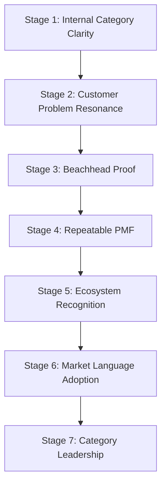
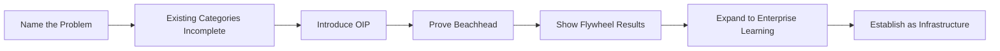
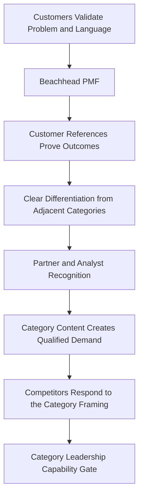

# Category Leadership

## Derived From

- Canon Version: `v1.0.0`
- Architecture Version: `v1.0.0`
- Implementation Version: `v1.0.0`
- Product Version: `v1.0.0`
- Research Version: `v1.0.0`
- Strategy Version: `v1.0.0`
- Roadmap Philosophy Version: `v1.0.0`
- Platform Expansion Roadmap Version: `v1.0.0`
- SEA Expansion Roadmap Version: `v1.0.0`
- Global Expansion Roadmap Version: `v1.0.0`
- Partner Ecosystem Roadmap Version: `v1.0.0`

### Primary Repository Sources

- [Canon](../canon/README.md)
- [Architecture](../architecture/README.md)
- [Implementation](../implementation/README.md)
- [Product](../product/README.md)
- [Research](../research/README.md)
- [Strategy](../strategy/README.md)
- [Roadmap](./README.md)
- [Roadmap Philosophy](./00_ROADMAP_PHILOSOPHY.md)
- [Platform Expansion](./12_PLATFORM_EXPANSION.md)
- [Southeast Asia Expansion](./13_SEA_EXPANSION.md)
- [Global Expansion](./14_GLOBAL_EXPANSION.md)
- [Partner Ecosystem](./15_PARTNER_ECOSYSTEM.md)

### Primary Supporting Documents

- [Founder's Thesis](../canon/00_FOUNDERS_THESIS.md)
- [Category Design](../strategy/00_CATEGORY_DESIGN.md)
- [Positioning](../strategy/01_POSITIONING.md)
- [Ideal Customer Profile](../strategy/02_IDEAL_CUSTOMER_PROFILE.md)
- [Business Model](../strategy/05_BUSINESS_MODEL.md)
- [Competitive Strategy](../strategy/06_COMPETITIVE_STRATEGY.md)
- [Growth Strategy](../strategy/07_GROWTH_STRATEGY.md)
- [Partnership Strategy](../strategy/08_PARTNERSHIP_STRATEGY.md)
- [Long-Term Vision](../strategy/09_LONG_TERM_VISION.md)
- [Product Metrics](../product/10_PRODUCT_METRICS.md)
- [Product-Market Fit](./08_PRODUCT_MARKET_FIT.md)
- [Customer Discovery](../research/02_CUSTOMER_DISCOVERY.md)

---

Status: **Active**

## Primary Question

How does the company become recognized as a defining leader of the Organizational Intelligence Platform category?

This document defines the Category Leadership roadmap for the Organizational Intelligence Platform.

Category Leadership is not achieved through messaging alone. It is earned through customer outcomes, product discipline, ecosystem credibility, analyst recognition, thought leadership, trust, and consistent execution over time. This document defines how the company moves from defining the category internally to being recognized by the market as the reference point for it, and it treats every stage as evidence-gated rather than declared.

## 1. Executive Summary

Category Leadership is earned when the market recognizes Organizational Intelligence Platform as a meaningful enterprise software category and associates the company with defining it.

The company does not become a category leader by describing itself as one. Leadership is a judgment made by customers, buyers, analysts, partners, and future employees, based on what they observe: whether the category names a real problem, whether the company's customers experience real outcomes, and whether the company consistently exemplifies the category it claims to lead.

Category Leadership therefore depends on:

- customer proof, demonstrated through real outcomes;
- category clarity that the market can understand and repeat;
- product maturity that exemplifies the category promise;
- trust earned through governed, reviewable AI-assisted learning;
- an ecosystem that recognizes and reinforces the category;
- thought leadership grounded in evidence rather than assertion;
- repeatable value across multiple customers;
- defensibility that makes the leadership durable.

The company should never claim leadership ahead of this evidence. Premature claims damage trust and undermine the very category the company is trying to establish. Category Leadership is the disciplined outcome of doing the work, not a message applied on top of it.

## 2. What Category Leadership Means

Category Leadership means the company shapes how the market understands a new class of enterprise software, and is recognized as the company that defined it.

Concretely, it means the company influences how customers, investors, analysts, partners, and employees understand:

- Organizational Entropy as a real and costly enterprise problem;
- Organizational Intelligence as the capability that addresses it;
- the Knowledge Flywheel as the mechanism by which work becomes durable capability;
- Organizational Memory as the core asset that compounds over time;
- governed AI-assisted learning as distinct from ungoverned automation;
- Human Review as a source of trust rather than a limitation;
- enterprise trust as a precondition for adoption at scale.

Leadership is demonstrated when these concepts enter the market's own vocabulary and buying criteria, and when the company is the reference point people use to understand them. It is a position of recognized definition, not a claim of superiority.

## 3. What Category Leadership Is Not

Category Leadership is frequently confused with visibility. The following are not category leadership, and treating them as such produces awareness without substance.

| Mistaken for Leadership | Why It Is Insufficient |
| --- | --- |
| Marketing slogans | Slogans describe a claim; they do not prove a category exists or that customers experience it. |
| Media mentions | Coverage reflects attention, not whether the market understands or adopts the category. |
| Website traffic | Traffic measures reach, not category comprehension or customer outcomes. |
| Self-declared leadership | Leadership is a judgment made by the market, not a statement the company can assign to itself. |
| AI hype | Riding AI attention can attract interest while eroding the distinction between governed learning and generic AI. |
| Analyst outreach without customer proof | Analysts recognize categories backed by customer evidence; outreach without proof is dismissed or discounted. |
| Broad awareness without adoption | Awareness that does not convert to adoption and outcomes is not evidence of a real category. |
| Feature comparison wins | Winning feature comparisons competes inside adjacent categories rather than establishing a new one. |

Each of these can accompany category leadership, but none produces it. Brand awareness is not category leadership; a category is real only when the market recognizes the problem, adopts the language, and experiences the outcome.

## 4. Relationship to Category Design

[Category Design](../strategy/00_CATEGORY_DESIGN.md) defines the category. Category Leadership proves it in the market. The two are sequential: definition precedes proof, and proof is what converts a defined category into a recognized one.

| Category Design Defines | Category Leadership Proves |
| --- | --- |
| The category problem | Market recognizes the problem |
| Category language | Customers repeat the language |
| Differentiation | Buyers understand the distinction |
| Knowledge Flywheel | Customers experience the mechanism |
| OIP thesis | Market accepts the category logic |

Category Design is an act of definition the company controls. Category Leadership is an act of recognition the market grants. The company cannot shortcut from definition to recognition through messaging; it must produce the customer outcomes, product discipline, and evidence that make the defined category real to others.

## 5. Category Leadership Stages

Category Leadership matures through stages, each earning the right to the next. The company should not claim a later stage before the evidence of the earlier ones exists.

### Stage 1 — Internal Category Clarity

The repository and team share a clear, consistent understanding of the Organizational Intelligence Platform category.

Evidence: Canon-aligned documentation, consistent internal language, and a coherent category thesis across strategy, product, and roadmap.

Risk: Internal clarity can be mistaken for market readiness. Understanding the category internally does not prove that customers experience it.

### Stage 2 — Customer Problem Resonance

ICP customers recognize Organizational Entropy as a real problem in their own words.

Evidence: Discovery interviews in which customers describe repeated work, knowledge loss, and expert dependency without prompting.

Risk: Customers may agree the problem exists without believing it is solvable or worth paying to address.

### Stage 3 — Beachhead Proof

Customer Support customers validate the category mechanism, turning work into governed memory that improves future work.

Evidence: Design partner and early customer results showing knowledge reuse and reduced repeated work in the beachhead.

Risk: Early proof may be narrow, founder-assisted, or non-repeatable, and should not be generalized prematurely.

### Stage 4 — Repeatable PMF

Multiple customers adopt, retain, expand, and advocate, demonstrating the category works beyond individual cases.

Evidence: Retention, expansion, and reference willingness across several customers, consistent with [Product-Market Fit](./08_PRODUCT_MARKET_FIT.md) signals.

Risk: Apparent PMF can be inflated by a few strong accounts; repeatability must be genuine across the ICP.

### Stage 5 — Ecosystem Recognition

Partners and analysts begin to understand the category as distinct.

Evidence: Partners representing the category accurately, and analysts or advisors acknowledging the distinction from adjacent categories.

Risk: Ecosystem interest without customer proof is fragile and can misrepresent or dilute the category.

### Stage 6 — Market Language Adoption

Customers and market participants use the category language on their own.

Evidence: Buyers, customers, and partners describing their need using Organizational Entropy, Organizational Memory, and governed learning language independently.

Risk: Language can be adopted superficially or co-opted by competitors without the underlying substance.

### Stage 7 — Category Leadership

The company becomes the reference point for the Organizational Intelligence Platform category.

Evidence: The market consistently associates the company with defining the category, backed by durable customer outcomes, ecosystem recognition, and defensibility.

Risk: Leadership can erode if product discipline lapses, customer outcomes weaken, or the category drifts toward generic AI positioning.

## 6. Category Proof Pillars

Category Leadership rests on pillars of proof. Each pillar must be evidenced; messaging without these pillars is assertion, not leadership.

### 6.1 Customer Outcomes

Customers must prove the category with real results. Outcomes are the foundation on which every other pillar depends.

Evidence:

- knowledge reuse across cases and teams;
- reduced repeated work and duplicated investigation;
- improved consistency of answers and decisions;
- reduced expert dependency;
- better and faster onboarding;
- executive confidence that the organization is becoming more capable.

### 6.2 Product Discipline

The product must remain aligned with the Canon so that it continues to exemplify the category rather than drift toward generic AI.

Evidence:

- Human Review remains central to trusted knowledge;
- AI remains an amplifier, not an authority;
- Organizational Memory remains governed and validated;
- evidence and Provenance remain preserved;
- the platform does not become a generic AI tool, chatbot, or help desk add-on.

### 6.3 Market Education

The company must teach the market to understand the problem and the category, because a new category cannot be recognized before it is understood.

Topics:

- Organizational Entropy and its cost;
- why AI alone is insufficient without governed memory;
- why search is not learning;
- why Customer Support is the beachhead;
- why governed Organizational Memory matters;
- how the Knowledge Flywheel works.

### 6.4 Thought Leadership

Thought leadership should be evidence-based and grounded in customer reality, not speculation or trend-chasing.

Outputs:

- essays;
- whitepapers;
- benchmark reports;
- customer stories;
- research briefs;
- conference talks;
- category guides.

### 6.5 Customer Advocacy

Customers become the strongest category educators because their proof is credible in ways the company's own claims cannot be.

Evidence:

- references;
- case studies;
- peer referrals;
- executive quotes;
- community participation.

### 6.6 Analyst and Ecosystem Recognition

Analysts, advisors, partners, and communities begin to understand the Organizational Intelligence Platform as distinct.

Evidence:

- analyst briefings that acknowledge the category;
- category mentions in industry discussion;
- partner alignment to the category;
- industry and community discussion of the problem;
- ecosystem adoption of the category framing.

### 6.7 Competitive Differentiation

The market must understand how the Organizational Intelligence Platform differs from adjacent categories rather than seeing it as a variant of them.

The category is distinct from:

- help desks;
- CRMs;
- knowledge bases;
- enterprise search;
- AI chatbots;
- AI agents;
- workflow automation.

Differentiation is proven when buyers can articulate the distinction themselves, consistent with the [Competitive Strategy](../strategy/06_COMPETITIVE_STRATEGY.md).

## 7. Category Narrative Roadmap

The category narrative should mature in sequence, from naming the problem to establishing the category as infrastructure. Each step depends on the credibility of the previous one.

1. Name the problem: Organizational Entropy.
2. Explain why existing categories are incomplete.
3. Introduce the Organizational Intelligence Platform.
4. Prove the Customer Support beachhead.
5. Show Knowledge Flywheel results.
6. Expand to enterprise learning across functions.
7. Establish the Organizational Intelligence Platform as enterprise infrastructure.

The narrative should never advance ahead of the evidence. Claiming enterprise infrastructure status before beachhead proof or Flywheel results would break the credibility the narrative depends on.

## 8. Category Education Channels

Category education should reach customers, buyers, partners, analysts, and future employees through channels suited to a new category. Content should teach the problem and category, not promote features.

| Channel | Purpose |
| --- | --- |
| Founder essays | Articulate the problem and category thesis with credibility and conviction. |
| Executive briefings | Help senior buyers understand Organizational Entropy and governed learning. |
| Customer case studies | Provide credible, outcome-based proof of the category. |
| Webinars | Educate audiences on the problem, mechanism, and evidence. |
| Research reports | Ground the category in evidence and market analysis. |
| Open architecture writing | Explain the governed-learning model transparently to build technical trust. |
| Partner education | Enable partners to represent the category accurately. |
| Analyst briefings | Help analysts recognize and classify the category. |
| Community events | Build shared language and peer credibility among practitioners. |
| Educational product content | Teach the category through the product experience itself. |

Education channels should reinforce one consistent, evidence-backed narrative. Fragmented or hype-driven messaging across channels weakens category clarity.

## 9. Evidence Requirements

Category claims must be backed by evidence. The company should not make a category claim it cannot support with observable proof.

| Evidence Type | What It Establishes |
| --- | --- |
| Customer outcomes | That the category produces real organizational value. |
| Metrics | That value is measurable, consistent with [Product Metrics](../product/10_PRODUCT_METRICS.md). |
| Validated case studies | That outcomes are credible and repeatable. |
| Retention | That customers continue to trust and use the platform. |
| Expansion | That value grows within accounts over time. |
| Workflow proof | That the platform improves real work, not demonstrations. |
| Knowledge reuse data | That the Knowledge Flywheel operates in practice. |
| Design partner learnings | That early evidence informs and validates the category. |
| Research-backed market analysis | That the category reflects a real market need. |
| Third-party validation | That recognition comes from outside the company. |

Evidence should precede claims at every stage. A category claim that outruns its evidence damages trust more than a slower, better-supported claim would.

## 10. Category Metrics

Category Leadership should be measured through recognition, adoption, and proof metrics rather than awareness alone.

| Metric | Why It Matters |
| --- | --- |
| Customer References | Shows credible, outcome-based proof the market can trust. |
| Category-Language Adoption | Shows whether customers and the market use the category language independently. |
| Analyst Conversations | Shows whether analysts are engaging with and recognizing the category. |
| Organic Inbound from Problem Language | Shows whether the market is searching for and recognizing the problem. |
| PMF Indicators | Shows whether the category is validated by repeatable adoption and retention. |
| Repeatable Win Reasons | Shows whether customers buy for consistent, category-aligned reasons. |
| Partner Adoption | Shows whether the ecosystem understands and reinforces the category. |
| Customer Expansion | Shows whether value compounds, reflecting the category promise. |
| Thought Leadership Engagement Quality | Shows whether education reaches and resonates with the right audiences. |
| Market Confusion Reduction | Shows whether the market increasingly distinguishes the category from adjacent ones. |
| Competitive Displacement Clarity | Shows whether the company wins on category terms rather than feature comparison. |

These metrics should be read together. Category-language adoption without customer references, or awareness without PMF, indicates visibility rather than leadership.

## 11. Category Leadership Capability Gate

The company may claim early category leadership only when the evidence supports it. Leadership is gated, not declared.

The company may claim early category leadership only when:

- customers validate the problem and repeat the category language;
- Product-Market Fit exists in the beachhead;
- customer references prove real outcomes;
- the product clearly differs from adjacent categories;
- partners understand and represent the category;
- analysts or advisors recognize the distinction;
- category content creates qualified inbound demand;
- competitors begin responding to the category framing;
- the company maintains Canon discipline throughout.

Even then, the claim should be proportionate to the evidence. Early recognition is not the same as durable leadership, and the gate should be re-applied as the company scales into new markets and segments.

## 12. Risks

The pursuit of Category Leadership carries risks that can undermine the category itself if not managed.

| Risk | Why It Matters |
| --- | --- |
| Declaring leadership too early | Claims ahead of evidence damage trust and invite skepticism. |
| Over-marketing without proof | Marketing that outruns customer outcomes hollows out the category. |
| Becoming a generic AI company | Drifting into AI hype erases the distinction the category depends on. |
| Category language too abstract | Language that customers cannot connect to their reality fails to resonate. |
| Customers not repeating the language | If customers do not adopt the language, the category has not become real. |
| Competitors co-opting the category | Incumbents may adopt the language without the substance, creating confusion. |
| Analysts misunderstanding the category | Misclassification can trap the platform inside adjacent categories. |
| Product drifting from the category promise | If the product stops exemplifying the category, leadership claims collapse. |
| Weak customer proof | Without strong references, the category lacks credible evidence. |
| Hype damaging trust | Overclaiming undermines the trust that governed learning depends on. |

These risks share a root cause: allowing narrative to outpace proof. The discipline of evidence before claims is the primary defense.

## 13. Defensibility Through Category Leadership

Category Leadership is not only a marketing outcome; it strengthens the company's defensibility in durable ways, consistent with the [Competitive Strategy](../strategy/06_COMPETITIVE_STRATEGY.md).

| Defensibility Effect | How Category Leadership Creates It |
| --- | --- |
| Shapes buying criteria | Buyers evaluate solutions using the category's terms, which the company defined. |
| Frames competitors as adjacent | Help desks, CRMs, search, and chatbots are positioned as neighboring, not equivalent. |
| Attracts better customers | Customers who understand the category adopt for the right reasons and succeed. |
| Attracts partners | Partners align to a recognized category rather than an undefined product. |
| Attracts talent | A clear, credible category draws people who want to build it. |
| Improves investor understanding | Investors evaluate the company as a category creator, not a feature vendor. |
| Strengthens customer trust | Consistent category discipline reinforces the trust the platform depends on. |
| Reinforces product discipline | Leading a category the company must exemplify keeps the product aligned to the Canon. |

Defensibility compounds with leadership. The more the market accepts the category, the more the company's customer proof, ecosystem, and product discipline reinforce one another.

## 14. Deliverables

The Category Leadership roadmap should produce evidence and enablement artifacts rather than promotional material. Expected deliverables include:

- a category proof report;
- a customer case study library;
- a category narrative guide;
- an analyst briefing deck outline;
- a partner category education kit;
- executive education content;
- a competitive differentiation framework;
- a thought leadership calendar;
- a category metrics dashboard.

These deliverables matter because category leadership should be built on evidence, enablement, and consistent narrative discipline, not on campaign output disconnected from customer proof.

## 15. Relationship to Long-Term Vision

Category Leadership is a milestone toward the [Long-Term Vision](../strategy/09_LONG_TERM_VISION.md) of making Organizational Intelligence a standard enterprise software layer, alongside categories such as ERP, CRM, and HR systems.

It is not the final destination. Leadership of an emerging category is the point at which the market recognizes the category and the company's role in defining it. The longer ambition is for Organizational Intelligence to become permanent enterprise infrastructure, a standard way organizations preserve and compound what they learn. Category Leadership makes that ambition credible, but sustaining it requires continued customer outcomes, product discipline, and execution over many years.

The company should treat leadership as a responsibility to keep proving the category, not as a conclusion.

## 16. Traceability Matrix

Category Leadership should remain traceable to the broader repository.

| Source | Category Leadership Derivation |
| --- | --- |
| [Founder's Thesis](../canon/00_FOUNDERS_THESIS.md) | Defines the founding problem of organizational forgetting that the category exists to solve. |
| [Canon](../canon/README.md) | Defines the enduring concepts the category must make real and the discipline leadership must preserve. |
| [Category Design](../strategy/00_CATEGORY_DESIGN.md) | Defines the category that Category Leadership proves in the market. |
| [Positioning](../strategy/01_POSITIONING.md) | Defines how the company should be perceived within the category. |
| [Competitive Strategy](../strategy/06_COMPETITIVE_STRATEGY.md) | Defines the differentiation and defensibility that leadership reinforces. |
| [Growth Strategy](../strategy/07_GROWTH_STRATEGY.md) | Defines the staged, evidence-gated growth that leadership follows rather than precedes. |
| [Partnership Strategy](../strategy/08_PARTNERSHIP_STRATEGY.md) | Defines how partners contribute to ecosystem recognition of the category. |
| [Business Model](../strategy/05_BUSINESS_MODEL.md) | Defines how durable value capture supports and is supported by leadership. |
| [Long-Term Vision](../strategy/09_LONG_TERM_VISION.md) | Defines the enterprise-infrastructure ambition that leadership advances toward. |
| [Product Metrics](../product/10_PRODUCT_METRICS.md) | Defines the outcome and learning metrics that provide category proof. |
| [Research](../research/README.md) | Provides the evidence and market analysis that ground category claims. |
| [Roadmap Philosophy](./00_ROADMAP_PHILOSOPHY.md) | Defines capability-gated, evidence-driven progression and validation before claims. |
| [Platform Expansion](./12_PLATFORM_EXPANSION.md) | Defines the product maturity that lets the platform exemplify the category. |
| [Global Expansion](./14_GLOBAL_EXPANSION.md) | Defines the market reach across which category recognition must hold. |
| [Partner Ecosystem](./15_PARTNER_ECOSYSTEM.md) | Defines the ecosystem credibility that reinforces category recognition. |

## 17. What This Document Does NOT Define

This document intentionally does not define:

- marketing campaign details;
- an exact PR strategy;
- a final analyst relations plan;
- a branding system;
- a fundraising deck;
- a media calendar;
- product roadmap details;
- public claims unsupported by evidence.

Those belong to later operating plans, marketing operations, communications, brand, and finance documentation.

This document defines only the strategic roadmap for earning category leadership responsibly.

## 18. Closing

Category Leadership is earned when the company makes the category real for customers.

It is not a message, a milestone announcement, or a share of market attention. It is the market's recognition that Organizational Intelligence Platform is a meaningful enterprise software category, and that this company defined it, backed by customer outcomes, product discipline, ecosystem credibility, and consistent execution over time.

The company leads the category only if organizations become more capable because their work becomes governed memory.

That is the standard this roadmap exists to enforce.
