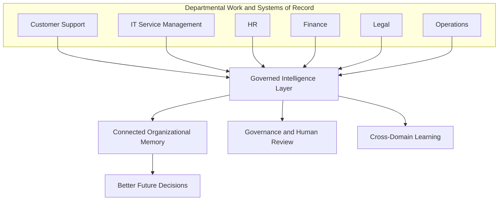
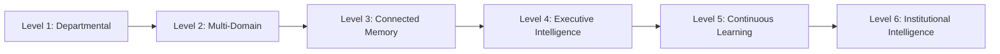
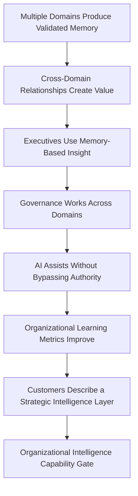

# Organizational Intelligence

## Derived From

- Canon Version: `v1.0.0`
- Architecture Version: `v1.0.0`
- Implementation Version: `v1.0.0`
- Product Version: `v1.0.0`
- Research Version: `v1.0.0`
- Strategy Version: `v1.0.0`
- Roadmap Philosophy Version: `v1.0.0`
- Platform Expansion Roadmap Version: `v1.0.0`
- Category Leadership Roadmap Version: `v1.0.0`

### Primary Repository Sources

- [Canon](../canon/README.md)
- [Architecture](../architecture/README.md)
- [Implementation](../implementation/README.md)
- [Product](../product/README.md)
- [Research](../research/README.md)
- [Strategy](../strategy/README.md)
- [Roadmap](./README.md)
- [Roadmap Philosophy](./00_ROADMAP_PHILOSOPHY.md)
- [Multi-Department](./09_MULTI_DEPARTMENT.md)
- [Enterprise Foundation](./10_ENTERPRISE_FOUNDATION.md)
- [AI Cognitive Evolution](./11_AI_COGNITIVE_EVOLUTION.md)
- [Platform Expansion](./12_PLATFORM_EXPANSION.md)
- [Category Leadership](./16_CATEGORY_LEADERSHIP.md)

### Primary Supporting Documents

- [Founder's Thesis](../canon/00_FOUNDERS_THESIS.md)
- [Product Vision](../canon/01_PRODUCT_VISION.md)
- [Product Domain Model](../canon/04_PRODUCT_DOMAIN_MODEL.md)
- [Product Workflow Model](../canon/05_PRODUCT_WORKFLOW_MODEL.md)
- [AI Cognitive Model](../canon/06_AI_COGNITIVE_MODEL.md)
- [Data Architecture](../architecture/09_DATA_ARCHITECTURE.md)
- [Knowledge Representation Model](../architecture/10_KNOWLEDGE_REPRESENTATION_MODEL.md)
- [Product Metrics](../product/10_PRODUCT_METRICS.md)
- [Product Governance](../product/11_PRODUCT_GOVERNANCE.md)
- [Business Model](../strategy/05_BUSINESS_MODEL.md)
- [Growth Strategy](../strategy/07_GROWTH_STRATEGY.md)
- [Long-Term Vision](../strategy/09_LONG_TERM_VISION.md)

---

Status: **Active**

## Primary Question

How does the platform become a true organization-wide intelligence layer that helps the entire institution learn from work, preserve trusted knowledge, and improve future decisions?

This document defines the Organizational Intelligence roadmap for the Organizational Intelligence Platform.

It is a capability maturity roadmap, not a feature roadmap. It defines how the platform matures from a validated multi-domain product into a governed organization-wide intelligence layer, while preserving Human Review, Governance, evidence, and the boundary that keeps AI an amplifier of organizational judgment rather than a replacement for it.

## 1. Executive Summary

This phase represents the platform becoming an organization-wide intelligence layer.

At this stage, the platform is no longer used only by one department or workflow. Having proven the Knowledge Flywheel in Customer Support, expanded across departments, strengthened its enterprise foundation, matured governed AI, and expanded regionally and globally, the platform now helps the organization preserve, govern, connect, and reuse what it learns across many areas of work.

An organization-wide intelligence layer is not a larger product surface. It is the governed institutional capability for the organization to know what it has learned, why it trusts that knowledge, and how to reuse it across departments and over time. It connects work, evidence, decisions, knowledge, review, Governance, and Organizational Memory across domains while preserving accountability.

This is an ambitious phase, and it should remain grounded. The platform does not make the organization autonomous, does not replace people or systems of record, and does not let AI decide institutional truth. It helps the organization become measurably more capable through accumulated, validated, governed learning, with humans accountable throughout.

## 2. Purpose of the Organizational Intelligence Phase

The purpose of this phase is to help the organization become measurably more capable through accumulated, validated learning across departments.

Earlier phases proved that work in a single domain could become governed memory that improves future work. This phase extends that capability across the institution, so that learning in one area strengthens the organization as a whole.

The platform should support:

- better decisions, grounded in validated evidence and prior learning;
- less repeated work across teams and functions;
- stronger continuity as knowledge survives turnover and reorganization;
- faster onboarding through accessible institutional context;
- reduced expert dependency as expertise becomes reusable memory;
- cross-functional learning where one domain's lessons inform others;
- governed AI adoption that remains reviewable and accountable;
- explainable institutional knowledge that leaders and auditors can trust.

The purpose is capability improvement, not automation of the organization. Success is measured by whether the institution becomes more capable, not by how much human judgment is removed.

## 3. Relationship to Previous Roadmap Phases

This phase depends on the capabilities proven in earlier roadmap phases. Each earlier phase enables a precondition of organization-wide intelligence.

| Previous Phase | What It Enables |
| --- | --- |
| Customer Support MVP | First complete Knowledge Flywheel |
| Product-Market Fit | Validated customer value |
| Multi-Department | Cross-domain applicability |
| Enterprise Foundation | Trust, governance, access, audit |
| AI Cognitive Evolution | Governed AI assistance |
| Platform Expansion | Multi-domain platform maturity |
| Category Leadership | Market recognition and credibility |

Organization-wide intelligence should not be attempted before these foundations exist. Connecting knowledge across departments without governance, enterprise trust, or governed AI would create risk rather than capability. This phase composes proven capabilities into an institutional layer; it does not introduce them for the first time.

## 4. Definition of Organization-Wide Intelligence Layer

An organization-wide intelligence layer connects work, evidence, decisions, knowledge, review, Governance, and Organizational Memory across departments while preserving accountability and trust.

The layer sits above and across the systems where work happens. It does not replace those systems of record, it does not replace people, and it does not replace governance. Departmental systems continue to run the work; people continue to exercise judgment and authority; governance continues to define boundaries.

What the layer adds is institutional memory and learning: it helps the organization know what it has learned, why it trusts that knowledge, and how to reuse it across departments. It is defined by connection and governance, not by centralization or control.

## 5. Core Principle

Organizational Intelligence is not a larger chatbot.

It is the governed institutional capability to learn from work and reuse validated knowledge across the organization.

A chatbot answers a conversation. An organization-wide intelligence layer preserves what the organization learns, validates it through Human Review, governs its use, connects it across domains, and makes it reusable so future work and decisions improve. The distinction is the same one the Canon draws between generating answers and building governed Organizational Memory, applied now at institutional scale. Every capability in this phase serves that principle; none of them makes AI the source of institutional truth.

## 6. Organization-Wide Memory

Organizational Memory evolves in this phase from domain-scoped stores into a connected, governed institutional memory. It remains validated memory, not a repository of raw content.

| Capability | Description |
| --- | --- |
| Domain-specific memory | Each domain preserves validated knowledge in its own context and vocabulary. |
| Shared organizational memory | Knowledge relevant across domains becomes accessible under governance. |
| Versioned memory | Current and historical states are preserved so change is traceable. |
| Permission-aware memory | Access respects roles, sensitivity, and domain boundaries. |
| Evidence-linked memory | Knowledge remains connected to its supporting evidence and Provenance. |
| Deprecated memory | Superseded knowledge is retired without destroying its history. |
| Historical decision memory | Past decisions and their rationale remain inspectable over time. |
| Cross-domain memory relationships | Related knowledge across domains is connected explicitly and governed. |

Success criteria:

- memory survives employee turnover, so capability does not leave when people do;
- memory remains explainable, with evidence, rationale, and Provenance intact;
- memory can be updated through governed Validation as reality changes;
- memory can be retired when it becomes stale, deprecated, or replaced;
- memory supports future decisions by remaining reusable and trustworthy.

Consistent with the [Data Architecture](../architecture/09_DATA_ARCHITECTURE.md) and [Knowledge Representation Model](../architecture/10_KNOWLEDGE_REPRESENTATION_MODEL.md), organization-wide memory contains only validated knowledge. Cross-domain connection widens what memory can relate; it does not lower the bar for what becomes trusted.

## 7. Cross-Domain Knowledge Relationships

Knowledge becomes more valuable when it is related across domains, because many organizational problems appear in one function but originate in another.

| Cross-Domain Signal | What It Can Reveal |
| --- | --- |
| A support issue | A product gap or documentation weakness. |
| An IT incident | An operational risk or systemic fragility. |
| An HR case | A policy ambiguity or manager guidance gap. |
| A finance exception | A process weakness or control gap. |
| A legal review | A recurring contractual risk pattern. |
| An operations problem | A vendor or supply pattern worth addressing. |

To relate knowledge responsibly, the platform provides:

| Capability | Purpose |
| --- | --- |
| Relationship mapping | Connect related knowledge across domains with explicit, typed relationships. |
| Knowledge dependency tracking | Show where knowledge in one domain depends on knowledge in another. |
| Contradiction detection | Surface conflicts between domains rather than hiding them. |
| Shared evidence trails | Preserve common evidence and Provenance across related knowledge. |
| Domain ownership | Keep each piece of knowledge accountable to an owning domain. |
| Permission-aware linking | Relate knowledge without violating access or sensitivity boundaries. |

Cross-domain relationships must preserve ownership, Provenance, and permissions. A relationship never grants access that a domain would otherwise deny, and similarity across domains never implies equivalence or automatic reuse. The value comes from making connections visible and governed, not from merging domains.

## 8. Executive Intelligence Layer

Leaders benefit from governed Organizational Memory when it surfaces patterns and risks across the institution that no single department can see alone.

| Capability | Description |
| --- | --- |
| Recurring problem visibility | Show problems that repeat across teams and domains. |
| Knowledge gap analysis | Reveal where the organization repeatedly lacks trusted knowledge. |
| Organizational Entropy signals | Indicate where repeated work and knowledge loss concentrate. |
| Expert bottleneck detection | Identify where the organization depends too heavily on individuals. |
| Repeated decision patterns | Show classes of decisions the organization makes repeatedly. |
| Risk and governance dashboards | Surface governance, review, and risk posture across domains. |
| Learning velocity metrics | Show how quickly work becomes validated, reusable knowledge. |
| Cross-functional insights | Connect signals that span multiple functions. |

Executive intelligence must be evidence-based, not AI speculation. Every insight presented to leaders should trace to validated memory, real outcomes, and inspectable evidence. The platform surfaces patterns and their supporting evidence; it does not generate strategic conclusions that leaders cannot verify. Executives remain the decision-makers, and the layer exists to inform their judgment, not to replace it.

## 9. Human Accountability at Organization Scale

As the platform spans the organization, human responsibility must scale with it. Accountability does not diminish at institutional scale; it becomes more structured.

| Role or Mechanism | Accountability It Preserves |
| --- | --- |
| Domain owners | Accountability for knowledge quality and lifecycle within a domain. |
| Reviewers | Accountability for validating knowledge before it is trusted. |
| Stewards | Accountability for maintaining and curating memory over time. |
| Approvers | Accountability for authorizing consequential changes and decisions. |
| Governance councils | Accountability for cross-domain policy and conflict resolution. |
| Escalation paths | Accountability for routing decisions to appropriate authority. |
| Decision rationale | A durable record of why decisions were made. |
| Audit trails | A traceable history of governed actions and knowledge changes. |

The platform should preserve who approved what, why, and based on which evidence, at every scale. This is the institutional expression of the Canon's Human Review and Provenance commitments: as memory becomes organization-wide, the record of human authority behind it must remain complete and inspectable.

## 10. AI-Assisted Organizational Reasoning

At this stage, AI assists organizational reasoning across validated memory, within strict boundaries consistent with the [AI Cognitive Model](../canon/06_AI_COGNITIVE_MODEL.md).

AI may assist with:

- synthesis across validated memory to summarize what the organization knows;
- identifying recurring organizational patterns across domains;
- surfacing contradictions between knowledge or decisions;
- suggesting knowledge gaps worth investigating;
- preparing executive summaries grounded in evidence;
- comparing similar decisions and their outcomes;
- assisting strategic analysis by organizing evidence for human judgment.

AI may not:

- decide institutional truth;
- override policy or Governance;
- access unauthorized memory or cross permission boundaries;
- bypass Human Review;
- silently change Organizational Memory.

AI reasons over validated, permitted memory and presents its outputs as advisory. It does not reason over raw or unvalidated content as though it were trusted, and its suggestions become consequential only when accepted through Human Review and Governance. AI amplifies organizational reasoning; it does not become the organization's judgment.

## 11. Organizational Learning Metrics

Organization-wide intelligence should be measured by whether the institution is becoming more capable, consistent with [Product Metrics](../product/10_PRODUCT_METRICS.md). Metrics should be interpreted by domain and in combination, not as a single score.

| Metric | Why It Matters |
| --- | --- |
| Knowledge Reuse Rate | Shows whether validated memory is used in future work. |
| Cross-Domain Reuse Rate | Shows whether knowledge created in one domain is reused in others. |
| Memory Growth Quality | Shows whether memory grows through validated knowledge, not raw volume. |
| Validation Rate | Shows whether captured knowledge becomes governed learning. |
| Review Coverage | Shows whether knowledge changes receive required Human Review. |
| Stale Knowledge Rate | Shows whether memory is kept current or is silently decaying. |
| Repeat Problem Reduction | Shows whether the organization stops re-solving the same problems. |
| Expert Dependency Reduction | Shows whether expertise is becoming institutional rather than trapped. |
| Onboarding Improvement | Shows whether new employees reach capability faster through memory. |
| Decision Traceability | Shows whether decisions can be traced to evidence and rationale. |
| Knowledge Gap Closure Rate | Shows whether identified gaps are being closed through validated learning. |
| Organizational Entropy Index | Shows whether fragmentation, repetition, and knowledge loss are decreasing. |
| Learning Velocity | Shows how quickly work becomes validated, reusable capability. |

These metrics should show whether the organization is learning, not merely whether the platform is busy. Improvement in activity without improvement in reuse, gap closure, and entropy reduction is not organizational intelligence.

## 12. Capability Maturity Levels

Organization-wide intelligence matures through levels. Each level requires evidence before the organization can be considered to have reached it.

### Level 1 — Departmental Intelligence

One department learns from work and reuses validated memory.

Criteria: a complete Knowledge Flywheel operates in one domain with Human Review and Governance.

Evidence: knowledge reuse and repeated-work reduction within the department.

### Level 2 — Multi-Domain Intelligence

Several departments independently produce validated memory.

Criteria: multiple domains run the flywheel with domain-appropriate vocabulary and governance.

Evidence: validated memory growth and reuse across several domains.

### Level 3 — Connected Organizational Memory

Knowledge relationships cross departments.

Criteria: governed cross-domain relationships, contradiction detection, and permission-aware linking exist.

Evidence: cross-domain reuse and relationships that create visible value.

### Level 4 — Executive Intelligence

Leaders use Organizational Memory to identify patterns and risks.

Criteria: evidence-based executive intelligence surfaces recurring problems, gaps, and risks across domains.

Evidence: leaders make or prioritize decisions using memory-based, evidence-backed insight.

### Level 5 — Continuous Organizational Learning

The organization systematically improves from validated learning.

Criteria: learning loops operate continuously across domains with governance intact.

Evidence: sustained improvement in learning velocity, gap closure, and entropy reduction.

### Level 6 — Institutional Intelligence

Organizational Memory becomes a core operating asset.

Criteria: the institution relies on governed memory for continuity, onboarding, and decisions across functions.

Evidence: durable capability improvement and reduced dependency on individual memory across the organization.

Maturity should be earned through evidence at each level. Reaching a later level while earlier levels remain weak indicates overreach, not progress.

## 13. Organizational Intelligence Operating Model

Organization-wide intelligence requires a clear operating model so that responsibility is explicit as scope expands.

| Role | Responsibility |
| --- | --- |
| Knowledge Steward | Maintains and curates knowledge quality and lifecycle within a scope. |
| Domain Owner | Owns validated knowledge, standards, and outcomes for a domain. |
| Reviewer | Validates knowledge and consequential outputs before they are trusted. |
| Memory Administrator | Administers memory structure, access, and lifecycle operations. |
| Governance Lead | Owns policy, boundaries, and governance decisions across scopes. |
| Executive Sponsor | Provides strategic support, priority, and cross-functional alignment. |
| AI Governance Owner | Ensures AI assistance stays advisory, bounded, and accountable. |
| Integration Owner | Owns responsible connection to systems of record and evidence. |

These roles may be combined in smaller organizations, but the responsibilities must remain explicit. The operating model exists to ensure that as memory becomes institutional, accountability for its quality, governance, and use is never ambiguous.

## 14. Governance at Organization Scale

Governance must operate across domains, not only within them, so that organization-wide memory remains trustworthy.

| Governance Area | Requirement |
| --- | --- |
| Domain governance | Each domain governs its own knowledge, review, and lifecycle. |
| Cross-domain governance | A governance mechanism resolves questions that span domains. |
| Conflict resolution | Contradictions between domains are surfaced and resolved by authority, not hidden. |
| Policy hierarchy | Organization-wide and domain policies relate clearly, with precedence defined. |
| Retention | Retention and archival of knowledge and history follow governed rules. |
| Data sensitivity | Sensitivity classifications constrain access, linking, and disclosure. |
| Approval thresholds | Consequential changes require approval appropriate to their risk. |
| Audit responsibilities | Audit trails and accountability are defined across domains. |
| Risk classification | Knowledge and decisions are classified by risk to guide review and access. |

Governance at organization scale extends [Product Governance](../product/11_PRODUCT_GOVERNANCE.md) rather than replacing it. Cross-domain connection increases the importance of governance: the more knowledge relates across the institution, the more explicit its boundaries, precedence, and accountability must be.

## 15. Organizational Intelligence Experiments

This phase should be validated through experiments that produce evidence before broad claims. Each experiment defines purpose, method, evidence, and success criteria.

| Experiment | Purpose | Method | Evidence | Success Criteria |
| --- | --- | --- | --- | --- |
| Cross-domain reuse pilot | Test whether knowledge from one domain is reused in another. | Connect two domains with governed relationships and observe reuse. | Cross-domain reuse events and outcomes. | Reuse occurs and improves work without violating boundaries. |
| Executive dashboard pilot | Test whether leaders act on evidence-based memory insight. | Provide an evidence-backed executive view and observe use. | Decisions or priorities informed by the view. | Leaders use insight that traces to validated evidence. |
| Knowledge gap closure test | Test whether identified gaps are closed through validated learning. | Detect gaps, assign owners, and track closure. | Gap closure and subsequent successful reuse. | Gaps close and closures hold in future work. |
| Expert dependency reduction study | Test whether expertise becomes reusable memory. | Capture and validate expert knowledge, then measure reliance. | Change in repeated expert interruptions. | Dependency on specific experts declines while quality holds. |
| Onboarding acceleration study | Test whether memory speeds onboarding. | Compare onboarding with and without accessible memory. | Time to competency and quality indicators. | New employees reach capability faster with preserved quality. |
| Stale knowledge detection test | Test whether the platform surfaces decaying knowledge. | Apply freshness and change signals across domains. | Stale items detected and reviewed. | Stale knowledge is identified and governed before harm. |
| Decision traceability test | Test whether decisions trace to evidence and rationale. | Review a sample of decisions for traceable Provenance. | Completeness of decision Provenance. | Decisions reliably trace to evidence, rationale, and authority. |

These experiments should produce reusable organizational learning. Weak or negative results should narrow scope or repair capability rather than be overridden by ambition.

## 16. Capability Gate

Organization-wide intelligence should be validated through evidence, not assumed because the platform spans multiple domains.

This phase is validated when:

- multiple departments produce and reuse validated memory;
- cross-domain knowledge relationships create visible value;
- executives use memory-based, evidence-backed insight;
- governance works across domains;
- AI assists without bypassing authority or Review;
- organizational learning metrics improve;
- customers describe the platform as a strategic intelligence layer, not a support tool.

The gate should be re-applied as scope grows. Success in some domains does not authorize treating the whole organization as an intelligence layer before the evidence exists across it.

## 17. Risks

Organization-wide intelligence carries risks that must be managed through governance, evidence, and disciplined scope.

| Risk | Why It Matters |
| --- | --- |
| Organization-wide complexity | Breadth can outstrip the company's and customer's ability to govern it well. |
| Permission failures | Cross-domain linking can expose knowledge across boundaries if permissions fail. |
| Weak governance | Insufficient cross-domain governance allows contradiction, drift, and risk. |
| AI overreach | AI may be pushed beyond advisory use into unaccountable decision-making. |
| Memory overload | Too much low-quality memory creates noise and erodes trust. |
| Stale knowledge | Unmaintained memory decays while appearing authoritative. |
| Cross-domain conflict | Domains may disagree, and unresolved conflict undermines trust. |
| Vanity executive dashboards | Executive views can reward activity metrics rather than real capability. |
| Excessive abstraction | The platform may become too abstract and lose concrete value. |
| Loss of user-level workflow value | Institutional ambition can neglect the daily workflow value that earned adoption. |

These risks share a theme: organization-wide scope amplifies both value and failure. The defense is governance, evidence, and preserving user-level value even as the institutional layer grows.

## 18. Deliverables

This phase should produce capability and governance artifacts, not only demonstrations. Expected deliverables include:

- an organization-wide memory model;
- a cross-domain relationship framework;
- an executive intelligence dashboard framework;
- a governance operating model;
- an organizational learning metrics dashboard;
- a maturity assessment;
- AI-assisted reasoning guardrails;
- a customer organizational intelligence case study.

These deliverables matter because organization-wide intelligence should be built on governed frameworks and evidence, not on institutional ambition disconnected from capability and proof.

## 19. Relationship to Enterprise Infrastructure

Once the platform becomes organization-wide, it begins approaching infrastructure status.

An intelligence layer that spans departments, preserves institutional memory, and informs decisions across the organization is no longer a departmental tool. It becomes part of how the organization operates. This is the threshold at which the platform starts to resemble core enterprise infrastructure.

The next phase is about becoming trusted enterprise infrastructure alongside ERP, CRM, HR, ITSM, and collaboration systems, a standard layer organizations rely on to preserve and compound what they learn. This phase makes that ambition credible by proving the organization-wide capability; it does not yet define the full infrastructure architecture, which belongs to later roadmap and architecture work.

## 20. Traceability Matrix

Organizational Intelligence should remain traceable to the broader repository.

| Source | Organizational Intelligence Derivation |
| --- | --- |
| [Founder's Thesis](../canon/00_FOUNDERS_THESIS.md) | Defines the founding problem of organizational forgetting that institutional memory addresses. |
| [Canon](../canon/README.md) | Defines the enduring concepts and trust boundaries this phase must preserve at scale. |
| [Product Vision](../canon/01_PRODUCT_VISION.md) | Defines the ambition of an organizational memory and learning layer. |
| [Product Domain Model](../canon/04_PRODUCT_DOMAIN_MODEL.md) | Defines the concepts that must remain coherent across domains. |
| [Product Workflow Model](../canon/05_PRODUCT_WORKFLOW_MODEL.md) | Defines how work becomes learning across domains. |
| [AI Cognitive Model](../canon/06_AI_COGNITIVE_MODEL.md) | Defines the boundaries that keep AI advisory in organizational reasoning. |
| [Knowledge Representation Model](../architecture/10_KNOWLEDGE_REPRESENTATION_MODEL.md) | Defines how knowledge is represented, related, and trusted across domains. |
| [Data Architecture](../architecture/09_DATA_ARCHITECTURE.md) | Defines the memory, provenance, and validation boundaries organization-wide memory relies on. |
| [Product Metrics](../product/10_PRODUCT_METRICS.md) | Defines the learning and capability metrics that evidence organization-wide intelligence. |
| [Product Governance](../product/11_PRODUCT_GOVERNANCE.md) | Defines the governance discipline extended to organization scale. |
| [Business Model](../strategy/05_BUSINESS_MODEL.md) | Defines how institutional value supports durable value capture. |
| [Growth Strategy](../strategy/07_GROWTH_STRATEGY.md) | Defines the staged growth that precedes organization-wide expansion. |
| [Long-Term Vision](../strategy/09_LONG_TERM_VISION.md) | Defines the enterprise-infrastructure ambition this phase advances toward. |
| [Category Leadership](./16_CATEGORY_LEADERSHIP.md) | Defines the market recognition that accompanies institutional maturity. |
| [Roadmap Philosophy](./00_ROADMAP_PHILOSOPHY.md) | Defines capability-gated, evidence-driven progression before institutional claims. |

## 21. What This Document Does NOT Define

This document intentionally does not define:

- a fully autonomous organization;
- AI replacing executives or institutional judgment;
- the final enterprise infrastructure architecture;
- specific implementation details;
- a global memory network across organizations;
- future-generation governance models;
- a legal compliance program.

Those belong to later roadmap phases, architecture and implementation documents, governance programs, and legal review.

This document defines only the capability maturity roadmap for becoming a governed organization-wide intelligence layer.

## 22. Closing

This phase succeeds when the platform helps the whole organization learn from work, preserve trusted knowledge, and make better future decisions through governed memory.

The organization does not become autonomous, and AI does not become its judgment. People remain accountable, governance remains in force, and systems of record continue to run the work. What changes is that the institution can now know what it has learned, trust why it knows it, and reuse that knowledge across departments and over time.

The platform becomes an organization-wide intelligence layer only if organizations become measurably more capable because their work becomes governed memory.

That is the standard this roadmap exists to enforce.
