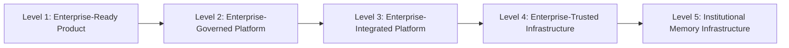
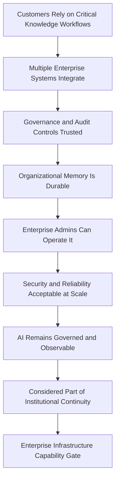

# Enterprise Infrastructure

## Derived From

- Canon Version: `v1.0.0`
- Architecture Version: `v1.0.0`
- Implementation Version: `v1.0.0`
- Product Version: `v1.0.0`
- Research Version: `v1.0.0`
- Strategy Version: `v1.0.0`
- Roadmap Philosophy Version: `v1.0.0`
- Enterprise Foundation Roadmap Version: `v1.0.0`
- Organizational Intelligence Roadmap Version: `v1.0.0`

### Primary Repository Sources

- [Canon](../canon/README.md)
- [Architecture](../architecture/README.md)
- [Implementation](../implementation/README.md)
- [Product](../product/README.md)
- [Research](../research/README.md)
- [Strategy](../strategy/README.md)
- [Roadmap](./README.md)
- [Roadmap Philosophy](./00_ROADMAP_PHILOSOPHY.md)
- [Enterprise Foundation](./10_ENTERPRISE_FOUNDATION.md)
- [Platform Expansion](./12_PLATFORM_EXPANSION.md)
- [Organizational Intelligence](./17_ORGANIZATIONAL_INTELLIGENCE.md)

### Primary Supporting Documents

- [Integration Architecture](../architecture/11_INTEGRATION_ARCHITECTURE.md)
- [Data Architecture](../architecture/09_DATA_ARCHITECTURE.md)
- [API Architecture](../implementation/15_API_ARCHITECTURE.md)
- [Storage Architecture](../implementation/16_STORAGE_ARCHITECTURE.md)
- [Deployment Architecture](../implementation/17_DEPLOYMENT_ARCHITECTURE.md)
- [Security Architecture](../implementation/18_SECURITY_ARCHITECTURE.md)
- [Product Governance](../product/11_PRODUCT_GOVERNANCE.md)
- [Regulatory Research](../research/07_REGULATORY_RESEARCH.md)
- [Technology Research](../research/06_TECHNOLOGY_RESEARCH.md)
- [Business Model](../strategy/05_BUSINESS_MODEL.md)
- [Competitive Strategy](../strategy/06_COMPETITIVE_STRATEGY.md)
- [Long-Term Vision](../strategy/09_LONG_TERM_VISION.md)

---

Status: **Active**

## Primary Question

How does the Organizational Intelligence Platform become trusted enterprise infrastructure that organizations rely on as a core layer of institutional learning?

This document defines the Enterprise Infrastructure roadmap for the Organizational Intelligence Platform.

It is a long-term infrastructure capability roadmap, not a deployment architecture document. It defines how the platform matures from an organization-wide product into durable enterprise infrastructure: trusted, governed, reliable, auditable, integrated, secure, administrable, durable, interoperable, and institutionally necessary. Throughout, the platform is described as the institutional learning layer that connects to and learns from existing enterprise systems, not as a replacement for them.

## 1. Executive Summary

The Organizational Intelligence Platform becomes enterprise infrastructure when organizations depend on it to preserve and govern what they learn from work.

Earlier phases proved value, expanded across departments, and matured the platform into an organization-wide intelligence layer. At this stage the platform crosses a further threshold: it stops being optional productivity software and becomes part of how the organization maintains continuity, trust, and institutional capability. When knowledge, governance, and learning across the enterprise depend on the platform being available, reliable, secure, and auditable, the platform has become infrastructure.

Infrastructure status is a responsibility, not a badge. It requires reliability, security, governance, integration, administration, compliance readiness, observability, and memory durability strong enough that large organizations can rely on the platform for critical knowledge workflows. It also requires restraint: the platform does not replace ERP, CRM, HR systems, or ITSM. It becomes the institutional learning layer that connects to those systems of record and preserves what the organization learns from the work they run.

This document defines how the platform earns that status through capability maturity and evidence, never through overclaiming.

## 2. What Enterprise Infrastructure Means

Enterprise infrastructure, in this context, means the platform is depended upon as a core layer of institutional learning that must remain available, governed, and trustworthy.

The platform as infrastructure means it is:

- always available enough for critical knowledge workflows;
- governed by enterprise policies rather than ad hoc configuration;
- integrated with core systems of record and work;
- trusted by multiple departments, not a single team;
- auditable by leadership and compliance teams;
- durable across organizational change, reorganization, and turnover;
- relied on for institutional continuity.

Infrastructure is defined by dependence and trust, not by feature count. A tool can be useful and still optional. Infrastructure is what an organization builds around and cannot easily remove without losing continuity. The platform reaches this status only when its reliability, governance, and durability are strong enough to justify that dependence.

## 3. What OIP Does Not Replace

The platform is the institutional learning layer, not a system of record. It connects to and learns from existing enterprise systems while leaving their primary roles intact.

| Existing System | Primary Role | OIP Relationship |
| --- | --- | --- |
| ERP | Resource and operational management | Learns from decisions and exceptions |
| CRM | Customer relationship management | Preserves knowledge from customer interactions |
| HR Systems | People and policy operations | Preserves policy learning and employee support knowledge |
| ITSM | Technology service workflows | Preserves incident and operational learning |
| Collaboration Platforms | Communication | Captures important decisions and context |
| Document Systems | Document storage | Converts evidence and documents into governed knowledge |

The platform does not replace ERP, CRM, HR systems, ITSM, collaboration, or document systems. Those systems continue to own their data and run their workflows. The platform integrates with them as a governed learning layer, turning the work and evidence they hold into validated Organizational Memory. Its value comes from learning across these systems, not from displacing any of them.

## 4. Infrastructure Principle

The platform becomes infrastructure not because it owns all data, but because it governs what the organization learns from its data, work, evidence, and decisions.

Systems of record own the transactions, records, and documents. The platform owns something different and complementary: the governed institutional memory of what the organization has learned, why it trusts that knowledge, and how it should be reused. That is why the platform can become infrastructure without owning the enterprise's data, and why it must never be positioned as a replacement for the systems that do. Infrastructure status is earned through trusted governance of learning, not through data ownership.

## 5. Relationship to Organization-Wide Intelligence

Enterprise infrastructure builds directly on the organization-wide intelligence layer. Each institutional capability proven in the previous phase becomes an infrastructure-grade requirement in this one.

| Organization-Wide Intelligence | Enterprise Infrastructure |
| --- | --- |
| Cross-domain memory | Enterprise-wide trust |
| Executive intelligence | Operational dependence |
| Multi-department learning | Core system integration |
| Governance maturity | Compliance and audit readiness |
| AI-assisted reasoning | Reliable AI governance infrastructure |

Organization-wide intelligence demonstrates that the platform can connect and govern learning across departments. Enterprise infrastructure demonstrates that organizations can depend on it operationally. The transition raises every capability, from useful to dependable, and adds the reliability, security, and administration required when institutions rely on the platform for continuity.

## 6. Core Infrastructure Capabilities

Enterprise infrastructure requires a set of mature, dependable capabilities. Each builds on the [Enterprise Foundation](./10_ENTERPRISE_FOUNDATION.md) and hardens it to infrastructure grade.

### 6.1 Reliability and Availability

Capabilities:

- production reliability;
- uptime targets appropriate to critical knowledge workflows;
- incident response;
- backups;
- recovery;
- monitoring;
- graceful degradation.

Memory systems require reliability because institutions come to depend on them for continuity. If the layer that preserves and serves organizational knowledge is unavailable, work that relies on that knowledge stalls, and trust erodes quickly. Reliability is a precondition for dependence, and dependence is what defines infrastructure.

### 6.2 Enterprise Security

Capabilities:

- identity integration;
- RBAC and ABAC readiness;
- encryption;
- secure integrations;
- secrets management;
- vulnerability management;
- secure AI tool use;
- incident response.

Security is foundational because the platform holds an organization's validated knowledge, evidence, and decision history. Consistent with the [Security Architecture](../implementation/18_SECURITY_ARCHITECTURE.md), security must protect tenant boundaries, access, and AI tool use so that governed memory cannot be exposed, altered, or misused.

### 6.3 Enterprise Governance

Capabilities:

- policy-driven review;
- approval workflows;
- domain governance;
- audit trails;
- retention;
- lifecycle control;
- escalation;
- governance reporting.

Governance at infrastructure grade extends [Product Governance](../product/11_PRODUCT_GOVERNANCE.md) into policy-driven, auditable operation. It ensures that knowledge changes, approvals, and access follow enterprise policy and remain inspectable by leadership and compliance.

### 6.4 Enterprise Integration Fabric

The platform must integrate with systems of record and systems of work, consistent with the [Integration Architecture](../architecture/11_INTEGRATION_ARCHITECTURE.md).

Capabilities:

- API-first architecture;
- event-based integration;
- connector framework;
- identity integration;
- data flow monitoring;
- permission-aware retrieval;
- integration health.

The integration fabric is what makes the platform a learning layer across the enterprise rather than a silo. Integrations bring in evidence and context as governed Knowledge Candidates; they never write directly into Organizational Memory, and they preserve Provenance and permissions throughout.

### 6.5 Enterprise Administration

Capabilities:

- organization management;
- workspace and domain management;
- user lifecycle;
- role management;
- audit views;
- governance configuration;
- integration configuration;
- data lifecycle settings;
- usage and trust dashboards.

Administration must let enterprise administrators operate the platform at scale without engineering involvement. Infrastructure is only dependable when the organization can manage identity, roles, governance, integrations, and data lifecycle through supported administration rather than bespoke intervention.

### 6.6 Compliance Readiness

This section defines readiness, not certification. Certification timelines and legal programs belong elsewhere.

Capabilities:

- control mapping;
- audit evidence;
- data handling records;
- AI governance records;
- privacy workflows;
- retention policies;
- customer security documentation.

Compliance readiness means the platform can support enterprise and regulated customers as they meet their own obligations, consistent with [Regulatory Research](../research/07_REGULATORY_RESEARCH.md). Readiness prepares the platform to pass reviews and provide evidence; it does not by itself constitute certification.

### 6.7 Operational Observability

Capabilities:

- logs;
- metrics;
- traces;
- AI observability;
- integration monitoring;
- workflow monitoring;
- security event monitoring;
- knowledge lifecycle monitoring.

Observability answers whether the platform is healthy and whether the organization's knowledge system is functioning. It must cover not only system health but AI behavior, integration flow, governance workflows, and knowledge lifecycle, so operators and customers can trust what the infrastructure is doing.

### 6.8 Long-Term Memory Durability

Capabilities:

- versioning;
- backup;
- archival;
- retention;
- correction;
- deletion where required;
- Provenance preservation;
- migration support.

Memory durability is the defining infrastructure capability, consistent with the [Data Architecture](../architecture/09_DATA_ARCHITECTURE.md). Institutional memory must survive time, change, and migration while preserving Provenance and history, supporting correction and required deletion without destroying the record of what the organization learned and why it trusted it.

## 7. Enterprise Infrastructure Maturity Levels

Infrastructure status matures through levels. Each level requires evidence before the platform can be considered to have reached it.

### Level 1 — Enterprise-Ready Product

The platform meets baseline enterprise expectations.

Criteria: basic security, administration, and audit capabilities exist.

Evidence: the platform passes basic enterprise security and administration review.

### Level 2 — Enterprise-Governed Platform

Governance and policy controls mature.

Criteria: policy-driven review, approval workflows, retention, and governance reporting operate.

Evidence: governance controls are used and trusted by customer governance teams.

### Level 3 — Enterprise-Integrated Platform

The platform integrates deeply with core systems.

Criteria: API-first integration, event-based connectors, and permission-aware retrieval connect to systems of record.

Evidence: integrations operate reliably and preserve Provenance and permissions in production.

### Level 4 — Enterprise-Trusted Infrastructure

Organizations rely on the platform for critical learning workflows.

Criteria: reliability, security, and governance are strong enough for enterprise dependence.

Evidence: customers depend on the platform for workflows they consider critical, with acceptable reliability and trust.

### Level 5 — Institutional Memory Infrastructure

The platform becomes a durable layer of institutional continuity.

Criteria: memory durability, governance, and integration make the platform part of how the organization operates over time.

Evidence: the platform persists across organizational change and is treated as institutional continuity infrastructure.

Maturity should be earned through evidence. Reaching a later level while earlier levels remain weak is overreach and should be corrected before advancing.

## 8. Enterprise Trust Metrics

Infrastructure status should be measured by trust, reliability, and dependence rather than usage alone.

| Metric | Why It Matters |
| --- | --- |
| Uptime | Shows whether the platform is reliable enough for critical workflows. |
| Incident Rate | Shows operational stability and the quality of incident management. |
| Access Control Coverage | Shows whether access is governed across the enterprise. |
| Audit Coverage | Shows whether governed actions are auditable by leadership and compliance. |
| Governance Workflow Completion | Shows whether governance operates reliably in practice. |
| Integration Health | Shows whether connections to systems of record remain dependable. |
| Data Recovery Test Success | Shows whether memory can be recovered when needed. |
| AI Governance Event Logging | Shows whether AI activity remains observable and accountable. |
| Security Review Pass Rate | Shows whether the platform meets enterprise security expectations. |
| Enterprise Renewal Rate | Shows whether customers continue to depend on the platform. |
| Expansion Across Business Units | Shows whether dependence spreads across the organization. |
| Executive Trust Score | Shows whether leadership trusts the platform as infrastructure. |

These metrics should be read together and over time. Reliability without governance, or usage without renewal, indicates a product in use rather than trusted infrastructure.

## 9. Infrastructure Governance Model

Infrastructure requires a clear governance model so that responsibility for reliability, security, governance, and integration is explicit at enterprise scale.

| Role | Responsibility |
| --- | --- |
| Enterprise Admin | Operates organization, workspace, user, and role administration at scale. |
| Security Owner | Owns security posture, access, and incident response. |
| Compliance Owner | Owns control mapping, audit evidence, and compliance readiness. |
| Domain Governance Lead | Owns governance, review, and policy within a domain. |
| Knowledge Steward | Maintains knowledge quality, lifecycle, and durability. |
| AI Governance Owner | Ensures AI assistance remains governed, bounded, and observable. |
| Integration Owner | Owns reliable, permission-aware integration with systems of record. |
| Executive Sponsor | Provides strategic support and accountability for institutional reliance. |

These roles may be combined in smaller organizations, but the responsibilities must remain explicit. As the platform becomes infrastructure, accountability for its reliability, security, governance, and integration cannot be ambiguous.

## 10. Infrastructure Readiness Experiments

Infrastructure readiness should be validated through experiments that produce evidence before dependence is assumed. Each experiment defines purpose, method, evidence, and success criteria.

| Experiment | Purpose | Method | Evidence | Success Criteria |
| --- | --- | --- | --- | --- |
| Disaster recovery test | Verify memory and workflows recover after failure. | Simulate failure and execute recovery procedures. | Recovery time and data integrity results. | Recovery meets targets with memory and Provenance intact. |
| Audit trail reconstruction test | Verify governed actions can be reconstructed. | Reconstruct a decision and knowledge change from audit records. | Completeness of reconstructed history. | The full chain of who, why, and evidence is recoverable. |
| Enterprise access review | Verify access is correct and governed. | Review roles, permissions, and access across the enterprise. | Access accuracy and exception findings. | Access is appropriate with no unauthorized exposure. |
| Integration failure simulation | Verify graceful handling of integration failure. | Simulate a systems-of-record integration outage. | Behavior under failure and recovery. | Failure is isolated; memory integrity and Provenance hold. |
| AI governance audit | Verify AI activity is governed and observable. | Audit AI-assisted actions against governance boundaries. | AI governance and observability records. | AI stays advisory, bounded, and fully logged. |
| Retention policy test | Verify retention and deletion operate correctly. | Apply retention and required deletion across memory. | Retention and deletion outcomes. | Policies execute correctly while preserving required history. |
| Multi-business-unit rollout test | Verify the platform operates across business units. | Roll out to multiple units with governance and administration. | Rollout, administration, and trust results. | Units operate independently under consistent governance. |
| Executive reporting validation | Verify executive insight is evidence-based. | Validate executive reports against underlying evidence. | Traceability of reported insight. | Reports trace to validated memory and real evidence. |

These experiments should produce reusable operational learning. Weak or failing results should delay infrastructure claims and drive remediation rather than be overridden by ambition.

## 11. Strategic Importance

Infrastructure status matters strategically because it changes the platform's relationship with the customer and the market.

| Strategic Effect | How Infrastructure Status Creates It |
| --- | --- |
| Retention | Customers depend on the platform for continuity and rarely remove it. |
| Expansion | Dependence spreads across departments and business units. |
| Enterprise Credibility | Meeting infrastructure standards signals seriousness to large buyers. |
| Long-Term Defensibility | Trusted, integrated, durable memory is hard for competitors to displace. |
| Category Leadership | Infrastructure status reinforces the platform as the category's reference point. |
| Customer Dependence Through Value | Dependence is earned through governed value, not artificial lock-in. |
| Trust-Based Growth | Growth compounds through reliability, governance, and demonstrated trust. |

Dependence should be earned through value and trust, not lock-in. Consistent with the [Competitive Strategy](../strategy/06_COMPETITIVE_STRATEGY.md), durable defensibility comes from being genuinely relied upon because the platform preserves and governs institutional learning well, not from making the platform difficult to leave.

## 12. Capability Gate

Enterprise infrastructure maturity should be validated through evidence, not assumed because the platform is widely used.

The platform reaches enterprise infrastructure maturity when:

- customers rely on it for critical knowledge workflows;
- multiple enterprise systems integrate with it;
- governance and audit controls are trusted;
- Organizational Memory is durable;
- enterprise administrators can operate it;
- security and reliability are acceptable for large customers;
- AI remains governed and observable;
- customers consider it part of institutional continuity.

The gate should be re-applied as customers and scale grow. Meeting the bar for some customers does not authorize claiming infrastructure status universally before the evidence exists.

## 13. Risks

Infrastructure status carries risks that must be managed through evidence, governance, and disciplined claims.

| Risk | Why It Matters |
| --- | --- |
| Overclaiming infrastructure maturity | Claiming infrastructure status before reliability and trust exist damages credibility. |
| Reliability failures | Outages in a depended-upon layer stall work and erode trust rapidly. |
| Security incidents | A breach of institutional memory is severe and can be existential. |
| Weak governance | Insufficient governance at scale allows drift, exposure, and loss of trust. |
| Integration fragility | Fragile integrations undermine the learning-layer value proposition. |
| Compliance gaps | Unmet compliance expectations block enterprise and regulated adoption. |
| AI trust failures | Ungoverned or opaque AI behavior undermines the platform's trust model. |
| Customer lock-in concerns | Perceived lock-in damages trust; dependence must be earned through value. |
| Excessive administrative complexity | If the platform is too complex to administer, it cannot be depended upon. |
| Loss of product usability | Infrastructure hardening must not degrade the daily usability that earned adoption. |

These risks share a theme: infrastructure amplifies both trust and failure. The defense is evidence before claims, strong governance and security, and preserving usability even as the platform hardens.

## 14. Deliverables

This phase should produce infrastructure capability and assurance artifacts, not demonstrations. Expected deliverables include:

- an enterprise infrastructure maturity model;
- a reliability framework;
- an enterprise admin framework;
- a governance control map;
- an audit evidence framework;
- an integration fabric roadmap;
- an AI governance infrastructure checklist;
- a compliance readiness package;
- an enterprise trust dashboard.

These deliverables matter because infrastructure status must be built on frameworks, controls, and evidence that customers can inspect and trust, not on claims of maturity.

## 15. Relationship to Global Memory Network

Enterprise infrastructure maturity is a prerequisite for any long-term global memory network vision, and that vision must not be pursued before it.

A global memory network, any concept of learning that spans beyond a single organization, raises profound questions of trust, privacy, tenancy, governance, and customer ownership of knowledge. None of those questions can be answered responsibly until the platform has proven durable, governed, secure enterprise infrastructure within single organizations first.

Trust, privacy, tenancy, governance, and customer ownership must come first. This roadmap does not define a global memory network or any cross-organization data-sharing model; it establishes the enterprise infrastructure foundation that would be required before such a vision could even be responsibly considered.

## 16. Traceability Matrix

Enterprise Infrastructure should remain traceable to the broader repository.

| Source | Enterprise Infrastructure Derivation |
| --- | --- |
| [Canon](../canon/README.md) | Defines the enduring trust, governance, and memory principles infrastructure must preserve. |
| [Architecture](../architecture/README.md) | Defines the logical structure that infrastructure hardening realizes. |
| [Security Architecture](../implementation/18_SECURITY_ARCHITECTURE.md) | Defines the security model that enterprise infrastructure must meet. |
| [Deployment Architecture](../implementation/17_DEPLOYMENT_ARCHITECTURE.md) | Defines deployment and reliability foundations for infrastructure operation. |
| [API Architecture](../implementation/15_API_ARCHITECTURE.md) | Defines the API-first boundaries the integration fabric depends on. |
| [Storage Architecture](../implementation/16_STORAGE_ARCHITECTURE.md) | Defines the storage foundations for memory durability. |
| [Integration Architecture](../architecture/11_INTEGRATION_ARCHITECTURE.md) | Defines how the platform integrates with systems of record as a learning layer. |
| [Regulatory Research](../research/07_REGULATORY_RESEARCH.md) | Defines the compliance context that infrastructure readiness must support. |
| [Technology Research](../research/06_TECHNOLOGY_RESEARCH.md) | Defines the technology considerations for reliable, scalable infrastructure. |
| [Product Governance](../product/11_PRODUCT_GOVERNANCE.md) | Defines the governance discipline extended to infrastructure grade. |
| [Enterprise Foundation](./10_ENTERPRISE_FOUNDATION.md) | Defines the enterprise foundations this phase hardens into infrastructure. |
| [Organizational Intelligence](./17_ORGANIZATIONAL_INTELLIGENCE.md) | Defines the organization-wide layer that infrastructure makes dependable. |
| [Business Model](../strategy/05_BUSINESS_MODEL.md) | Defines how infrastructure dependence supports durable value capture. |
| [Competitive Strategy](../strategy/06_COMPETITIVE_STRATEGY.md) | Defines the defensibility that trusted infrastructure creates. |
| [Long-Term Vision](../strategy/09_LONG_TERM_VISION.md) | Defines the enterprise-infrastructure ambition this phase realizes. |
| [Roadmap Philosophy](./00_ROADMAP_PHILOSOPHY.md) | Defines capability-gated, evidence-driven progression before infrastructure claims. |

## 17. What This Document Does NOT Define

This document intentionally does not define:

- exact cloud deployment design;
- a certification timeline;
- legal advice;
- a full site reliability engineering manual;
- a global data-sharing model;
- marketplace implementation;
- financial projections.

Those belong to architecture and implementation documents, security and compliance programs, operations manuals, legal review, and finance documentation.

This document defines only the long-term infrastructure capability roadmap for becoming trusted enterprise infrastructure responsibly.

## 18. Closing

The Organizational Intelligence Platform becomes enterprise infrastructure when customers trust it as the durable layer that preserves what the organization learns from work.

It does not become infrastructure by replacing ERP, CRM, HR systems, or ITSM, and it does not claim maturity it has not earned. It becomes infrastructure by being reliable, secure, governed, integrated, administrable, and durable enough that organizations depend on it for institutional continuity, while it continues to connect to and learn from the systems of record that run the work.

The platform becomes enterprise infrastructure only if organizations can rely on it, over time and through change, to preserve and govern what they learn.

That is the standard this roadmap exists to enforce.
