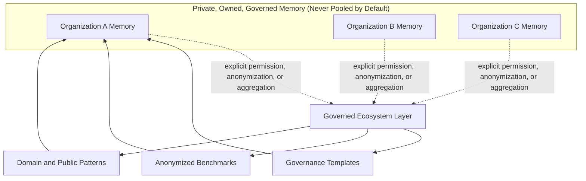
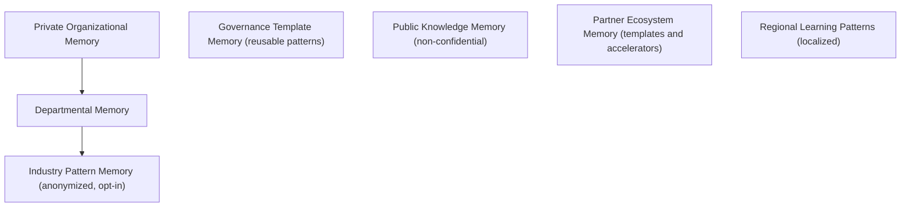
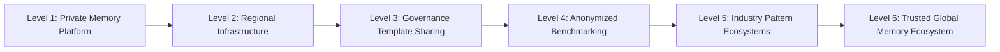
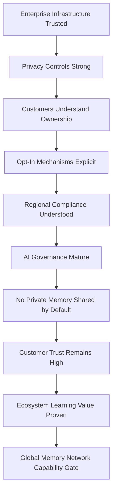

# Global Memory Network

## Derived From

- Canon Version: `v1.0.0`
- Architecture Version: `v1.0.0`
- Implementation Version: `v1.0.0`
- Product Version: `v1.0.0`
- Research Version: `v1.0.0`
- Strategy Version: `v1.0.0`
- Roadmap Philosophy Version: `v1.0.0`
- Organizational Intelligence Roadmap Version: `v1.0.0`
- Enterprise Infrastructure Roadmap Version: `v1.0.0`

### Primary Repository Sources

- [Canon](../canon/README.md)
- [Architecture](../architecture/README.md)
- [Implementation](../implementation/README.md)
- [Product](../product/README.md)
- [Research](../research/README.md)
- [Strategy](../strategy/README.md)
- [Roadmap](./README.md)
- [Roadmap Philosophy](./00_ROADMAP_PHILOSOPHY.md)
- [Organizational Intelligence](./17_ORGANIZATIONAL_INTELLIGENCE.md)
- [Enterprise Infrastructure](./18_ENTERPRISE_INFRASTRUCTURE.md)

### Primary Supporting Documents

- [Founder's Thesis](../canon/00_FOUNDERS_THESIS.md)
- [Product Principles](../canon/02_PRODUCT_PRINCIPLES.md)
- [Data Architecture](../architecture/09_DATA_ARCHITECTURE.md)
- [Security Architecture](../implementation/18_SECURITY_ARCHITECTURE.md)
- [Product Governance](../product/11_PRODUCT_GOVERNANCE.md)
- [AI Research](../research/05_AI_RESEARCH.md)
- [Technology Research](../research/06_TECHNOLOGY_RESEARCH.md)
- [Regulatory Research](../research/07_REGULATORY_RESEARCH.md)
- [Competitive Strategy](../strategy/06_COMPETITIVE_STRATEGY.md)
- [Partnership Strategy](../strategy/08_PARTNERSHIP_STRATEGY.md)
- [Long-Term Vision](../strategy/09_LONG_TERM_VISION.md)

---

Status: **Active**

## Primary Question

How could the Organizational Intelligence Platform evolve into a governed global memory ecosystem while preserving privacy, customer ownership, trust, and organization-specific memory?

This document defines the Global Memory Network roadmap for the Organizational Intelligence Platform.

It is a long-term vision document. It must be ambitious but careful. A Global Memory Network does not mean uncontrolled sharing of customer data. It means a governed ecosystem where organizations preserve private, organization-specific Organizational Memory while, only through explicit permission, anonymization, aggregation, or public and non-sensitive patterns, optionally benefiting from safe generalized learning. Customer ownership, privacy, sovereignty, and governance remain central throughout.

## 1. Executive Summary

The Global Memory Network is a long-term vision for how many organizations may preserve and improve institutional memory through a governed platform ecosystem.

By this stage, the platform is trusted enterprise infrastructure within individual organizations. The Global Memory Network asks a further, more delicate question: whether organizations that each maintain their own private, governed Organizational Memory might also, on their own terms, benefit from safe, generalized learning that no single organization could produce alone, such as better governance templates, benchmarks, and domain patterns.

This must be stated plainly. The Global Memory Network is not a data-sharing free-for-all. It is not a global database of customer secrets. It is not a mechanism for pooling private memory. It is a trusted, permissioned, privacy-preserving ecosystem of organizational learning in which each customer's memory remains private and owned by that customer.

Any ecosystem learning happens only through explicit permission, anonymization, aggregation, contractual rights, governance controls, or genuinely public and non-sensitive patterns. Where those conditions cannot be met, the answer is that memory stays private. This vision succeeds only if it strengthens trust, never if it trades trust for data.

## 2. Definition of Global Memory Network

A Global Memory Network is a long-term platform ecosystem in which organizations maintain private, governed Organizational Memory while the platform may help improve learning patterns, governance templates, domain models, benchmarks, and safe generalized intelligence across customers and regions, only under strict privacy, ownership, and governance controls.

The defining property of the network is that private memory stays private. The ecosystem layer is composed only of what customers explicitly permit, what has been anonymized or aggregated beyond re-identification, or what is genuinely public. The dashed boundaries in the model are consent boundaries: nothing crosses them without a customer's explicit, revocable decision. The network is defined by governance and permission, not by centralization of knowledge.

## 3. Core Principle

Private organizational memory belongs to the organization.

The platform may support learning across the ecosystem only through explicit permission, anonymization, aggregation, contractual rights, governance controls, or public and non-sensitive patterns.

This principle is absolute and overrides any ecosystem ambition. If a form of ecosystem learning cannot be achieved without exposing private memory, that learning is not pursued. Customer ownership is not a setting that can be defaulted away; it is the foundation on which the entire network rests. The platform is a custodian of customers' private memory, never its owner or aggregator.

## 4. Relationship to Enterprise Infrastructure

The Global Memory Network is only possible after enterprise infrastructure maturity. The trust, security, and governance the platform must earn as [Enterprise Infrastructure](./18_ENTERPRISE_INFRASTRUCTURE.md) are preconditions for any cross-organization learning.

| Enterprise Infrastructure Provides | Global Memory Network Requires |
| --- | --- |
| Trust | Cross-organization confidence |
| Security | Privacy-preserving ecosystem |
| Governance | Permissioned learning |
| Auditability | Transparency across use |
| Integration | Ecosystem connectivity |
| AI governance | Responsible pattern learning |

The network cannot be attempted before these foundations exist within single organizations. Cross-organization confidence requires that each organization already trusts the platform with its own memory; a privacy-preserving ecosystem requires proven security; permissioned learning requires mature governance. Attempting ecosystem learning before infrastructure trust exists would be reckless and would violate the mission.

## 5. Memory Layers

The network may involve several memory layers with sharply different ownership and privacy properties. Distinguishing them is what allows the platform to offer ecosystem value without ever compromising private memory.

### 5.1 Private Organizational Memory

Customer-specific, confidential, governed memory.

| Attribute | Value |
| --- | --- |
| Ownership | The customer organization, exclusively. |
| Privacy level | Confidential; never shared by default. |
| Governance requirement | Full tenant isolation, access control, and audit. |
| Possible use | Only within the owning organization. |
| Risk | Any leakage is a severe breach; this layer must never enter the ecosystem without explicit consent. |

### 5.2 Departmental Memory

Memory by domain or function inside an organization.

| Attribute | Value |
| --- | --- |
| Ownership | The customer organization; scoped to a department. |
| Privacy level | Confidential; internal to the organization. |
| Governance requirement | Domain governance, permissions, and audit. |
| Possible use | Cross-department learning within the organization. |
| Risk | Cross-department exposure inside the org if permissions fail. |

### 5.3 Industry Pattern Memory

Anonymized or generalized patterns across similar organizations.

| Attribute | Value |
| --- | --- |
| Ownership | Derived patterns; no single customer owns them, and no customer content is included. |
| Privacy level | Anonymized and aggregated beyond re-identification; opt-in only. |
| Governance requirement | Consent, anonymization validation, and aggregation thresholds. |
| Possible use | Generalized industry learning for opted-in customers. |
| Risk | Re-identification if anonymization or aggregation is weak; requires rigorous controls. |

### 5.4 Governance Template Memory

Reusable review, approval, retention, and policy patterns.

| Attribute | Value |
| --- | --- |
| Ownership | The platform or contributing partners, as patterns, not customer content. |
| Privacy level | Non-confidential structural patterns; no customer data. |
| Governance requirement | Review to ensure templates contain no private content. |
| Possible use | Reusable governance patterns customers can adopt. |
| Risk | Accidental inclusion of customer-specific content in a template. |

### 5.5 Public Knowledge Memory

Public, non-confidential, domain knowledge.

| Attribute | Value |
| --- | --- |
| Ownership | Public or platform-curated; no customer confidentiality. |
| Privacy level | Public and non-sensitive. |
| Governance requirement | Source and quality validation. |
| Possible use | Shared baseline knowledge available to customers. |
| Risk | Quality or accuracy issues rather than privacy issues. |

### 5.6 Partner Ecosystem Memory

Templates, accelerators, and implementation patterns created by partners.

| Attribute | Value |
| --- | --- |
| Ownership | Partners, under governance, consistent with [Partnership Strategy](../strategy/08_PARTNERSHIP_STRATEGY.md). |
| Privacy level | Non-confidential patterns; no customer content. |
| Governance requirement | Partner review, security, and quality standards. |
| Possible use | Accelerators and templates customers can adopt. |
| Risk | Partner misuse or inclusion of customer content without rights. |

### 5.7 Regional Learning Patterns

Localized patterns shaped by regulation, language, culture, and market context.

| Attribute | Value |
| --- | --- |
| Ownership | Derived localized patterns; no single customer owns them. |
| Privacy level | Anonymized, aggregated, or public; region-scoped. |
| Governance requirement | Regional compliance, residency, and consent controls. |
| Possible use | Localized governance, language, and workflow patterns. |
| Risk | Cross-border and regulatory conflict if residency is mishandled. |

## 6. Privacy and Ownership Model

Privacy and ownership are the foundation of the network, not features layered on top. These principles govern every layer and every form of ecosystem learning.

| Principle | Meaning |
| --- | --- |
| Customer owns customer memory | Each organization owns its private Organizational Memory absolutely. |
| Private memory is not pooled by default | No private memory enters any shared layer without an explicit decision. |
| Explicit consent required for sharing | Any contribution to ecosystem learning requires clear, informed, revocable consent. |
| Data minimization | Only the minimum necessary is ever used, and never more than permitted. |
| Anonymization where applicable | Contributions are anonymized so individuals and organizations cannot be re-identified. |
| Aggregation where applicable | Patterns are aggregated above thresholds that prevent singling out a customer. |
| Contractual clarity | Rights, uses, and limits are explicit and understandable in contract. |
| Auditability | Customers and regulators can inspect what was shared, why, and under what permission. |
| Revocation paths | Customers can withdraw consent and stop future use. |
| Regional data controls | Residency and regional obligations are respected. |

Consistent with the [Data Architecture](../architecture/09_DATA_ARCHITECTURE.md) and [Product Principles](../canon/02_PRODUCT_PRINCIPLES.md), these principles are non-negotiable. Where a proposed use cannot satisfy them, the use is not built.

## 7. Permissioned Learning Models

Ecosystem learning may take several forms, ranging from no sharing to explicit opt-in consortiums. Each carries different risk and requires different controls. The default is always no sharing.

| Model | Description | Risk | Controls |
| --- | --- | --- | --- |
| No sharing | Private memory stays fully private. | None; this is the default and safe baseline. | Tenant isolation and access control. |
| Customer-approved sharing | A customer explicitly permits a specific, scoped use. | Misunderstanding of scope. | Explicit informed consent, scope limits, revocation. |
| Anonymized benchmarks | Customers compare maturity against anonymized aggregates. | Re-identification if weak. | Anonymization validation, aggregation thresholds, opt-in. |
| Aggregated usage patterns | Generalized, non-content usage patterns inform improvement. | Inadvertent specificity. | Aggregation, content exclusion, review. |
| Domain templates | Reusable domain structures without customer content. | Content leakage into templates. | Content review, no customer data. |
| Governance templates | Reusable governance patterns without customer content. | Content leakage into templates. | Review to exclude private content. |
| Public knowledge contribution | Non-confidential knowledge shared openly. | Quality rather than privacy. | Source and quality validation. |
| Partner-created accelerators | Partners contribute templates and accelerators. | Partner misuse of customer rights. | Partner governance, security, and rights review. |
| Opt-in industry consortiums | Groups of customers explicitly choose to share defined patterns. | Governance complexity. | Explicit consortium governance, consent, transparency. |

Every model above the baseline requires explicit customer choice. No model permits pooling private memory, and none operates by default.

## 8. Global Governance Model

Ecosystem learning requires governance stronger than any single organization needs, because it spans organizations, regions, and regulatory regimes. This governance extends [Product Governance](../product/11_PRODUCT_GOVERNANCE.md) to ecosystem scale.

| Governance Area | Requirement |
| --- | --- |
| Customer consent | Explicit, informed, and revocable consent for any contribution. |
| Data classification | Clear classification of what is private, anonymizable, or public. |
| Cross-border controls | Controls that respect residency and cross-border transfer rules. |
| AI training restrictions | Restrictions preventing training on private memory without permission. |
| Retention rules | Defined retention and deletion across ecosystem-derived patterns. |
| Audit records | Complete records of what was shared, by whom, and under what permission. |
| Ethical review | Review of ecosystem learning against ethics and mission. |
| Security review | Security assessment of any ecosystem-facing mechanism. |
| Regional compliance | Alignment with regional data protection and AI regulation. |
| Transparency | Customers can see and understand ecosystem participation. |

Governance is what makes the network trustworthy. Without it, ecosystem learning would be extraction; with it, ecosystem learning is a governed, consented, auditable benefit that customers can inspect and withdraw from.

## 9. Regional and Sovereign Memory

The network must respect that memory is regional and sovereign, not global by default. Regional and sovereignty requirements constrain how, where, and whether memory patterns can move.

| Requirement | Consideration |
| --- | --- |
| Data residency | Memory and derived patterns respect where data must reside. |
| Local regulations | Regional data protection and AI rules govern participation. |
| Language | Localized patterns must respect language and context. |
| Sector rules | Regulated sectors add constraints on any sharing. |
| Public-sector constraints | Governments may prohibit any cross-organization pattern use. |
| Customer sovereignty | Customers retain sovereignty over their own memory and choices. |
| Cloud region choices | Deployment regions honor residency and sovereignty needs. |
| Local partners | Local partners support compliant, trusted regional operation. |

This document is not legal advice.

Regional and sovereign requirements may mean that in some markets, sectors, or public institutions, no ecosystem participation is possible, and private memory remains fully isolated. That outcome is acceptable and expected; the network is designed to make ecosystem learning optional and regionally constrained, never universal or mandatory.

## 10. Industry-Specific Memory Networks

Over the long term, opt-in industry patterns might emerge in domains where similar organizations face similar problems. Each would require its own domain governance and privacy controls.

| Industry Domain | Potential Pattern Value | Governance Requirement |
| --- | --- | --- |
| Customer support | Common support entropy and resolution patterns. | Anonymization and opt-in consent. |
| IT operations | Recurring incident and runbook patterns. | Security-sensitive; strict anonymization. |
| Healthcare administration | Operational and administrative patterns. | Strong privacy, sector regulation, and consent. |
| Education operations | Administrative and advising patterns. | Student privacy and sector rules. |
| Government services | Public service delivery patterns. | Public-sector constraints and sovereignty. |
| Finance operations | Control and process patterns. | Heavy regulation and confidentiality. |
| Compliance | Governance and control patterns. | Confidentiality and regulatory alignment. |
| Legal operations | Process and review patterns. | Strict confidentiality and privilege protection. |

Each industry network would require domain-specific governance and privacy controls, and in several of these domains the appropriate outcome may be no cross-organization sharing at all. Industry patterns are always opt-in, always anonymized or aggregated, and never include confidential content.

## 11. Ecosystem Learning Without Data Leakage

The platform can improve across the ecosystem without ever exposing private data. The most valuable ecosystem learning is structural and methodological, not content-based.

| Improvement | How It Avoids Private Data |
| --- | --- |
| Improving workflow templates | Templates capture structure, not customer content. |
| Improving evaluation methods | Methods are generic and content-free. |
| Improving governance patterns | Governance patterns are reusable structures, not private policy content. |
| Improving UI patterns | Interface improvements use no customer data. |
| Improving generic model prompts | Prompt improvements exclude customer content. |
| Anonymized metrics | Metrics are aggregated beyond re-identification. |
| Synthetic or approved benchmark datasets | Benchmarks use synthetic or explicitly approved data. |
| Public domain knowledge | Public knowledge carries no confidentiality. |

This is the heart of the vision: the ecosystem gets better at how organizations learn, govern, and benchmark, without any organization's private knowledge leaving its boundary. The platform improves the method, not by harvesting the content.

## 12. AI in the Global Memory Network

AI operates in the network under the same strict boundaries defined across the Canon, extended to the ecosystem context.

AI may assist with:

- detecting generalized patterns from permitted, anonymized, or public data;
- recommending governance templates;
- benchmarking knowledge workflows using anonymized aggregates;
- identifying common Organizational Entropy patterns across opted-in participants;
- improving retrieval and evaluation methods.

AI must not:

- train on private memory without permission;
- leak cross-customer context;
- infer private information about a customer;
- bypass customer boundaries or tenant isolation;
- create shared memory without governance and consent.

AI improves the ecosystem's methods and generalized patterns, never its access to private memory. Any AI capability that would require crossing a customer boundary or training on private content without permission is prohibited by design, not merely by policy.

## 13. Global Memory Network Maturity Levels

The network, if pursued at all, matures through cautious levels. Each requires evidence, and privacy and consent controls must strengthen before each advance.

### Level 1 — Private Memory Platform

Each customer has private Organizational Memory.

Criteria: full tenant isolation, ownership, and governance within each organization.

Evidence: customers trust the platform with private memory and no cross-customer exposure occurs.

### Level 2 — Regional Infrastructure

Memory infrastructure supports regional requirements.

Criteria: residency, regional compliance, and sovereignty controls exist.

Evidence: the platform operates compliantly across regions with private memory isolated.

### Level 3 — Governance Template Sharing

Customers benefit from reusable governance patterns.

Criteria: content-free governance templates are reviewed and reusable.

Evidence: customers adopt templates with no private content shared.

### Level 4 — Anonymized Benchmarking

Customers compare learning maturity safely.

Criteria: validated anonymization and aggregation thresholds exist; participation is opt-in.

Evidence: benchmarks provide value with no re-identification risk realized.

### Level 5 — Industry Pattern Ecosystems

Opt-in industry learning patterns emerge.

Criteria: domain governance, consent, and anonymization support opt-in industry patterns.

Evidence: opted-in customers gain value while private memory remains isolated.

### Level 6 — Trusted Global Memory Ecosystem

Organizations benefit from ecosystem learning while preserving privacy and ownership.

Criteria: mature governance, privacy, and consent across regions and domains.

Evidence: sustained ecosystem value with high trust, no privacy incidents, and preserved ownership.

Maturity should be earned slowly and reversibly. Any privacy incident or loss of trust should halt advancement and, if needed, roll the network back to more isolated levels.

## 14. Global Memory Metrics

The network should be measured by privacy, trust, and consented value, not by how much data is aggregated. Metrics that reward aggregation over trust are explicitly avoided.

| Metric | Why It Matters |
| --- | --- |
| Private Memory Growth | Shows the platform's core value remains private, owned memory. |
| Governance Template Reuse | Shows content-free templates create value. |
| Anonymized Benchmark Participation | Shows opt-in benchmarking adoption without exposure. |
| Customer Opt-In Rate | Shows participation is chosen, not defaulted. |
| Cross-Region Deployment Maturity | Shows regional and sovereignty support is working. |
| Privacy Incident Rate | Shows whether privacy is actually preserved; the most important metric. |
| Customer Trust Score | Shows whether customers trust the ecosystem. |
| Partner Template Adoption | Shows governed partner contributions create value. |
| Industry Pattern Usefulness | Shows opt-in patterns are valuable to participants. |
| Revocation and Control Usage | Shows customers can and do exercise control. |
| Compliance Review Success | Shows regional and regulatory alignment holds. |

Privacy incident rate and customer trust are the metrics that can halt the entire vision. No amount of ecosystem participation justifies a decline in trust or a privacy breach.

## 15. Experiments and Research

The network should be explored through cautious, long-term experiments that produce evidence before any broad capability. Each defines purpose, method, evidence, and success criteria.

| Experiment | Purpose | Method | Evidence | Success Criteria |
| --- | --- | --- | --- | --- |
| Governance template reuse test | Test whether content-free templates create value. | Offer reviewed governance templates and observe adoption. | Adoption and content-safety results. | Templates are useful and contain no private content. |
| Anonymized benchmark pilot | Test safe maturity benchmarking. | Run an opt-in benchmark with strong anonymization. | Value and re-identification testing results. | Value delivered with no re-identification possible. |
| Opt-in industry pattern pilot | Test opt-in industry learning. | Form a small opt-in group with explicit governance. | Participation and privacy outcomes. | Participants gain value; private memory stays isolated. |
| Regional memory compliance study | Test regional and sovereignty controls. | Assess residency and compliance across regions. | Compliance and residency findings. | Controls satisfy regional obligations. |
| Partner accelerator test | Test governed partner contributions. | Have partners contribute reviewed accelerators. | Quality and rights-compliance results. | Accelerators are valuable and rights-compliant. |
| Privacy-preserving analytics test | Test analytics without private data exposure. | Apply aggregation and anonymization to analytics. | Exposure testing results. | Insight delivered with no private data exposure. |
| Synthetic benchmark generation test | Test synthetic benchmark data. | Generate synthetic datasets for benchmarking. | Realism and safety results. | Benchmarks are useful and use no real private data. |
| Customer trust research | Test whether customers trust ecosystem concepts. | Interview customers on ownership and consent models. | Trust and understanding findings. | Customers understand and trust ownership guarantees. |

These experiments should be gated by consent and privacy review. A negative privacy or trust result should stop the relevant direction rather than be overridden by ecosystem ambition.

## 16. Capability Gate

The Global Memory Network may mature only when strong evidence and controls exist. This is the most cautious gate in the roadmap.

The Global Memory Network may mature only when:

- enterprise infrastructure is trusted;
- privacy controls are strong and validated;
- customers understand and trust the ownership model;
- opt-in mechanisms are explicit and revocable;
- regional compliance is understood;
- AI governance is mature;
- no private memory is shared by default;
- customer trust remains high;
- the value of ecosystem learning is proven without compromising privacy.

This gate should be applied conservatively and continuously. Any weakening of privacy, consent, or trust is grounds to pause or reverse, regardless of ecosystem opportunity.

## 17. Risks

The Global Memory Network carries the most serious risks in the roadmap. Several are existential to the mission and must be treated as hard limits.

| Risk | Why It Matters |
| --- | --- |
| Privacy violation | A privacy breach betrays customers and destroys the mission. |
| Customer mistrust | Loss of trust ends the ecosystem regardless of technical capability. |
| Accidental data leakage | Even inadvertent leakage of private memory is a severe failure. |
| Regulatory conflict | Cross-region sharing can conflict with data protection and AI law. |
| Unclear ownership | Ambiguity about who owns what undermines the foundation. |
| Overcentralization | Centralizing knowledge contradicts the customer-ownership principle. |
| AI training misuse | Training on private memory without permission is prohibited and corrosive. |
| Cross-border issues | Residency and transfer violations create legal and trust harm. |
| Partner misuse | Partners could misuse rights or include customer content improperly. |
| Turning the platform into surveillance infrastructure | Any drift toward surveillance betrays the Founder's Thesis and the Canon. |
| Prioritizing aggregation over trust | Valuing data aggregation over trust would destroy the company's reason to exist. |

These risks share one defense: privacy, ownership, and trust are limits, not trade-offs. No ecosystem benefit justifies crossing them. If the network cannot be built without risking them, it should not be built.

## 18. Deliverables

This phase should produce governance, privacy, and trust artifacts before any ecosystem capability. Expected deliverables include:

- a global memory governance framework;
- a customer ownership model;
- a permissioned learning model;
- an anonymized benchmark framework;
- a regional memory readiness model;
- an industry pattern roadmap;
- a privacy-preserving analytics framework;
- a global memory risk register;
- a customer trust review process.

These deliverables matter because a memory ecosystem must be built on governance, privacy, and consent frameworks that customers and regulators can inspect and trust, not on data aggregation ambition.

## 19. Relationship to Future Generations

The Global Memory Network creates long-term responsibility that outlasts any current team.

A governed ecosystem of organizational memory is powerful, and power invites misuse. Future leaders will face pressure to loosen consent, aggregate more, or train on private data for competitive advantage. Those pressures must be resisted. Future leaders must preserve the Canon and avoid turning Organizational Intelligence into extraction, surveillance, or ungoverned AI.

The company exists to help organizations remember and learn, not to accumulate their secrets. That purpose, and the privacy, ownership, and trust commitments that protect it, must be carried forward by every future generation of stewards. The Global Memory Network is only ever acceptable as an expression of that purpose, never as a departure from it.

## 20. Traceability Matrix

The Global Memory Network should remain traceable to the broader repository.

| Source | Global Memory Network Derivation |
| --- | --- |
| [Founder's Thesis](../canon/00_FOUNDERS_THESIS.md) | Defines the purpose of helping organizations remember, which forbids extraction or surveillance. |
| [Canon](../canon/README.md) | Defines the trust, governance, and memory principles the ecosystem must never violate. |
| [Long-Term Vision](../strategy/09_LONG_TERM_VISION.md) | Defines the long-term ambition this vision cautiously extends. |
| [Security Architecture](../implementation/18_SECURITY_ARCHITECTURE.md) | Defines the security and isolation controls that protect private memory. |
| [Regulatory Research](../research/07_REGULATORY_RESEARCH.md) | Defines the data protection and AI regulation the network must respect. |
| [AI Research](../research/05_AI_RESEARCH.md) | Defines responsible AI approaches for privacy-preserving pattern learning. |
| [Technology Research](../research/06_TECHNOLOGY_RESEARCH.md) | Defines technical approaches to anonymization, aggregation, and residency. |
| [Partnership Strategy](../strategy/08_PARTNERSHIP_STRATEGY.md) | Defines governance for partner-contributed templates and accelerators. |
| [Competitive Strategy](../strategy/06_COMPETITIVE_STRATEGY.md) | Defines defensibility earned through trust rather than data accumulation. |
| [Enterprise Infrastructure](./18_ENTERPRISE_INFRASTRUCTURE.md) | Defines the infrastructure trust that is a precondition for the ecosystem. |
| [Organizational Intelligence](./17_ORGANIZATIONAL_INTELLIGENCE.md) | Defines the organization-wide memory that remains private within the network. |
| [Roadmap Philosophy](./00_ROADMAP_PHILOSOPHY.md) | Defines capability-gated, evidence-driven, trust-first progression. |

## 21. What This Document Does NOT Define

This document intentionally does not define:

- mandatory customer data sharing;
- an exact legal structure;
- a final global data architecture;
- AI training policy details;
- a country-specific compliance plan;
- a public benchmark launch;
- marketplace implementation;
- a monetization model.

Those belong to legal review, architecture and implementation documents, compliance programs, and later operating plans. Several of them, particularly anything resembling mandatory data sharing, are explicitly outside what this vision permits.

This document defines only the long-term, privacy-preserving, consent-based roadmap for a governed memory ecosystem, and only under strict ownership and governance controls.

## 22. Closing

The Global Memory Network succeeds only if it helps institutions learn while protecting privacy, ownership, governance, and trust.

It is not a database of customer secrets, not a pooling of private memory, and not a step toward surveillance or extraction. It is a cautious, long-term vision for how organizations that each own their private memory might, entirely on their own terms, benefit from safe, governed, generalized learning that no organization could produce alone.

Private organizational memory belongs to the organization. Any ecosystem learning is optional, permissioned, anonymized or aggregated, auditable, and revocable. Where those conditions cannot be met, memory stays private.

The network is worth pursuing only if it strengthens the trust the company exists to earn. The moment it would trade that trust for data, it must not be built.

That is the standard this roadmap exists to enforce.
