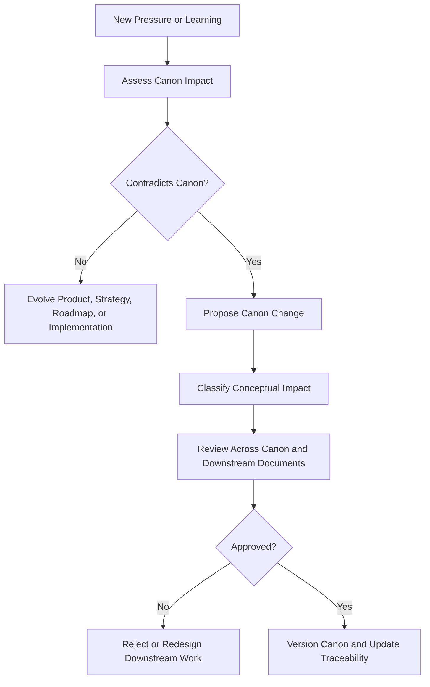
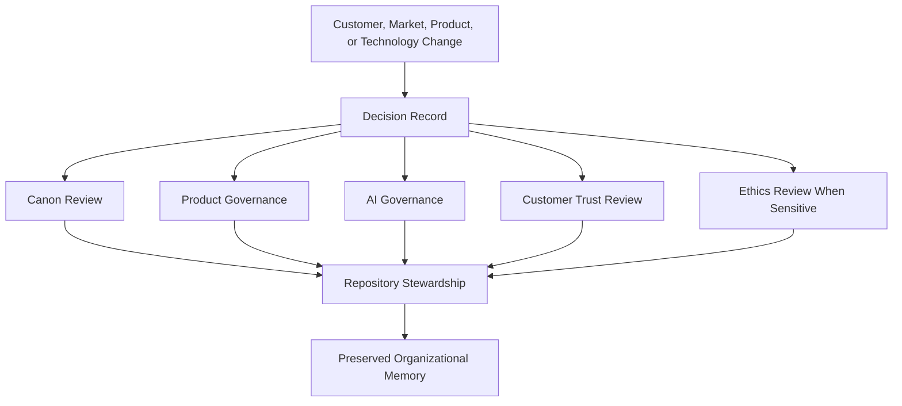
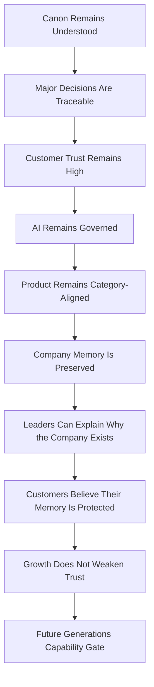

# Future Generations

## Derived From

- Canon Version: `v1.0.0`
- Architecture Version: `v1.0.0`
- Implementation Version: `v1.0.0`
- Product Version: `v1.0.0`
- Research Version: `v1.0.0`
- Strategy Version: `v1.0.0`
- Roadmap Philosophy Version: `v1.0.0`
- Category Leadership Roadmap Version: `v1.0.0`
- Organizational Intelligence Roadmap Version: `v1.0.0`
- Enterprise Infrastructure Roadmap Version: `v1.0.0`
- Global Memory Network Roadmap Version: `v1.0.0`

### Primary Repository Sources

- [Canon](../canon/README.md)
- [Architecture](../architecture/README.md)
- [Implementation](../implementation/README.md)
- [Product](../product/README.md)
- [Research](../research/README.md)
- [Strategy](../strategy/README.md)
- [Roadmap](./README.md)
- [Roadmap Philosophy](./00_ROADMAP_PHILOSOPHY.md)
- [Category Leadership](./16_CATEGORY_LEADERSHIP.md)
- [Organizational Intelligence](./17_ORGANIZATIONAL_INTELLIGENCE.md)
- [Enterprise Infrastructure](./18_ENTERPRISE_INFRASTRUCTURE.md)
- [Global Memory Network](./19_GLOBAL_MEMORY_NETWORK.md)

### Primary Supporting Documents

- [Founder's Thesis](../canon/00_FOUNDERS_THESIS.md)
- [Product Vision](../canon/01_PRODUCT_VISION.md)
- [Product Principles](../canon/02_PRODUCT_PRINCIPLES.md)
- [AI Cognitive Model](../canon/06_AI_COGNITIVE_MODEL.md)
- [Canon Governance](../canon/CANON_GOVERNANCE.md)
- [Product Governance](../product/11_PRODUCT_GOVERNANCE.md)
- [Research Backlog](../research/10_RESEARCH_BACKLOG.md)
- [Experiments](../research/09_EXPERIMENTS.md)
- [Category Design](../strategy/00_CATEGORY_DESIGN.md)
- [Competitive Strategy](../strategy/06_COMPETITIVE_STRATEGY.md)
- [Growth Strategy](../strategy/07_GROWTH_STRATEGY.md)
- [Long-Term Vision](../strategy/09_LONG_TERM_VISION.md)

---

Status: **Active**

## Primary Question

How should the company preserve its Canon, mission, trust model, and category integrity across future generations of technology, leadership, employees, customers, and markets?

This document defines the Future Generations roadmap for the Organizational Intelligence Platform.

It is the final roadmap document. It is not an HR plan, succession plan, legal charter, or prediction of specific future technologies. It defines how the company should preserve its founding purpose, Canon, trust model, category integrity, and organizational memory across decades of technological, market, organizational, and leadership change.

## 1. Executive Summary

Future Generations is the roadmap for preserving the company's founding purpose across decades.

Technology will change. Markets will change. AI will change. Customers will change. Employees will change. Leadership will change. The company may enter new regions, serve new industries, adopt new interfaces, replace major parts of its technical stack, and face pressures that the founding team cannot fully anticipate.

Those changes should not cause the company to forget why it exists.

The Canon must continue to guide decisions. The mission must continue to constrain growth. Customer trust must remain stronger than short-term opportunity. AI must remain governed by human accountability. Category leadership must remain grounded in Organizational Intelligence rather than generic AI, automation, or data extraction.

The purpose of this roadmap is therefore stewardship. It defines how future leaders should preserve the mission:

> Never let knowledge become a lost archive.

Future Generations maturity is not achieved by longevity alone. A company can survive for decades while losing its purpose. This phase is healthy only when the company continues to help organizations preserve what they learn, govern what they know, and become more capable through work while preserving the principles that made that mission trustworthy.

## 2. Why Future Generations Matter

Companies often lose their original purpose as they grow.

The loss is rarely immediate. It usually happens gradually. A practical exception becomes a new habit. A short-term revenue decision becomes a product direction. A technology trend becomes a strategy. A customer trust boundary becomes negotiable. A foundational document becomes ceremonial rather than operational.

Future Generations matter because the risks increase with scale and time.

| Risk | How It Threatens the Company |
| --- | --- |
| Chasing trends | The company follows market novelty instead of organizational learning. |
| Prioritizing short-term growth | Revenue pressure weakens trust, governance, or product integrity. |
| Weakening trust | Customers stop believing the platform protects their memory and judgment. |
| Over-automating AI | AI gains authority faster than governance and accountability can support. |
| Losing customer empathy | Product decisions drift away from real organizational work and pain. |
| Redefining the category too casually | Organizational Intelligence becomes diluted into adjacent categories. |
| Allowing knowledge to decay internally | The company stops practicing the memory discipline it sells. |
| Treating Canon as old documentation | Foundational commitments become historical artifacts instead of active constraints. |

The purpose of this document is to make those risks visible before they become normal.

## 3. The Enduring Mission

The enduring mission is:

> Never let knowledge become a lost archive.

This mission applies beyond the product surface. It should shape customers, employees, product, AI, governance, research, partnerships, and future leadership.

| Area | Mission Application |
| --- | --- |
| Customers | Help organizations preserve, validate, govern, and reuse what they learn from work. |
| Employees | Preserve internal decisions, customer lessons, research, and operating knowledge so the company itself compounds learning. |
| Product | Ensure product evolution strengthens Organizational Memory, Human Review, evidence, Governance, and the Knowledge Flywheel. |
| AI | Use AI to amplify organizational learning without making it an ungoverned authority. |
| Governance | Keep decisions traceable, reviewable, and aligned with Canon and customer trust. |
| Research | Continue investigating organizational learning, trust, AI governance, memory, and decision quality. |
| Partnerships | Work with partners who strengthen governed learning rather than extract customer knowledge. |
| Future Leaders | Preserve the company's purpose through changing markets, incentives, technologies, and organizational structures. |

The mission is not a slogan. It is a constraint on what the company may become.

## 4. Canon Stewardship

The Canon is the highest-order documentation layer.

Future leaders may evolve implementation, roadmap, product, strategy, operating plans, and go-to-market execution. They may replace technologies, restructure teams, serve new industries, and revise roadmap sequencing as evidence changes.

Canon changes require greater care.

The Canon protects the conceptual identity of the Organizational Intelligence Platform. It defines why the company exists, what the platform is, how Organizational Intelligence works, how Human Review and Governance preserve trust, and how AI should participate without replacing human authority.

| Stewardship Area | Requirement |
| --- | --- |
| What Canon protects | Mission, product identity, core concepts, trust boundaries, Human Review, Governance, Organizational Memory, the Knowledge Flywheel, and AI authority limits. |
| When Canon may change | Only when foundational learning shows that the existing Canon is insufficient, incomplete, or conceptually wrong. |
| Who should review changes | Founder or Canon steward, product leadership, architecture leadership, research leadership, governance owner, and affected downstream document owners. |
| How changes should be documented | Through explicit versioning, change rationale, affected documents, compatibility impact, and downstream review. |
| How contradictions should be resolved | Downstream documents should conform to Canon unless a formal Canon change is proposed, reviewed, approved, and versioned. |

Canon stewardship should follow [Canon Governance](../canon/CANON_GOVERNANCE.md). Implementation pressure, customer pressure, investor pressure, or technology enthusiasm does not redefine the Canon by itself.

The Canon should remain stable enough to guide decades of change and honest enough to evolve when foundational learning requires it.

## 5. Technology Changes, Principles Endure

The company should assume that future technologies will change substantially.

| Future Change Area | Stewardship Requirement |
| --- | --- |
| AI models | Preserve model abstraction, explainability, governance, and customer control. |
| Interfaces | Let interaction patterns evolve while preserving workflow clarity, review, and trust. |
| Databases | Replace storage mechanisms when needed without weakening memory integrity or Provenance. |
| Cloud infrastructure | Evolve deployment and operations while preserving security, reliability, and tenant boundaries. |
| Agents | Govern autonomous behavior through permissions, audit, and Human Review for consequential actions. |
| Robotics | Treat physical-world action as higher-risk and subject to strong governance if ever relevant. |
| Regulation | Adapt to changing AI, privacy, data, and sector obligations without weakening customer ownership. |
| Enterprise systems | Integrate with changing systems of record without becoming a replacement for them. |

The following principles should endure across technology changes:

| Enduring Principle | Meaning |
| --- | --- |
| Evidence | Trusted knowledge should remain connected to supporting evidence and Provenance. |
| Human Review | Consequential knowledge and decisions require accountable human validation. |
| Governance | Memory, AI behavior, access, lifecycle, and change require explicit controls. |
| Organizational Memory | The platform exists to preserve validated learning across people, systems, and time. |
| Explainability | Users should understand why knowledge is trusted, where it came from, and how it changed. |
| Trust | Customer confidence is more important than short-term acceleration. |
| Learning | Work should improve future work through the Knowledge Flywheel. |
| Customer Ownership | Private organizational memory belongs to the customer organization. |

Technology should serve these principles. It should not reinterpret them.

## 6. AI Evolution and Human Accountability

AI may become far more capable than the systems available when the repository was first written.

Future AI may reason across larger contexts, operate through agents, generate richer plans, interact through new interfaces, execute multi-step workflows, and appear more autonomous. These capabilities may be useful, but capability does not remove the need for accountability.

Future leaders must preserve:

- human accountability;
- governance;
- explainability;
- permission boundaries;
- review for high-impact decisions;
- customer control;
- memory integrity.

AI should remain an amplifier of Organizational Intelligence, not an ungoverned authority.

| AI Evolution Risk | Required Boundary |
| --- | --- |
| AI appears more competent than reviewers | Human accountability remains required for consequential trust decisions. |
| AI agents can take actions | Actions require explicit permission, audit, and risk-appropriate review. |
| AI can synthesize across memory | Retrieval and synthesis must respect access, Provenance, and context. |
| AI can propose knowledge changes | Proposals remain Knowledge Candidates until validated. |
| AI can infer sensitive patterns | Sensitive inference requires governance, transparency, and customer control. |
| AI providers become powerful platforms | Provider abstraction and customer ownership prevent model dependency. |
| AI pressure favors speed | Trust, review, and explainability remain stronger constraints than speed. |

The company should not measure AI maturity by how much authority is removed from people. It should measure AI maturity by how reliably AI improves organizational learning while remaining governed, explainable, bounded, and accountable.

## 7. Customer Trust Across Generations

Customer trust is not earned once.

It must be renewed continuously through product behavior, governance, operations, communication, and restraint. A customer entrusts the platform with organizational memory, evidence, knowledge, decisions, and AI-assisted reasoning. That trust is fragile because the platform's value depends on the customer's belief that the company will protect what the organization knows.

| Trust Dependency | Stewardship Requirement |
| --- | --- |
| Security | Protect private memory, access, integrations, and tenant boundaries. |
| Reliability | Keep critical knowledge workflows dependable as the platform becomes infrastructure. |
| Privacy | Respect customer ownership, consent, residency, and confidentiality. |
| Honesty | Communicate capabilities, limitations, incidents, and AI behavior accurately. |
| Governance | Preserve review, approval, audit, lifecycle, and permission discipline. |
| Incident response | Respond transparently and competently when failures occur. |
| Transparent AI behavior | Make AI participation visible, explainable, and bounded. |
| Ethical product decisions | Refuse capabilities that weaken human accountability or customer ownership. |
| Preserving customer memory | Maintain durability, portability, correction, and deletion paths where required. |

Trust should be treated as an operating asset and a strategic constraint. Growth that weakens trust is not progress.

## 8. Institutional Memory of the Company

The company must practice what it provides.

A company building an Organizational Intelligence Platform must itself become an Organizational Intelligence organization. It should preserve what it learns from customers, product decisions, technical changes, market experiments, governance reviews, failures, and strategic debates.

The company should preserve:

| Internal Memory Area | Why It Matters |
| --- | --- |
| Product decisions | Future teams need to understand why capabilities were built, changed, narrowed, or rejected. |
| Research findings | Customer and market learning should compound rather than be rediscovered. |
| Customer lessons | Patterns across customers should shape product and strategy without exposing private memory. |
| Failed experiments | Failed assumptions prevent repeated mistakes when preserved honestly. |
| Architecture decisions | Technical rationale helps future teams evolve systems without breaking boundaries. |
| Governance decisions | Review history preserves why trust boundaries exist. |
| Pricing lessons | Market and packaging learning should remain traceable over time. |
| Category evolution | The company should remember how the Organizational Intelligence category matured. |
| Cultural principles | Operating culture should preserve mission, trust, humility, and learning discipline. |

Internal forgetting would make the company less credible and less capable. It would also create the same organizational entropy the platform exists to reduce.

## 9. Leadership Stewardship

Future leaders should be evaluated not only by growth.

Growth matters, but growth without mission fidelity can weaken the company. Leaders should also be evaluated by whether they protect mission, Canon, customer trust, category clarity, product integrity, human-centered governance, and long-term learning.

| Leadership Responsibility | Stewardship Standard |
| --- | --- |
| Protect mission | Keep the company focused on preserving and governing organizational learning. |
| Protect Canon | Ensure foundational concepts remain active constraints on decisions. |
| Protect customer trust | Make security, privacy, honesty, reliability, and governance non-negotiable. |
| Protect category clarity | Keep Organizational Intelligence distinct from generic AI, automation, and knowledge storage. |
| Protect product integrity | Avoid feature accumulation that weakens the Knowledge Flywheel or memory trust. |
| Protect human-centered governance | Preserve Human Review and accountability where consequences require them. |
| Protect long-term learning | Preserve internal memory, research, decision records, and review cycles. |

Leadership stewardship means future leaders can answer:

- Why does this company exist?
- What does the Canon require?
- What must not be traded for growth?
- How does this decision affect customer trust?
- How does this decision strengthen or weaken Organizational Intelligence?
- What should future employees know about why this decision was made?

Leaders who cannot answer those questions are not yet stewards of the mission.

## 10. Category Integrity

The Organizational Intelligence Platform category can drift if future teams pursue adjacent opportunities without discipline.

| Category Drift Risk | Why It Matters | How Future Teams Avoid It |
| --- | --- | --- |
| Becoming a generic AI platform | The category loses its learning, memory, and governance distinction. | Keep Organizational Memory and the Knowledge Flywheel central. |
| Becoming a help desk add-on | The company becomes constrained by the first beachhead rather than the broader mission. | Treat Customer Support as proof, not the limit of the category. |
| Becoming an automation layer | Speed replaces learning as the perceived value. | Measure capability, reuse, trust, and learning, not only work removed. |
| Becoming a data extraction system | Customer memory becomes treated as input for company advantage. | Preserve customer ownership and consent as hard limits. |
| Becoming a consulting-heavy services firm | The product stops compounding as platform capability. | Use services to learn, enable, and validate, not to replace product maturity. |
| Becoming model-dependent | The company depends on a provider rather than governed memory and trust. | Preserve AI abstraction and compete on memory, governance, and learning. |
| Becoming surveillance infrastructure | Memory and AI are used to monitor people rather than improve organizational capability. | Reject surveillance incentives and protect human dignity and trust. |

Category integrity should be reviewed continuously. The company should avoid language, capabilities, metrics, and partnerships that make Organizational Intelligence indistinguishable from adjacent categories.

## 11. Governance Across Generations

Governance across generations makes stewardship operational.

| Governance Mechanism | Purpose |
| --- | --- |
| Canon review process | Confirms the Canon remains understood, coherent, and active without encouraging casual change. |
| Major decision records | Preserve rationale, evidence, alternatives, risks, and downstream impact for consequential decisions. |
| Product governance council | Reviews major product changes for Canon alignment, customer value, trust, and category integrity. |
| AI governance review | Evaluates AI behavior, authority, explainability, model dependency, and risk boundaries. |
| Customer trust review | Reviews security, privacy, reliability, incident learning, and customer confidence. |
| Ethics review for sensitive capabilities | Examines capabilities that affect surveillance, employee knowledge, regulated domains, or high-impact decisions. |
| Annual category review | Tests whether market language, product behavior, and customer value remain category-aligned. |
| Repository stewardship | Maintains documentation consistency, traceability, version history, and internal memory. |

These mechanisms should scale with the company. In early stages, one person may hold several responsibilities. In later stages, governance should become institutional without becoming ceremonial.

Governance is not a substitute for judgment. It is the system that keeps judgment visible, reviewable, and inheritable.

## 12. Future Generations Maturity Levels

Future Generations stewardship matures through levels. Each level requires evidence and carries specific risks.

| Level | Meaning | Evidence | Risks |
| --- | --- | --- | --- |
| Level 1 - Founder-Led Stewardship | Founder personally protects the Canon. | Founder reviews foundational decisions, resolves contradictions, and maintains mission clarity. | Stewardship depends too heavily on one person. |
| Level 2 - Team Stewardship | Early team understands and applies the Canon. | Team members use Canon language correctly, make traceable decisions, and identify contradictions. | Canon knowledge remains informal and uneven. |
| Level 3 - Organizational Stewardship | Governance roles and decision processes preserve principles. | Decision records, product governance, AI review, trust review, and repository stewardship operate. | Governance can become paperwork without real authority. |
| Level 4 - Institutional Stewardship | Memory, ethics, and category clarity survive leadership changes. | New leaders preserve mission, customer trust, Canon alignment, and category discipline. | Leadership turnover can create reinterpretation or drift. |
| Level 5 - Generational Stewardship | The mission survives across decades and technology shifts. | The company continues helping organizations preserve governed memory while maintaining trust across eras. | Longevity can create complacency, ceremonial Canon, or mission drift. |

Maturity should be earned through evidence, not assumed because the company has aged.

## 13. Long-Term Ethical Responsibilities

The platform's responsibility grows as it becomes more trusted.

| Responsibility Area | Stewardship Requirement |
| --- | --- |
| Customer memory | Protect the durability, privacy, ownership, and integrity of organizational memory. |
| AI influence | Ensure AI suggestions remain explainable, bounded, and accountable. |
| Sensitive organizational knowledge | Treat confidential decisions, policies, incidents, and expertise with strong governance. |
| Employee knowledge | Preserve organizational learning without reducing employees to surveillance targets. |
| Public-sector use | Respect sovereignty, transparency, public accountability, and legal constraints. |
| Healthcare, education, and government use | Apply heightened review where memory affects vulnerable populations or public services. |
| Global knowledge inequality | Avoid building only for organizations with the most resources while excluding smaller institutions from learning capability. |
| Data ownership | Preserve customer ownership and portability; do not treat memory as company-owned raw material. |
| Avoiding surveillance misuse | Reject product patterns that convert Organizational Memory into employee monitoring infrastructure. |
| Preventing trust erosion | Treat ethical shortcuts as strategic risks, not only compliance risks. |

Ethical responsibility is not separate from product strategy. The company's category depends on trust, and trust depends on ethical restraint.

## 14. Future Research Agenda

Future generations should continue researching the conditions under which organizations learn, trust, govern, and preserve memory responsibly.

| Research Area | Core Question |
| --- | --- |
| Organizational learning | What makes work reliably become reusable institutional capability? |
| AI governance | How should increasingly capable AI remain bounded, explainable, and accountable? |
| Human-AI collaboration | Which tasks benefit from AI assistance while preserving human authority? |
| Knowledge representation | How should memory represent context, uncertainty, contradiction, history, and change? |
| Privacy-preserving learning | How can ecosystem learning occur without exposing private memory? |
| Institutional memory | What practices help organizations preserve knowledge across turnover and time? |
| Decision quality | How does access to validated memory improve decisions and reduce repeated mistakes? |
| Trust systems | What product and governance behaviors sustain customer trust over decades? |
| Regulatory change | How do evolving AI, privacy, data, and sector rules affect memory platforms? |
| Societal impact | How does organizational memory affect work, institutions, accountability, and inequality? |

The research agenda should remain connected to customer reality. Research should clarify judgment, not become detached abstraction.

## 15. Stewardship Metrics

Future Generations stewardship should be measured through indicators of alignment, trust, governance, learning, and category integrity.

| Metric | What It Indicates |
| --- | --- |
| Canon contradiction rate | Frequency of product, strategy, or roadmap decisions that conflict with Canon. |
| Major decision traceability | Percentage of consequential decisions with clear rationale, evidence, owner, and downstream impact. |
| Customer trust score | Customer confidence in security, reliability, privacy, AI behavior, and memory stewardship. |
| AI governance incident rate | Frequency and severity of AI behavior that violates governance boundaries. |
| Security incident response quality | Whether incidents are handled transparently, competently, and with preserved trust. |
| Research update cadence | Whether customer, market, AI, governance, and regulatory learning remains active. |
| Product decision alignment | Degree to which product decisions strengthen Organizational Intelligence and the Knowledge Flywheel. |
| Employee Canon literacy | Whether employees understand mission, Canon concepts, trust boundaries, and category meaning. |
| Customer memory portability | Whether customers can retain appropriate control and portability over their memory. |
| Category clarity indicators | Whether customers, partners, analysts, and employees distinguish OIP from adjacent categories. |
| Long-term retention | Whether customers continue trusting the platform as memory and governance become more important. |
| Ethical review completion | Whether sensitive capabilities receive appropriate ethics review before expansion. |

These metrics should be interpreted together. High growth with weak trust, weak traceability, or increasing Canon contradictions indicates stewardship failure.

## 16. Future Generation Experiments

Future stewardship should be validated through recurring experiments and reviews. Each experiment should produce evidence before assumptions become institutional truth.

| Experiment | Purpose | Method | Evidence | Success Criteria |
| --- | --- | --- | --- | --- |
| Annual Canon review | Confirm the Canon remains understood, coherent, and active. | Review Canon concepts against major decisions, product changes, and market shifts. | Review notes, contradictions found, change proposals, and resolved issues. | Canon remains stable or changes are explicitly governed and versioned. |
| Customer trust audit | Test whether customers still trust the company with memory and AI assistance. | Interview customers and review trust metrics, incidents, and support patterns. | Trust findings, concern themes, and remediation actions. | Customers understand and trust the company's stewardship model. |
| AI governance stress test | Test AI boundaries under pressure. | Simulate high-risk AI workflows, permission challenges, and review bypass attempts. | Boundary failures, audit completeness, reviewer outcomes. | AI remains governed, explainable, and blocked from unauthorized authority. |
| Category drift review | Detect whether the company is drifting into adjacent categories. | Review product, messaging, sales, partnerships, and customer language. | Drift findings and correction actions. | OIP remains clearly distinct from generic AI, automation, help desk, and search. |
| Institutional memory audit | Test whether the company preserves its own learning. | Sample product decisions, research findings, incidents, and experiments for traceability. | Completeness of internal memory and gaps found. | Future employees can understand major decisions and lessons. |
| Leadership alignment review | Evaluate whether leaders can explain and apply the mission. | Review leader decisions, interviews, and decision records against Canon. | Alignment findings and training needs. | Leaders consistently protect mission, Canon, trust, and category clarity. |
| Technology replacement exercise | Test whether principles survive replacement of core technologies. | Model replacement of AI provider, database, interface, or cloud layer. | Impact analysis and principle-preservation findings. | The company can replace technology without weakening trust boundaries. |
| Customer portability test | Verify customer control over memory remains real. | Test export, lifecycle, correction, deletion, and contractual clarity where applicable. | Portability and control results. | Customers can exercise appropriate control over their memory. |
| Ethical risk scenario exercise | Test response to sensitive or misuse-prone capabilities. | Run scenarios involving surveillance, regulated domains, employee knowledge, or public-sector use. | Ethical findings, governance decisions, and rejected or revised paths. | Sensitive capabilities are constrained, redesigned, or rejected before harm. |

These experiments should create organizational learning. Findings should update decision records, risk registers, research agendas, governance practices, and roadmap interpretation.

## 17. Capability Gate

Future Generations stewardship is healthy only when evidence shows that the company can preserve mission and trust through change.

The Future Generations Capability Gate is satisfied when:

- Canon remains understood;
- major decisions are traceable;
- customer trust remains high;
- AI remains governed;
- product remains category-aligned;
- company memory is preserved;
- leaders can explain why the company exists;
- customers believe the company protects their organizational memory;
- growth does not weaken trust.

This gate should be re-applied throughout the life of the company. Future Generations is not a phase that completes once; it is the ongoing test of whether the company still deserves the trust required by its mission.

## 18. Risks

Future Generations stewardship carries risks that can invalidate decades of progress if ignored.

| Risk | Why It Matters |
| --- | --- |
| Canon becomes ceremonial | Foundational principles remain documented but stop constraining decisions. |
| Future leaders chase trends | The company follows market fashion instead of Organizational Intelligence. |
| AI over-automation | AI authority expands faster than review, governance, and accountability. |
| Loss of customer empathy | Product decisions become abstract and disconnected from real organizational work. |
| Category dilution | OIP becomes confused with generic AI, automation, search, or help desk software. |
| Data misuse | Customer memory is treated as company asset rather than customer-owned knowledge. |
| Surveillance incentives | Memory and AI are used to monitor people rather than preserve learning. |
| Excessive short-term monetization | Revenue tactics weaken trust, portability, or customer ownership. |
| Weak governance | Decisions become untraceable and trust boundaries erode. |
| Institutional forgetting inside the company | The company loses its own decisions, lessons, mistakes, and rationale. |
| Mission drift | The company survives commercially while no longer serving its founding purpose. |

The common defense is disciplined memory, traceability, governance, customer trust, and Canon stewardship.

## 19. Deliverables

Future Generations stewardship should produce durable governance and memory artifacts.

Expected deliverables include:

- a Canon stewardship process;
- an annual category review;
- an AI governance review process;
- a customer trust review framework;
- an institutional memory audit;
- a major decision record system;
- a future research agenda;
- an ethical risk register;
- a leadership stewardship guide.

These deliverables matter because long-term stewardship cannot rely on individual memory alone. It must become a repeatable organizational capability.

## 20. Relationship to the Entire Roadmap

This final document protects every previous roadmap phase.

It ensures that Prototype, Product-Market Fit, Platform, Category, Enterprise Infrastructure, Global Memory Network, and future stages remain connected to the founding mission.

| Roadmap Area | What Future Generations Protects |
| --- | --- |
| Prototype | Ensures early learning remains connected to the foundational assumptions. |
| Product-Market Fit | Ensures customer evidence does not become detached from Canon and trust. |
| Platform | Ensures platform expansion preserves memory, review, governance, and explainability. |
| Category | Ensures Organizational Intelligence remains distinct and evidence-backed. |
| Enterprise Infrastructure | Ensures reliability, security, governance, and durability remain responsibilities rather than claims. |
| Global Memory Network | Ensures ecosystem ambition never overrides privacy, ownership, consent, or trust. |
| Long-Term Vision | Ensures the future state remains an expression of the founding mission. |

Future Generations is not a new product ambition on top of the roadmap. It is the stewardship layer that keeps the whole roadmap faithful as time passes.

## 21. Traceability Matrix

Future Generations should remain traceable to the entire repository.

| Source | Future Generations Derivation |
| --- | --- |
| [Founder's Thesis](../canon/00_FOUNDERS_THESIS.md) | Defines the founding purpose, organizational forgetting problem, and mission to preserve knowledge before it becomes a lost archive. |
| [Canon](../canon/README.md) | Defines the highest-order concepts and trust boundaries future leaders must preserve. |
| [Product Vision](../canon/01_PRODUCT_VISION.md) | Defines the product ambition future generations must continue to serve. |
| [Product Principles](../canon/02_PRODUCT_PRINCIPLES.md) | Defines the enduring product constraints that prevent drift. |
| [AI Cognitive Model](../canon/06_AI_COGNITIVE_MODEL.md) | Defines AI as governed assistance rather than unbounded authority. |
| [Product Governance](../product/11_PRODUCT_GOVERNANCE.md) | Defines product decision discipline, traceability, quality gates, and governance review. |
| [Research Backlog](../research/10_RESEARCH_BACKLOG.md) | Defines unresolved questions future generations should continue investigating. |
| [Experiments](../research/09_EXPERIMENTS.md) | Defines the evidence discipline that stewardship experiments should extend. |
| [Long-Term Vision](../strategy/09_LONG_TERM_VISION.md) | Defines the decades-long future state this stewardship protects. |
| [Global Memory Network](./19_GLOBAL_MEMORY_NETWORK.md) | Defines the highest-risk ecosystem ambition that future leaders must govern through privacy, ownership, and consent. |
| [Enterprise Infrastructure](./18_ENTERPRISE_INFRASTRUCTURE.md) | Defines the infrastructure responsibility future generations must operate reliably and securely. |
| [Category Leadership](./16_CATEGORY_LEADERSHIP.md) | Defines the market recognition and category integrity future generations must preserve. |
| [Roadmap Philosophy](./00_ROADMAP_PHILOSOPHY.md) | Defines capability-gated, evidence-driven roadmap planning that prevents time, optimism, or ambition from replacing proof. |

Traceability is part of stewardship. If a future decision cannot identify the documents it derives from, it should not be treated as an authoritative direction until its basis is clarified.

## 22. What This Document Does NOT Define

This document intentionally does not define:

- exact succession plan;
- legal governance structure;
- HR policies;
- board structure;
- corporate bylaws;
- financial projections;
- specific future technologies;
- guaranteed long-term outcomes.

Those belong to legal, HR, finance, corporate governance, technology planning, and future operating documents.

This document defines only the long-term stewardship roadmap for preserving the company's mission, Canon, trust model, category integrity, and organizational learning discipline across future generations.

## 23. Closing

The company succeeds across future generations only if it continues helping organizations preserve what they learn, govern what they know, and become more capable through work.

That success is not guaranteed by market position, technical sophistication, funding, longevity, or category recognition. It depends on stewardship. Future leaders must preserve the Canon as an active source of truth, protect customer trust as a constraint on growth, govern AI as an amplifier rather than an authority, maintain category clarity, and ensure the company itself remembers what it has learned.

The company exists because organizations should not lose knowledge simply because work ends, people leave, systems change, or time passes.

Never let knowledge become a lost archive.
