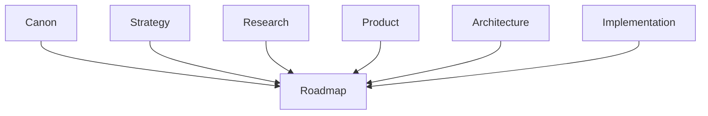

# Roadmap

## Derived From

### Primary Repository Sources

- [Canon](../canon/README.md)
- [Architecture](../architecture/README.md)
- [Implementation](../implementation/README.md)
- [Product](../product/README.md)
- [Research](../research/README.md)
- [Strategy](../strategy/README.md)
- [Repository Map](../REPOSITORY_MAP.md)

### Primary Supporting Documents

- [Product Strategy](../product/01_PRODUCT_STRATEGY.md)
- [Product Requirements](../product/02_PRODUCT_REQUIREMENTS.md)
- [Feature Catalog](../product/08_FEATURE_CATALOG.md)
- [MVP Features](../product/09_MVP_FEATURES.md)
- [Product Metrics](../product/10_PRODUCT_METRICS.md)
- [Product Lifecycle](../product/14_PRODUCT_LIFECYCLE.md)
- [MVP Scope](../implementation/12_MVP_SCOPE.md)
- [Long-Term Vision](../strategy/09_LONG_TERM_VISION.md)
- [Executive Summary](../strategy/10_EXECUTIVE_SUMMARY.md)
- [Experiments](../research/09_EXPERIMENTS.md)

---

This folder defines how the Organizational Intelligence Platform progresses from today's prototype toward the long-term vision already established elsewhere in the repository.

It does not redefine what the company believes, what the product is, how the platform is structured, or how the software is implemented. It sequences the evolution of those existing commitments into validated capability maturity.

## 1. Executive Summary

The Roadmap layer converts enduring direction into ordered execution.

Canon defines what must remain true. Strategy defines where the company is going. Research provides evidence. Product defines what capabilities matter. Architecture defines how those capabilities are logically organized. Implementation defines how they are concretely realized.

Roadmap sits above those layers and answers a different question:

> How should the company progress from the current state to the intended future state without losing coherence?

The answer is not a list of dates. It is a disciplined sequence of validated capability expansion.

## 2. Why Roadmaps Exist

The Organizational Intelligence Platform should not evolve through disconnected delivery activity, feature accumulation, or calendar pressure.

Roadmaps exist to:

- translate long-term vision into executable progression;
- sequence capability development in the right dependency order;
- clarify what must be true before broader expansion is justified;
- connect learning, validation, and delivery to organizational maturity;
- preserve alignment between near-term work and enduring repository commitments.

The Roadmap therefore exists to govern progression, not merely to describe activity.

## 3. Relationship to the Repository

Roadmap is the final documentation layer because it depends on the layers beneath it.

Each layer contributes a distinct input to roadmap planning:

| Layer | Roadmap Dependency |
| --- | --- |
| [Canon](../canon/README.md) | Constrains the platform's identity, principles, vocabulary, and required capabilities. |
| [Strategy](../strategy/README.md) | Defines market direction, sequencing logic, category ambition, and expansion context. |
| [Research](../research/README.md) | Provides evidence, assumptions, experiments, and open questions that determine readiness and risk. |
| [Product](../product/README.md) | Defines enduring user problems, workflows, capabilities, requirements, and success metrics. |
| [Architecture](../architecture/README.md) | Defines the logical boundaries, structures, and dependencies that affect capability sequencing. |
| [Implementation](../implementation/README.md) | Defines the current concrete realization, delivery constraints, and practical dependency chain. |

Roadmap depends on every one of these layers.

None of those layers should depend on Roadmap for their meaning.

## 4. Roadmap Philosophy

Roadmap planning is capability-driven before it is time-driven.

Calendar targets may still exist in planning artifacts, but time is not the primary organizing principle of repository-level roadmap logic. The primary unit of progression is validated organizational capability.

This follows directly from the repository's broader philosophy:

- the product should evolve through capability sequencing;
- expansion should follow evidence;
- trust should precede automation;
- the platform should grow by compounding Organizational Memory and Organizational Intelligence rather than by accumulating isolated features.

For that reason, roadmap phases should be interpreted as maturity states, not date promises.

## 5. Roadmap Structure

The roadmap is organized into phased capability maturity.

These phases are intentionally broad. They describe what kind of organizational capability the company has established, not a detailed release plan.

| Phase | Meaning |
| --- | --- |
| Foundation | Establish the minimum coherent capability needed to prove the core learning loop, trust model, and initial operational usefulness. |
| Product-Market Fit | Demonstrate that the focused workflow creates repeatable customer value, retention, reuse, and credible adoption evidence. |
| Platform | Generalize validated capabilities into reusable platform layers that support broader workflows, teams, and integration depth without fragmenting identity. |
| Category | Extend from product success toward category definition and leadership through repeatable outcomes, broader market proof, and disciplined expansion. |
| Long-Term Vision | Realize the repository's broader ambition of Organizational Intelligence as durable enterprise infrastructure for governed institutional learning. |

These phases should remain consistent with the staged evolution already described across Product Strategy, Executive Summary, and Long-Term Vision.

## 6. Capability Progression

Every roadmap phase builds on validated capabilities from the phase before it.

Roadmap progression should therefore follow dependency logic such as:

- a capability cannot scale before it works in a focused workflow;
- a workflow cannot become trusted memory without validation and governance;
- a product cannot become a platform by adding disconnected modules;
- a platform cannot claim category leadership before customers prove repeatable value;
- long-term vision cannot be treated as current reality.

The purpose of phasing is to preserve compounding capability. Each phase should strengthen the conditions required for the next one.

## 7. Validation Before Expansion

Validation is the gate between phases.

The repository consistently assumes that expansion should be earned through evidence, experiments, customer outcomes, governance readiness, and measurable value. Roadmap milestones should follow the same rule.

Before advancing, a roadmap milestone should make clear:

- what capability was intended;
- what evidence demonstrates that the capability works;
- what constraints or risks remain unresolved;
- what product, technical, operational, or market assumptions have been validated;
- why the next expansion step is now justified.

Advancing without validation creates false progress. It can produce implementation activity without durable organizational capability.

## 8. Traceability

Every roadmap document should explicitly state what it derives from.

At minimum, roadmap documents should identify relevant dependencies from:

- [Canon](../canon/README.md) for identity, principles, capability meaning, and conceptual constraints;
- [Strategy](../strategy/README.md) for market direction, ICP, GTM logic, expansion posture, and long-term ambition;
- [Research](../research/README.md) for evidence, assumptions, risks, and unanswered questions;
- [Product](../product/README.md) for workflows, requirements, metrics, and capability definitions;
- [Architecture](../architecture/README.md) for structural sequencing dependencies and responsibility boundaries;
- [Implementation](../implementation/README.md) for current-state feasibility, technical order, and operational constraints.

Traceability is required because roadmap planning is downstream planning. If a roadmap document cannot identify its upstream basis, it is likely inventing scope rather than sequencing validated intent.

## 9. Repository Integration

Roadmap complements the rest of the repository by translating stable direction into staged execution.

It should help readers understand:

- what capability maturity the organization has already achieved;
- what capability maturity it is attempting next;
- why that next step follows logically from the repository;
- what must be validated before broader scale or scope is justified.

Roadmap should therefore synthesize the repository without duplicating it. The authoritative definitions of philosophy, strategy, requirements, workflows, architecture, and implementation remain in their own folders.

## 10. What This Folder Does NOT Define

This folder does not define:

- sprint planning;
- ticket sequencing;
- feature specifications;
- detailed product requirements;
- user stories;
- architecture;
- implementation details;
- release engineering procedures;
- delivery task breakdowns;
- ad hoc priority lists disconnected from repository traceability.

Those artifacts may support execution, but they are not the purpose of the Roadmap layer.

Roadmap defines phased capability progression, milestone logic, dependency order, and validation gates.

## 11. Closing

Roadmap exists to transform long-term vision into executable organizational capability.

It is the layer that connects what the company believes to how the company advances. It ensures that progress is measured not by motion alone, but by validated increases in capability, trust, reuse, learning, and organizational maturity.

If maintained correctly, this folder allows the company to move from prototype to platform, from platform to category, and from category to long-term institutional impact without redefining the principles that made the platform worth building.
