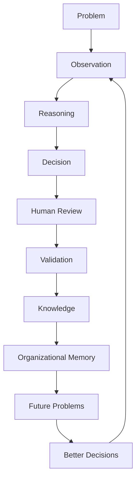

# Category Design

## Derived From

Canon Version: `v1.0.0`

### Primary Canon Documents

- [Founder's Thesis](../canon/00_FOUNDERS_THESIS.md)
- [Product Vision](../canon/01_PRODUCT_VISION.md)
- [Product Principles](../canon/02_PRODUCT_PRINCIPLES.md)
- [Capability Model](../canon/03_PRODUCT_CAPABILITY_MODEL.md)
- [Domain Model](../canon/04_PRODUCT_DOMAIN_MODEL.md)
- [Workflow Model](../canon/05_PRODUCT_WORKFLOW_MODEL.md)
- [AI Cognitive Model](../canon/06_AI_COGNITIVE_MODEL.md)

### Primary Architecture Documents

- [System Architecture](../architecture/07_SYSTEM_ARCHITECTURE.md)
- [AI Agent Architecture](../architecture/08_AI_AGENT_ARCHITECTURE.md)
- [Data Architecture](../architecture/09_DATA_ARCHITECTURE.md)
- [Knowledge Representation](../architecture/10_KNOWLEDGE_REPRESENTATION_MODEL.md)
- [Integration Architecture](../architecture/11_INTEGRATION_ARCHITECTURE.md)

### Primary Implementation Documents

- [MVP Scope](../implementation/12_MVP_SCOPE.md)
- [Implementation Architecture](../implementation/13_IMPLEMENTATION_ARCHITECTURE.md)
- [Technology Decisions](../implementation/14_TECHNOLOGY_DECISIONS.md)
- [API Architecture](../implementation/15_API_ARCHITECTURE.md)
- [Storage Architecture](../implementation/16_STORAGE_ARCHITECTURE.md)
- [Deployment Architecture](../implementation/17_DEPLOYMENT_ARCHITECTURE.md)
- [Security Architecture](../implementation/18_SECURITY_ARCHITECTURE.md)

---

Status: **Active**

## Primary Question

What new software category is this company creating, and why must that category exist?

This document is not a marketing brochure. It is not a sales deck. It is not a pitch.

It is the strategic foundation that defines the market category the company intends to lead.

# 1. Executive Summary

Organizations generate knowledge every day, but very little of that knowledge becomes permanent organizational capability.

Every support case, customer conversation, internal escalation, operational exception, policy clarification, incident, decision, and expert correction contains potential learning. Yet most of that learning remains trapped in individual minds, chat threads, tickets, documents, meetings, and one-off AI interactions. The work gets done, but the organization does not reliably become smarter because the work happened.

Traditional software helps organizations perform work.

The next generation of software should help organizations become measurably smarter through work.

This document defines the category required for that shift:

**Organizational Intelligence Platform (OIP).**

An Organizational Intelligence Platform is a software platform that transforms operational work into governed organizational knowledge, enabling institutions to become progressively more capable through every validated decision.

The category is not defined by AI, LLMs, RAG, agents, automation, or search. Those are enabling technologies. The category is defined by the organizational problem it solves: the failure of work to compound into lasting institutional capability.

# 2. The Category Problem

Modern organizations suffer from a hidden but persistent loss of intelligence.

They solve problems, but do not reliably remember the solution. They answer customer questions, but do not always improve future answers. They make decisions, but often lose the reasoning behind them. They onboard employees, but depend on informal human transfer. They document processes, but documents decay. They deploy AI assistants, but the assistant's answer often ends when the conversation ends.

This phenomenon is **Organizational Entropy**.

Organizational Entropy is the natural decay of institutional knowledge, context, memory, and decision quality as work spreads across people, systems, time, and tools.

It appears in familiar forms:

- Knowledge leaves when employees leave.
- Customer support repeatedly solves the same problems.
- AI assistants answer questions but rarely improve organizational capability.
- Documentation becomes outdated.
- Institutional expertise is fragmented.
- Organizational memory decays over time.
- Companies continuously relearn what they already knew.
- Decisions lose their evidence and rationale.
- New employees inherit procedures without context.
- Experts become bottlenecks because their judgment is not converted into reusable memory.

Organizational Entropy naturally increases as organizations grow because growth creates distance:

- Distance between experts and new employees.
- Distance between customer problems and product learning.
- Distance between policy and daily execution.
- Distance between systems of record and actual work.
- Distance between decisions and their original context.
- Distance between what the organization once learned and what it can retrieve today.

The result is not merely inefficiency. It is capability leakage. The organization pays for learning repeatedly, but fails to retain enough of what it already earned.

# 3. Why Existing Categories Are Not Enough

Existing software categories solve real problems. The argument for Organizational Intelligence Platforms is not that those categories are bad. It is that they were designed for different primary jobs.

| Category | Primary Purpose | Strengths | Limitations | Why It Does Not Solve Organizational Entropy |
| --- | --- | --- | --- | --- |
| Help Desk Platforms | Manage support requests and service workflows. | Strong case intake, routing, SLAs, agent productivity, and resolution tracking. | Optimized for handling tickets, not necessarily converting resolutions into governed organizational memory. | Solved cases often remain isolated records rather than becoming validated reusable knowledge. |
| CRM Systems | Manage customer relationships, accounts, pipeline, and commercial activity. | Strong customer record, sales process, account history, and relationship management. | Designed around customer and revenue workflows, not institutional learning from operational decisions. | Customer interactions are captured, but not systematically transformed into cross-functional knowledge. |
| Knowledge Bases | Store articles, procedures, FAQs, and documentation. | Useful for publishing curated knowledge and self-service content. | Often manually maintained, prone to decay, and disconnected from daily work. | Knowledge does not automatically evolve from validated work; documentation becomes stale unless humans maintain it. |
| Enterprise Search | Retrieve information across repositories. | Strong discovery across documents, systems, and content silos. | Finds information that exists; does not govern whether it is valid, current, reviewed, or learned from work. | Search improves access but does not create a learning loop that compounds organizational capability. |
| RAG Applications | Retrieve context and generate AI-grounded answers. | Better AI answers through retrieval from source material. | Typically answer questions without governing knowledge lifecycle, validation, memory, or institutional learning. | RAG retrieves and synthesizes, but does not necessarily transform work into validated memory. |
| AI Chatbots | Provide conversational assistance. | Accessible, flexible, fast interaction model. | Conversations are often ephemeral and weakly connected to governance, evidence, and learning. | The assistant may answer well, but the organization may not become smarter after the conversation. |
| AI Agents | Execute tasks using tools and reasoning steps. | Useful for automation, orchestration, and multi-step execution. | Focused on task completion; may lack durable governance, validation, and memory preservation. | Agents can act, but action alone does not create institutional learning. |
| Workflow Automation Platforms | Automate repeatable processes and handoffs. | Strong process orchestration, triggers, approvals, and efficiency. | Optimizes process execution more than knowledge formation. | Work moves faster, but the organization may not learn more from the work. |
| Document Management Systems | Store, organize, secure, and manage documents. | Strong document control, permissions, versioning, and retention. | Treats documents as managed artifacts rather than work-derived intelligence. | Documents may be preserved, but their embedded decisions and lessons may not become active organizational memory. |

These categories remain useful. Many will integrate with or surround Organizational Intelligence Platforms. But none of them are primarily designed to make an organization progressively more capable through every validated decision.

# 4. The New Category

An **Organizational Intelligence Platform** is a software platform that transforms operational work into governed organizational knowledge, enabling institutions to become progressively more capable through every validated decision.

More precisely:

An Organizational Intelligence Platform captures meaningful work, preserves evidence, supports reasoning, enables human review, validates learning, converts validated learning into knowledge, and stores that knowledge as durable organizational memory that improves future decisions.

This is fundamentally different from software that merely automates work.

Automation asks: How can the organization complete this task faster?

Organizational Intelligence asks: How can the organization become permanently better because this task occurred?

The distinction matters. A workflow automation platform may route a support escalation to the right team. An Organizational Intelligence Platform asks whether the escalation revealed a reusable pattern, whether the resolution was validated, whether the knowledge should be promoted, whether future cases should benefit from it, and whether the organization can explain why.

The category is defined by a capability loop, not a feature list:

1. Work happens.
2. Evidence is captured.
3. Reasoning is applied.
4. Humans review.
5. Learning is validated.
6. Knowledge is stored.
7. Memory improves future work.

# 5. The Category Thesis

Traditional software optimizes execution.

Organizational Intelligence Platforms optimize learning.

Traditional software increases productivity.

Organizational Intelligence Platforms increase institutional capability.

Traditional software stores information.

Organizational Intelligence Platforms compound expertise.

| Traditional Software | Organizational Intelligence Platform |
| --- | --- |
| Helps users complete work. | Helps organizations learn from work. |
| Optimizes execution speed. | Optimizes institutional capability. |
| Stores records and content. | Preserves evidence, knowledge, and memory. |
| Automates tasks. | Governs learning loops. |
| Improves individual productivity. | Improves collective intelligence. |
| Treats AI as a feature. | Treats AI as an amplifier within governed memory. |
| Measures activity and throughput. | Measures learning, reuse, quality, and capability gain. |
| Focuses on current workflow. | Connects current workflow to future decisions. |

The category thesis is simple:

If organizations increasingly depend on knowledge work, and if knowledge decays unless it is captured, validated, governed, and reused, then the next durable enterprise software category must be built around the compounding of organizational knowledge.

# 6. The Knowledge Flywheel

The Knowledge Flywheel is the defining mechanism of the category.

The cycle begins with a real problem. The organization observes the situation, reasons about it, makes a decision, reviews that decision, validates whether the learning is reusable, converts validated learning into knowledge, and stores it as organizational memory. That memory then improves future decisions.

The flywheel creates compounding value because each validated decision can reduce future uncertainty.

Over time, the organization should:

- Solve repeated problems faster.
- Reduce dependency on individual experts.
- Improve answer consistency.
- Preserve decision rationale.
- Make onboarding easier.
- Detect recurring patterns sooner.
- Turn support work into product and operational learning.
- Preserve trust through evidence, validation, and governance.

The Knowledge Flywheel is not an AI workflow. It is an organizational learning mechanism that AI can accelerate.

# 7. Why AI Alone Is Not Enough

AI is an enabling technology, not the category itself.

LLMs generate answers.

RAG retrieves information.

AI agents execute tasks.

These capabilities are powerful, but they do not automatically solve Organizational Entropy.

| AI Capability | What It Does Well | What It Does Not Guarantee |
| --- | --- | --- |
| LLMs | Generate, summarize, classify, explain, and reason over language. | Truth, governance, memory, validation, or institutional learning. |
| RAG | Grounds answers in retrieved sources. | That sources are current, validated, approved, or converted into memory. |
| AI Chatbots | Provide accessible conversational assistance. | That useful answers become permanent organizational capability. |
| AI Agents | Execute tasks across tools. | That task outcomes become governed knowledge. |

Organizational Intelligence Platforms govern, validate, preserve, and compound organizational knowledge.

AI is necessary because the volume and complexity of organizational work exceed what humans can manually convert into knowledge at scale. AI can observe patterns, summarize evidence, assemble context, propose learning candidates, and support review.

AI is insufficient because organizations cannot rely on unvalidated generation as institutional truth. Without governance, AI can accelerate confusion. Without evidence, AI can produce unsupported confidence. Without memory, AI conversations disappear. Without review, AI output may bypass human expertise. Without versioning, AI behavior cannot be explained later.

The category is therefore not AI software. It is organizational learning software enabled by AI.

# 8. The Beachhead Market

Customer Support is the ideal first market for Organizational Intelligence Platforms.

Customer Support has the right combination of volume, repetition, urgency, human review, historical data, and measurable business value.

| Beachhead Attribute | Why It Matters |
| --- | --- |
| High case volume | Repeated work creates many opportunities for learning. |
| Repetitive problems | Common questions and recurring issues reveal reusable knowledge. |
| Existing knowledge gaps | Support teams often know where documentation fails. |
| Measurable ROI | Deflection, handle time, escalation rate, consistency, and onboarding are measurable. |
| Human review already exists | Support quality assurance and escalation processes provide review pathways. |
| Rich historical data | Tickets, conversations, macros, articles, and resolutions contain latent knowledge. |
| Immediate value from reuse | Better knowledge can improve future cases quickly. |

Customer Support is the entry point, not the destination.

It is the first environment where the Knowledge Flywheel can be demonstrated clearly. The organization has visible problems, available evidence, expert reviewers, and urgent need. If the platform can convert support work into governed organizational knowledge, the same category logic can expand to many other functions.

# 9. Expansion Strategy

Organizational Entropy is not unique to Customer Support.

It appears wherever organizations repeatedly solve problems, interpret context, make decisions, and depend on institutional knowledge.

| Expansion Market | Organizational Entropy Pattern |
| --- | --- |
| IT Service Management | Incidents, fixes, root causes, and runbooks are repeatedly rediscovered. |
| Human Resources | Policy interpretations, employee cases, onboarding knowledge, and manager guidance fragment over time. |
| Legal | Precedents, clause interpretations, risk decisions, and matter knowledge remain trapped in experts and documents. |
| Finance | Exception handling, approval rationale, reconciliations, and policy interpretations become inconsistent. |
| Compliance | Controls, evidence, exceptions, audits, and policy updates require traceable institutional memory. |
| Operations | Process exceptions, vendor issues, quality problems, and decisions recur across teams. |
| Engineering | Incidents, architectural decisions, debugging knowledge, and operational fixes need durable memory. |
| Healthcare | Clinical operations, administrative knowledge, care coordination, and compliance learning depend on governed memory. |
| Government | Policy execution, casework, public services, and institutional continuity require explainable knowledge. |
| Education | Student support, administrative decisions, curriculum operations, and institutional learning fragment across people. |

The expansion strategy is not to force one product workflow into every department. It is to apply the same category mechanism to any domain where work should become validated organizational knowledge.

# 10. Economic Advantage

Organizational Intelligence compounds.

Traditional SaaS economics often look like this:

More customers produce more subscription revenue.

An Organizational Intelligence Platform adds another compounding layer:

More validated work produces more organizational capability.

| Economic Lever | Traditional SaaS | Organizational Intelligence Platform |
| --- | --- | --- |
| Value accumulation | Usage and records accumulate. | Validated knowledge and memory accumulate. |
| Marginal work | Each task is completed. | Each validated task may improve future tasks. |
| Expert dependency | Often remains high. | Should decrease as expertise becomes reusable memory. |
| Onboarding | Depends on training and documentation. | Improves through preserved decision context and validated knowledge. |
| Consistency | Depends on process compliance. | Improves through governed reuse of validated knowledge. |
| Decision speed | Improves through workflow efficiency. | Improves through memory, evidence, and prior validated reasoning. |
| Returns over time | Product utility may grow with adoption. | Institutional capability should grow with every validated learning loop. |

Increasing returns come from the reuse of trusted knowledge.

Every validated answer, reviewed decision, resolved pattern, and preserved memory item can reduce future effort. The more the organization uses the platform in governed workflows, the more capable the platform becomes for that organization.

# 11. Defensibility

Organizational Intelligence Platforms can create durable competitive advantages because the most valuable asset is not the software alone. It is the governed, customer-specific organizational memory accumulated through use.

Defensibility may emerge from:

- Accumulated organizational memory.
- Validated knowledge.
- Governance history.
- Institutional trust.
- Explainability.
- Customer-specific intelligence.
- Learning network effects.
- Embedded workflow context.
- Historical evidence and decision lineage.

These assets are difficult to copy because they are not generic content. They are the product of an organization's actual work, evidence, reviews, policies, decisions, exceptions, and validated learning over time.

| Defensive Asset | Why It Is Difficult to Copy |
| --- | --- |
| Organizational Memory | Built from historical work, decisions, and context unique to each institution. |
| Validated Knowledge | Requires expert review, governance, evidence, and repeated use. |
| Governance History | Reflects internal policy, approvals, exceptions, and accountability. |
| Institutional Trust | Earned through consistent behavior, explainability, and auditability. |
| Customer-Specific Intelligence | Depends on customer data, workflows, language, and decisions. |
| Learning Network Effects | Value increases as validated work improves future work. |

The defensibility is not that a competitor cannot build similar features. It is that they cannot instantly reproduce the accumulated, governed intelligence of an organization.

# 12. Category Design Principles

## Knowledge over Information

Information becomes strategically valuable when it is organized, validated, contextualized, and reusable.

The category should not reward storing more content. It should reward preserving more useful knowledge.

## Learning over Automation

Automation improves execution. Learning improves capability.

The category should use automation where helpful, but the strategic goal is to help the organization become better through repeated work.

## Governance over Guessing

Institutional knowledge requires trust.

AI-generated guesses, unreviewed answers, and stale documentation cannot become organizational memory without governance. The category must make validation and review central.

## Memory over Conversation

Conversation is useful, but ephemeral.

The category should convert valuable conversational and operational learning into durable memory when appropriate.

## Institutional Capability over Individual Productivity

Individual productivity matters, but the higher-order goal is organizational capability.

The category should help expertise survive beyond one employee, one team, one conversation, or one case.

## Human Expertise as Strategic Capital

Human experts are not merely users of the system. They are sources of judgment, validation, correction, and institutional learning.

The category should amplify expert judgment by converting it into governed memory.

## AI as Amplifier, Not Authority

AI can accelerate observation, reasoning, summarization, retrieval, and candidate generation.

AI should not become ungoverned institutional authority. Authority comes from evidence, validation, review, policy, and trusted memory.

# 13. Category Narrative

## What Changes Make This Category Possible Now?

Several changes make the category possible now:

- AI can process language, summarize work, propose patterns, and assemble context at scale.
- Enterprise workflows increasingly produce digital traces that can become evidence.
- Organizations are more distributed, making institutional memory more valuable.
- Knowledge work has become central to competitive advantage.
- Existing systems expose APIs and integration points that allow learning loops to connect across tools.
- Leaders increasingly recognize that productivity gains alone do not solve knowledge decay.

## Why Has This Category Not Emerged Before?

Earlier enterprise software focused on digitizing functions: finance, sales, HR, support, documents, projects, and workflows. Those systems created records of work, but did not have the cognitive capability to extract, validate, and reuse learning from everyday operations at scale.

Knowledge management attempted to preserve expertise, but often depended on manual authoring and maintenance. Search improved access to content, but did not validate or govern learning. Automation improved execution, but not memory.

The missing ingredients were AI-assisted reasoning, integrated workflows, governed validation, and a category-level focus on organizational learning.

## Why Will Organizations Need It Over the Next Decade?

Organizations will face increasing complexity, faster employee turnover, expanding software fragmentation, greater regulatory pressure, and rising expectations for AI-assisted work.

Without Organizational Intelligence Platforms, they risk adding AI-generated speed to already fragile memory systems. They may answer faster while learning less. They may automate tasks while repeating old mistakes. They may accumulate more content while reducing trust.

The next decade will reward organizations that can convert work into institutional capability.

## Why Is Now the Right Time?

Now is the right time because AI has made knowledge extraction and reasoning scalable, while organizational complexity has made memory decay more expensive.

The market is ready for software that does not merely help people do work, but helps institutions learn from work.

# 14. Future of the Category

Ten years from now, Organizational Intelligence Platforms could become a core layer of enterprise software alongside ERP, CRM, and HR systems.

ERP manages resources.

CRM manages customer relationships.

HR systems manage people operations.

Organizational Intelligence Platforms manage institutional learning.

In a mature enterprise architecture, an OIP may become the layer that connects work, evidence, decisions, knowledge, memory, and AI reasoning across functions. It may not replace systems of record. Instead, it may make those systems collectively smarter by preserving what the organization learns from using them.

The future category should remain grounded:

- It will not eliminate the need for experts.
- It will not make all decisions automatic.
- It will not replace governance.
- It will not make knowledge perfect.

Its realistic promise is stronger: organizations should lose less of what they learn, reuse more of what they validate, and make better decisions because their memory improves over time.

# 15. Category Manifesto

Organizations should not merely perform work more efficiently.

They should become permanently more capable because of the work they perform.

Every day, teams solve problems, answer questions, make decisions, interpret policies, correct mistakes, discover patterns, and exercise judgment. This is the raw material of institutional intelligence. Yet too often, the learning disappears into tickets, chats, documents, meetings, and memories that fade.

The modern organization does not suffer from a shortage of information. It suffers from a shortage of durable learning.

More software has helped organizations move faster. More automation has helped them complete tasks. More AI has helped them generate answers. But speed without memory is not intelligence. Automation without learning is repetition. Answers without governance are not institutional truth.

The next enterprise platform should do something different.

It should turn work into knowledge.

It should turn expert judgment into reusable memory.

It should turn repeated problems into compounding capability.

It should preserve evidence, respect human review, enforce governance, explain decisions, and remember how knowledge evolved.

It should treat AI as an amplifier of organizational learning, not as a substitute for trust.

The organizations that matter most over the next decade will not be those that simply move fastest. They will be those that learn fastest, remember best, and govern what they know.

An Organizational Intelligence Platform exists for that purpose.

It is not another place to store information. It is a way for institutions to become more capable over time.

# 16. Traceability Matrix

| Canon Concept | Category Expression |
| --- | --- |
| Organizational Intelligence | New software category focused on institutional learning and capability. |
| Knowledge Flywheel | Core mechanism that converts work into memory and better future decisions. |
| Organizational Memory | Strategic asset that compounds through validated work. |
| Human Review | Trust mechanism that prevents unvalidated AI output from becoming authority. |
| Governance | Competitive advantage through trusted, auditable, policy-aligned knowledge. |
| Learning | Economic engine that increases institutional capability over time. |
| Evidence | Basis for explainability, validation, and durable trust. |
| Knowledge | Governed reusable understanding produced from work. |
| AI Cognitive Model | Enabling intelligence layer that supports reasoning without replacing governance. |
| Product Vision | Category ambition: software that helps organizations become smarter through work. |
| Product Principles | Category rules: preserve meaning, trust, review, and institutional capability. |
| Domain Model | Category language: Case, Evidence, Knowledge, Memory, Review, Validation, Agent, Organization. |
| Workflow Model | Category behavior: work evolves into learning through governed transitions. |
| Architecture | Category foundation: stable core, integrations, data, knowledge, AI, and governance boundaries. |
| Implementation | Category credibility: concrete system decisions exist to realize the category without defining it by technology. |

# 17. What This Document Does NOT Define

This document intentionally excludes:

- Product features.
- Pricing.
- Roadmap.
- Technology stack.
- Implementation.
- Sales process.
- Marketing campaigns.
- Competitive positioning copy.
- Packaging.
- Buyer personas.
- Demand generation strategy.

Those belong in other strategy, product, roadmap, and go-to-market documents.

# 18. Closing

Categories are not invented through marketing.

They emerge when a new problem becomes visible and existing categories can no longer adequately solve it.

The Organizational Intelligence Platform is proposed as the category for software whose primary purpose is to transform everyday organizational work into permanent institutional capability.

The long-term ambition is not simply to build another enterprise application.

It is to establish Organizational Intelligence as a foundational layer of modern organizations, just as ERP systems manage resources and CRM systems manage customer relationships.

The category will deserve to exist if it makes one idea unavoidable:

Organizations should not only do work.

They should learn from it, remember it, govern it, and become measurably more capable because it happened.
