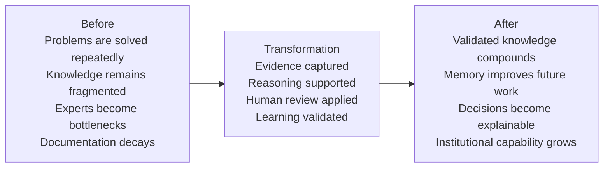

# Positioning

## Derived From

Canon Version: `v1.0.0`

### Primary Canon Documents

- [Founder's Thesis](../canon/00_FOUNDERS_THESIS.md)
- [Product Vision](../canon/01_PRODUCT_VISION.md)
- [Product Principles](../canon/02_PRODUCT_PRINCIPLES.md)
- [Capability Model](../canon/03_PRODUCT_CAPABILITY_MODEL.md)
- [Domain Model](../canon/04_PRODUCT_DOMAIN_MODEL.md)
- [Workflow Model](../canon/05_PRODUCT_WORKFLOW_MODEL.md)
- [AI Cognitive Model](../canon/06_AI_COGNITIVE_MODEL.md)

### Primary Architecture Documents

- [System Architecture](../architecture/07_SYSTEM_ARCHITECTURE.md)
- [AI Agent Architecture](../architecture/08_AI_AGENT_ARCHITECTURE.md)
- [Data Architecture](../architecture/09_DATA_ARCHITECTURE.md)
- [Knowledge Representation](../architecture/10_KNOWLEDGE_REPRESENTATION_MODEL.md)
- [Integration Architecture](../architecture/11_INTEGRATION_ARCHITECTURE.md)

### Primary Implementation Documents

- [MVP Scope](../implementation/12_MVP_SCOPE.md)
- [Implementation Architecture](../implementation/13_IMPLEMENTATION_ARCHITECTURE.md)
- [Technology Decisions](../implementation/14_TECHNOLOGY_DECISIONS.md)
- [API Architecture](../implementation/15_API_ARCHITECTURE.md)
- [Storage Architecture](../implementation/16_STORAGE_ARCHITECTURE.md)
- [Deployment Architecture](../implementation/17_DEPLOYMENT_ARCHITECTURE.md)
- [Security Architecture](../implementation/18_SECURITY_ARCHITECTURE.md)

### Primary Strategy Documents

- [Category Design](./00_CATEGORY_DESIGN.md)

---

Status: **Active**

## Primary Question

How should the company be perceived in the minds of customers, investors, analysts, and the market?

This document defines strategic positioning.

It is not a marketing campaign. It is not advertising copy. It is not branding. It defines the unique place the company intends to occupy within the newly defined Organizational Intelligence Platform category.

# 1. Executive Summary

The company should be perceived as the defining company of the **Organizational Intelligence Platform** category.

It is not positioned as:

- An AI chatbot.
- An AI agent.
- A help desk.
- A CRM.
- A knowledge base.
- An automation platform.

Those categories are familiar, useful, and adjacent. They are not the strategic position.

The company is positioned as the platform that enables organizations to continuously increase their institutional capability through governed learning.

The core positioning statement is:

> For knowledge-intensive organizations that repeatedly solve important operational problems, the Organizational Intelligence Platform transforms everyday work into governed organizational memory, so the institution becomes more capable through every validated decision.

The strategic perception to create is simple:

This is not software that helps people answer questions once.

This is software that helps organizations become smarter permanently.

# 2. Positioning Framework

Positioning defines the place the company intends to occupy in the customer's mind. It clarifies what the company is, who it serves, why it matters, and why it is different.

| Element | Definition |
| --- | --- |
| Target Customer | Knowledge-intensive organizations with repeated operational problems, high support or service volume, expert-dependent workflows, and a need to preserve institutional learning. |
| Category | Organizational Intelligence Platform. |
| Unique Value | Converts operational work into governed knowledge and durable organizational memory. |
| Primary Differentiation | The Knowledge Flywheel: evidence, reasoning, human review, validation, knowledge, and memory compound through real work. |
| Expected Outcome | The organization becomes more capable, consistent, explainable, and less dependent on individual expert memory. |
| Strategic Advantage | Accumulated organizational memory, trusted knowledge, governance history, and institutional learning become durable assets. |

## Formal Positioning Statement

For knowledge-intensive organizations that repeatedly solve customer, operational, or internal service problems, the Organizational Intelligence Platform is a new enterprise software category that transforms everyday work into governed organizational memory. Unlike chatbots, knowledge bases, help desks, search tools, or automation platforms, it compounds institutional capability by connecting evidence, reasoning, human review, validation, and memory into a governed learning system.

# 3. The Customer Transformation

The transformation is from repeated problem solving to permanent organizational learning.

Current State:

Organizations repeatedly solve problems.

Future State:

Organizations permanently learn from every solved problem.

| Before | After |
| --- | --- |
| Work is completed, but learning is inconsistent. | Work becomes a source of validated learning. |
| Experts repeatedly answer similar questions. | Expert judgment becomes reusable organizational memory. |
| Documentation depends on manual upkeep. | Knowledge is continuously refreshed through governed work. |
| AI answers may be useful but ephemeral. | AI-supported learning is reviewed, validated, and preserved. |
| Teams search for old answers. | Teams inherit a memory that improves with use. |
| Quality depends on who handles the case. | Quality improves through reusable, governed knowledge. |

The customer does not merely buy efficiency. The customer buys the ability to become more capable over time.

# 4. What We Are NOT

Positioning requires exclusion. If the company is perceived as everything, it will be remembered as nothing.

| We Are Not | Why the Comparison Is Incomplete |
| --- | --- |
| Not an AI chatbot | Chatbots answer questions. The platform turns validated work into organizational memory. |
| Not an AI wrapper | The value is not a thin interface over a model. The value is governed learning, memory, and trust. |
| Not a knowledge base | Knowledge bases store articles. The platform creates a learning loop from operational work to validated knowledge. |
| Not a CRM | CRM manages customer relationships and commercial records. The platform manages institutional learning from work. |
| Not an enterprise search engine | Search finds existing information. The platform governs whether knowledge is valid, reusable, and remembered. |
| Not an automation platform | Automation executes processes. The platform helps organizations learn from the processes they execute. |
| Not a ticketing system | Ticketing systems manage cases. The platform converts resolved cases into reusable organizational capability. |

These comparisons are incomplete because they describe tools for execution, retrieval, or interaction. The company should be perceived as building the system of learning that makes those activities compound.

# 5. Core Positioning Pillars

## Organizational Learning

The platform is positioned around the ability of an organization to learn from its own work.

This is the central transformation. The organization should not merely complete tasks; it should improve because tasks were completed.

## Institutional Memory

The platform preserves knowledge beyond individual employees, conversations, and systems.

Institutional Memory is the strategic asset customers should remember. It is what survives turnover, tool changes, model changes, and time.

## Governed Intelligence

The platform does not treat every generated answer as truth.

Governed Intelligence means knowledge is connected to evidence, review, validation, permissions, audit, and policy. This positioning separates the company from ungoverned AI tools.

## Human-AI Collaboration

The platform positions AI as an amplifier of human expertise, not a replacement for authority.

AI helps observe, summarize, reason, and propose. Humans review, validate, correct, and govern.

## Knowledge Compounding

The platform creates increasing value as validated work accumulates.

Every solved problem can improve future problem solving. This is the economic and strategic heart of the category.

## Trustworthy AI

Trustworthy AI is not model confidence alone.

It requires evidence, context, source traceability, validation, human review, governance, and audit. The platform should be perceived as the enterprise path from AI usefulness to AI accountability.

# 6. Competitive Positioning

The market contains many adjacent categories. The positioning should remain respectful: each category optimizes a different job.

| Category | What They Optimize | What Our Platform Optimizes |
| --- | --- | --- |
| Help Desk Platforms | Ticket intake, routing, SLA management, and case resolution. | Learning from resolved work and converting repeated cases into organizational memory. |
| CRM Systems | Customer relationships, account history, pipeline, and commercial activity. | Institutional capability derived from customer and operational interactions. |
| Knowledge Bases | Publishing and organizing curated knowledge articles. | Continuously creating, validating, and evolving knowledge from work. |
| Enterprise Search | Finding information across systems. | Determining what knowledge is valid, governed, reusable, and explainable. |
| AI Chatbots | Conversational answers and assistance. | Governed learning that persists beyond the conversation. |
| RAG Applications | Retrieval-grounded AI responses. | Full knowledge lifecycle: evidence, reasoning, review, validation, memory, and future reuse. |
| Agentic AI Platforms | Autonomous or semi-autonomous task execution. | Human-governed intelligence that compounds organizational capability. |
| Workflow Automation | Process efficiency, triggers, and task handoffs. | Learning from workflow outcomes and preserving reusable institutional knowledge. |

The strategic position is not that these categories are obsolete. It is that they do not, by themselves, solve Organizational Entropy.

# 7. Positioning Narrative

For decades, organizations optimized execution.

They digitized records, routed work, automated tasks, searched documents, managed customers, tracked tickets, and measured productivity. These improvements mattered. They helped organizations move faster and coordinate more work.

But execution optimization has a ceiling.

An organization can resolve more cases and still forget the lesson. It can automate a workflow and still repeat the same exception. It can deploy AI and still fail to preserve the answer. It can build a knowledge base and still watch documentation decay.

The next decade belongs to organizations that optimize learning.

As AI increases the speed of work, the cost of weak memory becomes more visible. Organizations will not win merely by generating more answers. They will win by knowing which answers are trusted, which decisions were validated, which evidence matters, which experts approved the learning, and how today's work improves tomorrow's capability.

Organizational Intelligence becomes a strategic capability because it determines whether a company compounds from experience or continuously relearns what it already knew.

# 8. Positioning Messages

The positioning must remain consistent across audiences while translating into each audience's priorities.

| Audience | Positioning Message |
| --- | --- |
| Enterprise Executives | Your organization already generates valuable knowledge every day. The platform turns that work into governed institutional capability that survives people, tools, and time. |
| Product Leaders | The platform reveals recurring customer and operational patterns, turning frontline work into validated product and service learning. |
| Customer Support Leaders | Your team should not solve the same problem forever. The platform converts resolved cases into trusted knowledge that improves future support quality. |
| IT Leaders | The platform creates a governed intelligence layer that integrates with existing systems without letting tools or vendors define institutional knowledge. |
| Knowledge Managers | The platform turns knowledge management from manual documentation maintenance into a governed learning loop from real work. |
| Investors | The company is positioned to lead a new category where value compounds through customer-specific organizational memory and validated knowledge. |
| Software Engineers | The platform is not a chatbot wrapper; it is an architecture for preserving evidence, knowledge, memory, governance, and trustworthy AI behavior. |

# 9. Elevator Pitch Variations

## 15-Second Version

We are building an Organizational Intelligence Platform: software that turns everyday work into governed organizational memory, so companies become smarter through every validated decision.

## 30-Second Version

Most enterprise software helps teams complete work, but the learning from that work often disappears. We are building an Organizational Intelligence Platform that captures evidence, supports reasoning, enables human review, validates learning, and preserves it as organizational memory. The result is an organization that becomes more capable over time.

## 60-Second Version

Organizations solve valuable problems every day, especially in customer support and service operations, but they often fail to convert those solutions into permanent capability. Knowledge stays trapped in experts, tickets, documents, and conversations. Our Organizational Intelligence Platform creates a governed learning loop: work produces evidence, AI helps reason over it, humans review it, validated learning becomes knowledge, and knowledge becomes organizational memory. We are not positioning this as a chatbot, help desk, or knowledge base. We are building the category for organizations that want to learn from every solved problem.

## 3-Minute Version

For decades, enterprise software has optimized execution. Help desks route tickets. CRMs manage customer relationships. Knowledge bases store articles. Search finds documents. Automation moves work through processes. AI assistants generate answers.

All of these are useful, but they do not solve the deeper problem: organizations repeatedly solve problems without reliably becoming more capable.

When an expert answers a difficult support case, when a team resolves an operational exception, when a reviewer corrects an AI answer, or when a new policy interpretation emerges, that work contains learning. Too often, the learning remains trapped in the case, the person, the document, or the conversation.

We are building an Organizational Intelligence Platform. It transforms operational work into governed organizational memory. The platform captures evidence, supports reasoning, enables human review, validates learning, and preserves knowledge so future work improves.

AI is important, but it is not the category. AI accelerates observation and reasoning. The strategic value is governed learning: knowledge that is explainable, reviewed, versioned, and reusable.

The customer does not simply buy a faster workflow. They buy a more capable organization.

# 10. Value Proposition

| Value Dimension | Improvement |
| --- | --- |
| Operational | Repeated problems can be resolved more consistently because prior validated learning is available. |
| Financial | Reduced repeated effort, lower onboarding burden, less expert dependency, and better reuse of institutional knowledge can improve efficiency. |
| Knowledge | Work produces validated knowledge rather than scattered records and decaying documentation. |
| Strategic | Organizational capability compounds as memory accumulates and improves future decisions. |
| Organizational | Expertise becomes less fragile because it is preserved beyond individual employees. |
| Competitive | Customer-specific intelligence and governance history become difficult-to-copy assets. |
| Human | Experts spend less time repeating themselves and more time validating, improving, and extending organizational knowledge. |

The value proposition is not only faster answers. It is better organizational learning.

# 11. Strategic Differentiators

## Knowledge Flywheel

The Knowledge Flywheel is difficult to replicate because it connects operational work, evidence, reasoning, review, validation, knowledge, and memory into one compounding system.

## Governed Learning

Governed Learning separates the platform from tools that generate or retrieve answers without validating them. It creates trust through process, policy, and review.

## Human Validation

Human Validation preserves expert authority. It ensures that AI assists learning without becoming unaccountable institutional truth.

## Organizational Memory

Organizational Memory becomes more valuable with use. It reflects customer-specific work, decisions, language, policies, and history.

## Explainability

Explainability links answers and knowledge back to evidence, provenance, validation, and history. This is critical for enterprise trust.

## Institutional Trust

Trust accumulates when the platform consistently preserves evidence, review, governance, and audit. This is harder to copy than interface features.

## Category Leadership

If the company defines Organizational Intelligence Platforms clearly and consistently, it can shape how customers, investors, analysts, and employees understand the problem.

# 12. Positioning Principles

## Lead with Transformation

The company should describe the customer transformation first: from repeated problem solving to permanent organizational learning.

## Do Not Lead with AI

AI is an enabler. Leading with AI risks being perceived as another chatbot, wrapper, or agent platform.

## Lead with Capability

The company should emphasize increased institutional capability, not only productivity, automation, or speed.

## Do Not Compete on Model Quality

Model quality matters, but positioning around model benchmarks creates vendor dependence and weakens category differentiation.

## Speak About Organizational Outcomes

Messaging should focus on memory, learning, trust, consistency, onboarding, reduced expert dependency, and better decisions.

## Never Describe the Product as Just Another AI Assistant

The product may include assistant-like experiences, but the strategic position is a governed learning platform.

## Preserve Canon Language

Positioning should consistently use the language of Organizational Intelligence, Knowledge Flywheel, Human Review, Governance, Knowledge, Evidence, and Memory.

# 13. Positioning Risks

| Risk | Why It Matters | How to Avoid It |
| --- | --- | --- |
| Being perceived as a chatbot | Chatbots feel transient and interchangeable. | Lead with organizational memory and governed learning. |
| Being perceived as an automation tool | Automation suggests process speed, not institutional capability. | Emphasize learning from work, not only executing work. |
| Being perceived as a help desk | The beachhead is support, but the category is broader. | Position support as the first market, not the final category. |
| Competing on AI model benchmarks | Model competition is unstable and vendor-dependent. | Position around governance, memory, validation, and trusted learning. |
| Vendor dependence | Customers may fear lock-in to one AI provider or tool. | Emphasize provider abstraction, architecture, and replaceability. |
| Feature-first messaging | Features can make the company seem like a point solution. | Begin with the problem of Organizational Entropy and the transformation to capability. |
| Overclaiming autonomy | Enterprises may distrust ungoverned AI authority. | Emphasize human review, validation, and governance. |
| Sounding like generic knowledge management | Knowledge management has a history of manual maintenance. | Emphasize the Knowledge Flywheel from real work to validated memory. |

# 14. Long-Term Positioning

Ten years from now, the company should be perceived as synonymous with Organizational Intelligence Platforms in the way Salesforce became associated with CRM.

This ambition should remain realistic. The objective is not to claim that one company will own all organizational knowledge or replace existing enterprise systems. The objective is to define and lead the category that helps organizations preserve and compound what they learn from work.

The long-term perception should be:

- When organizations want to manage customer relationships, they think of CRM.
- When organizations want to manage resources, they think of ERP.
- When organizations want to manage institutional learning, they think of Organizational Intelligence Platforms.

The company should become associated with the idea that organizational learning can be designed, governed, measured, and compounded.

# 15. Internal Positioning Manifesto

We are not building another tool that helps people move faster while the organization forgets what happened.

We are building the platform for organizations that want to become more capable because of the work they perform.

Every product decision should reinforce that position.

Every engineering decision should protect the integrity of evidence, knowledge, memory, governance, and explainability.

Every design decision should help humans understand, review, trust, and improve what the platform knows.

Every marketing decision should lead with transformation, not novelty.

Every sales conversation should clarify that the customer is not buying another chatbot, ticketing tool, knowledge base, or automation layer. They are buying a way to preserve institutional learning.

Every partnership should strengthen the category rather than dilute it.

Every feature should answer a strategic question:

Does this help the organization become more capable over time?

If the answer is no, the feature may be useful, but it is not central.

The company's position is earned through consistency. If we speak about Organizational Intelligence but build only AI convenience, the market will categorize us as a tool. If we build governed memory, preserve human review, protect evidence, and make learning compound, the market can understand us as a category-defining company.

Our job is not to sound different.

Our job is to make the difference true.

# 16. Traceability Matrix

| Canon Concept | Positioning Expression |
| --- | --- |
| Organizational Intelligence | Core category and strategic perception. |
| Knowledge Flywheel | Core differentiator and mechanism of compounding value. |
| Human Review | Trust mechanism that separates governed intelligence from unvalidated automation. |
| Organizational Memory | Strategic asset customers buy and accumulate over time. |
| Governance | Competitive advantage through trusted, auditable, policy-aligned learning. |
| Learning | Customer transformation from repeated work to increasing capability. |
| Evidence | Basis for explainability and trusted knowledge. |
| Knowledge | Governed reusable understanding produced from work. |
| AI Cognitive Model | AI as amplifier of reasoning, not final authority. |
| Product Vision | The company helps organizations become smarter through operational work. |
| Product Principles | Positioning rules emphasize capability, trust, review, and meaning. |
| Category Design | Organizational Intelligence Platform is the category the company intends to define. |
| Architecture | Stable platform boundaries support credibility and replaceability. |
| Implementation | Technology choices realize the positioning without defining it. |

# 17. What This Document Does NOT Define

This document intentionally excludes:

- Branding.
- Visual identity.
- Logo.
- Pricing.
- Roadmap.
- Product requirements.
- Marketing campaigns.
- Advertising.
- Sales playbooks.
- Demand generation tactics.
- Feature specifications.

Those belong in other strategy, product, sales, and go-to-market documents.

# 18. Closing

Positioning is not about describing software.

It is about defining how people think about the company.

The company's long-term objective is not simply to build the best product in an existing category. It is to become the defining company of the Organizational Intelligence Platform category.

Every future product, feature, partnership, and engineering decision should reinforce that positioning.

The market should remember one thing:

This company helps organizations turn everyday work into governed memory, so institutional capability compounds over time.
