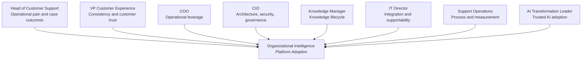
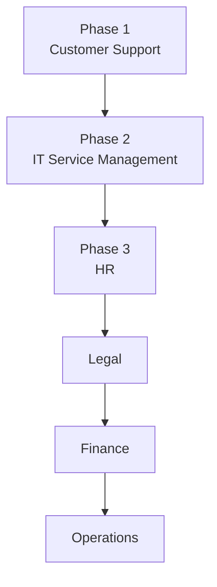

# Ideal Customer Profile

## Derived From

Canon Version: `v1.0.0`

### Primary Canon Documents

- [Founder's Thesis](../canon/00_FOUNDERS_THESIS.md)
- [Product Vision](../canon/01_PRODUCT_VISION.md)
- [Product Principles](../canon/02_PRODUCT_PRINCIPLES.md)
- [Capability Model](../canon/03_PRODUCT_CAPABILITY_MODEL.md)
- [Domain Model](../canon/04_PRODUCT_DOMAIN_MODEL.md)
- [Workflow Model](../canon/05_PRODUCT_WORKFLOW_MODEL.md)
- [AI Cognitive Model](../canon/06_AI_COGNITIVE_MODEL.md)

### Primary Architecture Documents

- [System Architecture](../architecture/07_SYSTEM_ARCHITECTURE.md)
- [AI Agent Architecture](../architecture/08_AI_AGENT_ARCHITECTURE.md)
- [Data Architecture](../architecture/09_DATA_ARCHITECTURE.md)
- [Knowledge Representation](../architecture/10_KNOWLEDGE_REPRESENTATION_MODEL.md)
- [Integration Architecture](../architecture/11_INTEGRATION_ARCHITECTURE.md)

### Primary Implementation Documents

- [MVP Scope](../implementation/12_MVP_SCOPE.md)
- [Implementation Architecture](../implementation/13_IMPLEMENTATION_ARCHITECTURE.md)
- [Technology Decisions](../implementation/14_TECHNOLOGY_DECISIONS.md)
- [API Architecture](../implementation/15_API_ARCHITECTURE.md)
- [Storage Architecture](../implementation/16_STORAGE_ARCHITECTURE.md)
- [Deployment Architecture](../implementation/17_DEPLOYMENT_ARCHITECTURE.md)
- [Security Architecture](../implementation/18_SECURITY_ARCHITECTURE.md)

### Primary Strategy Documents

- [Category Design](./00_CATEGORY_DESIGN.md)
- [Positioning](./01_POSITIONING.md)

---

Status: **Active**

## Primary Question

Who should adopt the Organizational Intelligence Platform first, and why?

This document defines the Ideal Customer Profile.

It is not a list of every possible customer. It identifies the first organizations that are most likely to gain significant value from the platform and become successful early adopters.

## 1. Executive Summary

An Ideal Customer Profile defines the organizations most likely to experience urgent pain, adopt the product successfully, produce measurable value, and validate the category.

For an Organizational Intelligence Platform, the best first customers are not simply companies interested in AI. They are organizations where operational work repeatedly generates knowledge that is valuable, but that knowledge fails to become durable organizational capability.

The company should intentionally focus on a narrow market before expanding.

This focus is strategic. Category-defining companies do not begin by serving every possible use case. They begin by proving a new category in a market where the problem is frequent, painful, measurable, and already surrounded by existing workflows, data, experts, and budgets.

The primary ICP is:

> Mid-market to lower-enterprise B2B organizations with high-volume customer support operations, recurring customer questions, fragmented knowledge, existing human review practices, and leadership urgency around AI, efficiency, customer experience, or organizational learning.

These organizations are ideal because they experience Organizational Entropy visibly. They solve similar problems every day, depend on experienced support experts, maintain imperfect knowledge bases, and already have historical case data that can become the raw material of the Knowledge Flywheel.

## 2. ICP Definition

The primary ICP is a knowledge-intensive organization where Customer Support is large enough to feel the cost of repeated learning, but focused enough for the MVP to create measurable value.

| Attribute | Primary ICP |
| --- | --- |
| Company Size | Approximately 200 to 5,000 employees, with enough operational scale to experience knowledge fragmentation but not so much complexity that adoption requires a multi-year transformation program. |
| Industry | B2B software, technology-enabled services, financial technology, healthcare technology, enterprise services, complex SaaS, and support-intensive digital products. |
| Geographic Focus | Indonesia-first, with English and Indonesian language support, expanding to Southeast Asia and broader Asia-Pacific markets before global enterprise expansion. |
| Digital Maturity | Uses structured support tools, has historical tickets or cases, maintains internal or customer-facing documentation, and is actively evaluating AI or knowledge improvement initiatives. |
| Support Organization Size | Roughly 15 to 300 support, success, operations, or service employees, including experienced reviewers, escalation owners, or knowledge managers. |
| Monthly Customer Inquiry Volume | Hundreds to tens of thousands of customer inquiries per month, with enough repetition to reveal patterns and enough complexity to require judgment. |

## Why These Characteristics Are Ideal

| Characteristic | Strategic Rationale |
| --- | --- |
| Mid-market to lower-enterprise scale | Large enough to feel Organizational Entropy, small enough to adopt before category maturity. |
| B2B or complex support context | Problems often require context, evidence, product knowledge, policy interpretation, and expert judgment. |
| High inquiry volume | Repetition creates measurable opportunities for knowledge reuse and compounding. |
| Existing support process | The MVP can attach to real workflows rather than inventing process discipline from scratch. |
| Existing documentation | Documentation decay becomes visible and improvement can be measured. |
| Human reviewers or escalation experts | The platform's Human Review and Validation principles have a natural operating model. |
| AI readiness | Leadership is already looking for better ways to use AI, but may distrust ungoverned answers. |

## ICP Fit Matrix

| Dimension | Strong Fit | Weak Fit |
| --- | --- | --- |
| Work Repetition | Many recurring customer issues, questions, and operational exceptions. | Mostly one-off bespoke work with little reusable learning. |
| Knowledge Complexity | Answers require context, product knowledge, policy, evidence, or expert judgment. | Answers are simple, static, and already well-covered by documentation. |
| Review Culture | Experienced people already review escalations, QA, or knowledge articles. | No willingness to review or validate outputs. |
| Data Availability | Tickets, chats, articles, macros, call notes, and case outcomes exist. | Little historical data or no structured record of support work. |
| Leadership Urgency | Customer experience, efficiency, AI adoption, or knowledge loss is a priority. | No executive or functional urgency around the problem. |

## 3. Customer Pain Profile

The ICP experiences repeated evidence that work is not becoming organizational memory.

| Pain | What It Looks Like | Strategic Meaning |
| --- | --- | --- |
| Repeated Customer Questions | Support teams answer the same issues across tickets, channels, and regions. | The organization is paying repeatedly for knowledge it already produced. |
| Knowledge Trapped Inside Experienced Employees | Senior support agents, solution engineers, or managers become answer bottlenecks. | Critical capability is stored in people rather than institutional memory. |
| Long Onboarding Time | New support employees take months to understand product nuance, policies, and edge cases. | Institutional knowledge is not easily transferable. |
| Inconsistent Support Quality | Different agents provide different answers to similar problems. | Knowledge is not governed, validated, or consistently reused. |
| AI Answers That Cannot Be Trusted | Teams test AI assistants but hesitate to rely on them for customer-facing or policy-sensitive answers. | AI lacks evidence, validation, and governance. |
| High Ticket Volume | Ticket volume grows faster than the team's ability to maintain quality. | Execution pressure exposes the cost of weak memory. |
| Difficulty Maintaining Documentation | Knowledge base articles fall behind product, policy, and customer reality. | Manual documentation cannot keep pace with operational learning. |
| Escalation Overload | Experts repeatedly answer questions that should have become reusable knowledge. | Expert time is consumed by repeated transfer rather than higher-order improvement. |
| Fragmented Context | Useful knowledge lives across tickets, chat, documents, CRM notes, and employee memory. | Existing systems preserve fragments but not governed organizational learning. |

The pain profile is not merely "support is busy." The strategic pain is that support work generates learning that the organization fails to compound.

## 4. Decision Makers

The ICP sale and adoption will involve multiple stakeholders because Organizational Intelligence affects customer experience, operations, knowledge, technology, and governance.

| Stakeholder | Motivation | What They Need to Believe |
| --- | --- | --- |
| Head of Customer Support | Improve resolution quality, reduce repeat work, scale the team, and reduce escalation pressure. | The platform will help the support organization learn from cases without disrupting daily operations. |
| VP of Customer Experience | Improve consistency, customer satisfaction, and cross-channel experience. | Better organizational memory will create more reliable customer outcomes. |
| COO | Improve operational leverage, reduce process waste, and scale institutional capability. | The platform addresses a structural operating problem, not only a support tool gap. |
| CIO | Ensure integration, governance, security, data protection, and architectural fit. | The platform will coexist with existing systems while preserving control and trust. |
| Knowledge Manager | Improve documentation quality, knowledge reuse, validation, and lifecycle management. | The platform can turn knowledge management into a living learning system. |
| IT Director | Manage deployment feasibility, access, identity, integrations, supportability, and risk. | The platform can be adopted without creating uncontrolled technical or security debt. |
| Support Operations Leader | Improve workflow quality, QA, reporting, routing, and process consistency. | The platform will make operational improvements measurable and repeatable. |
| AI Transformation Leader | Find practical AI use cases with governance and measurable value. | The platform provides trusted AI adoption rather than ungoverned experimentation. |

## Stakeholder Map

## 5. Success Criteria

Success should be measured by whether the customer becomes more capable through work, not merely whether the software is used.

| Success Criterion | What It Means |
| --- | --- |
| Faster Resolutions | Repeated or similar problems are resolved faster because validated knowledge is available. |
| Higher Knowledge Reuse | Support teams reuse governed knowledge rather than rediscovering answers. |
| Reduced Expert Dependency | Senior experts spend less time repeating known answers and more time validating new learning. |
| Better Onboarding | New team members ramp faster because institutional context is preserved and accessible. |
| Consistent Customer Experience | Similar problems receive more consistent and explainable responses. |
| Continuous Organizational Learning | Resolved cases create learning candidates, validated knowledge, and memory that improve future work. |
| Improved Documentation Freshness | Knowledge assets evolve from real operational learning instead of periodic manual cleanup alone. |
| Increased Trust in AI Assistance | AI-supported outputs are grounded, reviewed, validated, and traceable. |

## Success Measurement Matrix

| Outcome Area | Example Indicators |
| --- | --- |
| Operational | Resolution time, escalation rate, repeat question handling, case backlog. |
| Knowledge | Knowledge reuse rate, article freshness, learning candidate validation rate. |
| Human | Onboarding time, expert interruption load, reviewer productivity. |
| Customer | Consistency, satisfaction, first-contact resolution, response quality. |
| Strategic | Evidence that operational work is becoming durable organizational memory. |

## 6. Buying Triggers

Buying triggers are events that make Organizational Entropy visible enough for action.

| Trigger | Why It Creates Urgency |
| --- | --- |
| Rapid Company Growth | New employees, new customers, and new workflows increase knowledge fragmentation. |
| Scaling Support Teams | Support leaders need repeatable quality and onboarding systems. |
| AI Adoption Initiatives | Leaders want AI value but need trust, governance, and practical use cases. |
| Knowledge Loss After Employee Turnover | Departure of experts exposes dependence on individual memory. |
| Increasing Ticket Volume | Repetition and backlog reveal that existing processes are not compounding learning. |
| Declining Customer Satisfaction | Inconsistent or slow answers create pressure for better support knowledge. |
| Product Complexity Growth | More products, features, policies, or integrations increase support nuance. |
| Documentation Debt | Knowledge bases become visibly outdated or unreliable. |
| Escalation Bottlenecks | Experts are overloaded by repeated questions and edge cases. |
| Executive Efficiency Mandate | Leadership demands better operating leverage without reducing quality. |

The strongest trigger combines operational pain with leadership recognition that simple automation or another chatbot will not preserve trusted organizational knowledge.

## 7. Anti-ICP

The Anti-ICP defines organizations that are not good early fits. Avoiding weak-fit customers protects product learning, customer success, and category clarity.

| Anti-ICP | Why It Is Not Suitable for the MVP |
| --- | --- |
| Very Small Companies | They may not yet experience enough Organizational Entropy to justify a platform. |
| Teams Without Structured Support Processes | The MVP depends on observable work, cases, evidence, review, and repeatable workflows. |
| Companies With Extremely Low Inquiry Volume | Low repetition limits the Knowledge Flywheel's measurable value. |
| Organizations Unwilling to Validate AI Outputs | The platform's trust model depends on human review and governed validation. |
| Companies Seeking Full Automation Without Human Oversight | The platform is not positioned as ungoverned automation or AI authority. |
| Organizations With No Accessible Historical Data | Without historical support artifacts, early value and learning loops are harder to demonstrate. |
| Highly Regulated Enterprises Requiring Heavy Customization Before MVP Fit | They may be valuable later, but can slow early validation if requirements exceed the initial scope. |
| Buyers Looking Only for Ticket Deflection | Deflection alone is narrower than organizational learning and may pull the product toward chatbot positioning. |

The MVP requires customers who believe learning, governance, and human review matter. Customers who want unreviewed automation are not aligned with the Canon or the positioning.

## 8. Beachhead Market

Customer Support is the first market because it is where Organizational Entropy is visible, frequent, measurable, and painful.

| Beachhead Advantage | Explanation |
| --- | --- |
| Immediate ROI | Faster resolution, reduced repeated work, better onboarding, and improved consistency can be measured quickly. |
| High Repetition | Support organizations repeatedly answer similar questions and resolve recurring problems. |
| Existing Knowledge Assets | Tickets, macros, help articles, chat transcripts, call notes, and escalation histories already exist. |
| Measurable Improvements | Support metrics provide a way to evaluate impact without inventing new measurement systems. |
| Clear Expansion Opportunities | Support knowledge connects naturally to product, operations, IT, success, training, and documentation. |
| Human Review Already Exists | QA, escalation, support leads, and knowledge managers provide natural validation paths. |
| Strong Pain Visibility | When knowledge fails, customers and frontline employees feel it quickly. |

Customer Support is the beachhead because it creates a concentrated environment for the Knowledge Flywheel:

Problem volume creates observations. Observations generate evidence. Evidence supports reasoning. Support experts review. Validated answers become knowledge. Knowledge improves future cases. Over time, the support organization becomes more capable.

## 9. Expansion Path

After Product-Market Fit in Customer Support, the ICP can expand into adjacent functions that experience similar Organizational Entropy.

## Expansion Logic

| Phase | Market | Why It Follows Naturally |
| --- | --- | --- |
| Phase 1 | Customer Support | Highest visible repetition, existing review practices, measurable ROI, and rich case history. |
| Phase 2 | IT Service Management | Incidents, fixes, root causes, and runbooks mirror support patterns inside the enterprise. |
| Phase 3 | HR | Employee cases, policy questions, onboarding, and manager guidance depend on governed knowledge. |
| Phase 3 | Legal | Precedents, review, risk interpretation, and document reasoning require evidence and governance. |
| Phase 3 | Finance | Exceptions, approvals, policy interpretations, and controls require traceable decisions. |
| Phase 3 | Operations | Process exceptions, vendor issues, quality problems, and cross-functional decisions create repeated learning opportunities. |

The expansion path should follow evidence. The company should expand where the Knowledge Flywheel repeats naturally and where validated organizational learning can produce visible value.

## 10. ICP Scorecard

The ICP Scorecard qualifies prospects based on likelihood of value, adoption readiness, and strategic fit.

Score each criterion from 1 to 5.

| Score | Meaning |
| --- | --- |
| 1 | Poor fit or absent. |
| 2 | Weak fit; meaningful gaps. |
| 3 | Moderate fit; usable but not ideal. |
| 4 | Strong fit; good early adopter potential. |
| 5 | Excellent fit; high-priority prospect. |

## Qualification Scorecard

| Criterion | 1 | 3 | 5 |
| --- | --- | --- | --- |
| Support Volume | Very low inquiry volume. | Moderate recurring inquiry volume. | High recurring inquiry volume with visible repeat issues. |
| Knowledge Complexity | Simple answers with little nuance. | Some product or policy complexity. | Complex answers requiring context, evidence, and expert judgment. |
| Human Review Culture | No review or validation process. | Informal review exists. | Established QA, escalation, reviewer, or knowledge manager practices. |
| AI Readiness | No AI interest or high resistance. | Exploring AI but unclear ownership. | Active AI initiative with concern for trust and governance. |
| Documentation Maturity | No documentation or no desire to maintain it. | Documentation exists but is inconsistent. | Documentation exists and pain around freshness is recognized. |
| Organizational Size | Too small for platform value. | Growing team with emerging complexity. | Meaningful support organization and cross-functional knowledge needs. |
| Growth Rate | Stable, low pressure environment. | Some growth or change. | Rapid growth causing onboarding, consistency, or support pressure. |
| Leadership Support | No executive sponsor. | Functional interest but weak sponsorship. | Clear sponsor with urgency around support quality, AI, or knowledge. |

## Scoring Interpretation

| Total Score | Fit Assessment | Recommended Action |
| --- | --- | --- |
| 8-18 | Weak Fit | Do not prioritize for MVP unless there is unusual strategic value. |
| 19-28 | Moderate Fit | Qualify carefully; identify gaps before committing. |
| 29-34 | Strong Fit | Good candidate for early sales or design partnership. |
| 35-40 | Excellent Fit | High-priority ICP prospect and potential lighthouse customer. |

## ICP Decision Matrix

| Dimension | Must Have | Nice to Have | Disqualifier |
| --- | --- | --- | --- |
| Repetition | Recurring customer questions or issues. | Multiple repeated issue clusters. | Mostly unique, non-repeatable work. |
| Review | Willingness to validate AI-supported knowledge. | Existing QA or knowledge review team. | Wants full automation with no human oversight. |
| Data | Historical tickets, conversations, articles, or case notes. | Cleanly organized historical support data. | No accessible work history. |
| Urgency | Recognized pain around knowledge, scale, quality, or AI trust. | Executive-level transformation initiative. | No meaningful pain or urgency. |
| Expansion | Potential to expand beyond support. | IT, success, product, or operations adjacency. | Strictly one-off use case with no learning path. |

## 11. Traceability Matrix

| Canon Concept | ICP Expression |
| --- | --- |
| Organizational Intelligence | Knowledge-intensive organizations that need work to become institutional capability. |
| Knowledge Flywheel | High case repetition and reviewable resolutions create the first visible flywheel. |
| Human Review | Existing support experts, QA processes, escalation owners, and knowledge managers validate learning. |
| Organizational Memory | Historical support data, resolved cases, knowledge articles, and expert decisions become durable memory. |
| Governance | Customers must value validation, trusted AI, permissions, and explainable knowledge. |
| Learning | The ICP feels pain when repeated work does not improve future work. |
| Evidence | Tickets, chats, notes, documentation, and case histories provide source material. |
| Knowledge | Support answers, procedures, policies, and recurring resolutions become reusable understanding. |
| AI Cognitive Model | AI assists reasoning and candidate generation, while humans preserve authority. |
| Category Design | Customer Support is the beachhead where Organizational Entropy is frequent and measurable. |
| Positioning | The ICP reinforces perception as a governed learning platform, not a chatbot or help desk. |
| MVP Scope | A focused support market allows one complete Knowledge Flywheel to be validated. |
| Architecture | The ICP requires integration, evidence, workflow, knowledge, memory, governance, and security boundaries. |
| Market Entry Decision (PD-003) | Geographic Focus reflects the Indonesia-first market entry decision recorded in [Product Decisions, PD-003](../product/13_PRODUCT_DECISIONS.md) and is characterized by [Indonesia Market Research](../research/08_INDONESIA_MARKET_RESEARCH.md). |

## 12. What This Document Does NOT Define

This document does not define:

- Pricing.
- Sales strategy.
- Product features.
- Marketing campaigns.
- Implementation.
- Packaging.
- Buyer personas in detail.
- Sales scripts.
- Customer success playbooks.
- Roadmap sequencing.

Those belong in other strategy, go-to-market, product, roadmap, and implementation documents.

## 13. Closing

The company is intentionally starting with a focused Ideal Customer Profile, not because the platform is limited, but because category-defining companies succeed by solving one painful problem exceptionally well before expanding into adjacent markets.

Customer Support is the right first market because it concentrates the conditions required for Organizational Intelligence: repeated problems, high-volume work, existing evidence, human review, measurable pain, and immediate value from knowledge reuse.

The long-term opportunity is broader. The starting point should be narrow.

The first customers should be the organizations most ready to prove the central claim of the category:

Everyday work can become governed memory, and governed memory can make the organization more capable over time.
