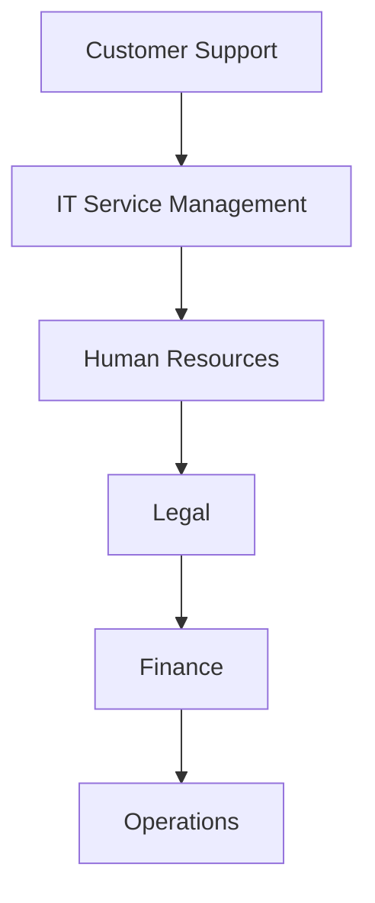
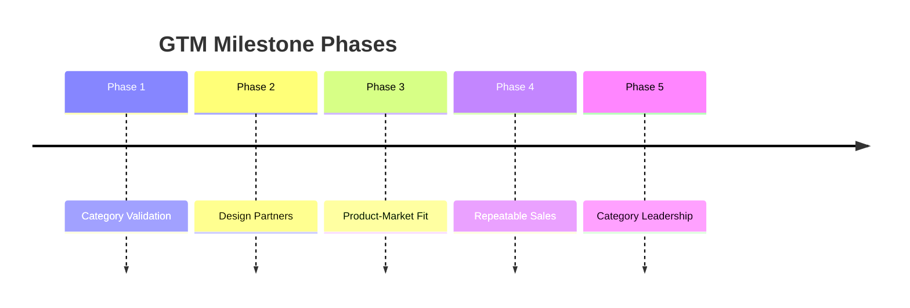

# Go-to-Market Strategy

## Derived From

Canon Version: `v1.0.0`

### Primary Canon Documents

- [Founder's Thesis](../canon/00_FOUNDERS_THESIS.md)
- [Product Vision](../canon/01_PRODUCT_VISION.md)
- [Product Principles](../canon/02_PRODUCT_PRINCIPLES.md)
- [Capability Model](../canon/03_PRODUCT_CAPABILITY_MODEL.md)
- [Domain Model](../canon/04_PRODUCT_DOMAIN_MODEL.md)
- [Workflow Model](../canon/05_PRODUCT_WORKFLOW_MODEL.md)
- [AI Cognitive Model](../canon/06_AI_COGNITIVE_MODEL.md)

### Primary Architecture Documents

- [System Architecture](../architecture/07_SYSTEM_ARCHITECTURE.md)
- [AI Agent Architecture](../architecture/08_AI_AGENT_ARCHITECTURE.md)
- [Data Architecture](../architecture/09_DATA_ARCHITECTURE.md)
- [Knowledge Representation](../architecture/10_KNOWLEDGE_REPRESENTATION_MODEL.md)
- [Integration Architecture](../architecture/11_INTEGRATION_ARCHITECTURE.md)

### Primary Implementation Documents

- [MVP Scope](../implementation/12_MVP_SCOPE.md)
- [Implementation Architecture](../implementation/13_IMPLEMENTATION_ARCHITECTURE.md)
- [Technology Decisions](../implementation/14_TECHNOLOGY_DECISIONS.md)
- [API Architecture](../implementation/15_API_ARCHITECTURE.md)
- [Storage Architecture](../implementation/16_STORAGE_ARCHITECTURE.md)
- [Deployment Architecture](../implementation/17_DEPLOYMENT_ARCHITECTURE.md)
- [Security Architecture](../implementation/18_SECURITY_ARCHITECTURE.md)

### Primary Strategy Documents

- [Category Design](./00_CATEGORY_DESIGN.md)
- [Positioning](./01_POSITIONING.md)
- [Ideal Customer Profile](./02_IDEAL_CUSTOMER_PROFILE.md)

---

Status: **Active**

## Primary Question

How will the company successfully introduce the Organizational Intelligence Platform to the market and achieve Product-Market Fit?

This document defines the Go-to-Market strategy.

It is not a sales playbook. It is not a marketing campaign. It is the strategic plan for entering and validating a brand-new software category.

## 1. Executive Summary

Creating a new category requires a different Go-to-Market strategy than selling an established SaaS product.

In an existing category, buyers already understand the problem, budget owner, evaluation criteria, alternatives, and expected outcomes. The vendor competes by proving why its product is better.

In a new category, the first task is different. The company must help the market see a problem that has been tolerated as normal. It must explain why existing categories do not fully solve that problem. It must prove that the new category produces measurable value. Only then can the company scale a repeatable sales motion.

For the Organizational Intelligence Platform category, the first GTM objective is not rapid distribution. It is credible category validation.

The early GTM strategy should emphasize:

- Education before scale.
- Trust before automation.
- Design partners before mass adoption.
- Measurable learning outcomes before broad expansion.
- Founder-led discovery before repeatable sales process.

The company should enter through Customer Support because support organizations experience high-volume repeated work, visible knowledge gaps, human review practices, historical case data, and measurable outcomes. This creates the fastest feedback loop for validating the Knowledge Flywheel.

## 2. GTM Philosophy

## Sell the Problem Before the Product

The company must first help customers understand Organizational Entropy: the way knowledge decays, fragments, and fails to become permanent capability.

If the buyer only sees a chatbot, knowledge base, or support tool, the category has not been understood. The sale begins when the buyer recognizes that repeated work should produce institutional learning.

## Educate Before Demonstrating

Product demonstrations should follow problem education.

The customer must understand why the platform exists before evaluating what it does. Education should clarify the difference between answering a question, automating a workflow, and compounding organizational knowledge.

## Validate Before Scaling

The company should not scale GTM before it has evidence that the target customer receives measurable value.

Validation should come from design partners, pilots, retention signals, knowledge reuse, executive sponsorship, and customer references.

## Build Trust Before Automation

The company should lead with governed learning, human review, evidence, validation, and explainability.

Automation can create value, but ungoverned automation creates risk. Early customers must believe the platform preserves trust before they allow it to influence important work.

## Win One Vertical Before Expanding

The first market is Customer Support.

Winning one vertical creates sharper messaging, clearer case studies, stronger product learning, more focused integrations, and a more credible path to Product-Market Fit.

## Founder-Led Learning

The first GTM motion should be founder-led because the company is still learning the category language, buyer objections, value metrics, implementation friction, and proof points.

Founder-led sales is not merely a way to close early revenue. It is a learning instrument.

## GTM Principle Matrix

| Principle | Strategic Meaning | Practical Implication |
| --- | --- | --- |
| Sell the Problem Before the Product | Buyers must understand Organizational Entropy. | Discovery starts with repeated learning loss, not features. |
| Educate Before Demonstrating | New categories require context. | Thought leadership and executive education precede demos. |
| Validate Before Scaling | PMF evidence matters more than pipeline volume. | Prioritize learning-rich customers over broad outreach. |
| Build Trust Before Automation | Enterprise AI adoption depends on confidence. | Emphasize review, validation, governance, and explainability. |
| Win One Vertical Before Expanding | Focus creates category proof. | Start with Customer Support. |
| Founder-Led Learning | Early GTM is category research. | Founders conduct discovery, demos, and executive conversations. |

## 3. Beachhead Market

Customer Support is the first market because it concentrates the conditions needed to prove the category.

## Why Now

Support teams face rising expectations for fast answers, consistent service, and AI-enabled efficiency. At the same time, many organizations distrust AI answers that are not grounded, reviewed, or governed.

This creates a timely opening: customers want AI leverage, but they need organizational trust.

## Why This Market

Customer Support has:

- High case volume.
- Repeated questions.
- Existing knowledge assets.
- Historical tickets and conversations.
- Human review and escalation practices.
- Clear operational metrics.
- Immediate pain from knowledge gaps.

Support organizations already feel the cost of Organizational Entropy. They repeatedly solve problems that should improve future work.

## Why It Creates the Fastest Feedback Loop

Support cases provide frequent observations, evidence, reasoning opportunities, human review, validation, and measurable reuse. This makes the Knowledge Flywheel visible faster than in lower-volume or less structured functions.

| Beachhead Requirement | Why Customer Support Fits |
| --- | --- |
| Repeated work | Similar questions and issues recur constantly. |
| Evidence | Tickets, chats, notes, articles, and resolutions already exist. |
| Human review | QA, escalation, and support experts already validate answers. |
| Measurable outcomes | Resolution time, escalation rate, satisfaction, and reuse can be tracked. |
| Expansion path | Support knowledge connects to product, IT, operations, training, and success. |

## 4. Ideal First Customers

The first 10 to 20 customers matter more for learning, credibility, and category proof than for rapid revenue.

They should be selected for their ability to validate the category thesis:

> Repeated operational work can become governed organizational memory that improves future work.

## First Customer Profile

| Attribute | Ideal First Customer |
| --- | --- |
| Company Profile | Mid-market to lower-enterprise B2B companies with complex support needs and recurring customer issues. |
| Organizational Maturity | Structured support operations, existing ticketing workflows, escalation paths, and some documentation practice. |
| AI Readiness | Actively exploring AI but concerned about trust, validation, governance, and customer risk. |
| Support Maturity | Support leaders track operational metrics and recognize knowledge reuse as a lever. |
| Leadership Mindset | Willing to partner, learn, measure outcomes, and help define a new category. |
| Data Availability | Historical tickets, knowledge articles, macros, chat transcripts, or case notes are accessible for analysis. |
| Review Culture | Experienced agents, support operations, QA, or knowledge managers can validate outputs. |

## Why These Customers Matter

Early customers should:

- Reveal the real language of the problem.
- Provide feedback on the Knowledge Flywheel.
- Validate measurable customer outcomes.
- Produce credible case studies.
- Expose integration and adoption friction.
- Become references for the category.
- Help separate must-have capabilities from interesting distractions.

Rapid revenue from poor-fit customers can damage category learning. A smaller set of high-fit design partners is more valuable than a larger set of customers who pull the company toward chatbot, help desk, or automation positioning.

## 5. Design Partner Strategy

The Design Partner program is the primary GTM vehicle before repeatable sales.

Design partners are not ordinary early customers. They are category collaborators who help validate the problem, product, language, outcomes, and adoption model.

## Objectives

The program should:

- Validate the Organizational Intelligence Platform category.
- Prove the Customer Support beachhead.
- Measure the Knowledge Flywheel in real work.
- Identify repeatable ROI patterns.
- Build early customer references.
- Improve product and onboarding based on real usage.
- Clarify buyer language and objections.

## Selection Criteria

| Criterion | Requirement |
| --- | --- |
| ICP Fit | Strong alignment with the Ideal Customer Profile. |
| Executive Sponsor | A support, CX, operations, or technology leader owns the initiative. |
| Data Access | Historical support data or knowledge artifacts are available. |
| Review Capacity | Experts can review, validate, and provide feedback. |
| Measurable Pain | The customer can identify repeated questions, knowledge gaps, or support scaling issues. |
| Strategic Openness | The customer is willing to co-design and discuss category-level learning. |
| Reference Potential | If successful, the customer could credibly explain the value to others. |

## Mutual Expectations

| Company Provides | Design Partner Provides |
| --- | --- |
| Focused onboarding and executive attention. | Access to relevant workflows, data, and subject matter experts. |
| Clear pilot goals and measurement plan. | Timely feedback and validation participation. |
| Product iteration based on observed needs. | Honest assessment of value and adoption friction. |
| Category education and strategic framing. | Willingness to evaluate the category thesis, not only features. |
| Support for internal success communication. | Potential reference or case study if outcomes are achieved. |

## Success Metrics

Design partner success should be judged by:

- Time to first organizational value.
- Repeated issue clusters identified.
- Learning candidates generated.
- Learning candidates validated.
- Knowledge reuse rate.
- Expert review participation.
- Improvement in support consistency.
- Executive confidence in governed AI.
- Expansion interest beyond the pilot scope.

## Feedback Loops

Design partner feedback should be structured around weekly operational feedback, monthly executive review, product usage analysis, knowledge quality review, and end-of-pilot category validation.

The goal is not only to improve the product. It is to learn how customers understand and buy the category.

## 6. Market Education Strategy

Category creation requires education because the market does not yet have a mature buying frame.

The company must teach:

- What Organizational Entropy is.
- Why existing categories do not fully solve it.
- Why AI alone is insufficient.
- What an Organizational Intelligence Platform is.
- Why Customer Support is the first proof point.
- How the Knowledge Flywheel creates compounding value.
- Why governance and human review are strategic, not optional.

## Education Channels

| Channel | Purpose |
| --- | --- |
| Founder Articles | Establish category language and explain the problem clearly. |
| Whitepapers | Provide rigorous analysis for executives, investors, and analysts. |
| Conference Talks | Create market awareness and credibility in AI, support, CX, and knowledge management communities. |
| Webinars | Educate target buyers through structured problem and solution framing. |
| Case Studies | Prove measurable outcomes from design partners and early customers. |
| Open Architecture Documents | Build technical credibility and show seriousness about trust, governance, and implementation discipline. |
| Thought Leadership | Move the market conversation from AI features to organizational learning. |

Market education should avoid hype. The strongest education will make buyers feel that the category is obvious once the problem is named.

## 7. Sales Motion

The initial sales motion should be founder-led, consultative, and discovery-first.

The company is not yet selling a fully understood category. It is helping customers recognize a strategic problem and evaluate whether they are ready to solve it.

## Initial Sales Model

| Motion | Role |
| --- | --- |
| Founder-Led Sales | Learn buyer language, objections, urgency, and category resonance directly. |
| Consultative Selling | Diagnose Organizational Entropy rather than pushing features. |
| Discovery-First Conversations | Understand support volume, knowledge gaps, review culture, and AI readiness. |
| ROI Workshops | Estimate value from reduced repeated work, faster onboarding, knowledge reuse, and expert leverage. |
| Executive Presentations | Frame the initiative as institutional capability, not a tool purchase. |
| Design Partner Conversion | Turn strong-fit prospects into structured learning partnerships. |

## Sales Evolution After Product-Market Fit

| Stage | Sales Motion |
| --- | --- |
| Pre-PMF | Founder-led discovery and design partner selection. |
| Early PMF | Founder-assisted sales with repeatable qualification and pilot structure. |
| Post-PMF | Dedicated sales team with category education assets and customer references. |
| Scale | Verticalized sales plays, partner channels, and expansion motions. |

The sales motion should evolve only after the company has repeatable evidence that a specific customer profile adopts, uses, retains, expands, and advocates.

## 8. Marketing Strategy

Marketing should build category understanding, trust, and credibility.

It should not rely on growth hacking, generic AI claims, or feature-led campaigns.

## Marketing Priorities

| Priority | Purpose |
| --- | --- |
| Content Marketing | Explain Organizational Entropy, the Knowledge Flywheel, and the category thesis. |
| Educational Content | Help buyers understand why existing categories are insufficient. |
| Technical Credibility | Show architectural seriousness around AI, governance, storage, APIs, and security. |
| Customer Stories | Prove measurable value through design partners and early adopters. |
| Community Building | Engage support leaders, knowledge managers, AI governance leaders, and operators. |
| Developer Trust | Demonstrate that the platform is not a thin AI wrapper. |
| AI Governance Thought Leadership | Position trust, review, validation, and explainability as central to enterprise AI. |

## Message Hierarchy

| Level | Message |
| --- | --- |
| Problem | Organizations repeatedly solve problems without becoming permanently smarter. |
| Category | Organizational Intelligence Platforms turn work into governed memory. |
| Mechanism | The Knowledge Flywheel converts evidence, reasoning, review, validation, and knowledge into memory. |
| Beachhead | Customer Support is the first market where the flywheel is frequent and measurable. |
| Outcome | Customers become more capable through every validated decision. |

## 9. Customer Adoption Journey

The customer journey should move from awareness to advocacy through education, discovery, validation, and measurable expansion.

## Journey Map

| Stage | Customer Question | Company Objective |
| --- | --- | --- |
| Awareness | Why do we keep relearning the same things? | Name Organizational Entropy. |
| Education | Why do existing tools not solve this? | Explain the OIP category and Knowledge Flywheel. |
| Discovery | Are we a fit? | Assess ICP fit, urgency, data, and review culture. |
| Design Partner | Can we shape this with you? | Establish mutual expectations and learning goals. |
| Pilot | Does this work in our environment? | Prove governed learning on real support workflows. |
| Validation | Did it create measurable value? | Measure reuse, trust, time to value, and executive confidence. |
| Expansion | Where else should this apply? | Expand to adjacent teams or workflows. |
| Advocacy | Can we tell this story? | Create credible category proof. |

## 10. Product-Market Fit Strategy

Product-Market Fit for an Organizational Intelligence Platform means customers not only adopt the product, but recognize it as a necessary system for institutional learning.

PMF should not be measured by vanity metrics such as demo volume, signups, or AI usage alone.

## PMF Indicators

| Indicator | Meaning |
| --- | --- |
| Customer Outcomes | Customers can identify specific support or knowledge improvements from the platform. |
| Retention | Customers continue using the platform because it becomes part of how they preserve learning. |
| Knowledge Reuse | Validated knowledge is reused in future cases or workflows. |
| Expansion | Customers expand from one team, workflow, or use case into adjacent areas. |
| User Engagement | Support experts, reviewers, and operators actively participate in review and validation. |
| Executive Sponsorship | Executives understand the platform as strategic capability, not experimental tooling. |
| Customer References | Customers can credibly explain the value to peers. |

## PMF Definition

The company reaches early Product-Market Fit when a focused segment of Customer Support organizations repeatedly adopts the platform, validates knowledge from real work, reuses that knowledge, retains the platform, expands usage, and advocates for the category because they believe it makes the organization more capable.

## 11. Success Metrics

GTM metrics should reflect category validation, customer value, and repeatability.

| Metric | Why It Matters |
| --- | --- |
| Design Partners Signed | Measures ability to recruit qualified early collaborators. |
| Pilot Success Rate | Measures whether the product and process create value in the ICP. |
| Time to First Organizational Value | Measures how quickly the customer sees reusable learning. |
| Knowledge Reuse Rate | Measures whether validated knowledge improves future work. |
| Learning Candidate Validation Rate | Measures whether the flywheel produces useful learning. |
| Expansion Rate | Measures whether value extends beyond the first workflow. |
| Customer Retention | Measures durability of value. |
| Reference Customers | Measures credibility and category proof. |
| Net Revenue Retention | Measures account expansion and long-term value after PMF. |
| PMF Indicators | Measures pull, urgency, retention, expansion, and advocacy. |

## Metric Discipline

The company should avoid overvaluing:

- Raw AI interactions.
- Website traffic without buyer education.
- Pilot count without pilot success.
- Pipeline volume outside the ICP.
- Feature requests from poor-fit customers.

The best metrics show that organizational learning is happening and that customers value it enough to continue, expand, and advocate.

## 12. Expansion Strategy

Expansion should follow the natural spread of Organizational Entropy across functions.

## Expansion Sequence

| Sequence | Market | Why It Follows |
| --- | --- | --- |
| 1 | Customer Support | Repetition, rich case history, human review, and measurable ROI. |
| 2 | IT Service Management | Incidents, fixes, runbooks, and operational learning mirror support workflows. |
| 3 | Human Resources | Policy interpretation, employee cases, onboarding, and manager guidance depend on memory. |
| 4 | Legal | Precedent, risk review, evidence, and approval workflows require governed knowledge. |
| 5 | Finance | Exceptions, controls, approvals, and policy interpretation require traceable memory. |
| 6 | Operations | Process exceptions, vendor issues, quality decisions, and repeated coordination create learning loops. |

The company should expand only when the beachhead has produced repeatable proof. Expansion without proof risks diluting the category and pulling the product toward generic workflow or AI tooling.

## 13. GTM Risks

| Risk | Consequence | Mitigation |
| --- | --- | --- |
| Being Perceived as a Chatbot | The company is compared to interchangeable AI assistants. | Lead with Organizational Entropy, Knowledge Flywheel, governance, and memory. |
| Selling AI Instead of Organizational Intelligence | Buyers evaluate model novelty rather than institutional capability. | Position AI as an amplifier, not the category. |
| Expanding Too Early | Messaging, product, and sales learning become diluted. | Win Customer Support first. |
| Weak Customer Education | Buyers misunderstand the problem and evaluate the wrong alternatives. | Invest in founder-led thought leadership and executive education. |
| Poor Design Partner Selection | Early learning becomes noisy or misleading. | Use the ICP scorecard and require review culture, data, and urgency. |
| Chasing Unsuitable Customers | Product gets pulled toward custom services or weak-fit use cases. | Maintain Anti-ICP discipline. |
| Over-Customization | The company becomes a consulting project instead of a category platform. | Separate learning from customer-specific build commitments. |
| Trust Gap | Customers hesitate to let AI influence knowledge. | Emphasize human review, validation, evidence, audit, and governance. |
| Feature-First Selling | The company sounds like a point solution. | Sell the transformation from repeated work to institutional learning. |

## 14. Strategic Milestones

## Milestone Timeline

| Phase | Objective | Evidence of Progress |
| --- | --- | --- |
| Phase 1: Category Validation | Prove that buyers recognize Organizational Entropy and understand the OIP category. | Strong discovery resonance, executive interest, clear problem language. |
| Phase 2: Design Partners | Recruit high-fit customers to validate workflows, outcomes, and positioning. | 10-20 qualified design partners or pilots with structured feedback. |
| Phase 3: Product-Market Fit | Prove repeatable value in Customer Support. | Retention, reuse, validation, expansion, references, executive sponsorship. |
| Phase 4: Repeatable Sales | Turn founder-led learning into a repeatable GTM process. | Repeatable qualification, sales materials, ROI model, and pilot-to-paid conversion. |
| Phase 5: Category Leadership | Become recognized as a defining company for Organizational Intelligence Platforms. | Analyst interest, customer advocacy, thought leadership, expanding ecosystem. |

## 15. Traceability Matrix

| Canon Concept | GTM Expression |
| --- | --- |
| Organizational Intelligence | Category education and executive transformation narrative. |
| Knowledge Flywheel | Customer value proposition and pilot success mechanism. |
| Human Review | Trust-building through design partners, validation workflows, and expert participation. |
| Organizational Memory | Core ROI: support work becomes durable capability. |
| Governance | Enterprise credibility through trust, explainability, audit, and policy alignment. |
| Learning | PMF measured by knowledge reuse, validation, retention, and expansion. |
| Evidence | Customer support cases and historical records provide the first learning substrate. |
| AI Cognitive Model | AI is sold as an amplifier of governed learning, not as authority. |
| Category Design | GTM starts by naming Organizational Entropy and defining OIP as the category. |
| Positioning | Messaging avoids chatbot, help desk, and automation traps. |
| Ideal Customer Profile | Early GTM focuses on high-fit Customer Support organizations. |
| MVP Scope | GTM validates one complete Knowledge Flywheel before scaling. |

## 16. What This Document Does NOT Define

This document intentionally excludes:

- Pricing.
- Sales compensation.
- Detailed marketing campaigns.
- Feature roadmap.
- Product implementation.
- Operational sales processes.
- Sales scripts.
- Quota design.
- Channel partner terms.
- Customer success runbooks.

These belong in separate strategy, go-to-market operations, sales, product, roadmap, or implementation documents.

## 17. Closing

Creating a new category is fundamentally different from selling into an existing one.

The company's first objective is not rapid growth.

It is establishing credibility, validating the Organizational Intelligence Platform category, proving measurable customer outcomes, and creating reference customers that demonstrate the compounding value of organizational learning.

The GTM strategy should remain patient where the category requires education and disciplined where the market offers tempting distractions.

The company should scale only after it can repeatedly show that high-fit customers understand the problem, adopt the platform, validate knowledge through real work, reuse that knowledge, and believe the organization is becoming more capable because of it.
