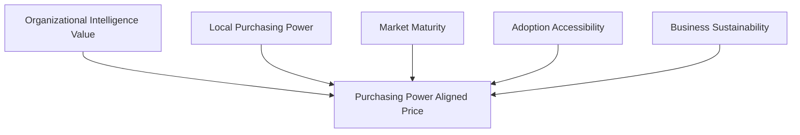
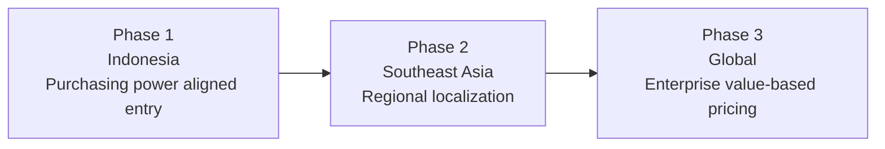
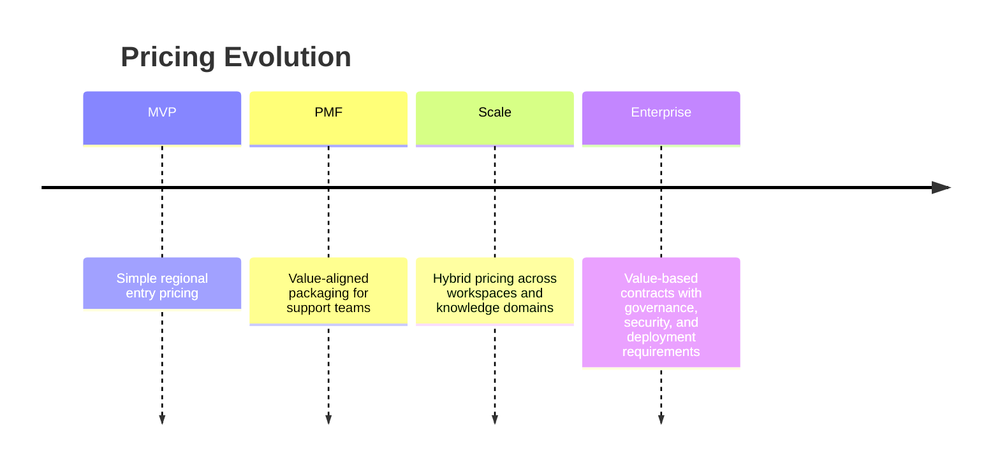
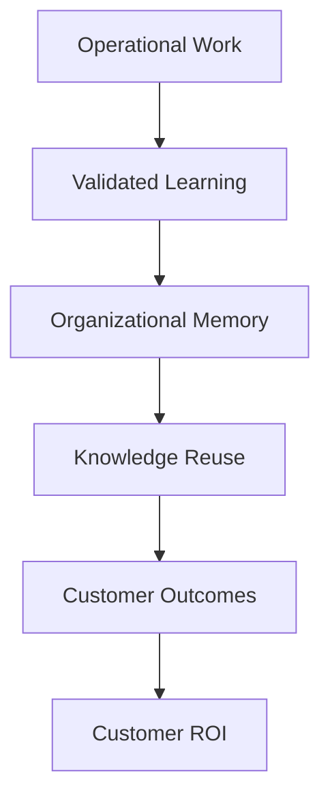

# Pricing Strategy

## Derived From

Canon Version: `v1.0.0`

### Primary Canon Documents

- [Founder's Thesis](../canon/00_FOUNDERS_THESIS.md)
- [Product Vision](../canon/01_PRODUCT_VISION.md)
- [Product Principles](../canon/02_PRODUCT_PRINCIPLES.md)
- [Capability Model](../canon/03_PRODUCT_CAPABILITY_MODEL.md)
- [Domain Model](../canon/04_PRODUCT_DOMAIN_MODEL.md)
- [Workflow Model](../canon/05_PRODUCT_WORKFLOW_MODEL.md)
- [AI Cognitive Model](../canon/06_AI_COGNITIVE_MODEL.md)

### Primary Architecture Documents

- [System Architecture](../architecture/07_SYSTEM_ARCHITECTURE.md)
- [AI Agent Architecture](../architecture/08_AI_AGENT_ARCHITECTURE.md)
- [Data Architecture](../architecture/09_DATA_ARCHITECTURE.md)
- [Knowledge Representation](../architecture/10_KNOWLEDGE_REPRESENTATION_MODEL.md)
- [Integration Architecture](../architecture/11_INTEGRATION_ARCHITECTURE.md)

### Primary Implementation Documents

- [MVP Scope](../implementation/12_MVP_SCOPE.md)
- [Implementation Architecture](../implementation/13_IMPLEMENTATION_ARCHITECTURE.md)
- [Technology Decisions](../implementation/14_TECHNOLOGY_DECISIONS.md)
- [API Architecture](../implementation/15_API_ARCHITECTURE.md)
- [Storage Architecture](../implementation/16_STORAGE_ARCHITECTURE.md)
- [Deployment Architecture](../implementation/17_DEPLOYMENT_ARCHITECTURE.md)
- [Security Architecture](../implementation/18_SECURITY_ARCHITECTURE.md)

### Primary Strategy Documents

- [Category Design](./00_CATEGORY_DESIGN.md)
- [Positioning](./01_POSITIONING.md)
- [Ideal Customer Profile](./02_IDEAL_CUSTOMER_PROFILE.md)
- [Go-to-Market Strategy](./03_GO_TO_MARKET.md)

---

Status: **Active**

## Primary Question

How should the Organizational Intelligence Platform create sustainable, scalable, and globally adaptable revenue while remaining accessible to its initial market?

This document defines the Pricing Strategy.

It is not a pricing table. It is not a sales proposal. It defines the philosophy and long-term monetization strategy of the platform.

## 1. Executive Summary

Pricing is a strategic expression of value, not merely a calculation of infrastructure cost.

For an Organizational Intelligence Platform, the value being created is not the delivery of AI responses, storage capacity, or software access alone. The strategic value is the customer's increasing institutional capability: better knowledge reuse, reduced expert dependency, improved support consistency, governed learning, durable organizational memory, and trusted AI-assisted work.

The pricing strategy should therefore reinforce the company's category position.

The company should not price itself like an AI utility, chatbot, or token consumption layer. It should price in a way that communicates:

- The platform creates organizational capability.
- Value compounds as validated work becomes memory.
- Governance, trust, and explainability are premium enterprise capabilities.
- Entry should remain accessible for the initial market.
- Pricing should scale as customer value grows.
- Regional affordability can accelerate adoption without weakening long-term positioning.

The long-term pricing ambition is value-based, globally adaptable, and enterprise credible. The early pricing posture should be simple, accessible, and aligned with Indonesia-first adoption.

## 2. Pricing Philosophy

## Price Organizational Capability, Not AI Consumption

The platform should not be primarily priced around AI tokens, model calls, or raw compute consumption.

AI consumption is an input cost. Organizational capability is the customer outcome. Pricing around AI usage risks positioning the company as an AI tool rather than an Organizational Intelligence Platform.

## Price Customer Outcomes, Not Infrastructure

Customers do not buy infrastructure. They buy faster learning, better support quality, reduced repeated work, preserved expertise, and trusted memory.

Infrastructure costs matter for margin management, but they should not define the pricing story.

## Align Pricing with Customer Value

Pricing should scale with the customer's realized and potential value.

Organizations with more users, work volume, knowledge domains, governance needs, integrations, and enterprise requirements receive more value and should pay more.

## Keep Entry Barriers Low

Early adoption requires accessible entry.

The first market needs enough affordability to allow design partners, mid-market companies, and Indonesia-based organizations to validate value without enterprise procurement friction that is disproportionate to the MVP stage.

## Scale Pricing as Organizational Value Grows

Pricing should grow as the platform becomes more deeply embedded in the customer's organizational learning system.

Expansion may reflect additional workspaces, knowledge domains, organizational units, integrations, governance controls, review workflows, or enterprise deployment requirements.

## Maintain Long-Term Trust

Pricing should feel understandable, fair, and aligned with value.

Unexpected usage spikes, opaque AI cost pass-through, punitive overages, or aggressive discounting can damage trust. Because the platform is positioned around governance and institutional trust, pricing behavior must reinforce that same trust.

## Pricing Philosophy Matrix

| Principle | Strategic Meaning | Pricing Implication |
| --- | --- | --- |
| Price Organizational Capability | Value is institutional learning, not AI usage. | Avoid token-led positioning. |
| Price Customer Outcomes | Customers pay for business and knowledge value. | Tie plans to capability, governance, and scale. |
| Align with Customer Value | Larger value should support larger pricing. | Scale with organization, domains, usage bands, and enterprise needs. |
| Keep Entry Barriers Low | Early markets need accessible adoption. | Use simple entry tiers and regional affordability. |
| Scale with Organizational Value | Expansion follows deeper platform adoption. | Monetize additional teams, domains, governance, and integrations. |
| Maintain Long-Term Trust | Pricing should reinforce category credibility. | Avoid opaque or adversarial pricing mechanics. |

## 3. Purchasing Power Aligned Pricing

The company should adopt **Purchasing Power Aligned Pricing** as a core pricing philosophy.

Purchasing Power Aligned Pricing means pricing should reflect the economic reality of the market where the customer operates while preserving the long-term value position of the category.

## Why Purchasing Power Matters

Different countries have different purchasing power. A single global price may be reasonable for mature enterprise software markets and unintentionally exclusionary in emerging markets.

For a category that depends on customer learning, design partners, market education, and early adoption, inaccessible pricing can prevent the company from reaching the organizations most ready to validate the product.

## Regional Pricing Is Not a Discount

Regional pricing should not be treated as a temporary concession or a weakening of value.

It is a strategic decision that recognizes:

- Early adoption depends on local affordability.
- Market maturity differs by region.
- Customer willingness to pay develops as category understanding improves.
- Sustainable revenue must be balanced with adoption density.
- Local market proof can create global credibility over time.

## Indonesia-First Pricing Logic

Indonesia is the first market because it offers a practical and strategic starting point: growing digital adoption, support-intensive businesses, increasing AI interest, and local economic realities that reward accessible pricing.

Pricing for Indonesia should reflect:

- Local purchasing power.
- The need to build trust in a new category.
- The importance of early customer references.
- The maturity of local enterprise software budgets.
- The strategic value of adoption density.

The company should not simply import mature-market SaaS pricing into Indonesia. Doing so could slow adoption, narrow the customer base, and misread the early category-building task.

## Purchasing Power Framework

## 4. Market Expansion Pricing

Pricing should evolve with market expansion.

The company should begin with Indonesia-first regional pricing, expand into Southeast Asia with localized packaging, and eventually develop global enterprise pricing as the category matures.

## Expansion Pricing Phases

| Phase | Market | Pricing Orientation | Strategic Goal |
| --- | --- | --- | --- |
| Phase 1 | Indonesia | Accessible, locally aligned, simple packaging. | Validate category, earn trust, build references, prove value. |
| Phase 2 | Southeast Asia | Regional price localization with clearer segmentation. | Expand adoption while respecting different purchasing power levels. |
| Phase 3 | Global | Enterprise value-based pricing with regional adaptation. | Monetize organizational capability at scale while maintaining fairness. |

## From Localization to Enterprise Pricing

Localization should gradually evolve into enterprise pricing as the company gains:

- Stronger product-market fit.
- Better ROI evidence.
- Mature customer references.
- Deeper governance capabilities.
- Enterprise integrations.
- Security and compliance credibility.
- Multi-team expansion patterns.

The company should not rush enterprise pricing before the market understands the category and customers can measure value.

## 5. Pricing Metrics

The pricing metric should align with Organizational Intelligence rather than raw AI activity.

No single metric is perfect. The likely long-term model is hybrid pricing that combines organizational scope, platform access, value scale, and enterprise capability.

## Pricing Model Comparison

| Model | Advantages | Disadvantages | Fit with Organizational Intelligence |
| --- | --- | --- | --- |
| Per User | Familiar, easy to understand, scales with adoption. | Can discourage broad organizational usage and knowledge contribution. | Useful as one component, but not ideal as the sole metric. |
| Per Seat | Similar to per user; works for named employees or reviewers. | Can penalize collaboration and cross-functional learning. | Good for controlled access tiers, weak for memory value alone. |
| Per Workspace | Aligns with teams, departments, or organizational units. | Workspace boundaries may not reflect true value or usage. | Strong for expansion from Support into IT, HR, Legal, and Operations. |
| Per Organization | Simple and category-aligned at high level. | May underprice large customers or overprice small ones. | Useful for entry packaging or enterprise contracts. |
| Per Knowledge Domain | Aligns with areas of organizational memory and governance. | Requires customers to understand and manage domain boundaries. | Strong long-term fit because value accrues by knowledge area. |
| Per Active Case | Connects to work volume and support ROI. | May make customers worry about usage penalties during high-volume periods. | Useful for support beachhead if packaged in bands rather than strict metering. |
| Usage-Based | Scales with actual activity and cost. | Risks positioning around consumption and creating unpredictability. | Should be used carefully for fair-use boundaries, not core value story. |
| Hybrid Pricing | Balances access, value scale, and enterprise requirements. | More complex to explain if introduced too early. | Best long-term fit when kept simple and transparent. |

## Recommended Direction

The best pricing direction is a staged hybrid model:

1. Early stage: simple organization or workspace-based pricing with regional affordability.
2. Beachhead growth: workspace plus usage bands tied to support volume or active cases.
3. Enterprise maturity: hybrid pricing based on workspaces, knowledge domains, governance controls, integrations, deployment needs, and enterprise support.

The company should avoid making AI consumption the main pricing metric. AI costs may inform internal margins or fair-use policies, but the customer should understand that they are paying for organizational memory and governed learning.

## 6. Pricing Tiers

Pricing tiers should communicate maturity, capability, and customer fit. They should not be arbitrary feature bundles.

This document does not assign prices.

| Tier | Purpose | Intended Customer |
| --- | --- | --- |
| Starter | Provide accessible entry for small teams validating the Knowledge Flywheel. | Early teams with structured support work but limited budget or scope. |
| Growth | Support expanding teams that need more knowledge reuse, review workflows, and operational value. | Growing support organizations with recurring customer issues and adoption momentum. |
| Professional | Provide deeper governance, collaboration, reporting, and integration capabilities. | Mature support or service teams that treat knowledge as an operational asset. |
| Enterprise | Support large deployments requiring advanced security, governance, integrations, administration, and support. | Larger organizations with multi-team, multi-domain, or compliance-sensitive needs. |
| Government | Support public-sector or regulated institutional needs with procurement, governance, and deployment requirements. | Government or public institutions requiring trust, auditability, and policy alignment. |

## Tiering Philosophy

Tiers should scale by:

- Organizational scope.
- Knowledge domain complexity.
- Governance requirements.
- Integration depth.
- Security and administration needs.
- Support and deployment expectations.
- Measurement and reporting sophistication.

Tiers should not withhold the core category promise from early customers. Even entry-level plans should preserve the idea that work can become governed memory.

## 7. Value Drivers

Customers pay for the value the platform creates, not for the cost inputs that deliver it.

| Value Driver | Why It Matters |
| --- | --- |
| Organizational Memory | The core asset that preserves validated learning over time. |
| Knowledge Reuse | Reduces repeated effort and improves consistency. |
| Human Review | Builds trust and prevents unvalidated AI outputs from becoming authority. |
| Governance | Enables enterprise credibility, approval, audit, and policy alignment. |
| Explainability | Helps customers understand why knowledge, decisions, or recommendations can be trusted. |
| Security | Protects sensitive knowledge, evidence, memory, and organizational trust. |
| Collaboration | Allows experts, reviewers, and teams to improve knowledge together. |
| Integrations | Connects the platform to existing systems of work and evidence. |
| Enterprise Controls | Supports larger organizations with administration, compliance, and operational confidence. |

## Value Matrix

| Customer Value | Pricing Should Reflect |
| --- | --- |
| Less repeated work | Support volume, knowledge reuse, and workflow adoption. |
| Better onboarding | Access to memory, review history, and validated knowledge. |
| Reduced expert dependency | Human review workflows and expert knowledge capture. |
| Improved consistency | Governed knowledge reuse and validation controls. |
| Trusted AI adoption | Explainability, audit, and human approval capabilities. |
| Strategic organizational learning | Memory, knowledge domains, governance, and expansion. |

AI token counts are not a value driver. They are a delivery input.

## 8. Pricing Evolution

Pricing should evolve as the company matures.

## Evolution Stages

| Stage | Pricing Objective | Characteristics |
| --- | --- | --- |
| MVP | Reduce friction and validate willingness to pay. | Simple, accessible, regional, design-partner friendly. |
| PMF | Align packaging with proven customer outcomes. | Tied to support value, knowledge reuse, and expansion readiness. |
| Scale | Support repeatable GTM and multi-team growth. | Clear tiers, usage bands, workspaces, and domain expansion. |
| Enterprise | Reflect strategic value and complex requirements. | Enterprise contracts, governance, integrations, security, compliance, and support. |

Pricing sophistication should increase over time because customer value becomes clearer over time. Early pricing should preserve learning. Mature pricing should capture value.

## 9. Customer ROI Framework

Customers evaluate ROI by comparing the cost of the platform against the value of preserved organizational learning.

## ROI Sources

| ROI Source | Customer Value |
| --- | --- |
| Reduced Onboarding Time | New employees learn from preserved memory, validated answers, and decision history. |
| Faster Case Resolution | Support teams reuse trusted knowledge instead of rediscovering answers. |
| Increased Knowledge Reuse | Repeated problems create less repeated effort. |
| Reduced Expert Dependency | Senior experts spend less time answering the same questions and more time validating new knowledge. |
| Improved Consistency | Customers receive more reliable answers across agents and channels. |
| Organizational Learning | Each validated decision can improve future decisions. |
| Better Governance | Leaders trust AI-assisted knowledge because it is reviewed, validated, and auditable. |

## ROI Framework

ROI should be framed in terms of capability improvement, not only cost reduction.

## 10. Enterprise Pricing

Enterprise pricing should reflect complexity, risk, governance, and strategic value.

Enterprise customers may require:

- Volume agreements.
- Multi-workspace deployments.
- Dedicated support.
- Compliance requirements.
- Private deployment options.
- Enterprise governance.
- Advanced integrations.
- Advanced administration.
- Security review.
- Custom retention or data handling requirements.
- Executive reporting.

## Enterprise Pricing Considerations

| Consideration | Pricing Implication |
| --- | --- |
| Volume Agreements | Larger commitments may justify structured commercial terms. |
| Multi-Workspace Deployments | Pricing should scale with organizational spread and knowledge domains. |
| Dedicated Support | Higher-touch success and support should be reflected in enterprise packaging. |
| Compliance | Compliance-sensitive customers require stronger governance and assurance. |
| Private Deployment | Specialized deployment expectations may require enterprise terms. |
| Enterprise Governance | Advanced approval, audit, policy, and administrative controls create premium value. |
| Advanced Integrations | More integrations increase value and operational complexity. |

Enterprise pricing should remain conceptual until the company has enough evidence to understand which requirements are standard, which are premium, and which are customer-specific.

## 11. Pricing Risks

| Risk | Consequence | Mitigation |
| --- | --- | --- |
| Pricing Too High for Emerging Markets | Slower adoption, weaker design partner pipeline, and reduced category learning. | Use Purchasing Power Aligned Pricing and Indonesia-first affordability. |
| Competing Only on Price | Weakens category positioning and attracts poor-fit customers. | Anchor pricing in organizational capability and trust. |
| Pricing Based on AI Costs | Positions the company as an AI utility rather than an OIP. | Treat AI usage as internal cost management, not primary value metric. |
| Overly Complex Pricing | Confuses early buyers and slows adoption. | Start simple, then increase sophistication after PMF. |
| Misaligned Incentives | Customers avoid using the platform if pricing penalizes learning activity. | Avoid pricing that discourages knowledge contribution, review, or reuse. |
| Regional Arbitrage | Customers may attempt to access lower regional prices outside intended markets. | Use clear regional eligibility, contracting, and account governance. |
| Excessive Discounting | Trains customers to wait for concessions and weakens perceived value. | Separate regional strategy from ad hoc discounting. |
| Underpricing Enterprise Complexity | Large customers may consume high support and governance resources without sustainable revenue. | Introduce enterprise tiers and custom terms when requirements increase. |

## Pricing Risk Principle

Pricing should make adoption easier without making the category seem cheap.

The company should be accessible in its first market and ambitious in its long-term value capture.

## 12. Long-Term Pricing Vision

As Organizational Intelligence becomes a strategic enterprise capability, pricing should increasingly reflect the long-term business value created rather than the operational cost of delivering AI responses.

In the long term, customers should understand that they are paying for:

- The preservation of organizational memory.
- The compounding of validated knowledge.
- The governance of AI-assisted learning.
- The reduction of repeated institutional work.
- The ability to trust and explain what the organization knows.
- The integration of learning across departments and systems.

The pricing model should evolve toward value-based enterprise pricing while preserving regional accessibility and fairness.

The strongest long-term pricing position is not "pay us for usage."

It is:

> Pay for the platform that helps your organization become more capable over time.

## 13. Traceability Matrix

| Canon Concept | Pricing Expression |
| --- | --- |
| Organizational Intelligence | Value-based pricing around institutional capability. |
| Knowledge Flywheel | Long-term customer value increases as validated work compounds. |
| Human Review | Premium enterprise capability through validation, trust, and expert workflows. |
| Governance | Enterprise differentiation through approval, audit, policy, and accountability. |
| Organizational Memory | Core value driver and long-term monetization anchor. |
| Learning | Pricing scales as customers capture and reuse more learning. |
| Evidence | Enterprise value increases with explainable, trusted, source-linked knowledge. |
| AI Cognitive Model | AI is an enabling cost and capability, not the primary pricing unit. |
| Category Design | Pricing reinforces OIP positioning rather than chatbot or AI utility positioning. |
| Positioning | Pricing communicates capability, trust, and long-term organizational value. |
| ICP | Indonesia-first and mid-market support teams require accessible entry. |
| GTM Strategy | Design partners and PMF require simple, trust-building pricing before scale. |

## 14. What This Document Does NOT Define

This document intentionally excludes:

- Exact subscription prices.
- Promotional discounts.
- Sales negotiations.
- Taxation.
- Billing implementation.
- Payment gateways.
- Revenue recognition.
- Contract templates.
- Commission plans.
- Procurement process.

These belong to commercial operations, finance, sales operations, legal, or implementation documentation.

## 15. Closing

The company's pricing strategy should reinforce its identity as an Organizational Intelligence Platform.

The goal is not to monetize AI usage.

The goal is to capture a fair share of the long-term value created as organizations become progressively more capable through governed learning.

Regional affordability, especially during the Indonesia-first phase, should accelerate adoption without compromising the company's long-term global positioning.

The right pricing strategy will allow the company to begin locally, learn quickly, expand sustainably, and eventually price according to the strategic enterprise value of Organizational Intelligence.
