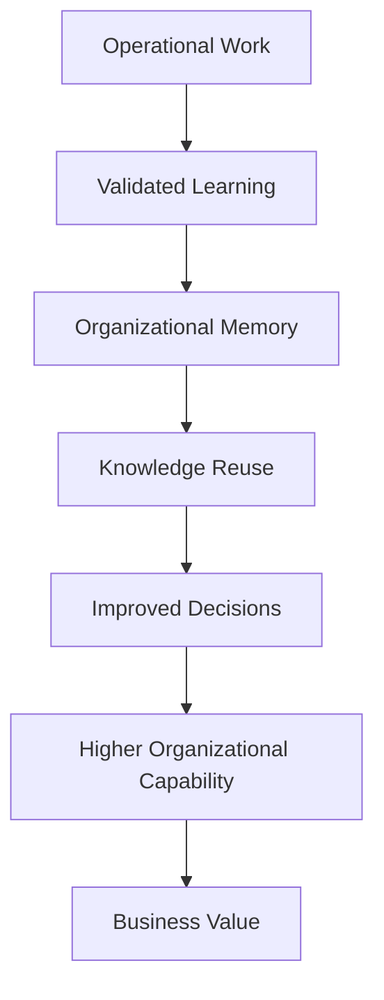
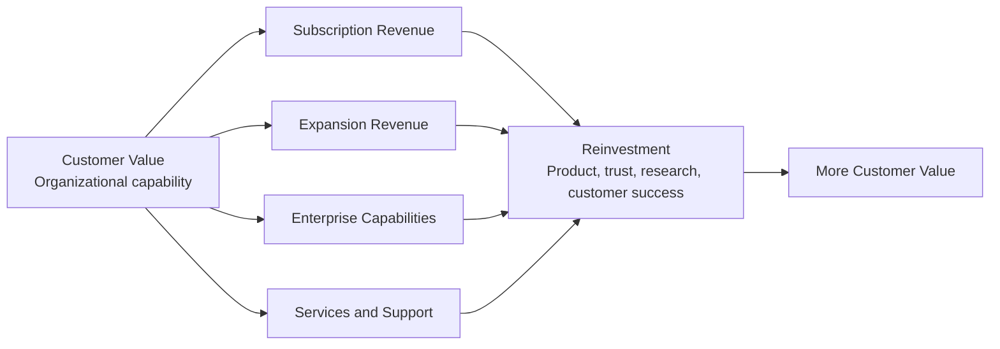
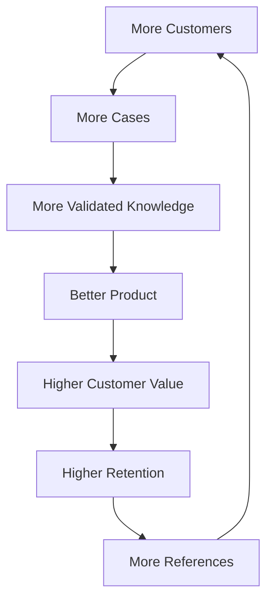
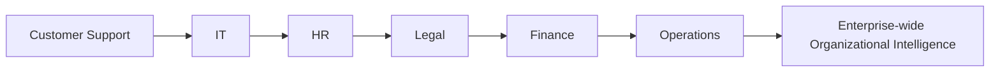
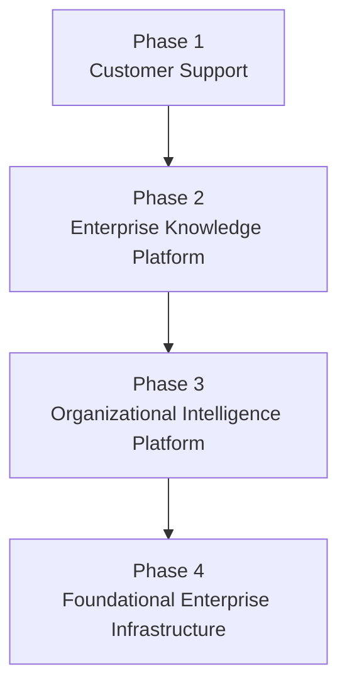

# Business Model

## Derived From

Canon Version: `v1.0.0`

### Primary Canon Documents

- [Founder's Thesis](../canon/00_FOUNDERS_THESIS.md)
- [Product Vision](../canon/01_PRODUCT_VISION.md)
- [Product Principles](../canon/02_PRODUCT_PRINCIPLES.md)
- [Capability Model](../canon/03_PRODUCT_CAPABILITY_MODEL.md)
- [Domain Model](../canon/04_PRODUCT_DOMAIN_MODEL.md)
- [Workflow Model](../canon/05_PRODUCT_WORKFLOW_MODEL.md)
- [AI Cognitive Model](../canon/06_AI_COGNITIVE_MODEL.md)

### Primary Architecture Documents

- [System Architecture](../architecture/07_SYSTEM_ARCHITECTURE.md)
- [AI Agent Architecture](../architecture/08_AI_AGENT_ARCHITECTURE.md)
- [Data Architecture](../architecture/09_DATA_ARCHITECTURE.md)
- [Knowledge Representation](../architecture/10_KNOWLEDGE_REPRESENTATION_MODEL.md)
- [Integration Architecture](../architecture/11_INTEGRATION_ARCHITECTURE.md)

### Primary Implementation Documents

- [MVP Scope](../implementation/12_MVP_SCOPE.md)
- [Implementation Architecture](../implementation/13_IMPLEMENTATION_ARCHITECTURE.md)
- [Technology Decisions](../implementation/14_TECHNOLOGY_DECISIONS.md)
- [API Architecture](../implementation/15_API_ARCHITECTURE.md)
- [Storage Architecture](../implementation/16_STORAGE_ARCHITECTURE.md)
- [Deployment Architecture](../implementation/17_DEPLOYMENT_ARCHITECTURE.md)
- [Security Architecture](../implementation/18_SECURITY_ARCHITECTURE.md)

### Primary Strategy Documents

- [Category Design](./00_CATEGORY_DESIGN.md)
- [Positioning](./01_POSITIONING.md)
- [Ideal Customer Profile](./02_IDEAL_CUSTOMER_PROFILE.md)
- [Go-to-Market Strategy](./03_GO_TO_MARKET.md)
- [Pricing Strategy](./04_PRICING_STRATEGY.md)

---

Status: **Active**

## Primary Question

How does the company create, deliver, and capture value as an Organizational Intelligence Platform?

This document defines the Business Model.

It is not a financial forecast. It is not an accounting document. It is not a startup pitch deck. It defines the long-term economic architecture of the company.

## 1. Executive Summary

The company's business model is built around helping organizations continuously increase institutional capability through governed learning.

The platform does not monetize AI itself. It monetizes long-term organizational value.

The customer does not pay because the platform can generate answers, process tickets, store documents, or call language models. Those capabilities may be necessary, but they are not the economic center of the business. The customer pays because the platform helps the organization preserve knowledge, reuse expertise, reduce repeated learning, govern AI-assisted work, and build durable organizational memory.

The business model is therefore aligned with the category thesis:

> Traditional software helps organizations perform work. An Organizational Intelligence Platform helps organizations become more capable through work.

The company creates value by transforming operational work into validated learning. It delivers value through workflows, governance, memory, AI-assisted reasoning, human validation, integrations, and explainability. It captures value through recurring revenue that scales as customers adopt the platform across more teams, knowledge domains, governance needs, and enterprise contexts.

The business becomes stronger as customers succeed because successful customers accumulate more validated knowledge, trust the platform more deeply, expand into additional domains, and become references for the category.

## 2. Business Model Philosophy

## Value Creation Before Value Capture

The company should create clear customer value before optimizing monetization complexity.

In a new category, early trust matters more than short-term extraction. Customers must first experience that the platform makes their organization more capable. Value capture should follow credible proof of value.

## Long-Term Customer Success

The business model should reward customer success over short-term usage.

If customers reuse knowledge, reduce repeated work, trust AI-assisted learning, and expand organizational memory, the platform becomes more valuable. Revenue should grow because customers become more successful, not because they are trapped by friction.

## Compounding Organizational Intelligence

The company's economic engine is the compounding of Organizational Intelligence.

Each validated learning loop can improve future work. As customers accumulate knowledge, memory, governance history, and trust, the value of the platform increases.

## Sustainable Revenue

Revenue must support a durable company that can invest in product, security, research, customer success, governance capabilities, and global expansion.

Sustainable revenue is not the same as maximizing early price. It means building a model where value creation, customer affordability, gross margin, retention, and expansion can coexist.

## Trust Creates Retention

Customers will retain the platform when they trust it with institutional knowledge.

Trust comes from evidence, human review, explainability, security, governance, and reliable operation. In this category, trust is not only a product attribute. It is a retention mechanism.

## Customer Learning Drives Expansion

Expansion should happen because customers see that the Knowledge Flywheel works.

When Customer Support improves through governed learning, adjacent teams can ask whether the same mechanism applies to IT, HR, Legal, Finance, or Operations. Expansion is strongest when driven by demonstrated learning, not sales pressure.

## Business Philosophy Matrix

| Principle | Business Meaning | Strategic Implication |
| --- | --- | --- |
| Value Creation Before Value Capture | Prove customer value before optimizing monetization. | Early design partners and PMF matter more than aggressive extraction. |
| Long-Term Customer Success | The company wins when customers become more capable. | Retention and expansion should reflect real outcomes. |
| Compounding Organizational Intelligence | Knowledge value grows with validated use. | The business improves as customer memory deepens. |
| Sustainable Revenue | The company must fund trust, security, product, and growth. | Pricing must balance accessibility and long-term viability. |
| Trust Creates Retention | Customers stay when the platform becomes trusted memory. | Security, governance, audit, and explainability are economic assets. |
| Customer Learning Drives Expansion | Expansion follows proven learning loops. | Land in Support, then expand where entropy is visible. |

## 3. Value Creation Model

The platform creates value by converting operational work into organizational capability.

## Value Creation Stages

| Stage | Value Created |
| --- | --- |
| Operational Work | Real customer, support, service, or internal work produces evidence and context. |
| Validated Learning | Human review and governance separate reusable learning from noise. |
| Organizational Memory | Validated knowledge becomes durable, versioned, and explainable. |
| Knowledge Reuse | Future teams reuse trusted knowledge rather than rediscovering answers. |
| Improved Decisions | Decisions become faster, more consistent, and better grounded. |
| Higher Organizational Capability | The organization becomes less dependent on individual memory and repeated effort. |
| Business Value | Customers experience operational, financial, strategic, and human benefits. |

The value creation model is not based on replacing humans. It is based on preserving and scaling the learning produced by humans and AI working under governance.

## 4. Value Delivery Model

The platform delivers value through a combination of product capabilities, customer workflows, organizational adoption, and trust mechanisms.

| Delivery Mechanism | How Value Reaches Customers |
| --- | --- |
| AI-Assisted Diagnosis | Helps teams identify patterns, summarize context, and reason over cases more quickly. |
| Human Validation | Converts candidate outputs into trusted learning through expert review. |
| Knowledge Governance | Ensures knowledge is approved, versioned, traceable, and policy-aligned. |
| Organizational Memory | Preserves validated knowledge so future work benefits from past learning. |
| Cross-Team Reuse | Allows knowledge created in one workflow or team to improve related work elsewhere. |
| Explainability | Gives users and leaders confidence in why knowledge or recommendations should be trusted. |
| Enterprise Integrations | Connects the platform to systems where work, evidence, and decisions already occur. |
| Security and Auditability | Protects the trust required for customers to rely on the platform. |

## Business Model Canvas View

| Canvas Element | OIP Expression |
| --- | --- |
| Customer Segments | Initially high-fit Customer Support organizations; later IT, HR, Legal, Finance, Operations, and enterprise-wide functions. |
| Value Proposition | Transform everyday work into governed organizational memory and increasing institutional capability. |
| Channels | Founder-led sales, design partners, executive education, content, references, and later repeatable enterprise GTM. |
| Customer Relationships | Consultative, trust-based, outcome-oriented, and increasingly strategic as memory accumulates. |
| Revenue Streams | Subscriptions, enterprise licensing, premium support, services, training, and future platform opportunities. |
| Key Activities | Product development, category education, customer success, governance capability, integrations, security, and research. |
| Key Resources | Platform architecture, Organizational Memory model, customer trust, validated knowledge workflows, and team expertise. |
| Key Partners | Integration ecosystems, design partners, advisors, infrastructure providers, and future marketplace participants. |
| Cost Structure | Engineering, AI and cloud infrastructure, security, compliance, customer success, sales, research, and operations. |

## 5. Value Capture Model

The company captures value through recurring and expansion-based revenue aligned with customer outcomes.

Value capture should remain conceptual until customer proof clarifies the strongest packaging, metrics, and expansion paths.

## Value Capture Sources

| Source | Conceptual Role |
| --- | --- |
| Subscription Revenue | Recurring access to the platform and core Organizational Intelligence capabilities. |
| Expansion Revenue | Growth as customers add teams, workspaces, knowledge domains, integrations, or governance needs. |
| Enterprise Capabilities | Premium value from advanced administration, compliance, security, audit, and organizational controls. |
| Advanced Governance | Monetization of deeper policy, review, approval, retention, and explainability requirements. |
| Premium Support | Higher-touch success, onboarding, and operational support for larger customers. |
| Private Deployment | Specialized deployment arrangements for enterprise, government, or regulated environments. |
| Future Platform Services | Later services that help customers extend, govern, analyze, or improve organizational intelligence. |

## Revenue Flow Diagram

The company should capture value in ways that fund long-term trust, product quality, and category leadership.

## 6. Revenue Streams

Revenue should diversify over time as the platform matures, customers expand, and the category becomes better understood.

| Revenue Stream | Time Horizon | Strategic Role |
| --- | --- | --- |
| SaaS Subscriptions | Current and long-term | Core recurring revenue for platform access and ongoing value. |
| Enterprise Licensing | Later and enterprise | Supports larger deployments, procurement needs, and strategic accounts. |
| Professional Services | Early and selective | Helps customers adopt, integrate, and validate value without becoming a services company. |
| Training | Early and long-term | Supports user adoption, governance practices, knowledge review, and organizational learning. |
| Implementation | Early and enterprise | Helps customers connect workflows, migrate knowledge context, and launch the flywheel. |
| Premium Support | Growth and enterprise | Provides higher-touch success and operational confidence. |
| AI Governance Consulting | Selective | Helps customers adopt trusted AI practices around knowledge, validation, and review. |
| Marketplace Opportunities | Future | Enables third parties to extend workflows, integrations, templates, or knowledge-domain assets. |
| Industry-Specific Solutions | Future | Packages domain-specific learning patterns for support-intensive or regulated industries. |

## Why Revenue Diversifies

Revenue should diversify because customers mature in stages:

- Early customers need adoption support and proof.
- Growing customers need repeatable platform access and expansion.
- Enterprise customers need governance, controls, support, and integration depth.
- Mature ecosystems may need marketplaces, partner extensions, and industry-specific solutions.

The company should avoid letting services dominate the business model. Services should accelerate platform adoption and category learning, not replace scalable software economics.

## 7. Cost Structure

The cost structure should support a trustworthy, durable enterprise platform.

| Cost Category | Strategic Meaning |
| --- | --- |
| AI Infrastructure | Enables reasoning, summarization, extraction, classification, and assistance. |
| Cloud Infrastructure | Supports application runtime, storage, availability, and scale. |
| Engineering | Builds and maintains the platform, architecture, integrations, reliability, and product velocity. |
| Product | Defines customer workflows, learning loops, review experiences, and category-aligned capabilities. |
| Customer Success | Helps customers reach value, adopt workflows, validate learning, and expand responsibly. |
| Sales | Educates the market, qualifies customers, and converts high-fit opportunities. |
| Security | Protects customer trust, data, knowledge, memory, and enterprise credibility. |
| Compliance | Supports regulated customers and enterprise adoption. |
| Research | Improves AI, knowledge representation, governance, retrieval, and organizational learning models. |
| Platform Operations | Maintains reliability, observability, supportability, and operational continuity. |

The company should manage costs according to the value being created. AI and infrastructure costs matter, but the business should not be understood as a cost-plus AI utility.

## 8. Business Flywheel

The Business Flywheel connects customer success to company growth.

## Flywheel Stages

| Stage | Explanation |
| --- | --- |
| More Customers | More high-fit customers adopt the platform in knowledge-intensive workflows. |
| More Cases | More operational work flows through the Knowledge Flywheel. |
| More Validated Knowledge | Customers produce more governed learning and reusable memory. |
| Better Product | Product learning improves workflows, templates, evaluation, governance, and user experience. |
| Higher Customer Value | Customers resolve repeated problems better and trust the platform more deeply. |
| Higher Retention | Organizational Memory and workflow adoption make the platform more valuable over time. |
| More References | Successful customers explain the category and validate outcomes. |
| More Customers | References and proof reduce market education friction. |

The flywheel only works if customers succeed. Poor-fit customers, untrusted AI, weak validation, or shallow usage will slow the flywheel.

## 9. Expansion Model

Customer expansion should follow the spread of Organizational Entropy across departments.

## Expansion Path

| Expansion Area | Why It Increases Customer Lifetime Value |
| --- | --- |
| Customer Support | Establishes the first visible Knowledge Flywheel with repeated cases and measurable outcomes. |
| IT | Applies similar learning to incidents, service requests, fixes, and runbooks. |
| HR | Extends governed knowledge to policies, employee cases, onboarding, and manager guidance. |
| Legal | Applies memory, evidence, and governance to precedents, risk decisions, and review workflows. |
| Finance | Extends traceable decision-making to exceptions, approvals, controls, and policy interpretation. |
| Operations | Applies organizational learning to process exceptions, vendor issues, quality problems, and coordination. |
| Enterprise-Wide OIP | Becomes a foundational layer for institutional learning across the organization. |

Expansion increases Customer Lifetime Value because the platform becomes more deeply connected to the organization's memory, governance, and cross-functional learning.

## 10. Network Effects

The platform may benefit from network effects, but they are not the same as consumer social network effects.

## Traditional Network Effects

Traditional network effects occur when each additional user directly increases value for other users. This may exist inside a customer organization as more teams contribute and reuse knowledge.

## Knowledge Network Effects

Knowledge network effects occur when more validated knowledge improves future retrieval, reasoning, review, and decision quality.

These effects are strongest within a customer because knowledge is contextual, private, governed, and organization-specific.

## Organizational Learning Effects

Organizational learning effects occur when repeated use improves the customer's ability to solve future problems. The value compounds through memory, not simply through user count.

## Privacy and Platform Learning

Customer knowledge must remain private and governed.

The company should not depend on pooling sensitive customer knowledge across customers as the primary network effect. Instead, platform capabilities can improve through generalized product learning, evaluation patterns, governance practices, workflow templates, and anonymized or permitted insights where appropriate.

| Effect Type | Scope | Business Meaning |
| --- | --- | --- |
| Traditional Network Effect | Within customer teams and workflows. | More participants can make knowledge more complete and useful. |
| Knowledge Network Effect | Within customer memory and domains. | More validated knowledge improves reuse and decision quality. |
| Organizational Learning Effect | Across customer operations over time. | The organization becomes more capable through repeated learning. |
| Platform Learning Effect | Across product and category experience. | The company improves workflows and capabilities without exposing private knowledge. |

## 11. Competitive Moat

Durable advantage comes from accumulated trust, memory, and workflow integration.

| Moat | Why It Strengthens Over Time |
| --- | --- |
| Organizational Memory | Customers accumulate unique validated knowledge that becomes harder to replace. |
| Customer Trust | Trust grows through reliable governance, explainability, security, and auditability. |
| Governance History | Approval, validation, retention, and policy history become part of customer operations. |
| Explainability | Evidence and provenance make knowledge defensible and reliable. |
| Deep Workflow Integration | The platform becomes connected to how work is done and learned from. |
| High Switching Costs | Switching means losing or migrating memory, governance history, integrations, workflows, and trust. |
| Knowledge Flywheel | More validated work creates more value, which drives more use and expansion. |

The moat should not depend only on model quality or feature count. AI capabilities can commoditize. Organizational memory, trust, governance history, and deeply adopted learning workflows are harder to replicate.

## 12. Customer Lifetime Value Philosophy

Customer Lifetime Value should increase because customers become more dependent on Organizational Memory, not because they consume more AI.

As customers succeed, they should:

- Reuse more knowledge.
- Add more teams.
- Validate more learning.
- Govern more workflows.
- Integrate more systems.
- Preserve more memory.
- Trust the platform more deeply.

This creates expansion driven by increasing value rather than lock-in.

Lock-in based on friction damages trust. Dependence based on accumulated memory and value is healthier. The customer should stay because the platform has become a trusted part of how the organization learns.

## CLV Drivers

| Driver | Why It Increases CLV |
| --- | --- |
| Organizational Memory Depth | More memory makes the platform more valuable and harder to replace. |
| Knowledge Domain Expansion | More domains create broader organizational value. |
| User and Team Adoption | More participants strengthen review, reuse, and learning. |
| Governance Complexity | Advanced controls create enterprise value and trust. |
| Integration Depth | More system connections increase workflow relevance. |
| Executive Sponsorship | Strategic recognition supports renewal and expansion. |

## 13. Long-Term Business Evolution

The company should evolve in phases as the category matures.

## Evolution Phases

| Phase | Business Focus | Strategic Meaning |
| --- | --- | --- |
| Phase 1: Customer Support | Validate the beachhead and prove measurable learning from support work. | Establish the first repeatable Knowledge Flywheel. |
| Phase 2: Enterprise Knowledge Platform | Expand from support into knowledge governance, reuse, and cross-team memory. | Become more central to how the enterprise manages trusted knowledge. |
| Phase 3: Organizational Intelligence Platform | Support multiple departments and governed organizational learning. | Own the category position more fully. |
| Phase 4: Foundational Enterprise Infrastructure | Become a core layer for institutional memory and AI-governed work. | Sit alongside ERP, CRM, HR, and other foundational enterprise systems. |

This evolution should remain realistic. The company earns each phase by proving value in the previous phase.

## 14. Business Risks

| Risk | Business Impact | Mitigation |
| --- | --- | --- |
| AI Commoditization | Model features become easy to copy and price pressure increases. | Position around governed learning, memory, evidence, and trust rather than model novelty. |
| Pricing Pressure | Customers compare the platform to cheaper AI tools or support add-ons. | Educate around organizational capability and measurable knowledge reuse. |
| Weak Differentiation | The market misunderstands the company as a chatbot, help desk, or knowledge base. | Maintain category language and avoid feature-first positioning. |
| Customer Concentration | Too much dependency on a few early customers can distort roadmap and revenue risk. | Select design partners carefully and diversify after PMF. |
| Slow Category Adoption | Buyers may take time to understand Organizational Intelligence as a category. | Invest in education, references, thought leadership, and focused ICP selling. |
| Regulatory Changes | Privacy, AI, data retention, or security rules may increase requirements. | Treat governance, security, audit, and privacy as core capabilities. |
| Vendor Dependence | Dependence on AI or infrastructure providers may affect cost, reliability, or strategy. | Preserve provider abstraction, replaceability, and architectural discipline. |
| Services Drift | Implementation or consulting work may overshadow scalable software revenue. | Use services to accelerate adoption, not as the core business. |
| Poor-Fit Customers | Unsuitable customers can weaken product learning and retention. | Maintain ICP and Anti-ICP discipline. |

## 15. Strategic Metrics

Business health should be measured by revenue, retention, expansion, category proof, and evidence of customer learning.

| Metric | Why It Matters |
| --- | --- |
| ARR | Measures recurring revenue scale and commercial traction. |
| Net Revenue Retention | Measures whether customers expand value over time. |
| Customer Lifetime Value | Measures long-term economic value of customer relationships. |
| CAC | Measures efficiency of acquiring customers in a new category. |
| Expansion Revenue | Shows whether the platform grows from beachhead into broader organizational value. |
| Knowledge Reuse Rate | Measures whether the Knowledge Flywheel creates practical reuse. |
| Organizational Adoption | Measures whether the platform spreads across teams and workflows. |
| Customer Retention | Measures durable value and trust. |
| Reference Customers | Measures category credibility and customer advocacy. |
| Time to First Organizational Value | Measures how quickly customers experience validated learning. |
| Design Partner Conversion | Measures whether early learning partnerships become durable customers. |

## Metric Interpretation

Financial metrics show whether the business is working.

Knowledge and adoption metrics show why the business is working.

For this category, the company should avoid evaluating business health only through revenue. Revenue without knowledge reuse, retention, trust, and expansion may indicate fragile growth.

## 16. Traceability Matrix

| Canon Concept | Business Expression |
| --- | --- |
| Organizational Intelligence | Core value proposition and business category. |
| Knowledge Flywheel | Economic engine that turns work into compounding customer value. |
| Organizational Memory | Customer retention, expansion, and long-term defensibility. |
| Human Review | Trust creation and enterprise adoption mechanism. |
| Governance | Enterprise differentiation and premium value driver. |
| Learning | Expansion and customer success mechanism. |
| Evidence | Basis for explainability, trust, and knowledge reuse. |
| AI Cognitive Model | AI enables value delivery but does not define monetization. |
| Category Design | Business model supports creation of the OIP category. |
| Positioning | Revenue model reinforces capability over AI tooling. |
| ICP | First customers validate the business through support-driven learning. |
| GTM Strategy | Design partners and PMF precede scalable revenue growth. |
| Pricing Strategy | Value capture aligns with organizational capability and regional adaptability. |

## 17. What This Document Does NOT Define

This document intentionally excludes:

- Detailed financial projections.
- Valuation.
- Fundraising.
- Accounting.
- Budgeting.
- Hiring plans.
- Pricing tables.
- Sales compensation.
- Revenue recognition policy.
- Cash flow planning.
- Board reporting templates.

These belong in finance, operations, fundraising, accounting, and commercial planning documents.

## 18. Closing

The company succeeds when customers become permanently more capable.

As organizations accumulate validated knowledge, trust, and institutional memory, the value of the platform compounds.

The business model therefore aligns the company's success with the long-term success of its customers.

The company should create value by helping customers learn from work, deliver value through governed memory and trusted AI-assisted workflows, and capture value fairly as organizational capability increases.

This alignment should remain the foundation of every future strategic decision.
