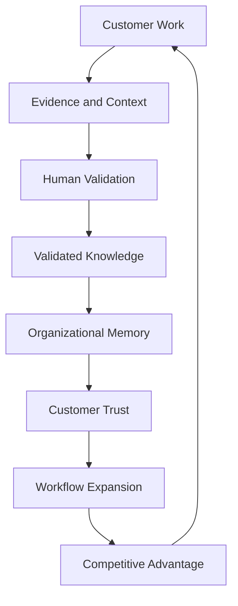
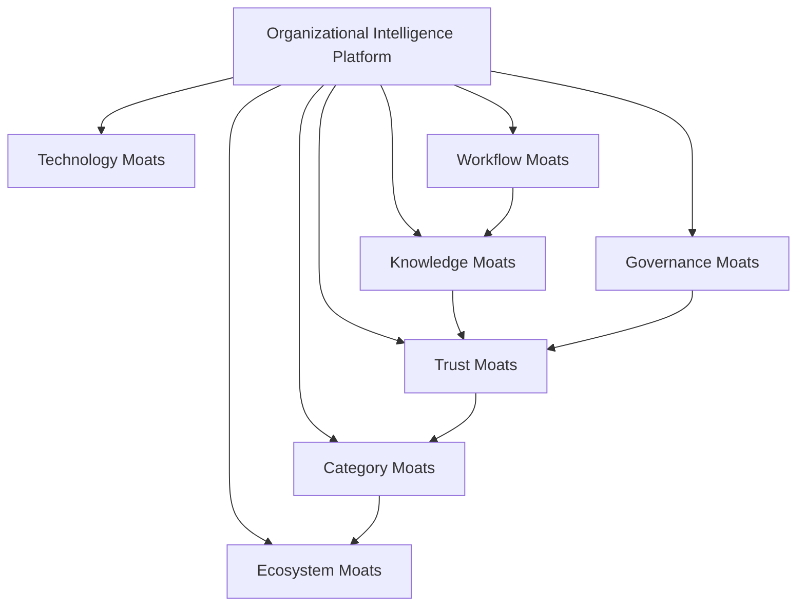
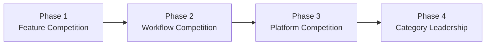
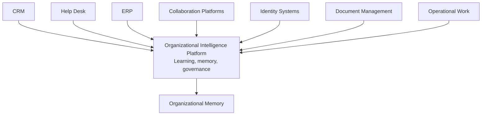
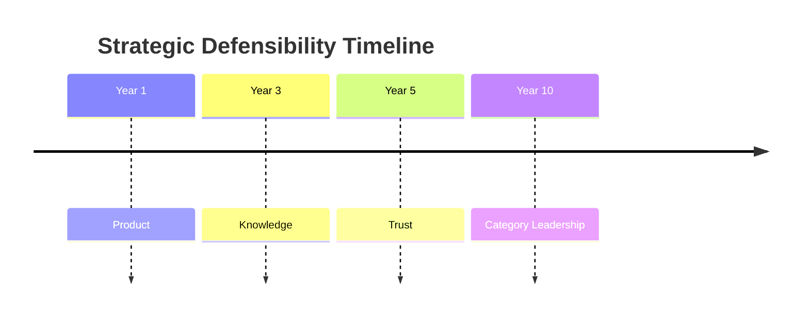

# Competitive Strategy

## Derived From

Canon Version: `v1.0.0`

### Primary Canon Documents

- [Founder's Thesis](../canon/00_FOUNDERS_THESIS.md)
- [Product Vision](../canon/01_PRODUCT_VISION.md)
- [Product Principles](../canon/02_PRODUCT_PRINCIPLES.md)
- [Capability Model](../canon/03_PRODUCT_CAPABILITY_MODEL.md)
- [Domain Model](../canon/04_PRODUCT_DOMAIN_MODEL.md)
- [Workflow Model](../canon/05_PRODUCT_WORKFLOW_MODEL.md)
- [AI Cognitive Model](../canon/06_AI_COGNITIVE_MODEL.md)

### Primary Architecture Documents

- [System Architecture](../architecture/07_SYSTEM_ARCHITECTURE.md)
- [AI Agent Architecture](../architecture/08_AI_AGENT_ARCHITECTURE.md)
- [Data Architecture](../architecture/09_DATA_ARCHITECTURE.md)
- [Knowledge Representation](../architecture/10_KNOWLEDGE_REPRESENTATION_MODEL.md)
- [Integration Architecture](../architecture/11_INTEGRATION_ARCHITECTURE.md)

### Primary Implementation Documents

- [MVP Scope](../implementation/12_MVP_SCOPE.md)
- [Implementation Architecture](../implementation/13_IMPLEMENTATION_ARCHITECTURE.md)
- [Technology Decisions](../implementation/14_TECHNOLOGY_DECISIONS.md)
- [API Architecture](../implementation/15_API_ARCHITECTURE.md)
- [Storage Architecture](../implementation/16_STORAGE_ARCHITECTURE.md)
- [Deployment Architecture](../implementation/17_DEPLOYMENT_ARCHITECTURE.md)
- [Security Architecture](../implementation/18_SECURITY_ARCHITECTURE.md)

### Primary Strategy Documents

- [Category Design](./00_CATEGORY_DESIGN.md)
- [Positioning](./01_POSITIONING.md)
- [Ideal Customer Profile](./02_IDEAL_CUSTOMER_PROFILE.md)
- [Go-to-Market Strategy](./03_GO_TO_MARKET.md)
- [Pricing Strategy](./04_PRICING_STRATEGY.md)
- [Business Model](./05_BUSINESS_MODEL.md)

---

Status: **Active**

## Primary Question

Why will this company maintain durable competitive advantage as the Organizational Intelligence Platform category matures?

This document defines the Competitive Strategy.

It is not a competitor feature comparison. It is not a sales battle card. It explains how the company builds and defends long-term strategic advantages.

## 1. Executive Summary

Sustainable competitive advantage will not come from having access to better AI models.

AI models, infrastructure, retrieval techniques, workflow automation, and basic assistant experiences will become increasingly available to many companies. Over time, competitors will be able to generate summaries, answer questions, execute tasks, and integrate with common enterprise systems.

The company's durable advantage must come from something harder to copy:

- Organizational trust.
- Accumulated customer-specific knowledge.
- Governed Organizational Memory.
- Human validation workflows.
- Explainability and evidence lineage.
- Governance history.
- Deep workflow adoption.
- Category leadership.

The company should compete by becoming the most trusted platform for transforming everyday organizational work into long-term institutional capability.

The strategic thesis is:

> AI capabilities may commoditize, but governed organizational memory compounds.

As customers use the platform, they accumulate validated knowledge, workflow history, evidence, review decisions, governance context, and institutional trust. Those assets become more valuable over time and increasingly difficult for competitors to replicate quickly.

## 2. Competitive Philosophy

## Compete on Capability, Not AI Models

The company should not define its advantage by temporary model access, benchmark performance, or proprietary prompts alone.

The durable competitive question is not "Which model is better today?" It is "Which platform makes the organization more capable over time?"

## Compete on Trust, Not Automation

Automation can be copied. Trust is earned.

The company should compete on governed workflows, human review, evidence, auditability, explainability, privacy, and security. Customers should trust the platform because it protects what the organization knows and how it learns.

## Compete on Knowledge, Not Data Volume

Large volumes of unvalidated data are not the same as organizational knowledge.

The company should compete on validated, contextual, governed, reusable knowledge. The platform's value should come from transforming evidence and work into memory, not merely storing more data.

## Compete on Governance, Not Speed

Speed matters, but ungoverned speed can accelerate mistakes.

The company should compete on its ability to help organizations move faster while preserving review, validation, policy, accountability, and institutional trust.

## Build Durable Advantages Through Customer Success

The strongest competitive advantage is successful customers who accumulate memory, expand usage, trust the platform, and advocate for the category.

Customer success creates product learning, references, retention, expansion, and category credibility.

## Competitive Philosophy Matrix

| Principle | Avoid Competing On | Compete On Instead |
| --- | --- | --- |
| Capability over Models | Temporary model performance. | Institutional capability improvement. |
| Trust over Automation | Task execution alone. | Governance, validation, audit, and explainability. |
| Knowledge over Data Volume | Raw data accumulation. | Validated, reusable, contextual knowledge. |
| Governance over Speed | Fast but untrusted output. | Responsible acceleration of learning. |
| Customer Success over Feature Parity | Feature-by-feature imitation. | Retention, expansion, references, and trusted memory. |

## 3. Market Landscape

The competitive landscape contains adjacent categories. These categories are not direct enemies. They solve different primary problems and may become partners, integration points, or expansion surfaces.

| Category | Primary Job | Relationship to OIP |
| --- | --- | --- |
| Help Desk Platforms | Manage support requests, routing, SLAs, and resolution workflows. | Beachhead system of work; OIP learns from support activity rather than replacing ticketing immediately. |
| CRM | Manage customer relationships, accounts, pipeline, and commercial history. | Important source of customer context and relationship data. |
| Knowledge Bases | Store and publish articles, FAQs, and procedures. | Existing knowledge surface that OIP can improve, validate, and refresh through work. |
| Enterprise Search | Find information across systems and repositories. | Retrieval layer that may complement OIP, but does not govern knowledge lifecycle alone. |
| AI Chatbots | Provide conversational answers and assistance. | Interaction pattern, not the category; may be one interface into OIP. |
| AI Agents | Execute tasks using tools and reasoning. | Execution capability; OIP governs whether outputs become trusted organizational knowledge. |
| Workflow Automation | Automate processes, triggers, approvals, and handoffs. | Process execution layer; OIP learns from workflow outcomes and decisions. |
| Enterprise AI Platforms | Provide AI infrastructure, model access, tooling, and governance capabilities. | Enabling infrastructure; OIP focuses on customer-specific organizational learning and memory. |

The company should avoid defining these categories as enemies. The stronger strategy is to define a new layer: the Organizational Intelligence layer that connects work, evidence, reasoning, review, knowledge, and memory across existing systems.

## 4. Sources of Competitive Advantage

Durable competitive advantage comes from assets that become stronger through use.

| Advantage | Why It Strengthens Over Time |
| --- | --- |
| Organizational Memory | Customers accumulate unique historical knowledge, decisions, evidence, and context. |
| Knowledge Flywheel | Each validated learning loop improves future work and reinforces platform value. |
| Human Validation | Expert review creates trusted knowledge that generic AI tools cannot infer automatically. |
| Explainability | Evidence, provenance, and decision history make outputs more defensible and reliable. |
| Governance | Policies, approvals, review history, and retention rules become embedded in customer operations. |
| Customer Trust | Trust deepens when the platform repeatedly preserves accuracy, privacy, and accountability. |
| Deep Workflow Integration | The platform becomes connected to how work actually happens and evolves. |
| Institutional Learning | Customers build habits and operating models around turning work into memory. |
| Category Leadership | The company shapes the language, expectations, and evaluation criteria of the category. |

## Advantage Compounding Diagram

The moat is not static. It compounds when customers keep using the platform to convert work into governed memory.

## 5. Why AI Alone Is Not a Moat

AI alone is not a durable moat because foundational AI capabilities will improve for everyone.

## LLMs Improve for Everyone

Language models will continue becoming more capable, cheaper, and easier to access. A strategy based only on today's best model is vulnerable to tomorrow's broadly available model.

## Foundation Models Commoditize

As models become widely available through multiple providers, the competitive advantage shifts away from raw model access and toward how models are governed, contextualized, evaluated, and embedded in customer workflows.

## Model Switching Becomes Easier

Provider abstraction, open-source models, and enterprise AI platforms will make switching easier over time. Customers will not want their organizational intelligence trapped inside one model vendor's interface or assumptions.

## The Real Moat Surrounds AI

The company's moat is the governed knowledge system surrounding AI:

- Evidence capture.
- Context assembly.
- Prompt versioning.
- Human review.
- Validation history.
- Knowledge versioning.
- Organizational memory.
- Governance policy.
- Auditability.
- Secure integration with systems of work.

AI is an amplifier. The moat is the trusted system that determines what the organization learns from AI-assisted work.

## 6. Competitive Moat Framework

Competitive moats can be grouped into seven categories.

| Moat Category | Description | Durability |
| --- | --- | --- |
| Technology Moats | Architecture, integrations, AI orchestration, retrieval, storage, security, and product execution. | Useful early, but must be reinforced by customer-specific learning. |
| Knowledge Moats | Validated customer knowledge, organizational memory, evidence links, and historical context. | Strong because it accumulates uniquely within each customer. |
| Workflow Moats | Embedded review, validation, support, escalation, and learning workflows. | Strong when daily work depends on the platform. |
| Trust Moats | Customer confidence in accuracy, governance, security, privacy, and explainability. | Strong because trust is earned over time. |
| Governance Moats | Policy history, approval models, audit, retention, and compliance alignment. | Strong in enterprise and regulated environments. |
| Category Moats | Ownership of category language, customer education, analyst framing, and evaluation criteria. | Strong if reinforced by execution and references. |
| Ecosystem Moats | Integrations, partners, templates, domain extensions, and future marketplace opportunities. | Strengthens after platform adoption expands. |

## Moat System Diagram

The strongest strategy combines multiple moats. No single moat should carry the entire company.

## 7. Build vs Copy Analysis

Competitors can copy some visible features quickly. They cannot quickly copy accumulated customer trust and memory.

## Easy to Copy

| Capability | Why It Is Easier to Copy |
| --- | --- |
| UI Patterns | Interfaces can be observed and recreated. |
| AI Models | Many companies can access the same or similar models. |
| Basic Chat | Conversational interfaces are widely understood. |
| Summaries | Summarization is a common AI capability. |
| Simple Retrieval | Basic document retrieval and semantic search are increasingly available. |
| Workflow Buttons | Surface-level actions and automations can be imitated. |

## Difficult to Copy

| Asset | Why It Is Difficult to Copy |
| --- | --- |
| Customer-Specific Organizational Memory | Built from actual customer work, evidence, decisions, and history over time. |
| Governance History | Reflects customer-specific policies, approvals, exceptions, and audit trails. |
| Institutional Trust | Earned through reliable behavior, security, explainability, and outcomes. |
| Validated Knowledge | Requires human review, evidence, context, and operational use. |
| Organizational Learning Culture | Develops through adoption habits and repeated knowledge promotion. |
| Long-Term Workflow Adoption | Embedded in daily work, review, escalation, and decision-making routines. |
| Category Credibility | Built through education, references, analyst understanding, and market language. |

## Copyability Matrix

| Layer | Copy Speed | Strategic Risk | Defensive Response |
| --- | --- | --- | --- |
| Interface | Fast | High if positioning is feature-led. | Lead with category, memory, and outcomes. |
| AI Output | Fast | High if value is model-dependent. | Emphasize governance and validation. |
| Workflow Integration | Medium | Moderate. | Build deep, useful workflows and adoption. |
| Validated Knowledge | Slow | Low if customer-specific. | Strengthen review and knowledge lifecycle. |
| Organizational Memory | Very slow | Low. | Preserve history, provenance, and trust. |
| Category Leadership | Slow | Moderate. | Educate market and execute consistently. |

## 8. Competitive Evolution

Competition will change as the category matures.

## Evolution Phases

| Phase | Competitive Dynamic | Strategic Response |
| --- | --- | --- |
| Phase 1: Feature Competition | Buyers compare AI answers, chat, summaries, and support features. | Educate the market on Organizational Entropy and governed memory. |
| Phase 2: Workflow Competition | Competitors embed AI into support, knowledge, and workflow systems. | Win real workflows through review, validation, and measurable reuse. |
| Phase 3: Platform Competition | Buyers evaluate architecture, integrations, governance, security, and expansion. | Demonstrate enterprise readiness and cross-functional learning. |
| Phase 4: Category Leadership | The market recognizes OIP as a distinct category. | Own the language, proof, references, ecosystem, and strategic narrative. |

The company should expect early comparisons to chatbots and support tools. The strategy is to help the market mature beyond that comparison.

## 9. Big Tech Scenario

Large companies such as Microsoft, Google, Salesforce, ServiceNow, and OpenAI may introduce similar capabilities.

This possibility should be assumed, not dismissed.

## Advantages They Have

| Advantage | Strategic Meaning |
| --- | --- |
| Distribution | Existing customer relationships and channels. |
| Bundling | Ability to package AI capabilities inside broader suites. |
| Infrastructure | Large-scale cloud, AI, and platform resources. |
| Data Access | Existing presence in productivity, CRM, support, or workflow systems. |
| Brand Trust | Established enterprise procurement credibility. |
| Ecosystem | Large partner, developer, and integration networks. |

## Advantages They Do Not Automatically Gain

| Missing Advantage | Why It Is Not Automatic |
| --- | --- |
| Customer-Specific Organizational Memory | Must be built through customer work, validation, and time. |
| Category Focus | Large platforms often optimize many categories simultaneously. |
| Deep Learning Workflow Adoption | Requires focused product behavior and customer change management. |
| Governance History | Accumulates through customer-specific policy, review, and audit use. |
| Institutional Trust in Knowledge | Earned through repeated, explainable, governed outcomes. |
| Category Definition | Requires consistent narrative and product discipline. |

## Strategic Interpretation

Big Tech can compete. The company should not assume incumbents are slow or incapable.

However, incumbents do not automatically inherit the customer's validated knowledge, learning workflows, governance history, or trust in a new category. The defensible opportunity is to become the focused platform customers trust to govern and preserve organizational intelligence across systems, including systems owned by large incumbents.

## 10. Ecosystem Strategy

The company should integrate rather than replace existing enterprise software.

The Organizational Intelligence Platform should become the intelligence layer that learns from systems of work, systems of record, and systems of communication.

| System Category | Relationship |
| --- | --- |
| CRM | Provides customer context, account history, and commercial relationship signals. |
| Help Desk | Provides support cases, resolutions, escalations, and customer inquiry patterns. |
| ERP | Provides operational and resource context for enterprise processes. |
| Collaboration Platforms | Provide conversations, decisions, informal knowledge, and team coordination context. |
| Identity Systems | Provide authentication and organizational identity context. |
| Document Management | Provides documents, policies, artifacts, and evidence sources. |

## Ecosystem Layer Diagram

The strategy is not to rip and replace. It is to make existing systems collectively smarter by preserving what the organization learns from them.

## 11. Strategic Risks

| Risk | Consequence | Mitigation |
| --- | --- | --- |
| Category Confusion | Buyers compare the company to chatbots, help desks, or knowledge bases. | Maintain disciplined category education and positioning. |
| AI Commoditization | Competitors gain similar AI capabilities. | Build around governed memory, validation, and workflow adoption. |
| Pricing Pressure | Buyers compare against cheaper AI tools or bundled features. | Anchor value in organizational capability and trust. |
| Platform Dependency | Overreliance on one AI or infrastructure provider creates strategic risk. | Preserve provider abstraction and architectural replaceability. |
| Slow Adoption | New category education takes longer than expected. | Focus on ICP, design partners, clear ROI, and Customer Support beachhead. |
| Large Incumbent Competition | Big platforms bundle adjacent capabilities. | Compete through focus, trust, category clarity, and cross-system intelligence layer. |
| Weak Differentiation | Product becomes perceived as feature set rather than platform category. | Reinforce Knowledge Flywheel, memory, governance, and explainability. |
| Poor Customer Fit | Weak-fit customers produce weak outcomes and dilute learning. | Maintain ICP and Anti-ICP discipline. |
| Over-Customization | Product becomes services-heavy and hard to scale. | Build reusable platform patterns and resist one-off commitments. |

## 12. Strategic Defensibility Timeline

Competitive advantage should strengthen over time.

## Timeline Stages

| Stage | Defensibility Source | Why It Matters |
| --- | --- | --- |
| Year 1: Product | Focused MVP, Customer Support workflows, design partner learning, clear category narrative. | Establishes the first proof that the category can work. |
| Year 3: Knowledge | Accumulated validated knowledge, support memory, workflow adoption, and references. | Customers begin depending on the platform for reusable learning. |
| Year 5: Trust | Governance history, audit, security, enterprise adoption, and cross-functional expansion. | The platform becomes part of trusted organizational operations. |
| Year 10: Category Leadership | Market recognition, ecosystem, customer memory, analyst understanding, and enterprise infrastructure role. | The company becomes associated with the category itself. |

Defensibility grows when the platform moves from useful product to trusted memory layer.

## 13. Long-Term Strategic Vision

The long-term ambition is to become synonymous with Organizational Intelligence Platforms in the same way Salesforce became associated with CRM.

This does not mean relying on marketing alone. Category leadership must be earned through execution:

- Clear category definition.
- Focused beachhead success.
- Strong customer outcomes.
- Trustworthy product behavior.
- Enterprise governance.
- Durable integrations.
- Compounding organizational memory.
- Credible customer references.
- Consistent strategic language.

The company should become known for one enduring idea:

Organizations should become more capable because of the work they perform.

If the company executes well, it can lead the category by making Organizational Intelligence a necessary layer of modern enterprise software.

## 14. Traceability Matrix

| Canon Concept | Competitive Expression |
| --- | --- |
| Organizational Intelligence | Category leadership and strategic market position. |
| Knowledge Flywheel | Economic moat and customer value compounding mechanism. |
| Organizational Memory | Switching advantage and long-term customer-specific asset. |
| Human Review | Trust mechanism that competitors cannot replace with automation alone. |
| Governance | Enterprise differentiation through policy, validation, audit, and accountability. |
| Explainability | Defensible AI adoption through evidence, provenance, and decision history. |
| Evidence | Foundation for trusted knowledge and resistance to ungrounded AI output. |
| AI Cognitive Model | AI is an amplifier inside a governed intelligence system, not the moat itself. |
| Product Vision | Differentiation is based on institutional capability, not task automation. |
| Architecture | Stable boundaries support integration, replaceability, and enterprise trust. |
| Implementation | Technology decisions support defensibility without defining it solely by technology. |
| Category Design | Competitive strategy depends on defining and leading the OIP category. |
| Positioning | Avoids chatbot, AI wrapper, and help desk confusion. |
| Business Model | Durable advantage grows as customer memory, trust, and expansion compound. |

## 15. What This Document Does NOT Define

This document intentionally excludes:

- Competitor feature matrices.
- Sales battle cards.
- Marketing campaigns.
- Implementation tactics.
- Quarterly competitive analysis.
- Pricing responses.
- Win-loss analysis.
- Account-specific competitive strategy.
- Product roadmap commitments.

These belong in operational strategy, sales enablement, product planning, or market intelligence documents.

## 16. Closing

Competitive advantage should become stronger as customers accumulate organizational memory, trust, governance history, and validated knowledge.

The company should never compete solely on AI models or short-term features.

Instead, it should compete by becoming the most trusted platform for transforming everyday organizational work into long-term institutional capability.

The strategic goal is not to avoid competition. It is to build advantages that become harder to copy as the customer succeeds.

If the platform helps customers learn, remember, govern, and trust what they know, then every successful customer becomes part of the company's defensibility.
