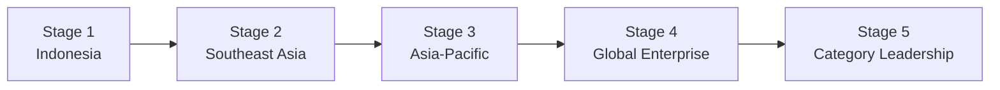
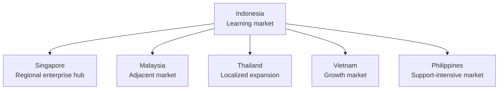
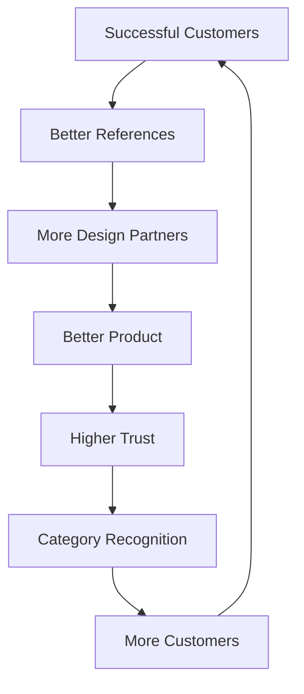

# Growth Strategy

## Derived From

Canon Version: `v1.0.0`

### Primary Canon Documents

- [Founder's Thesis](../canon/00_FOUNDERS_THESIS.md)
- [Product Vision](../canon/01_PRODUCT_VISION.md)
- [Product Principles](../canon/02_PRODUCT_PRINCIPLES.md)
- [Capability Model](../canon/03_PRODUCT_CAPABILITY_MODEL.md)
- [Domain Model](../canon/04_PRODUCT_DOMAIN_MODEL.md)
- [Workflow Model](../canon/05_PRODUCT_WORKFLOW_MODEL.md)
- [AI Cognitive Model](../canon/06_AI_COGNITIVE_MODEL.md)

### Primary Architecture Documents

- [System Architecture](../architecture/07_SYSTEM_ARCHITECTURE.md)
- [AI Agent Architecture](../architecture/08_AI_AGENT_ARCHITECTURE.md)
- [Data Architecture](../architecture/09_DATA_ARCHITECTURE.md)
- [Knowledge Representation](../architecture/10_KNOWLEDGE_REPRESENTATION_MODEL.md)
- [Integration Architecture](../architecture/11_INTEGRATION_ARCHITECTURE.md)

### Primary Implementation Documents

- [MVP Scope](../implementation/12_MVP_SCOPE.md)
- [Implementation Architecture](../implementation/13_IMPLEMENTATION_ARCHITECTURE.md)
- [Technology Decisions](../implementation/14_TECHNOLOGY_DECISIONS.md)
- [API Architecture](../implementation/15_API_ARCHITECTURE.md)
- [Storage Architecture](../implementation/16_STORAGE_ARCHITECTURE.md)
- [Deployment Architecture](../implementation/17_DEPLOYMENT_ARCHITECTURE.md)
- [Security Architecture](../implementation/18_SECURITY_ARCHITECTURE.md)

### Primary Strategy Documents

- [Category Design](./00_CATEGORY_DESIGN.md)
- [Positioning](./01_POSITIONING.md)
- [Ideal Customer Profile](./02_IDEAL_CUSTOMER_PROFILE.md)
- [Go-to-Market Strategy](./03_GO_TO_MARKET.md)
- [Pricing Strategy](./04_PRICING_STRATEGY.md)
- [Business Model](./05_BUSINESS_MODEL.md)
- [Competitive Strategy](./06_COMPETITIVE_STRATEGY.md)

---

Status: **Active**

## Primary Question

How does the company grow from an Indonesia-first startup into the global leader of the Organizational Intelligence Platform category?

This document defines the long-term Growth Strategy.

It is not a marketing plan. It is not a quarterly sales target. It defines how the company scales while preserving its philosophy, product quality, customer trust, and category leadership.

## 1. Executive Summary

The company's growth strategy is built around expanding trust before expanding scale.

For an Organizational Intelligence Platform, growth cannot be measured only by revenue, customer count, or geographic presence. The company grows well when customers become more capable, the category becomes clearer, the product becomes more trusted, and the platform's role in organizational learning becomes more essential.

Growth should reinforce the Organizational Intelligence Platform category rather than dilute it.

The company should begin in Indonesia because proximity, affordability, founder context, and customer accessibility create faster learning. It should expand through Southeast Asia, then Asia-Pacific, then global enterprise markets only after it has proven product-market fit, trust, governance, repeatable adoption, and category clarity.

The growth thesis is:

> The company should scale only when growth strengthens customer trust, validates Organizational Intelligence, and increases institutional capability.

Rapid growth that weakens product quality, customer success, governance, or category positioning is not strategic growth. Sustainable growth is the path to category leadership.

## 2. Growth Philosophy

## Trust Before Scale

The company should earn customer trust before aggressively scaling distribution.

Trust is central because the platform handles knowledge, memory, evidence, governance, AI reasoning, and institutional learning. Scaling before customers trust the platform risks damaging the category.

## Customer Success Drives Growth

Growth should be driven by customers who can explain the value they received.

Successful customers create references, expansion, product learning, retention, and market credibility. In a new category, customer proof is more valuable than broad awareness without evidence.

## Product-Market Fit Before Expansion

The company should prove repeatable value in the Customer Support beachhead before expanding geographically or functionally.

Expansion without PMF can create noisy feedback, diluted positioning, and operational complexity before the company understands its core motion.

## Focus Before Diversification

The company should win one market, one use case, and one customer profile before diversifying.

Focus creates sharper product decisions, clearer messaging, stronger case studies, and better customer outcomes.

## Sustainable Growth Over Hypergrowth

The company should prioritize growth that preserves product quality, support quality, security, governance, and trust.

Hypergrowth can be dangerous if it creates weak customer outcomes, poor implementations, or category confusion.

## Category Leadership Before Market Dominance

The company should first define and validate the category before attempting to dominate every market.

Category leadership begins with clarity, education, trust, proof, and customer success. Market dominance can only follow if the category becomes understood and valuable.

## Growth Philosophy Matrix

| Principle | Growth Meaning | Strategic Implication |
| --- | --- | --- |
| Trust Before Scale | Customers must trust the platform with organizational knowledge. | Do not scale faster than governance, security, and customer success can support. |
| Customer Success Drives Growth | Proof creates references and expansion. | Prioritize successful design partners and lighthouse customers. |
| PMF Before Expansion | Repeatability comes before scale. | Validate Customer Support before new markets. |
| Focus Before Diversification | Narrow success creates broader credibility. | Avoid spreading product and GTM too thin. |
| Sustainable Growth Over Hypergrowth | Growth should not damage trust. | Optimize for retention, expansion, and category proof. |
| Category Leadership Before Market Dominance | The market must understand OIP before it can buy at scale. | Invest in education, positioning, and credible outcomes. |

## 3. Growth Stages

The company should grow in stages, with each stage earning the right to enter the next.

## Growth Stage Roadmap

| Stage | Objective | Proof Required Before Advancing |
| --- | --- | --- |
| Stage 1: Indonesia | Validate the category, MVP, design partner motion, and Indonesia-first pricing. | Strong design partner outcomes, support beachhead validation, early references, trust signals. |
| Stage 2: Southeast Asia | Expand into neighboring markets with regional localization and partnerships. | Repeatable onboarding, localized positioning, regional pricing discipline, supportable operations. |
| Stage 3: Asia-Pacific | Enter broader APAC markets with stronger enterprise readiness. | Multi-country traction, security credibility, partner ecosystem, scalable customer success. |
| Stage 4: Global Enterprise | Compete in Europe, North America, and other mature enterprise markets. | Enterprise governance, compliance posture, references, integration depth, global support readiness. |
| Stage 5: Category Leadership | Become recognized as a defining company for Organizational Intelligence Platforms. | Analyst recognition, customer advocacy, ecosystem development, durable market language. |

## 4. Indonesia-First Strategy

Indonesia is the ideal first market because it maximizes learning speed and founder proximity while keeping the company grounded in real customer needs.

## Why Indonesia

| Advantage | Strategic Meaning |
| --- | --- |
| Local Market Understanding | The company can interpret customer context, buying behavior, support workflows, and economic constraints directly. |
| Customer Accessibility | Founders can reach early customers, learn quickly, and build trust through direct relationships. |
| Faster Feedback | Local proximity shortens the loop between customer pain, product learning, and strategic refinement. |
| Lower Customer Acquisition Cost | Early relationships, founder networks, and local credibility can reduce GTM friction. |
| Founder Proximity | Founders can participate directly in discovery, onboarding, support, and design partner learning. |
| Design Partner Opportunities | Indonesia offers growing digital organizations that may be open to shaping a new category. |
| Purchasing Power Learning | The company can validate regional pricing and affordability strategies early. |

Indonesia is the learning market, not the final market.

The objective is not to limit ambition to Indonesia. The objective is to prove the core category in a market where the company can learn faster, serve customers more closely, and develop a pricing strategy aligned with local reality.

## 5. Southeast Asia Expansion

Southeast Asia is the natural second stage because many markets share digital growth, multilingual operations, regional expansion needs, and emerging enterprise software adoption.

Potential expansion markets include:

- Singapore.
- Malaysia.
- Thailand.
- Vietnam.
- Philippines.

## Regional Expansion Considerations

| Market Consideration | Strategic Requirement |
| --- | --- |
| Localization | Adapt language, examples, onboarding, support, and market education to local context. |
| Language | Support multilingual customer work and knowledge workflows where necessary. |
| Regulations | Understand data protection, industry rules, privacy expectations, and cross-border requirements. |
| Regional Partnerships | Work with local advisors, implementation partners, industry networks, and customer communities. |
| Pricing | Continue Purchasing Power Aligned Pricing across markets with different economic realities. |
| Customer Success | Ensure expansion does not exceed the company's ability to support customers well. |

## Southeast Asia Expansion Map

Singapore may be strategically important as a regional enterprise hub, while other markets may offer strong support, operations, and digital service use cases. The sequencing should follow customer pull, partner readiness, regulatory comfort, and ability to support customers successfully.

## 6. Global Expansion

Global expansion should occur after the company has proven repeatable value, enterprise trust, and regional operating discipline.

The transition toward Europe, North America, and other enterprise markets requires more than translation. Mature enterprise markets will expect stronger evidence, security, compliance, support, integrations, procurement readiness, and competitive differentiation.

## Global Expansion Requirements

| Requirement | Why It Matters |
| --- | --- |
| Enterprise Readiness | Larger customers require procurement, administration, governance, and support maturity. |
| Compliance | Mature markets and regulated industries require stronger privacy, retention, audit, and security posture. |
| Security Expectations | Customers will evaluate identity, access, audit, data protection, and incident response more deeply. |
| Global Support | Support coverage, onboarding, customer success, and escalation must match enterprise expectations. |
| Multi-Region Deployment | Customers may require regional data handling, resilience, and operational availability. |
| Local Partnerships | Regional partners can accelerate trust, implementation, and market entry. |
| Category Proof | Global buyers need credible references and clear differentiation from incumbents. |

Global expansion should be earned by customer outcomes, not assumed from product ambition.

## 7. Product Expansion Strategy

The product should expand from Customer Support into adjacent knowledge-intensive functions where Organizational Entropy is visible.

## Product Expansion Logic

| Expansion Area | Why It Follows Naturally |
| --- | --- |
| Customer Support | First beachhead with high repetition, existing evidence, and measurable outcomes. |
| IT Service Management | Incidents, fixes, root causes, and runbooks mirror support knowledge loops. |
| HR | Policy questions, onboarding, employee cases, and manager guidance require governed knowledge. |
| Legal | Precedents, evidence, review, and risk interpretation require memory and governance. |
| Finance | Exceptions, approvals, controls, and policy interpretation require traceable decisions. |
| Operations | Process exceptions, vendor issues, quality problems, and coordination create repeated learning. |
| Organization-wide Intelligence | Cross-functional memory becomes a foundational enterprise capability. |

Product expansion should follow validated customer demand and the ability to preserve trust. The company should not expand into a function merely because it is possible.

## 8. Customer Expansion Strategy

Customer growth should follow a land-and-expand model driven by trust and measurable outcomes.

## Expansion Stages

| Stage | Expansion Driver |
| --- | --- |
| Single Team | Prove a focused Knowledge Flywheel in one support team or workflow. |
| Department | Expand as more support teams reuse knowledge and trust the platform. |
| Business Unit | Apply the platform to adjacent teams, products, regions, or service lines. |
| Enterprise | Connect multiple functions into a broader Organizational Intelligence layer. |
| Multi-region Enterprise | Support regional localization, governance, and scale across markets. |

Trust and measurable outcomes drive expansion.

Customers should expand because:

- Knowledge reuse is visible.
- Reviewers trust the system.
- Leaders see reduced repeated work.
- Onboarding improves.
- AI becomes more explainable.
- Governance is preserved.
- Adjacent teams recognize similar entropy.

Expansion should feel like the natural spread of organizational learning, not forced account growth.

## 9. Growth Flywheel

Growth should be powered by successful customers and category proof.

## Flywheel Stages

| Stage | Explanation |
| --- | --- |
| Successful Customers | Customers achieve measurable organizational learning and become more capable. |
| Better References | Customer proof makes the category credible to other buyers. |
| More Design Partners | Strong references attract better-fit customers who help refine the product. |
| Better Product | Customer learning improves workflows, trust mechanisms, and value delivery. |
| Higher Trust | Better outcomes and stronger governance increase customer confidence. |
| Category Recognition | The market begins to understand Organizational Intelligence Platforms as distinct. |
| More Customers | Category recognition and proof reduce adoption friction. |

The growth flywheel depends on customer success. Weak-fit customers, shallow deployments, or poor trust will slow the entire system.

## 10. Strategic Growth Metrics

Growth metrics should measure durable value, not vanity activity.

| Metric | Why It Matters |
| --- | --- |
| Customer Retention | Measures whether customers continue trusting the platform. |
| Net Revenue Retention | Measures expansion and increasing customer value over time. |
| Expansion Revenue | Measures whether the platform grows from team to department to enterprise. |
| Reference Customers | Measures credible proof of category value. |
| Knowledge Reuse Rate | Measures whether customer work becomes reusable memory. |
| Enterprise Adoption | Measures spread across teams, business units, and governance contexts. |
| Geographic Expansion | Measures ability to expand without losing localization, support, or trust. |
| Category Awareness | Measures whether the market understands Organizational Intelligence Platforms. |
| Design Partner Success | Measures the quality of early learning and validation. |
| Time to First Organizational Value | Measures how quickly customers see meaningful learning outcomes. |

## Metrics to Avoid Overvaluing

The company should avoid overvaluing:

- Website traffic without qualified education.
- AI interaction volume without knowledge reuse.
- Customer count without retention.
- Pipeline volume outside the ICP.
- Geographic presence without customer success.
- Revenue growth that weakens support quality or category clarity.

Healthy growth means customers become more capable and the category becomes more credible.

## 11. Growth Risks

| Risk | Consequence | Mitigation |
| --- | --- | --- |
| Expanding Too Early | Diluted product focus, weak customer outcomes, and noisy learning. | Require PMF signals before geographic or functional expansion. |
| Losing Product Focus | The platform becomes a collection of unrelated workflows. | Anchor every expansion in the Knowledge Flywheel and Canon concepts. |
| Weak Localization | New markets fail because language, pricing, regulation, or buying behavior is misunderstood. | Localize carefully and use regional partners where appropriate. |
| Poor Customer Success | Customers fail to reach value, weakening retention and references. | Scale customer success capacity before scaling acquisition. |
| Category Dilution | The company is perceived as a chatbot, support tool, or generic AI platform. | Maintain positioning discipline and category education. |
| Scaling Faster Than Governance | Security, privacy, review, and trust mechanisms lag behind growth. | Invest in governance, security, and operational maturity before enterprise scale. |
| Regional Pricing Mistakes | Pricing either blocks adoption or weakens perceived value. | Use Purchasing Power Aligned Pricing and clear regional strategy. |
| Over-Expansion Across Functions | Product and messaging become unfocused. | Expand only where customer proof and entropy patterns are strong. |
| Hiring Ahead of Learning | Organization grows before GTM and product motions are repeatable. | Hire according to validated growth stages. |

Growth risk should be evaluated through one question:

> Does this expansion strengthen or weaken customer trust and category clarity?

## 12. Long-Term Vision

Fifteen to twenty years from now, Organizational Intelligence Platforms could become a standard enterprise software category alongside ERP, CRM, and HR systems.

ERP helps organizations manage resources.

CRM helps organizations manage customer relationships.

HR systems help organizations manage people operations.

Organizational Intelligence Platforms help organizations manage institutional learning.

The company's long-term vision is to become a defining company in that category by executing consistently over time:

- Starting with a focused beachhead.
- Proving measurable customer value.
- Expanding through trust.
- Building durable Organizational Memory.
- Preserving human review and governance.
- Integrating with existing enterprise systems.
- Educating the market.
- Growing internationally without losing product quality.

The company should remain realistic. Category leadership will not come from ambition alone. It will come from years of customer outcomes, product discipline, trust, and strategic clarity.

## 13. Traceability Matrix

| Canon Concept | Growth Expression |
| --- | --- |
| Organizational Intelligence | Global category expansion around institutional learning. |
| Knowledge Flywheel | Customer growth engine and expansion mechanism. |
| Human Review | Trust at scale through validation and expert participation. |
| Organizational Memory | Expansion value and customer retention driver. |
| Governance | Enterprise readiness and global trust requirement. |
| Learning | Sustainable growth depends on customer learning outcomes. |
| Evidence | Customer proof and references must be grounded in real outcomes. |
| AI Cognitive Model | Growth must preserve AI as amplifier, not authority. |
| Category Design | Growth reinforces OIP as a distinct enterprise category. |
| Positioning | Expansion should not dilute perception into chatbot or automation categories. |
| ICP | Growth begins with high-fit Customer Support organizations. |
| GTM Strategy | Design partners and PMF precede scale. |
| Pricing Strategy | Regional expansion requires purchasing-power alignment. |
| Business Model | Growth compounds through customer success, retention, and expansion. |
| Competitive Strategy | Defensibility strengthens through trust, memory, governance, and category leadership. |

## 14. What This Document Does NOT Define

This document intentionally excludes:

- Quarterly OKRs.
- Hiring plans.
- Marketing campaigns.
- Financial forecasts.
- Implementation roadmaps.
- Operational sales targets.
- Territory plans.
- Headcount plans.
- Channel quotas.
- Product release schedules.

These belong in execution planning, operating plans, finance documents, GTM operations, and roadmap documents.

## 15. Closing

The company's ambition is not simply to become a larger software vendor.

Its ambition is to establish Organizational Intelligence as a permanent layer of enterprise computing.

Growth should therefore be measured not only by revenue or customer count, but by the number of organizations that become permanently more capable because of the platform.

Every stage of expansion should reinforce the company's philosophy, strengthen customer trust, and advance the Organizational Intelligence Platform category.

The company should grow patiently where trust is still forming, decisively where value is proven, and globally only when the category, product, and operating model can support that ambition.
