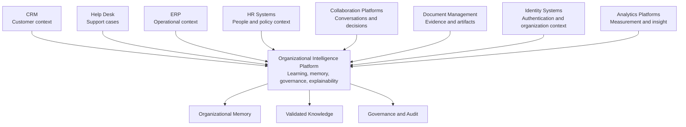
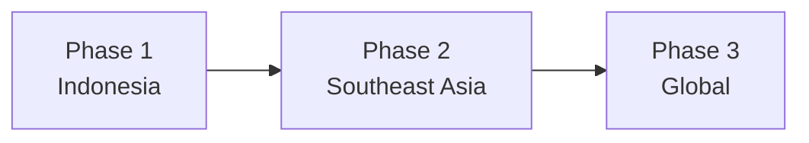
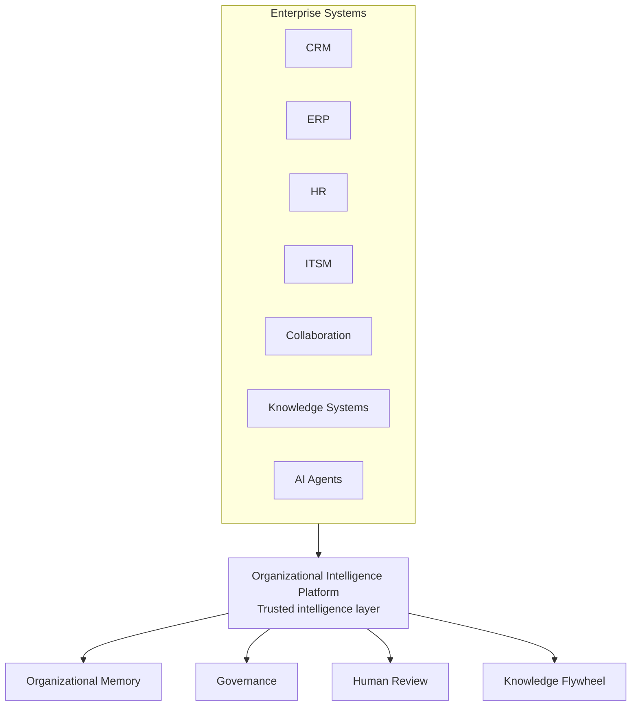

# Partnership Strategy

## Derived From

Canon Version: `v1.0.0`

### Primary Canon Documents

- [Founder's Thesis](../canon/00_FOUNDERS_THESIS.md)
- [Product Vision](../canon/01_PRODUCT_VISION.md)
- [Product Principles](../canon/02_PRODUCT_PRINCIPLES.md)
- [Capability Model](../canon/03_PRODUCT_CAPABILITY_MODEL.md)
- [Domain Model](../canon/04_PRODUCT_DOMAIN_MODEL.md)
- [Workflow Model](../canon/05_PRODUCT_WORKFLOW_MODEL.md)
- [AI Cognitive Model](../canon/06_AI_COGNITIVE_MODEL.md)

### Primary Architecture Documents

- [System Architecture](../architecture/07_SYSTEM_ARCHITECTURE.md)
- [AI Agent Architecture](../architecture/08_AI_AGENT_ARCHITECTURE.md)
- [Data Architecture](../architecture/09_DATA_ARCHITECTURE.md)
- [Knowledge Representation](../architecture/10_KNOWLEDGE_REPRESENTATION_MODEL.md)
- [Integration Architecture](../architecture/11_INTEGRATION_ARCHITECTURE.md)

### Primary Implementation Documents

- [MVP Scope](../implementation/12_MVP_SCOPE.md)
- [Implementation Architecture](../implementation/13_IMPLEMENTATION_ARCHITECTURE.md)
- [Technology Decisions](../implementation/14_TECHNOLOGY_DECISIONS.md)
- [API Architecture](../implementation/15_API_ARCHITECTURE.md)
- [Storage Architecture](../implementation/16_STORAGE_ARCHITECTURE.md)
- [Deployment Architecture](../implementation/17_DEPLOYMENT_ARCHITECTURE.md)
- [Security Architecture](../implementation/18_SECURITY_ARCHITECTURE.md)

### Primary Strategy Documents

- [Category Design](./00_CATEGORY_DESIGN.md)
- [Positioning](./01_POSITIONING.md)
- [Ideal Customer Profile](./02_IDEAL_CUSTOMER_PROFILE.md)
- [Go-to-Market Strategy](./03_GO_TO_MARKET.md)
- [Pricing Strategy](./04_PRICING_STRATEGY.md)
- [Business Model](./05_BUSINESS_MODEL.md)
- [Competitive Strategy](./06_COMPETITIVE_STRATEGY.md)
- [Growth Strategy](./07_GROWTH_STRATEGY.md)

---

Status: **Active**

## Primary Question

How should the company build a strategic ecosystem of partners that accelerates customer success, category adoption, and long-term platform growth?

This document defines the Partnership Strategy.

It is not a reseller program. It is not a list of integration opportunities. It explains how strategic partnerships strengthen the Organizational Intelligence Platform ecosystem while preserving the company's independence and long-term vision.

## 1. Executive Summary

Partnerships are strategic multipliers, not merely distribution channels.

For an Organizational Intelligence Platform, partnerships should help customers connect work, evidence, knowledge, memory, governance, and AI-assisted reasoning across the systems they already use. The company should not attempt to replace every enterprise system. It should become the Organizational Intelligence layer that connects them into something more valuable.

The partnership strategy should accelerate:

- Customer value.
- Implementation success.
- Enterprise trust.
- Ecosystem reach.
- Category adoption.
- Platform capabilities.

The company should use partnerships to strengthen the Organizational Intelligence Platform category, not to dilute its position into generic integration, consulting, or reseller activity.

The strategic objective is to build an ecosystem where customers can preserve and compound organizational learning across CRM, help desk, ERP, collaboration, identity, document, AI, and workflow systems while trusting the platform to govern memory, validation, and explainability.

## 2. Partnership Philosophy

## Complement Before Replace

The company should complement existing enterprise systems before attempting to replace them.

Customers already operate CRM, help desk, ERP, HR, document, collaboration, and identity systems. The platform's role is to learn across those systems, not force customers to abandon them prematurely.

## Customer Success Before Revenue

Partnerships should first improve customer outcomes.

A partnership that generates channel activity but weakens implementation quality, trust, or category clarity is not strategically valuable. Revenue should follow customer success, not substitute for it.

## Open Ecosystem

The company should build toward an open ecosystem where multiple systems can contribute evidence, context, workflow events, and knowledge signals.

An open ecosystem supports customer choice and strengthens the platform's role as the intelligence layer across systems.

## Strategic Independence

Partnerships should not compromise the company's long-term independence.

Technology, cloud, AI, or channel partners may provide important capabilities, but they should not define the company's product direction, category position, customer relationship, or competitive advantage.

## Long-Term Trust

Partnerships must preserve trust.

Partner integrations, services, co-selling, and implementation activity should respect security, privacy, governance, data boundaries, customer ownership, and explainability.

## Mutual Value Creation

Strong partnerships create value for customers, the company, and the partner.

The goal is not one-sided distribution. It is durable ecosystem alignment around customer success and category growth.

## Partnership Philosophy Matrix

| Principle | Meaning | Partnership Implication |
| --- | --- | --- |
| Complement Before Replace | Existing systems remain important. | Integrate with enterprise software instead of forcing replacement. |
| Customer Success Before Revenue | Outcomes matter more than channel activity. | Prioritize partners that improve adoption, trust, and implementation quality. |
| Open Ecosystem | Customers need choice and interoperability. | Avoid unnecessary lock-in and support multiple system categories. |
| Strategic Independence | Partners should not define the company. | Avoid overdependence on one provider or channel. |
| Long-Term Trust | Partnerships affect customer confidence. | Evaluate partner security, quality, incentives, and governance fit. |
| Mutual Value Creation | Partnerships must benefit all parties. | Build relationships around shared customer value. |

## 3. Partnership Objectives

Partnerships should advance the company's long-term strategy, not merely create short-term sales motion.

| Objective | Strategic Role |
| --- | --- |
| Accelerate Enterprise Adoption | Partners can reduce friction in procurement, implementation, integration, and executive trust. |
| Improve Implementation Success | Implementation and consulting partners can help customers reach value faster when properly enabled. |
| Expand Ecosystem Reach | Ecosystem relationships help the platform connect to more systems of work and record. |
| Increase Customer Trust | Credible partners can increase buyer confidence, especially in new regions or enterprise accounts. |
| Strengthen Integrations | Technology and software partners improve connection to CRM, help desk, identity, document, and workflow systems. |
| Improve Industry Credibility | Universities, research institutions, associations, and government programs can strengthen legitimacy. |
| Support Category Education | Partners can help explain Organizational Intelligence to broader communities and markets. |
| Enable Regional Growth | Local partners can support localization, implementation, and market understanding. |

Partnerships should be evaluated by their ability to strengthen the category, customer outcomes, and platform adoption.

## 4. Partnership Categories

The partnership ecosystem should include multiple categories, each with a distinct strategic role.

| Partner Category | Strategic Role |
| --- | --- |
| Technology Partners | Provide enabling technical capabilities, developer ecosystems, or platform services. |
| Cloud Infrastructure Partners | Support deployment, scalability, availability, and enterprise infrastructure expectations. |
| AI Model Providers | Provide model capabilities that can be accessed through abstraction without defining the company's moat. |
| CRM Platforms | Provide customer context, account history, and relationship data. |
| Help Desk Platforms | Provide support cases, ticket workflows, escalations, and historical service data. |
| ERP Platforms | Provide operational and resource context for enterprise processes. |
| Identity Providers | Support authentication, federation, and enterprise identity integration. |
| System Integrators | Help enterprise customers implement, integrate, and adopt the platform. |
| Consulting Firms | Support transformation, process design, knowledge governance, and category education. |
| Universities | Support research, talent, credibility, and long-term thought leadership. |
| Research Institutions | Advance understanding of organizational learning, AI governance, knowledge systems, and enterprise cognition. |
| Government Digital Transformation Programs | Support public-sector adoption, credibility, and regional digital capability development. |
| Channel Partners | Extend reach where they can preserve customer success and category clarity. |
| Industry Associations | Support education, trust, standards discussion, and category awareness. |

## Partnership Category Matrix

| Category | Early Priority | Long-Term Priority | Main Risk |
| --- | --- | --- | --- |
| Help Desk Platforms | High | High | Being perceived as an add-on rather than a category layer. |
| CRM Platforms | Medium | High | Overfitting to one ecosystem. |
| Cloud Infrastructure | Medium | High | Vendor concentration. |
| AI Model Providers | High | High | Model-provider dependence. |
| System Integrators | Medium | High | Quality variance and over-customization. |
| Universities and Research | Medium | Medium | Slow commercial impact. |
| Government Programs | Medium | High | Procurement and policy complexity. |
| Channel Partners | Low early | Medium later | Misaligned incentives before PMF. |

## 5. Technology Partnership Strategy

Technology partners provide capabilities. They should not define the company's competitive advantage.

The company may partner with cloud providers, database providers, AI infrastructure companies, LLM providers, observability providers, security infrastructure providers, and integration platforms. These relationships can improve reliability, scalability, credibility, and customer adoption.

However, the durable competitive advantage remains the governed Organizational Intelligence system:

- Customer-specific Organizational Memory.
- Knowledge Flywheel.
- Human Validation.
- Governance history.
- Explainability.
- Trusted workflow adoption.
- Category leadership.

## Technology Partner Principles

| Principle | Meaning |
| --- | --- |
| Replaceability | No technology partner should become inseparable from the platform's identity. |
| Abstraction | Provider-specific capabilities should remain behind architecture boundaries where possible. |
| Customer Trust | Partner choices must support security, reliability, compliance, and transparency. |
| Strategic Optionality | The company should preserve the ability to adapt as technology markets change. |
| Capability Leverage | Technology partners should accelerate platform capabilities without taking over product direction. |

Technology partnerships should be evaluated by whether they strengthen the platform while preserving independence.

## 6. Enterprise Software Ecosystem

The Organizational Intelligence Platform should integrate with existing enterprise systems and become the intelligence layer across them.

Examples include:

- CRM.
- Help Desk.
- ERP.
- HR Systems.
- Collaboration Platforms.
- Document Management.
- Identity Systems.
- Analytics Platforms.

## Enterprise Ecosystem Diagram

The platform should not position itself as a replacement for these systems. It should make them collectively more intelligent by preserving what the organization learns from them.

## 7. Design Partner Strategy

Design partners are strategic partners in category formation.

They help the company learn which workflows matter, which outcomes are measurable, how customers understand the category, and what enterprise trust requires.

## Selection Criteria

| Criterion | Requirement |
| --- | --- |
| ICP Fit | The partner should match the Ideal Customer Profile. |
| Real Operational Pain | The partner should experience repeated work, knowledge gaps, or support scaling pain. |
| Data and Workflow Access | The partner should provide access to relevant cases, knowledge, evidence, or workflows. |
| Review Capacity | The partner should have experts who can validate learning. |
| Executive Sponsorship | Leadership should care about organizational learning, support quality, AI trust, or knowledge reuse. |
| Reference Potential | The partner should be able to become a credible example if successful. |

## Mutual Responsibilities

| Company Responsibility | Design Partner Responsibility |
| --- | --- |
| Provide focused support and product attention. | Provide timely feedback and access to relevant workflows. |
| Establish measurement and learning objectives. | Participate in validation, review, and outcome assessment. |
| Protect customer trust, data, and governance. | Identify internal champions and reviewers. |
| Translate learning into product improvement. | Share honest assessment of value and friction. |
| Support category education internally. | Help evaluate whether the category framing resonates. |

## Learning Objectives

Design partnerships should help answer:

- Does the Knowledge Flywheel work in real support operations?
- Which outcomes matter most to buyers?
- Which data sources are most useful?
- Which review workflows are realistic?
- What prevents trust?
- What creates expansion pull?
- How should the category be explained?

## Governance

Design partners should not become unmanaged custom projects.

The relationship should define scope, data boundaries, review responsibilities, success metrics, confidentiality expectations, and learning objectives.

## Success Metrics

Success may include:

- Time to first organizational value.
- Learning candidates generated.
- Validated knowledge created.
- Knowledge reuse.
- Reviewer engagement.
- Reduced repeated expert effort.
- Executive confidence.
- Reference readiness.

## Transition to Long-Term Customer

The transition from design partner to long-term customer should occur when the customer sees measurable value, trusts the platform, understands the category, and wants to expand usage beyond the initial learning scope.

## 8. Regional Partnership Strategy

Partnerships should evolve with the company's growth stages.

## Regional Partner Priorities

| Phase | Partner Types | Strategic Role |
| --- | --- | --- |
| Phase 1: Indonesia | Local consulting firms, design partners, universities, enterprise communities, government programs. | Build trust, validate the category, learn local market needs, support implementation. |
| Phase 2: Southeast Asia | Regional implementation partners, local advisors, industry communities, universities, cloud and software ecosystem partners. | Localize adoption, support regional expansion, navigate language and regulatory variation. |
| Phase 3: Global | Global system integrators, enterprise software partners, cloud alliances, research institutions, industry associations. | Build enterprise credibility, scale implementation, support global customers, expand category influence. |

## Regional Strategy Notes

Indonesia partnerships should optimize learning and trust.

Southeast Asia partnerships should optimize localization and regional adoption.

Global partnerships should optimize enterprise credibility, scale, and category leadership.

## 9. Strategic Alliance Framework

A strategic alliance is deeper than a tactical partnership.

It should meet multiple criteria:

| Criterion | Meaning |
| --- | --- |
| Shared Customer Value | The alliance improves customer outcomes in a way neither party can easily deliver alone. |
| Technical Alignment | Systems, data boundaries, security expectations, and integration models can align. |
| Long-Term Commitment | Both parties see value beyond a short-term campaign. |
| Complementary Capabilities | Each party contributes something the other does not naturally possess. |
| Enterprise Credibility | The alliance increases customer trust, procurement confidence, or implementation confidence. |
| Mutual Ecosystem Growth | The relationship helps both ecosystems become more valuable. |
| Category Reinforcement | The alliance strengthens the Organizational Intelligence Platform narrative. |

## Strategic Alliance Decision Matrix

| Alliance Quality | Description | Recommendation |
| --- | --- | --- |
| High Strategic Fit | Strong customer value, category reinforcement, technical alignment, and mutual commitment. | Prioritize executive attention. |
| Moderate Strategic Fit | Useful but limited to one market, integration, or customer segment. | Pursue selectively. |
| Low Strategic Fit | Short-term distribution or vague branding without customer impact. | Avoid or defer. |
| Negative Strategic Fit | Creates lock-in, dilutes positioning, weakens trust, or conflicts with roadmap. | Reject. |

## 10. Partnership Evaluation Framework

Partnerships should be evaluated with a weighted scorecard.

Score each criterion from 1 to 5, then apply the weight.

| Criterion | Weight | 1 Means | 5 Means |
| --- | --- | --- | --- |
| Strategic Alignment | 20% | Weak connection to OIP strategy. | Directly strengthens the category and long-term vision. |
| Customer Impact | 20% | Little measurable customer value. | Meaningfully improves adoption, outcomes, or trust. |
| Technical Compatibility | 15% | High integration friction or architectural mismatch. | Clean fit with architecture, security, and integration principles. |
| Category Influence | 15% | Does not help market understanding. | Helps educate or legitimize the OIP category. |
| Long-Term Sustainability | 10% | Short-lived or opportunistic. | Durable relationship with long-term mutual value. |
| Integration Effort | 10% | High effort relative to value. | Reasonable effort for significant value. |
| Market Reach | 5% | Limited reach or irrelevant audience. | Strong access to relevant customers or ecosystems. |
| Trust Alignment | 5% | Weak security, governance, or reputation fit. | Strong trust, governance, and enterprise credibility. |

## Score Interpretation

| Weighted Score | Interpretation | Action |
| --- | --- | --- |
| 4.0-5.0 | Strong partnership candidate. | Prioritize and define executive sponsor. |
| 3.0-3.9 | Potentially useful partnership. | Investigate with clear scope and success criteria. |
| 2.0-2.9 | Weak fit. | Defer unless tied to a specific customer need. |
| Below 2.0 | Poor fit. | Avoid. |

Partnership evaluation should include qualitative judgment. A scorecard supports decision-making; it does not replace strategy.

## 11. Partnership Risks

| Risk | Consequence | Mitigation |
| --- | --- | --- |
| Vendor Lock-In | The company becomes dependent on one partner's technology or market access. | Preserve abstraction, portability, and strategic independence. |
| Overdependence on a Single Cloud Provider | Infrastructure strategy becomes constrained. | Maintain cloud-neutral principles where practical. |
| AI Provider Concentration | The platform is perceived as tied to one AI vendor. | Maintain provider abstraction and communicate AI as enabling technology. |
| Channel Conflict | Partners and direct sales compete or confuse customers. | Define clear partner roles, customer ownership, and GTM boundaries. |
| Misaligned Incentives | Partners push deals that weaken customer success or category clarity. | Evaluate partners based on customer value and trust alignment. |
| Brand Dilution | The company becomes perceived as an add-on or reseller. | Preserve category positioning and strategic narrative. |
| Weak Integration Quality | Poor integrations damage customer trust. | Apply integration standards, testing, ownership, and support expectations. |
| Conflicting Product Roadmaps | Partner roadmap changes disrupt customer value. | Avoid critical dependency on unstable partner commitments. |
| Over-Customization | Partner-led implementations become bespoke projects. | Standardize platform patterns and govern implementation scope. |

## 12. Long-Term Ecosystem Vision

In the long term, the Organizational Intelligence Platform should become the trusted intelligence layer across enterprise software.

It should connect:

- CRM.
- ERP.
- HR.
- ITSM.
- Collaboration.
- Knowledge Systems.
- AI Agents.

## Future Ecosystem Map

The platform should help organizations learn across every workflow, every department, and every enterprise system.

The ecosystem vision is not isolation. It is orchestration of learning.

## 13. Traceability Matrix

| Canon Concept | Partnership Expression |
| --- | --- |
| Organizational Intelligence | Ecosystem expansion across enterprise systems and workflows. |
| Knowledge Flywheel | Cross-platform learning from work, evidence, review, and validation. |
| Human Review | Trusted implementation through experts, design partners, and governance-aware partners. |
| Organizational Memory | Shared enterprise workflows feed durable memory. |
| Governance | Enterprise-grade partnerships preserve policy, trust, audit, and accountability. |
| Integration Architecture | Open ecosystem strategy and partner integration discipline. |
| AI Cognitive Model | AI providers supply capabilities but do not define authority or category position. |
| Security Architecture | Partner choices must preserve trust, privacy, and data protection. |
| Category Design | Partnerships help expand understanding of the OIP category. |
| Growth Strategy | Regional and global partners support sustainable expansion. |
| Competitive Strategy | Ecosystem partnerships strengthen defensibility without sacrificing independence. |

## 14. What This Document Does NOT Define

This document intentionally excludes:

- Commercial contracts.
- Legal agreements.
- API specifications.
- Revenue-sharing percentages.
- Implementation details.
- Partner onboarding procedures.
- Partner certification programs.
- Co-marketing campaign plans.
- Account mapping.
- Procurement terms.

These belong in operational documentation, legal documentation, partner operations, API documentation, or commercial planning.

## 15. Closing

The strongest enterprise platforms do not succeed by replacing every existing system.

They succeed by connecting them into something more valuable.

The Organizational Intelligence Platform should become the trusted intelligence layer that enables organizations to learn across every workflow, every department, and every enterprise system.

Partnerships therefore are not secondary to the strategy. They are one of the primary mechanisms through which the category expands and becomes an essential part of the enterprise software ecosystem.

The company should choose partners that strengthen customer success, preserve independence, accelerate trust, and make Organizational Intelligence more useful across the systems where work already happens.
