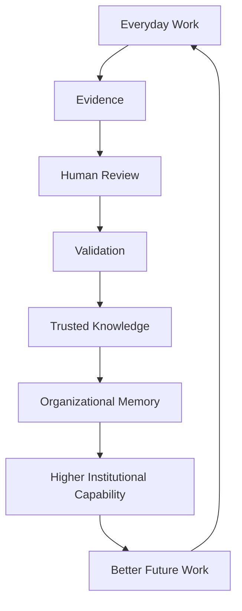
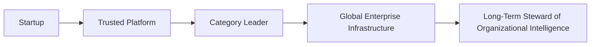
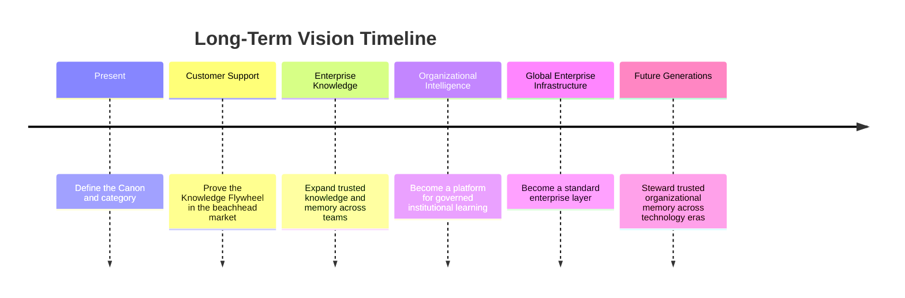

# Long-Term Vision

## Derived From

Canon Version: `v1.0.0`

### Primary Canon Documents

- [Founder's Thesis](../canon/00_FOUNDERS_THESIS.md)
- [Product Vision](../canon/01_PRODUCT_VISION.md)
- [Product Principles](../canon/02_PRODUCT_PRINCIPLES.md)
- [Capability Model](../canon/03_PRODUCT_CAPABILITY_MODEL.md)
- [Domain Model](../canon/04_PRODUCT_DOMAIN_MODEL.md)
- [Workflow Model](../canon/05_PRODUCT_WORKFLOW_MODEL.md)
- [AI Cognitive Model](../canon/06_AI_COGNITIVE_MODEL.md)

### Primary Architecture Documents

- [System Architecture](../architecture/07_SYSTEM_ARCHITECTURE.md)
- [AI Agent Architecture](../architecture/08_AI_AGENT_ARCHITECTURE.md)
- [Data Architecture](../architecture/09_DATA_ARCHITECTURE.md)
- [Knowledge Representation](../architecture/10_KNOWLEDGE_REPRESENTATION_MODEL.md)
- [Integration Architecture](../architecture/11_INTEGRATION_ARCHITECTURE.md)

### Primary Implementation Documents

- [MVP Scope](../implementation/12_MVP_SCOPE.md)
- [Implementation Architecture](../implementation/13_IMPLEMENTATION_ARCHITECTURE.md)
- [Technology Decisions](../implementation/14_TECHNOLOGY_DECISIONS.md)
- [API Architecture](../implementation/15_API_ARCHITECTURE.md)
- [Storage Architecture](../implementation/16_STORAGE_ARCHITECTURE.md)
- [Deployment Architecture](../implementation/17_DEPLOYMENT_ARCHITECTURE.md)
- [Security Architecture](../implementation/18_SECURITY_ARCHITECTURE.md)

### Primary Strategy Documents

- [Category Design](./00_CATEGORY_DESIGN.md)
- [Positioning](./01_POSITIONING.md)
- [Ideal Customer Profile](./02_IDEAL_CUSTOMER_PROFILE.md)
- [Go-to-Market Strategy](./03_GO_TO_MARKET.md)
- [Pricing Strategy](./04_PRICING_STRATEGY.md)
- [Business Model](./05_BUSINESS_MODEL.md)
- [Competitive Strategy](./06_COMPETITIVE_STRATEGY.md)
- [Growth Strategy](./07_GROWTH_STRATEGY.md)
- [Partnership Strategy](./08_PARTNERSHIP_STRATEGY.md)

---

Status: **Active**

## Primary Question

If the company succeeds beyond expectations over the next 20 years, what will the world look like because it exists?

This document defines the Long-Term Vision.

It is not a roadmap. It is not a financial projection. It is not a marketing document. It defines the future state the company is working toward and the lasting impact it intends to have on organizations, enterprise software, and human knowledge.

## 1. Executive Summary

The company's mission extends beyond building software.

Its purpose is to help organizations continuously transform experience into trusted institutional intelligence.

If the company succeeds over the next 20 years, organizations will no longer accept that valuable knowledge should disappear into tickets, conversations, employee memory, documents, meetings, or temporary AI responses. They will expect important work to create durable learning. They will expect evidence to be preserved, decisions to be explainable, AI to be governed, and institutional knowledge to compound over time.

The long-term vision is a world where organizations become measurably more capable because of the work they perform.

The company exists to help create that world.

## 2. Why This Future Matters

The current world wastes an enormous amount of institutional learning.

Organizations repeatedly lose knowledge. Expertise disappears when people leave. AI generates answers but rarely creates lasting organizational capability. Every generation of employees relearns the same lessons. Documentation decays. Decisions lose their evidence. Support teams answer the same questions. Public institutions lose continuity. Companies accumulate more tools while still forgetting what they know.

This cannot remain the normal way organizations operate.

The cost is not only inefficiency. It is weaker institutions.

When organizations forget, they make slower decisions, repeat mistakes, depend too heavily on a few experts, onboard people poorly, frustrate customers, and struggle to govern AI responsibly. As work becomes more complex and AI becomes more capable, the need for trusted organizational memory becomes more important, not less.

The future matters because organizations shape people's work, services, healthcare, education, public systems, and economic life. If organizations learn better, they can serve people better.

## Current State vs Needed Future

| Current State | Needed Future |
| --- | --- |
| Knowledge is fragmented across people and systems. | Knowledge becomes governed, searchable, reusable organizational memory. |
| AI answers questions but often leaves no institutional trace. | AI helps create reviewed, validated, explainable learning. |
| Experts repeat the same lessons. | Expert judgment becomes reusable institutional capability. |
| Documentation decays. | Knowledge evolves through real work and validation. |
| Decisions lose context. | Decisions remain connected to evidence, review, and policy. |
| Organizations relearn repeatedly. | Organizations compound learning over time. |

## 3. The Future We Imagine

We imagine a realistic future where organizations learn continuously from their own work.

In that future:

- Every important decision can contribute to organizational learning.
- Organizational Memory is treated as strategic infrastructure.
- AI and humans collaborate through governed workflows.
- Institutional knowledge compounds over decades.
- Organizations become measurably more capable every year.

This future is not science fiction. It does not require organizations to become fully autonomous or replace human judgment. It requires a disciplined shift in how work, evidence, knowledge, review, and memory are connected.

In this future, a difficult customer case is not only resolved. It becomes evidence. It produces learning. It may update knowledge. It may improve onboarding. It may prevent a future escalation. It may reveal a product issue. It may become part of institutional memory.

The same pattern can apply to IT incidents, HR policy interpretation, legal review, finance exceptions, compliance evidence, government casework, healthcare operations, and education administration.

The future we imagine is not one where AI knows everything.

It is one where organizations know what they have learned, why they trust it, and how to use it again.

## Vision Diagram

## 4. Organizational Intelligence as Enterprise Infrastructure

Organizational Intelligence Platforms can become a standard enterprise software layer alongside ERP, CRM, HR systems, ITSM, and collaboration platforms.

ERP helps organizations manage resources.

CRM helps organizations manage customer relationships.

HR systems help organizations manage people operations.

ITSM helps organizations manage technology services.

Collaboration platforms help people communicate.

Organizational Intelligence Platforms help organizations learn from work and preserve what they know.

## Enterprise Infrastructure Comparison

| Enterprise Layer | Primary Role |
| --- | --- |
| ERP | Manage resources, finance, operations, and enterprise processes. |
| CRM | Manage customer relationships, sales, and account history. |
| HR Systems | Manage people, roles, policies, and employee operations. |
| ITSM | Manage technology services, incidents, requests, and operational support. |
| Collaboration Platforms | Support communication, coordination, and everyday teamwork. |
| Organizational Intelligence Platform | Preserve evidence, knowledge, memory, governance, and learning across work. |

Organizations will eventually consider Organizational Intelligence essential infrastructure because memory, trust, and learning are not optional. They are required for durable performance.

An OIP does not need to replace existing systems. It becomes essential by connecting them into a learning layer.

## 5. The Evolution of Work

Work changes when organizations can reliably learn from it.

The future of work should include:

- Less repeated problem-solving.
- Faster onboarding.
- Better collaboration.
- Stronger institutional memory.
- Higher-quality decisions.
- Continuous organizational learning.

Humans and AI complement each other.

AI can observe patterns, summarize context, propose learning candidates, retrieve relevant knowledge, and assist reasoning. Humans provide judgment, ethics, context, accountability, creativity, and authority. Governance ensures that the outputs of this collaboration can be trusted.

## Human and AI Complementarity

| Human Strength | AI Strength | Governed Collaboration |
| --- | --- | --- |
| Judgment | Pattern recognition | AI proposes; humans validate. |
| Accountability | Scale | AI processes volume; humans govern consequences. |
| Context | Retrieval | AI assembles context; humans interpret meaning. |
| Ethics | Consistency | AI supports repeatability; humans set boundaries. |
| Expertise | Summarization | AI captures candidate learning; experts approve knowledge. |

The goal is not to remove people from work. The goal is to ensure their expertise becomes part of the organization's lasting capability.

## 6. The Evolution of AI

Over the next two decades, AI will become increasingly capable.

Models will improve. Some capabilities that once felt remarkable will become ordinary. Model access will broaden. Model switching will become easier. AI will be embedded in nearly every enterprise system.

As that happens, trust becomes the differentiator.

The question will not be whether an AI system can generate an answer. The question will be whether the organization can trust that answer, explain it, govern it, validate it, and preserve the learning it contains.

The company's philosophy is that AI should serve Organizational Intelligence.

AI is not the end state. It is an enabling technology within a broader system of evidence, human review, governance, knowledge, and memory.

## AI Evolution Framework

| AI Trend | Company Response |
| --- | --- |
| AI becomes more capable. | Use AI to support reasoning, retrieval, synthesis, and learning. |
| Models become commodities. | Compete on governed memory and trust, not model access. |
| Model switching becomes easier. | Preserve provider abstraction and customer control. |
| AI appears in every tool. | Position OIP as the layer that governs what organizations learn from AI-assisted work. |
| AI risks increase with adoption. | Make governance, explainability, and human review central. |
| Human judgment remains critical. | Treat humans as validators, stewards, and accountable decision-makers. |

## 7. Global Impact

The long-term societal impact of Organizational Intelligence should be practical and grounded.

The company will not solve every problem. It will not make institutions perfect. It will not remove the need for leadership, judgment, ethics, or policy.

But it can help organizations preserve what they learn.

Potential long-term impact includes:

- Businesses preserve knowledge across generations of employees.
- Public institutions retain institutional expertise.
- Healthcare organizations improve continuity of operational knowledge.
- Governments reduce knowledge loss across administrations and departments.
- Educational institutions preserve institutional learning.
- Support organizations stop solving the same problems without learning from them.
- Teams make decisions with better access to evidence and history.

## Global Impact Matrix

| Institution Type | Potential Impact |
| --- | --- |
| Businesses | Better continuity, onboarding, customer experience, and operational learning. |
| Public Institutions | Stronger institutional memory and less loss of expertise across staff changes. |
| Healthcare Organizations | Better continuity of administrative, operational, and policy knowledge. |
| Governments | Improved retention of casework knowledge, policy interpretation, and service learning. |
| Educational Institutions | Preserved administrative knowledge, student support learning, and institutional continuity. |
| Nonprofits | Better continuity despite resource constraints and staff turnover. |

The impact is meaningful because memory is meaningful. Institutions that remember better can serve better.

## 8. Company Evolution

The company should evolve through earned stages.

## Evolution Stages

| Stage | Meaning |
| --- | --- |
| Startup | Prove the problem, product, ICP, and Customer Support beachhead. |
| Trusted Platform | Become a reliable system customers trust with knowledge, evidence, review, and memory. |
| Category Leader | Define and lead the Organizational Intelligence Platform category through execution and customer proof. |
| Global Enterprise Infrastructure | Become a standard layer across enterprise systems, departments, and regions. |
| Long-Term Steward of Organizational Intelligence | Preserve the category's principles across generations of technology change. |

Leadership is earned through execution and customer trust.

The company should never assume that category language alone creates leadership. It must earn leadership by helping real organizations become more capable.

## 9. Guiding Principles for Future Generations

These principles should remain true even if technology changes completely.

## Protect Trust

Trust is the foundation of Organizational Intelligence.

Future teams should protect customer confidence in evidence, knowledge, memory, AI behavior, governance, security, and the company's judgment.

## Preserve Explainability

Organizations must be able to understand why knowledge is trusted, where it came from, who reviewed it, and how it changed.

Explainability should survive model changes, architecture changes, and product expansion.

## Value Human Judgment

Human judgment remains critical because organizations require accountability, context, ethics, and responsibility.

AI can assist. Humans govern.

## Learn Continuously

The company should embody the same learning principles it provides to customers.

It should learn from customers, mistakes, incidents, markets, partners, and technology changes.

## Build for Decades, Not Quarters

The company should make decisions that preserve trust, quality, and category leadership over the long term.

Short-term wins that weaken the Canon are not strategic wins.

## Earn Customer Confidence Every Day

Customer trust is not earned once.

It must be renewed through reliability, support, transparency, security, product quality, and ethical judgment.

## Technology Changes; Principles Endure

Programming languages, models, cloud providers, databases, user interfaces, and deployment patterns will change.

The principles of trust, memory, governance, explainability, human review, and learning should endure.

## 10. Vision Timeline

The vision unfolds through long-term stages.

## Timeline Interpretation

| Stage | Meaning |
| --- | --- |
| Present | Establish philosophy, category, architecture, and early implementation discipline. |
| Customer Support | Validate repeated work becoming governed memory. |
| Enterprise Knowledge | Expand knowledge governance and reuse across departments. |
| Organizational Intelligence | Support continuous learning across workflows, systems, and human-AI collaboration. |
| Global Enterprise Infrastructure | Become a trusted layer alongside ERP, CRM, HR, ITSM, and collaboration platforms. |
| Future Generations | Preserve the company's enduring purpose beyond current technologies. |

## 11. Legacy

If the company disappeared fifty years from now, the best legacy would not be that it built a clever application or used AI early.

The best legacy would be that it changed how organizations think about learning.

People might say:

- It helped enterprise software move beyond execution into learning.
- It made Organizational Memory a serious strategic asset.
- It showed that knowledge management could be active, governed, and connected to real work.
- It helped make AI adoption more accountable through evidence, review, and governance.
- It helped institutions preserve capability across generations of employees.
- It gave organizations a way to become more capable because of the work they already performed.

The desired legacy is not technological novelty.

It is institutional capability.

## 12. Vision Risks

Several risks could prevent this vision.

| Risk | How It Threatens the Vision | How Future Leaders Should Avoid It |
| --- | --- | --- |
| Losing Focus | The company becomes a generic AI or workflow vendor. | Keep Organizational Intelligence and the Canon central. |
| Chasing AI Trends | Strategy follows model novelty instead of institutional learning. | Treat AI as an amplifier, not the purpose. |
| Prioritizing Growth Over Trust | Customer confidence weakens as scale increases. | Grow only as fast as trust, governance, and quality can support. |
| Weak Governance | Knowledge and AI outputs become unreliable. | Preserve human review, validation, audit, and policy discipline. |
| Category Confusion | The market misunderstands the company as a chatbot, help desk, or automation tool. | Maintain category education and positioning clarity. |
| Short-Term Decision Making | Quarterly pressure weakens long-term principles. | Build for decades and protect the Canon. |
| Over-Centralizing AI Authority | Human expertise is devalued or bypassed. | Keep human judgment and accountability central. |
| Losing Customer Empathy | Product strategy drifts away from real organizational work. | Stay close to customers and operational reality. |

The vision will be protected by leaders who remember that the company exists to make organizations more capable, not merely to make software more intelligent.

## 13. Traceability Matrix

| Canon Concept | Long-Term Expression |
| --- | --- |
| Organizational Intelligence | Global enterprise infrastructure for institutional learning. |
| Knowledge Flywheel | Continuous institutional learning across decades of work. |
| Organizational Memory | Strategic enterprise asset that preserves capability over time. |
| Human Review | Trusted decision-making and accountable AI adoption. |
| Governance | Foundation of enterprise AI adoption and organizational trust. |
| Explainability | Enterprise accountability through evidence, provenance, and history. |
| Evidence | Basis for trusted knowledge and long-term institutional memory. |
| AI Cognitive Model | AI supports governed learning rather than replacing human authority. |
| Product Vision | Organizations become measurably smarter through work. |
| Architecture | Stable concepts survive changing technologies. |
| Implementation | Technology choices remain replaceable beneath enduring principles. |
| Category Design | Organizational Intelligence becomes a lasting enterprise software category. |
| Positioning | The company is remembered for institutional capability, not AI novelty. |
| Growth Strategy | Expansion reinforces trust, category leadership, and global capability. |
| Partnership Strategy | Ecosystem connects existing systems into a broader learning layer. |

## 14. What This Document Does NOT Define

This document intentionally excludes:

- Product roadmap.
- Implementation plans.
- Quarterly goals.
- Hiring strategy.
- Financial projections.
- Feature priorities.
- Detailed market-entry sequencing.
- Operational plans.
- Technical architecture changes.

Those evolve over time.

The vision should remain stable.

## 15. Closing

The company is not trying to build the smartest AI.

It is trying to help organizations become permanently smarter.

Technology will continue to evolve. Models will change. Programming languages will change. Cloud providers will change. Interfaces will change. Enterprise systems will change.

But organizations will always need trusted memory, governed learning, explainable decisions, and the ability to transform everyday work into lasting institutional capability.

That enduring purpose is the reason the company exists.

If future generations of employees, customers, investors, and partners remember only one thing, it should be this:

The work of the company is to help organizations learn from their own experience, preserve what matters, and become more capable over time.
