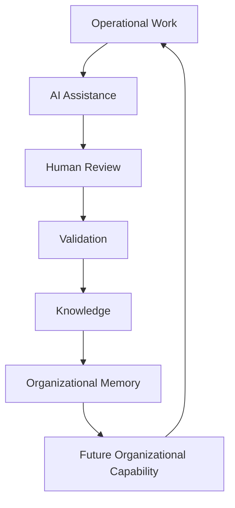
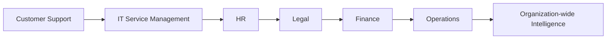

# Executive Summary

## Derived From

Canon Version: `v1.0.0`

### Primary Canon Documents

- [Founder's Thesis](../canon/00_FOUNDERS_THESIS.md)
- [Product Vision](../canon/01_PRODUCT_VISION.md)
- [Product Principles](../canon/02_PRODUCT_PRINCIPLES.md)
- [Capability Model](../canon/03_PRODUCT_CAPABILITY_MODEL.md)
- [Domain Model](../canon/04_PRODUCT_DOMAIN_MODEL.md)
- [Workflow Model](../canon/05_PRODUCT_WORKFLOW_MODEL.md)
- [AI Cognitive Model](../canon/06_AI_COGNITIVE_MODEL.md)

### Primary Architecture Documents

- [System Architecture](../architecture/07_SYSTEM_ARCHITECTURE.md)
- [AI Agent Architecture](../architecture/08_AI_AGENT_ARCHITECTURE.md)
- [Data Architecture](../architecture/09_DATA_ARCHITECTURE.md)
- [Knowledge Representation](../architecture/10_KNOWLEDGE_REPRESENTATION_MODEL.md)
- [Integration Architecture](../architecture/11_INTEGRATION_ARCHITECTURE.md)

### Primary Implementation Documents

- [MVP Scope](../implementation/12_MVP_SCOPE.md)
- [Implementation Architecture](../implementation/13_IMPLEMENTATION_ARCHITECTURE.md)
- [Technology Decisions](../implementation/14_TECHNOLOGY_DECISIONS.md)
- [API Architecture](../implementation/15_API_ARCHITECTURE.md)
- [Storage Architecture](../implementation/16_STORAGE_ARCHITECTURE.md)
- [Deployment Architecture](../implementation/17_DEPLOYMENT_ARCHITECTURE.md)
- [Security Architecture](../implementation/18_SECURITY_ARCHITECTURE.md)

### Primary Strategy Documents

- [Category Design](./00_CATEGORY_DESIGN.md)
- [Positioning](./01_POSITIONING.md)
- [Ideal Customer Profile](./02_IDEAL_CUSTOMER_PROFILE.md)
- [Go-to-Market Strategy](./03_GO_TO_MARKET.md)
- [Pricing Strategy](./04_PRICING_STRATEGY.md)
- [Business Model](./05_BUSINESS_MODEL.md)
- [Competitive Strategy](./06_COMPETITIVE_STRATEGY.md)
- [Growth Strategy](./07_GROWTH_STRATEGY.md)
- [Partnership Strategy](./08_PARTNERSHIP_STRATEGY.md)
- [Long-Term Vision](./09_LONG_TERM_VISION.md)

---

Status: **Active**

## Primary Question

If an executive, investor, advisor, or future employee had only 20 minutes to understand this company, what should they know?

This document is the Executive Summary of the entire repository.

It introduces no new concepts. Its purpose is to synthesize everything into one coherent narrative.

## 1. Executive Overview

The company is building an **Organizational Intelligence Platform**: a software platform that transforms everyday operational work into trusted organizational capability.

The core idea is simple.

Organizations generate knowledge every day, but very little of that knowledge becomes permanent institutional memory. Support cases, customer conversations, internal escalations, decisions, reviews, policies, and expert corrections all contain learning. Too often, that learning disappears into tickets, chats, documents, meetings, or individual memory.

The company exists to change that.

It is not building another AI chatbot, help desk, CRM, knowledge base, or automation tool. It is building the platform layer that helps organizations learn from work, preserve what matters, govern what becomes knowledge, and reuse that knowledge in future decisions.

## Why Now

AI has made it possible to observe, summarize, reason over, and extract learning from large volumes of organizational work. At the same time, AI has also made trust, governance, evidence, and human review more important. Organizations do not merely need more answers. They need trusted knowledge that survives beyond a single AI interaction.

## Why It Matters

Organizations that preserve learning become more capable over time. Organizations that fail to preserve learning continuously relearn what they already knew.

The company is built around the belief that the next major enterprise software category will not only help organizations execute work. It will help them become measurably smarter because of the work they perform.

## Company Summary Table

| Question | Summary |
| --- | --- |
| What are we building? | An Organizational Intelligence Platform. |
| What problem do we solve? | Organizations lose valuable knowledge and repeatedly relearn the same lessons. |
| Who adopts first? | Knowledge-intensive Customer Support organizations with repeated questions, historical case data, and human review culture. |
| Why now? | AI can accelerate learning, but enterprises need governance, memory, and trust. |
| What is the long-term ambition? | Establish Organizational Intelligence as a foundational enterprise software layer. |

## 2. The Problem

The core problem is **Organizational Entropy**.

Organizational Entropy is the natural decay of institutional knowledge, context, memory, and decision quality as work spreads across people, systems, time, and tools.

It appears in familiar ways:

- Knowledge leaves when employees leave.
- Experts repeatedly answer the same questions.
- Documentation becomes outdated.
- Customer support solves recurring problems without permanently improving future work.
- AI assistants answer questions but rarely create durable organizational capability.
- Decisions lose their evidence and rationale.
- New employees relearn lessons the organization already paid to learn.

This is not only a productivity problem. It is an institutional capability problem.

The larger and more complex an organization becomes, the more difficult it is to preserve what it learns. More tools do not automatically solve the issue. In many cases, they create more places where knowledge can fragment.

## 3. The Solution

The solution is an Organizational Intelligence Platform.

An Organizational Intelligence Platform transforms operational work into governed organizational knowledge, enabling institutions to become progressively more capable through every validated decision.

The platform does this by connecting:

- Work.
- Evidence.
- AI assistance.
- Human review.
- Validation.
- Knowledge.
- Organizational Memory.
- Governance.

The result is not merely faster work. The result is work that compounds.

When a support case is resolved, the platform can help identify whether the case contains reusable learning. When an expert corrects an answer, that judgment can become part of trusted knowledge. When knowledge changes, the platform can preserve history. When future problems appear, the organization can reuse what it has already learned.

The platform's purpose is to help everyday work become lasting institutional capability.

## 4. Why This Category Exists

Existing software categories solve important problems, but they do not fully solve Organizational Entropy.

Help desk platforms manage tickets. CRM systems manage customer relationships. Knowledge bases store articles. Enterprise search finds information. AI chatbots answer questions. AI agents execute tasks. Workflow automation moves work through processes.

These categories are useful. They are also incomplete.

They help organizations execute, retrieve, automate, or communicate. They do not consistently help organizations convert work into governed memory.

The Organizational Intelligence Platform category exists because organizations need a new enterprise layer: one that turns operational experience into trusted institutional learning.

| Existing Category | Primary Role | OIP Difference |
| --- | --- | --- |
| Help Desk | Manage support work. | Learns from support work. |
| CRM | Manage customer relationships. | Preserves knowledge created through customer interactions. |
| Knowledge Base | Stores curated documentation. | Evolves knowledge through validated work. |
| Enterprise Search | Finds existing information. | Governs what becomes trusted knowledge. |
| AI Chatbot | Answers questions. | Converts useful learning into memory. |
| AI Agent | Executes tasks. | Ensures task outcomes can become governed knowledge. |
| Workflow Automation | Moves work through process. | Learns from workflow outcomes. |

The category is defined by the organizational problem it solves, not by the technology it uses.

## 5. How the Platform Works

At the highest level, the platform follows the Knowledge Flywheel.

The sequence is:

1. Operational work creates evidence and context.
2. AI assists with reasoning, summarization, retrieval, and learning candidates.
3. Humans review, correct, approve, or reject.
4. Validation separates reusable knowledge from noise.
5. Knowledge becomes governed and reusable.
6. Organizational Memory preserves history and institutional learning.
7. Future work becomes faster, better, and more consistent.

This mechanism is why the platform compounds value. Every validated decision can improve future decisions.

## 6. Customer Strategy

The company is positioned as the platform that enables organizations to continuously increase institutional capability through governed learning.

The initial Ideal Customer Profile is a mid-market to lower-enterprise organization with a high-volume Customer Support function, recurring customer questions, experienced reviewers, fragmented knowledge, and leadership interest in trusted AI adoption.

The first market is Customer Support because it has:

- High case volume.
- Repetitive problems.
- Existing knowledge assets.
- Measurable ROI.
- Human review practices.
- Historical data.
- Immediate value from knowledge reuse.

The company begins Indonesia-first because local proximity, market understanding, customer accessibility, purchasing-power aligned pricing, and founder-led learning create the fastest path to category validation.

Expansion proceeds from Customer Support into adjacent knowledge-intensive functions:

The customer strategy is focused first, expansive later.

## 7. Business Strategy

The business creates value by helping customers become more capable. It captures value as customers adopt the platform more deeply, preserve more organizational memory, expand across more teams, and trust the platform with more governed knowledge workflows.

## Pricing Philosophy

Pricing should reflect organizational capability, not AI consumption. The company should use Purchasing Power Aligned Pricing in early regional markets, especially Indonesia, and evolve toward value-based enterprise pricing as customer value and category maturity grow.

## Business Model

The business model is based on recurring revenue, expansion revenue, enterprise capabilities, premium support, governance needs, implementation support, and future platform services. Revenue should diversify as the platform matures, but software and platform value remain central.

## Go-to-Market

The GTM strategy begins with education, design partners, founder-led sales, and focused Customer Support adoption. The company should validate before scaling.

## Growth Strategy

Growth should move from Indonesia to Southeast Asia, Asia-Pacific, global enterprise markets, and category leadership. Growth should reinforce trust and category clarity.

## Partnership Strategy

Partnerships should help the platform become the intelligence layer across existing enterprise systems. The company should integrate rather than replace, while preserving strategic independence.

## Business Strategy Summary

| Strategy Area | Core Idea |
| --- | --- |
| Pricing | Price organizational capability, not AI usage. |
| Business Model | Capture fair value as customers become more capable. |
| GTM | Educate, validate, and build trust before scaling. |
| Growth | Expand trust before expanding scale. |
| Partnerships | Connect enterprise systems into a broader intelligence layer. |

## 8. Competitive Advantage

The company's durable competitive advantage does not come from access to better AI models.

AI models will improve for everyone. Infrastructure will become more available. Basic chat, summaries, retrieval, and automation will be copied.

The durable moats are:

- Organizational Memory.
- Knowledge Flywheel.
- Governance.
- Human Review.
- Explainability.
- Category Leadership.
- Customer Trust.

These advantages compound over time.

As customers use the platform, they accumulate validated knowledge, evidence, review history, governance history, workflow adoption, and institutional trust. A competitor can copy an interface faster than it can copy a customer's history of learning.

## Competitive Advantage Framework

| Advantage | Why It Compounds |
| --- | --- |
| Organizational Memory | Grows uniquely from each customer's work and decisions. |
| Knowledge Flywheel | More validated work improves future work. |
| Governance | Policy, audit, and approval history become embedded in operations. |
| Human Review | Expert judgment becomes trusted knowledge. |
| Explainability | Evidence and provenance strengthen enterprise trust. |
| Category Leadership | The company shapes how the market understands the problem. |
| Customer Trust | Trust deepens through reliable, governed outcomes. |

## 9. Long-Term Vision

The long-term vision is that Organizational Intelligence becomes a standard enterprise software category alongside ERP, CRM, HR systems, ITSM, and collaboration platforms.

ERP helps organizations manage resources.

CRM helps organizations manage customer relationships.

HR systems help organizations manage people operations.

Organizational Intelligence Platforms help organizations manage institutional learning.

If the company succeeds over decades, organizations will expect important work to create memory. They will expect AI-assisted work to be governed. They will expect knowledge to be explainable. They will expect institutional capability to improve over time.

The company is not trying to build the smartest AI.

It is trying to help organizations become permanently smarter.

## 10. Strategic Principles

The most important principles are:

| Principle | Meaning |
| --- | --- |
| AI Serves Organizational Intelligence | AI is an amplifier of learning, not the product itself. |
| Humans Remain Accountable | Human review, judgment, and governance remain central. |
| Trust Before Automation | Automation must not bypass evidence, validation, or policy. |
| Governance by Design | Trust is built into workflows, APIs, storage, security, and strategy. |
| Learn Continuously | The company and customers should improve through experience. |
| Build for Decades | Short-term choices should not weaken long-term trust or category leadership. |
| Preserve Explainability | Knowledge must remain connected to evidence, history, and decisions. |
| Technology Is Replaceable | Canon concepts endure beyond models, frameworks, providers, or infrastructure. |

These principles should guide product, engineering, GTM, partnerships, pricing, hiring, and executive decision-making.

## 11. Why This Company Wins

The company can become the category leader because it combines philosophy, architecture, execution, ecosystem strategy, customer trust, and long-term thinking.

## Philosophy

The company is built around a clear belief: organizations should become more capable because of the work they perform.

## Architecture

The platform architecture preserves boundaries between domain concepts, AI, data, knowledge, integrations, APIs, storage, deployment, and security. This gives the company a credible foundation for enterprise trust.

## Execution

The strategy begins with a focused beachhead, design partners, Customer Support, Indonesia-first validation, and measurable learning outcomes.

## Ecosystem

The company integrates with existing enterprise software rather than trying to replace everything. This makes the platform more useful and less disruptive.

## Customer Trust

The company competes on governed memory, human review, explainability, and security. Trust becomes the basis of retention and expansion.

## Long-Term Thinking

The company is designed around category leadership, not short-term AI trends.

It wins if it consistently makes the category real for customers.

## 12. Key Strategic Milestones

The strategic journey is:

```mermaid
flowchart LR
    Category["Category Design"]
    Validation["Product Validation"]
    Partners["Design Partners"]
    PMF["Product-Market Fit"]
    Indonesia["Indonesia Leadership"]
    SEA["Southeast Asia"]
    Global["Global Enterprise"]
    Leadership["Category Leadership"]

    Category --> Validation
    Validation --> Partners
    Partners --> PMF
    PMF --> Indonesia
    Indonesia --> SEA
    SEA --> Global
    Global --> Leadership
```

## Milestone Summary

| Milestone | Meaning |
| --- | --- |
| Category Design | Define Organizational Intelligence Platform and Organizational Entropy. |
| Product Validation | Prove the platform can convert operational work into governed memory. |
| Design Partners | Learn from high-fit early customers and validate real workflows. |
| Product-Market Fit | Demonstrate retention, knowledge reuse, expansion, and references in Customer Support. |
| Indonesia Leadership | Establish local proof, trust, and category understanding. |
| Southeast Asia | Expand regionally with localization and partners. |
| Global Enterprise | Enter mature enterprise markets with governance, security, and references. |
| Category Leadership | Become a defining company for Organizational Intelligence Platforms. |

## 13. Repository Overview

This repository is organized as a long-term company and product knowledge system.

| Section | Purpose |
| --- | --- |
| [Canon](../canon/README.md) | Defines the foundational philosophy, product identity, principles, capability model, domain model, workflow model, and AI cognitive model. |
| [Architecture](../architecture/README.md) | Defines the logical system architecture, AI agent architecture, data architecture, knowledge representation, and integration architecture. |
| [Implementation](../implementation/README.md) | Defines the MVP scope and concrete implementation architecture, technology decisions, APIs, storage, deployment, and security. |
| [Strategy](./README.md) | Defines category design, positioning, ICP, GTM, pricing, business model, competition, growth, partnerships, long-term vision, and this executive synthesis. |
| [Product](../product/README.md) | Reserved for future product documents, specifications, and product management artifacts. |
| [Research](../research/README.md) | Reserved for research, evidence, experiments, market analysis, and learning artifacts. |
| [Roadmap](../roadmap/README.md) | Reserved for sequencing, milestones, future planning, and execution roadmaps. |

The repository is intentionally structured so future documents derive from the Canon rather than redefine it.

## 14. Executive Takeaways

- The company creates a new enterprise software category: Organizational Intelligence Platform.
- The core problem is Organizational Entropy: organizations repeatedly lose valuable knowledge.
- Organizational Intelligence is the strategic asset.
- AI is an enabling technology, not the product.
- The platform turns work into evidence, validated knowledge, and organizational memory.
- Human review is a trust mechanism, not a bottleneck.
- Governance makes AI adoption enterprise-ready.
- Customer Support is the first beachhead because repeated work and measurable value are visible there.
- Indonesia is the first market because it provides proximity, affordability, and fast learning.
- Pricing should reflect organizational capability, not AI consumption.
- Trust compounds.
- Knowledge compounds.
- Customer capability compounds.
- Durable advantage comes from memory, governance, explainability, workflow adoption, and category leadership.
- Long-term thinking guides every decision.

## 15. Closing Message

To future founders, employees, customers, investors, advisors, and partners:

Technology will continue to evolve.

The company's purpose will not.

Models will change. Programming languages will change. Cloud providers will change. Interfaces will change. Enterprise systems will change. The market language around AI will change many times.

But organizations will always need to learn from experience. They will always need trusted memory, governed knowledge, explainable decisions, and the ability to preserve what matters beyond individual people and temporary tools.

This company exists to help organizations transform everyday work into trusted institutional intelligence that compounds over generations.

The memorable identity is this:

> We help organizations become permanently smarter from the work they already do.
